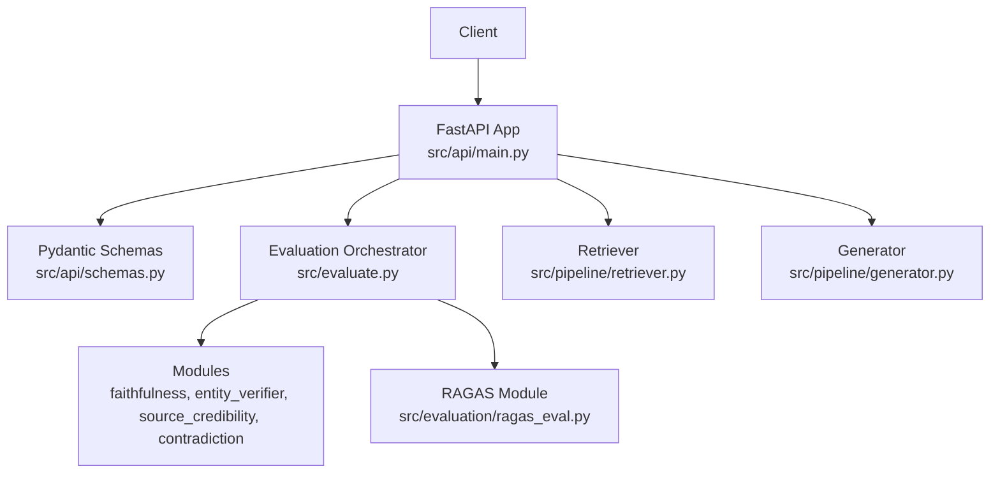
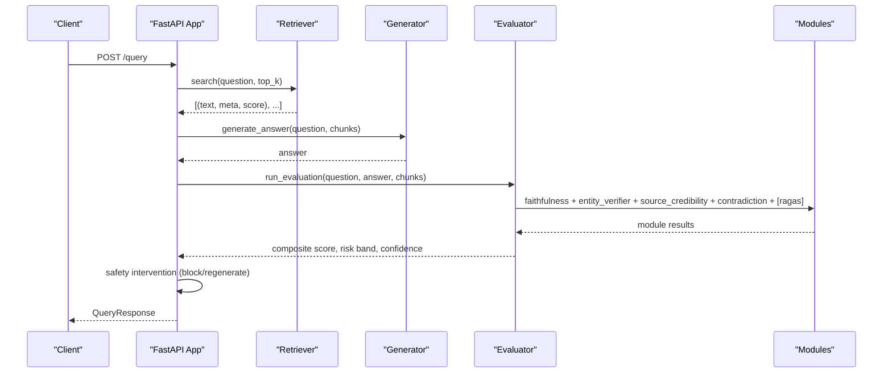
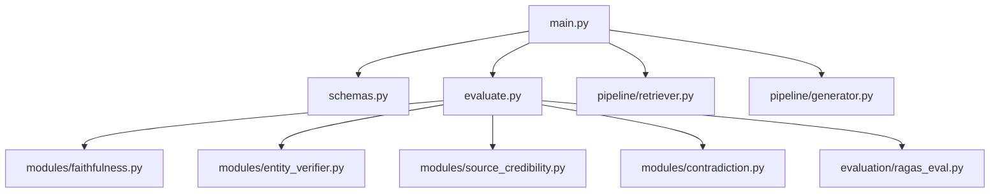
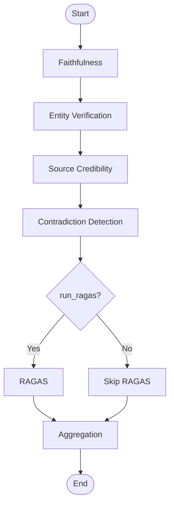

# API Reference

<cite>
**Referenced Files in This Document**
- [main.py](file://Backend/src/api/main.py)
- [schemas.py](file://Backend/src/api/schemas.py)
- [evaluate.py](file://Backend/src/evaluate.py)
- [retriever.py](file://Backend/src/pipeline/retriever.py)
- [generator.py](file://Backend/src/pipeline/generator.py)
- [ragas_eval.py](file://Backend/src/evaluation/ragas_eval.py)
- [faithfulness.py](file://Backend/src/modules/faithfulness.py)
- [entity_verifier.py](file://Backend/src/modules/entity_verifier.py)
- [source_credibility.py](file://Backend/src/modules/source_credibility.py)
- [contradiction.py](file://Backend/src/modules/contradiction.py)
- [config.yaml](file://Backend/config.yaml)
</cite>

## Table of Contents
1. [Introduction](#introduction)
2. [Project Structure](#project-structure)
3. [Core Components](#core-components)
4. [Architecture Overview](#architecture-overview)
5. [Detailed Component Analysis](#detailed-component-analysis)
6. [Dependency Analysis](#dependency-analysis)
7. [Performance Considerations](#performance-considerations)
8. [Troubleshooting Guide](#troubleshooting-guide)
9. [Conclusion](#conclusion)
10. [Appendices](#appendices)

## Introduction
This document provides comprehensive API documentation for the MediRAG 3.0 FastAPI application. It covers all REST endpoints, request/response schemas, authentication requirements, error handling, rate limiting considerations, versioning, and operational guidance for integrating with external healthcare systems. It also details the evaluation pipeline, safety interventions, and administrative endpoints for ingestion and dashboard analytics.

## Project Structure
The API surface is implemented in a single FastAPI application module with supporting schemas and evaluation orchestration. The evaluation pipeline integrates four modules and optionally RAGAS, while the end-to-end query pipeline adds retrieval and generation.

**Diagram sources**
- [main.py:156-173](file://Backend/src/api/main.py#L156-L173)
- [schemas.py:1-232](file://Backend/src/api/schemas.py#L1-L232)
- [evaluate.py:49-167](file://Backend/src/evaluate.py#L49-L167)
- [retriever.py:39-250](file://Backend/src/pipeline/retriever.py#L39-L250)
- [generator.py:344-461](file://Backend/src/pipeline/generator.py#L344-L461)
- [ragas_eval.py:81-177](file://Backend/src/evaluation/ragas_eval.py#L81-L177)

**Section sources**
- [main.py:156-173](file://Backend/src/api/main.py#L156-L173)
- [schemas.py:1-232](file://Backend/src/api/schemas.py#L1-L232)

## Core Components
- FastAPI application with CORS enabled for development and health/lifecycle endpoints.
- Evaluation pipeline orchestrator that runs faithfulness, entity verification, source credibility, contradiction detection, optional RAGAS, and aggregation.
- End-to-end query pipeline that retrieves context, generates an answer, evaluates it, applies safety interventions, and returns enriched results.
- Administrative endpoints for ingestion, parsing files, and dashboard analytics.

Key capabilities:
- Health checks and dependency probing.
- Safety-aware evaluation with risk bands and confidence levels.
- Audit logging for compliance and monitoring.
- Optional RAGAS scoring when an LLM backend is available.

**Section sources**
- [main.py:206-302](file://Backend/src/api/main.py#L206-L302)
- [evaluate.py:49-167](file://Backend/src/evaluate.py#L49-L167)
- [schemas.py:96-140](file://Backend/src/api/schemas.py#L96-L140)

## Architecture Overview
The API exposes five primary endpoints:
- GET /health: Liveness and dependency status.
- POST /evaluate: Evaluate a question-answer-context triple.
- POST /query: End-to-end pipeline with retrieval, generation, and evaluation.
- POST /ingest: Dynamically append documents to FAISS/BM25.
- GET /logs and GET /stats: Dashboard analytics.

**Diagram sources**
- [main.py:308-519](file://Backend/src/api/main.py#L308-L519)
- [retriever.py:149-250](file://Backend/src/pipeline/retriever.py#L149-L250)
- [generator.py:344-412](file://Backend/src/pipeline/generator.py#L344-L412)
- [evaluate.py:49-167](file://Backend/src/evaluate.py#L49-L167)

## Detailed Component Analysis

### Endpoint: GET /health
- Method: GET
- Path: /health
- Response model: HealthResponse
- Description: Liveness probe returning service status and Ollama availability indicator.
- Authentication: Not required.
- Notes: Always returns HTTP 200; consumers decide how to interpret ollama_available.

Response fields:
- status: String, default "ok".
- ollama_available: Boolean indicating remote LLM backend reachability.
- version: String, default "0.1.0".

**Section sources**
- [main.py:206-217](file://Backend/src/api/main.py#L206-L217)
- [schemas.py:135-139](file://Backend/src/api/schemas.py#L135-L139)

### Endpoint: POST /evaluate
- Method: POST
- Path: /evaluate
- Request model: EvaluateRequest
- Response model: EvaluateResponse
- Description: Validates inputs and runs the evaluation pipeline. Optionally includes RAGAS if an LLM backend is available.
- Authentication: Not required.
- Validation: Pydantic validation errors return HTTP 422 automatically.

Request fields:
- question: String, length limits enforced by schema.
- answer: String, length limits enforced by schema.
- context_chunks: Array of ContextChunk, length limits enforced by schema.
- run_ragas: Boolean, default false.
- llm_provider, llm_api_key, llm_model, rxnorm_cache_path: Optional provider overrides and cache path.

Response fields:
- composite_score: Float in [0, 1].
- hrs: Integer in [0, 100], derived from composite_score.
- confidence_level: String among HIGH, MODERATE, LOW.
- risk_band: String among LOW, MODERATE, HIGH, CRITICAL.
- module_results: ModuleResults with per-module ModuleScore entries.
- total_pipeline_ms: Integer wall-clock time in milliseconds.

Safety and auditing:
- Audit log entry written with endpoint name, question, answer, HRS, risk band, composite score, latency, intervention flag, and details.

**Section sources**
- [main.py:223-302](file://Backend/src/api/main.py#L223-L302)
- [schemas.py:41-83](file://Backend/src/api/schemas.py#L41-L83)
- [schemas.py:113-133](file://Backend/src/api/schemas.py#L113-L133)

### Endpoint: POST /query
- Method: POST
- Path: /query
- Request model: QueryRequest
- Response model: QueryResponse
- Description: End-to-end pipeline: retrieval, generation, evaluation, safety intervention, and response assembly.
- Authentication: Not required.
- Prerequisites: Ollama must be available for generation; otherwise returns HTTP 503.

Request fields:
- question: String, length limits enforced by schema.
- top_k: Integer in [1, 10], default 5.
- run_ragas: Boolean, default false.
- llm_provider, llm_api_key, llm_model, ollama_url: Optional per-request provider overrides.
- inject_hallucination: Optional string for demonstration of intervention.

Response fields:
- question, generated_answer, retrieved_chunks: As provided.
- Evaluation fields: Same as EvaluateResponse.
- Intervention fields: intervention_applied, intervention_reason, original_answer, intervention_details.

Safety intervention logic:
- If HRS ≥ 86: block response and return a standardized message; intervention_applied true.
- If HRS ≥ 40 or faithfulness < 1.0: regenerate with a strict prompt, re-evaluate, and adjust response accordingly; intervention_applied true.

Audit logging includes intervention reason and original answer when applicable.

**Section sources**
- [main.py:308-519](file://Backend/src/api/main.py#L308-L519)
- [schemas.py:146-188](file://Backend/src/api/schemas.py#L146-L188)
- [schemas.py:202-230](file://Backend/src/api/schemas.py#L202-L230)

### Endpoint: POST /ingest
- Method: POST
- Path: /ingest
- Request model: IngestRequest
- Response: JSON object with status, chunks_added, and title.
- Description: Dynamically appends a custom document to FAISS and rebuilds BM25 atomically.
- Authentication: Not required.
- Concurrency: Thread-safe via a lock to prevent index corruption.

Request fields:
- title: String.
- text: String, minimum length enforced by schema.
- pub_type, source: Strings with defaults suitable for custom uploads.

Behavior:
- Validates retriever readiness; returns HTTP 503 if not warmed.
- Chunks text, encodes with the shared model, updates in-memory index and metadata, then writes atomically to disk.
- Rebuilds BM25 index for the running instance.

**Section sources**
- [main.py:526-603](file://Backend/src/api/main.py#L526-L603)
- [schemas.py:15-21](file://Backend/src/api/schemas.py#L15-L21)

### Endpoint: POST /parse_file
- Method: POST
- Path: /parse_file
- Request: Form-encoded multipart file upload.
- Response: JSON with status and extracted text.
- Description: Parses TXT, MD, PDF, and DOCX files into plain text.
- Authentication: Not required.

**Section sources**
- [main.py:653-677](file://Backend/src/api/main.py#L653-L677)

### Endpoint: GET /logs
- Method: GET
- Path: /logs
- Query parameter: limit (integer, default 50).
- Response: Array of audit log records.
- Description: Returns recent audit events ordered by ID descending.
- Authentication: Not required.

**Section sources**
- [main.py:608-619](file://Backend/src/api/main.py#L608-L619)

### Endpoint: GET /stats
- Method: GET
- Path: /stats
- Response: JSON with aggregated metrics.
- Description: Provides total evaluations, average HRS, critical alerts, interventions, and monthly averages.
- Authentication: Not required.

**Section sources**
- [main.py:621-648](file://Backend/src/api/main.py#L621-L648)

## Dependency Analysis
- FastAPI app depends on Pydantic schemas for request/response validation.
- Evaluation orchestrator composes four modules and optionally RAGAS.
- Retrieval uses FAISS and BM25 with hybrid reciprocal rank fusion.
- Generation supports multiple providers (Gemini, OpenAI, Ollama, Mistral) with per-request overrides.
- Audit logging persists to SQLite for dashboard analytics.

**Diagram sources**
- [main.py:34-49](file://Backend/src/api/main.py#L34-L49)
- [evaluate.py:34-40](file://Backend/src/evaluate.py#L34-L40)
- [ragas_eval.py:26-74](file://Backend/src/evaluation/ragas_eval.py#L26-L74)

**Section sources**
- [main.py:34-49](file://Backend/src/api/main.py#L34-L49)
- [evaluate.py:34-40](file://Backend/src/evaluate.py#L34-L40)

## Performance Considerations
- Warm-up: The app preloads models during startup to avoid cold-start latency for the first request.
- Retrieval: FAISS and BM25 are lazily loaded; the first search may incur initialization overhead.
- Generation: Provider selection and timeouts are configurable; adjust llm.timeout_seconds and provider settings for throughput.
- Evaluation: Module batching and thresholds bound computational cost; RAGAS is optional and slower.
- Bulk ingestion: Use POST /ingest with thread-safe concurrency; ensure FAISS/BM25 are rebuilt after large batches.

[No sources needed since this section provides general guidance]

## Troubleshooting Guide
Common issues and resolutions:
- Ollama not reachable: GET /health indicates ollama_available false; start Ollama or configure llm.base_url.
- FAISS index missing: POST /query or POST /ingest may fail with file-not-found errors; build the index first.
- Empty or invalid inputs: Pydantic validation returns HTTP 422; ensure question, answer, and context_chunks meet schema constraints.
- LLM provider errors: Generation failures raise runtime errors; verify API keys and model availability.
- Safety intervention: Responses may be blocked or regenerated when HRS exceeds thresholds; inspect intervention fields in QueryResponse.

Audit logging:
- All requests are recorded in data/logs.db with timestamp, endpoint, question, answer, HRS, risk band, composite score, latency, intervention flag, and details. Use GET /logs and GET /stats for diagnostics.

**Section sources**
- [main.py:179-185](file://Backend/src/api/main.py#L179-L185)
- [main.py:336-343](file://Backend/src/api/main.py#L336-L343)
- [main.py:537-540](file://Backend/src/api/main.py#L537-L540)
- [main.py:608-648](file://Backend/src/api/main.py#L608-L648)

## Conclusion
MediRAG 3.0’s API provides a robust evaluation and retrieval-augmented generation service with strong safety controls and auditability. By leveraging modular evaluation, optional RAGAS scoring, and atomic ingestion, it supports secure, traceable, and scalable deployments in healthcare environments.

[No sources needed since this section summarizes without analyzing specific files]

## Appendices

### API Definitions

- Base URL: http://host:port
- Version: 0.1.0
- Host/Port defaults: See config.yaml api.host and api.port.

Endpoints summary:
- GET /health
- POST /evaluate
- POST /query
- POST /ingest
- POST /parse_file
- GET /logs
- GET /stats

Authentication:
- Not required for the documented endpoints.

Rate limiting:
- Not implemented at the API layer. Apply upstream controls as needed.

Security considerations:
- Input validation is enforced by Pydantic schemas.
- Audit logs capture sensitive fields; protect data-at-rest and in-transit.
- Safety interventions can block or regenerate unsafe responses.

**Section sources**
- [config.yaml:54-65](file://Backend/config.yaml#L54-L65)
- [main.py:156-165](file://Backend/src/api/main.py#L156-L165)

### Data Models

#### EvaluateRequest
- question: String (5–500 chars)
- answer: String (1–2000 chars)
- context_chunks: Array of ContextChunk (1–10 items)
- run_ragas: Boolean
- llm_provider: Optional string
- llm_api_key: Optional string
- llm_model: Optional string
- rxnorm_cache_path: String

#### ContextChunk
- text: String (1–2000 chars)
- chunk_id: Optional string
- pub_type: Optional string
- pub_year: Optional integer
- source: Optional string
- title: Optional string
- tier_type: Optional string
- score: Optional float

#### EvaluateResponse
- composite_score: Float [0, 1]
- hrs: Integer [0, 100]
- confidence_level: String
- risk_band: String
- module_results: ModuleResults
- total_pipeline_ms: Integer

#### ModuleResults
- faithfulness: Optional ModuleScore
- entity_verifier: Optional ModuleScore
- source_credibility: Optional ModuleScore
- contradiction: Optional ModuleScore
- ragas: Optional ModuleScore

#### ModuleScore
- score: Float [0, 1]
- details: Dict
- error: Optional string
- latency_ms: Optional integer

#### HealthResponse
- status: String
- ollama_available: Boolean
- version: String

#### QueryRequest
- question: String (5–500 chars)
- top_k: Integer [1, 10]
- run_ragas: Boolean
- llm_provider: Optional string
- llm_api_key: Optional string
- llm_model: Optional string
- ollama_url: Optional string
- inject_hallucination: Optional string

#### RetrievedChunk
- chunk_id: Optional string
- text: String
- source: Optional string
- pub_type: Optional string
- pub_year: Optional integer
- title: Optional string
- similarity_score: Optional float

#### QueryResponse
- question: String
- generated_answer: String
- retrieved_chunks: Array of RetrievedChunk
- composite_score: Float [0, 1]
- hrs: Integer [0, 100]
- confidence_level: String
- risk_band: String
- module_results: ModuleResults
- total_pipeline_ms: Integer
- intervention_applied: Boolean
- intervention_reason: Optional string
- original_answer: Optional string
- intervention_details: Optional Dict

#### IngestRequest
- title: String
- text: String (min length 10)
- pub_type: String
- source: String

**Section sources**
- [schemas.py:41-83](file://Backend/src/api/schemas.py#L41-L83)
- [schemas.py:27-39](file://Backend/src/api/schemas.py#L27-L39)
- [schemas.py:113-133](file://Backend/src/api/schemas.py#L113-L133)
- [schemas.py:104-111](file://Backend/src/api/schemas.py#L104-L111)
- [schemas.py:96-102](file://Backend/src/api/schemas.py#L96-L102)
- [schemas.py:135-139](file://Backend/src/api/schemas.py#L135-L139)
- [schemas.py:146-188](file://Backend/src/api/schemas.py#L146-L188)
- [schemas.py:191-200](file://Backend/src/api/schemas.py#L191-L200)
- [schemas.py:202-230](file://Backend/src/api/schemas.py#L202-L230)
- [schemas.py:15-21](file://Backend/src/api/schemas.py#L15-L21)

### Evaluation Pipeline Details

**Diagram sources**
- [evaluate.py:88-147](file://Backend/src/evaluate.py#L88-L147)

**Section sources**
- [evaluate.py:49-167](file://Backend/src/evaluate.py#L49-L167)

### Example Workflows

- Safety evaluation request:
  - Send POST /evaluate with question, answer, and context_chunks.
  - Review EvaluateResponse for composite_score, hrs, risk_band, and module_results.

- End-to-end query:
  - Send POST /query with question and optional overrides.
  - Receive QueryResponse with generated_answer, retrieved_chunks, and safety intervention details.

- Document upload:
  - Use POST /parse_file to extract text from PDF/DOCX/TXT/MD.
  - Use POST /ingest to add the document to FAISS/BM25.

- Dashboard analytics:
  - Use GET /logs to retrieve recent audit events.
  - Use GET /stats to get aggregated metrics.

[No sources needed since this section provides general guidance]