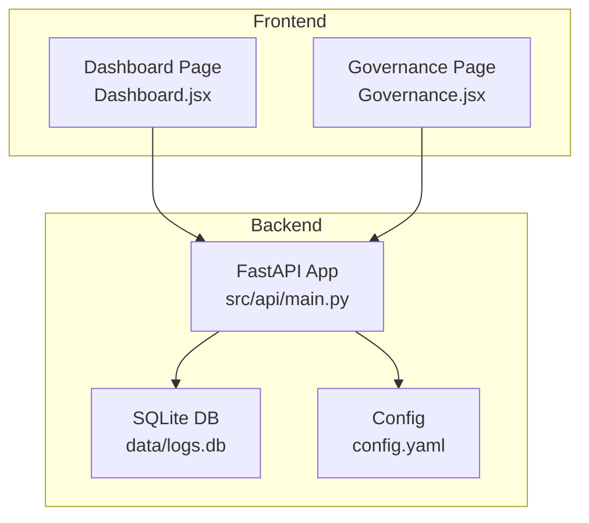
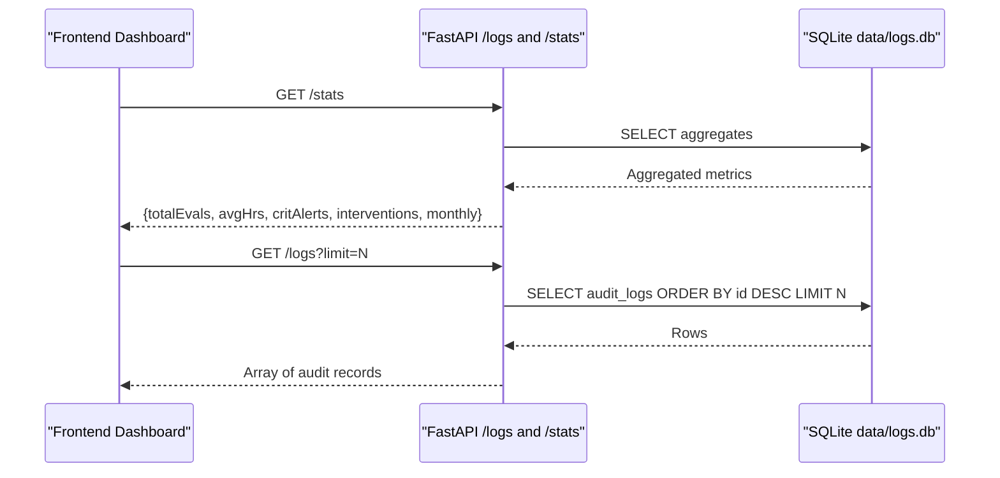
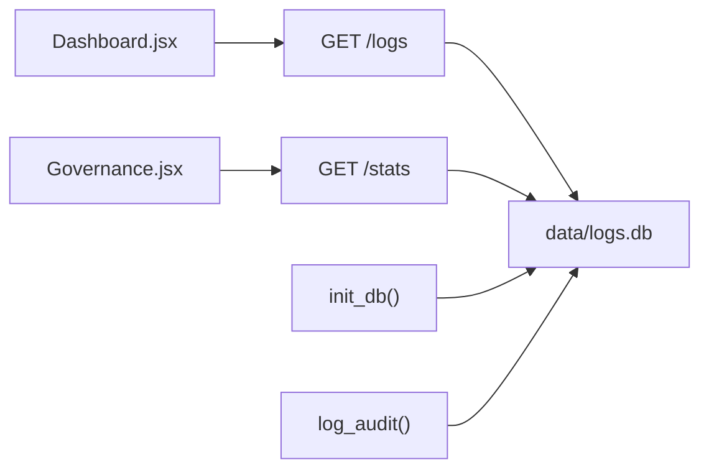
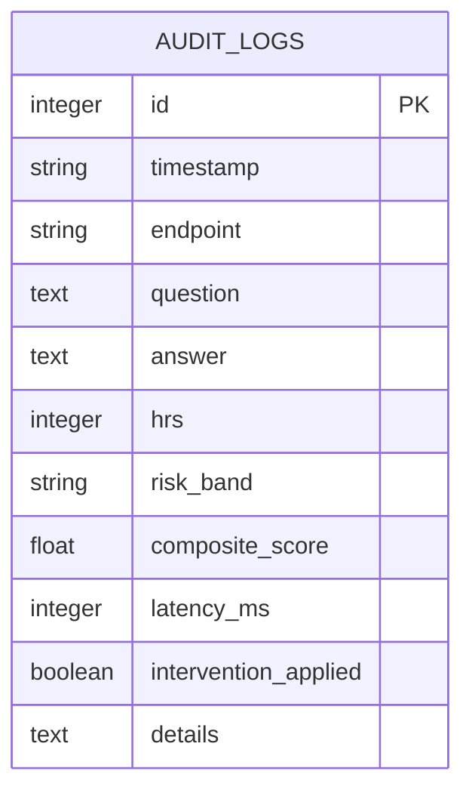

# Dashboard Data Endpoints

<cite>
**Referenced Files in This Document**
- [main.py](file://Backend/src/api/main.py)
- [schemas.py](file://Backend/src/api/schemas.py)
- [Dashboard.jsx](file://Frontend/src/pages/Dashboard.jsx)
- [Governance.jsx](file://Frontend/src/pages/Governance.jsx)
- [config.yaml](file://Backend/config.yaml)
</cite>

## Table of Contents
1. [Introduction](#introduction)
2. [Project Structure](#project-structure)
3. [Core Components](#core-components)
4. [Architecture Overview](#architecture-overview)
5. [Detailed Component Analysis](#detailed-component-analysis)
6. [Dependency Analysis](#dependency-analysis)
7. [Performance Considerations](#performance-considerations)
8. [Troubleshooting Guide](#troubleshooting-guide)
9. [Conclusion](#conclusion)
10. [Appendices](#appendices)

## Introduction
This document provides API documentation for the dashboard data endpoints focused on compliance and monitoring:
- GET /logs: returns recent audit trail records for the dashboard with a limit parameter.
- GET /stats: returns aggregated metrics including totalEvals, avgHrs, critAlerts, interventions, and monthly averages.

It explains the SQLite database schema, audit logging structure, and data aggregation functions. It also covers practical integration patterns for dashboards, filtering and pagination strategies, real-time analytics, performance considerations, caching strategies, and integration with monitoring and alerting systems.

## Project Structure
The dashboard endpoints live in the backend FastAPI application and are consumed by the frontend dashboard and governance pages.

**Diagram sources**
- [main.py:607-648](file://Backend/src/api/main.py#L607-L648)
- [Dashboard.jsx:35-56](file://Frontend/src/pages/Dashboard.jsx#L35-L56)
- [Governance.jsx:17-61](file://Frontend/src/pages/Governance.jsx#L17-L61)
- [config.yaml:54-66](file://Backend/config.yaml#L54-L66)

**Section sources**
- [main.py:607-648](file://Backend/src/api/main.py#L607-L648)
- [Dashboard.jsx:35-56](file://Frontend/src/pages/Dashboard.jsx#L35-L56)
- [Governance.jsx:17-61](file://Frontend/src/pages/Governance.jsx#L17-L61)
- [config.yaml:54-66](file://Backend/config.yaml#L54-L66)

## Core Components
- SQLite audit_logs table schema and initialization.
- Audit logging function that records evaluation and query events.
- GET /logs endpoint with limit parameter returning recent audit records.
- GET /stats endpoint aggregating dashboard metrics and monthly averages.

**Section sources**
- [main.py:75-120](file://Backend/src/api/main.py#L75-L120)
- [main.py:607-648](file://Backend/src/api/main.py#L607-L648)

## Architecture Overview
The dashboard endpoints rely on a lightweight SQLite-backed audit trail. The backend initializes the database and inserts records during evaluation and query operations. The frontend polls these endpoints to power live dashboards and governance views.

**Diagram sources**
- [main.py:607-648](file://Backend/src/api/main.py#L607-L648)

## Detailed Component Analysis

### SQLite Database Schema and Initialization
The backend initializes a dedicated audit_logs table with the following fields:
- id: integer primary key
- timestamp: ISO 8601 UTC string
- endpoint: string indicating the API endpoint ("evaluate" or "query")
- question: original user question
- answer: generated answer
- hrs: integer Health Risk Score (0–100)
- risk_band: string band classification
- composite_score: float composite evaluation score
- latency_ms: integer processing latency
- intervention_applied: boolean flag for safety interventions
- details: JSON text payload with module results and metadata

Initialization occurs at app startup and ensures the table exists.

**Section sources**
- [main.py:75-96](file://Backend/src/api/main.py#L75-L96)

### Audit Logging Function
The log_audit function inserts a record into audit_logs with:
- Current UTC timestamp
- Endpoint identifier
- Question, answer, HRS, risk_band, composite_score
- latency_ms
- intervention_applied flag
- details serialized as JSON

This function is invoked from both evaluation and query endpoints to capture audit trail events.

**Section sources**
- [main.py:97-119](file://Backend/src/api/main.py#L97-L119)

### GET /logs Endpoint
- Method: GET
- Path: /logs
- Query parameter:
  - limit: integer (default 50)
- Behavior:
  - Connects to SQLite
  - Selects all columns from audit_logs
  - Orders by id descending (most recent first)
  - Limits results to the provided limit
  - Returns an array of records

Pagination strategy:
- Use the limit parameter to constrain results.
- For deeper pagination, clients can implement client-side offset by fetching a larger batch and slicing.

Filtering strategies:
- The endpoint does not support server-side filters. Apply filters client-side after fetching.

Real-time analytics:
- The frontend polls /logs to update recent evaluations in near real-time.

**Section sources**
- [main.py:607-620](file://Backend/src/api/main.py#L607-L620)
- [Dashboard.jsx:38-50](file://Frontend/src/pages/Dashboard.jsx#L38-L50)
- [Governance.jsx:20-33](file://Frontend/src/pages/Governance.jsx#L20-L33)

### GET /stats Endpoint
- Method: GET
- Path: /stats
- Behavior:
  - Aggregates:
    - totalEvals: COUNT(*) of audit_logs
    - avgHrs: AVG(hrs) rounded to 0.1
    - critAlerts: COUNT of risk_band = 'CRITICAL'
    - interventions: COUNT of intervention_applied = 1
  - Monthly data:
    - Groups by year-month extracted from timestamp
    - Computes average HRS per month
    - Returns up to 12 months ordered chronologically

Returned structure:
- totalEvals: integer
- avgHrs: float
- critAlerts: integer
- interventions: integer
- monthly: array of { month: string "YYYY-MM", avg_hrs: float }

Real-time analytics:
- The frontend polls /stats to update KPI cards and charts.

**Section sources**
- [main.py:621-648](file://Backend/src/api/main.py#L621-L648)
- [Dashboard.jsx:27-32](file://Frontend/src/pages/Dashboard.jsx#L27-L32)
- [Governance.jsx:24-31](file://Frontend/src/pages/Governance.jsx#L24-L31)

### Audit Log Structure
Each audit record includes:
- timestamp: ISO 8601 UTC
- endpoint: "evaluate" or "query"
- question: user query text
- answer: system answer text
- hrs: integer Health Risk Score
- risk_band: "LOW" | "MODERATE" | "HIGH" | "CRITICAL"
- composite_score: float [0.0, 1.0]
- latency_ms: integer milliseconds
- intervention_applied: boolean
- details: JSON object containing module results and metadata

The details field is parsed by the frontend for governance views.

**Section sources**
- [main.py:80-92](file://Backend/src/api/main.py#L80-L92)
- [main.py:97-119](file://Backend/src/api/main.py#L97-L119)
- [Governance.jsx:36-47](file://Frontend/src/pages/Governance.jsx#L36-L47)

### Frontend Integration Patterns
- Dashboard page:
  - Concurrently fetches /stats and /logs?limit=4
  - Refreshes every 10 seconds
  - Uses risk band and HRS to color-code cards and tables
- Governance page:
  - Fetches /stats and /logs?limit=50
  - Refreshes every 15 seconds
  - Parses details JSON for module breakdowns
  - Supports client-side filtering by risk band and date ranges

**Section sources**
- [Dashboard.jsx:35-56](file://Frontend/src/pages/Dashboard.jsx#L35-L56)
- [Governance.jsx:17-61](file://Frontend/src/pages/Governance.jsx#L17-L61)

## Dependency Analysis
The dashboard endpoints depend on:
- SQLite for persistence
- FastAPI routing and response handling
- Frontend pages for polling and rendering

**Diagram sources**
- [main.py:75-120](file://Backend/src/api/main.py#L75-L120)
- [main.py:607-648](file://Backend/src/api/main.py#L607-L648)
- [Dashboard.jsx:35-56](file://Frontend/src/pages/Dashboard.jsx#L35-L56)
- [Governance.jsx:17-61](file://Frontend/src/pages/Governance.jsx#L17-L61)

**Section sources**
- [main.py:75-120](file://Backend/src/api/main.py#L75-L120)
- [main.py:607-648](file://Backend/src/api/main.py#L607-L648)
- [Dashboard.jsx:35-56](file://Frontend/src/pages/Dashboard.jsx#L35-L56)
- [Governance.jsx:17-61](file://Frontend/src/pages/Governance.jsx#L17-L61)

## Performance Considerations
- Database size and growth:
  - The audit_logs table grows continuously with evaluation and query activity.
  - Without explicit retention policies, long-term growth can impact query performance.
- Query performance:
  - /logs uses ORDER BY id DESC with LIMIT; ensure an index on id (autoincrement primary key) is sufficient.
  - Consider adding an index on timestamp for future time-range queries.
- Aggregation cost:
  - /stats performs COUNT, AVG, and GROUP BY operations. On large datasets, these can be expensive.
- Recommendations:
  - Implement periodic cleanup or archival of older records.
  - Add server-side date filters to /logs and /stats to reduce dataset size.
  - Introduce caching for /stats with short TTL (e.g., 1–5 seconds) to reduce DB load.
  - Use materialized summaries or rollups for frequent metrics.
  - Consider partitioning by month for audit_logs to improve time-based queries.

[No sources needed since this section provides general guidance]

## Troubleshooting Guide
Common issues and remedies:
- Empty or missing data:
  - Verify that evaluation and query endpoints are being exercised; audit records are inserted only on successful operations.
  - Ensure the database file exists and is writable at data/logs.db.
- Slow responses:
  - Large limit values in /logs increase payload size and parsing overhead.
  - Reduce limit or implement client-side pagination.
- Aggregation anomalies:
  - Confirm that risk_band values match expected bands ("LOW", "MODERATE", "HIGH", "CRITICAL").
  - Validate that composite_score and hrs are computed consistently with the evaluation pipeline.
- Frontend parsing errors:
  - The details field is a JSON string; ensure it is parsed before use.
  - Handle missing fields gracefully in client-side rendering.

**Section sources**
- [main.py:607-648](file://Backend/src/api/main.py#L607-L648)
- [Governance.jsx:36-47](file://Frontend/src/pages/Governance.jsx#L36-L47)

## Conclusion
The /logs and /stats endpoints provide a lightweight, SQLite-backed audit trail and aggregated metrics for compliance dashboards. They integrate seamlessly with the frontend’s real-time dashboards and governance views. For production deployments, consider implementing retention policies, server-side filtering, and caching to sustain performance as data volumes grow.

[No sources needed since this section summarizes without analyzing specific files]

## Appendices

### API Definitions

- GET /logs
  - Query parameters:
    - limit: integer, default 50
  - Response: array of audit records
  - Typical fields: id, timestamp, endpoint, question, answer, hrs, risk_band, composite_score, latency_ms, intervention_applied, details

- GET /stats
  - Response: object with:
    - totalEvals: integer
    - avgHrs: float
    - critAlerts: integer
    - interventions: integer
    - monthly: array of { month: string, avg_hrs: float }

**Section sources**
- [main.py:607-648](file://Backend/src/api/main.py#L607-L648)

### Practical Integration Examples

- Dashboard integration pattern:
  - Concurrently fetch /stats and /logs?limit=4
  - Poll every 10 seconds for live updates
  - Render KPI cards and recent evaluations table

- Governance integration pattern:
  - Fetch /stats and /logs?limit=50
  - Poll every 15 seconds
  - Parse details JSON for module breakdowns
  - Implement client-side filters for risk band and date ranges

- Filtering and pagination strategies:
  - Use limit in /logs to constrain results
  - Apply client-side filtering and sorting after fetching
  - For deeper pagination, fetch a larger batch and slice

- Real-time analytics:
  - Poll endpoints at intervals suitable for the dashboard
  - Debounce rapid UI updates to avoid excessive network traffic

**Section sources**
- [Dashboard.jsx:35-56](file://Frontend/src/pages/Dashboard.jsx#L35-L56)
- [Governance.jsx:17-61](file://Frontend/src/pages/Governance.jsx#L17-L61)

### Data Model Diagram

**Diagram sources**
- [main.py:80-92](file://Backend/src/api/main.py#L80-L92)