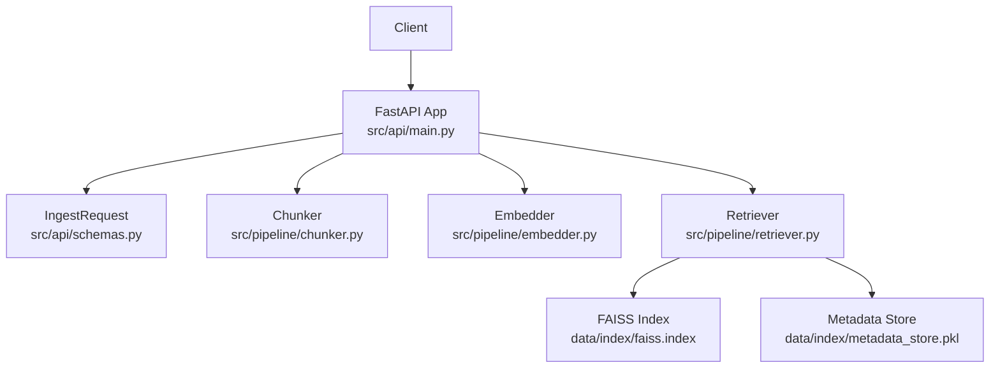
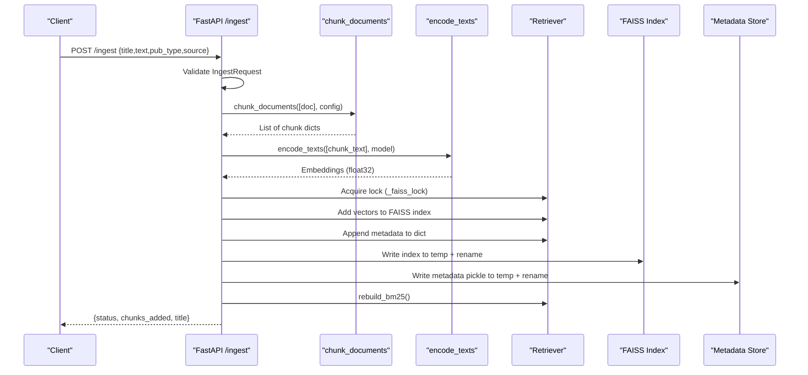
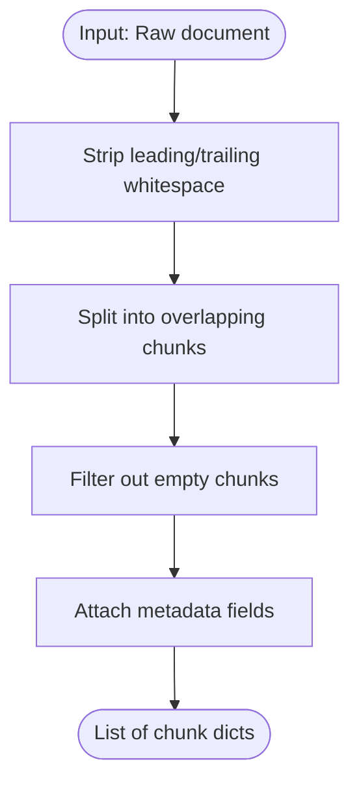
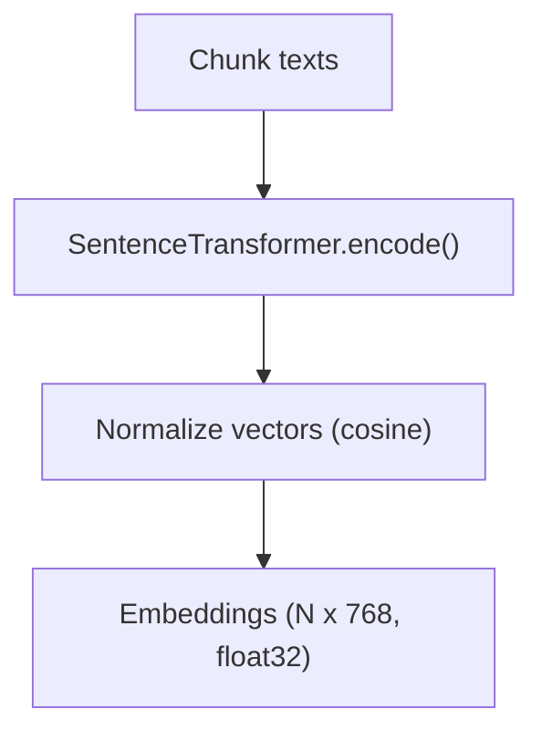
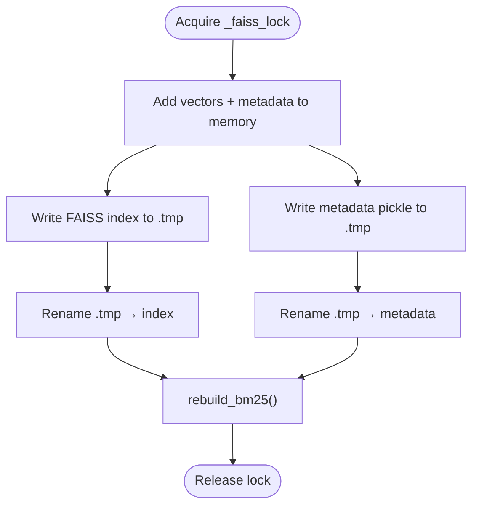
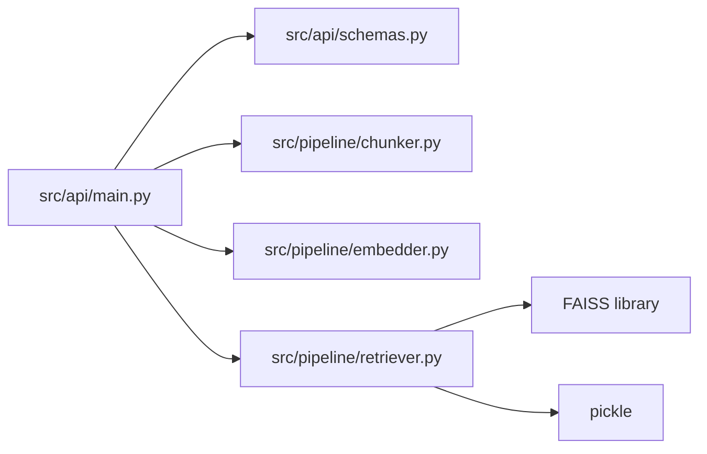

# Document Ingestion Endpoint

<cite>
**Referenced Files in This Document**
- [main.py](file://Backend/src/api/main.py)
- [schemas.py](file://Backend/src/api/schemas.py)
- [chunker.py](file://Backend/src/pipeline/chunker.py)
- [embedder.py](file://Backend/src/pipeline/embedder.py)
- [retriever.py](file://Backend/src/pipeline/retriever.py)
- [config.yaml](file://Backend/config.yaml)
- [UPLOAD_INGEST_LOGIC.txt](file://UPLOAD_INGEST_LOGIC.txt)
- [test_api.py](file://Backend/tests/test_api.py)
</cite>

## Table of Contents
1. [Introduction](#introduction)
2. [Project Structure](#project-structure)
3. [Core Components](#core-components)
4. [Architecture Overview](#architecture-overview)
5. [Detailed Component Analysis](#detailed-component-analysis)
6. [Dependency Analysis](#dependency-analysis)
7. [Performance Considerations](#performance-considerations)
8. [Troubleshooting Guide](#troubleshooting-guide)
9. [Conclusion](#conclusion)
10. [Appendices](#appendices)

## Introduction
This document provides comprehensive API documentation for the POST /ingest endpoint responsible for dynamic document ingestion and FAISS index updates. It covers the endpoint’s request schema, processing pipeline, thread-safety guarantees, and operational guidance for integrating with knowledge base management systems.

Key capabilities:
- Accepts a document with title, text, source, and publication type
- Splits text into overlapping semantic chunks
- Generates BioBERT embeddings for each chunk
- Updates FAISS index and metadata atomically
- Rebuilds BM25 for hybrid retrieval
- Returns a structured success response indicating number of chunks added

## Project Structure
The ingestion endpoint is implemented in the FastAPI application and integrates with pipeline modules for chunking, embedding, and retrieval.

**Diagram sources**
- [main.py:522-603](file://Backend/src/api/main.py#L522-L603)
- [schemas.py:15-21](file://Backend/src/api/schemas.py#L15-L21)
- [chunker.py:20-82](file://Backend/src/pipeline/chunker.py#L20-L82)
- [embedder.py:55-78](file://Backend/src/pipeline/embedder.py#L55-L78)
- [retriever.py:39-144](file://Backend/src/pipeline/retriever.py#L39-L144)

**Section sources**
- [main.py:522-603](file://Backend/src/api/main.py#L522-L603)
- [schemas.py:15-21](file://Backend/src/api/schemas.py#L15-L21)

## Core Components
- Endpoint: POST /ingest
- Request schema: IngestRequest with fields title, text, pub_type, source
- Response: JSON with status, chunks_added, and title
- Pipeline stages: chunking, embedding, FAISS update, BM25 rebuild

**Section sources**
- [main.py:522-603](file://Backend/src/api/main.py#L522-L603)
- [schemas.py:15-21](file://Backend/src/api/schemas.py#L15-L21)

## Architecture Overview
The ingestion pipeline transforms raw text into searchable chunks, computes embeddings, and updates both FAISS and metadata stores atomically while maintaining thread safety.

**Diagram sources**
- [main.py:522-603](file://Backend/src/api/main.py#L522-L603)
- [chunker.py:20-82](file://Backend/src/pipeline/chunker.py#L20-L82)
- [embedder.py:55-78](file://Backend/src/pipeline/embedder.py#L55-L78)
- [retriever.py:121-143](file://Backend/src/pipeline/retriever.py#L121-L143)

## Detailed Component Analysis

### Endpoint Definition: POST /ingest
- URL: /ingest
- Method: POST
- Tags: ingestion
- Authentication: None (configured for local development)
- Request body: IngestRequest
- Response: JSON object with status, chunks_added, and title

Success response format:
- status: string, always "success"
- chunks_added: integer, number of chunks added
- title: string, original title parameter

Validation and error behavior:
- Raises HTTP 422 for invalid request body (Pydantic validation)
- Raises HTTP 400 if chunking produces zero chunks
- Raises HTTP 503 if retriever is not pre-warmed or index not found

**Section sources**
- [main.py:522-603](file://Backend/src/api/main.py#L522-L603)
- [schemas.py:15-21](file://Backend/src/api/schemas.py#L15-L21)

### IngestRequest Schema
Fields:
- title: string, required
- text: string, required, minimum length 10
- pub_type: string, default "clinical_guideline"
- source: string, default "custom_upload"

Constraints:
- Minimum length enforced by Pydantic validator
- Additional metadata preserved during chunking

**Section sources**
- [schemas.py:15-21](file://Backend/src/api/schemas.py#L15-L21)

### Document Processing Pipeline

#### 1) Text Chunking
- Uses RecursiveCharacterTextSplitter with configured chunk_size and chunk_overlap
- Produces chunk dictionaries with metadata fields including chunk_id, doc_id, source, title, pub_type, pub_year, journal, chunk_index, total_chunks
- Skips empty or whitespace-only chunks

**Diagram sources**
- [chunker.py:20-82](file://Backend/src/pipeline/chunker.py#L20-L82)

**Section sources**
- [chunker.py:20-82](file://Backend/src/pipeline/chunker.py#L20-L82)

#### 2) BioBERT Embedding Generation
- Reuses the same BioBERT model used by the retriever to ensure consistent vector space
- Encodes chunk texts into 768-dimensional float32 vectors with L2 normalization for cosine similarity
- Batch size configurable via embedder

**Diagram sources**
- [embedder.py:55-78](file://Backend/src/pipeline/embedder.py#L55-L78)

**Section sources**
- [embedder.py:55-78](file://Backend/src/pipeline/embedder.py#L55-L78)

#### 3) FAISS Index Update and Atomic Persistence
- Thread-safety: Acquires a global lock before updating index and metadata
- In-memory updates: Adds vectors to FAISS index and appends metadata to dictionary
- Atomic writes: Writes temporary files then renames to replace existing files, preventing corruption
- Disk paths configured in config.yaml under retrieval.index_path and retrieval.metadata_path

**Diagram sources**
- [main.py:570-601](file://Backend/src/api/main.py#L570-L601)
- [retriever.py:121-143](file://Backend/src/pipeline/retriever.py#L121-L143)

**Section sources**
- [main.py:570-601](file://Backend/src/api/main.py#L570-L601)
- [retriever.py:121-143](file://Backend/src/pipeline/retriever.py#L121-L143)

#### 4) BM25 Rebuild for Hybrid Retrieval
- After ingestion, the running retriever rebuilds its BM25 index to include newly added chunks
- Enables hybrid retrieval combining semantic (FAISS) and keyword (BM25) signals

**Section sources**
- [retriever.py:121-143](file://Backend/src/pipeline/retriever.py#L121-L143)

### Thread-Safety Mechanisms
- Global lock: _faiss_lock ensures only one writer updates FAISS and metadata at a time
- Atomic file operations: Temporary files are written and then renamed to replace the live files, preventing partial writes
- In-memory staging: Index and metadata are updated in memory before persistent writes

**Section sources**
- [main.py:524-524](file://Backend/src/api/main.py#L524-L524)
- [main.py:570-597](file://Backend/src/api/main.py#L570-L597)

### Success Response Format
- status: "success"
- chunks_added: integer count of chunks persisted
- title: original request title

**Section sources**
- [main.py:602-603](file://Backend/src/api/main.py#L602-L603)

## Dependency Analysis
The ingestion endpoint depends on:
- FastAPI application state for the retriever instance
- Chunker for text segmentation
- Embedder for vector generation
- Retriever for FAISS index and metadata management
- FAISS library for index operations
- Python pickle for metadata serialization

**Diagram sources**
- [main.py:522-603](file://Backend/src/api/main.py#L522-L603)
- [schemas.py:15-21](file://Backend/src/api/schemas.py#L15-L21)
- [chunker.py:20-82](file://Backend/src/pipeline/chunker.py#L20-L82)
- [embedder.py:55-78](file://Backend/src/pipeline/embedder.py#L55-L78)
- [retriever.py:39-144](file://Backend/src/pipeline/retriever.py#L39-L144)

**Section sources**
- [main.py:522-603](file://Backend/src/api/main.py#L522-L603)
- [retriever.py:39-144](file://Backend/src/pipeline/retriever.py#L39-L144)

## Performance Considerations
- Batch embedding: BioBERT encodes texts in batches to improve throughput
- Overlap trade-off: chunk_overlap balances context preservation and index size
- Model reuse: Reusing the retriever’s loaded model avoids redundant initialization
- Lock contention: Long-running writes can block concurrent uploads; consider batching large sets
- Disk I/O: Atomic writes minimize corruption risk but require sufficient disk bandwidth

[No sources needed since this section provides general guidance]

## Troubleshooting Guide
Common issues and resolutions:
- Empty or whitespace-only documents: Chunking skips empty chunks; ensure input contains meaningful text
- Encoding problems: The parse_file endpoint demonstrates UTF-8 decoding with replacement; ensure uploaded files are properly encoded
- Index not found: The retriever raises FileNotFoundError if FAISS index is missing; ensure embedder has been run and index exists
- Retriever not pre-warmed: The endpoint checks app.state.retriever and raises HTTP 503 if unavailable
- Validation failures: HTTP 422 indicates invalid request body; verify required fields and lengths

**Section sources**
- [chunker.py:52-55](file://Backend/src/pipeline/chunker.py#L52-L55)
- [main.py:538-539](file://Backend/src/api/main.py#L538-L539)
- [retriever.py:87-91](file://Backend/src/pipeline/retriever.py#L87-L91)
- [main.py:554-555](file://Backend/src/api/main.py#L554-L555)

## Conclusion
The POST /ingest endpoint provides a robust, thread-safe mechanism to dynamically add documents to the FAISS-powered knowledge base. By preserving metadata, generating embeddings consistently, and persisting changes atomically, it enables reliable hybrid retrieval and safe operation under concurrent loads.

[No sources needed since this section summarizes without analyzing specific files]

## Appendices

### API Reference: POST /ingest
- URL: /ingest
- Method: POST
- Request body: IngestRequest
- Response: JSON with status, chunks_added, title
- Status codes:
  - 200: Success
  - 400: Bad request (e.g., zero chunks)
  - 422: Validation error
  - 503: Retriever not available or index not found

**Section sources**
- [main.py:522-603](file://Backend/src/api/main.py#L522-L603)
- [schemas.py:15-21](file://Backend/src/api/schemas.py#L15-L21)

### Example Workflows

#### Workflow 1: Basic Document Ingestion
- Prepare a document with title and text
- Send POST /ingest with JSON payload
- Verify response includes status, chunks_added, and title

**Section sources**
- [UPLOAD_INGEST_LOGIC.txt:275-284](file://UPLOAD_INGEST_LOGIC.txt#L275-L284)

#### Workflow 2: Chunk Processing with Metadata Preservation
- The chunker preserves doc_id, title, source, pub_type, pub_year, journal, chunk_index, total_chunks
- Ensure metadata completeness for downstream evaluation and provenance

**Section sources**
- [chunker.py:64-76](file://Backend/src/pipeline/chunker.py#L64-L76)

#### Workflow 3: Index Rebuilding Procedures
- After ingestion, the retriever rebuilds BM25 to include new chunks
- Hybrid retrieval combines FAISS and BM25 for improved recall and precision

**Section sources**
- [retriever.py:121-143](file://Backend/src/pipeline/retriever.py#L121-L143)

### Integration Patterns
- Knowledge base management systems can call /ingest to add curated documents
- Versioning strategies:
  - Use distinct doc_id prefixes per source/system
  - Maintain pub_year and journal metadata for provenance
  - Consider incremental updates by de-duplicating on doc_id

**Section sources**
- [chunker.py:64-76](file://Backend/src/pipeline/chunker.py#L64-L76)
- [UPLOAD_INGEST_LOGIC.txt:230-233](file://UPLOAD_INGEST_LOGIC.txt#L230-L233)

### Configuration References
- retrieval.chunk_size and retrieval.chunk_overlap control chunking behavior
- retrieval.embedding_model selects BioBERT variant
- retrieval.index_path and retrieval.metadata_path define FAISS and metadata locations

**Section sources**
- [config.yaml:1-7](file://Backend/config.yaml#L1-L7)