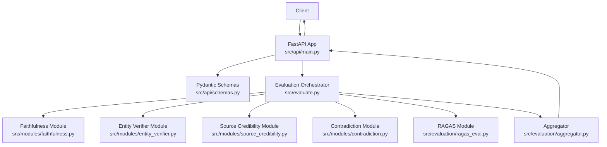
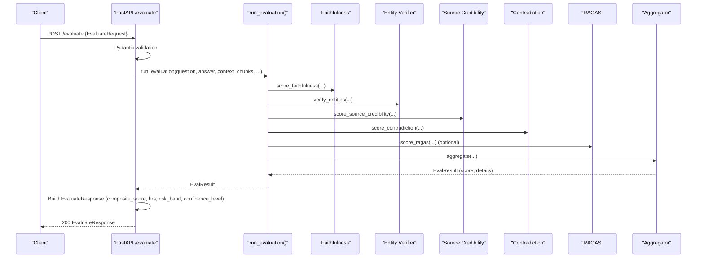
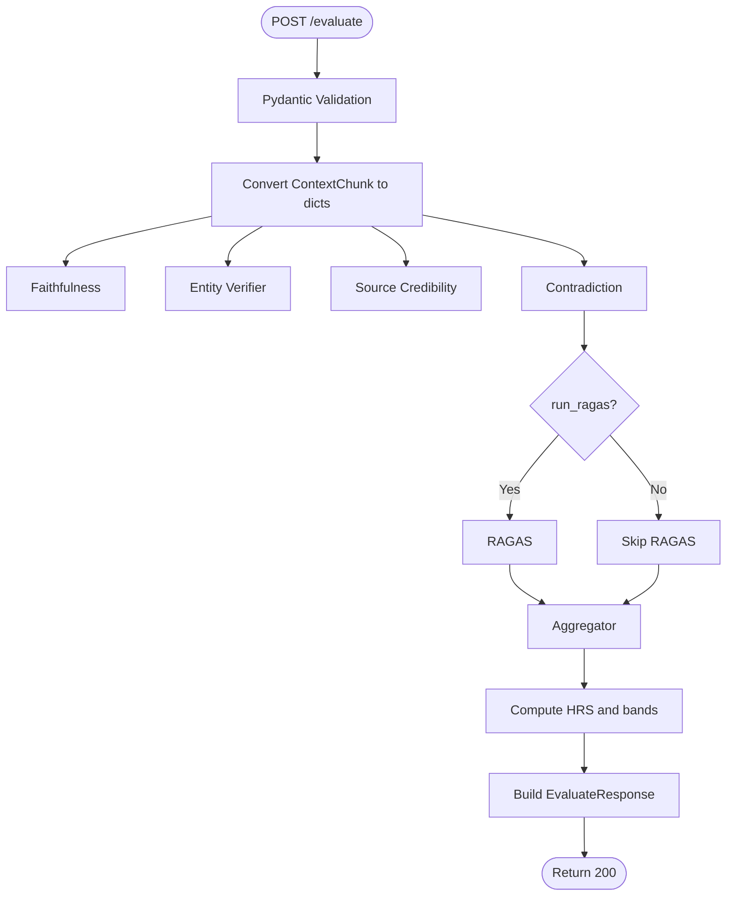
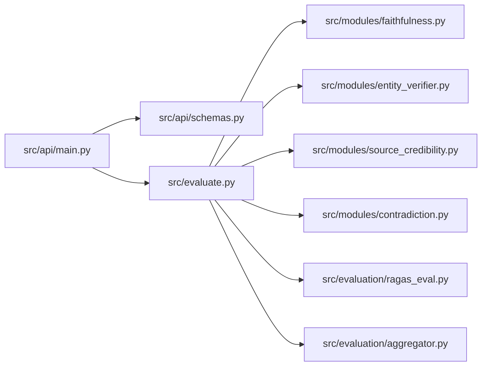

# Evaluation Endpoint

<cite>
**Referenced Files in This Document**
- [README.md](file://README.md)
- [config.yaml](file://config.yaml)
- [src/api/main.py](file://Backend/src/api/main.py)
- [src/api/schemas.py](file://Backend/src/api/schemas.py)
- [src/evaluate.py](file://Backend/src/evaluate.py)
- [src/modules/base.py](file://Backend/src/modules/base.py)
- [src/modules/faithfulness.py](file://Backend/src/modules/faithfulness.py)
- [src/modules/entity_verifier.py](file://Backend/src/modules/entity_verifier.py)
- [src/modules/source_credibility.py](file://Backend/src/modules/source_credibility.py)
- [src/modules/contradiction.py](file://Backend/src/modules/contradiction.py)
- [src/evaluation/aggregator.py](file://Backend/src/evaluation/aggregator.py)
- [src/evaluation/ragas_eval.py](file://Backend/src/evaluation/ragas_eval.py)
- [tests/test_api.py](file://Backend/tests/test_api.py)
- [Frontend/src/pages/Evaluate.jsx](file://Frontend/src/pages/Evaluate.jsx)
</cite>

## Table of Contents
1. [Introduction](#introduction)
2. [Project Structure](#project-structure)
3. [Core Components](#core-components)
4. [Architecture Overview](#architecture-overview)
5. [Detailed Component Analysis](#detailed-component-analysis)
6. [Dependency Analysis](#dependency-analysis)
7. [Performance Considerations](#performance-considerations)
8. [Troubleshooting Guide](#troubleshooting-guide)
9. [Conclusion](#conclusion)
10. [Appendices](#appendices)

## Introduction
This document provides API documentation for the POST /evaluate endpoint, which performs standalone safety evaluation of LLM-generated answers against provided context chunks. It covers request/response schemas, evaluation pipeline integration, module scoring, risk assessment, examples, error handling, and performance considerations for batch processing and external AI system integration.

## Project Structure
The evaluation endpoint is implemented in the FastAPI application and orchestrates multiple evaluation modules and an aggregator to produce a composite Health Risk Score (HRS) and per-module breakdown.

**Diagram sources**
- [src/api/main.py:223-302](file://Backend/src/api/main.py#L223-L302)
- [src/api/schemas.py:41-133](file://Backend/src/api/schemas.py#L41-L133)
- [src/evaluate.py:49-167](file://Backend/src/evaluate.py#L49-L167)
- [src/modules/faithfulness.py:86-234](file://Backend/src/modules/faithfulness.py#L86-L234)
- [src/modules/entity_verifier.py:146-283](file://Backend/src/modules/entity_verifier.py#L146-L283)
- [src/modules/source_credibility.py:121-200](file://Backend/src/modules/source_credibility.py#L121-L200)
- [src/modules/contradiction.py:94-251](file://Backend/src/modules/contradiction.py#L94-L251)
- [src/evaluation/ragas_eval.py:81-178](file://Backend/src/evaluation/ragas_eval.py#L81-L178)
- [src/evaluation/aggregator.py:47-167](file://Backend/src/evaluation/aggregator.py#L47-L167)

**Section sources**
- [README.md:13-42](file://README.md#L13-L42)
- [config.yaml:54-61](file://config.yaml#L54-L61)

## Core Components
- Endpoint: POST /evaluate
- Purpose: Validate and score an LLM answer against provided context chunks; return composite HRS and per-module results.
- Validation: Pydantic schemas enforce input constraints (length limits, chunk counts, required fields).
- Pipeline: Runs Faithfulness, Entity Verifier, Source Credibility, Contradiction, optionally RAGAS, then aggregates into a composite score with risk bands and confidence level.

Key schemas:
- EvaluateRequest: question, answer, context_chunks (List[ContextChunk]), run_ragas, optional LLM overrides, and rxnorm_cache_path.
- EvaluateResponse: composite_score, hrs, confidence_level, risk_band, module_results (faithfulness, entity_verifier, source_credibility, contradiction, ragas), total_pipeline_ms.

**Section sources**
- [src/api/schemas.py:41-133](file://Backend/src/api/schemas.py#L41-L133)
- [src/api/main.py:223-302](file://Backend/src/api/main.py#L223-L302)

## Architecture Overview
The /evaluate endpoint validates inputs, converts Pydantic models to dicts for the orchestrator, executes the evaluation pipeline, computes HRS and risk band, and returns a structured response.

**Diagram sources**
- [src/api/main.py:223-302](file://Backend/src/api/main.py#L223-L302)
- [src/evaluate.py:49-167](file://Backend/src/evaluate.py#L49-L167)
- [src/evaluation/aggregator.py:47-167](file://Backend/src/evaluation/aggregator.py#L47-L167)
- [src/evaluation/ragas_eval.py:81-178](file://Backend/src/evaluation/ragas_eval.py#L81-L178)
- [src/modules/faithfulness.py:86-234](file://Backend/src/modules/faithfulness.py#L86-L234)
- [src/modules/entity_verifier.py:146-283](file://Backend/src/modules/entity_verifier.py#L146-L283)
- [src/modules/source_credibility.py:121-200](file://Backend/src/modules/source_credibility.py#L121-L200)
- [src/modules/contradiction.py:94-251](file://Backend/src/modules/contradiction.py#L94-L251)

## Detailed Component Analysis

### Endpoint Definition: POST /evaluate
- Path: /evaluate
- Method: POST
- Request Body: EvaluateRequest
- Response Body: EvaluateResponse
- Behavior:
  - Validates inputs (length limits, chunk count).
  - Converts Pydantic ContextChunk to plain dicts.
  - Calls run_evaluation() to execute the pipeline.
  - Computes HRS = round(100 × (1 − composite_score)) with bounds 0–100.
  - Maps HRS to risk_band: LOW (≤30), MODERATE (≤60), HIGH (≤85), CRITICAL (>85).
  - Determines confidence_level: HIGH (≥0.80), MODERATE (≥0.55), LOW (<0.55).
  - Builds ModuleResults with per-module scores and details.
  - Logs audit event.

**Section sources**
- [src/api/main.py:223-302](file://Backend/src/api/main.py#L223-L302)
- [src/api/schemas.py:41-133](file://Backend/src/api/schemas.py#L41-L133)

### EvaluateRequest Schema
- question: string (5–500 chars)
- answer: string (1–2000 chars)
- context_chunks: array of ContextChunk (1–10 items)
- run_ragas: boolean (default false)
- llm_provider: optional string ('gemini' or 'ollama')
- llm_api_key: optional string
- llm_model: optional string
- rxnorm_cache_path: string (default data/rxnorm_cache.csv)

Validation highlights:
- At least one context chunk required.
- Length limits enforced by Pydantic validators.

**Section sources**
- [src/api/schemas.py:41-90](file://Backend/src/api/schemas.py#L41-L90)
- [config.yaml:57-60](file://config.yaml#L57-L60)

### ContextChunk Schema
- text: string (1–2000 chars)
- chunk_id: optional string
- pub_type: optional string
- pub_year: optional integer
- source: optional string
- title: optional string
- tier_type: optional string
- score: optional float

**Section sources**
- [src/api/schemas.py:27-39](file://Backend/src/api/schemas.py#L27-L39)

### EvaluateResponse Schema
- composite_score: float (0.0–1.0)
- hrs: int (0–100)
- confidence_level: string (HIGH/MODERATE/LOW)
- risk_band: string (LOW/MODERATE/HIGH/CRITICAL)
- module_results: ModuleResults
- total_pipeline_ms: int

ModuleResults:
- faithfulness: optional ModuleScore
- entity_verifier: optional ModuleScore
- source_credibility: optional ModuleScore
- contradiction: optional ModuleScore
- ragas: optional ModuleScore

ModuleScore:
- score: float (0.0–1.0)
- details: dict
- error: optional string
- latency_ms: optional int

**Section sources**
- [src/api/schemas.py:96-133](file://Backend/src/api/schemas.py#L96-L133)

### Evaluation Pipeline Integration
The orchestrator coordinates four modules plus optional RAGAS and the aggregator.

**Diagram sources**
- [src/evaluate.py:49-167](file://Backend/src/evaluate.py#L49-L167)
- [src/evaluation/aggregator.py:47-167](file://Backend/src/evaluation/aggregator.py#L47-L167)
- [src/evaluation/ragas_eval.py:81-178](file://Backend/src/evaluation/ragas_eval.py#L81-L178)

**Section sources**
- [src/evaluate.py:49-167](file://Backend/src/evaluate.py#L49-L167)

### Module Scoring System
- Faithfulness (DeBERTa NLI): Claims extracted from answer; for each claim, compute NLI against all context chunks; classify as ENTAILED/NEUTRAL/CONTRADICTED; score = entailed_count / total_claims.
- Entity Verifier (SciSpaCy + RxNorm): Extract DRUG/DOSAGE/CONDITION/PROCEDURE entities; verify DRUGs against RxNorm cache/API; score = verified_drug_count / total_drug_count.
- Source Credibility: Tier weights (clinical_guideline→systematic_review→research_abstract→review_article→clinical_case→unknown); score = average tier weight across chunks.
- Contradiction Detection (DeBERTa NLI): Sentence segmentation; filter sentence pairs by keyword overlap; compute contradiction scores; score = 1.0 − (flagged_pairs / total_pairs).
- RAGAS (optional): Requires LLM backend; computes faithfulness and answer_relevancy; composite = mean of both.

**Section sources**
- [src/modules/faithfulness.py:86-234](file://Backend/src/modules/faithfulness.py#L86-L234)
- [src/modules/entity_verifier.py:146-283](file://Backend/src/modules/entity_verifier.py#L146-L283)
- [src/modules/source_credibility.py:121-200](file://Backend/src/modules/source_credibility.py#L121-L200)
- [src/modules/contradiction.py:94-251](file://Backend/src/modules/contradiction.py#L94-L251)
- [src/evaluation/ragas_eval.py:81-178](file://Backend/src/evaluation/ragas_eval.py#L81-L178)

### Aggregation and Risk Assessment
- Weights (fixed in aggregator):
  - faithfulness: 0.35
  - entity_accuracy: 0.20
  - source_credibility: 0.20
  - contradiction_risk: 0.15
  - ragas_composite: 0.10 (neutral 0.5 if unavailable)
- Composite score: weighted sum; if faithfulness ≤ 0.6 or contradiction ≤ 0.6, multiply by 0.6 to penalize.
- HRS: round(100 × (1 − composite)); clamp to 0–100.
- Risk bands: LOW (≤30), MODERATE (≤60), HIGH (≤85), CRITICAL (>85).
- Confidence level: HIGH (≥0.80), MODERATE (≥0.55), LOW (<0.55).

**Section sources**
- [src/evaluation/aggregator.py:38-167](file://Backend/src/evaluation/aggregator.py#L38-L167)

### Relationship with Individual Modules
- Faithfulness: Provides claim-level details including counts and per-claim status and best chunk ID.
- Entity Verifier: Provides entity-level details including types, statuses, severities, and RxNorm matches.
- Source Credibility: Provides tier classification and matched keywords for each chunk.
- Contradiction: Provides sentence-pair details and flagged contradictions.
- RAGAS: Provides backend info and per-metric scores when available.

**Section sources**
- [src/modules/base.py:15-128](file://Backend/src/modules/base.py#L15-L128)
- [src/evaluation/aggregator.py:130-151](file://Backend/src/evaluation/aggregator.py#L130-L151)

### Examples

#### Example 1: Minimal Request with One Context Chunk
- Request:
  - question: "Is Metformin safe?"
  - answer: "Metformin is a safe and effective drug. It is recommended."
  - context_chunks: [{"text": "Metformin is a first-line medication for the treatment of type 2 diabetes. It is safe."}]
  - run_ragas: false
- Expected Response:
  - composite_score ≈ high (faithful and credible)
  - hrs ≈ low
  - risk_band: LOW
  - confidence_level: HIGH
  - module_results: populated for faithfulness, entity_verifier, source_credibility, contradiction

**Section sources**
- [tests/test_api.py:17-45](file://Backend/tests/test_api.py#L17-L45)

#### Example 2: Multiple Context Chunks with Mixed Quality
- Request:
  - question: "What is the recommended starting dose for Metformin in adults with type 2 diabetes?"
  - answer: "The standard starting dose is 500 mg once or twice daily with meals."
  - context_chunks:
    - [{"text": "ADA Standards 2024: Metformin is the preferred initial pharmacologic agent..."}, ...]
  - run_ragas: false
- Expected Response:
  - composite_score depends on faithfulness and source credibility
  - hrs reflects risk band
  - module_results: detailed breakdown per module

**Section sources**
- [Frontend/src/pages/Evaluate.jsx:19-30](file://Frontend/src/pages/Evaluate.jsx#L19-L30)

#### Example 3: With RAGAS Enabled (LLM Available)
- Request:
  - Same as above
  - run_ragas: true
- Expected Response:
  - ragas module included in module_results
  - composite_score may differ due to RAGAS contribution

**Section sources**
- [src/evaluation/ragas_eval.py:81-178](file://Backend/src/evaluation/ragas_eval.py#L81-L178)

### Error Handling
- Validation errors: Pydantic validation produces HTTP 422 Unprocessable Entity for invalid inputs.
- Runtime exceptions: If run_evaluation raises an unhandled exception, the endpoint returns HTTP 500 with a descriptive message.
- Module failures: Partial results are returned; modules that fail include an error field in ModuleScore.
- RAGAS fallback: If no LLM backend is available, RAGAS returns neutral score (0.5) without crashing.

**Section sources**
- [src/api/main.py:256-261](file://Backend/src/api/main.py#L256-L261)
- [src/evaluation/ragas_eval.py:104-120](file://Backend/src/evaluation/ragas_eval.py#L104-L120)

## Dependency Analysis
- FastAPI endpoint depends on Pydantic schemas for validation and on run_evaluation() for orchestration.
- run_evaluation() depends on four modules and optionally RAGAS, then on aggregator.
- Aggregator depends on module results and applies fixed weights.
- Modules depend on external libraries (sentence-transformers, scispacy, ragas, etc.) and may degrade gracefully when unavailable.

**Diagram sources**
- [src/api/main.py:223-302](file://Backend/src/api/main.py#L223-L302)
- [src/evaluate.py:49-167](file://Backend/src/evaluate.py#L49-L167)
- [src/evaluation/aggregator.py:47-167](file://Backend/src/evaluation/aggregator.py#L47-L167)
- [src/evaluation/ragas_eval.py:81-178](file://Backend/src/evaluation/ragas_eval.py#L81-L178)
- [src/modules/faithfulness.py:86-234](file://Backend/src/modules/faithfulness.py#L86-L234)
- [src/modules/entity_verifier.py:146-283](file://Backend/src/modules/entity_verifier.py#L146-L283)
- [src/modules/source_credibility.py:121-200](file://Backend/src/modules/source_credibility.py#L121-L200)
- [src/modules/contradiction.py:94-251](file://Backend/src/modules/contradiction.py#L94-L251)

**Section sources**
- [src/api/main.py:223-302](file://Backend/src/api/main.py#L223-L302)
- [src/evaluate.py:49-167](file://Backend/src/evaluate.py#L49-L167)

## Performance Considerations
- Latency components:
  - DeBERTa NLI inference (Faithfulness and Contradiction) is the dominant cost; batching and limiting sentence pairs helps.
  - Entity verification depends on SciSpaCy loading and RxNorm lookups; caching reduces overhead.
  - RAGAS adds significant latency; enable only when an LLM backend is available.
- Recommendations:
  - Keep context_chunks minimal (≤10) and limit per-module processing (e.g., max_chunks, max_sentence_pairs).
  - Use run_ragas=false for low-latency scenarios.
  - Pre-warm models at startup (already handled by the app lifecycle).
  - Monitor total_pipeline_ms in responses for operational insights.

**Section sources**
- [src/evaluate.py:75-167](file://Backend/src/evaluate.py#L75-L167)
- [src/modules/faithfulness.py:105-234](file://Backend/src/modules/faithfulness.py#L105-L234)
- [src/modules/contradiction.py:111-251](file://Backend/src/modules/contradiction.py#L111-L251)
- [src/evaluation/ragas_eval.py:101-178](file://Backend/src/evaluation/ragas_eval.py#L101-L178)

## Troubleshooting Guide
- HTTP 422: Fix invalid inputs (length limits, missing fields, empty context_chunks).
- HTTP 500: Inspect server logs for run_evaluation exceptions; check module-specific errors in module_results.error.
- RAGAS not available: Set OPENAI_API_KEY or start Ollama; otherwise, expect neutral ragas score.
- Slow responses: Reduce top_k or disable run_ragas; ensure DeBERTa model is pre-warmed.

**Section sources**
- [src/api/main.py:256-261](file://Backend/src/api/main.py#L256-L261)
- [src/evaluation/ragas_eval.py:104-120](file://Backend/src/evaluation/ragas_eval.py#L104-L120)

## Conclusion
The POST /evaluate endpoint provides a robust, modular safety evaluation pipeline that transforms LLM outputs into actionable risk insights. By combining domain-aware modules with a configurable aggregator, it supports both standalone audits and integration into broader AI governance workflows.

## Appendices

### API Definition Summary
- Method: POST
- Path: /evaluate
- Request: EvaluateRequest
- Response: EvaluateResponse
- Typical Status Codes: 200 (success), 422 (validation error), 500 (internal error)

**Section sources**
- [src/api/main.py:223-302](file://Backend/src/api/main.py#L223-L302)
- [src/api/schemas.py:41-133](file://Backend/src/api/schemas.py#L41-L133)