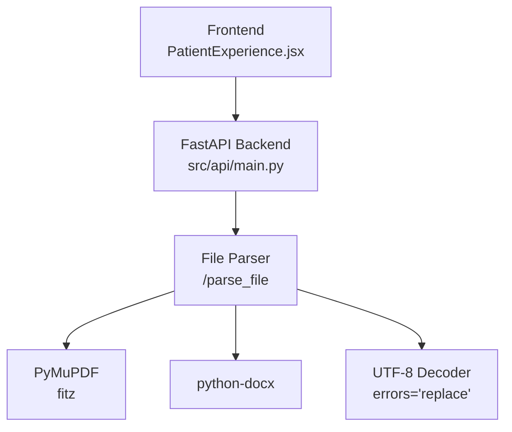
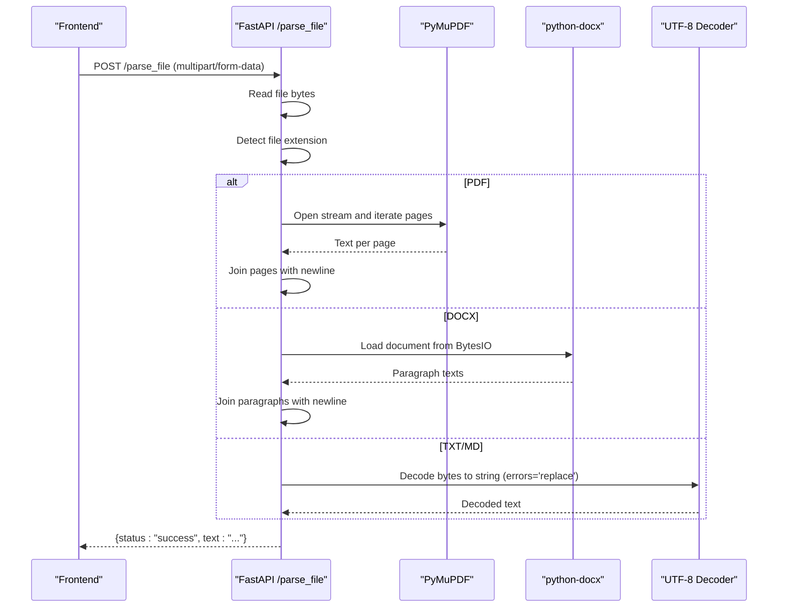
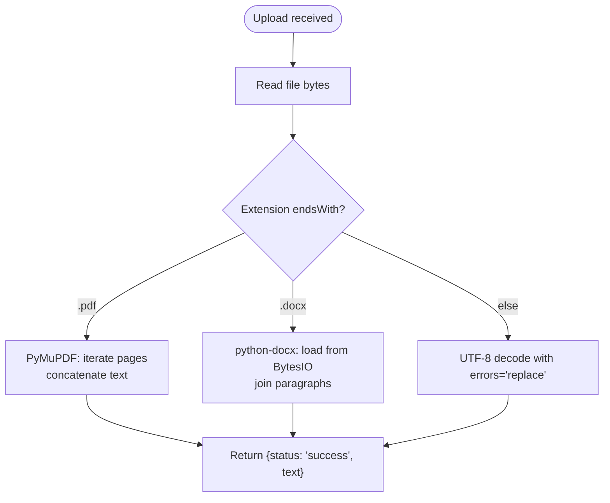
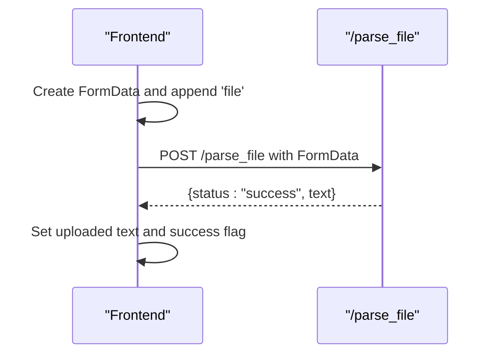
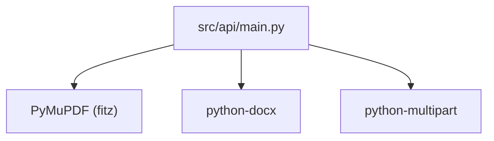

# File Parsing Endpoint

<cite>
**Referenced Files in This Document**
- [main.py](file://Backend/src/api/main.py)
- [schemas.py](file://Backend/src/api/schemas.py)
- [requirements.txt](file://Backend/requirements.txt)
- [config.yaml](file://Backend/config.yaml)
- [PatientExperience.jsx](file://Frontend/src/pages/PatientExperience.jsx)
- [UPLOAD_INGEST_LOGIC.txt](file://Backend/UPLOAD_INGEST_LOGIC.txt)
</cite>

## Table of Contents
1. [Introduction](#introduction)
2. [Project Structure](#project-structure)
3. [Core Components](#core-components)
4. [Architecture Overview](#architecture-overview)
5. [Detailed Component Analysis](#detailed-component-analysis)
6. [Dependency Analysis](#dependency-analysis)
7. [Performance Considerations](#performance-considerations)
8. [Troubleshooting Guide](#troubleshooting-guide)
9. [Conclusion](#conclusion)
10. [Appendices](#appendices)

## Introduction
This document provides API documentation for the /parse_file endpoint, which extracts text from uploaded documents. The endpoint accepts multipart/form-data uploads of txt, md, pdf, and docx files and returns a JSON response containing a status and the extracted text. It supports UTF-8 decoding with error recovery and integrates with frontend workflows for document ingestion.

## Project Structure
The /parse_file endpoint is implemented in the backend FastAPI application and is part of the ingestion-related endpoints. The frontend demonstrates usage by uploading files and sending them to the backend.

**Diagram sources**
- [main.py:651-677](file://Backend/src/api/main.py#L651-L677)
- [PatientExperience.jsx:170-186](file://Frontend/src/pages/PatientExperience.jsx#L170-L186)

**Section sources**
- [main.py:651-677](file://Backend/src/api/main.py#L651-L677)
- [PatientExperience.jsx:170-186](file://Frontend/src/pages/PatientExperience.jsx#L170-L186)

## Core Components
- Endpoint: POST /parse_file
- Method: multipart/form-data
- Supported file types: txt, md, pdf, docx
- Response: JSON with status and extracted text
- Error handling: HTTP 400 on parsing failures

Key implementation details:
- Reads uploaded file bytes
- Determines file type by extension
- Uses PyMuPDF for PDF text extraction
- Uses python-docx for DOCX paragraph extraction
- Uses UTF-8 decoding with error replacement for txt/md

**Section sources**
- [main.py:651-677](file://Backend/src/api/main.py#L651-L677)
- [requirements.txt:31-32](file://Backend/requirements.txt#L31-L32)

## Architecture Overview
The /parse_file endpoint sits between the frontend and the file parsing libraries. It reads the uploaded file content, routes to the appropriate parser based on file extension, and returns the extracted text.

**Diagram sources**
- [main.py:651-677](file://Backend/src/api/main.py#L651-L677)

## Detailed Component Analysis

### Endpoint Definition
- URL: POST /parse_file
- Content-Type: multipart/form-data
- Form field: file (UploadFile)
- Response: JSON object with status and text

Behavior:
- Reads the entire file content
- Determines type by lowercase filename ending
- Extracts text using the appropriate parser
- Returns success with extracted text

Error handling:
- On parsing failure, raises HTTP 400 with detail message

**Section sources**
- [main.py:651-677](file://Backend/src/api/main.py#L651-L677)

### File Type Handling
- PDF: Uses PyMuPDF to open the stream and iterate pages, concatenating text with newlines
- DOCX: Uses python-docx to load from BytesIO and join paragraph texts
- TXT/MD: Decodes bytes to UTF-8 with error replacement

**Diagram sources**
- [main.py:651-677](file://Backend/src/api/main.py#L651-L677)

**Section sources**
- [main.py:651-677](file://Backend/src/api/main.py#L651-L677)

### Frontend Integration Example
The frontend demonstrates uploading a file and sending it to /parse_file using multipart/form-data. On success, it displays the extracted text.

**Diagram sources**
- [PatientExperience.jsx:170-186](file://Frontend/src/pages/PatientExperience.jsx#L170-L186)

**Section sources**
- [PatientExperience.jsx:170-186](file://Frontend/src/pages/PatientExperience.jsx#L170-L186)

### Response Format
- Status: "success" on successful extraction
- Text: The extracted content as a string

Example response:
- { "status": "success", "text": "..." }

**Section sources**
- [main.py:674-676](file://Backend/src/api/main.py#L674-L676)

## Dependency Analysis
External dependencies required for parsing:
- PyMuPDF (fitz) for PDF text extraction
- python-docx for DOCX paragraph extraction
- python-multipart for FastAPI multipart/form-data handling

**Diagram sources**
- [requirements.txt:31-34](file://Backend/requirements.txt#L31-L34)
- [main.py:660-673](file://Backend/src/api/main.py#L660-L673)

**Section sources**
- [requirements.txt:31-34](file://Backend/requirements.txt#L31-L34)
- [main.py:660-673](file://Backend/src/api/main.py#L660-L673)

## Performance Considerations
- Memory usage: Entire file content is read into memory before parsing. Large files can increase memory consumption.
- PDF parsing: Iterating through pages can be CPU-intensive for very large PDFs.
- DOCX parsing: Loading the entire document into memory via BytesIO.
- UTF-8 decoding: Error replacement ensures robustness but may mask encoding issues.

Recommendations:
- Limit maximum upload size at the web server or reverse proxy level.
- Consider streaming parsers for extremely large files if feasible.
- Monitor memory usage and consider chunked processing for very large documents.

[No sources needed since this section provides general guidance]

## Troubleshooting Guide
Common issues and resolutions:
- Unsupported format: Only txt, md, pdf, and docx are supported. Other formats will cause parsing errors.
- Malformed PDF/DOCX: If the file is corrupted or unreadable, parsing will fail with HTTP 400.
- Encoding issues: UTF-8 decoding uses error replacement. Non-UTF-8 content may be partially garbled.
- Empty content: If no text is extracted, the endpoint returns an empty string; verify the file content.

Error responses:
- HTTP 400 with detail message indicating parsing failure

**Section sources**
- [main.py:675-676](file://Backend/src/api/main.py#L675-L676)

## Conclusion
The /parse_file endpoint provides a straightforward way to extract text from common document formats. It integrates cleanly with multipart/form-data uploads and returns a simple JSON response. For production use, consider adding size limits, rate limiting, and input sanitization to improve security and reliability.

[No sources needed since this section summarizes without analyzing specific files]

## Appendices

### Practical Examples

- Frontend upload pattern:
  - Create FormData and append the file
  - Send POST to /parse_file with multipart/form-data
  - Handle success by setting the extracted text

- Error handling for unsupported formats:
  - Expect HTTP 400 if the file type is not supported or parsing fails
  - Display user-friendly messages based on the detail field

- Integration with ingestion pipeline:
  - After extracting text, send it to /ingest to add to the FAISS index
  - Use the extracted text as the document content

**Section sources**
- [PatientExperience.jsx:170-186](file://Frontend/src/pages/PatientExperience.jsx#L170-L186)
- [main.py:651-677](file://Backend/src/api/main.py#L651-L677)
- [UPLOAD_INGEST_LOGIC.txt:62-72](file://Backend/UPLOAD_INGEST_LOGIC.txt#L62-L72)

### Security Considerations
- File type validation: Only txt, md, pdf, and docx are parsed; other types will fail.
- Size limits: Configure at the web server or reverse proxy to prevent excessive memory usage.
- Sanitization: Consider validating extracted text for malicious content before ingestion.
- CORS: The API allows all origins for development; restrict in production environments.

**Section sources**
- [main.py:167-173](file://Backend/src/api/main.py#L167-L173)
- [config.yaml:54-60](file://Backend/config.yaml#L54-L60)

### Common Use Cases
- Research paper processing: Extract text from PDFs for indexing and retrieval.
- Clinical guideline ingestion: Parse DOCX/MD/TXT guidelines for structured knowledge bases.
- Automated knowledge base population: Batch upload and parse documents to populate FAISS/BM25 indices.

**Section sources**
- [UPLOAD_INGEST_LOGIC.txt:236-254](file://Backend/UPLOAD_INGEST_LOGIC.txt#L236-L254)