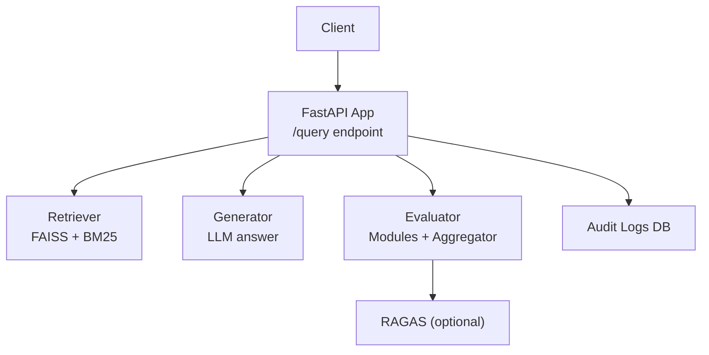
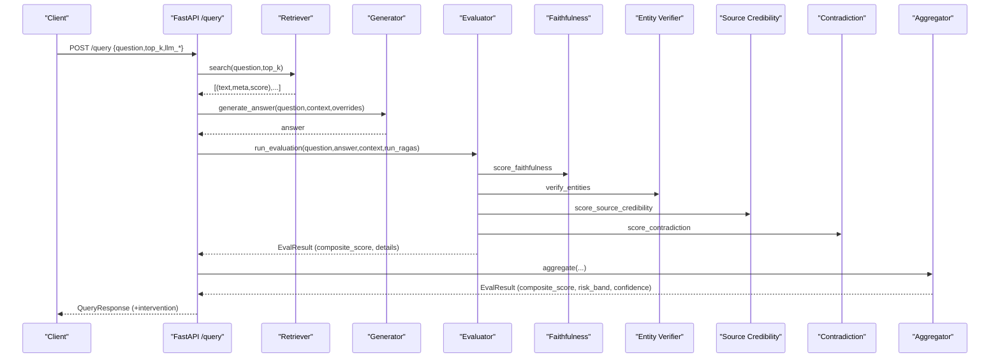
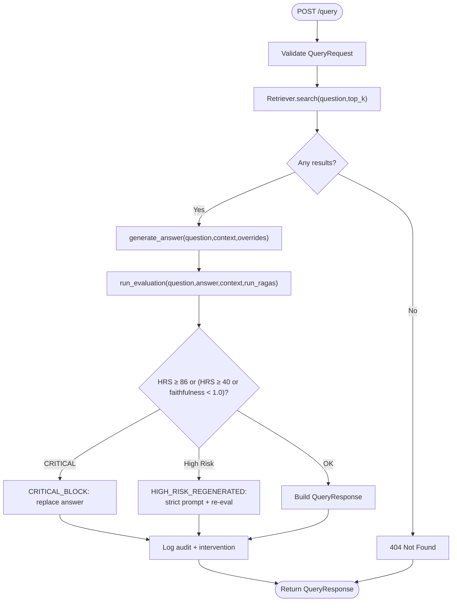
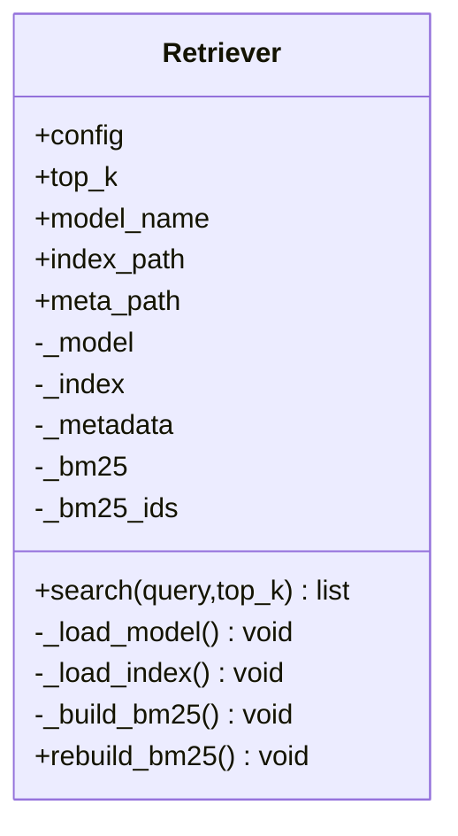
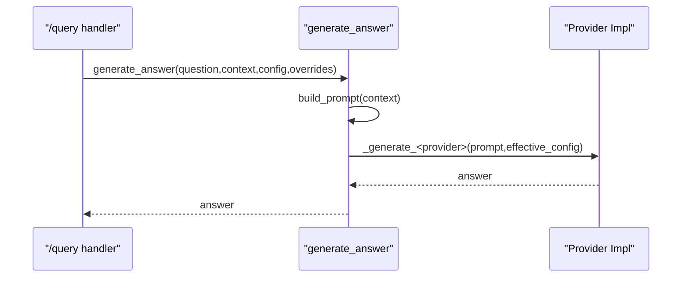
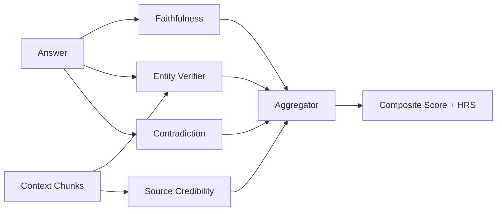
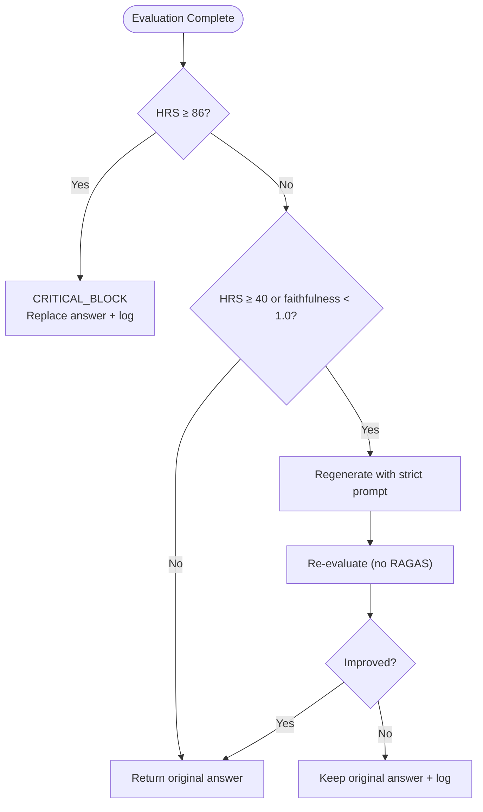
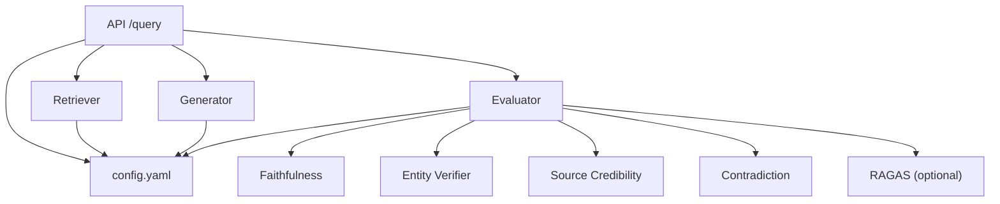

# Query Pipeline Endpoint

<cite>
**Referenced Files in This Document**
- [main.py](file://Backend/src/api/main.py)
- [schemas.py](file://Backend/src/api/schemas.py)
- [generator.py](file://Backend/src/pipeline/generator.py)
- [retriever.py](file://Backend/src/pipeline/retriever.py)
- [evaluate.py](file://Backend/src/evaluate.py)
- [aggregator.py](file://Backend/src/evaluation/aggregator.py)
- [ragas_eval.py](file://Backend/src/evaluation/ragas_eval.py)
- [faithfulness.py](file://Backend/src/modules/faithfulness.py)
- [entity_verifier.py](file://Backend/src/modules/entity_verifier.py)
- [source_credibility.py](file://Backend/src/modules/source_credibility.py)
- [contradiction.py](file://Backend/src/modules/contradiction.py)
- [config.yaml](file://Backend/config.yaml)
- [test_api.py](file://Backend/tests/test_api.py)
</cite>

## Table of Contents
1. [Introduction](#introduction)
2. [Project Structure](#project-structure)
3. [Core Components](#core-components)
4. [Architecture Overview](#architecture-overview)
5. [Detailed Component Analysis](#detailed-component-analysis)
6. [Dependency Analysis](#dependency-analysis)
7. [Performance Considerations](#performance-considerations)
8. [Troubleshooting Guide](#troubleshooting-guide)
9. [Conclusion](#conclusion)

## Introduction
This document provides comprehensive API documentation for the POST /query endpoint that powers the complete end-to-end MediRAG pipeline. It covers the request and response schemas, the full workflow from FAISS retrieval through LLM generation to safety evaluation, the intelligent intervention system, practical configuration examples, error handling, thread-safety, performance optimization, and integration patterns for healthcare applications requiring real-time medical Q&A with safety guarantees.

## Project Structure
The API is implemented using FastAPI and organized into modular packages:
- API layer: endpoints, request/response schemas, and orchestration
- Pipeline layer: retriever, generator, and ingestion utilities
- Evaluation layer: module-based evaluators and aggregator
- Configuration: YAML-driven settings for retrieval, modules, LLM, and logging

**Diagram sources**
- [main.py:308-520](file://Backend/src/api/main.py#L308-L520)
- [retriever.py:39-250](file://Backend/src/pipeline/retriever.py#L39-L250)
- [generator.py:344-462](file://Backend/src/pipeline/generator.py#L344-L462)
- [evaluate.py:49-167](file://Backend/src/evaluate.py#L49-L167)
- [ragas_eval.py:81-178](file://Backend/src/evaluation/ragas_eval.py#L81-L178)

**Section sources**
- [main.py:156-173](file://Backend/src/api/main.py#L156-L173)
- [config.yaml:1-66](file://Backend/config.yaml#L1-L66)

## Core Components
- Endpoint: POST /query
- Request schema: QueryRequest with question, top_k, llm_provider, llm_model, llm_api_key, ollama_url, run_ragas, inject_hallucination
- Response schema: QueryResponse with generated_answer, retrieved_chunks, composite_score, hrs, confidence_level, risk_band, module_results, total_pipeline_ms, and intervention fields

Key behaviors:
- Retrieval: top_k context chunks from FAISS/BioBERT index
- Generation: grounded answer via configurable LLM provider (Gemini, OpenAI, Ollama, Mistral)
- Evaluation: faithfulness, entity verification, source credibility, contradiction detection, optional RAGAS
- Intervention: CRITICAL_BLOCK and HIGH_RISK_REGENERATION based on HRS thresholds

**Section sources**
- [schemas.py:146-231](file://Backend/src/api/schemas.py#L146-L231)
- [main.py:308-520](file://Backend/src/api/main.py#L308-L520)

## Architecture Overview
The /query endpoint orchestrates a four-stage pipeline with integrated safety:

**Diagram sources**
- [main.py:308-520](file://Backend/src/api/main.py#L308-L520)
- [retriever.py:149-250](file://Backend/src/pipeline/retriever.py#L149-L250)
- [generator.py:344-462](file://Backend/src/pipeline/generator.py#L344-L462)
- [evaluate.py:49-167](file://Backend/src/evaluate.py#L49-L167)
- [aggregator.py:47-167](file://Backend/src/evaluation/aggregator.py#L47-L167)

## Detailed Component Analysis

### Endpoint Definition and Workflow
- URL: POST /query
- Purpose: End-to-end pipeline from retrieval to evaluation with safety intervention
- Validation: Pydantic validation enforces question length, top_k bounds, and optional overrides
- Safety: Intervention loop applies CRITICAL_BLOCK or HIGH_RISK_REGENERATION based on HRS and faithfulness

**Diagram sources**
- [main.py:308-520](file://Backend/src/api/main.py#L308-L520)

**Section sources**
- [main.py:308-520](file://Backend/src/api/main.py#L308-L520)
- [schemas.py:146-231](file://Backend/src/api/schemas.py#L146-L231)

### Retrieval Pipeline (FAISS + BM25)
- Uses BioBERT SentenceTransformer for embeddings
- FAISS IndexFlatIP with cosine similarity
- Hybrid search with Reciprocal Rank Fusion (RRF)
- Lazy loading of model and index; graceful degradation if FAISS not available

**Diagram sources**
- [retriever.py:39-250](file://Backend/src/pipeline/retriever.py#L39-L250)

**Section sources**
- [retriever.py:149-250](file://Backend/src/pipeline/retriever.py#L149-L250)
- [config.yaml:1-10](file://Backend/config.yaml#L1-L10)

### LLM Generation and Provider Overrides
- Supports Gemini, OpenAI, Ollama, and Mistral
- Per-request overrides: provider, api_key, model, ollama_url
- Deterministic judge prompts vs. natural generation prompts
- Strict prompt mode for high-risk regeneration

**Diagram sources**
- [generator.py:344-462](file://Backend/src/pipeline/generator.py#L344-L462)

**Section sources**
- [generator.py:344-462](file://Backend/src/pipeline/generator.py#L344-L462)
- [config.yaml:44-52](file://Backend/config.yaml#L44-L52)

### Evaluation Modules and Aggregation
- Faithfulness: DeBERTa cross-encoder NLI over claims vs. context
- Entity Verifier: SciSpaCy NER + RxNorm cache/API for drug verification
- Source Credibility: Evidence tier scoring from metadata or keywords
- Contradiction: NLI-based detection with keyword overlap filter
- Aggregator: Weighted composite with non-linear penalties and risk bands

**Diagram sources**
- [evaluate.py:49-167](file://Backend/src/evaluate.py#L49-L167)
- [aggregator.py:47-167](file://Backend/src/evaluation/aggregator.py#L47-L167)
- [faithfulness.py:86-234](file://Backend/src/modules/faithfulness.py#L86-L234)
- [entity_verifier.py:146-283](file://Backend/src/modules/entity_verifier.py#L146-L283)
- [source_credibility.py:121-200](file://Backend/src/modules/source_credibility.py#L121-L200)
- [contradiction.py:94-251](file://Backend/src/modules/contradiction.py#L94-L251)

**Section sources**
- [evaluate.py:49-167](file://Backend/src/evaluate.py#L49-L167)
- [aggregator.py:47-167](file://Backend/src/evaluation/aggregator.py#L47-L167)
- [ragas_eval.py:81-178](file://Backend/src/evaluation/ragas_eval.py#L81-L178)

### Safety Intervention System
- CRITICAL_BLOCK: HRS ≥ 86 → block response and return a safe message
- HIGH_RISK_REGENERATION: HRS ≥ 40 or faithfulness < 1.0 → regenerate with strict prompt, re-evaluate (skip RAGAS on retry), and record intervention details

**Diagram sources**
- [main.py:413-485](file://Backend/src/api/main.py#L413-L485)

**Section sources**
- [main.py:413-485](file://Backend/src/api/main.py#L413-L485)

### Audit Logging and Database
- SQLite table stores audit logs with fields for endpoint, question, answer, HRS, risk band, composite score, latency, intervention, and details
- Thread-safe ingestion endpoint uses a lock to prevent concurrent FAISS updates

**Section sources**
- [main.py:75-120](file://Backend/src/api/main.py#L75-L120)
- [main.py:524-603](file://Backend/src/api/main.py#L524-L603)

## Dependency Analysis
- API depends on Retriever, Generator, and Evaluator modules
- Evaluator composes Faithfulness, Entity Verifier, Source Credibility, Contradiction, and optionally RAGAS
- Configuration drives model selection, timeouts, and scoring weights

**Diagram sources**
- [main.py:308-520](file://Backend/src/api/main.py#L308-L520)
- [evaluate.py:49-167](file://Backend/src/evaluate.py#L49-L167)
- [config.yaml:1-66](file://Backend/config.yaml#L1-L66)

**Section sources**
- [main.py:308-520](file://Backend/src/api/main.py#L308-L520)
- [evaluate.py:49-167](file://Backend/src/evaluate.py#L49-L167)
- [config.yaml:1-66](file://Backend/config.yaml#L1-L66)

## Performance Considerations
- Startup warm-up: DeBERTa and Retriever are pre-warmed at app startup to avoid cold-start latency
- Model reuse: Generator reuses the retriever’s SentenceTransformer to avoid double loading
- Latency-aware design: RAGAS is optional and disabled by default; skipped on regeneration to reduce latency
- Concurrency: FAISS ingestion is protected by a thread lock to prevent corruption during dynamic updates
- Tokenization and batching: Modules use efficient segmentation and batching to manage inference costs

[No sources needed since this section provides general guidance]

## Troubleshooting Guide
Common issues and resolutions:
- Missing FAISS index: The endpoint raises 503 with a clear message when the FAISS index is not found
- LLM unavailability: The endpoint raises 503 when the configured LLM provider is unreachable
- Empty or invalid queries: Validation errors return 422; ensure question meets minimum length and top_k is within bounds
- No relevant documents: Returns 404 when retrieval yields no results
- Safety intervention: Responses may be blocked or regenerated; check intervention_applied, intervention_reason, and intervention_details in the response

Operational checks:
- Health endpoint: GET /health indicates whether Ollama is reachable
- Audit logs: Use GET /logs and GET /stats to inspect historical evaluations and intervention statistics

**Section sources**
- [main.py:326-347](file://Backend/src/api/main.py#L326-L347)
- [main.py:387-391](file://Backend/src/api/main.py#L387-L391)
- [main.py:206-217](file://Backend/src/api/main.py#L206-L217)
- [test_api.py:46-54](file://Backend/tests/test_api.py#L46-L54)

## Conclusion
The POST /query endpoint delivers a robust, safety-guaranteed, real-time medical Q&A pipeline. It integrates FAISS/BM25 retrieval, configurable LLM generation, comprehensive evaluation modules, and intelligent intervention mechanisms. With thread-safe operations, performance optimizations, and clear error handling, it is suitable for healthcare applications requiring reliable, auditable, and safe responses.