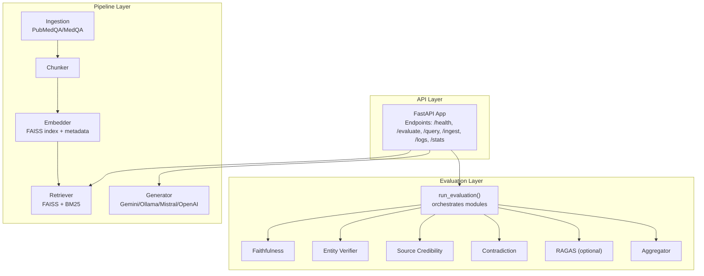
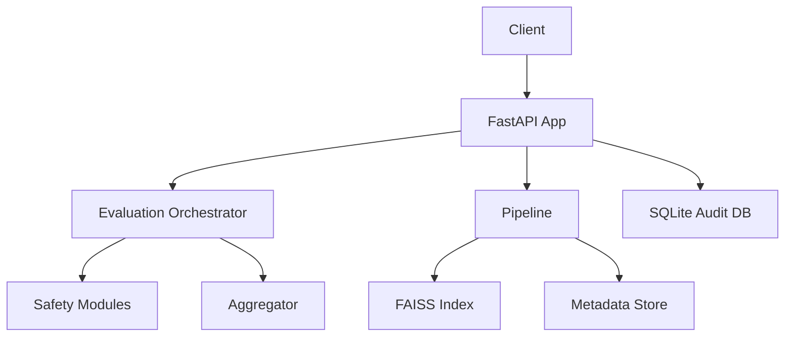
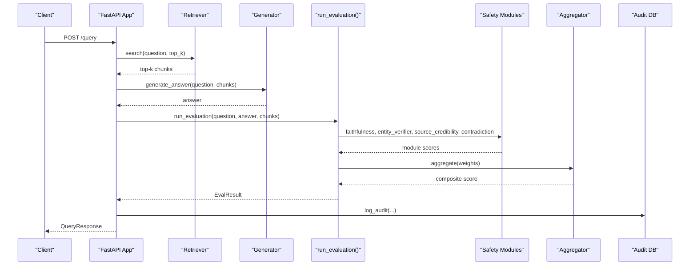
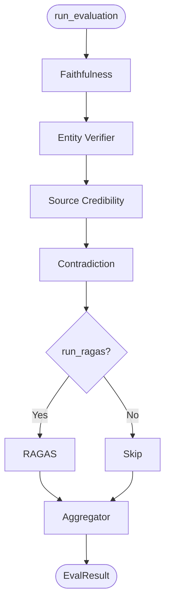
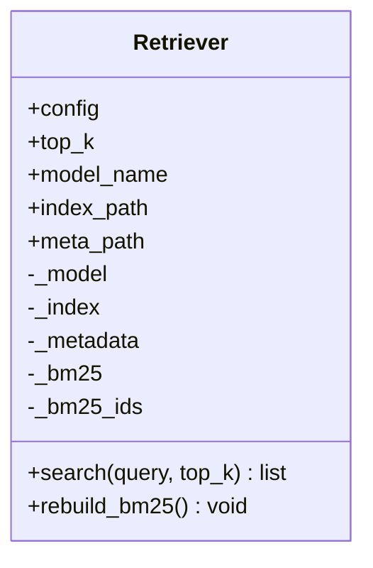
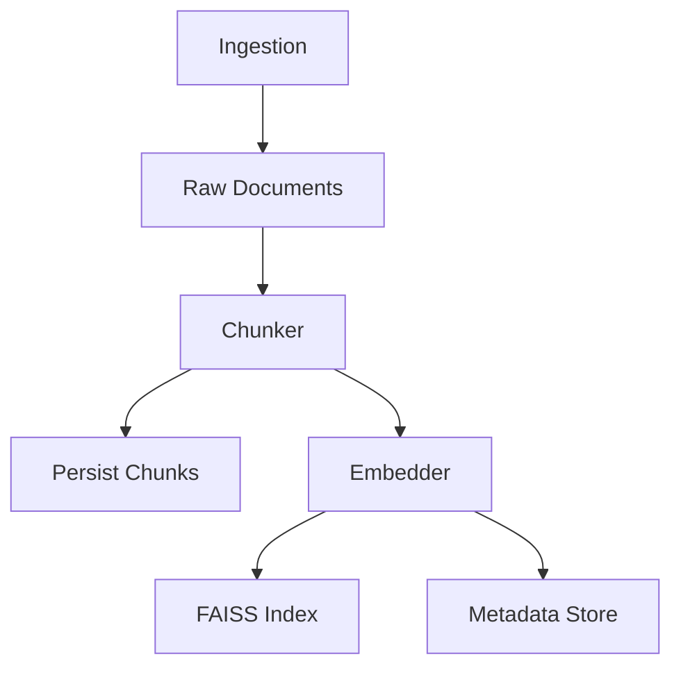
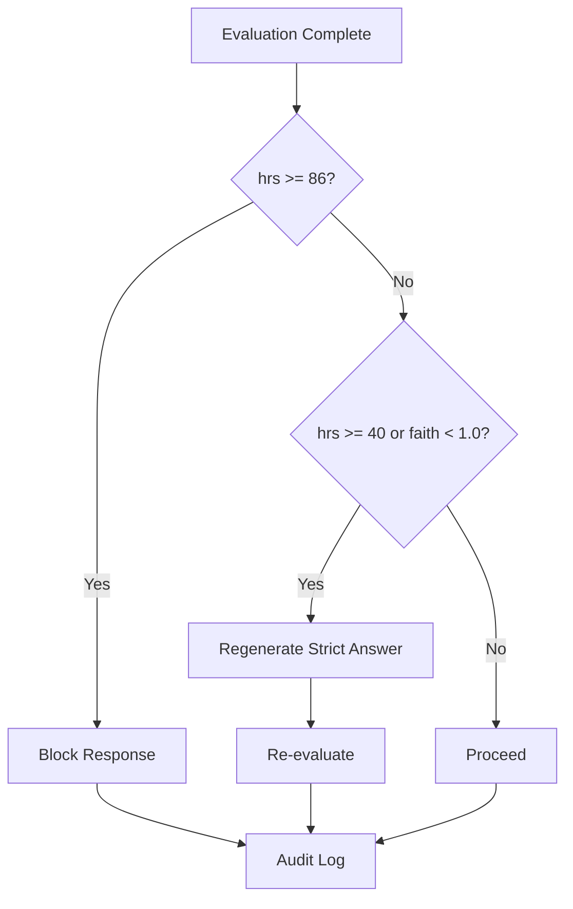
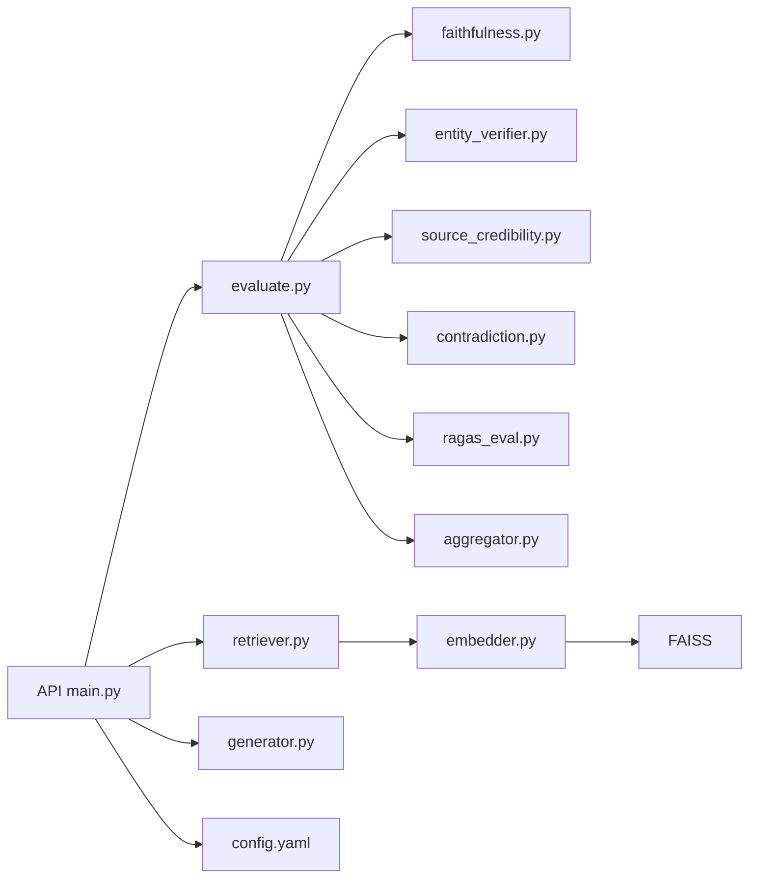

# Backend Architecture

<cite>
**Referenced Files in This Document**
- [main.py](file://Backend/src/api/main.py)
- [evaluate.py](file://Backend/src/evaluate.py)
- [aggregator.py](file://Backend/src/evaluation/aggregator.py)
- [ragas_eval.py](file://Backend/src/evaluation/ragas_eval.py)
- [faithfulness.py](file://Backend/src/modules/faithfulness.py)
- [entity_verifier.py](file://Backend/src/modules/entity_verifier.py)
- [source_credibility.py](file://Backend/src/modules/source_credibility.py)
- [contradiction.py](file://Backend/src/modules/contradiction.py)
- [base.py](file://Backend/src/modules/base.py)
- [retriever.py](file://Backend/src/pipeline/retriever.py)
- [generator.py](file://Backend/src/pipeline/generator.py)
- [chunker.py](file://Backend/src/pipeline/chunker.py)
- [embedder.py](file://Backend/src/pipeline/embedder.py)
- [ingest.py](file://Backend/src/pipeline/ingest.py)
- [config.yaml](file://Backend/config.yaml)
</cite>

## Table of Contents
1. [Introduction](#introduction)
2. [Project Structure](#project-structure)
3. [Core Components](#core-components)
4. [Architecture Overview](#architecture-overview)
5. [Detailed Component Analysis](#detailed-component-analysis)
6. [Dependency Analysis](#dependency-analysis)
7. [Performance Considerations](#performance-considerations)
8. [Troubleshooting Guide](#troubleshooting-guide)
9. [Conclusion](#conclusion)

## Introduction
This document describes the backend architecture of MediRAG 3.0, a FastAPI-based evaluation and retrieval system for medical answers. It focuses on the high-level design combining:
- An evaluation pipeline that assesses LLM-generated answers using four safety modules and optional RAGAS scoring
- API endpoints for health checks, evaluation, end-to-end query, ingestion, and dashboard access
- Data processing components for document ingestion, chunking, embedding, and FAISS-backed hybrid retrieval

Key technical decisions include:
- Four-layer safety evaluation approach (faithfulness, entity verification, source credibility, contradiction risk)
- Thread-safe concurrent ingestion updates to FAISS
- Hybrid retrieval strategy (FAISS semantic + BM25 keyword with Reciprocal Rank Fusion)
- Composite scoring with risk bands and confidence levels
- Intervention loop to block or regenerate unsafe answers

## Project Structure
The backend is organized around a layered FastAPI application:
- API layer: endpoints and orchestration
- Evaluation layer: four safety modules and aggregator
- Pipeline layer: retriever, generator, chunker, embedder, ingest
- Configuration: YAML-driven settings for models, retrieval, and API limits

**Diagram sources**
- [main.py:156-165](file://Backend/src/api/main.py#L156-L165)
- [evaluate.py:49-167](file://Backend/src/evaluate.py#L49-L167)
- [aggregator.py:47-166](file://Backend/src/evaluation/aggregator.py#L47-L166)
- [retriever.py:39-250](file://Backend/src/pipeline/retriever.py#L39-L250)
- [generator.py:344-461](file://Backend/src/pipeline/generator.py#L344-L461)
- [chunker.py:20-82](file://Backend/src/pipeline/chunker.py#L20-L82)
- [embedder.py:139-163](file://Backend/src/pipeline/embedder.py#L139-L163)
- [ingest.py:212-246](file://Backend/src/pipeline/ingest.py#L212-L246)

**Section sources**
- [main.py:156-165](file://Backend/src/api/main.py#L156-L165)
- [config.yaml:1-66](file://Backend/config.yaml#L1-L66)

## Core Components
- FastAPI application with CORS middleware, logging, SQLite audit logging, and lifespan hooks for model warm-up
- Evaluation orchestrator that runs all modules and aggregates results into a composite score and Health Risk Score (HRS)
- Four safety modules:
  - Faithfulness: cross-encoder NLI to measure entailment vs. retrieved context
  - Entity Verifier: SciSpaCy NER + RxNorm cache/API for drug/condition verification
  - Source Credibility: evidence tier classification from metadata or keyword matching
  - Contradiction: pairwise NLI to detect contradictions between answer and context
- Optional RAGAS module for faithfulness and answer relevancy using external LLM backends
- Aggregator: weighted combination of module scores with non-linear penalties and risk band mapping
- Pipeline components:
  - Retriever: FAISS semantic + BM25 keyword with Reciprocal Rank Fusion
  - Generator: provider-agnostic answer generation (Gemini, Ollama, Mistral, OpenAI)
  - Chunker and Embedder: LangChain chunking and FAISS index construction
  - Ingestion: PubMedQA and MedQA datasets with chunk persistence

**Section sources**
- [main.py:125-149](file://Backend/src/api/main.py#L125-L149)
- [evaluate.py:49-167](file://Backend/src/evaluate.py#L49-L167)
- [faithfulness.py:86-233](file://Backend/src/modules/faithfulness.py#L86-L233)
- [entity_verifier.py:146-282](file://Backend/src/modules/entity_verifier.py#L146-L282)
- [source_credibility.py:121-199](file://Backend/src/modules/source_credibility.py#L121-L199)
- [contradiction.py:94-250](file://Backend/src/modules/contradiction.py#L94-L250)
- [ragas_eval.py:81-177](file://Backend/src/evaluation/ragas_eval.py#L81-L177)
- [aggregator.py:47-166](file://Backend/src/evaluation/aggregator.py#L47-L166)
- [retriever.py:39-250](file://Backend/src/pipeline/retriever.py#L39-L250)
- [generator.py:344-461](file://Backend/src/pipeline/generator.py#L344-L461)
- [chunker.py:20-82](file://Backend/src/pipeline/chunker.py#L20-L82)
- [embedder.py:139-163](file://Backend/src/pipeline/embedder.py#L139-L163)
- [ingest.py:212-246](file://Backend/src/pipeline/ingest.py#L212-L246)

## Architecture Overview
The system follows a microservice-like internal architecture with clear separation of concerns:
- API layer exposes endpoints and coordinates evaluation and retrieval
- Evaluation layer encapsulates safety logic and scoring
- Pipeline layer manages data preparation and retrieval
- Configuration drives model selection, resource limits, and behavior

**Diagram sources**
- [main.py:206-302](file://Backend/src/api/main.py#L206-L302)
- [evaluate.py:49-167](file://Backend/src/evaluate.py#L49-L167)
- [aggregator.py:47-166](file://Backend/src/evaluation/aggregator.py#L47-L166)
- [retriever.py:39-250](file://Backend/src/pipeline/retriever.py#L39-L250)
- [embedder.py:117-137](file://Backend/src/pipeline/embedder.py#L117-L137)

## Detailed Component Analysis

### API Endpoints and Control Flow
- Health endpoint returns service status and Ollama availability
- Evaluate endpoint validates inputs, runs the evaluation pipeline, and returns composite score and HRS
- Query endpoint performs end-to-end: retrieval → generation → evaluation → intervention loop → audit logging
- Ingest endpoint adds new documents to FAISS and metadata atomically with thread-safety
- Logs and stats endpoints support dashboard analytics

**Diagram sources**
- [main.py:308-519](file://Backend/src/api/main.py#L308-L519)
- [evaluate.py:49-167](file://Backend/src/evaluate.py#L49-L167)
- [aggregator.py:47-166](file://Backend/src/evaluation/aggregator.py#L47-L166)
- [retriever.py:149-250](file://Backend/src/pipeline/retriever.py#L149-L250)
- [generator.py:344-461](file://Backend/src/pipeline/generator.py#L344-L461)

**Section sources**
- [main.py:206-302](file://Backend/src/api/main.py#L206-L302)
- [main.py:308-519](file://Backend/src/api/main.py#L308-L519)
- [main.py:526-603](file://Backend/src/api/main.py#L526-L603)

### Evaluation Pipeline and Safety Modules
- Orchestrator coordinates module execution and captures per-module details
- Faithfulness: claim segmentation and cross-encoder NLI scoring
- Entity Verifier: NER with RxNorm cache/API and contextual presence checks
- Source Credibility: tier-based weighting from metadata or keyword matching
- Contradiction: pairwise NLI with keyword overlap filtering
- RAGAS: optional faithfulness and answer relevancy using external LLM
- Aggregator: weighted composite with non-linear penalties and risk band mapping

**Diagram sources**
- [evaluate.py:49-167](file://Backend/src/evaluate.py#L49-L167)
- [aggregator.py:47-166](file://Backend/src/evaluation/aggregator.py#L47-L166)
- [ragas_eval.py:81-177](file://Backend/src/evaluation/ragas_eval.py#L81-L177)
- [faithfulness.py:86-233](file://Backend/src/modules/faithfulness.py#L86-L233)
- [entity_verifier.py:146-282](file://Backend/src/modules/entity_verifier.py#L146-L282)
- [source_credibility.py:121-199](file://Backend/src/modules/source_credibility.py#L121-L199)
- [contradiction.py:94-250](file://Backend/src/modules/contradiction.py#L94-L250)

**Section sources**
- [evaluate.py:49-167](file://Backend/src/evaluate.py#L49-L167)
- [aggregator.py:47-166](file://Backend/src/evaluation/aggregator.py#L47-L166)
- [ragas_eval.py:81-177](file://Backend/src/evaluation/ragas_eval.py#L81-L177)

### Retrieval and Hybrid Strategy
- FAISS semantic search with L2-normalized BioBERT vectors
- BM25 keyword search over chunk texts
- Reciprocal Rank Fusion to combine both signals
- Lazy loading of model and index; BM25 rebuilt on ingestion updates

**Diagram sources**
- [retriever.py:39-250](file://Backend/src/pipeline/retriever.py#L39-L250)

**Section sources**
- [retriever.py:39-250](file://Backend/src/pipeline/retriever.py#L39-L250)
- [embedder.py:117-137](file://Backend/src/pipeline/embedder.py#L117-L137)

### Data Ingestion, Chunking, and Embedding
- Ingestion loads datasets and saves raw documents and chunks
- Chunker applies LangChain recursive splitting with configurable size/overlap
- Embedder encodes chunks with BioBERT, builds FAISS index, and persists metadata

**Diagram sources**
- [ingest.py:212-246](file://Backend/src/pipeline/ingest.py#L212-L246)
- [chunker.py:20-82](file://Backend/src/pipeline/chunker.py#L20-L82)
- [embedder.py:139-163](file://Backend/src/pipeline/embedder.py#L139-L163)

**Section sources**
- [ingest.py:212-246](file://Backend/src/pipeline/ingest.py#L212-L246)
- [chunker.py:20-82](file://Backend/src/pipeline/chunker.py#L20-L82)
- [embedder.py:139-163](file://Backend/src/pipeline/embedder.py#L139-L163)

### Intervention Loop and Audit Logging
- After evaluation, the system applies safety gates:
  - CRITICAL_BLOCK: HRS threshold blocks unsafe responses
  - HIGH_RISK_REGENERATED: strict prompt regeneration and re-evaluation
- Audit logs capture request/response, HRS, risk band, latency, and intervention details

**Diagram sources**
- [main.py:413-485](file://Backend/src/api/main.py#L413-L485)
- [main.py:97-119](file://Backend/src/api/main.py#L97-L119)

**Section sources**
- [main.py:413-485](file://Backend/src/api/main.py#L413-L485)
- [main.py:97-119](file://Backend/src/api/main.py#L97-L119)

## Dependency Analysis
- API depends on evaluation orchestrator and pipeline components
- Evaluation orchestrator depends on all four safety modules and aggregator
- Retriever depends on FAISS and optional BM25; embedder depends on FAISS and metadata
- Generator supports multiple providers and uses per-request overrides
- Configuration centralizes model names, thresholds, and API limits

**Diagram sources**
- [main.py:47-49](file://Backend/src/api/main.py#L47-L49)
- [evaluate.py:34-40](file://Backend/src/evaluate.py#L34-L40)
- [retriever.py:28-34](file://Backend/src/pipeline/retriever.py#L28-L34)
- [embedder.py:23-25](file://Backend/src/pipeline/embedder.py#L23-L25)
- [generator.py:34-38](file://Backend/src/pipeline/generator.py#L34-L38)
- [config.yaml:1-66](file://Backend/config.yaml#L1-L66)

**Section sources**
- [main.py:47-49](file://Backend/src/api/main.py#L47-L49)
- [evaluate.py:34-40](file://Backend/src/evaluate.py#L34-L40)
- [retriever.py:28-34](file://Backend/src/pipeline/retriever.py#L28-L34)
- [embedder.py:23-25](file://Backend/src/pipeline/embedder.py#L23-L25)
- [generator.py:34-38](file://Backend/src/pipeline/generator.py#L34-L38)
- [config.yaml:1-66](file://Backend/config.yaml#L1-L66)

## Performance Considerations
- Model warm-up at startup to avoid cold-start latency for DeBERTa and Retriever
- FAISS L2-normalization enables cosine similarity via inner product for efficient similarity search
- Batch sizes and token limits configured to balance accuracy and throughput
- RAGAS disabled by default; enabled only when external LLM backend is available
- Thread-safe ingestion with atomic writes to FAISS and metadata stores
- Latency tracking per module and pipeline for observability

[No sources needed since this section provides general guidance]

## Troubleshooting Guide
Common issues and resolutions:
- FAISS index not found: ensure embedding pipeline has been executed and index files exist
- Ollama not reachable: verify local Ollama service and base URL configuration
- Empty or invalid evaluation results: confirm input lengths and chunk counts adhere to API limits
- RxNorm cache missing: provide a populated cache or enable live API fallback
- SQLite audit DB errors: check permissions and path configuration

Operational endpoints:
- Health check endpoint for service and Ollama status
- Logs endpoint for recent audit records
- Stats endpoint for aggregated metrics and intervention counts

**Section sources**
- [main.py:179-185](file://Backend/src/api/main.py#L179-L185)
- [main.py:608-648](file://Backend/src/api/main.py#L608-L648)
- [retriever.py:80-114](file://Backend/src/pipeline/retriever.py#L80-L114)
- [entity_verifier.py:89-117](file://Backend/src/modules/entity_verifier.py#L89-L117)

## Conclusion
MediRAG 3.0’s backend combines a robust FastAPI application with a modular evaluation pipeline and efficient retrieval infrastructure. The four-layer safety approach, hybrid retrieval strategy, and intervention loop provide strong safeguards for medical AI applications. Configuration-driven behavior and thread-safe ingestion enable scalable deployment, while comprehensive logging and metrics support operational monitoring.