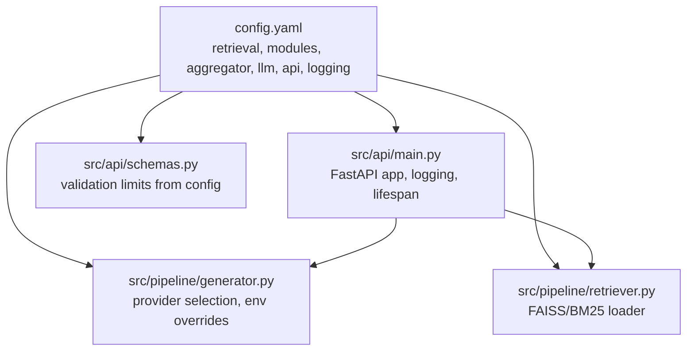
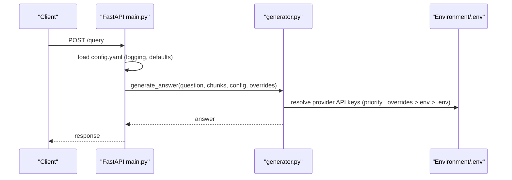
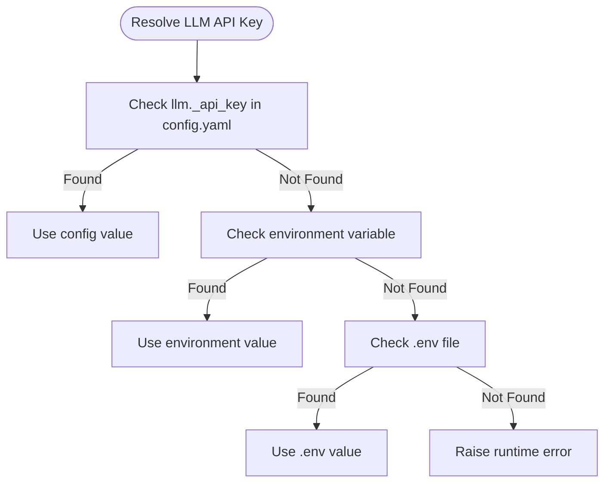
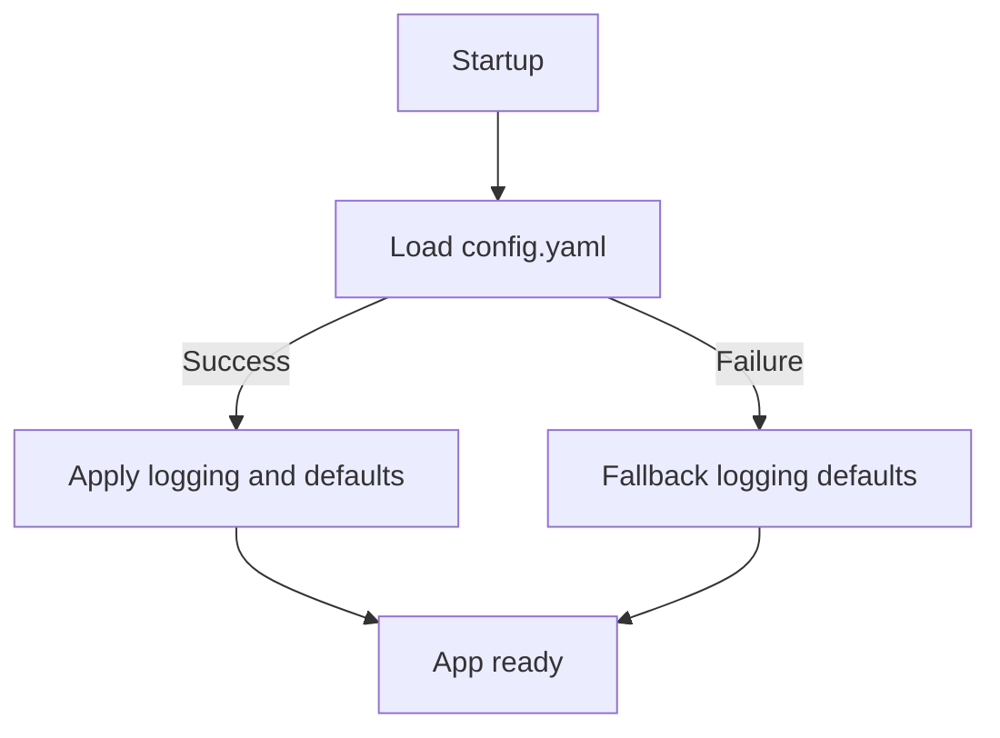
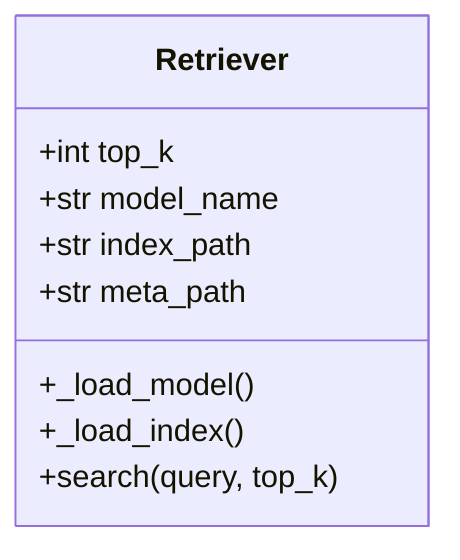
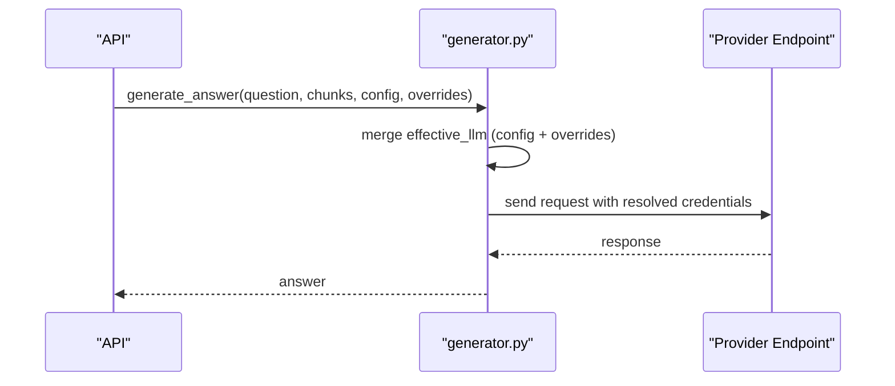
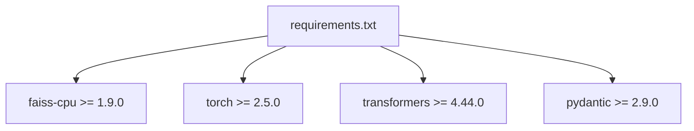

# Configuration Management

<cite>
**Referenced Files in This Document**
- [config.yaml](file://config.yaml)
- [main.py](file://src/api/main.py)
- [schemas.py](file://src/api/schemas.py)
- [generator.py](file://src/pipeline/generator.py)
- [retriever.py](file://src/pipeline/retriever.py)
- [requirements.txt](file://requirements.txt)
</cite>

## Table of Contents
1. [Introduction](#introduction)
2. [Project Structure](#project-structure)
3. [Core Components](#core-components)
4. [Architecture Overview](#architecture-overview)
5. [Detailed Component Analysis](#detailed-component-analysis)
6. [Dependency Analysis](#dependency-analysis)
7. [Performance Considerations](#performance-considerations)
8. [Troubleshooting Guide](#troubleshooting-guide)
9. [Conclusion](#conclusion)
10. [Appendices](#appendices)

## Introduction
This document explains configuration management for the MediRAG backend system. It covers the YAML configuration structure, environment variable handling, default value fallbacks, validation, and how configuration is consumed across the API, retrieval, generation, and evaluation subsystems. It also provides deployment scenarios, security considerations for sensitive data, troubleshooting guidance, and performance tuning recommendations.

## Project Structure
Configuration is centralized in a single YAML file and consumed by the FastAPI application, retrieval pipeline, and generation pipeline. The API validates request sizes against configuration-defined limits, while the generation module resolves provider credentials from environment variables or optional overrides.

**Diagram sources**
- [config.yaml](file://config.yaml)
- [main.py](file://src/api/main.py)
- [generator.py](file://src/pipeline/generator.py)
- [retriever.py](file://src/pipeline/retriever.py)
- [schemas.py](file://src/api/schemas.py)

**Section sources**
- [config.yaml](file://config.yaml)
- [main.py](file://src/api/main.py)
- [schemas.py](file://src/api/schemas.py)

## Core Components
- YAML configuration structure
  - retrieval: top_k, chunk_size, chunk_overlap, embedding_model, index_path, metadata_path
  - modules: faithfulness, entity_verifier, source_credibility, contradiction
  - aggregator: weights and risk bands
  - llm: provider, provider-specific keys, model, base_url, timeouts, temperatures
  - api: host, port, max_* limits for validation
  - logging: level, file, format
- Environment variable handling
  - Gemini: GEMINI_API_KEY
  - OpenAI: OPENAI_API_KEY
  - Mistral: MISTRAL_API_KEY
  - Optional .env support for providers
- Validation
  - Pydantic models enforce request size limits and structure
  - API-level checks for Ollama availability and FAISS index presence

**Section sources**
- [config.yaml](file://config.yaml)
- [generator.py](file://src/pipeline/generator.py)
- [schemas.py](file://src/api/schemas.py)
- [main.py](file://src/api/main.py)

## Architecture Overview
Configuration flows from YAML into runtime components during application startup and per-request processing. The API loads configuration for logging and default LLM settings, while the generation module resolves provider credentials from environment variables or per-request overrides.

**Diagram sources**
- [main.py](file://src/api/main.py)
- [generator.py](file://src/pipeline/generator.py)

## Detailed Component Analysis

### YAML Configuration Structure
- retrieval
  - top_k: number of chunks returned by hybrid search
  - chunk_size, chunk_overlap: chunking parameters for ingestion
  - embedding_model: SentenceTransformer model name for FAISS index
  - index_path, metadata_path: FAISS index and metadata store locations
- modules
  - faithfulness: DeBERTa cross-encoder model, thresholds, token limits, truncation side, batch size
  - entity_verifier: SciSpaCy model, critical entity types, dosage tolerance, RxNorm API URL and timeout, cache path
  - source_credibility: method ("keyword" or "metadata"), tier weights
  - contradiction: shared DeBERTa model, confidence threshold, max sentence pairs, batch size
- aggregator
  - weights: per-module weight vector for composite scoring
  - risk_bands: score ranges mapped to risk categories
- llm
  - provider: "gemini", "ollama", "mistral", "openai"
  - provider-specific keys and settings
  - model, base_url, timeout_seconds, judge_temperature, generation_temperature
- api
  - host, port, max_query_length, max_answer_length, max_chunks, max_chunk_length
- logging
  - level, file, format

**Section sources**
- [config.yaml](file://config.yaml)

### Environment Variable Handling and Overrides
- Gemini
  - Resolved from llm.gemini_api_key in config.yaml, then GEMINI_API_KEY in the environment, then .env file
- OpenAI
  - Resolved from llm.openai_api_key in config.yaml, then OPENAI_API_KEY in the environment, then .env file
- Mistral
  - Resolved from llm.mistral_api_key in config.yaml, then MISTRAL_API_KEY in the environment
- Ollama
  - Uses llm.base_url and llm.model from config.yaml; configurable per-request via ollama_url override
- Per-request overrides
  - /query and /evaluate accept llm_provider, llm_api_key, llm_model, ollama_url to override server defaults

**Diagram sources**
- [generator.py](file://src/pipeline/generator.py)

**Section sources**
- [generator.py](file://src/pipeline/generator.py)
- [main.py](file://src/api/main.py)

### Default Value Fallbacks and Validation
- API logging defaults
  - If config.yaml cannot be loaded, logging defaults to INFO level and basic format
- API host/port defaults
  - If config.yaml cannot be loaded, defaults are applied at runtime
- Request validation
  - Pydantic models enforce max_query_length, max_answer_length, max_chunks, max_chunk_length
  - Minimum lengths and required fields are validated
- Runtime checks
  - Ollama availability checked via HTTP probe
  - FAISS index existence enforced during retrieval

**Diagram sources**
- [main.py](file://src/api/main.py)
- [schemas.py](file://src/api/schemas.py)

**Section sources**
- [main.py](file://src/api/main.py)
- [schemas.py](file://src/api/schemas.py)

### Retrieval Configuration Consumption
- Retriever reads retrieval.top_k, embedding_model, index_path, metadata_path
- Lazy loading of FAISS index and metadata; graceful degradation if FAISS not installed
- Hybrid search with Reciprocal Rank Fusion; BM25 fallback if FAISS unavailable

**Diagram sources**
- [retriever.py](file://src/pipeline/retriever.py)

**Section sources**
- [retriever.py](file://src/pipeline/retriever.py)
- [config.yaml](file://config.yaml)

### Generation Configuration Consumption
- Provider selection from llm.provider
- Per-provider credential resolution with precedence
- Temperature and timeout derived from llm.* settings
- Per-request overrides supported for provider, model, and base_url

**Diagram sources**
- [main.py](file://src/api/main.py)
- [generator.py](file://src/pipeline/generator.py)

**Section sources**
- [generator.py](file://src/pipeline/generator.py)
- [main.py](file://src/api/main.py)

### API Settings and Request Validation
- API host/port configured in config.yaml
- Pydantic validators enforce:
  - Max query length, max answer length, max chunks, max chunk length
  - Presence of required fields
- Per-request overrides for LLM provider, model, and base_url

**Section sources**
- [config.yaml](file://config.yaml)
- [schemas.py](file://src/api/schemas.py)
- [main.py](file://src/api/main.py)

## Dependency Analysis
- YAML parsing and consumption
  - FastAPI app loads config.yaml for logging and default LLM base_url
  - Generator loads config.yaml for provider defaults
  - Retriever loads config.yaml for FAISS/BM25 parameters
- External dependencies
  - FAISS CPU version pinned to >= 1.9.0
  - Transformers and torch versions pinned for Python 3.13 compatibility
  - Pydantic >= 2.9.0 for stability

**Diagram sources**
- [requirements.txt](file://requirements.txt)

**Section sources**
- [requirements.txt](file://requirements.txt)

## Performance Considerations
- Retrieval
  - Adjust retrieval.top_k to balance recall and latency
  - Tune chunk_size and chunk_overlap for domain-specific trade-offs
  - Ensure FAISS installation for optimal semantic search performance
- Generation
  - Increase llm.timeout_seconds for larger models or slower backends
  - Use appropriate generation_temperature for desired answer quality vs. determinism
  - Consider provider choice: cloud APIs (Gemini/OpenAI/Mistral) vs. local Ollama
- Modules
  - Faithfulness and contradiction DeBERTa batch sizes can be tuned per hardware capacity
  - Entity verification RxNorm cache reduces live API calls and improves latency
- API
  - Reduce max_chunks and max_query_length for constrained environments
  - Monitor Ollama availability to avoid retries and degraded performance

[No sources needed since this section provides general guidance]

## Troubleshooting Guide
- Configuration not found or unreadable
  - Symptom: logging defaults to INFO, API host/port may not match expectations
  - Action: verify config.yaml path and permissions; ensure YAML syntax is valid
- Missing FAISS index
  - Symptom: 503/404 errors on retrieval
  - Action: build FAISS index and metadata store before starting the service
- Ollama connectivity issues
  - Symptom: 503 on /query; Ollama probe fails
  - Action: confirm Ollama is running and base_url matches; increase llm.timeout_seconds if needed
- Missing API keys
  - Symptom: runtime errors indicating missing provider API key
  - Action: set environment variables or update config.yaml; ensure .env file is readable
- Validation errors
  - Symptom: 422 responses for oversized queries or too many chunks
  - Action: adjust api.max_* settings in config.yaml or reduce request payload
- Model loading failures
  - Symptom: module stubs or warnings during NLI/NER loading
  - Action: install required packages (sentence-transformers, scispacy, etc.) and ensure model availability

**Section sources**
- [main.py](file://src/api/main.py)
- [generator.py](file://src/pipeline/generator.py)
- [retriever.py](file://src/pipeline/retriever.py)
- [schemas.py](file://src/api/schemas.py)

## Conclusion
MediRAG’s configuration is centralized in a single YAML file and consumed consistently across the API, retrieval, and generation layers. Robust environment variable handling and per-request overrides enable flexible deployments. Pydantic validation and runtime checks ensure predictable behavior. By tuning retrieval parameters, generation settings, and module configurations, teams can optimize for development, GPU-enabled inference, and production workloads while maintaining strong security and reliability.

[No sources needed since this section summarizes without analyzing specific files]

## Appendices

### Deployment Scenarios

- Local development
  - Use Ollama with Mistral; ensure llm.provider is "ollama" and base_url points to local service
  - Keep logging.level at INFO; adjust api.host/port as needed
  - Example overrides: llm_provider="ollama", ollama_url="http://localhost:11434"
- GPU-enabled inference
  - Prefer cloud providers (Gemini/OpenAI/Mistral) for faster generation
  - Set provider-specific API keys via environment variables
  - Increase generation_temperature for more creative answers; adjust timeouts accordingly
- Production
  - Use cloud providers for reliability; store API keys in environment variables
  - Enable structured logging to file; set logging.level to WARNING or INFO depending on operational needs
  - Harden FAISS/BM25 paths and ensure atomic index updates during ingestion

[No sources needed since this section provides general guidance]

### Security Considerations
- Store API keys in environment variables or secrets managers; avoid committing to config.yaml
- Restrict file permissions on config.yaml and logs directory
- Use HTTPS endpoints and secure transport for external APIs (e.g., RxNorm)
- Avoid logging sensitive data; sanitize request/response payloads in logs

[No sources needed since this section provides general guidance]