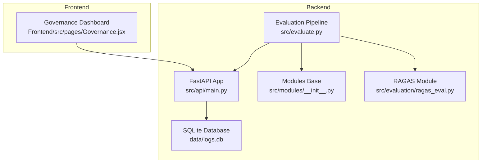
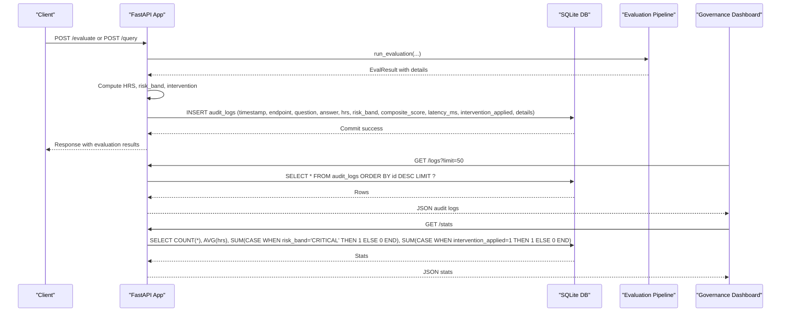
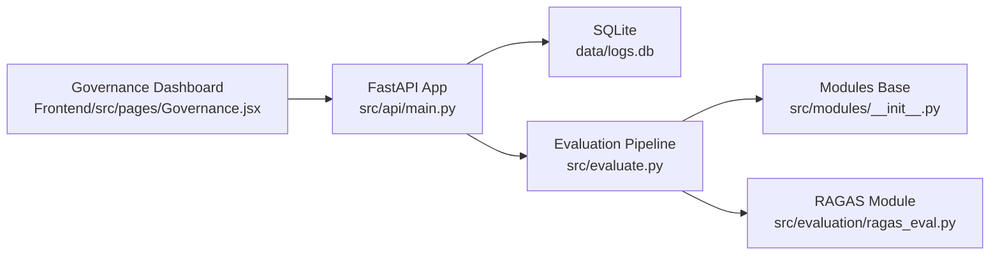

# Database and Logging System

<cite>
**Referenced Files in This Document**
- [main.py](file://Backend/src/api/main.py)
- [config.yaml](file://Backend/config.yaml)
- [evaluate.py](file://Backend/src/evaluate.py)
- [Governance.jsx](file://Frontend/src/pages/Governance.jsx)
- [__init__.py](file://Backend/src/modules/__init__.py)
- [ragas_eval.py](file://Backend/src/evaluation/ragas_eval.py)
</cite>

## Table of Contents
1. [Introduction](#introduction)
2. [Project Structure](#project-structure)
3. [Core Components](#core-components)
4. [Architecture Overview](#architecture-overview)
5. [Detailed Component Analysis](#detailed-component-analysis)
6. [Dependency Analysis](#dependency-analysis)
7. [Performance Considerations](#performance-considerations)
8. [Troubleshooting Guide](#troubleshooting-guide)
9. [Conclusion](#conclusion)
10. [Appendices](#appendices)

## Introduction
This document provides comprehensive data model documentation for the SQLite-based audit logging system used by the MediRAG evaluation pipeline. It details the audit_logs table schema, logging configuration, audit trail generation, and data persistence mechanisms. It also explains the relationship between API requests and audit records, including timestamp formatting and JSON serialization of evaluation details. Practical examples of querying audit logs, generating compliance reports, and analyzing system performance trends are included, along with database maintenance, backup strategies, and data retention policies.

## Project Structure
The audit logging system is implemented within the backend FastAPI application and integrates with the evaluation pipeline and governance dashboard:
- Backend FastAPI application initializes the SQLite database and defines the audit_logs table schema.
- The evaluation pipeline generates audit records for both /evaluate and /query endpoints.
- The governance dashboard consumes audit data via /logs and /stats endpoints to present dashboards and compliance reports.



**Diagram sources**
- [main.py:75-120](file://Backend/src/api/main.py#L75-L120)
- [evaluate.py:49-167](file://Backend/src/evaluate.py#L49-L167)
- [__init__.py:15-43](file://Backend/src/modules/__init__.py#L15-L43)
- [ragas_eval.py:81-177](file://Backend/src/evaluation/ragas_eval.py#L81-L177)
- [Governance.jsx:17-61](file://Frontend/src/pages/Governance.jsx#L17-L61)

**Section sources**
- [main.py:75-120](file://Backend/src/api/main.py#L75-L120)
- [evaluate.py:49-167](file://Backend/src/evaluate.py#L49-L167)
- [Governance.jsx:17-61](file://Frontend/src/pages/Governance.jsx#L17-L61)

## Core Components
- Audit Logs Table Schema: Defines the structure of the audit_logs table, including primary key, timestamps, endpoint, question, answer, risk metrics, latency, intervention flag, and serialized details.
- Logging Configuration: Initializes the SQLite database and creates the audit_logs table on application startup.
- Audit Trail Generation: Records evaluation outcomes and safety interventions for both evaluation and query endpoints.
- Data Persistence Mechanisms: Uses SQLite for local storage with JSON serialization for complex details.
- API Request Relationship: Each API call triggers an audit record creation with standardized fields and JSON-encoded details.
- Timestamp Formatting: UTC ISO 8601 format ensures global consistency.
- JSON Serialization: Evaluation details are serialized to TEXT for storage and later parsed by the frontend dashboard.

**Section sources**
- [main.py:75-120](file://Backend/src/api/main.py#L75-L120)
- [main.py:223-302](file://Backend/src/api/main.py#L223-L302)
- [main.py:308-519](file://Backend/src/api/main.py#L308-L519)

## Architecture Overview
The audit logging system follows a straightforward flow:
- On application startup, the database is initialized and the audit_logs table is created.
- During evaluation (/evaluate) and end-to-end query (/query), the system computes risk metrics and safety interventions, then logs an audit record.
- The governance dashboard retrieves historical audit data via /logs and aggregates statistics via /stats.



**Diagram sources**
- [main.py:75-120](file://Backend/src/api/main.py#L75-L120)
- [main.py:223-302](file://Backend/src/api/main.py#L223-L302)
- [main.py:308-519](file://Backend/src/api/main.py#L308-L519)
- [main.py:608-648](file://Backend/src/api/main.py#L608-L648)
- [Governance.jsx:17-61](file://Frontend/src/pages/Governance.jsx#L17-L61)

## Detailed Component Analysis

### Audit Logs Table Schema
The audit_logs table captures all relevant information for auditing and compliance:
- id: INTEGER PRIMARY KEY AUTOINCREMENT
- timestamp: TEXT (UTC ISO 8601)
- endpoint: TEXT (/evaluate or /query)
- question: TEXT (user query)
- answer: TEXT (generated or evaluated answer)
- hrs: INTEGER (Health Risk Score, 0–100)
- risk_band: TEXT (LOW, MODERATE, HIGH, CRITICAL)
- composite_score: REAL (0.0–1.0)
- latency_ms: INTEGER (total pipeline latency)
- intervention_applied: BOOLEAN (safety intervention triggered)
- details: TEXT (JSON-serialized evaluation details)

Constraints and defaults:
- The table is created with IF NOT EXISTS to ensure idempotent initialization.
- The timestamp column stores UTC ISO 8601 strings.
- The details column stores JSON text for complex evaluation results.

Data types and relationships:
- All columns except details are scalar values suitable for analytics.
- The details column contains a JSON blob with module results and metadata.

**Section sources**
- [main.py:79-95](file://Backend/src/api/main.py#L79-L95)
- [main.py:101-115](file://Backend/src/api/main.py#L101-L115)

### Logging Configuration and Initialization
- Database initialization: The init_db function ensures the data directory exists and connects to data/logs.db, creating the audit_logs table if it does not exist.
- Application lifecycle: The lifespan manager calls init_db at startup to guarantee the table exists before handling requests.
- Logging configuration: The backend uses YAML-based logging configuration for console output; audit logs are stored separately in SQLite.

**Section sources**
- [main.py:75-95](file://Backend/src/api/main.py#L75-L95)
- [main.py:125-149](file://Backend/src/api/main.py#L125-L149)
- [config.yaml:62-66](file://Backend/config.yaml#L62-L66)

### Audit Trail Generation
- Endpoint coverage:
  - /evaluate: Logs evaluation results with module breakdown and confidence level.
  - /query: Logs end-to-end pipeline results, including safety interventions and regeneration details.
- Risk computation:
  - Composite score is converted to HRS (0–100) and mapped to risk bands (LOW, MODERATE, HIGH, CRITICAL).
- Intervention tracking:
  - intervention_applied indicates whether the safety gate blocked or regenerated a response.
- Details serialization:
  - The details dictionary is JSON-serialized and stored in the details column for later parsing by the dashboard.

**Section sources**
- [main.py:223-302](file://Backend/src/api/main.py#L223-L302)
- [main.py:308-519](file://Backend/src/api/main.py#L308-L519)
- [evaluate.py:49-167](file://Backend/src/evaluate.py#L49-L167)
- [__init__.py:15-43](file://Backend/src/modules/__init__.py#L15-L43)

### Data Persistence Mechanisms
- Storage: SQLite database file data/logs.db.
- Connection pattern: Each log operation opens a connection, executes an INSERT statement, commits, and closes the connection.
- Error handling: Exceptions during logging are caught and logged as errors; the application continues operating.
- Retrieval: The /logs endpoint fetches recent records ordered by id descending; the /stats endpoint aggregates counts and averages.

**Section sources**
- [main.py:75-120](file://Backend/src/api/main.py#L75-L120)
- [main.py:608-648](file://Backend/src/api/main.py#L608-L648)

### Relationship Between API Requests and Audit Records
- /evaluate: Creates a record with endpoint="evaluate", storing evaluation results and confidence level.
- /query: Creates a record with endpoint="query", including intervention details and regeneration outcomes.
- Timestamps: UTC ISO 8601 strings ensure consistent time representation across deployments.
- JSON details: Complex evaluation results are serialized to TEXT for storage and later parsed by the frontend.

**Section sources**
- [main.py:223-302](file://Backend/src/api/main.py#L223-L302)
- [main.py:308-519](file://Backend/src/api/main.py#L308-L519)

### Governance Dashboard Integration
- Data retrieval: The dashboard fetches /stats and /logs endpoints to populate KPIs and audit tables.
- Timestamp formatting: Frontend converts stored timestamps to local time for display.
- Risk band visualization: Risk bands are mapped to colored badges for quick assessment.
- Compliance reporting: The dashboard includes a compliance report generator that uses aggregated statistics.

**Section sources**
- [Governance.jsx:17-61](file://Frontend/src/pages/Governance.jsx#L17-L61)
- [Governance.jsx:223-258](file://Frontend/src/pages/Governance.jsx#L223-L258)

### Practical Examples

#### Querying Audit Logs
- Fetch recent logs:
  - GET /logs?limit=50
  - Returns an array of audit records ordered by id descending.
- Filter by risk band:
  - Use SQL WHERE clauses on risk_band (e.g., risk_band='CRITICAL').
- Export for analysis:
  - Use the CSV export button in the audit log view to download a CSV snapshot.

#### Generating Compliance Reports
- Use /stats to gather:
  - Total evaluations, average HRS, critical alerts, and interventions.
- Combine with /logs to include raw records and module breakdowns.
- The governance dashboard’s compliance report generator produces a structured document summarizing findings.

#### Analyzing System Performance Trends
- Monthly averages:
  - Use SQL grouping by year-month substring of timestamp to compute average HRS over time.
- Intervention trends:
  - Count interventions per month to track safety gate activity.
- Module failure breakdown:
  - Aggregate module results from details JSON to identify recurring issues.

**Section sources**
- [main.py:621-648](file://Backend/src/api/main.py#L621-L648)
- [Governance.jsx:262-328](file://Frontend/src/pages/Governance.jsx#L262-L328)

## Dependency Analysis
The audit logging system depends on:
- FastAPI for routing and request handling.
- SQLite for local persistence.
- Evaluation pipeline modules for computing risk metrics and safety interventions.
- YAML configuration for logging settings.



**Diagram sources**
- [main.py:75-120](file://Backend/src/api/main.py#L75-L120)
- [evaluate.py:49-167](file://Backend/src/evaluate.py#L49-L167)
- [__init__.py:15-43](file://Backend/src/modules/__init__.py#L15-L43)
- [ragas_eval.py:81-177](file://Backend/src/evaluation/ragas_eval.py#L81-L177)
- [Governance.jsx:17-61](file://Frontend/src/pages/Governance.jsx#L17-L61)

**Section sources**
- [main.py:75-120](file://Backend/src/api/main.py#L75-L120)
- [evaluate.py:49-167](file://Backend/src/evaluate.py#L49-L167)
- [Governance.jsx:17-61](file://Frontend/src/pages/Governance.jsx#L17-L61)

## Performance Considerations
- Connection management: Opening and closing connections per log operation is lightweight but can be optimized by pooling connections for high-throughput scenarios.
- JSON serialization overhead: Serializing complex details adds CPU overhead; consider compressing or partitioning details for large-scale deployments.
- Query performance: The /logs endpoint uses ORDER BY id DESC with LIMIT; ensure the id column is indexed (default primary key) for efficient retrieval.
- Disk I/O: Frequent INSERT operations can impact disk performance; batch writes or asynchronous logging can mitigate contention.

[No sources needed since this section provides general guidance]

## Troubleshooting Guide
- Database connectivity:
  - Verify that the data directory exists and is writable.
  - Ensure the SQLite file path is correct and accessible.
- Audit record insertion failures:
  - Check for exceptions caught during logging and review backend logs for error messages.
- Dashboard data refresh:
  - Confirm that /logs and /stats endpoints are reachable and returning JSON.
  - Validate that timestamps are correctly parsed and formatted in the frontend.

**Section sources**
- [main.py:75-120](file://Backend/src/api/main.py#L75-L120)
- [main.py:608-648](file://Backend/src/api/main.py#L608-L648)
- [Governance.jsx:17-61](file://Frontend/src/pages/Governance.jsx#L17-L61)

## Conclusion
The SQLite-based audit logging system provides a robust foundation for capturing evaluation outcomes, safety interventions, and performance metrics. Its schema is designed for simplicity and analyzability, while JSON serialization preserves rich evaluation details. The integration with the governance dashboard enables real-time monitoring, compliance reporting, and trend analysis. Proper maintenance, backups, and retention policies will ensure long-term reliability and regulatory compliance.

[No sources needed since this section summarizes without analyzing specific files]

## Appendices

### Appendix A: Audit Logs Table Definition
```sql
CREATE TABLE IF NOT EXISTS audit_logs (
    id INTEGER PRIMARY KEY AUTOINCREMENT,
    timestamp TEXT,
    endpoint TEXT,
    question TEXT,
    answer TEXT,
    hrs INTEGER,
    risk_band TEXT,
    composite_score REAL,
    latency_ms INTEGER,
    intervention_applied BOOLEAN,
    details TEXT
);
```

**Section sources**
- [main.py:79-95](file://Backend/src/api/main.py#L79-L95)

### Appendix B: Timestamp and JSON Serialization Notes
- Timestamp format: UTC ISO 8601 string stored in the timestamp column.
- JSON serialization: The details column stores a JSON string representing evaluation results and metadata.

**Section sources**
- [main.py:105-115](file://Backend/src/api/main.py#L105-L115)
- [main.py:492-497](file://Backend/src/api/main.py#L492-L497)

### Appendix C: Governance Dashboard Endpoints
- GET /logs?limit=N: Returns recent audit records ordered by id descending.
- GET /stats: Returns aggregated statistics including total evaluations, average HRS, critical alerts, interventions, and monthly averages.

**Section sources**
- [main.py:608-648](file://Backend/src/api/main.py#L608-L648)
- [Governance.jsx:17-61](file://Frontend/src/pages/Governance.jsx#L17-L61)