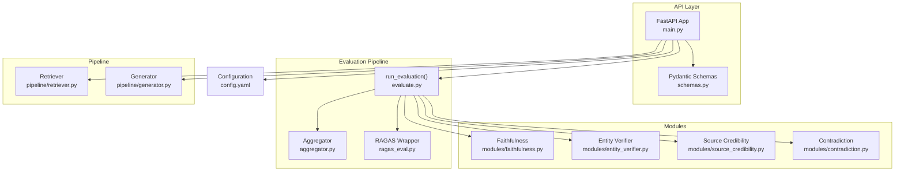
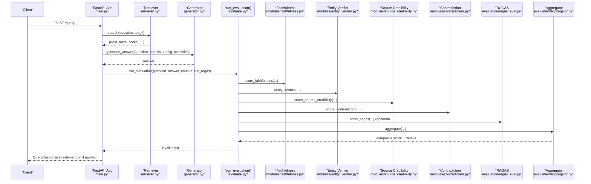
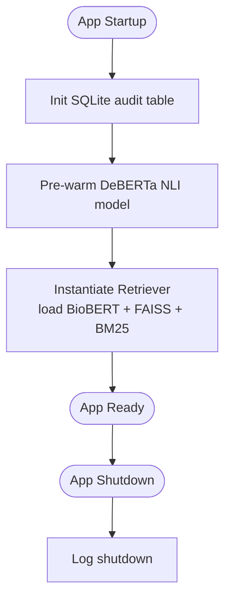
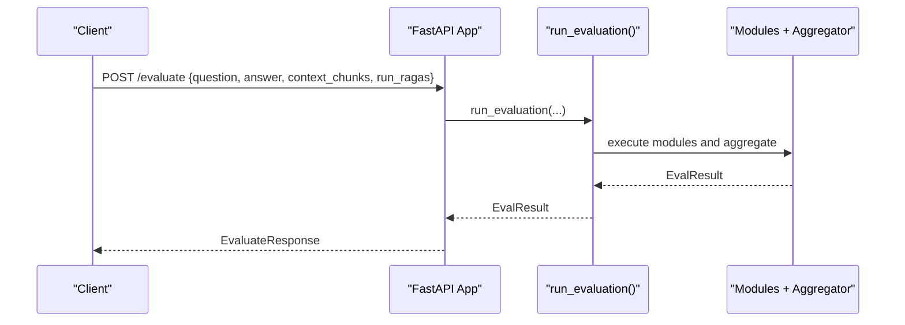
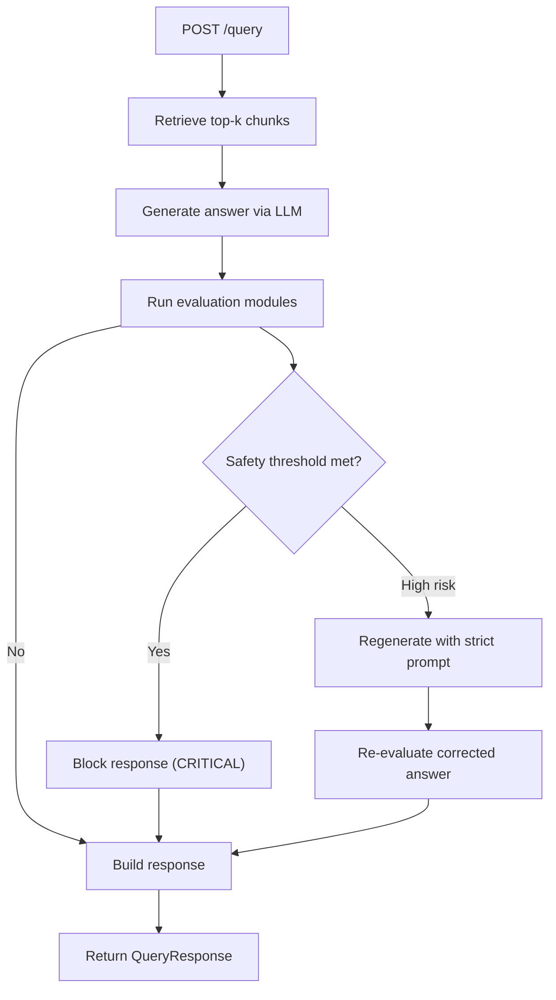
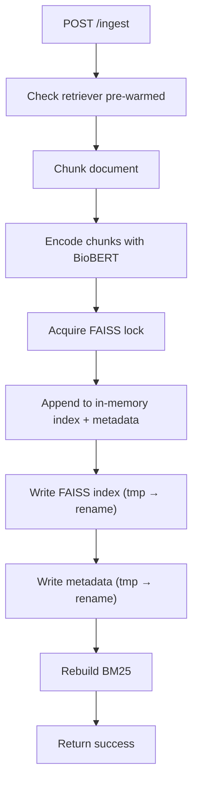

# FastAPI Application Structure

<cite>
**Referenced Files in This Document**
- [main.py](file://Backend/src/api/main.py)
- [schemas.py](file://Backend/src/api/schemas.py)
- [__init__.py](file://Backend/src/__init__.py)
- [config.yaml](file://Backend/config.yaml)
- [evaluate.py](file://Backend/src/evaluate.py)
- [faithfulness.py](file://Backend/src/modules/faithfulness.py)
- [entity_verifier.py](file://Backend/src/modules/entity_verifier.py)
- [source_credibility.py](file://Backend/src/modules/source_credibility.py)
- [contradiction.py](file://Backend/src/modules/contradiction.py)
- [retriever.py](file://Backend/src/pipeline/retriever.py)
- [generator.py](file://Backend/src/pipeline/generator.py)
- [aggregator.py](file://Backend/src/evaluation/aggregator.py)
- [ragas_eval.py](file://Backend/src/evaluation/ragas_eval.py)
</cite>

## Table of Contents
1. [Introduction](#introduction)
2. [Project Structure](#project-structure)
3. [Core Components](#core-components)
4. [Architecture Overview](#architecture-overview)
5. [Detailed Component Analysis](#detailed-component-analysis)
6. [Dependency Analysis](#dependency-analysis)
7. [Performance Considerations](#performance-considerations)
8. [Troubleshooting Guide](#troubleshooting-guide)
9. [Conclusion](#conclusion)
10. [Appendices](#appendices)

## Introduction
This document explains the FastAPI application structure for the MediRAG API server. It covers application initialization, middleware configuration, lifespan management for model pre-warming, core endpoint handlers (/health, /evaluate, /query, /ingest), dashboard endpoints (/logs, /stats), request/response schema definitions and validation, error handling strategies, performance optimization techniques, CORS configuration, logging setup, and thread-safe operations. Practical client integration examples and common use cases are included to guide developers building against the API.

## Project Structure
The backend is organized around a modular FastAPI application with clearly separated concerns:
- API layer: FastAPI app definition, endpoints, and schemas
- Evaluation pipeline: orchestration and scoring modules
- Modules: domain-specific evaluation components
- Pipeline: retrieval and generation utilities
- Configuration: YAML-driven runtime configuration

**Diagram sources**
- [main.py:156-173](file://Backend/src/api/main.py#L156-L173)
- [schemas.py:1-232](file://Backend/src/api/schemas.py#L1-L232)
- [evaluate.py:49-167](file://Backend/src/evaluate.py#L49-L167)
- [aggregator.py:47-166](file://Backend/src/evaluation/aggregator.py#L47-L166)
- [ragas_eval.py:81-177](file://Backend/src/evaluation/ragas_eval.py#L81-L177)
- [faithfulness.py:86-233](file://Backend/src/modules/faithfulness.py#L86-L233)
- [entity_verifier.py:146-282](file://Backend/src/modules/entity_verifier.py#L146-L282)
- [source_credibility.py:121-199](file://Backend/src/modules/source_credibility.py#L121-L199)
- [contradiction.py:94-250](file://Backend/src/modules/contradiction.py#L94-L250)
- [retriever.py:149-250](file://Backend/src/pipeline/retriever.py#L149-L250)
- [generator.py:344-461](file://Backend/src/pipeline/generator.py#L344-L461)
- [config.yaml:1-66](file://Backend/config.yaml#L1-L66)

**Section sources**
- [main.py:156-173](file://Backend/src/api/main.py#L156-L173)
- [schemas.py:1-232](file://Backend/src/api/schemas.py#L1-L232)
- [config.yaml:1-66](file://Backend/config.yaml#L1-L66)

## Core Components
- Application initialization and lifespan:
  - The FastAPI app is created with a lifespan manager that pre-warms the DeBERTa NLI model and initializes the Retriever (BioBERT + FAISS index) to avoid cold-start latency on the first request.
  - Database initialization ensures audit logging tables exist.
- Middleware:
  - CORS is enabled to allow all origins and methods for development and local deployment scenarios.
- Logging:
  - Root logging is configured from config.yaml with file and stream handlers. The API also sets up logging early via package initialization.

Key responsibilities:
- /health: liveness and dependency checks (Ollama availability)
- /evaluate: standalone evaluation of a question-answer-context triple
- /query: end-to-end pipeline (retrieve → generate → evaluate → safety intervention)
- /ingest: thread-safe dynamic ingestion into FAISS and BM25
- /logs and /stats: dashboard data access

**Section sources**
- [main.py:125-149](file://Backend/src/api/main.py#L125-L149)
- [main.py:156-173](file://Backend/src/api/main.py#L156-L173)
- [main.py:206-217](file://Backend/src/api/main.py#L206-L217)
- [main.py:223-302](file://Backend/src/api/main.py#L223-L302)
- [main.py:308-519](file://Backend/src/api/main.py#L308-L519)
- [main.py:526-603](file://Backend/src/api/main.py#L526-L603)
- [main.py:608-648](file://Backend/src/api/main.py#L608-L648)
- [__init__.py:10-44](file://Backend/src/__init__.py#L10-L44)
- [config.yaml:62-66](file://Backend/config.yaml#L62-L66)

## Architecture Overview
The API orchestrates a hybrid retrieval and generation pipeline with robust evaluation and safety gates.

**Diagram sources**
- [main.py:308-519](file://Backend/src/api/main.py#L308-L519)
- [retriever.py:149-250](file://Backend/src/pipeline/retriever.py#L149-L250)
- [generator.py:344-461](file://Backend/src/pipeline/generator.py#L344-L461)
- [evaluate.py:49-167](file://Backend/src/evaluate.py#L49-L167)
- [faithfulness.py:86-233](file://Backend/src/modules/faithfulness.py#L86-L233)
- [entity_verifier.py:146-282](file://Backend/src/modules/entity_verifier.py#L146-L282)
- [source_credibility.py:121-199](file://Backend/src/modules/source_credibility.py#L121-L199)
- [contradiction.py:94-250](file://Backend/src/modules/contradiction.py#L94-L250)
- [ragas_eval.py:81-177](file://Backend/src/evaluation/ragas_eval.py#L81-L177)
- [aggregator.py:47-166](file://Backend/src/evaluation/aggregator.py#L47-L166)

## Detailed Component Analysis

### Application Initialization and Lifespan Management
- Lifespan pre-warming:
  - DeBERTa NLI model is loaded once at startup to eliminate cold-start delays.
  - Retriever is instantiated and FAISS/BM25 indices are prepared.
- Database initialization:
  - Audit log table is created on startup to persist evaluation and query outcomes.
- CORS:
  - Enabled for all origins/methods to support local development and cross-origin dashboards.

**Diagram sources**
- [main.py:125-149](file://Backend/src/api/main.py#L125-L149)
- [main.py:75-95](file://Backend/src/api/main.py#L75-L95)

**Section sources**
- [main.py:125-149](file://Backend/src/api/main.py#L125-L149)
- [main.py:75-95](file://Backend/src/api/main.py#L75-L95)

### Middleware Configuration (CORS)
- All origins allowed for development and local deployments.
- Methods and headers are unrestricted to simplify integration.

**Section sources**
- [main.py:168-173](file://Backend/src/api/main.py#L168-L173)

### Logging Setup
- Root logging configured from config.yaml with level, file, and format.
- Package-level initialization ensures logging is set up on first import.
- API endpoints and modules use structured logging with contextual messages.

**Section sources**
- [__init__.py:10-44](file://Backend/src/__init__.py#L10-L44)
- [config.yaml:62-66](file://Backend/config.yaml#L62-L66)
- [main.py:54-68](file://Backend/src/api/main.py#L54-L68)

### Endpoint Handlers

#### GET /health
- Purpose: liveness and dependency check for Ollama.
- Response: status, ollama availability, and version.

**Section sources**
- [main.py:206-217](file://Backend/src/api/main.py#L206-L217)
- [schemas.py:135-139](file://Backend/src/api/schemas.py#L135-L139)

#### POST /evaluate
- Purpose: evaluate a provided question-answer-context triple.
- Validation: Pydantic models enforce input limits and structure.
- Behavior: runs all modules and optionally RAGAS; returns composite score, HRS, risk band, and module breakdown.

**Diagram sources**
- [main.py:223-302](file://Backend/src/api/main.py#L223-L302)
- [evaluate.py:49-167](file://Backend/src/evaluate.py#L49-L167)

**Section sources**
- [main.py:223-302](file://Backend/src/api/main.py#L223-L302)
- [schemas.py:41-133](file://Backend/src/api/schemas.py#L41-L133)

#### POST /query
- Purpose: end-to-end pipeline with retrieval, generation, evaluation, and safety intervention.
- Steps:
  - Retrieve top-k chunks using Retriever.
  - Generate grounded answer using configured LLM provider.
  - Evaluate answer with all modules and optional RAGAS.
  - Apply safety gates: block or regenerate based on HRS and faithfulness.
- Response: includes answer, retrieved chunks, HRS, risk band, module results, and intervention details.

**Diagram sources**
- [main.py:308-519](file://Backend/src/api/main.py#L308-L519)
- [retriever.py:149-250](file://Backend/src/pipeline/retriever.py#L149-L250)
- [generator.py:344-461](file://Backend/src/pipeline/generator.py#L344-L461)
- [evaluate.py:49-167](file://Backend/src/evaluate.py#L49-L167)

**Section sources**
- [main.py:308-519](file://Backend/src/api/main.py#L308-L519)
- [schemas.py:146-231](file://Backend/src/api/schemas.py#L146-L231)

#### POST /ingest
- Purpose: dynamically add new documents to FAISS and rebuild BM25.
- Thread-safety: uses a lock to prevent concurrent writes to FAISS and metadata.
- Atomic writes: temporary files are written then atomically renamed to avoid corruption.

**Diagram sources**
- [main.py:526-603](file://Backend/src/api/main.py#L526-L603)
- [retriever.py:115-143](file://Backend/src/pipeline/retriever.py#L115-L143)

**Section sources**
- [main.py:526-603](file://Backend/src/api/main.py#L526-L603)

#### GET /logs and GET /stats
- Purpose: expose audit logs and summary statistics for the dashboard.
- /logs: paginated recent entries.
- /stats: counts, averages, alerts, and monthly trends.

**Section sources**
- [main.py:608-648](file://Backend/src/api/main.py#L608-L648)

### Request/Response Schema Definitions and Validation
- Pydantic models define strict input validation and output schemas.
- Limits enforced by configuration:
  - Max query length, answer length, number of chunks, and chunk length.
- Example schemas:
  - EvaluateRequest/EvaluateResponse
  - QueryRequest/QueryResponse
  - ContextChunk, RetrievedChunk
  - HealthResponse
  - IngestRequest

Validation highlights:
- Length constraints and required fields.
- Field validators for chunk lists.
- Range constraints for scores and integer fields.

**Section sources**
- [schemas.py:15-232](file://Backend/src/api/schemas.py#L15-L232)
- [config.yaml:54-60](file://Backend/config.yaml#L54-L60)

### Safety Gates and Intervention Logic
- HRS thresholds:
  - CRITICAL (≥ 86): block response with a safety message.
  - HIGH (≥ 40): regenerate answer using a strict prompt and re-evaluate.
- Faithfulness threshold:
  - Low faithfulness (< 1.0) triggers high-risk regeneration.
- Intervention metadata:
  - Tracks whether intervention was applied, reason, original answer, and corrected scores.

**Section sources**
- [main.py:413-485](file://Backend/src/api/main.py#L413-L485)

### Audit Logging and Persistence
- SQLite table initialized on startup.
- Structured logging of endpoint, question, answer, HRS, risk band, composite score, latency, intervention, and details.
- Accessible via /logs and /stats endpoints.

**Section sources**
- [main.py:75-120](file://Backend/src/api/main.py#L75-L120)
- [main.py:608-648](file://Backend/src/api/main.py#L608-L648)

## Dependency Analysis
The API orchestrates a tight coupling between evaluation modules and the pipeline components, with loose coupling to external LLM providers and FAISS/BM25.

```mermaid
graph LR
API["API Endpoints<br/>main.py"] --> EVAL["Evaluation Orchestrator<br/>evaluate.py"]
EVAL --> MOD_F["Faithfulness"]
EVAL --> MOD_EV["Entity Verifier"]
EVAL --> MOD_SC["Source Credibility"]
EVAL --> MOD_CQ["Contradiction"]
EVAL --> RAGS["RAGAS"]
EVAL --> AGG["Aggregator"]
API --> RET["Retriever"]
API --> GEN["Generator"]
API --> CFG["config.yaml"]
```

**Diagram sources**
- [main.py:223-519](file://Backend/src/api/main.py#L223-L519)
- [evaluate.py:49-167](file://Backend/src/evaluate.py#L49-L167)
- [aggregator.py:47-166](file://Backend/src/evaluation/aggregator.py#L47-L166)
- [ragas_eval.py:81-177](file://Backend/src/evaluation/ragas_eval.py#L81-L177)
- [faithfulness.py:86-233](file://Backend/src/modules/faithfulness.py#L86-L233)
- [entity_verifier.py:146-282](file://Backend/src/modules/entity_verifier.py#L146-L282)
- [source_credibility.py:121-199](file://Backend/src/modules/source_credibility.py#L121-L199)
- [contradiction.py:94-250](file://Backend/src/modules/contradiction.py#L94-L250)
- [retriever.py:149-250](file://Backend/src/pipeline/retriever.py#L149-L250)
- [generator.py:344-461](file://Backend/src/pipeline/generator.py#L344-L461)
- [config.yaml:1-66](file://Backend/config.yaml#L1-L66)

**Section sources**
- [main.py:223-519](file://Backend/src/api/main.py#L223-L519)
- [evaluate.py:49-167](file://Backend/src/evaluate.py#L49-L167)

## Performance Considerations
- Model pre-warming:
  - DeBERTa and Retriever are warmed at startup to avoid cold-start latency.
- Lazy loading:
  - SentenceTransformers and FAISS/BM25 are loaded on demand to reduce startup overhead.
- Threading and atomic writes:
  - Locking and atomic file renames protect FAISS updates during ingestion.
- Latency-aware design:
  - Module-level caps on sentence pairs and context chunks bound computation.
- Optional RAGAS:
  - Disabled by default; enabled only when an LLM backend is available to reduce latency.

[No sources needed since this section provides general guidance]

## Troubleshooting Guide
Common issues and remedies:
- Ollama not available:
  - /health indicates unavailability; /query may fail with 503 if LLM generation is required.
- FAISS index missing:
  - /query returns 503 if FAISS index not found; /ingest requires pre-warmed retriever.
- Empty or invalid inputs:
  - Pydantic validation errors (422) for oversized queries, answers, or chunk counts.
- LLM provider errors:
  - Generator raises runtime errors for missing API keys, timeouts, or empty responses.
- Safety intervention:
  - Responses may be blocked or regenerated; check intervention fields in QueryResponse.

**Section sources**
- [main.py:179-185](file://Backend/src/api/main.py#L179-L185)
- [main.py:326-343](file://Backend/src/api/main.py#L326-L343)
- [main.py:387-391](file://Backend/src/api/main.py#L387-L391)
- [main.py:537-540](file://Backend/src/api/main.py#L537-L540)
- [schemas.py:41-90](file://Backend/src/api/schemas.py#L41-L90)

## Conclusion
The MediRAG FastAPI application is structured to deliver a robust, validated, and safe evaluation pipeline for medical QA systems. Its design emphasizes pre-warming, thread-safe ingestion, configurable logging, and clear safety gates. The schema-driven validation and modular evaluation components enable reliable integration and predictable performance across diverse deployment environments.

[No sources needed since this section summarizes without analyzing specific files]

## Appendices

### Practical Client Integration Examples
- Health check:
  - GET http://host:port/health
- Evaluate:
  - POST http://host:port/evaluate with EvaluateRequest payload
- Query:
  - POST http://host:port/query with QueryRequest payload
- Ingest:
  - POST http://host:port/ingest with IngestRequest payload
- Dashboard:
  - GET http://host:port/logs?limit=N
  - GET http://host:port/stats

[No sources needed since this section provides general guidance]

### Configuration Reference
- Retrieval: top_k, chunk sizes, embedding model, index paths
- Modules: thresholds and limits for each evaluation module
- Aggregator: weights and risk bands
- LLM: provider, credentials, timeouts, and model settings
- API: host/port and input validation limits
- Logging: level, file, and format

**Section sources**
- [config.yaml:1-66](file://Backend/config.yaml#L1-L66)