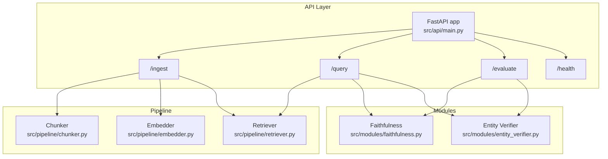
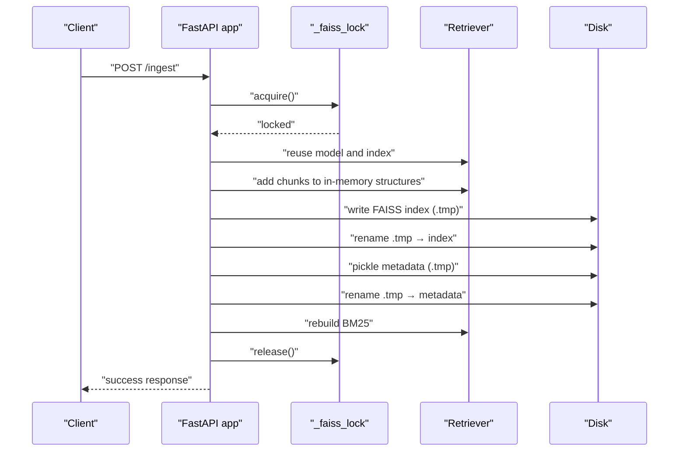
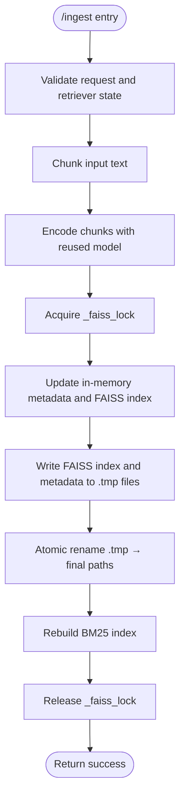
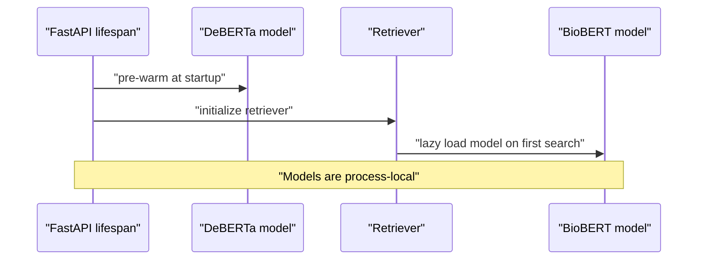
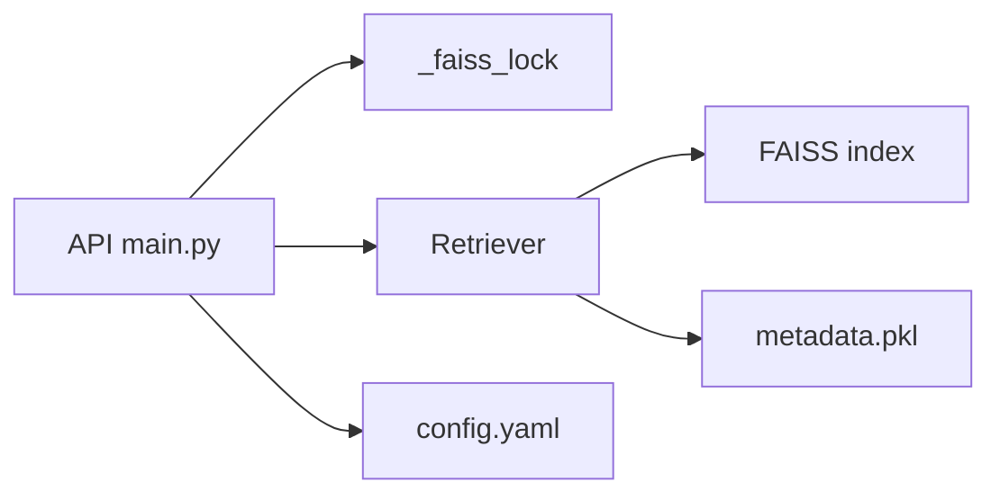

# Thread Safety and Concurrency

<cite>
**Referenced Files in This Document**
- [main.py](file://Backend/src/api/main.py)
- [retriever.py](file://Backend/src/pipeline/retriever.py)
- [embedder.py](file://Backend/src/pipeline/embedder.py)
- [chunker.py](file://Backend/src/pipeline/chunker.py)
- [ingest.py](file://Backend/src/pipeline/ingest.py)
- [config.yaml](file://Backend/config.yaml)
- [faithfulness.py](file://Backend/src/modules/faithfulness.py)
- [entity_verifier.py](file://Backend/src/modules/entity_verifier.py)
- [src/__init__.py](file://Backend/src/__init__.py)
- [start_production.bat](file://start_production.bat)
- [requirements.txt](file://Backend/requirements.txt)
</cite>

## Table of Contents
1. [Introduction](#introduction)
2. [Project Structure](#project-structure)
3. [Core Components](#core-components)
4. [Architecture Overview](#architecture-overview)
5. [Detailed Component Analysis](#detailed-component-analysis)
6. [Dependency Analysis](#dependency-analysis)
7. [Performance Considerations](#performance-considerations)
8. [Troubleshooting Guide](#troubleshooting-guide)
9. [Conclusion](#conclusion)
10. [Appendices](#appendices)

## Introduction
This document explains thread safety and concurrency management in the MediRAG backend. It focuses on:
- Threading locks protecting FAISS index updates during ingestion
- Model loading strategies to avoid redundant initialization
- Concurrent request handling in the FastAPI application
- Thread-safe implementation of the /ingest endpoint with atomic file operations and index consistency
- Practical patterns to prevent deadlocks, optimize performance, and manage resources
- Guidance for scaling and monitoring concurrent operations

## Project Structure
The backend is organized around a FastAPI application that orchestrates retrieval, generation, and evaluation. The ingestion pipeline builds FAISS indices and metadata stores, while the API exposes endpoints for health checks, evaluation, querying, and dynamic ingestion.

**Diagram sources**
- [main.py:156-173](file://Backend/src/api/main.py#L156-L173)
- [retriever.py:39-61](file://Backend/src/pipeline/retriever.py#L39-L61)
- [chunker.py:20-36](file://Backend/src/pipeline/chunker.py#L20-L36)
- [embedder.py:139-160](file://Backend/src/pipeline/embedder.py#L139-L160)
- [faithfulness.py:86-104](file://Backend/src/modules/faithfulness.py#L86-L104)
- [entity_verifier.py:146-162](file://Backend/src/modules/entity_verifier.py#L146-L162)

**Section sources**
- [main.py:156-173](file://Backend/src/api/main.py#L156-L173)
- [config.yaml:1-66](file://Backend/config.yaml#L1-L66)

## Core Components
- FastAPI application lifecycle and concurrency model
- Retriever with lazy model/index loading and hybrid search
- Ingestion pipeline with thread-safe FAISS updates and atomic persistence
- Module-level model caching to avoid repeated loads
- Production deployment with multi-worker WSGI server

Key concurrency-relevant elements:
- Global lock for FAISS index updates
- Lazy initialization of heavy models
- Atomic disk writes for index and metadata
- Graceful fallbacks and error handling under contention

**Section sources**
- [main.py:125-149](file://Backend/src/api/main.py#L125-L149)
- [retriever.py:66-114](file://Backend/src/pipeline/retriever.py#L66-L114)
- [main.py:524-603](file://Backend/src/api/main.py#L524-L603)
- [faithfulness.py:58-69](file://Backend/src/modules/faithfulness.py#L58-L69)
- [entity_verifier.py:70-86](file://Backend/src/modules/entity_verifier.py#L70-L86)
- [start_production.bat](file://start_production.bat#L34)

## Architecture Overview
The API initializes shared resources at startup and exposes endpoints that reuse these resources across concurrent requests. The /ingest endpoint performs a thread-safe update of FAISS and metadata, ensuring consistency through a lock and atomic file writes.

**Diagram sources**
- [main.py:524-603](file://Backend/src/api/main.py#L524-L603)
- [retriever.py:121-143](file://Backend/src/pipeline/retriever.py#L121-L143)

## Detailed Component Analysis

### Thread-Safe Ingestion Endpoint (/ingest)
The /ingest endpoint ensures:
- Single writer access to FAISS index and metadata via a global lock
- Atomic persistence using temporary files followed by atomic renames
- Consistent in-memory and on-disk state after updates
- Reuse of the already-loaded model from the retriever to avoid double RAM usage

Practical considerations:
- Deadlock prevention: Keep critical sections minimal and avoid nested locks or blocking calls inside the lock
- Performance: Reuse the retriever’s model to avoid reloading; batch embeddings efficiently
- Reliability: Atomic renames ensure the index is never partially written

**Diagram sources**
- [main.py:524-603](file://Backend/src/api/main.py#L524-L603)
- [retriever.py:121-143](file://Backend/src/pipeline/retriever.py#L121-L143)

**Section sources**
- [main.py:524-603](file://Backend/src/api/main.py#L524-L603)
- [retriever.py:121-143](file://Backend/src/pipeline/retriever.py#L121-L143)

### Model Loading Strategies
- DeBERTa model is pre-warmed at application startup via lifespan manager
- Retriever lazily loads the embedding model and FAISS index on first use
- Faithfulness and Entity Verifier modules cache models globally to avoid repeated loads
- Production uses a multi-worker WSGI server; models are loaded per process

**Diagram sources**
- [main.py:125-149](file://Backend/src/api/main.py#L125-L149)
- [retriever.py:66-79](file://Backend/src/pipeline/retriever.py#L66-L79)
- [faithfulness.py:58-69](file://Backend/src/modules/faithfulness.py#L58-L69)
- [entity_verifier.py:70-86](file://Backend/src/modules/entity_verifier.py#L70-L86)

**Section sources**
- [main.py:125-149](file://Backend/src/api/main.py#L125-L149)
- [retriever.py:66-79](file://Backend/src/pipeline/retriever.py#L66-L79)
- [faithfulness.py:58-69](file://Backend/src/modules/faithfulness.py#L58-L69)
- [entity_verifier.py:70-86](file://Backend/src/modules/entity_verifier.py#L70-L86)

### Concurrent Request Handling
- FastAPI handles concurrent requests; each request is served by a worker process
- Shared resources (models, retriever) are initialized once per process and reused
- The /ingest endpoint serializes index updates using a lock, preventing race conditions
- Database writes for audit logs are serialized per request; consider queueing for high throughput

**Section sources**
- [main.py:156-173](file://Backend/src/api/main.py#L156-L173)
- [main.py:524-603](file://Backend/src/api/main.py#L524-L603)
- [main.py:97-119](file://Backend/src/api/main.py#L97-L119)

### FAISS Index and Metadata Consistency
- In-memory structures are updated first, then persisted atomically
- FAISS index and metadata are persisted separately but both use atomic renames
- After successful write, the in-memory BM25 index is rebuilt to reflect new chunks

**Section sources**
- [main.py:570-601](file://Backend/src/api/main.py#L570-L601)
- [retriever.py:121-143](file://Backend/src/pipeline/retriever.py#L121-L143)

### Memory Management and Resource Cleanup
- Models are loaded once per process; no explicit unload is implemented
- FAISS index and metadata are loaded into memory; ensure sufficient RAM for expected scale
- Graceful shutdown hooks are defined via lifespan; no special cleanup is performed for models

**Section sources**
- [main.py:125-149](file://Backend/src/api/main.py#L125-L149)
- [src/__init__.py:10-42](file://Backend/src/__init__.py#L10-L42)

## Dependency Analysis
Concurrency-related dependencies:
- FastAPI lifespan manages startup/shutdown
- Retriever encapsulates FAISS and metadata access
- Global lock protects FAISS updates
- Atomic file operations ensure durability

**Diagram sources**
- [main.py:524-603](file://Backend/src/api/main.py#L524-L603)
- [retriever.py:80-114](file://Backend/src/pipeline/retriever.py#L80-L114)
- [config.yaml:1-66](file://Backend/config.yaml#L1-L66)

**Section sources**
- [main.py:524-603](file://Backend/src/api/main.py#L524-L603)
- [retriever.py:80-114](file://Backend/src/pipeline/retriever.py#L80-L114)
- [config.yaml:1-66](file://Backend/config.yaml#L1-L66)

## Performance Considerations
- Use the retriever’s already-loaded model in /ingest to avoid double memory usage
- Keep the critical section under the lock minimal; compute embeddings outside the lock
- Consider batching embeddings and chunking to reduce overhead
- Monitor FAISS index size and rebuild BM25 only when necessary
- For high concurrency, tune the number of workers and consider read replicas for queries while writes are serialized

[No sources needed since this section provides general guidance]

## Troubleshooting Guide
Common issues and remedies:
- FAISS index not found: Ensure the index and metadata files exist at configured paths
- Ingestion failures under load: Verify the global lock is not held for extended periods; minimize work inside the lock
- Model loading errors: Confirm dependencies and versions match requirements
- Audit log persistence errors: Check database connectivity and permissions

**Section sources**
- [retriever.py:87-114](file://Backend/src/pipeline/retriever.py#L87-L114)
- [main.py:538-540](file://Backend/src/api/main.py#L538-L540)
- [main.py:118-119](file://Backend/src/api/main.py#L118-L119)
- [requirements.txt:1-35](file://Backend/requirements.txt#L1-L35)

## Conclusion
MediRAG employs a pragmatic concurrency model:
- A single global lock serializes FAISS updates
- Atomic file operations guarantee index consistency
- Lazy and cached model loading avoids redundant initialization
- FastAPI’s worker model isolates state per process
These practices enable reliable concurrent operation while maintaining index integrity and predictable performance.

[No sources needed since this section summarizes without analyzing specific files]

## Appendices

### Practical Examples of Concurrent Access Patterns
- Serialize write operations: Use the global lock for all index updates
- Avoid blocking inside locks: Compute embeddings and chunking before acquiring the lock
- Reuse models: Access the retriever’s model to prevent reloading
- Batch writes: Group multiple small updates into a single transaction-like block

**Section sources**
- [main.py:524-603](file://Backend/src/api/main.py#L524-L603)
- [retriever.py:66-79](file://Backend/src/pipeline/retriever.py#L66-L79)

### Scaling and Monitoring Guidance
- Scale horizontally: Use multiple workers behind a load balancer
- Scale vertically: Increase worker count and monitor memory usage
- Monitor: Track endpoint latencies, HRS distributions, and intervention rates
- Optimize: Tune chunk sizes, top_k, and batch sizes based on workload

**Section sources**
- [start_production.bat](file://start_production.bat#L34)
- [main.py:608-648](file://Backend/src/api/main.py#L608-L648)