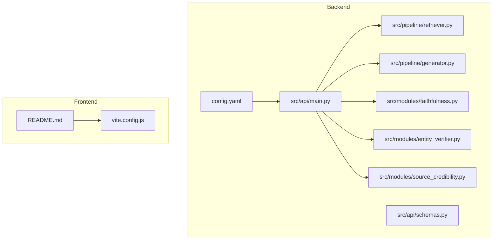
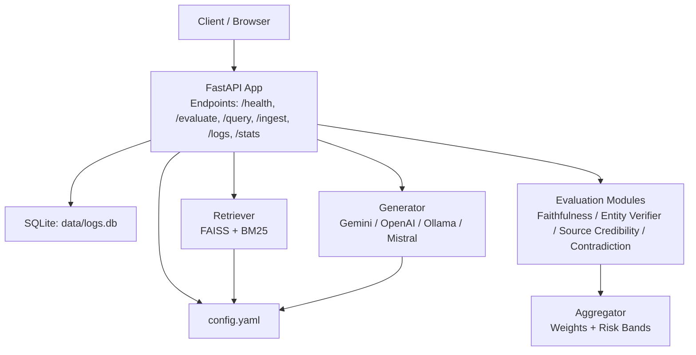
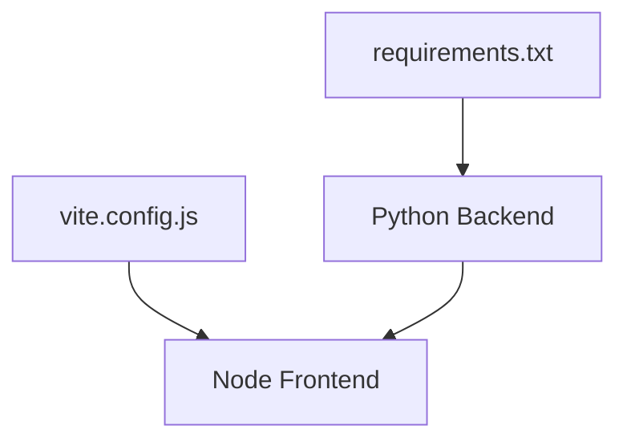

# Configuration and Deployment

<cite>
**Referenced Files in This Document**
- [config.yaml](file://Backend/config.yaml)
- [requirements.txt](file://Backend/requirements.txt)
- [START_INSTRUCTIONS.txt](file://START_INSTRUCTIONS.txt)
- [README.md](file://Backend/README.md)
- [main.py](file://Backend/src/api/main.py)
- [schemas.py](file://Backend/src/api/schemas.py)
- [retriever.py](file://Backend/src/pipeline/retriever.py)
- [generator.py](file://Backend/src/pipeline/generator.py)
- [faithfulness.py](file://Backend/src/modules/faithfulness.py)
- [entity_verifier.py](file://Backend/src/modules/entity_verifier.py)
- [source_credibility.py](file://Backend/src/modules/source_credibility.py)
- [vite.config.js](file://Frontend/vite.config.js)
- [README.md](file://Frontend/README.md)
</cite>

## Table of Contents
1. [Introduction](#introduction)
2. [Project Structure](#project-structure)
3. [Core Components](#core-components)
4. [Architecture Overview](#architecture-overview)
5. [Detailed Component Analysis](#detailed-component-analysis)
6. [Dependency Analysis](#dependency-analysis)
7. [Performance Considerations](#performance-considerations)
8. [Troubleshooting Guide](#troubleshooting-guide)
9. [Conclusion](#conclusion)
10. [Appendices](#appendices)

## Introduction
This document provides comprehensive guidance for configuring and deploying MediRAG 3.0 across development and production environments. It covers environment setup, configuration file structures, runtime parameter tuning, deployment strategies (local, containerized, and cloud), performance optimization for GPU acceleration and memory management, scaling for concurrent users, monitoring and logging, health checks, alerting, backup and recovery, data retention, compliance for healthcare environments, security hardening, network configuration, access control, and troubleshooting.

## Project Structure
The project consists of:
- Backend API (FastAPI) with configuration-driven modules for retrieval, generation, and evaluation
- Frontend (React/Vite) for dashboard and evaluation UI
- Shared configuration via YAML and Python-based runtime configuration loading
- Scripts and utilities for ingestion and caching

**Diagram sources**
- [config.yaml](file://Backend/config.yaml)
- [main.py](file://Backend/src/api/main.py)
- [schemas.py](file://Backend/src/api/schemas.py)
- [retriever.py](file://Backend/src/pipeline/retriever.py)
- [generator.py](file://Backend/src/pipeline/generator.py)
- [faithfulness.py](file://Backend/src/modules/faithfulness.py)
- [entity_verifier.py](file://Backend/src/modules/entity_verifier.py)
- [source_credibility.py](file://Backend/src/modules/source_credibility.py)
- [vite.config.js](file://Frontend/vite.config.js)
- [README.md](file://Frontend/README.md)

**Section sources**
- [README.md](file://Backend/README.md)
- [README.md](file://Frontend/README.md)

## Core Components
- Configuration file: Centralized settings for retrieval, modules, LLM provider, API, and logging
- API server: FastAPI endpoints for health, evaluation, query, ingestion, and dashboard data
- Pipeline modules: Retrieval (FAISS + BM25), generation (multiple providers), and evaluation modules
- Frontend: React/Vite UI for dashboard and evaluation

Key configuration areas:
- Retrieval: top-k, chunk sizes, embedding model, FAISS index and metadata paths
- Modules: Faithfulness, Entity Verifier, Source Credibility, Contradiction
- Aggregation: weights and risk bands
- LLM: provider selection, credentials, timeouts, temperatures
- API: host/port, query/answer length limits, chunk limits
- Logging: level, file path, format

**Section sources**
- [config.yaml](file://Backend/config.yaml)
- [main.py](file://Backend/src/api/main.py)
- [schemas.py](file://Backend/src/api/schemas.py)
- [retriever.py](file://Backend/src/pipeline/retriever.py)
- [generator.py](file://Backend/src/pipeline/generator.py)
- [faithfulness.py](file://Backend/src/modules/faithfulness.py)
- [entity_verifier.py](file://Backend/src/modules/entity_verifier.py)
- [source_credibility.py](file://Backend/src/modules/source_credibility.py)

## Architecture Overview
The system integrates configuration-driven retrieval, generation, and evaluation into a cohesive API with optional safety interventions and dashboard support.

**Diagram sources**
- [main.py](file://Backend/src/api/main.py)
- [retriever.py](file://Backend/src/pipeline/retriever.py)
- [generator.py](file://Backend/src/pipeline/generator.py)
- [config.yaml](file://Backend/config.yaml)

## Detailed Component Analysis

### Environment Setup and Configuration
- Python environment: Install dependencies from requirements.txt
- Node environment: Install frontend dependencies and run development server
- Configuration loading: The API loads config.yaml at startup; defaults are applied if config is missing
- Logging: Configured via logging.level, logging.file, and logging.format

Runtime configuration highlights:
- Retrieval: embedding_model, index_path, metadata_path, top_k, chunk_size, chunk_overlap
- Modules: Faithfulness NLI model, thresholds, batching; Entity Verifier spaCy model, RxNorm cache/API; Source Credibility tier weights; Contradiction NLI model and thresholds
- Aggregation: module weights and risk bands
- LLM: provider, model, base_url, timeout, judge_temperature, generation_temperature
- API: host, port, max_query_length, max_answer_length, max_chunks, max_chunk_length
- Logging: level, file, format

**Section sources**
- [requirements.txt](file://Backend/requirements.txt)
- [START_INSTRUCTIONS.txt](file://START_INSTRUCTIONS.txt)
- [config.yaml](file://Backend/config.yaml)
- [main.py](file://Backend/src/api/main.py)

### API Endpoints and Runtime Behavior
- GET /health: Liveness and Ollama availability check
- POST /evaluate: Evaluate a question-answer-context triplet; returns composite score and per-module results
- POST /query: End-to-end pipeline: retrieve → generate → evaluate; applies safety interventions
- POST /ingest: Append new documents to FAISS index atomically
- GET /logs and /stats: Dashboard data for audit logs and metrics
- POST /parse_file: Helper to extract text from PDF/DOCX/TXT

Safety intervention loop:
- If HRS is CRITICAL, block the response
- If HRS is high or faithfulness is low, regenerate with a strict prompt and re-evaluate

**Section sources**
- [main.py](file://Backend/src/api/main.py)
- [schemas.py](file://Backend/src/api/schemas.py)

### Retrieval Pipeline
- Hybrid FAISS (cosine similarity) and BM25 retrieval with Reciprocal Rank Fusion
- Lazy loading of embedding model and FAISS index
- Metadata store pickled alongside FAISS index
- Rebuild BM25 on ingestion to include new documents

**Section sources**
- [retriever.py](file://Backend/src/pipeline/retriever.py)
- [config.yaml](file://Backend/config.yaml)

### Generation Pipeline
- Providers: Gemini, OpenAI, Ollama, Mistral
- Prompt building: Grounded prompts with citations; strict mode for regeneration
- Per-request overrides: provider, API key, model, Ollama URL
- Timeouts and temperatures configured centrally

**Section sources**
- [generator.py](file://Backend/src/pipeline/generator.py)
- [config.yaml](file://Backend/config.yaml)

### Evaluation Modules
- Faithfulness: NLI-based entailment scoring with claim segmentation
- Entity Verifier: SciSpaCy NER + RxNorm cache/API verification for drugs
- Source Credibility: Tier-based weighting with metadata and keyword fallback
- Contradiction: NLI-based contradiction detection

**Section sources**
- [faithfulness.py](file://Backend/src/modules/faithfulness.py)
- [entity_verifier.py](file://Backend/src/modules/entity_verifier.py)
- [source_credibility.py](file://Backend/src/modules/source_credibility.py)
- [config.yaml](file://Backend/config.yaml)

### Frontend and Dashboard
- React + Vite with a modern UI for evaluation and dashboard
- Development server runs on a separate port from the backend
- Dashboard endpoints exposed by the backend for metrics and logs

**Section sources**
- [vite.config.js](file://Frontend/vite.config.js)
- [README.md](file://Frontend/README.md)
- [main.py](file://Backend/src/api/main.py)

## Dependency Analysis
External dependencies include:
- Python: FastAPI, Uvicorn, Transformers, Sentence-Transformers, FAISS, SciSpaCy, Ragas, Pydantic, Requests, etc.
- Node: Vite, React, and related tooling for the frontend

**Diagram sources**
- [requirements.txt](file://Backend/requirements.txt)
- [vite.config.js](file://Frontend/vite.config.js)

**Section sources**
- [requirements.txt](file://Backend/requirements.txt)
- [vite.config.js](file://Frontend/vite.config.js)

## Performance Considerations
GPU acceleration and memory management:
- FAISS: Use FAISS GPU if available; otherwise CPU builds are supported
- Sentence-Transformers: Model loading occurs once at startup; reuse across requests
- DeBERTa/NLI models: Loaded once at startup to avoid cold-start latency
- Batch sizes: Adjust module-specific batch sizes to balance throughput and memory usage
- Embedding normalization: FAISS IndexFlatIP requires L2-normalized vectors

Scaling for concurrent users:
- Use a production ASGI server (Uvicorn workers) behind a reverse proxy
- Separate long-running tasks (indexing, ingestion) from request-serving threads
- Monitor memory usage and scale vertically or horizontally as needed

Latency optimization:
- Warm-up models at service start (already implemented)
- Tune retrieval top_k and chunk sizes to balance relevance and latency
- Prefer local Ollama for low-latency scenarios; use managed APIs for higher reliability

**Section sources**
- [main.py](file://Backend/src/api/main.py)
- [retriever.py](file://Backend/src/pipeline/retriever.py)
- [generator.py](file://Backend/src/pipeline/generator.py)
- [config.yaml](file://Backend/config.yaml)

## Troubleshooting Guide
Common deployment and runtime issues:
- Missing FAISS index: Ensure FAISS index and metadata are present at configured paths
- Ollama connectivity: Verify base_url and that Ollama is running
- Missing API keys: Set provider-specific API keys in environment or config
- RxNorm cache/API: Confirm cache file exists and API is reachable
- CORS and ports: Ensure backend host/port align with frontend proxy and firewall rules
- SQLite permissions: Verify write access to data/logs.db

Operational checks:
- Health endpoint: Use GET /health to verify service and dependency status
- Logs: Review configured log file and adjust logging.level for diagnostics
- Dashboard: Use GET /logs and GET /stats for recent evaluations and metrics

**Section sources**
- [main.py](file://Backend/src/api/main.py)
- [retriever.py](file://Backend/src/pipeline/retriever.py)
- [generator.py](file://Backend/src/pipeline/generator.py)
- [entity_verifier.py](file://Backend/src/modules/entity_verifier.py)
- [config.yaml](file://Backend/config.yaml)

## Conclusion
MediRAG 3.0 offers a configurable, modular evaluation and generation pipeline suitable for both development and production. By tuning configuration parameters, leveraging GPU acceleration where available, and adopting robust deployment practices, teams can achieve reliable performance and strong safety guarantees for medical AI applications.

## Appendices

### Environment Variables and Secrets Management
- LLM provider API keys: Configure via environment variables or config file (avoid storing secrets in code)
- Example keys: GEMINI_API_KEY, OPENAI_API_KEY, MISTRAL_API_KEY
- For production, use secret managers or deployment-specific secret injection

**Section sources**
- [generator.py](file://Backend/src/pipeline/generator.py)
- [config.yaml](file://Backend/config.yaml)

### Monitoring and Logging
- Logging: Configure level, file path, and format in config.yaml
- Health endpoint: GET /health for liveness and dependency checks
- Dashboard endpoints: GET /logs and GET /stats for audit and metrics

**Section sources**
- [config.yaml](file://Backend/config.yaml)
- [main.py](file://Backend/src/api/main.py)

### Backup and Recovery Procedures
- FAISS index and metadata: Back up index_path and metadata_path locations
- SQLite audit logs: Back up data/logs.db regularly
- RxNorm cache: Back up data/rxnorm_cache.csv if customized

**Section sources**
- [config.yaml](file://Backend/config.yaml)
- [retriever.py](file://Backend/src/pipeline/retriever.py)
- [main.py](file://Backend/src/api/main.py)

### Security Hardening and Access Control
- Network: Restrict inbound access to API host/port; use TLS termination at the edge
- CORS: Middleware allows all origins in development; tighten in production
- Secrets: Store API keys securely; avoid embedding in client-side code
- Integrity: Pin dependency versions via requirements.txt; scan images and dependencies

**Section sources**
- [main.py](file://Backend/src/api/main.py)
- [requirements.txt](file://Backend/requirements.txt)

### Compliance Considerations for Healthcare Environments
- Data minimization: Limit collection to necessary audit logs and indices
- Retention: Define and enforce data retention policies for logs and indices
- Auditability: Maintain immutable logs and enable forensics
- HIPAA/GDPR alignment: Encrypt at rest and in transit; anonymize PII where possible

[No sources needed since this section provides general guidance]