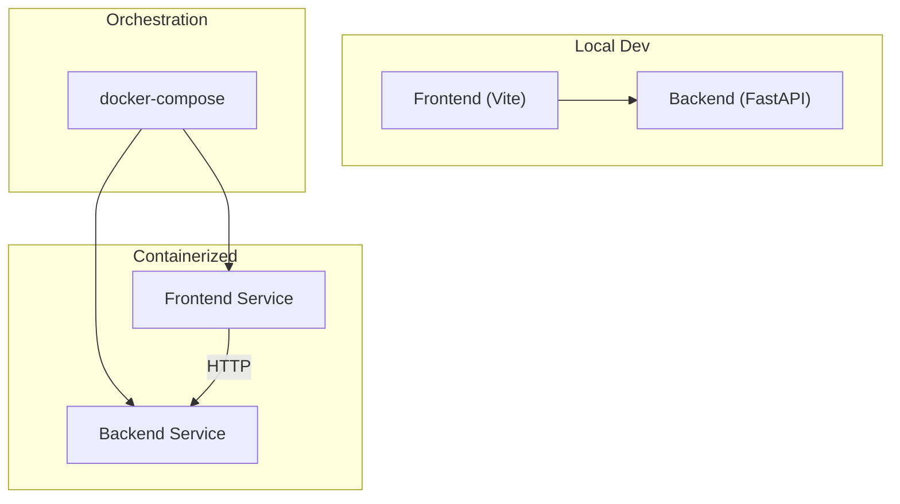
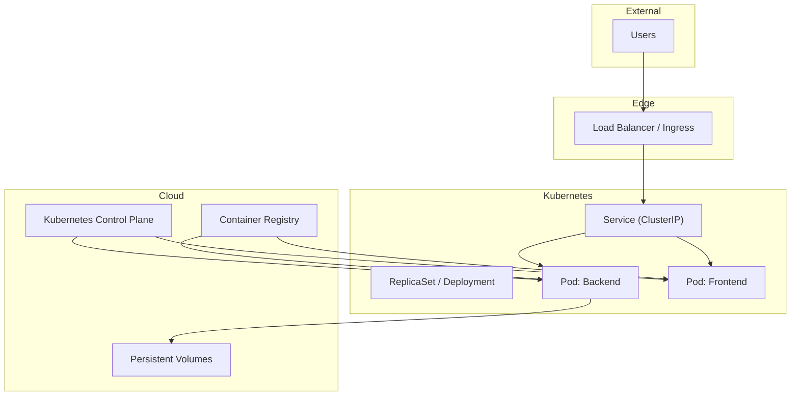
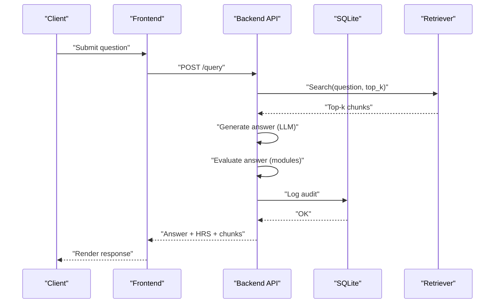
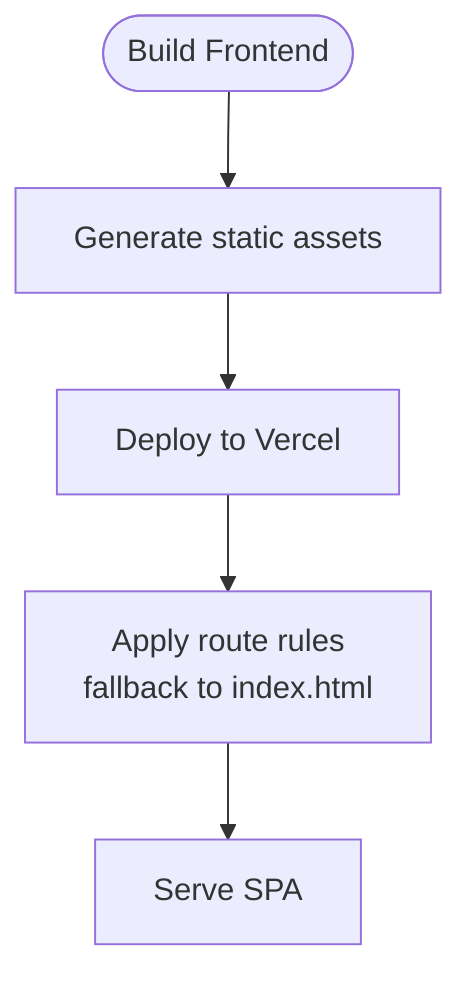
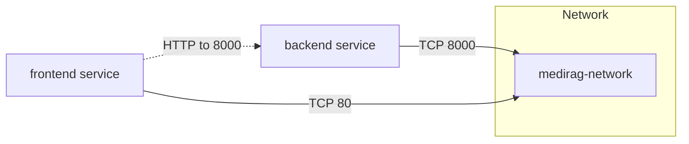
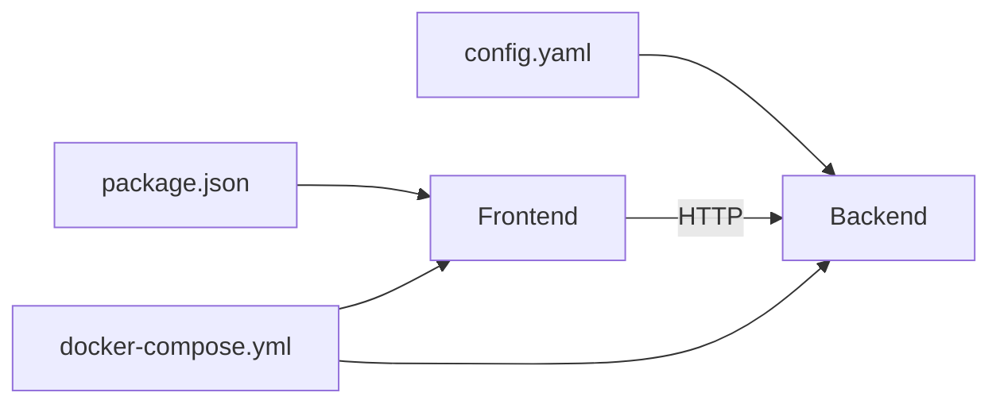

# Deployment Strategies

<cite>
**Referenced Files in This Document**
- [README.md](file://README.md)
- [START_INSTRUCTIONS.txt](file://START_INSTRUCTIONS.txt)
- [docker-compose.yml](file://docker-compose.yml)
- [Backend/README.md](file://Backend/README.md)
- [Backend/requirements.txt](file://Backend/requirements.txt)
- [Backend/config.yaml](file://Backend/config.yaml)
- [Backend/src/api/main.py](file://Backend/src/api/main.py)
- [Backend/src/api/schemas.py](file://Backend/src/api/schemas.py)
- [Frontend/README.md](file://Frontend/README.md)
- [Frontend/package.json](file://Frontend/package.json)
- [Frontend/vercel.json](file://Frontend/vercel.json)
- [vercel.json](file://vercel.json)
</cite>

## Table of Contents
1. [Introduction](#introduction)
2. [Project Structure](#project-structure)
3. [Core Components](#core-components)
4. [Architecture Overview](#architecture-overview)
5. [Detailed Component Analysis](#detailed-component-analysis)
6. [Dependency Analysis](#dependency-analysis)
7. [Performance Considerations](#performance-considerations)
8. [Troubleshooting Guide](#troubleshooting-guide)
9. [Conclusion](#conclusion)
10. [Appendices](#appendices)

## Introduction
This document provides production-focused deployment strategies for MediRAG 3.0, covering containerization, orchestration, cloud platforms, Kubernetes, and frontend static hosting. It consolidates backend and frontend deployment approaches, operational controls, and production hardening guidance derived from the repository’s configuration and source files.

## Project Structure
MediRAG 3.0 comprises:
- Backend service written in Python with FastAPI, serving evaluation and retrieval APIs, and exposing ingestion and dashboard endpoints.
- Frontend built with React and Vite, designed for development and static hosting.
- Orchestration managed via docker-compose for local and staging environments.
- Optional Vercel configuration for frontend static hosting.

**Diagram sources**
- [docker-compose.yml:1-45](file://docker-compose.yml#L1-L45)
- [Backend/src/api/main.py:156-173](file://Backend/src/api/main.py#L156-L173)
- [Frontend/package.json:6-11](file://Frontend/package.json#L6-L11)

**Section sources**
- [README.md:54-76](file://README.md#L54-L76)
- [docker-compose.yml:1-45](file://docker-compose.yml#L1-L45)

## Core Components
- Backend API (FastAPI)
  - Exposes health, evaluation, query, ingestion, and dashboard endpoints.
  - Uses configuration-driven settings for retrieval, modules, LLM providers, and API limits.
  - Implements pre-warming of models and retriever at startup to reduce cold-start latency.
- Frontend (React + Vite)
  - Provides development and build scripts; configured for static hosting via Vercel.
  - Routes are handled to serve index.html for client-side routing.

Key runtime characteristics:
- Backend listens on configurable host/port and exposes CORS for local development.
- Frontend runs on port 80 in containers and proxies to the backend.

**Section sources**
- [Backend/src/api/main.py:156-173](file://Backend/src/api/main.py#L156-L173)
- [Backend/config.yaml:54-65](file://Backend/config.yaml#L54-L65)
- [Frontend/vercel.json:1-7](file://Frontend/vercel.json#L1-L7)
- [docker-compose.yml:8-34](file://docker-compose.yml#L8-L34)

## Architecture Overview
Production deployment can be implemented in several ways:
- Containerized stack with docker-compose for staging and development.
- Cloud-native deployment using Kubernetes manifests for orchestration, scaling, and service discovery.
- Frontend static hosting on Vercel with reverse proxy configuration to the backend.

[No sources needed since this diagram shows conceptual workflow, not actual code structure]

## Detailed Component Analysis

### Backend Service (FastAPI)
- Startup lifecycle
  - Initializes database and pre-warms DeBERTa and the retriever to minimize first-request latency.
- Endpoints
  - Health check for liveness and dependency probing.
  - Evaluation endpoint for scoring answers against retrieved context.
  - Query endpoint for end-to-end retrieval, generation, evaluation, and safety intervention.
  - Ingestion endpoint for dynamic FAISS index updates with atomic writes.
  - Dashboard endpoints for audit logs and statistics.
- Configuration
  - Centralized via YAML with retrieval parameters, module thresholds, LLM provider settings, API limits, and logging.

**Diagram sources**
- [Backend/src/api/main.py:308-519](file://Backend/src/api/main.py#L308-L519)
- [Backend/src/api/main.py:75-120](file://Backend/src/api/main.py#L75-L120)

**Section sources**
- [Backend/src/api/main.py:125-149](file://Backend/src/api/main.py#L125-L149)
- [Backend/src/api/main.py:206-302](file://Backend/src/api/main.py#L206-L302)
- [Backend/src/api/main.py:308-519](file://Backend/src/api/main.py#L308-L519)
- [Backend/src/api/main.py:526-603](file://Backend/src/api/main.py#L526-L603)
- [Backend/src/api/main.py:608-648](file://Backend/src/api/main.py#L608-L648)
- [Backend/config.yaml:1-66](file://Backend/config.yaml#L1-L66)

### Frontend Service (React + Vite)
- Scripts
  - Development, build, lint, and preview commands.
- Static Hosting
  - Vercel routes all unmatched paths to index.html for SPA routing.
- Environment
  - Global Vercel environment variables include API_URL and others.

**Diagram sources**
- [Frontend/package.json:6-11](file://Frontend/package.json#L6-L11)
- [Frontend/vercel.json:1-7](file://Frontend/vercel.json#L1-L7)
- [vercel.json:1-1](file://vercel.json#L1-L1)

**Section sources**
- [Frontend/package.json:1-32](file://Frontend/package.json#L1-L32)
- [Frontend/README.md:42-60](file://Frontend/README.md#L42-L60)
- [Frontend/vercel.json:1-7](file://Frontend/vercel.json#L1-L7)
- [vercel.json:1-1](file://vercel.json#L1-L1)

### Container Orchestration with docker-compose
- Services
  - Backend: builds from Backend/Dockerfile, publishes port 8000, mounts persistent volumes for data and logs, sets environment variables, restart policy, and network.
  - Frontend: builds from Frontend/Dockerfile, publishes port 80, depends_on backend, restart policy, and network.
- Networks and Volumes
  - Bridge network for service communication.
  - Local volumes for backend data persistence.

**Diagram sources**
- [docker-compose.yml:3-44](file://docker-compose.yml#L3-L44)

**Section sources**
- [docker-compose.yml:1-45](file://docker-compose.yml#L1-L45)

### Cloud Platform Integration
- AWS
  - Recommended approach: deploy Kubernetes cluster (EKS), container images in ECR, expose via ALB, and manage persistent volumes with EBS or EFS.
- GCP
  - Recommended approach: GKE cluster, Artifact Registry for images, Load Balancer, Persistent Disk or Filestore for data.
- Azure
  - Recommended approach: AKS, ACR, Azure Load Balancer, Azure Files or Disks for persistence.

[No sources needed since this section provides general guidance]

### Kubernetes Deployment Manifests
- Services
  - ClusterIP service for internal routing to backend pods.
  - Ingress or LoadBalancer for external access to frontend and backend.
- Deployments
  - Separate Deployments for frontend and backend with replicas, resource requests/limits, and readiness/liveness probes.
- ConfigMaps and Secrets
  - Mount configuration files and sensitive keys via ConfigMaps/Secrets.
- Persistent Volumes
  - Use PVCs for backend data and logs directories.

[No sources needed since this section provides general guidance]

### Vercel Deployment for Frontend
- Static Hosting
  - Build artifacts deployed to Vercel; route rules ensure SPA navigation.
- Reverse Proxy
  - Configure API_URL to point to backend endpoint (Ingress/ALB/Cloud Load Balancer).
- SSL/TLS
  - Managed certificates via Vercel; enforce HTTPS.

**Section sources**
- [Frontend/vercel.json:1-7](file://Frontend/vercel.json#L1-L7)
- [vercel.json:1-1](file://vercel.json#L1-L1)

### Deployment Automation and CI/CD
- Automation Scripts
  - Use shell scripts to build images, push to registry, and apply Kubernetes manifests.
- CI/CD Pipelines
  - Build stages: lint, test, build images.
  - Release stages: scan images, tag, push, deploy to staging, promote to production.
- Rollback Strategies
  - Immutable tags, Helm rollback, or kubectl rollout undo.
  - Canary or blue/green rollouts with traffic shifting.

[No sources needed since this section provides general guidance]

### Blue-Green and Canary Deployments
- Blue-Green
  - Maintain two identical environments; switch traffic after validation.
- Canary
  - Route a small percentage of traffic to the new version; scale up on success.
- Zero-Downtime
  - Rolling updates with readiness probes and pod disruption budgets.

[No sources needed since this section provides general guidance]

## Dependency Analysis
Runtime dependencies and relationships:
- Backend depends on configuration for retrieval, modules, and LLM settings.
- Frontend depends on backend API availability and environment variables for API_URL.
- docker-compose defines service dependencies and network connectivity.

**Diagram sources**
- [Backend/config.yaml:1-66](file://Backend/config.yaml#L1-L66)
- [Frontend/package.json:1-32](file://Frontend/package.json#L1-L32)
- [docker-compose.yml:1-45](file://docker-compose.yml#L1-L45)

**Section sources**
- [Backend/config.yaml:54-65](file://Backend/config.yaml#L54-L65)
- [docker-compose.yml:30-31](file://docker-compose.yml#L30-L31)

## Performance Considerations
- Model pre-warming
  - Backend pre-warms DeBERTa and retriever at startup to reduce latency.
- Resource allocation
  - Set CPU/memory requests/limits in Kubernetes; provision GPUs if using GPU-backed models.
- Storage I/O
  - Persist FAISS index and metadata; ensure fast storage for retrieval performance.
- CDN and caching
  - Frontend static assets served via CDN; backend caches frequently used models.

[No sources needed since this section provides general guidance]

## Troubleshooting Guide
- Backend health checks
  - Use the /health endpoint to verify liveness and dependency status.
- Logs
  - Backend writes logs to a configured file; inspect logs for startup and runtime errors.
- Frontend routing
  - Ensure Vercel route rules forward unmatched paths to index.html for SPA behavior.
- docker-compose
  - Verify service dependencies, port mappings, and volume mounts.

**Section sources**
- [Backend/src/api/main.py:206-217](file://Backend/src/api/main.py#L206-L217)
- [Backend/src/api/main.py:608-648](file://Backend/src/api/main.py#L608-L648)
- [Frontend/vercel.json:1-7](file://Frontend/vercel.json#L1-L7)
- [docker-compose.yml:8-34](file://docker-compose.yml#L8-L34)

## Conclusion
This guide outlines production-ready deployment strategies for MediRAG 3.0, combining containerization with docker-compose, cloud-native Kubernetes deployments, and Vercel-based frontend hosting. By leveraging configuration-driven settings, pre-warmed models, and robust orchestration, teams can achieve scalable, secure, and observable deployments suitable for healthcare environments.

## Appendices

### Appendix A: Backend Configuration Highlights
- Retrieval and indexing parameters
- Module thresholds and weights
- LLM provider settings and timeouts
- API limits and logging configuration

**Section sources**
- [Backend/config.yaml:1-66](file://Backend/config.yaml#L1-L66)

### Appendix B: API Endpoint Reference
- Health: GET /health
- Evaluate: POST /evaluate
- Query: POST /query
- Ingest: POST /ingest
- Logs: GET /logs
- Stats: GET /stats
- Parse file: POST /parse_file

**Section sources**
- [Backend/src/api/main.py:206-302](file://Backend/src/api/main.py#L206-L302)
- [Backend/src/api/main.py:308-519](file://Backend/src/api/main.py#L308-L519)
- [Backend/src/api/main.py:526-603](file://Backend/src/api/main.py#L526-L603)
- [Backend/src/api/main.py:608-648](file://Backend/src/api/main.py#L608-L648)
- [Backend/src/api/main.py:653-677](file://Backend/src/api/main.py#L653-L677)

### Appendix C: Frontend Build and Hosting
- Build and dev scripts
- Vercel route rules for SPA
- Environment variable usage

**Section sources**
- [Frontend/package.json:6-11](file://Frontend/package.json#L6-L11)
- [Frontend/vercel.json:1-7](file://Frontend/vercel.json#L1-L7)
- [vercel.json:1-1](file://vercel.json#L1-L1)