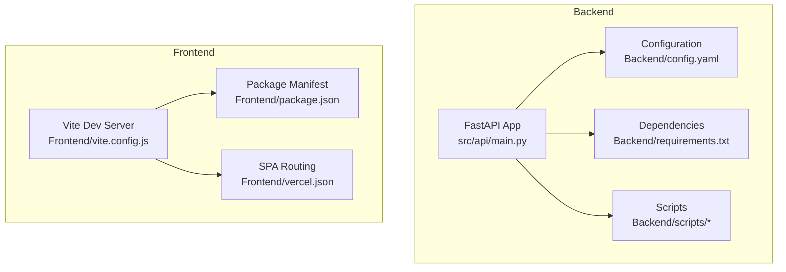
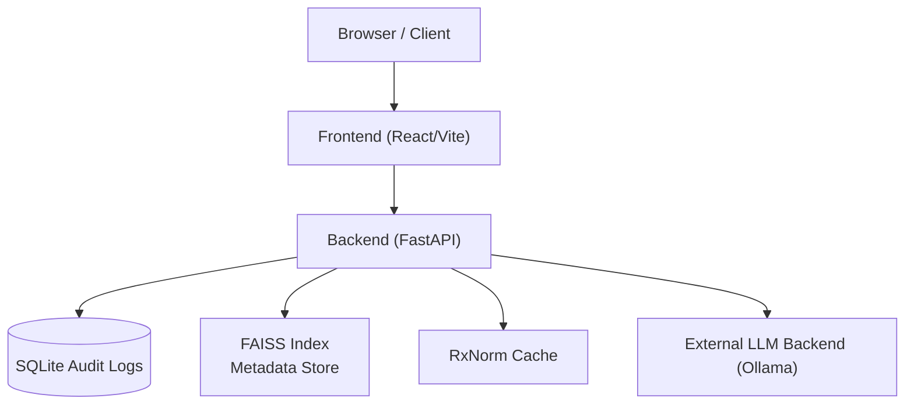

# Environment Setup and Configuration

<cite>
**Referenced Files in This Document**
- [README.md](file://README.md)
- [START_INSTRUCTIONS.txt](file://START_INSTRUCTIONS.txt)
- [config.yaml](file://Backend/config.yaml)
- [requirements.txt](file://Backend/requirements.txt)
- [main.py](file://Backend/src/api/main.py)
- [schemas.py](file://Backend/src/api/schemas.py)
- [docker-compose.yml](file://docker-compose.yml)
- [Dockerfile (Backend)](file://Backend/Dockerfile)
- [Dockerfile (Frontend)](file://Frontend/Dockerfile)
- [package.json](file://Frontend/package.json)
- [vite.config.js](file://Frontend/vite.config.js)
- [warmup.py](file://Backend/scripts/warmup.py)
- [build_rxnorm_cache.py](file://Backend/scripts/build_rxnorm_cache.py)
- [vercel.json](file://Frontend/vercel.json)
</cite>

## Table of Contents
1. [Introduction](#introduction)
2. [Project Structure](#project-structure)
3. [Core Components](#core-components)
4. [Architecture Overview](#architecture-overview)
5. [Detailed Component Analysis](#detailed-component-analysis)
6. [Dependency Analysis](#dependency-analysis)
7. [Performance Considerations](#performance-considerations)
8. [Troubleshooting Guide](#troubleshooting-guide)
9. [Conclusion](#conclusion)
10. [Appendices](#appendices)

## Introduction
This document provides a complete guide to setting up and configuring the MediRAG 3.0 environment. It covers system prerequisites, dependency management, configuration file structure, environment variables, GPU/CPU optimization, Docker-based deployment, and step-by-step instructions for development and production. It also includes troubleshooting guidance for common dependency conflicts and version compatibility issues.

## Project Structure
MediRAG 3.0 is organized into two primary areas:
- Backend: FastAPI service with evaluation pipeline, retrieval, ingestion, and audit logging.
- Frontend: React-based UI served via Vite, with routing configured for SPA behavior.

**Diagram sources**
- [main.py:1-678](file://Backend/src/api/main.py#L1-L678)
- [config.yaml:1-66](file://Backend/config.yaml#L1-L66)
- [requirements.txt:1-35](file://Backend/requirements.txt#L1-L35)
- [vite.config.js:1-8](file://Frontend/vite.config.js#L1-L8)
- [package.json:1-32](file://Frontend/package.json#L1-L32)
- [vercel.json:1-7](file://Frontend/vercel.json#L1-L7)

**Section sources**
- [README.md:54-77](file://README.md#L54-L77)
- [docker-compose.yml:1-45](file://docker-compose.yml#L1-L45)

## Core Components
- Backend FastAPI application:
  - Loads configuration from YAML and initializes logging.
  - Provides health checks, evaluation, query, ingestion, and dashboard endpoints.
  - Manages SQLite audit logs and FAISS/BM25 retrieval.
- Frontend React application:
  - Development server via Vite.
  - SPA routing handled by Vercel-style rewrite rules.
- Scripts:
  - Warmup script to preload models for instant response.
  - RxNorm cache builder for entity verification.

Key configuration locations:
- Backend configuration: Backend/config.yaml
- Frontend dependencies and scripts: Frontend/package.json
- Docker orchestration: docker-compose.yml with per-service Dockerfiles

**Section sources**
- [main.py:54-68](file://Backend/src/api/main.py#L54-L68)
- [config.yaml:1-66](file://Backend/config.yaml#L1-L66)
- [package.json:1-32](file://Frontend/package.json#L1-L32)
- [docker-compose.yml:1-45](file://docker-compose.yml#L1-L45)

## Architecture Overview
The system consists of:
- Backend service exposing REST endpoints for evaluation and querying.
- Frontend UI communicating with the backend.
- Optional external LLM backend (e.g., Ollama) for generation and optional RAGAS evaluation.
- Persistent storage for FAISS index, metadata, logs, and RxNorm cache.

**Diagram sources**
- [main.py:75-120](file://Backend/src/api/main.py#L75-L120)
- [main.py:524-604](file://Backend/src/api/main.py#L524-L604)
- [config.yaml:6-7](file://Backend/config.yaml#L6-L7)
- [config.yaml:20-22](file://Backend/config.yaml#L20-L22)

## Detailed Component Analysis

### Backend Configuration (config.yaml)
The YAML configuration defines:
- Retrieval parameters: top_k, chunk sizes, embedding model, index paths.
- Modules: faithfulness, entity_verifier, source_credibility, contradiction.
- Aggregation weights and risk bands.
- LLM provider settings (provider, model, base URL, timeouts).
- API host/port and request/response limits.
- Logging level, file, and format.

Important paths and keys:
- Retrieval: index_path, metadata_path
- Entity verifier: spacy_model, rxnorm_api_url, rxnorm_cache_path
- LLM: provider, model, base_url, timeouts
- API: host, port, max_* limits
- Logging: level, file, format

Operational behavior:
- Backend reads config at startup and sets logging accordingly.
- Retrieval uses FAISS index and metadata stored under data/.
- RxNorm cache is used by the entity_verifier module.

**Section sources**
- [config.yaml:1-66](file://Backend/config.yaml#L1-L66)
- [main.py:54-68](file://Backend/src/api/main.py#L54-L68)
- [main.py:138-146](file://Backend/src/api/main.py#L138-L146)

### Backend API Endpoints and Validation
Endpoints:
- GET /health: liveness and external LLM availability.
- POST /evaluate: evaluate a question-answer-context triplet.
- POST /query: end-to-end pipeline (retrieve → generate → evaluate).
- POST /ingest: append documents to FAISS index atomically.
- GET /logs and /stats: dashboard data.
- POST /parse_file: helper to extract text from PDF/DOCX/TXT.

Validation and limits:
- Request schemas enforce maximum lengths and counts from config.yaml.
- Optional per-request LLM overrides for provider/model/base URL.

Safety gates:
- Intervention loop blocks or regenerates unsafe answers based on HRS thresholds.

**Section sources**
- [schemas.py:41-90](file://Backend/src/api/schemas.py#L41-L90)
- [schemas.py:146-189](file://Backend/src/api/schemas.py#L146-L189)
- [main.py:206-302](file://Backend/src/api/main.py#L206-L302)
- [main.py:308-520](file://Backend/src/api/main.py#L308-L520)
- [main.py:526-604](file://Backend/src/api/main.py#L526-L604)

### Frontend Dependencies and Build
- React 19, Vite, ESLint, and related tooling.
- Development server runs on default Vite port; SPA routing configured via vercel.json-like routes.

**Section sources**
- [package.json:1-32](file://Frontend/package.json#L1-L32)
- [vite.config.js:1-8](file://Frontend/vite.config.js#L1-L8)
- [vercel.json:1-7](file://Frontend/vercel.json#L1-L7)

### Scripts: Warmup and RxNorm Cache
- Warmup script: sends a query to the backend to initialize models and FAISS in memory.
- RxNorm cache builder: builds a normalized drug name cache from DrugBank data using RxNorm API.

**Section sources**
- [warmup.py:1-59](file://Backend/scripts/warmup.py#L1-L59)
- [build_rxnorm_cache.py:1-348](file://Backend/scripts/build_rxnorm_cache.py#L1-L348)

### Docker Configuration
Compose file:
- Builds backend and frontend images from respective Dockerfiles.
- Exposes backend on 8000/tcp and frontend on 80/tcp.
- Mounts named volumes for persistent data and logs.
- Places both services on a shared bridge network.

Volumes:
- backend_data: stores FAISS index and metadata.
- backend_logs: stores log files.

Network:
- medirag-network: enables inter-service communication.

**Section sources**
- [docker-compose.yml:1-45](file://docker-compose.yml#L1-L45)
- [Dockerfile (Backend)](file://Backend/Dockerfile)
- [Dockerfile (Frontend)](file://Frontend/Dockerfile)

## Dependency Analysis
System prerequisites and compatibility:
- Python 3.10+ recommended; backend pinned to specific versions for stability.
- Node.js for frontend development; Vite for dev server and build.

Backend dependencies highlights:
- FastAPI, Uvicorn, Pydantic, PyYAML, Ragas, Transformers, Sentence-Transformers, FAISS, SciSpaCy, and others.
- Specific version constraints address Python 3.13 compatibility and dependency conflicts.

Frontend dependencies:
- React 19, Vite, ESLint, and React ecosystem packages.

**Section sources**
- [README.md:62-77](file://README.md#L62-L77)
- [requirements.txt:1-35](file://Backend/requirements.txt#L1-L35)
- [package.json:12-30](file://Frontend/package.json#L12-L30)

## Performance Considerations
GPU/CPU optimization:
- FAISS CPU version is pinned to a compatible major release to avoid API breakage.
- Torch and Transformers pinned to versions supporting Python 3.13 and avoiding wheel issues.
- SciSpaCy and en_core_sci_lg are managed via Conda due to dependency conflicts with pip wheels.
- Batch sizes for NLI models are configurable to balance speed and memory usage.

Model warmup:
- Use the warmup script to initialize models and FAISS in memory for instant response.

Index and cache:
- FAISS index and metadata are persisted under data/.
- RxNorm cache reduces API calls and improves entity verification throughput.

**Section sources**
- [requirements.txt:4-16](file://Backend/requirements.txt#L4-L16)
- [config.yaml:14-15](file://Backend/config.yaml#L14-L15)
- [config.yaml:29-30](file://Backend/config.yaml#L29-L30)
- [warmup.py:35-51](file://Backend/scripts/warmup.py#L35-L51)

## Troubleshooting Guide
Common dependency conflicts and fixes:
- FAISS CPU version conflict: Use the pinned version to avoid API mismatches.
- Torch and Transformers on Python 3.13: Use versions that provide wheels for Python 3.13.
- SciSpaCy and NumPy/pandas compatibility: Prefer Conda installation to resolve wheel conflicts.
- Pydantic version: Use a version that avoids ForwardRef bugs on Python 3.12+.

Environment setup steps:
- Backend virtual environment and dependencies:
  - Create and activate a Python 3.10+ virtual environment.
  - Install dependencies from requirements.txt.
  - Start the FastAPI server with Uvicorn.
- Frontend:
  - Install Node.js dependencies.
  - Start Vite dev server.

Docker deployment:
- Build and start containers using docker-compose.
- Verify ports and volumes are mounted correctly.
- Ensure the external LLM backend (e.g., Ollama) is reachable at the configured base URL.

Validation and diagnostics:
- Use GET /health to confirm backend and external LLM availability.
- Use POST /query with a minimal payload to warm up models.
- Check logs in the mounted logs volume.

**Section sources**
- [README.md:62-77](file://README.md#L62-L77)
- [START_INSTRUCTIONS.txt:1-36](file://START_INSTRUCTIONS.txt#L1-L36)
- [main.py:179-186](file://Backend/src/api/main.py#L179-L186)
- [docker-compose.yml:9-19](file://docker-compose.yml#L9-L19)

## Conclusion
MediRAG 3.0 provides a robust, modular architecture for evaluating and verifying medical AI responses. Proper environment setup, careful dependency management, and correct configuration are essential for reliable operation. The included scripts and Docker configuration streamline both development and production deployments.

## Appendices

### A. Environment Variables and Paths
- Backend:
  - Host and port are configurable via environment variables in the compose file.
  - Paths for FAISS index, metadata, and logs are defined in config.yaml.
  - RxNorm cache path is configurable and used by the entity verifier.
- Frontend:
  - Vite dev server port is configured in vite.config.js.
  - SPA routing is handled by vercel.json-like rules.

**Section sources**
- [docker-compose.yml:15-18](file://docker-compose.yml#L15-L18)
- [config.yaml:6-7](file://Backend/config.yaml#L6-L7)
- [config.yaml:22-22](file://Backend/config.yaml#L22-L22)
- [vite.config.js:5-7](file://Frontend/vite.config.js#L5-L7)
- [vercel.json:1-7](file://Frontend/vercel.json#L1-L7)

### B. Step-by-Step Setup Instructions

Development (manual):
- Backend:
  - Navigate to Backend, create a Python 3.10+ virtual environment, activate it, and install dependencies.
  - Start the FastAPI server with Uvicorn.
- Frontend:
  - Navigate to Frontend, install dependencies, and start the Vite dev server.

Development (Docker):
- Build and start services with docker-compose.
- Access the backend at http://localhost:8000 and the frontend at http://localhost.

Production (Docker):
- Configure environment variables and mount persistent volumes as needed.
- Ensure the external LLM backend is reachable at the configured base URL.
- Use warmup script post-deploy to preload models.

**Section sources**
- [README.md:62-77](file://README.md#L62-L77)
- [START_INSTRUCTIONS.txt:8-35](file://START_INSTRUCTIONS.txt#L8-L35)
- [docker-compose.yml:1-45](file://docker-compose.yml#L1-L45)

### C. Configuration Reference

- Retrieval:
  - top_k, chunk_size, chunk_overlap, embedding_model, index_path, metadata_path.
- Modules:
  - Faithfulness: nli_model, entailment_threshold, max_nli_tokens, truncate_side, deberta_batch_size.
  - Entity Verifier: spacy_model, critical_entity_types, dosage_tolerance_pct, rxnorm_api_url, rxnorm_api_timeout_s, rxnorm_cache_path.
  - Source Credibility: method, tier_weights.
  - Contradiction: nli_model, confidence_threshold, max_sentence_pairs, deberta_batch_size.
- Aggregator:
  - weights for faithfulness, entity_accuracy, source_credibility, contradiction_risk.
  - risk_bands thresholds.
- LLM:
  - provider, model, base_url, timeout_seconds, judge_temperature, generation_temperature.
- API:
  - host, port, max_query_length, max_answer_length, max_chunks, max_chunk_length.
- Logging:
  - level, file, format.

**Section sources**
- [config.yaml:1-66](file://Backend/config.yaml#L1-L66)

### D. Model Download Strategies
- FAISS index and metadata:
  - Persisted under data/; ensure the backend has write access to the mounted volume.
- RxNorm cache:
  - Build using the provided script with DrugBank vocabulary or XML.
  - Commit the resulting CSV to version control for reuse.

**Section sources**
- [main.py:573-598](file://Backend/src/api/main.py#L573-L598)
- [build_rxnorm_cache.py:18-21](file://Backend/scripts/build_rxnorm_cache.py#L18-L21)
- [build_rxnorm_cache.py:240-262](file://Backend/scripts/build_rxnorm_cache.py#L240-L262)