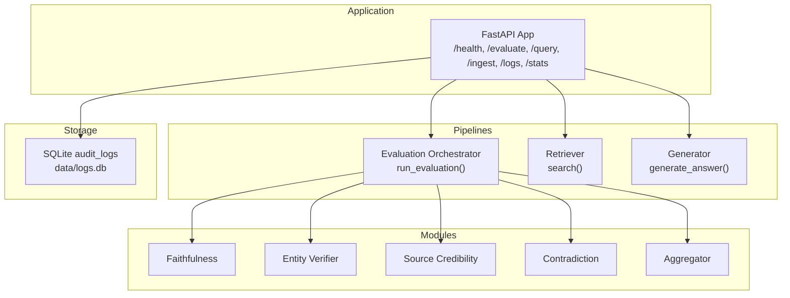
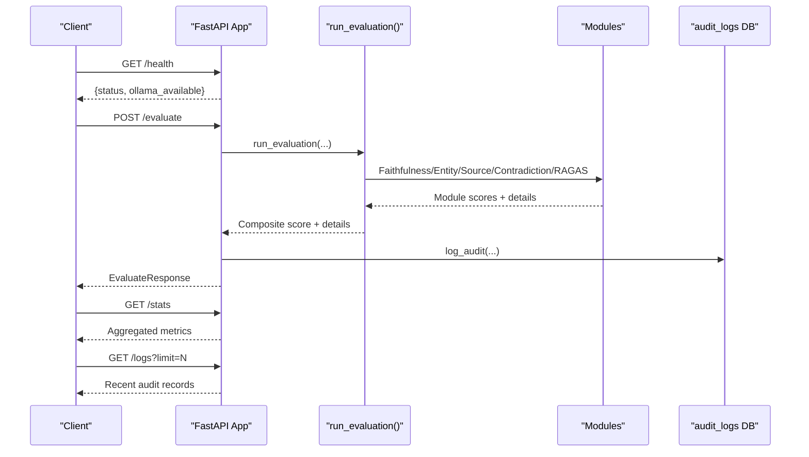
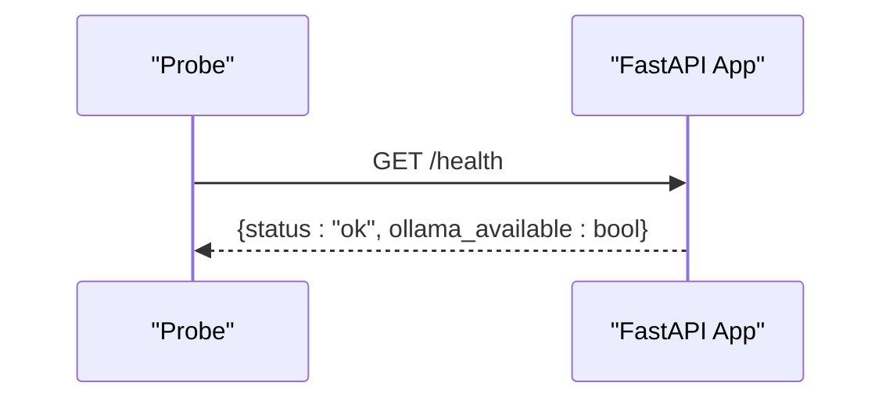
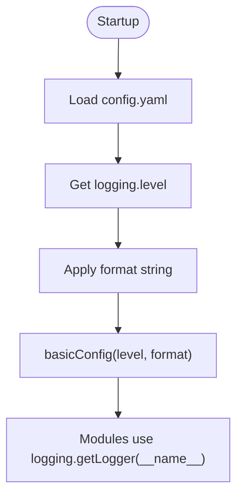
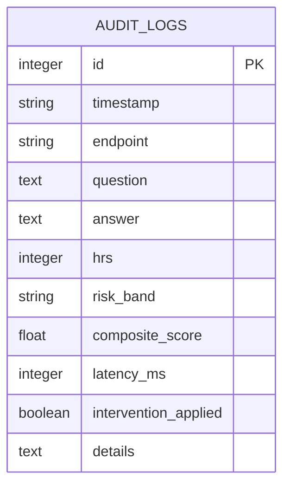
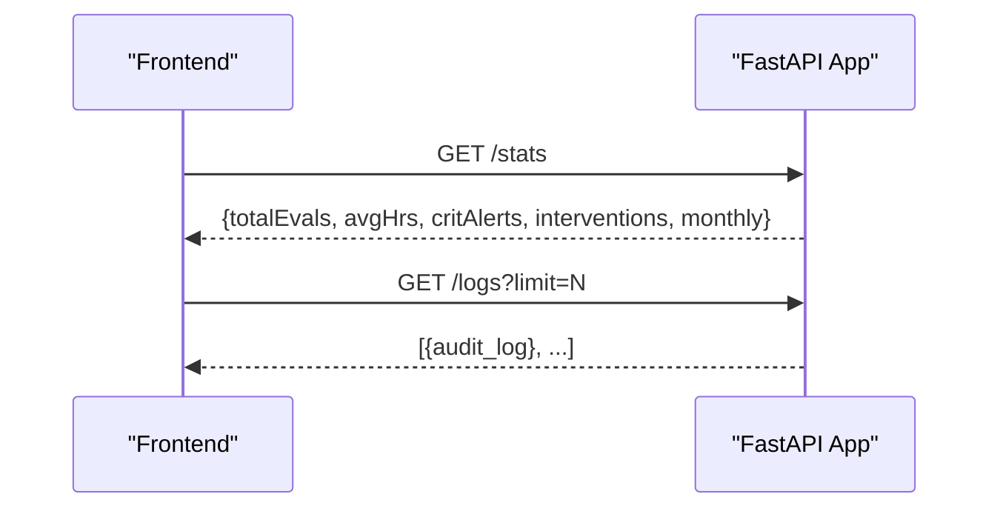
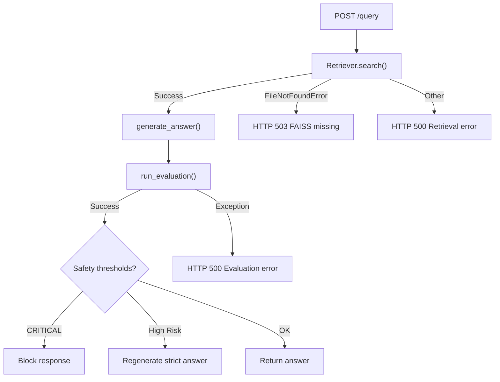
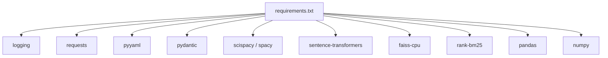

# Monitoring and Logging

<cite>
**Referenced Files in This Document**
- [main.py](file://Backend/src/api/main.py)
- [config.yaml](file://Backend/config.yaml)
- [generator.py](file://Backend/src/pipeline/generator.py)
- [retriever.py](file://Backend/src/pipeline/retriever.py)
- [evaluate.py](file://Backend/src/evaluate.py)
- [aggregator.py](file://Backend/src/evaluation/aggregator.py)
- [faithfulness.py](file://Backend/src/modules/faithfulness.py)
- [entity_verifier.py](file://Backend/src/modules/entity_verifier.py)
- [source_credibility.py](file://Backend/src/modules/source_credibility.py)
- [contradiction.py](file://Backend/src/modules/contradiction.py)
- [requirements.txt](file://Backend/requirements.txt)
</cite>

## Table of Contents
1. [Introduction](#introduction)
2. [Project Structure](#project-structure)
3. [Core Components](#core-components)
4. [Architecture Overview](#architecture-overview)
5. [Detailed Component Analysis](#detailed-component-analysis)
6. [Dependency Analysis](#dependency-analysis)
7. [Performance Considerations](#performance-considerations)
8. [Troubleshooting Guide](#troubleshooting-guide)
9. [Conclusion](#conclusion)
10. [Appendices](#appendices)

## Introduction
This document provides comprehensive guidance for monitoring and logging in MediRAG 3.0. It focuses on observability, health checks, operational visibility, structured logging, log levels, rotation strategies, system metrics collection, performance dashboards, error tracking, exception handling, alerting, audit logging for compliance, integration with monitoring platforms, custom metrics, business KPI tracking, anomaly detection, troubleshooting workflows, log analysis techniques, incident response procedures, security monitoring, intrusion detection, and compliance reporting for healthcare environments.

## Project Structure
The monitoring and logging surface spans the FastAPI application, evaluation pipeline, retrieval pipeline, and auxiliary modules. Key areas include:
- Application lifecycle and health checks
- Structured logging configuration and sinks
- Audit logging for compliance and user activity
- Metrics exposure for dashboards and alerting
- Error tracking and exception handling
- Integration touchpoints for external monitoring systems



**Diagram sources**
- [main.py:206-218](file://Backend/src/api/main.py#L206-L218)
- [main.py:223-302](file://Backend/src/api/main.py#L223-L302)
- [main.py:308-520](file://Backend/src/api/main.py#L308-L520)
- [main.py:526-604](file://Backend/src/api/main.py#L526-L604)
- [main.py:608-649](file://Backend/src/api/main.py#L608-L649)
- [evaluate.py:49-167](file://Backend/src/evaluate.py#L49-L167)
- [retriever.py:149-250](file://Backend/src/pipeline/retriever.py#L149-L250)
- [generator.py:344-413](file://Backend/src/pipeline/generator.py#L344-L413)
- [faithfulness.py:86-234](file://Backend/src/modules/faithfulness.py#L86-L234)
- [entity_verifier.py:146-283](file://Backend/src/modules/entity_verifier.py#L146-L283)
- [source_credibility.py:121-200](file://Backend/src/modules/source_credibility.py#L121-L200)
- [contradiction.py:94-251](file://Backend/src/modules/contradiction.py#L94-L251)
- [aggregator.py:47-167](file://Backend/src/evaluation/aggregator.py#L47-L167)

**Section sources**
- [main.py:1-678](file://Backend/src/api/main.py#L1-L678)
- [config.yaml:1-66](file://Backend/config.yaml#L1-L66)

## Core Components
- Health checks: A dedicated endpoint reports liveness and external service availability.
- Structured logging: Centralized logging configuration with configurable level and file sink.
- Audit logging: Persistent storage of evaluation/query events for compliance and dashboards.
- Metrics endpoints: Expose statistics and recent logs for dashboard consumption.
- Error handling: Graceful degradation and informative HTTP responses with detailed logs.
- Metrics collection: Built-in latency tracking and composite score computation for downstream dashboards.

**Section sources**
- [main.py:206-218](file://Backend/src/api/main.py#L206-L218)
- [main.py:64-68](file://Backend/src/api/main.py#L64-L68)
- [main.py:75-120](file://Backend/src/api/main.py#L75-L120)
- [main.py:608-649](file://Backend/src/api/main.py#L608-L649)
- [evaluate.py:75-167](file://Backend/src/evaluate.py#L75-L167)

## Architecture Overview
The monitoring architecture integrates internal logging, audit storage, and HTTP endpoints to support operational visibility and compliance.



**Diagram sources**
- [main.py:206-218](file://Backend/src/api/main.py#L206-L218)
- [main.py:223-302](file://Backend/src/api/main.py#L223-L302)
- [main.py:608-649](file://Backend/src/api/main.py#L608-L649)
- [evaluate.py:49-167](file://Backend/src/evaluate.py#L49-L167)

## Detailed Component Analysis

### Health Checks and Readiness
- Endpoint: GET /health returns application status and external service availability (e.g., Ollama).
- Implementation: Lightweight check with minimal dependencies to avoid masking real failures.
- Observability: Enables platform health probes and alerting on unavailability.



**Diagram sources**
- [main.py:206-218](file://Backend/src/api/main.py#L206-L218)

**Section sources**
- [main.py:206-218](file://Backend/src/api/main.py#L206-L218)

### Structured Logging Configuration
- Centralized setup: Loads logging level from config.yaml and applies a standard format.
- Sink: Writes to a file path configured in config.yaml.
- Levels: Controlled via config; typical values include INFO, WARNING, ERROR.
- Rotation strategy: Not configured in code; recommend integrating external log rotation tools.



**Diagram sources**
- [main.py:54-68](file://Backend/src/api/main.py#L54-L68)
- [config.yaml:62-66](file://Backend/config.yaml#L62-L66)

**Section sources**
- [main.py:54-68](file://Backend/src/api/main.py#L54-L68)
- [config.yaml:62-66](file://Backend/config.yaml#L62-L66)

### Audit Logging and Compliance
- Storage: SQLite database with a dedicated audit_logs table.
- Fields: Timestamp, endpoint, question, answer, HRS, risk band, composite score, latency, intervention flag, and details.
- Persistence: Insertion occurs after evaluation or query completion.
- Access: Endpoints expose recent logs and aggregated statistics for dashboards.



**Diagram sources**
- [main.py:80-92](file://Backend/src/api/main.py#L80-L92)
- [main.py:97-120](file://Backend/src/api/main.py#L97-L120)
- [main.py:608-649](file://Backend/src/api/main.py#L608-L649)

**Section sources**
- [main.py:75-120](file://Backend/src/api/main.py#L75-L120)
- [main.py:608-649](file://Backend/src/api/main.py#L608-L649)

### Metrics Collection and Dashboards
- Endpoints:
  - GET /stats: Provides totals, averages, critical alerts, interventions, and monthly trends.
  - GET /logs: Returns recent audit records for dashboard rendering.
- Data sources:
  - Composite scores and latency from evaluation results.
  - Intervention flags and risk bands for safety gating.
- Dashboard integration: Frontend consumes these endpoints to render charts and summaries.



**Diagram sources**
- [main.py:608-649](file://Backend/src/api/main.py#L608-L649)

**Section sources**
- [main.py:608-649](file://Backend/src/api/main.py#L608-L649)

### Error Tracking and Exception Handling
- Evaluation pipeline:
  - Centralized try/catch around run_evaluation; logs exceptions and returns HTTP 500 with details.
- Query pipeline:
  - Retrieval, generation, and evaluation steps guarded with specific HTTP exceptions and detailed messages.
  - Safety intervention logs warnings and regenerates answers when risks exceed thresholds.
- Generator:
  - Provider-specific error handling with informative runtime errors and timeouts.
- Retriever:
  - Robust error logging for model, index, and BM25 loading failures.



**Diagram sources**
- [main.py:308-520](file://Backend/src/api/main.py#L308-L520)
- [evaluate.py:49-167](file://Backend/src/evaluate.py#L49-L167)
- [generator.py:131-176](file://Backend/src/pipeline/generator.py#L131-L176)
- [generator.py:177-232](file://Backend/src/pipeline/generator.py#L177-L232)
- [generator.py:238-284](file://Backend/src/pipeline/generator.py#L238-L284)
- [generator.py:290-338](file://Backend/src/pipeline/generator.py#L290-L338)

**Section sources**
- [main.py:247-262](file://Backend/src/api/main.py#L247-L262)
- [main.py:336-344](file://Backend/src/api/main.py#L336-L344)
- [main.py:407-411](file://Backend/src/api/main.py#L407-L411)
- [main.py:428-485](file://Backend/src/api/main.py#L428-L485)
- [evaluate.py:75-167](file://Backend/src/evaluate.py#L75-L167)
- [generator.py:131-176](file://Backend/src/pipeline/generator.py#L131-L176)
- [generator.py:177-232](file://Backend/src/pipeline/generator.py#L177-L232)
- [generator.py:238-284](file://Backend/src/pipeline/generator.py#L238-L284)
- [generator.py:290-338](file://Backend/src/pipeline/generator.py#L290-L338)

### Evaluation Pipeline Metrics and Safety Interventions
- Latency tracking: Total pipeline duration and per-module timings included in details.
- Composite scoring: Converts composite score to Health Risk Score (HRS) and assigns risk bands.
- Safety gates:
  - CRITICAL_BLOCKED: Blocks unsafe answers when HRS exceeds threshold.
  - HIGH_RISK_REGENERATED: Strict regeneration and re-evaluation to mitigate risk.

```mermaid
flowchart TD
Start(["run_evaluation()"]) --> Modules["Faithfulness/Entity/Source/Contradiction"]
Modules --> OptionalRagas["Optional RAGAS"]
OptionalRagas --> Aggregate["Aggregate + HRS"]
Aggregate --> Safety{"HRS thresholds?"}
Safety --> |≥86| Block["CRITICAL_BLOCKED"]
Safety --> |[40,86)| Strict["Regenerate strict answer"]
Strict --> ReEval["Re-evaluate"]
ReEval --> Aggregate
Safety --> |<40| Done["Return result"]
Block --> Done
ReEval --> Done
```

**Diagram sources**
- [evaluate.py:49-167](file://Backend/src/evaluate.py#L49-L167)
- [aggregator.py:109-129](file://Backend/src/evaluation/aggregator.py#L109-L129)
- [main.py:431-485](file://Backend/src/api/main.py#L431-L485)

**Section sources**
- [evaluate.py:75-167](file://Backend/src/evaluate.py#L75-L167)
- [aggregator.py:109-129](file://Backend/src/evaluation/aggregator.py#L109-L129)
- [main.py:431-485](file://Backend/src/api/main.py#L431-L485)

### Retrieval and Generation Observability
- Retriever:
  - Logs model loading, index loading, BM25 rebuilds, and hybrid search outcomes.
  - Handles missing dependencies and degraded modes gracefully.
- Generator:
  - Logs provider calls, response lengths, and timing.
  - Provides informative errors for missing API keys and timeouts.

**Section sources**
- [retriever.py:66-114](file://Backend/src/pipeline/retriever.py#L66-L114)
- [retriever.py:178-206](file://Backend/src/pipeline/retriever.py#L178-L206)
- [generator.py:155-175](file://Backend/src/pipeline/generator.py#L155-L175)
- [generator.py:209-231](file://Backend/src/pipeline/generator.py#L209-L231)
- [generator.py:255-283](file://Backend/src/pipeline/generator.py#L255-L283)
- [generator.py:315-337](file://Backend/src/pipeline/generator.py#L315-L337)

### Ingestion and Operational Visibility
- Thread-safe ingestion with atomic writes to FAISS and metadata stores.
- Logs successful injection and chunk counts for auditability.

**Section sources**
- [main.py:526-604](file://Backend/src/api/main.py#L526-L604)

## Dependency Analysis
External dependencies relevant to monitoring and logging include logging frameworks, HTTP clients, and optional ML libraries. These influence error handling, timeouts, and observability.



**Diagram sources**
- [requirements.txt:1-35](file://Backend/requirements.txt#L1-L35)

**Section sources**
- [requirements.txt:1-35](file://Backend/requirements.txt#L1-L35)

## Performance Considerations
- Latency instrumentation: All major steps record elapsed time for dashboards and profiling.
- Model caching: Lazy loading with shared instances reduces cold-start overhead.
- Degraded modes: Graceful fallbacks when optional dependencies are missing.
- Concurrency: Ingestion uses locks and atomic writes to maintain consistency.

[No sources needed since this section provides general guidance]

## Troubleshooting Guide
- Health check failures:
  - Verify Ollama availability and base URL configuration.
- Evaluation errors:
  - Review detailed HTTP 500 responses and application logs for module-specific failures.
- Retrieval issues:
  - Confirm FAISS index existence and BM25 installation; check logs for load failures.
- Generation failures:
  - Validate provider credentials and timeouts; inspect provider-specific error messages.
- Audit data not appearing:
  - Ensure database initialization and write permissions; confirm log_audit calls succeed.

**Section sources**
- [main.py:179-186](file://Backend/src/api/main.py#L179-L186)
- [main.py:256-262](file://Backend/src/api/main.py#L256-L262)
- [retriever.py:87-114](file://Backend/src/pipeline/retriever.py#L87-L114)
- [generator.py:131-176](file://Backend/src/pipeline/generator.py#L131-L176)
- [generator.py:177-232](file://Backend/src/pipeline/generator.py#L177-L232)
- [generator.py:238-284](file://Backend/src/pipeline/generator.py#L238-L284)
- [generator.py:290-338](file://Backend/src/pipeline/generator.py#L290-L338)

## Conclusion
MediRAG 3.0 provides a solid foundation for observability through structured logging, health checks, audit logging, and metrics endpoints. To achieve enterprise-grade monitoring, integrate external log rotation, centralized log management, and metrics/alerting platforms. Align alerting with safety thresholds and risk bands to ensure timely incident response while maintaining compliance.

[No sources needed since this section summarizes without analyzing specific files]

## Appendices

### Log Levels and Rotation Strategies
- Current configuration: Level and file path are configurable; rotation is not implemented in code.
- Recommended practices:
  - Use external log rotation tools (e.g., logrotate) to manage file sizes and retention.
  - Consider structured JSON logging for centralized log management systems.
  - Ship logs to a SIEM or log aggregation platform for correlation and alerting.

**Section sources**
- [config.yaml:62-66](file://Backend/config.yaml#L62-L66)

### Metrics and Alerting Targets
- Metrics endpoints:
  - /stats: total evaluations, average HRS, critical alerts, interventions, monthly trends.
  - /logs: recent audit records for dashboard rendering.
- Alerting suggestions:
  - Critical HRS breaches (>85) and frequent interventions.
  - Ollama unavailability and repeated retrieval failures.
  - Elevated latency percentiles and module error rates.

**Section sources**
- [main.py:608-649](file://Backend/src/api/main.py#L608-L649)

### Integration with Monitoring Platforms
- Prometheus/Grafana:
  - Expose metrics via an exporter or pushgateway; visualize dashboards for HRS, latency, and intervention rates.
- ELK Stack:
  - Forward application logs to Logstash/Fluentd; index in Elasticsearch; visualize in Kibana.
- Security and Compliance:
  - Monitor audit logs for unauthorized access attempts and policy violations.
  - Enforce retention policies aligned with healthcare compliance requirements.

[No sources needed since this section provides general guidance]

### Business KPIs and Anomaly Detection
- KPIs:
  - Average HRS, percentage in critical/moderate bands, intervention rate, and monthly trends.
- Anomaly detection:
  - Use statistical baselines and ML-based detectors on latency, error rates, and HRS distributions.

[No sources needed since this section provides general guidance]