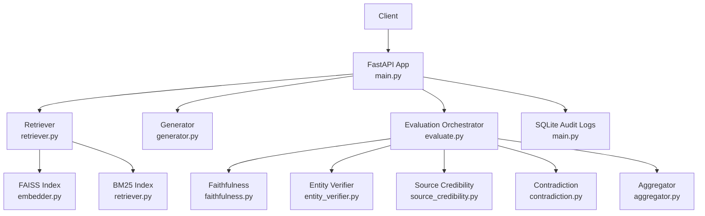
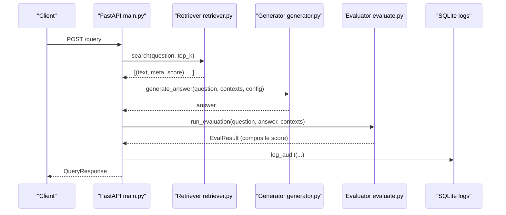
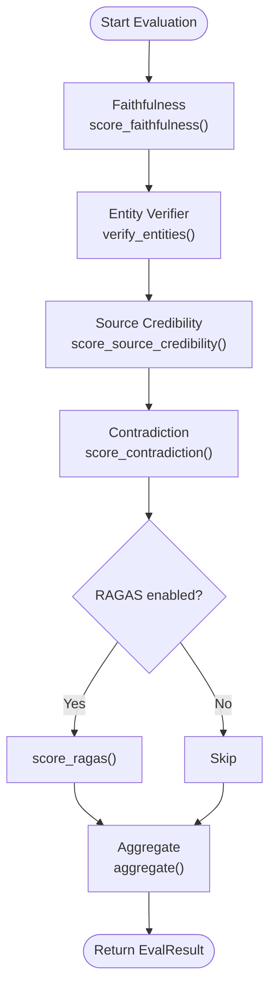
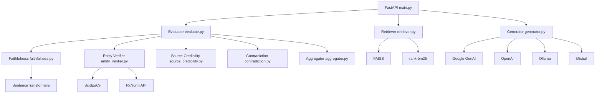

# Performance Optimization

<cite>
**Referenced Files in This Document**
- [config.yaml](file://Backend/config.yaml)
- [main.py](file://Backend/src/api/main.py)
- [embedder.py](file://Backend/src/pipeline/embedder.py)
- [retriever.py](file://Backend/src/pipeline/retriever.py)
- [faithfulness.py](file://Backend/src/modules/faithfulness.py)
- [entity_verifier.py](file://Backend/src/modules/entity_verifier.py)
- [source_credibility.py](file://Backend/src/modules/source_credibility.py)
- [contradiction.py](file://Backend/src/modules/contradiction.py)
- [aggregator.py](file://Backend/src/evaluation/aggregator.py)
- [evaluate.py](file://Backend/src/evaluate.py)
- [generator.py](file://Backend/src/pipeline/generator.py)
- [warmup.py](file://Backend/scripts/warmup.py)
- [requirements.txt](file://Backend/requirements.txt)
</cite>

## Table of Contents
1. [Introduction](#introduction)
2. [Project Structure](#project-structure)
3. [Core Components](#core-components)
4. [Architecture Overview](#architecture-overview)
5. [Detailed Component Analysis](#detailed-component-analysis)
6. [Dependency Analysis](#dependency-analysis)
7. [Performance Considerations](#performance-considerations)
8. [Troubleshooting Guide](#troubleshooting-guide)
9. [Conclusion](#conclusion)
10. [Appendices](#appendices)

## Introduction
This document provides a comprehensive performance optimization guide for MediRAG 3.0. It focuses on system tuning, resource management, and scalability strategies across the retrieval, evaluation, and generation pipeline. Topics include GPU utilization optimization for transformer models, memory management for large language models, FAISS index performance tuning, batch processing optimization, concurrent request handling, thread pool configuration, model quantization strategies, inference optimization, caching mechanisms, database performance tuning, index optimization for vector search, query optimization for retrieval systems, monitoring and profiling tools, bottleneck identification techniques, capacity planning, horizontal and vertical scaling, load balancing, auto-scaling policies, performance benchmarking, A/B testing frameworks, and continuous performance monitoring.

## Project Structure
The backend is organized around a FastAPI application orchestrating retrieval, generation, and evaluation modules. Key areas for performance optimization:
- Retrieval: FAISS index and hybrid BM25 ranking with Reciprocal Rank Fusion
- Generation: Multi-provider LLM orchestration (Gemini, OpenAI, Ollama, Mistral)
- Evaluation: Faithfulness, Entity Verification, Source Credibility, Contradiction, Aggregation, optional RAGAS
- Persistence: SQLite audit logs and FAISS artifacts
- Warm-up and ingestion: Atomic index updates and preloading

**Diagram sources**
- [main.py:156-165](file://Backend/src/api/main.py#L156-L165)
- [retriever.py:39-108](file://Backend/src/pipeline/retriever.py#L39-L108)
- [embedder.py:81-92](file://Backend/src/pipeline/embedder.py#L81-L92)
- [generator.py:344-412](file://Backend/src/pipeline/generator.py#L344-L412)
- [evaluate.py:49-167](file://Backend/src/evaluate.py#L49-L167)
- [faithfulness.py:86-233](file://Backend/src/modules/faithfulness.py#L86-L233)
- [entity_verifier.py:146-282](file://Backend/src/modules/entity_verifier.py#L146-L282)
- [source_credibility.py:121-199](file://Backend/src/modules/source_credibility.py#L121-L199)
- [contradiction.py:94-250](file://Backend/src/modules/contradiction.py#L94-L250)
- [aggregator.py:47-166](file://Backend/src/evaluation/aggregator.py#L47-L166)

**Section sources**
- [main.py:156-165](file://Backend/src/api/main.py#L156-L165)
- [retriever.py:39-108](file://Backend/src/pipeline/retriever.py#L39-L108)
- [embedder.py:81-92](file://Backend/src/pipeline/embedder.py#L81-L92)
- [generator.py:344-412](file://Backend/src/pipeline/generator.py#L344-L412)
- [evaluate.py:49-167](file://Backend/src/evaluate.py#L49-L167)
- [faithfulness.py:86-233](file://Backend/src/modules/faithfulness.py#L86-L233)
- [entity_verifier.py:146-282](file://Backend/src/modules/entity_verifier.py#L146-L282)
- [source_credibility.py:121-199](file://Backend/src/modules/source_credibility.py#L121-L199)
- [contradiction.py:94-250](file://Backend/src/modules/contradiction.py#L94-L250)
- [aggregator.py:47-166](file://Backend/src/evaluation/aggregator.py#L47-L166)

## Core Components
- Retrieval pipeline with FAISS (cosine similarity via inner product) and BM25 with Reciprocal Rank Fusion
- Evaluation modules with lazy model loading and batching
- Multi-provider generation with configurable timeouts and temperature
- SQLite audit logging for performance and safety tracking
- Atomic FAISS index updates with thread-safety and disk atomicity

Key performance levers:
- FAISS index construction and normalization
- Model warm-up and caching
- Batch sizes and truncation strategies
- Top-k and candidate fetching thresholds
- Concurrency and timeouts for external LLM providers

**Section sources**
- [config.yaml:1-66](file://Backend/config.yaml#L1-L66)
- [retriever.py:149-250](file://Backend/src/pipeline/retriever.py#L149-L250)
- [embedder.py:55-78](file://Backend/src/pipeline/embedder.py#L55-L78)
- [faithfulness.py:58-69](file://Backend/src/modules/faithfulness.py#L58-L69)
- [entity_verifier.py:70-86](file://Backend/src/modules/entity_verifier.py#L70-L86)
- [generator.py:344-412](file://Backend/src/pipeline/generator.py#L344-L412)
- [main.py:75-120](file://Backend/src/api/main.py#L75-L120)
- [main.py:524-603](file://Backend/src/api/main.py#L524-L603)

## Architecture Overview
End-to-end flow for /query endpoint:
1. Retrieve top-k context using hybrid FAISS + BM25
2. Generate grounded answer via selected LLM provider
3. Evaluate answer using faithfulness, entity verification, source credibility, contradiction detection, and optional RAGAS
4. Apply safety interventions and record audit logs

**Diagram sources**
- [main.py:308-519](file://Backend/src/api/main.py#L308-L519)
- [retriever.py:149-250](file://Backend/src/pipeline/retriever.py#L149-L250)
- [generator.py:344-412](file://Backend/src/pipeline/generator.py#L344-L412)
- [evaluate.py:49-167](file://Backend/src/evaluate.py#L49-L167)

## Detailed Component Analysis

### Retrieval Pipeline (FAISS + BM25)
- FAISS index built with normalized vectors for cosine similarity
- Lazy loading of model and index
- BM25 index rebuilt on demand and lazily constructed
- Hybrid search with Reciprocal Rank Fusion and candidate oversampling
- Atomic ingestion with thread-safety and disk atomicity

Optimization opportunities:
- Tune fetch_k and RRF_K for latency vs. recall trade-offs
- Adjust top_k and chunk limits to balance quality and speed
- Normalize embeddings once during ingestion to avoid repeated normalization
- Consider alternate FAISS index types (IVF/PQ) for larger corpora

**Section sources**
- [retriever.py:80-114](file://Backend/src/pipeline/retriever.py#L80-L114)
- [retriever.py:115-143](file://Backend/src/pipeline/retriever.py#L115-L143)
- [retriever.py:149-250](file://Backend/src/pipeline/retriever.py#L149-L250)
- [embedder.py:81-92](file://Backend/src/pipeline/embedder.py#L81-L92)
- [embedder.py:66-78](file://Backend/src/pipeline/embedder.py#L66-L78)
- [main.py:524-603](file://Backend/src/api/main.py#L524-L603)

### Embedding and Index Construction
- SentenceTransformer BioBERT model with batch encoding and L2 normalization
- FAISS IndexFlatIP built and persisted
- Metadata store saved as pickle alongside index

Optimization opportunities:
- Use smaller embedding models or adapters for constrained environments
- Persist and reuse encoders to avoid double loading
- Consider quantized or pruned SentenceTransformer variants if supported

**Section sources**
- [embedder.py:55-78](file://Backend/src/pipeline/embedder.py#L55-L78)
- [embedder.py:81-92](file://Backend/src/pipeline/embedder.py#L81-L92)
- [embedder.py:117-136](file://Backend/src/pipeline/embedder.py#L117-L136)

### Evaluation Modules
- Faithfulness: cross-encoder NLI scoring with claim segmentation and batching
- Entity Verification: SciSpaCy NER + RxNorm cache/API with offline-first strategy
- Source Credibility: tier-weighted scoring with keyword fallback
- Contradiction: NLI-based detection with keyword overlap filtering and capped pairs
- Aggregator: weighted composite with non-linear penalties and confidence mapping

Optimization opportunities:
- Reduce max_chunks and MAX_PAIRS to bound latency
- Cache model instances and segmenters across requests
- Use smaller NLI models or adapters for constrained GPUs
- Optimize RxNorm cache size and refresh cadence

**Diagram sources**
- [evaluate.py:49-167](file://Backend/src/evaluate.py#L49-L167)
- [faithfulness.py:86-233](file://Backend/src/modules/faithfulness.py#L86-L233)
- [entity_verifier.py:146-282](file://Backend/src/modules/entity_verifier.py#L146-L282)
- [source_credibility.py:121-199](file://Backend/src/modules/source_credibility.py#L121-L199)
- [contradiction.py:94-250](file://Backend/src/modules/contradiction.py#L94-L250)
- [aggregator.py:47-166](file://Backend/src/evaluation/aggregator.py#L47-L166)

**Section sources**
- [faithfulness.py:58-69](file://Backend/src/modules/faithfulness.py#L58-L69)
- [entity_verifier.py:70-86](file://Backend/src/modules/entity_verifier.py#L70-L86)
- [contradiction.py:55-68](file://Backend/src/modules/contradiction.py#L55-L68)
- [aggregator.py:69-107](file://Backend/src/evaluation/aggregator.py#L69-L107)
- [evaluate.py:49-167](file://Backend/src/evaluate.py#L49-L167)

### Generation Pipeline
- Provider selection: Gemini, OpenAI, Ollama, Mistral
- Prompt engineering with context citations
- Strict mode prompt for safety regeneration
- Configurable timeouts and temperatures

Optimization opportunities:
- Tune generation_temperature for determinism vs. diversity
- Increase max tokens cautiously to avoid timeouts
- Use provider-specific optimizations (e.g., Gemini Flash Lite) for cost/performance
- Implement connection pooling and retry/backoff for external APIs

**Section sources**
- [generator.py:344-412](file://Backend/src/pipeline/generator.py#L344-L412)
- [generator.py:415-461](file://Backend/src/pipeline/generator.py#L415-L461)
- [generator.py:177-231](file://Backend/src/pipeline/generator.py#L177-L231)
- [generator.py:131-175](file://Backend/src/pipeline/generator.py#L131-L175)
- [generator.py:238-283](file://Backend/src/pipeline/generator.py#L238-L283)
- [generator.py:290-337](file://Backend/src/pipeline/generator.py#L290-L337)

### Database and Audit Logging
- SQLite table for audit logs with indexed fields
- Structured logging of latency, HRS, and intervention flags
- Dashboard endpoints for stats and logs

Optimization opportunities:
- Add indexes on frequently queried columns (risk_band, timestamp)
- Rotate and archive logs to control growth
- Consider partitioning or offloading historical data

**Section sources**
- [main.py:75-120](file://Backend/src/api/main.py#L75-L120)
- [main.py:608-648](file://Backend/src/api/main.py#L608-L648)

### Ingestion and Index Updates
- Thread-safe FAISS updates with atomic disk writes
- Reuse of SentenceTransformer to avoid double RAM usage
- Rebuild of BM25 index after ingestion

Optimization opportunities:
- Batch ingestion to reduce write frequency
- Use FAISS write-ahead logs or staging buffers
- Monitor and cap index growth to maintain search latency

**Section sources**
- [main.py:524-603](file://Backend/src/api/main.py#L524-L603)
- [embedder.py:55-78](file://Backend/src/pipeline/embedder.py#L55-L78)

## Dependency Analysis
External dependencies impacting performance:
- FAISS (vector search), SentenceTransformers (embeddings), Transformers (NLI models)
- SciSpaCy and RxNorm API (entity verification)
- Google GenAI, OpenAI, Ollama, Mistral (generation)
- SQLite (audit logs)

**Diagram sources**
- [requirements.txt:1-35](file://Backend/requirements.txt#L1-L35)
- [main.py:156-165](file://Backend/src/api/main.py#L156-L165)
- [retriever.py:39-108](file://Backend/src/pipeline/retriever.py#L39-L108)
- [faithfulness.py:62-64](file://Backend/src/modules/faithfulness.py#L62-L64)
- [entity_verifier.py:70-86](file://Backend/src/modules/entity_verifier.py#L70-L86)
- [generator.py:177-231](file://Backend/src/pipeline/generator.py#L177-L231)

**Section sources**
- [requirements.txt:1-35](file://Backend/requirements.txt#L1-L35)

## Performance Considerations

### GPU Utilization Optimization for Transformer Models
- Prefer GPU-accelerated backends where available (e.g., local Ollama with CUDA)
- Use appropriate batch sizes to maximize GPU utilization without OOM
- Consider model distillation or adapters for constrained GPUs
- Monitor GPU memory and throughput; adjust batch sizes and model sizes accordingly

### Memory Management for Large Language Models
- Pre-warm models at startup to avoid cold-start latency spikes
- Cache model instances and segmenters to prevent repeated loads
- Use smaller models or quantized variants when feasible
- Monitor memory pressure and enable garbage collection periodically

### FAISS Index Performance Tuning
- Normalize embeddings during ingestion to avoid runtime normalization
- Use appropriate index types (IndexFlatIP) for small to medium corpora
- For large-scale deployments, consider IVF/PQ or HNSW approximations
- Keep top_k and fetch_k tuned to balance latency and recall

### Batch Processing Optimization
- Batch NLI inference in faithfulness and contradiction modules
- Limit context chunk counts and sentence pairs to cap latency
- Use oversampling (fetch_k) with RRF to improve recall without excessive latency

### Concurrent Request Handling and Thread Pool Configuration
- FastAPI with Uvicorn: configure workers and threads appropriately
- Use asynchronous I/O for external API calls (Gemini, OpenAI, RxNorm)
- Implement rate limiting and circuit breakers for external services
- Use thread locks for FAISS updates to prevent corruption

### Model Quantization Strategies and Inference Optimization
- Explore quantized SentenceTransformers and NLI models if supported
- Use model adapters or pruning techniques for reduced footprint
- Enable ONNX Runtime or TensorRT where applicable

### Caching Mechanisms
- RxNorm cache for offline-first entity verification
- Pre-warm DeBERTa and SciSpaCy models at application startup
- Cache FAISS and BM25 indices in memory after initial load

### Database Performance Tuning
- Add indexes on audit logs for frequent queries (risk_band, timestamp)
- Archive or partition historical data
- Use connection pooling and optimize SQLite pragmas for write-heavy workloads

### Monitoring and Profiling Tools
- Instrument latency at each stage (/query, /evaluate, module-level)
- Track HRS, confidence levels, and intervention rates
- Use structured logs and metrics dashboards for trend analysis

### Bottleneck Identification Techniques
- Use latency histograms and percentiles to identify outliers
- Profile module-level latencies to locate hotspots
- Monitor external service latencies and error rates

### Capacity Planning
- Estimate peak QPS and memory/CPU/GPU requirements
- Plan headroom for spikes and seasonal loads
- Use auto-scaling policies based on CPU, memory, and latency targets

### Horizontal and Vertical Scaling
- Horizontal scaling: deploy multiple replicas behind a load balancer
- Vertical scaling: increase instance size for memory/GPU-bound workloads
- Use stateless design for easy horizontal scaling

### Load Balancing and Auto-Scaling Policies
- Round-robin or least-connections load balancing
- Auto-scaling based on CPU utilization, queue depth, or latency targets
- Health checks for external dependencies (FAISS, LLM providers)

### Performance Benchmarking and A/B Testing
- Define SLIs/SLOs (latency, availability, HRS distribution)
- Run periodic A/B tests for model or prompt changes
- Use synthetic and real traffic datasets for reproducible benchmarks

### Continuous Performance Monitoring
- Dashboards for latency, error rates, and throughput
- Alerts for regressions and anomalies
- Postmortems for incidents with performance impact

[No sources needed since this section provides general guidance]

## Troubleshooting Guide

Common issues and remedies:
- FAISS index not found: ensure ingestion pipeline ran and index files exist
- Ollama connectivity failures: verify base URL and model availability
- RxNorm API timeouts: increase timeouts and monitor API health
- SQLite write contention: ensure single writer or use WAL mode
- Cold-start latency: rely on warmup script and pre-warming at startup

**Section sources**
- [main.py:326-343](file://Backend/src/api/main.py#L326-L343)
- [main.py:179-185](file://Backend/src/api/main.py#L179-L185)
- [entity_verifier.py:120-139](file://Backend/src/modules/entity_verifier.py#L120-L139)
- [main.py:75-120](file://Backend/src/api/main.py#L75-L120)
- [warmup.py:23-56](file://Backend/scripts/warmup.py#L23-L56)

## Conclusion
MediRAG 3.0’s performance hinges on efficient retrieval, judicious model usage, and robust operational practices. By optimizing FAISS indexing, managing model lifecycles, tuning batch sizes, leveraging caching, and implementing strong monitoring and scaling strategies, the system can achieve predictable latency, high throughput, and reliable safety guarantees.

[No sources needed since this section summarizes without analyzing specific files]

## Appendices

### Configuration Reference Highlights
- Retrieval: top_k, chunk_size, chunk_overlap, embedding_model, index paths
- Modules: NLI model, thresholds, batch sizes, API endpoints and timeouts
- Aggregation: weights and risk bands
- LLM: provider, model, base URL, timeouts, temperatures
- API: host/port, max lengths, chunk limits
- Logging: level, file, format

**Section sources**
- [config.yaml:1-66](file://Backend/config.yaml#L1-L66)