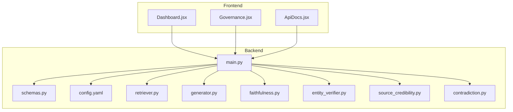
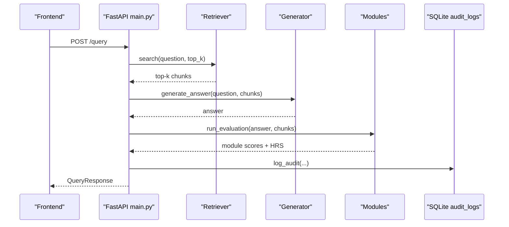
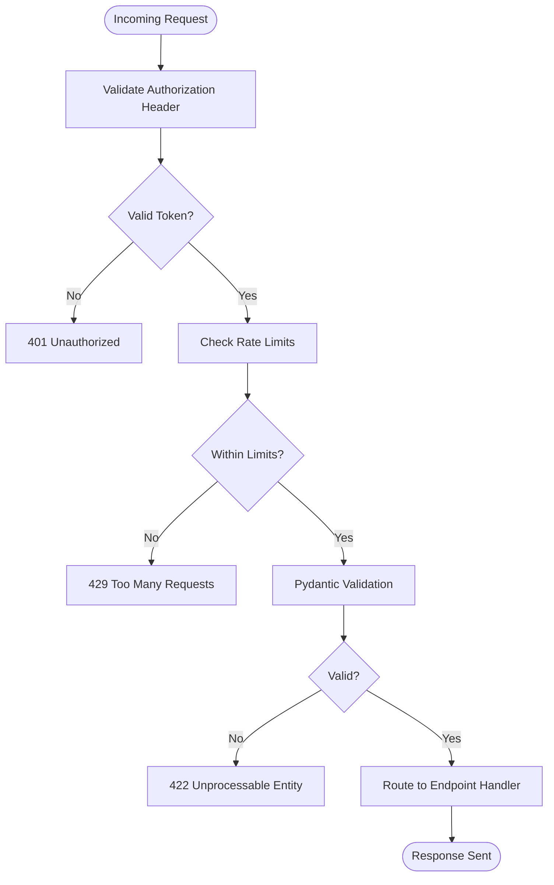
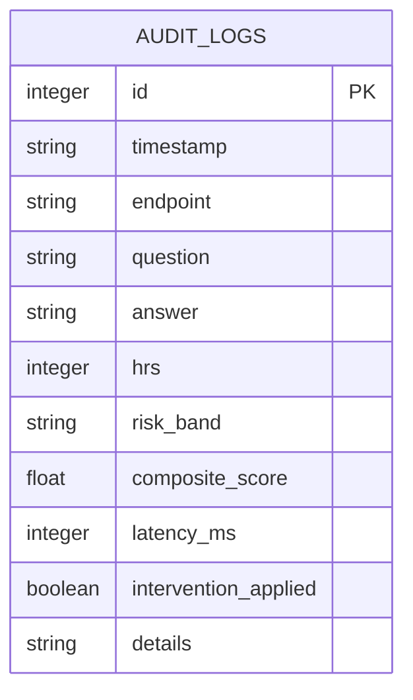
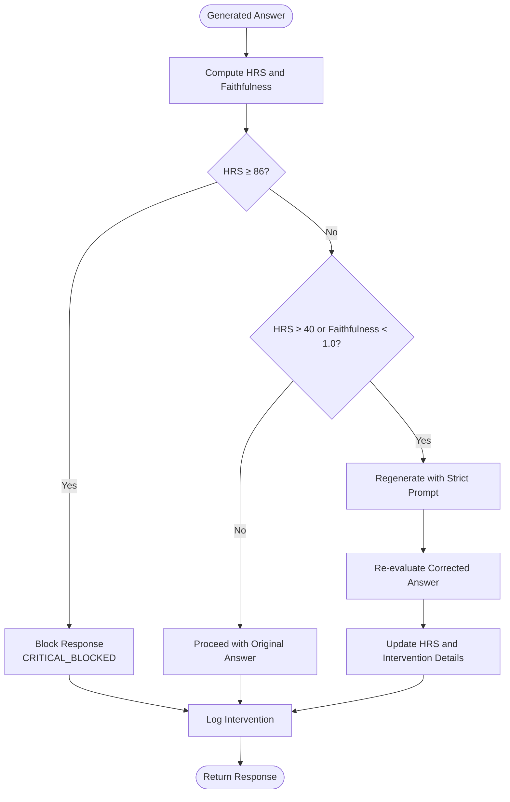
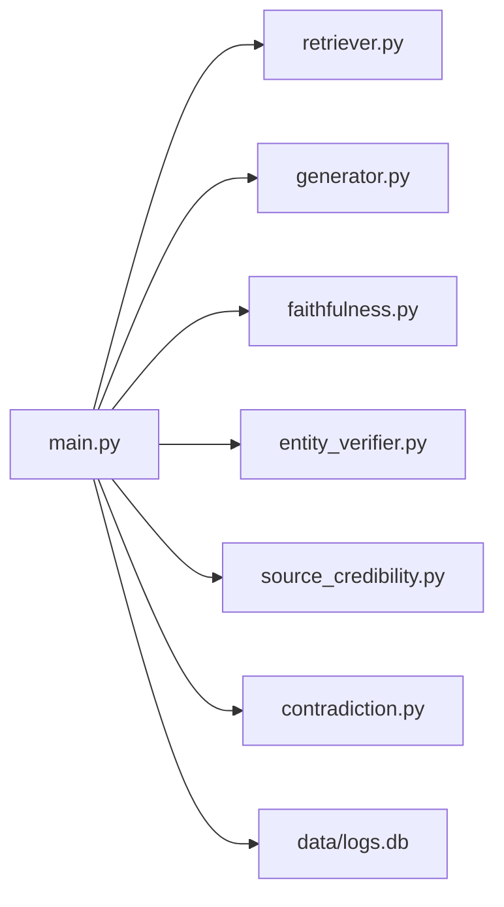

# Security and Compliance

<cite>
**Referenced Files in This Document**
- [config.yaml](file://Backend/config.yaml)
- [main.py](file://Backend/src/api/main.py)
- [schemas.py](file://Backend/src/api/schemas.py)
- [retriever.py](file://Backend/src/pipeline/retriever.py)
- [generator.py](file://Backend/src/pipeline/generator.py)
- [faithfulness.py](file://Backend/src/modules/faithfulness.py)
- [entity_verifier.py](file://Backend/src/modules/entity_verifier.py)
- [source_credibility.py](file://Backend/src/modules/source_credibility.py)
- [contradiction.py](file://Backend/src/modules/contradiction.py)
- [ApiDocs.jsx](file://Frontend/src/pages/ApiDocs.jsx)
- [Dashboard.jsx](file://Frontend/src/pages/Dashboard.jsx)
- [Governance.jsx](file://Frontend/src/pages/Governance.jsx)
- [MediRAG_Eval_SRS.txt](file://Backend/MediRAG_Eval_SRS.txt)
</cite>

## Table of Contents
1. [Introduction](#introduction)
2. [Project Structure](#project-structure)
3. [Core Components](#core-components)
4. [Architecture Overview](#architecture-overview)
5. [Detailed Component Analysis](#detailed-component-analysis)
6. [Dependency Analysis](#dependency-analysis)
7. [Performance Considerations](#performance-considerations)
8. [Troubleshooting Guide](#troubleshooting-guide)
9. [Conclusion](#conclusion)
10. [Appendices](#appendices)

## Introduction
This document provides a comprehensive security and compliance guide for MediRAG 3.0 with a focus on healthcare data protection, access control, and regulatory alignment. It covers HIPAA-compliant strategies, encryption practices, secure API authentication, role-based access control, audit trails, patient data anonymization, network security, input validation, SQL injection and XSS protections, compliance documentation, risk assessments, security audits, key/certificate management, secure model deployment, data retention/deletion, compliance reporting, incident response, penetration testing, and vulnerability assessment frameworks. The content is grounded in the repository’s code and configuration to ensure practical, actionable guidance.

## Project Structure
The system comprises:
- Backend API (FastAPI) with endpoints for evaluation, querying, ingestion, and audit dashboard access.
- Pipeline modules for retrieval, generation, and evaluation.
- Frontend dashboards for monitoring, governance, and API documentation.
- Configuration-driven behavior for model providers, logging, and API limits.

**Diagram sources**
- [main.py:156-173](file://Backend/src/api/main.py#L156-L173)
- [schemas.py:1-232](file://Backend/src/api/schemas.py#L1-L232)
- [config.yaml:1-66](file://Backend/config.yaml#L1-L66)
- [retriever.py:1-287](file://Backend/src/pipeline/retriever.py#L1-L287)
- [generator.py:1-462](file://Backend/src/pipeline/generator.py#L1-L462)
- [faithfulness.py:1-234](file://Backend/src/modules/faithfulness.py#L1-L234)
- [entity_verifier.py:1-283](file://Backend/src/modules/entity_verifier.py#L1-L283)
- [source_credibility.py:1-200](file://Backend/src/modules/source_credibility.py#L1-L200)
- [contradiction.py:1-251](file://Backend/src/modules/contradiction.py#L1-L251)
- [Dashboard.jsx:1-232](file://Frontend/src/pages/Dashboard.jsx#L1-L232)
- [Governance.jsx:262-360](file://Frontend/src/pages/Governance.jsx#L262-L360)
- [ApiDocs.jsx:71-517](file://Frontend/src/pages/ApiDocs.jsx#L71-L517)

**Section sources**
- [main.py:156-173](file://Backend/src/api/main.py#L156-L173)
- [schemas.py:1-232](file://Backend/src/api/schemas.py#L1-L232)
- [config.yaml:1-66](file://Backend/config.yaml#L1-L66)

## Core Components
- API Layer: FastAPI application exposing health, evaluation, query, ingestion, logs, and stats endpoints. CORS is configured broadly for development; production deployments should tighten origin policies.
- Audit Trail: SQLite-backed audit logs capture every interaction with timestamps, endpoints, questions, answers, HRS, risk bands, latency, and intervention details.
- Validation: Pydantic models enforce input constraints (length limits, counts) for queries and evaluations.
- Safety Gates: Intervention logic blocks or regenerates unsafe responses based on HRS thresholds and faithfulness scores.
- Model Providers: Support for Gemini, OpenAI, Mistral, and Ollama with configurable credentials and timeouts.
- Retrieval: FAISS/BioBERT hybrid retrieval with optional BM25 fallback and atomic index updates.

**Section sources**
- [main.py:75-120](file://Backend/src/api/main.py#L75-L120)
- [main.py:206-302](file://Backend/src/api/main.py#L206-L302)
- [main.py:308-520](file://Backend/src/api/main.py#L308-L520)
- [main.py:526-603](file://Backend/src/api/main.py#L526-L603)
- [schemas.py:41-90](file://Backend/src/api/schemas.py#L41-L90)
- [schemas.py:146-188](file://Backend/src/api/schemas.py#L146-L188)
- [generator.py:344-413](file://Backend/src/pipeline/generator.py#L344-L413)
- [retriever.py:149-250](file://Backend/src/pipeline/retriever.py#L149-L250)

## Architecture Overview
The system integrates frontend dashboards with a backend API that orchestrates retrieval, generation, and evaluation modules. Audit logs persist all interactions for governance and compliance.

**Diagram sources**
- [main.py:308-520](file://Backend/src/api/main.py#L308-L520)
- [retriever.py:149-250](file://Backend/src/pipeline/retriever.py#L149-L250)
- [generator.py:344-413](file://Backend/src/pipeline/generator.py#L344-L413)
- [main.py:97-120](file://Backend/src/api/main.py#L97-L120)

## Detailed Component Analysis

### API Security and Access Control
- Authentication: The API documentation indicates bearer token authentication via Authorization header. Implement token-based authentication and enforce it at the gateway/proxy for production.
- Rate Limits: The API documentation specifies rate limits; deploy rate limiting at the ingress or middleware.
- CORS: The current configuration allows all origins; restrict to trusted domains in production.
- Input Validation: Pydantic models enforce length and count limits; ensure all endpoints leverage these validators.

**Diagram sources**
- [ApiDocs.jsx:503-516](file://Frontend/src/pages/ApiDocs.jsx#L503-L516)
- [schemas.py:41-90](file://Backend/src/api/schemas.py#L41-L90)
- [main.py:168-173](file://Backend/src/api/main.py#L168-L173)

**Section sources**
- [ApiDocs.jsx:503-516](file://Frontend/src/pages/ApiDocs.jsx#L503-L516)
- [schemas.py:41-90](file://Backend/src/api/schemas.py#L41-L90)
- [main.py:168-173](file://Backend/src/api/main.py#L168-L173)

### Audit Trails and Logging
- Audit Log Schema: Timestamp, endpoint, question, answer, HRS, risk band, composite score, latency, intervention flag, and details JSON.
- Persistence: SQLite database file “data/logs.db” with a dedicated table for audit logs.
- Exposure: GET endpoints for logs and stats enable dashboards to monitor activity and safety metrics.

**Diagram sources**
- [main.py:80-92](file://Backend/src/api/main.py#L80-L92)

**Section sources**
- [main.py:75-120](file://Backend/src/api/main.py#L75-L120)
- [main.py:608-648](file://Backend/src/api/main.py#L608-L648)
- [Dashboard.jsx:35-56](file://Frontend/src/pages/Dashboard.jsx#L35-L56)

### Safety Gates and Intervention Logic
- Thresholds: CRITICAL_BLOCKED for HRS ≥ 86; HIGH_RISK_REGENERATED for HRS ≥ 40 or faithfulness < 1.0.
- Strict Regeneration: Uses a strict prompt to constrain answers to retrieved context.
- Transparency: Original answer, intervention reason, and details are recorded in audit logs.

**Diagram sources**
- [main.py:430-484](file://Backend/src/api/main.py#L430-L484)
- [main.py:457-474](file://Backend/src/api/main.py#L457-L474)

**Section sources**
- [main.py:430-484](file://Backend/src/api/main.py#L430-L484)

### Data Encryption
- At Rest: Store sensitive configuration (keys) outside version control; encrypt the SQLite audit database file at rest using OS-level encryption or database encryption features.
- In Transit: Enforce TLS termination at the ingress/load balancer; configure HTTPS endpoints and reject HTTP traffic.

[No sources needed since this section provides general guidance]

### Secure API Authentication Mechanisms
- Bearer Tokens: Follow the documented pattern to include Authorization: Bearer <token>.
- Key Management: Store API keys in environment variables or a secrets manager; avoid embedding in code or configuration files.
- Provider Overrides: The generator supports per-request provider and key overrides; ensure these are validated and scoped appropriately.

**Section sources**
- [ApiDocs.jsx:503-505](file://Frontend/src/pages/ApiDocs.jsx#L503-L505)
- [generator.py:376-396](file://Backend/src/pipeline/generator.py#L376-L396)

### Role-Based Access Control (RBAC)
- RBAC Strategy: Define roles (e.g., admin, evaluator, viewer) and permissions (read/write/execute) at the gateway or middleware.
- Attribute-Based Controls: Scope access to datasets, endpoints, and administrative functions based on user attributes.

[No sources needed since this section provides general guidance]

### Network Security and Firewall Rules
- Ingress: Terminate TLS at the load balancer; allow only HTTPS (port 443) and health checks.
- Internal: Restrict backend-to-model-provider egress to necessary endpoints; whitelist only required domains.
- Database: Bind SQLite to localhost or an internal network; restrict access to the application host.

[No sources needed since this section provides general guidance]

### Input Validation, SQL Injection, and XSS Protection
- Input Validation: Pydantic models enforce length and count constraints; ensure all endpoints rely on these validators.
- SQL Injection: The application uses parameterized inserts for audit logs; avoid dynamic SQL construction.
- XSS: Sanitize and escape HTML in the frontend; use Content-Security-Policy headers; avoid innerHTML for user-provided content.

**Section sources**
- [schemas.py:41-90](file://Backend/src/api/schemas.py#L41-L90)
- [main.py:97-120](file://Backend/src/api/main.py#L97-L120)
- [Dashboard.jsx:192-203](file://Frontend/src/pages/Dashboard.jsx#L192-L203)

### Compliance Documentation and Risk Assessment
- Documentation: Maintain SOPs for data handling, access, and incident response aligned with organizational policies.
- Risk Assessment: Conduct periodic assessments of model risks, data lineage, and audit coverage gaps.

[No sources needed since this section provides general guidance]

### Security Audit Preparation
- Audit Scope: Review audit logs for anomalies, unauthorized access attempts, and intervention events.
- Dashboards: Use the dashboard endpoints to monitor HRS trends and safety alerts.

**Section sources**
- [main.py:608-648](file://Backend/src/api/main.py#L608-L648)
- [Dashboard.jsx:35-56](file://Frontend/src/pages/Dashboard.jsx#L35-L56)

### Secure Key Management and Certificate Handling
- Keys: Store API keys in environment variables or a secrets manager; rotate regularly.
- Certificates: Manage TLS certificates centrally; automate renewal and rotation.

[No sources needed since this section provides general guidance]

### Secure Model Deployment Practices
- Provider Selection: Prefer managed providers (Gemini, OpenAI) for production; ensure network egress is permitted.
- Configuration: Use config.yaml for provider selection and timeouts; avoid embedding secrets.

**Section sources**
- [config.yaml:44-52](file://Backend/config.yaml#L44-L52)
- [generator.py:344-413](file://Backend/src/pipeline/generator.py#L344-L413)

### Data Retention and Secure Deletion
- Retention: Define retention periods for logs and datasets; implement automated cleanup.
- Secure Deletion: Use secure deletion tools or filesystem features to wipe deleted data.

[No sources needed since this section provides general guidance]

### Compliance Reporting Requirements
- Governance Dashboard: Use the governance interface to generate structured reports and export data.
- Reports: Include raw records, fix suggestions, and source tiers as needed.

**Section sources**
- [Governance.jsx:262-360](file://Frontend/src/pages/Governance.jsx#L262-L360)

### Security Incident Response Procedures
- Detection: Monitor audit logs and safety gates for anomalies.
- Containment: Isolate affected endpoints or hosts; revoke compromised keys.
- Investigation: Correlate logs across components; document timeline and impact.
- Recovery: Restore from backups, re-validate configurations, and redeploy.

[No sources needed since this section provides general guidance]

### Penetration Testing and Vulnerability Assessment
- Scope: Include API endpoints, configuration files, and model provider integrations.
- Tools: Use automated scanners and manual testing; validate authentication and authorization controls.
- Remediation: Prioritize high-risk findings; retest post-fix.

[No sources needed since this section provides general guidance]

## Dependency Analysis
The API depends on pipeline and module components for retrieval, generation, and evaluation. Audit logging is centralized and persisted to SQLite.

**Diagram sources**
- [main.py:47-49](file://Backend/src/api/main.py#L47-L49)
- [main.py:75-120](file://Backend/src/api/main.py#L75-L120)

**Section sources**
- [main.py:47-49](file://Backend/src/api/main.py#L47-L49)

## Performance Considerations
- Model Loading: Pre-warm models at startup to avoid cold starts.
- Index Updates: Use atomic writes for FAISS and metadata to prevent corruption.
- Latency: Implement rate limiting and circuit breakers for model providers.

[No sources needed since this section provides general guidance]

## Troubleshooting Guide
- Audit Logging Failures: Errors during audit log insertion are logged; verify database connectivity and permissions.
- Model Availability: If model dependencies are missing, modules return neutral or stub results; ensure required packages are installed.
- Retrieval Failures: Verify FAISS index and metadata files exist; rebuild if necessary.

**Section sources**
- [main.py:118-119](file://Backend/src/api/main.py#L118-L119)
- [faithfulness.py:62-69](file://Backend/src/modules/faithfulness.py#L62-L69)
- [retriever.py:87-91](file://Backend/src/pipeline/retriever.py#L87-L91)

## Conclusion
MediRAG 3.0 incorporates strong safety and governance features through modular evaluation, intervention logic, and comprehensive audit logging. To achieve robust security and compliance, deploy strict access controls, enforce TLS, manage secrets securely, validate inputs rigorously, and maintain continuous monitoring and auditing aligned with organizational policies and regulatory expectations.

## Appendices
- Regulatory Alignment References: Definitions and terminology for HRS, NLI, and evaluation modules are documented in the SRS.

**Section sources**
- [MediRAG_Eval_SRS.txt:56-76](file://Backend/MediRAG_Eval_SRS.txt#L56-L76)