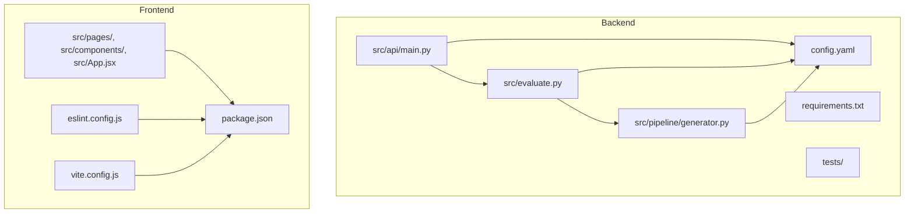
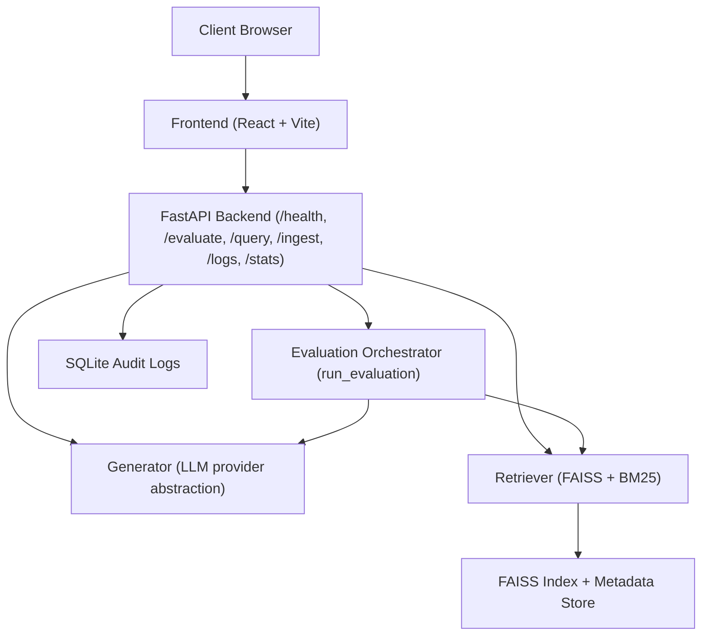
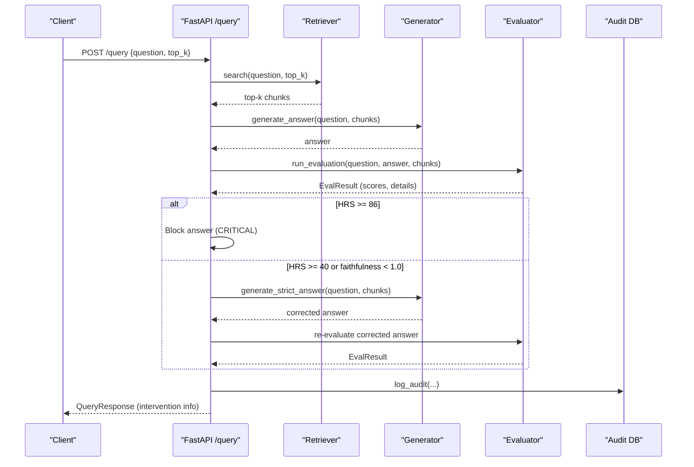
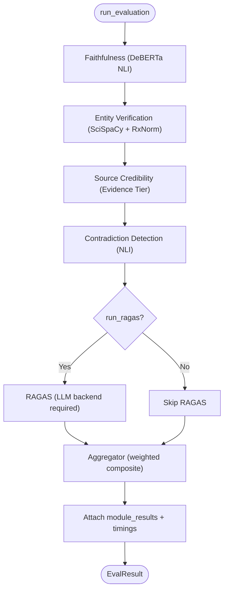
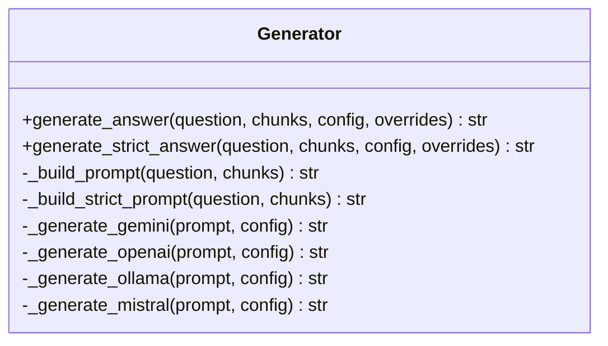
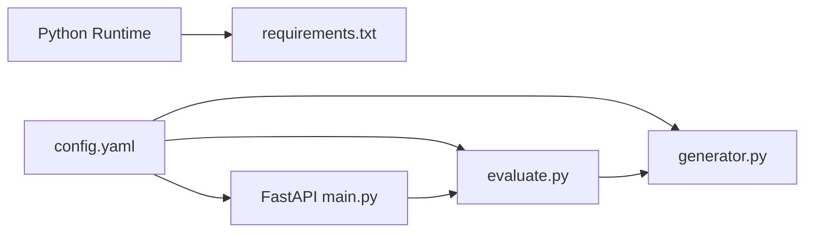

# Contributing and Development

<cite>
**Referenced Files in This Document**
- [README.md](file://README.md)
- [START_INSTRUCTIONS.txt](file://START_INSTRUCTIONS.txt)
- [Backend README.md](file://Backend/README.md)
- [Frontend README.md](file://Frontend/README.md)
- [Backend requirements.txt](file://Backend/requirements.txt)
- [Backend config.yaml](file://Backend/config.yaml)
- [Backend pytest.ini](file://Backend/pytest.ini)
- [Backend conftest.py](file://Backend/conftest.py)
- [Backend src/api/main.py](file://Backend/src/api/main.py)
- [Backend src/evaluate.py](file://Backend/src/evaluate.py)
- [Backend src/pipeline/generator.py](file://Backend/src/pipeline/generator.py)
- [Frontend package.json](file://Frontend/package.json)
- [Frontend eslint.config.js](file://Frontend/eslint.config.js)
- [Frontend vite.config.js](file://Frontend/vite.config.js)
</cite>

## Table of Contents
1. [Introduction](#introduction)
2. [Project Structure](#project-structure)
3. [Core Components](#core-components)
4. [Architecture Overview](#architecture-overview)
5. [Detailed Component Analysis](#detailed-component-analysis)
6. [Dependency Analysis](#dependency-analysis)
7. [Performance Considerations](#performance-considerations)
8. [Troubleshooting Guide](#troubleshooting-guide)
9. [Contribution Workflow](#contribution-workflow)
10. [Code Style and Standards](#code-style-and-standards)
11. [Testing Requirements](#testing-requirements)
12. [Adding New Evaluation Modules](#adding-new-evaluation-modules)
13. [Extending the API](#extending-the-api)
14. [Modifying the User Interface](#modifying-the-user-interface)
15. [Release Management and Versioning](#release-management-and-versioning)
16. [Documentation Standards](#documentation-standards)
17. [Community Contribution Guidelines](#community-contribution-guidelines)
18. [Templates](#templates)
19. [Conclusion](#conclusion)

## Introduction
This document provides comprehensive guidance for contributing to MediRAG 3.0. It covers development environment setup, coding standards, contribution workflows, testing requirements, extension points for evaluation modules and the API, UI modifications, release management, and community collaboration. The goal is to enable contributors to set up a reliable local environment, follow consistent style and quality practices, and confidently propose changes that align with the project’s safety-critical mission in medical AI auditing.

## Project Structure
MediRAG 3.0 is organized into two primary areas:
- Backend: Python FastAPI service with evaluation pipeline, ingestion, and audit logging.
- Frontend: React-based UI with Vite, supporting development and production builds.

**Diagram sources**
- [Backend src/api/main.py](file://Backend/src/api/main.py)
- [Backend src/evaluate.py](file://Backend/src/evaluate.py)
- [Backend src/pipeline/generator.py](file://Backend/src/pipeline/generator.py)
- [Backend config.yaml](file://Backend/config.yaml)
- [Backend requirements.txt](file://Backend/requirements.txt)
- [Frontend package.json](file://Frontend/package.json)
- [Frontend eslint.config.js](file://Frontend/eslint.config.js)
- [Frontend vite.config.js](file://Frontend/vite.config.js)

**Section sources**
- [README.md](file://README.md)
- [Backend README.md](file://Backend/README.md)
- [Frontend README.md](file://Frontend/README.md)

## Core Components
- Backend FastAPI application exposes health checks, evaluation, query, ingestion, and dashboard endpoints. It initializes shared resources (models, retriever) at startup and logs audit events to SQLite.
- Evaluation orchestrator coordinates faithfulness, entity verification, source credibility, contradiction detection, optional RAGAS scoring, and aggregation into a composite Health Risk Score (HRS).
- LLM generation pipeline supports multiple providers (Gemini, OpenAI, Ollama, Mistral) with configurable prompts and strict regeneration on high-risk outputs.
- Frontend provides React pages and components, with ESLint and Vite for development and linting.

Key entry points and responsibilities:
- API endpoints: health, evaluate, query, ingest, logs, stats, parse_file.
- Evaluation pipeline: run_evaluation orchestrating modules and aggregation.
- Generator: generate_answer and generate_strict_answer with provider abstraction.
- Frontend: pages and components wired via React Router and Vite.

**Section sources**
- [Backend src/api/main.py](file://Backend/src/api/main.py)
- [Backend src/evaluate.py](file://Backend/src/evaluate.py)
- [Backend src/pipeline/generator.py](file://Backend/src/pipeline/generator.py)
- [Frontend package.json](file://Frontend/package.json)

## Architecture Overview
The system integrates retrieval, generation, and evaluation into a cohesive pipeline with safety gates and audit logging.

**Diagram sources**
- [Backend src/api/main.py](file://Backend/src/api/main.py)
- [Backend src/evaluate.py](file://Backend/src/evaluate.py)
- [Backend src/pipeline/generator.py](file://Backend/src/pipeline/generator.py)
- [Backend config.yaml](file://Backend/config.yaml)

## Detailed Component Analysis

### API Endpoints and Safety Interventions
The API defines health, evaluation, query, ingestion, and dashboard endpoints. The query endpoint implements safety interventions:
- Critical block: HRS threshold blocks unsafe answers.
- High-risk regeneration: Strict prompt regenerates answers when faithfulness or HRS thresholds are exceeded.

**Diagram sources**
- [Backend src/api/main.py](file://Backend/src/api/main.py)
- [Backend src/evaluate.py](file://Backend/src/evaluate.py)
- [Backend src/pipeline/generator.py](file://Backend/src/pipeline/generator.py)

**Section sources**
- [Backend src/api/main.py](file://Backend/src/api/main.py)

### Evaluation Pipeline Flow
The evaluation orchestrator runs modules in order, collects results, and aggregates a composite score.

**Diagram sources**
- [Backend src/evaluate.py](file://Backend/src/evaluate.py)

**Section sources**
- [Backend src/evaluate.py](file://Backend/src/evaluate.py)

### Generator Provider Abstraction
The generator supports multiple providers and strict-mode regeneration for safety.

**Diagram sources**
- [Backend src/pipeline/generator.py](file://Backend/src/pipeline/generator.py)

**Section sources**
- [Backend src/pipeline/generator.py](file://Backend/src/pipeline/generator.py)

## Dependency Analysis
- Backend Python dependencies are pinned for stability and compatibility across Python versions.
- Frontend dependencies include React, Vite, and ESLint with React-specific plugins.
- The API reads configuration from YAML and initializes models at startup to minimize first-request latency.

**Diagram sources**
- [Backend requirements.txt](file://Backend/requirements.txt)
- [Backend config.yaml](file://Backend/config.yaml)
- [Backend src/api/main.py](file://Backend/src/api/main.py)
- [Backend src/evaluate.py](file://Backend/src/evaluate.py)
- [Backend src/pipeline/generator.py](file://Backend/src/pipeline/generator.py)

**Section sources**
- [Backend requirements.txt](file://Backend/requirements.txt)
- [Backend config.yaml](file://Backend/config.yaml)
- [Backend src/api/main.py](file://Backend/src/api/main.py)
- [Backend src/evaluate.py](file://Backend/src/evaluate.py)
- [Backend src/pipeline/generator.py](file://Backend/src/pipeline/generator.py)

## Performance Considerations
- Startup pre-warming: DeBERTa and retriever are loaded at app startup to avoid cold-start latency.
- Batch sizes and truncation: Faithfulness module uses configurable batch sizes and truncation to balance accuracy and memory.
- Strict regeneration: On high-risk outputs, the system regenerates answers with a strict prompt to improve grounding.
- Index updates: FAISS and metadata are updated atomically to prevent corruption during ingestion.

[No sources needed since this section provides general guidance]

## Troubleshooting Guide
Common issues and resolutions:
- Missing Python dependencies: Install from requirements.txt.
- Missing Node dependencies: Install from package.json.
- Ollama connectivity: Verify base URL and model availability.
- FAISS index not found: Ensure the index and metadata paths exist as configured.
- Audit DB failures: Confirm database initialization and permissions.

**Section sources**
- [Backend requirements.txt](file://Backend/requirements.txt)
- [Frontend package.json](file://Frontend/package.json)
- [Backend src/api/main.py](file://Backend/src/api/main.py)
- [Backend config.yaml](file://Backend/config.yaml)

## Contribution Workflow
- Fork and branch: Create a feature branch from the latest main.
- Develop locally: Follow environment setup steps for backend and frontend.
- Tests: Run backend tests and frontend linting.
- Pull Request: Open a PR with a clear description, rationale, and test coverage.
- Review: Expect feedback on correctness, safety, performance, and style.

[No sources needed since this section provides general guidance]

## Code Style and Standards

### Backend (Python)
- Imports and structure: Keep imports clean and grouped; follow module-level docstrings.
- Logging: Use structured logging with levels and consistent formats.
- Exceptions: Prefer raising explicit exceptions with context; avoid swallowing errors silently.
- Configuration: Centralize settings in YAML; load at startup.
- Testing: Use pytest with recommended patterns; ensure imports are resolved via conftest.

**Section sources**
- [Backend src/api/main.py](file://Backend/src/api/main.py)
- [Backend src/evaluate.py](file://Backend/src/evaluate.py)
- [Backend pytest.ini](file://Backend/pytest.ini)
- [Backend conftest.py](file://Backend/conftest.py)

### Frontend (JavaScript/JSX)
- ESLint: Enforced via flat config with React hooks and refresh plugins.
- React: Use functional components and hooks; keep JSX readable.
- Scripts: Use npm scripts for dev, build, lint, and preview.

**Section sources**
- [Frontend eslint.config.js](file://Frontend/eslint.config.js)
- [Frontend package.json](file://Frontend/package.json)
- [Frontend vite.config.js](file://Frontend/vite.config.js)

## Testing Requirements
- Backend:
  - Location: tests/
  - Runner: pytest with verbose output and short tracebacks.
  - Path resolution: conftest ensures src/ is importable.
- Frontend:
  - Lint: npm run lint
  - Build: npm run build
  - Dev: npm run dev

**Section sources**
- [Backend pytest.ini](file://Backend/pytest.ini)
- [Backend conftest.py](file://Backend/conftest.py)
- [Frontend package.json](file://Frontend/package.json)

## Adding New Evaluation Modules
Steps to integrate a new module:
1. Create a new module under Backend/src/modules/ with a scoring function returning an EvalResult-compatible structure.
2. Import and call the module in Backend/src/evaluate.py within the orchestrator.
3. Extend the aggregator call to incorporate the new module’s score and weight.
4. Update API responses if exposing module-level details externally.
5. Add tests under Backend/tests/ and ensure they pass with pytest.

Guidance:
- Follow the established EvalResult contract and module function signatures.
- Use configuration-driven parameters where applicable.
- Log module timings and attach details for dashboard visibility.

**Section sources**
- [Backend src/evaluate.py](file://Backend/src/evaluate.py)

## Extending the API
When adding endpoints:
- Define the route in Backend/src/api/main.py with appropriate request/response models.
- Use CORS middleware for local development as configured.
- Initialize any required resources in the lifespan handler.
- Log audit events for governance and dashboards.
- Keep error handling explicit and return meaningful HTTP statuses.

**Section sources**
- [Backend src/api/main.py](file://Backend/src/api/main.py)

## Modifying the User Interface
Frontend development:
- Use Vite for dev server and React components.
- Maintain component boundaries and pass props clearly.
- Keep UI responsive and accessible.
- Run ESLint before submitting changes.

**Section sources**
- [Frontend vite.config.js](file://Frontend/vite.config.js)
- [Frontend eslint.config.js](file://Frontend/eslint.config.js)
- [Frontend package.json](file://Frontend/package.json)

## Release Management and Versioning
- Version fields: API version is set in the FastAPI app definition.
- Semantic alignment: Align version increments with breaking changes and major feature additions.
- Backward compatibility: Preserve endpoint signatures and response shapes when possible; deprecate gradually.
- Release notes: Summarize changes, especially around evaluation logic, model updates, and safety improvements.

**Section sources**
- [Backend src/api/main.py](file://Backend/src/api/main.py)

## Documentation Standards
- Inline comments: Explain design decisions and trade-offs.
- Docstrings: Module-level and function-level documentation for public APIs.
- READMEs: Keep top-level and subproject READMEs synchronized with current capabilities.
- Examples: Provide runnable examples for evaluation and ingestion.

**Section sources**
- [README.md](file://README.md)
- [Backend README.md](file://Backend/README.md)
- [Frontend README.md](file://Frontend/README.md)

## Community Contribution Guidelines
- Be respectful and inclusive.
- Focus on safety and correctness in medical AI contexts.
- Provide reproduction steps for bugs and acceptance criteria for features.
- Include tests and documentation updates with contributions.

[No sources needed since this section provides general guidance]

## Templates
Use these templates for standardized issue and PR communication.

Bug Report Template
- Environment: OS, Python version, Node version, browser/version.
- Steps to Reproduce: Clear, minimal steps to reproduce.
- Expected vs. Actual: Describe what happened versus what should have happened.
- Screenshots/Logs: Attach relevant logs or screenshots.
- Additional Context: Impact on safety or usability.

Feature Request Template
- Problem Statement: What need is not met?
- Proposed Solution: High-level approach and alternatives considered.
- Acceptance Criteria: How will you know it’s done?
- Impact: Safety, performance, maintainability considerations.

Security Vulnerability Disclosure Template
- Description: What the vulnerability is and its potential impact.
- Reproduction: Minimal steps to reproduce.
- Evidence: Logs, screenshots, or PoC.
- Contact: Preferred contact method and response time expectations.

[No sources needed since this section provides general guidance]

## Conclusion
By following this guide, contributors can reliably set up the development environment, adhere to style and testing standards, and propose changes that strengthen MediRAG 3.0’s safety-critical evaluation capabilities. Focus on correctness, transparency, and maintainability—especially when touching the evaluation pipeline and safety interventions.