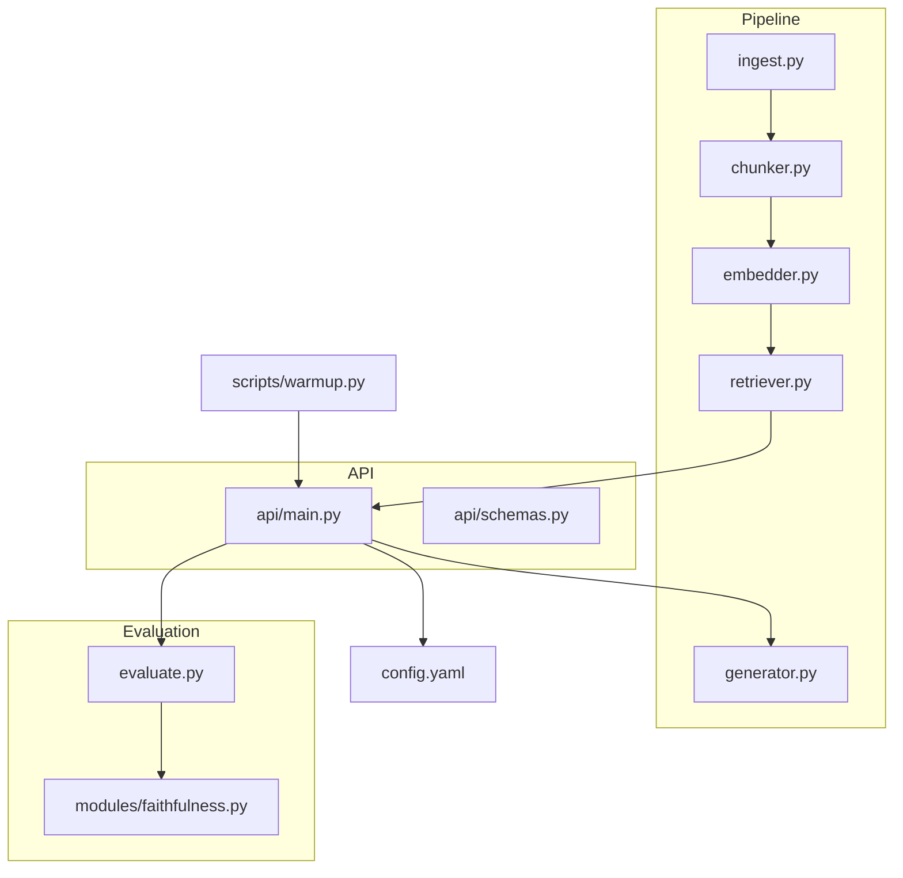
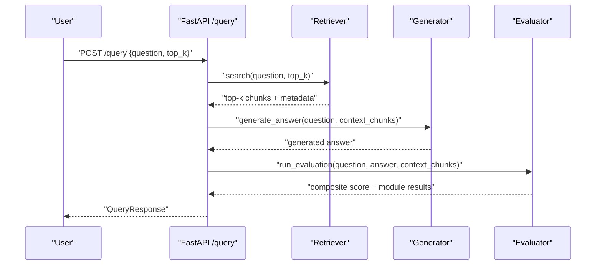
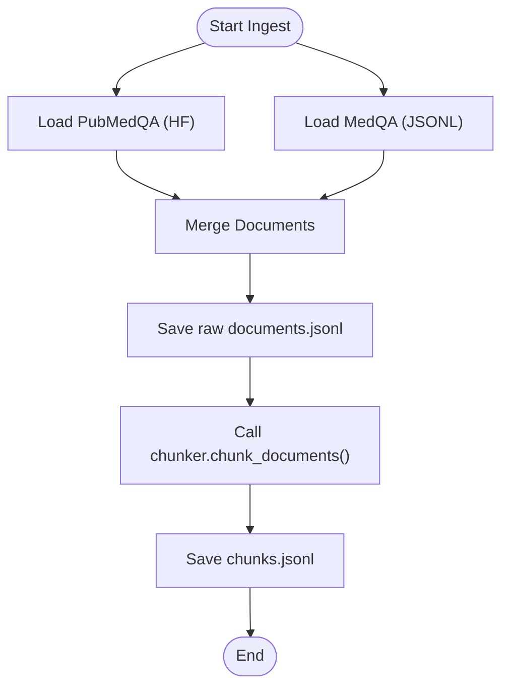
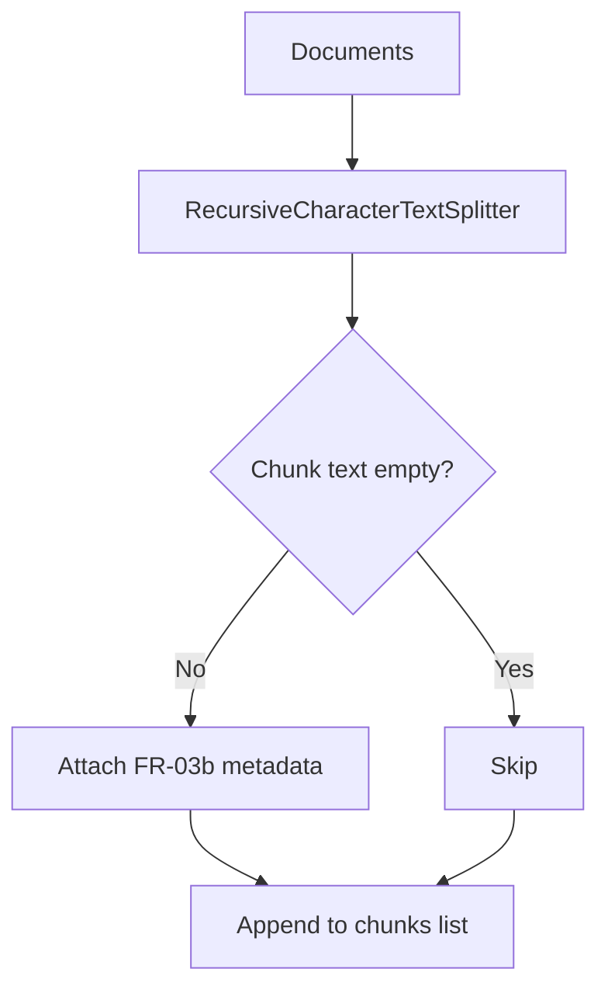
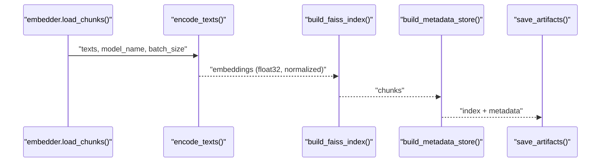
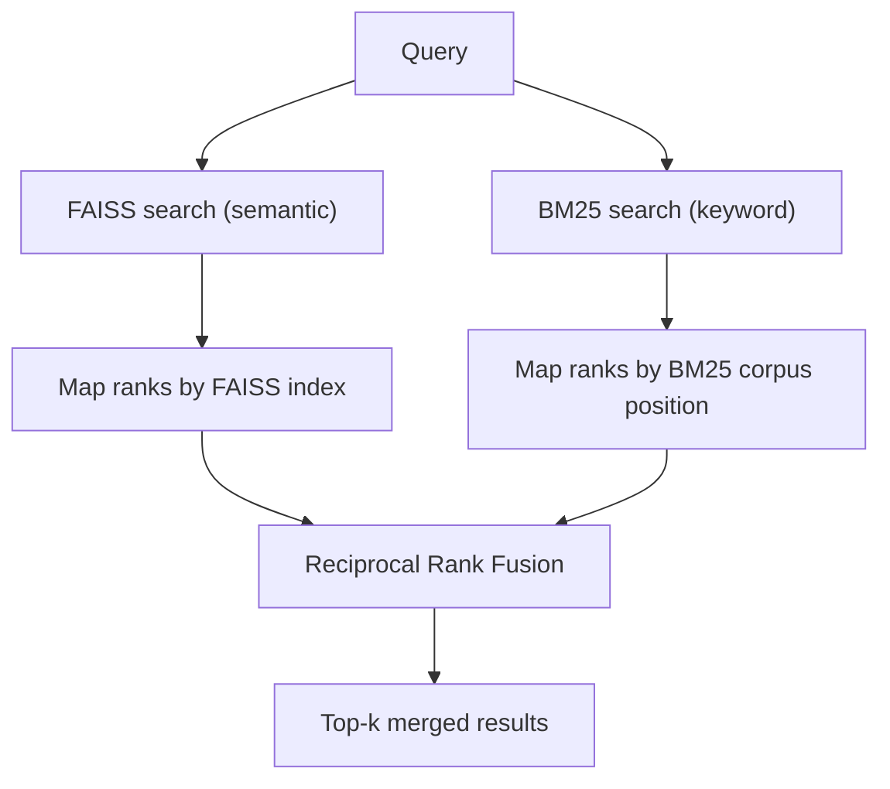
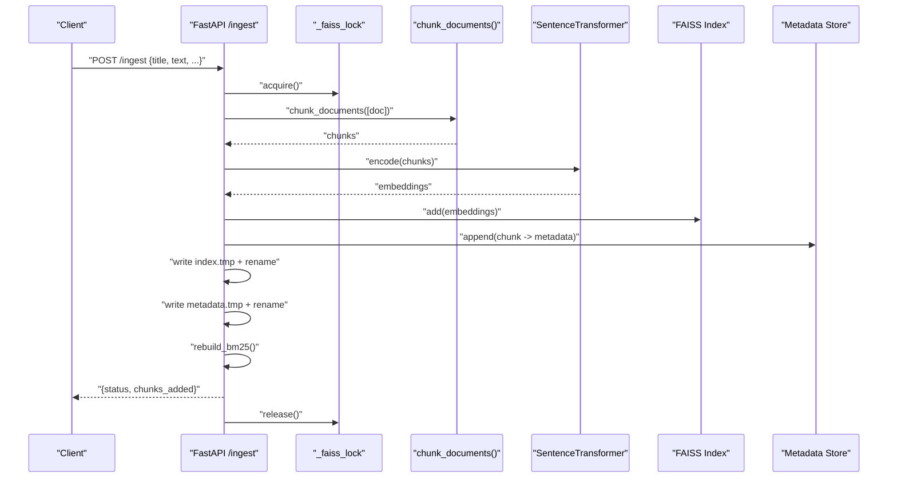
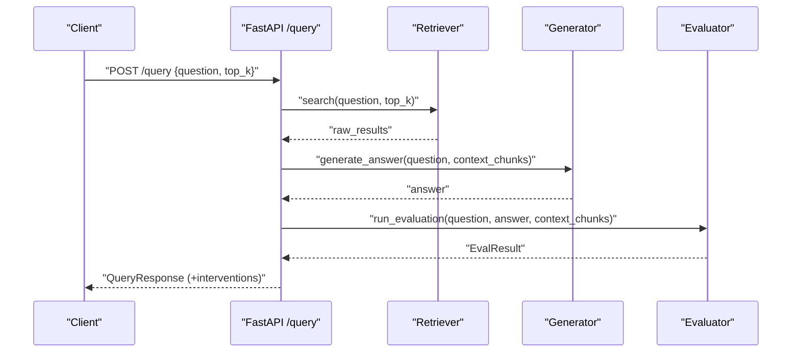
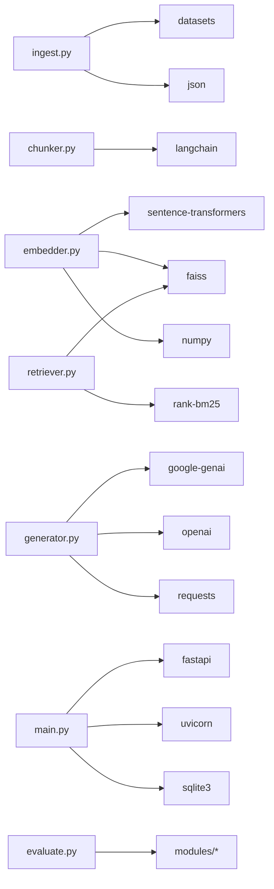

# Data Processing Pipeline

<cite>
**Referenced Files in This Document**
- [ingest.py](file://Backend/src/pipeline/ingest.py)
- [chunker.py](file://Backend/src/pipeline/chunker.py)
- [embedder.py](file://Backend/src/pipeline/embedder.py)
- [retriever.py](file://Backend/src/pipeline/retriever.py)
- [generator.py](file://Backend/src/pipeline/generator.py)
- [main.py](file://Backend/src/api/main.py)
- [schemas.py](file://Backend/src/api/schemas.py)
- [config.yaml](file://Backend/config.yaml)
- [requirements.txt](file://Backend/requirements.txt)
- [warmup.py](file://Backend/scripts/warmup.py)
- [evaluate.py](file://Backend/src/evaluate.py)
- [faithfulness.py](file://Backend/src/modules/faithfulness.py)
</cite>

## Table of Contents
1. [Introduction](#introduction)
2. [Project Structure](#project-structure)
3. [Core Components](#core-components)
4. [Architecture Overview](#architecture-overview)
5. [Detailed Component Analysis](#detailed-component-analysis)
6. [Dependency Analysis](#dependency-analysis)
7. [Performance Considerations](#performance-considerations)
8. [Troubleshooting Guide](#troubleshooting-guide)
9. [Conclusion](#conclusion)
10. [Appendices](#appendices)

## Introduction
This document explains the MediRAG 3.0 data processing pipeline that transforms raw documents into a searchable knowledge base and powers hybrid retrieval and answer generation. It covers:
- Document ingestion from curated datasets and custom uploads
- Text extraction and chunking with metadata preservation
- Vector embedding using BioBERT and FAISS index construction
- Hybrid retrieval combining semantic (FAISS) and keyword (BM25) search with Reciprocal Rank Fusion
- Dynamic index updates for new knowledge base additions
- End-to-end API workflows and evaluation integration
- Performance, memory, concurrency, and troubleshooting guidance

## Project Structure
The pipeline is implemented primarily under Backend/src/pipeline with supporting API, evaluation, and configuration modules. Key directories and files:
- Backend/src/pipeline: ingestion, chunking, embedding, retrieval, and generation
- Backend/src/api: FastAPI endpoints for ingestion, querying, and evaluation
- Backend/src/evaluate and Backend/src/modules: evaluation orchestration and modules
- Backend/config.yaml: retrieval, module, and API configuration
- Backend/scripts: warmup utilities for model initialization
- Backend/requirements.txt: pinned dependencies for reproducible environments

**Diagram sources**
- [ingest.py:1-251](file://Backend/src/pipeline/ingest.py#L1-L251)
- [chunker.py:1-83](file://Backend/src/pipeline/chunker.py#L1-L83)
- [embedder.py:1-164](file://Backend/src/pipeline/embedder.py#L1-L164)
- [retriever.py:1-287](file://Backend/src/pipeline/retriever.py#L1-L287)
- [generator.py:1-462](file://Backend/src/pipeline/generator.py#L1-L462)
- [main.py:1-678](file://Backend/src/api/main.py#L1-L678)
- [schemas.py:1-232](file://Backend/src/api/schemas.py#L1-L232)
- [evaluate.py:1-251](file://Backend/src/evaluate.py#L1-L251)
- [faithfulness.py:1-234](file://Backend/src/modules/faithfulness.py#L1-L234)
- [config.yaml:1-66](file://Backend/config.yaml#L1-L66)
- [warmup.py:1-59](file://Backend/scripts/warmup.py#L1-L59)

**Section sources**
- [ingest.py:1-251](file://Backend/src/pipeline/ingest.py#L1-L251)
- [chunker.py:1-83](file://Backend/src/pipeline/chunker.py#L1-L83)
- [embedder.py:1-164](file://Backend/src/pipeline/embedder.py#L1-L164)
- [retriever.py:1-287](file://Backend/src/pipeline/retriever.py#L1-L287)
- [generator.py:1-462](file://Backend/src/pipeline/generator.py#L1-L462)
- [main.py:1-678](file://Backend/src/api/main.py#L1-L678)
- [schemas.py:1-232](file://Backend/src/api/schemas.py#L1-L232)
- [config.yaml:1-66](file://Backend/config.yaml#L1-L66)
- [requirements.txt:1-35](file://Backend/requirements.txt#L1-L35)
- [warmup.py:1-59](file://Backend/scripts/warmup.py#L1-L59)
- [evaluate.py:1-251](file://Backend/src/evaluate.py#L1-L251)
- [faithfulness.py:1-234](file://Backend/src/modules/faithfulness.py#L1-L234)

## Core Components
- Ingestion: Loads curated datasets (PubMedQA, MedQA-USMLE) and saves raw documents for inspection and downstream processing.
- Chunking: Splits documents into overlapping text chunks while preserving FR-03b metadata for traceability and evaluation.
- Embedding: Encodes chunks into BioBERT vectors, normalizes for cosine similarity, and builds a FAISS index with parallel metadata storage.
- Retrieval: Hybrid search using FAISS (semantic) and BM25 (keyword) with Reciprocal Rank Fusion and optional runtime BM25 rebuild.
- Generation: Produces grounded answers using configurable LLM providers (Gemini, Ollama, Mistral).
- API: End-to-end endpoints for ingestion, querying, evaluation, and file parsing; thread-safe dynamic index updates; warm startup.
- Evaluation: Orchestrates faithfulness, entity verification, source credibility, contradiction detection, optional RAGAS, and weighted aggregation.

**Section sources**
- [ingest.py:48-183](file://Backend/src/pipeline/ingest.py#L48-L183)
- [chunker.py:20-82](file://Backend/src/pipeline/chunker.py#L20-L82)
- [embedder.py:37-159](file://Backend/src/pipeline/embedder.py#L37-L159)
- [retriever.py:39-250](file://Backend/src/pipeline/retriever.py#L39-L250)
- [generator.py:344-461](file://Backend/src/pipeline/generator.py#L344-L461)
- [main.py:522-603](file://Backend/src/api/main.py#L522-L603)
- [evaluate.py:49-167](file://Backend/src/evaluate.py#L49-L167)

## Architecture Overview
The pipeline follows a staged workflow: ingestion → chunking → embedding → FAISS index + metadata → retrieval → generation → evaluation. The API exposes endpoints to trigger each stage and to update the index dynamically.

**Diagram sources**
- [main.py:308-519](file://Backend/src/api/main.py#L308-L519)
- [retriever.py:149-250](file://Backend/src/pipeline/retriever.py#L149-L250)
- [generator.py:344-413](file://Backend/src/pipeline/generator.py#L344-L413)
- [evaluate.py:49-167](file://Backend/src/evaluate.py#L49-L167)

## Detailed Component Analysis

### Ingestion Workflow (PubMedQA + MedQA)
- Loads PubMedQA from HuggingFace datasets with configurable sample sizes and splits.
- Loads MedQA-USMLE from local JSONL files with robust error handling for missing data.
- Saves raw documents to a JSONL file for inspection and downstream chunking.

**Diagram sources**
- [ingest.py:48-246](file://Backend/src/pipeline/ingest.py#L48-L246)
- [chunker.py:20-82](file://Backend/src/pipeline/chunker.py#L20-L82)

**Section sources**
- [ingest.py:48-246](file://Backend/src/pipeline/ingest.py#L48-L246)

### Document Chunking Strategy
- Uses LangChain RecursiveCharacterTextSplitter with custom separators and overlap.
- Preserves FR-03b metadata schema for each chunk to support evaluation and provenance.
- Produces overlapping chunks to maintain context across boundaries.

**Diagram sources**
- [chunker.py:20-82](file://Backend/src/pipeline/chunker.py#L20-L82)

**Section sources**
- [chunker.py:20-82](file://Backend/src/pipeline/chunker.py#L20-L82)
- [config.yaml:2-7](file://Backend/config.yaml#L2-L7)

### Embedding and FAISS Index Management
- Encodes chunk texts using BioBERT via SentenceTransformer with L2 normalization for cosine similarity.
- Builds FAISS IndexFlatIP and persists it to disk.
- Maintains a parallel metadata dictionary keyed by FAISS integer index positions.

**Diagram sources**
- [embedder.py:37-159](file://Backend/src/pipeline/embedder.py#L37-L159)

**Section sources**
- [embedder.py:37-159](file://Backend/src/pipeline/embedder.py#L37-L159)
- [config.yaml:5-7](file://Backend/config.yaml#L5-L7)

### Hybrid Retrieval with Reciprocal Rank Fusion
- On first search, lazily loads FAISS index and metadata; BM25 index is built over chunk texts.
- For each query, performs semantic search (FAISS) and keyword search (BM25), then merges results using RRF.
- Supports runtime rebuild of BM25 to include newly ingested documents.

**Diagram sources**
- [retriever.py:149-250](file://Backend/src/pipeline/retriever.py#L149-L250)

**Section sources**
- [retriever.py:39-250](file://Backend/src/pipeline/retriever.py#L39-L250)
- [config.yaml:2-7](file://Backend/config.yaml#L2-L7)

### Dynamic Index Updating for New Knowledge
- Thread-safe ingestion endpoint adds new documents atomically to FAISS and metadata.
- Uses a lock to prevent concurrent write corruption and renames temporary files to ensure atomic persistence.
- Rebuilds BM25 for the running instance to include new chunks.

**Diagram sources**
- [main.py:526-603](file://Backend/src/api/main.py#L526-L603)
- [chunker.py:20-82](file://Backend/src/pipeline/chunker.py#L20-L82)
- [embedder.py:55-78](file://Backend/src/pipeline/embedder.py#L55-L78)

**Section sources**
- [main.py:526-603](file://Backend/src/api/main.py#L526-L603)

### End-to-End Query Pipeline and Evaluation
- API endpoint orchestrates retrieval, generation, and evaluation, returning a comprehensive response with safety interventions.
- Evaluation pipeline runs faithfulness, entity verification, source credibility, contradiction detection, optional RAGAS, and weighted aggregation.

**Diagram sources**
- [main.py:308-519](file://Backend/src/api/main.py#L308-L519)
- [evaluate.py:49-167](file://Backend/src/evaluate.py#L49-L167)
- [faithfulness.py:86-233](file://Backend/src/modules/faithfulness.py#L86-L233)

**Section sources**
- [main.py:308-519](file://Backend/src/api/main.py#L308-L519)
- [evaluate.py:49-167](file://Backend/src/evaluate.py#L49-L167)
- [faithfulness.py:86-233](file://Backend/src/modules/faithfulness.py#L86-L233)

## Dependency Analysis
Key external libraries and their roles:
- langchain and langchain-community: text splitting and processing
- sentence-transformers: BioBERT embeddings
- faiss-cpu: vector index
- rank-bm25: keyword indexing
- fastapi, uvicorn: API server
- google-genai, openai, requests: LLM integrations
- datasets: dataset loading
- pymupdf, python-docx: document text extraction

**Diagram sources**
- [requirements.txt:1-35](file://Backend/requirements.txt#L1-L35)
- [ingest.py:60-68](file://Backend/src/pipeline/ingest.py#L60-L68)
- [chunker.py:37-47](file://Backend/src/pipeline/chunker.py#L37-L47)
- [embedder.py:64-78](file://Backend/src/pipeline/embedder.py#L64-L78)
- [retriever.py:124-143](file://Backend/src/pipeline/retriever.py#L124-L143)
- [generator.py:148-283](file://Backend/src/pipeline/generator.py#L148-L283)
- [main.py:31-49](file://Backend/src/api/main.py#L31-L49)
- [evaluate.py:34-40](file://Backend/src/evaluate.py#L34-L40)

**Section sources**
- [requirements.txt:1-35](file://Backend/requirements.txt#L1-L35)

## Performance Considerations
- Embedding and Indexing
  - Use batch_size tuned to GPU/CPU memory for BioBERT encoding.
  - Normalize embeddings for cosine similarity to match FAISS IndexFlatIP.
  - Persist FAISS index and metadata atomically to avoid corruption and enable fast restarts.
- Retrieval
  - Fetch 3× candidates from each retriever before fusion to improve RRF mixing.
  - Rebuild BM25 incrementally when new documents are added to avoid full reindex.
- Memory Management
  - Lazy-load FAISS and BM25 on first use; warm up at startup to eliminate cold-start latency.
  - Reuse the in-memory SentenceTransformer instance in the API to avoid double RAM usage.
- Concurrency
  - Use a thread lock around FAISS writes to ensure atomic updates and prevent corruption.
- Large-Scale Processing
  - Process chunks in batches; monitor memory pressure during encoding and index addition.
  - Consider chunk_size and overlap trade-offs for context retention vs. index size.

[No sources needed since this section provides general guidance]

## Troubleshooting Guide
- FAISS or BM25 Unavailable
  - Ensure FAISS index and metadata are present and readable.
  - Verify rank-bm25 installation if keyword search is required.
- Empty or Malformed Inputs
  - Ingestion skips empty documents and malformed JSON lines; check raw data sources.
- Model Loading Failures
  - Confirm sentence-transformers availability and model name correctness.
  - For Gemini/Ollama/Mistral, ensure API keys and service availability.
- Dynamic Ingestion Failures
  - Confirm FAISS index exists and the API is warmed; verify thread lock acquisition.
- Evaluation Errors
  - Some modules may return stub results if dependencies are missing; install missing packages.

**Section sources**
- [retriever.py:80-114](file://Backend/src/pipeline/retriever.py#L80-L114)
- [retriever.py:174-206](file://Backend/src/pipeline/retriever.py#L174-L206)
- [embedder.py:64-78](file://Backend/src/pipeline/embedder.py#L64-L78)
- [generator.py:177-231](file://Backend/src/pipeline/generator.py#L177-L231)
- [main.py:538-540](file://Backend/src/api/main.py#L538-L540)
- [main.py:571-598](file://Backend/src/api/main.py#L571-L598)

## Conclusion
MediRAG 3.0’s pipeline provides a robust, modular foundation for ingestion, chunking, embedding, and hybrid retrieval. The API integrates dynamic knowledge updates, thread-safe index maintenance, and comprehensive evaluation. By tuning chunking parameters, embedding batch sizes, and leveraging warm-up strategies, the system achieves scalable performance and reliability for real-world deployments.

[No sources needed since this section summarizes without analyzing specific files]

## Appendices

### Configuration Reference
- Retrieval settings: top_k, chunk_size, chunk_overlap, embedding_model, index_path, metadata_path
- Modules: DeBERTa NLI model, entity verification, source credibility, contradiction detection
- Aggregation weights and risk bands
- LLM provider configuration and timeouts
- API limits and logging

**Section sources**
- [config.yaml:1-66](file://Backend/config.yaml#L1-L66)

### Example Workflows
- Ingest curated datasets and produce FAISS index:
  - Run ingestion script with desired sample counts.
  - Chunk and embed to produce FAISS index and metadata.
- Add new knowledge dynamically:
  - POST /ingest with title, text, and metadata; system updates FAISS and BM25 atomically.
- Query and evaluate:
  - POST /query with question and top_k; receive answer, retrieved chunks, HRS, and module breakdowns.

**Section sources**
- [ingest.py:212-246](file://Backend/src/pipeline/ingest.py#L212-L246)
- [main.py:526-603](file://Backend/src/api/main.py#L526-L603)
- [main.py:308-519](file://Backend/src/api/main.py#L308-L519)