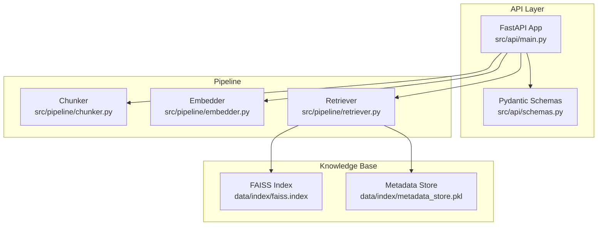
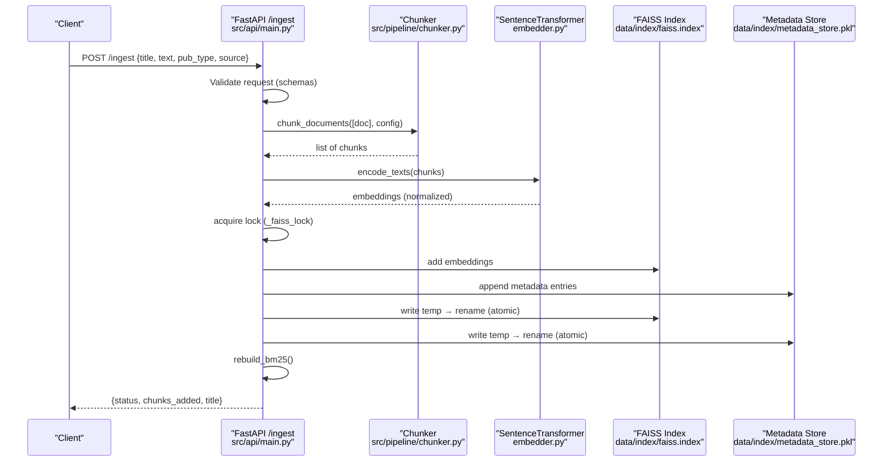
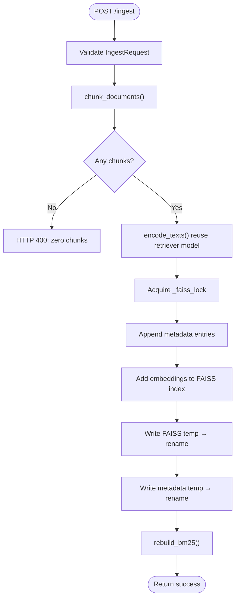
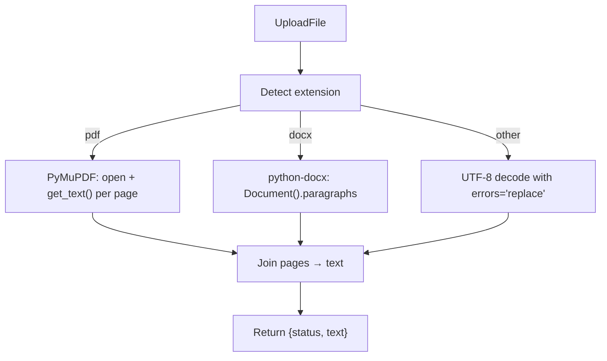
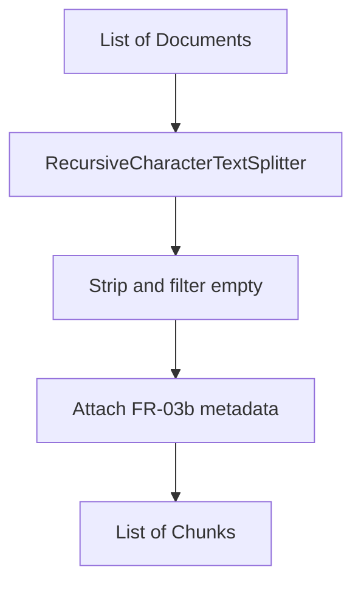
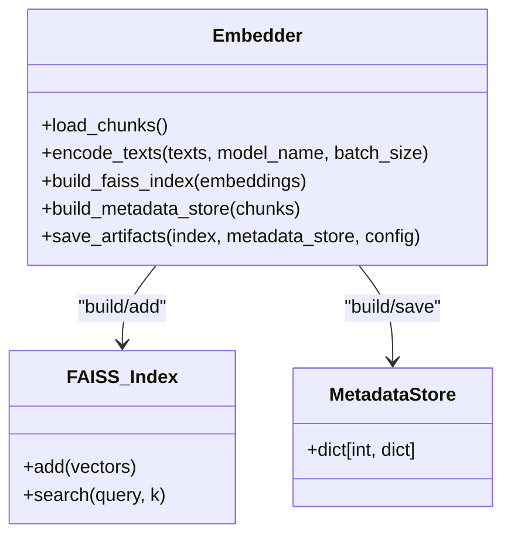
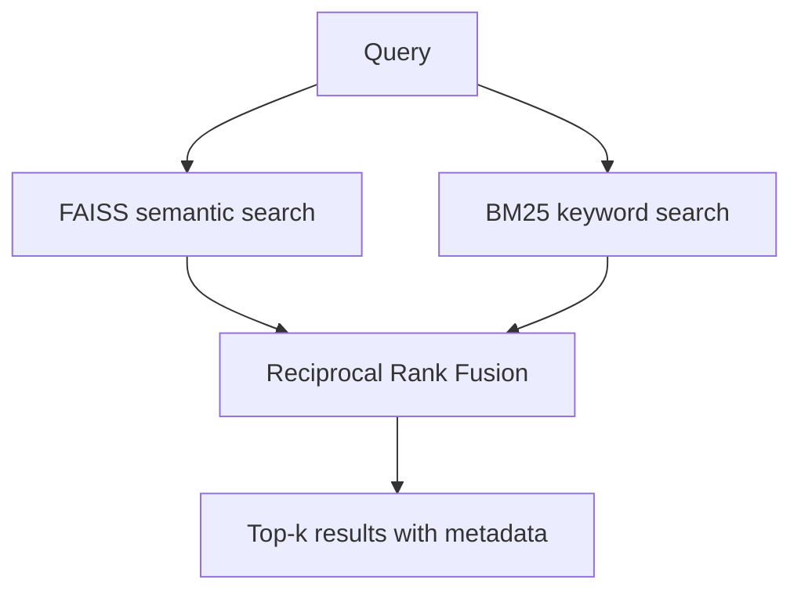
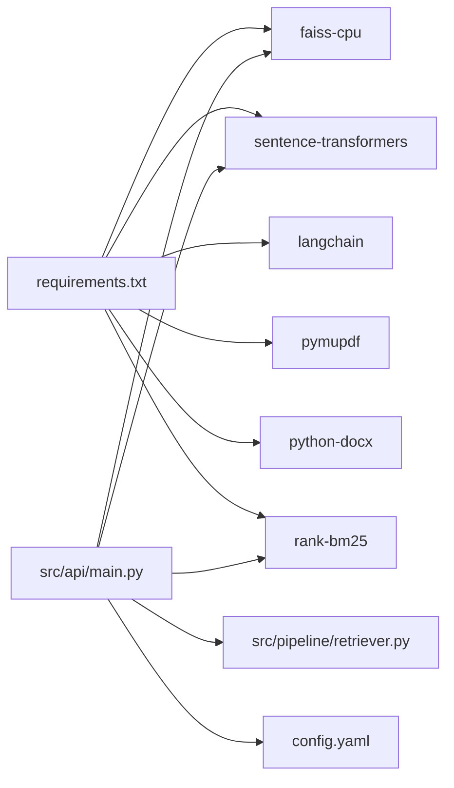

# Document Ingestion

<cite>
**Referenced Files in This Document**
- [ingest.py](file://Backend/src/pipeline/ingest.py)
- [chunker.py](file://Backend/src/pipeline/chunker.py)
- [embedder.py](file://Backend/src/pipeline/embedder.py)
- [retriever.py](file://Backend/src/pipeline/retriever.py)
- [main.py](file://Backend/src/api/main.py)
- [schemas.py](file://Backend/src/api/schemas.py)
- [config.yaml](file://Backend/config.yaml)
- [requirements.txt](file://Backend/requirements.txt)
- [UPLOAD_INGEST_LOGIC.txt](file://Backend/UPLOAD_INGEST_LOGIC.txt)
</cite>

## Table of Contents
1. [Introduction](#introduction)
2. [Project Structure](#project-structure)
3. [Core Components](#core-components)
4. [Architecture Overview](#architecture-overview)
5. [Detailed Component Analysis](#detailed-component-analysis)
6. [Dependency Analysis](#dependency-analysis)
7. [Performance Considerations](#performance-considerations)
8. [Troubleshooting Guide](#troubleshooting-guide)
9. [Conclusion](#conclusion)
10. [Appendices](#appendices)

## Introduction
This document describes the dynamic document ingestion system that powers the knowledge base and retrieval pipeline. It covers the ingestion workflow from file upload through text extraction, metadata enrichment, semantic chunking, embedding generation, FAISS index updates, and hybrid retrieval. It also documents supported formats, concurrency guarantees, error handling, and performance considerations for large-scale processing.

## Project Structure
The ingestion system spans backend API endpoints, pipeline modules, and configuration. The primary ingestion path is exposed via a FastAPI endpoint that accepts raw text or parsed content, chunks it, embeds it, and atomically updates the FAISS index and metadata store.

**Diagram sources**
- [main.py:522-604](file://Backend/src/api/main.py#L522-L604)
- [chunker.py:20-83](file://Backend/src/pipeline/chunker.py#L20-L83)
- [embedder.py:37-164](file://Backend/src/pipeline/embedder.py#L37-L164)
- [retriever.py:39-287](file://Backend/src/pipeline/retriever.py#L39-L287)

**Section sources**
- [main.py:522-604](file://Backend/src/api/main.py#L522-L604)
- [config.yaml:1-66](file://Backend/config.yaml#L1-L66)

## Core Components
- API ingestion endpoint: Accepts a document payload, validates it, chunks, embeds, and atomically updates FAISS and metadata while rebuilding BM25 for hybrid retrieval.
- Chunker: Splits raw documents into overlapping semantic chunks using a recursive text splitter.
- Embedder: Encodes chunks into normalized vectors with a BioBERT-based model and constructs FAISS index and metadata store.
- Retriever: Loads FAISS and metadata, optionally builds BM25, and performs hybrid semantic + keyword search with reciprocal rank fusion.

**Section sources**
- [main.py:522-604](file://Backend/src/api/main.py#L522-L604)
- [chunker.py:20-83](file://Backend/src/pipeline/chunker.py#L20-L83)
- [embedder.py:37-164](file://Backend/src/pipeline/embedder.py#L37-L164)
- [retriever.py:39-287](file://Backend/src/pipeline/retriever.py#L39-L287)

## Architecture Overview
The ingestion pipeline integrates file parsing, chunking, embedding, FAISS update, and BM25 rebuild. It ensures thread-safety and atomic persistence to maintain a crash-safe knowledge base.

**Diagram sources**
- [main.py:522-604](file://Backend/src/api/main.py#L522-L604)
- [chunker.py:20-83](file://Backend/src/pipeline/chunker.py#L20-L83)
- [embedder.py:55-79](file://Backend/src/pipeline/embedder.py#L55-L79)
- [retriever.py:121-143](file://Backend/src/pipeline/retriever.py#L121-L143)

## Detailed Component Analysis

### API Ingestion Endpoint
- Purpose: Dynamically add new documents to the running FAISS index and metadata store.
- Validation: Uses Pydantic models to enforce minimum lengths and defaults.
- Workflow:
  - Construct a document object from the request.
  - Chunk the document using the shared chunker.
  - Embed chunks using the same model as the retriever for consistency.
  - Thread-safe update: lock around index and metadata writes.
  - Atomic persistence: write to temporary files then rename to ensure crash safety.
  - Rebuild BM25 to enable hybrid retrieval immediately.

**Diagram sources**
- [main.py:522-604](file://Backend/src/api/main.py#L522-L604)
- [schemas.py:15-21](file://Backend/src/api/schemas.py#L15-L21)

**Section sources**
- [main.py:522-604](file://Backend/src/api/main.py#L522-L604)
- [schemas.py:15-21](file://Backend/src/api/schemas.py#L15-L21)

### Text Extraction and Supported Formats
- Supported formats for programmatic parsing: PDF (.pdf) and DOCX (.docx).
- Extraction strategies:
  - PDF: Uses PyMuPDF to iterate pages and concatenate text.
  - DOCX: Uses python-docx to read paragraph text.
  - Other text-based formats: Decoded as UTF-8 with replacement for invalid bytes.
- Error handling: On failure, returns HTTP 400 with a descriptive message.

**Diagram sources**
- [main.py:653-677](file://Backend/src/api/main.py#L653-L677)

**Section sources**
- [main.py:653-677](file://Backend/src/api/main.py#L653-L677)
- [requirements.txt:31-32](file://Backend/requirements.txt#L31-L32)

### Chunking Strategy
- Chunker splits documents into overlapping segments using a recursive character splitter.
- Configuration: chunk size and overlap are drawn from config.yaml.
- Output: Each chunk carries the FR-03b metadata schema and is assigned a unique identifier.

**Diagram sources**
- [chunker.py:20-83](file://Backend/src/pipeline/chunker.py#L20-L83)
- [config.yaml:2-4](file://Backend/config.yaml#L2-L4)

**Section sources**
- [chunker.py:20-83](file://Backend/src/pipeline/chunker.py#L20-L83)
- [config.yaml:2-4](file://Backend/config.yaml#L2-L4)

### Embedding and FAISS Index Management
- Embedding model: BioBERT-based SentenceTransformer (dmis-lab/biobert-v1.1).
- Encoding: Normalized vectors for cosine similarity with FAISS IndexFlatIP.
- Index construction: Single-pass addition of all embeddings.
- Metadata store: Parallel dictionary keyed by FAISS integer positions, storing full chunk metadata plus text for retrieval.

**Diagram sources**
- [embedder.py:37-164](file://Backend/src/pipeline/embedder.py#L37-L164)

**Section sources**
- [embedder.py:37-164](file://Backend/src/pipeline/embedder.py#L37-L164)
- [config.yaml:5-7](file://Backend/config.yaml#L5-L7)

### Hybrid Retrieval and BM25 Rebuild
- FAISS: Semantic search using normalized vectors and cosine similarity.
- BM25: Keyword-based retrieval built lazily and rebuilt after ingestion to include new chunks.
- Fusion: Reciprocal Rank Fusion (RRF) combines both rankings for robust results.

**Diagram sources**
- [retriever.py:149-250](file://Backend/src/pipeline/retriever.py#L149-L250)

**Section sources**
- [retriever.py:149-250](file://Backend/src/pipeline/retriever.py#L149-L250)

### End-to-End Ingestion Workflows

#### Workflow A: Programmatic Ingestion (Text)
- Steps:
  - Client sends POST /ingest with {title, text, pub_type, source}.
  - Server validates schema, chunks, embeds, locks, updates index and metadata atomically, and rebuilds BM25.
- Typical use case: Backend-to-backend ingestion or automated pipelines.

**Section sources**
- [main.py:522-604](file://Backend/src/api/main.py#L522-L604)
- [schemas.py:15-21](file://Backend/src/api/schemas.py#L15-L21)

#### Workflow B: File Upload + Parsing (PDF/DOCX/TXT)
- Steps:
  - Client uploads a file via /parse_file to extract text.
  - Client then calls /ingest with the extracted text and metadata.
- Notes: PDF and DOCX parsing handled by the backend; TXT decoding uses UTF-8 with fallback.

**Section sources**
- [main.py:653-677](file://Backend/src/api/main.py#L653-L677)
- [main.py:522-604](file://Backend/src/api/main.py#L522-L604)

#### Workflow C: Bulk Ingestion (Offline Pipeline)
- Steps:
  - Use the offline ingestion script to load curated datasets (PubMedQA, MedQA).
  - Chunk and persist chunks to data/processed/chunks.jsonl.
  - Run the embedder to build FAISS and metadata stores.
- This workflow prepares the knowledge base for production use.

**Section sources**
- [ingest.py:48-183](file://Backend/src/pipeline/ingest.py#L48-L183)
- [chunker.py:20-83](file://Backend/src/pipeline/chunker.py#L20-L83)
- [embedder.py:139-164](file://Backend/src/pipeline/embedder.py#L139-L164)

## Dependency Analysis
- Runtime dependencies include FAISS, SentenceTransformers, LangChain, PyMuPDF, python-docx, and rank-bm25.
- The API endpoint depends on the retriever’s in-memory structures and configuration paths for index and metadata.

**Diagram sources**
- [requirements.txt:1-35](file://Backend/requirements.txt#L1-L35)
- [main.py:522-604](file://Backend/src/api/main.py#L522-L604)
- [config.yaml:1-66](file://Backend/config.yaml#L1-L66)

**Section sources**
- [requirements.txt:1-35](file://Backend/requirements.txt#L1-L35)
- [main.py:522-604](file://Backend/src/api/main.py#L522-L604)
- [config.yaml:1-66](file://Backend/config.yaml#L1-L66)

## Performance Considerations
- Batch embeddings: The embedder encodes texts in batches to improve throughput.
- Normalization: Vectors are L2-normalized to leverage FAISS IndexFlatIP for cosine similarity.
- Chunk size and overlap: Configurable parameters balance semantic coherence and recall.
- Memory management:
  - Reuse the already-loaded SentenceTransformer model in the retriever to avoid double memory usage during ingestion.
  - Incremental FAISS additions minimize repeated index construction.
- Disk I/O:
  - Atomic writes (temp + rename) reduce I/O overhead and ensure durability.
- Concurrency:
  - A global threading lock serializes index writes to prevent corruption.
- Hybrid retrieval:
  - BM25 rebuild is triggered post-ingestion to keep keyword search aligned with new content.

**Section sources**
- [embedder.py:55-79](file://Backend/src/pipeline/embedder.py#L55-L79)
- [main.py:562-568](file://Backend/src/api/main.py#L562-L568)
- [main.py:570-598](file://Backend/src/api/main.py#L570-L598)
- [config.yaml:2-4](file://Backend/config.yaml#L2-L4)

## Troubleshooting Guide
- Index not found or retriever not pre-warmed:
  - The ingestion endpoint checks for a loaded retriever and index; if missing, returns HTTP 503.
- Zero chunks produced:
  - If chunking yields no results, returns HTTP 400.
- File parsing failures:
  - PDF/DOCX parsing errors return HTTP 400 with a descriptive message.
- FAISS write failures:
  - Atomic writes protect against corruption; if a crash occurs mid-write, the index remains valid due to the temp→rename pattern.
- Missing dependencies:
  - Ensure FAISS, SentenceTransformers, PyMuPDF, python-docx, and rank-bm25 are installed per requirements.txt.

**Section sources**
- [main.py:537-556](file://Backend/src/api/main.py#L537-L556)
- [main.py:653-677](file://Backend/src/api/main.py#L653-L677)
- [UPLOAD_INGEST_LOGIC.txt:140-163](file://Backend/UPLOAD_INGEST_LOGIC.txt#L140-L163)

## Conclusion
The ingestion system provides a robust, thread-safe, and crash-safe pathway to continuously update the knowledge base. It supports programmatic ingestion and file parsing, leverages semantic chunking and embeddings, and maintains hybrid retrieval readiness through BM25 rebuilds. The design balances performance, reliability, and scalability for real-world deployments.

## Appendices

### Metadata Schema Used Across the System
- Keys include identifiers, provenance, and chunking metadata to support retrieval and evaluation.

**Section sources**
- [chunker.py:64-76](file://Backend/src/pipeline/chunker.py#L64-L76)
- [embedder.py:95-114](file://Backend/src/pipeline/embedder.py#L95-L114)
- [UPLOAD_INGEST_LOGIC.txt:190-203](file://Backend/UPLOAD_INGEST_LOGIC.txt#L190-L203)

### Configuration Reference
- Retrieval parameters: chunk size, overlap, embedding model, index and metadata paths.

**Section sources**
- [config.yaml:1-7](file://Backend/config.yaml#L1-L7)