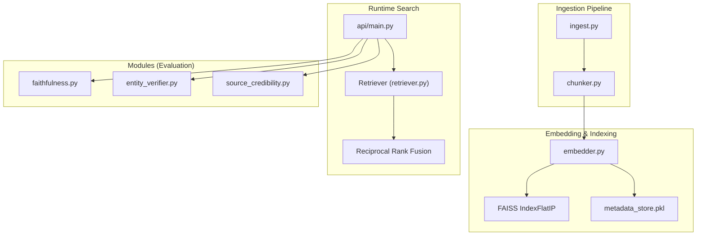
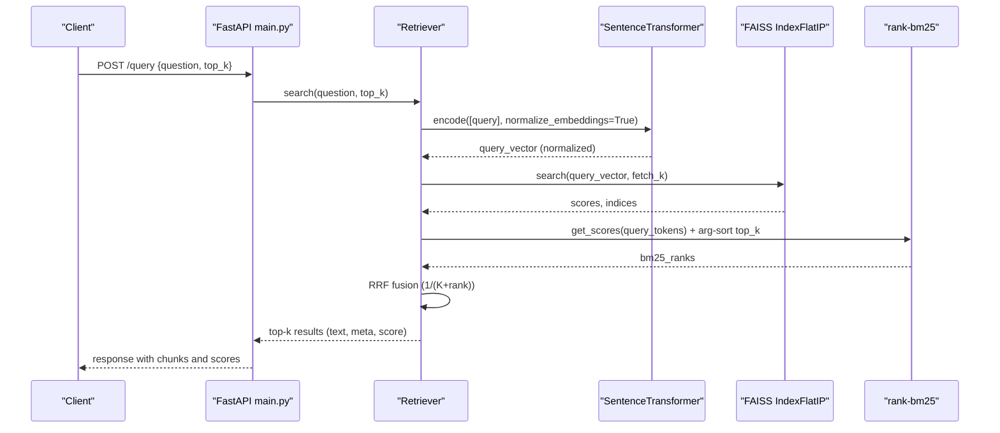
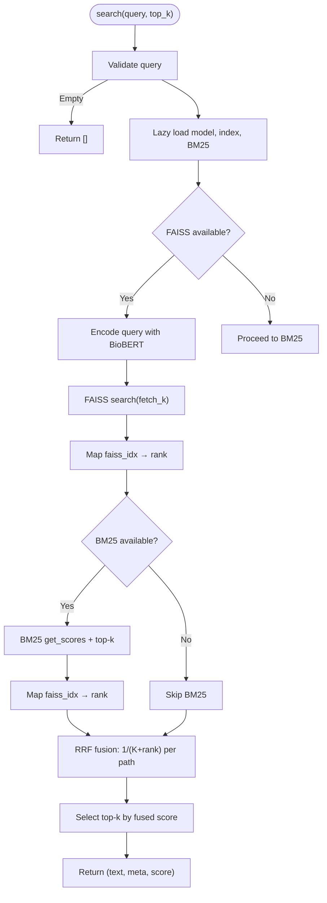
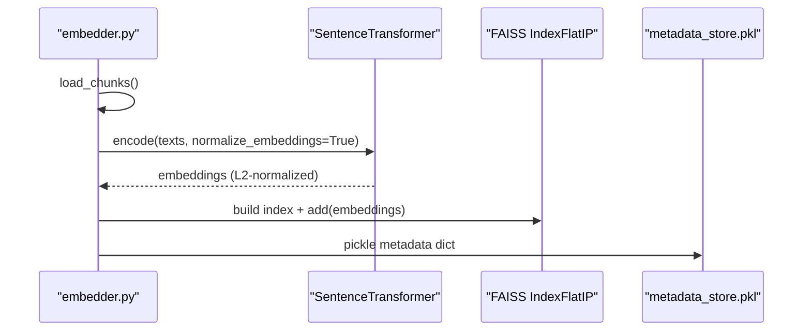
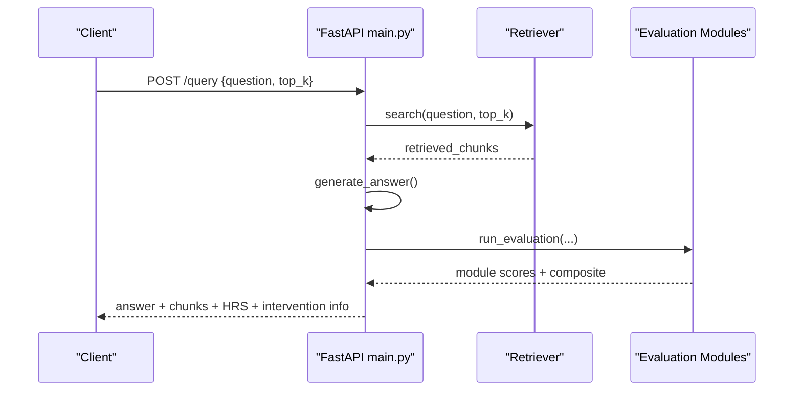
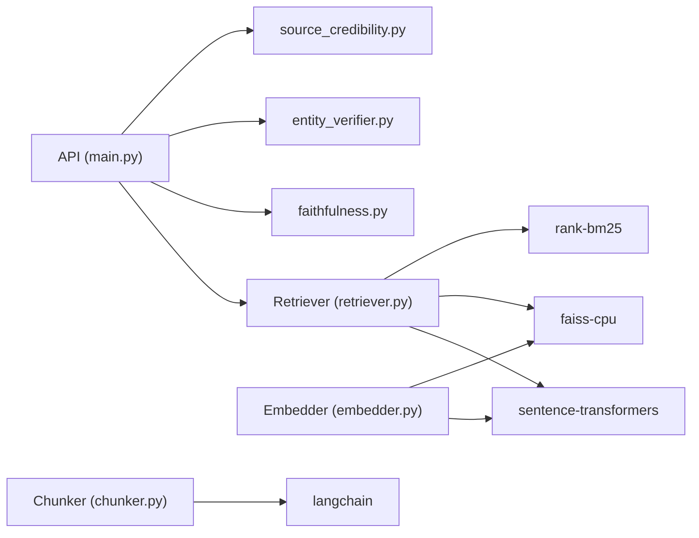

# Hybrid Retrieval System

<cite>
**Referenced Files in This Document**
- [retriever.py](file://Backend/src/pipeline/retriever.py)
- [embedder.py](file://Backend/src/pipeline/embedder.py)
- [chunker.py](file://Backend/src/pipeline/chunker.py)
- [ingest.py](file://Backend/src/pipeline/ingest.py)
- [main.py](file://Backend/src/api/main.py)
- [config.yaml](file://Backend/config.yaml)
- [requirements.txt](file://Backend/requirements.txt)
- [faithfulness.py](file://Backend/src/modules/faithfulness.py)
- [entity_verifier.py](file://Backend/src/modules/entity_verifier.py)
- [source_credibility.py](file://Backend/src/modules/source_credibility.py)
</cite>

## Table of Contents
1. [Introduction](#introduction)
2. [Project Structure](#project-structure)
3. [Core Components](#core-components)
4. [Architecture Overview](#architecture-overview)
5. [Detailed Component Analysis](#detailed-component-analysis)
6. [Dependency Analysis](#dependency-analysis)
7. [Performance Considerations](#performance-considerations)
8. [Troubleshooting Guide](#troubleshooting-guide)
9. [Conclusion](#conclusion)
10. [Appendices](#appendices)

## Introduction
This document describes the hybrid retrieval system that combines FAISS semantic search with BioBERT embeddings and BM25 keyword matching, followed by Reciprocal Rank Fusion (RRF) to produce a unified ranking. It explains the dual-path retrieval architecture, the semantic and keyword search stages, the RRF fusion mechanism, and operational safeguards such as lazy index loading, fallback behavior, and thread-safe dynamic ingestion. It also covers parameter tuning (top_k, fetch_k, RRF constants), concurrent search operations, and performance optimization strategies.

## Project Structure
The retrieval system spans ingestion, embedding, indexing, and runtime search components, integrated into a FastAPI service that exposes endpoints for health checks, evaluation, and end-to-end querying.

**Diagram sources**
- [ingest.py:1-251](file://Backend/src/pipeline/ingest.py#L1-L251)
- [chunker.py:1-83](file://Backend/src/pipeline/chunker.py#L1-L83)
- [embedder.py:1-164](file://Backend/src/pipeline/embedder.py#L1-L164)
- [retriever.py:1-287](file://Backend/src/pipeline/retriever.py#L1-L287)
- [main.py:1-678](file://Backend/src/api/main.py#L1-L678)
- [faithfulness.py:1-234](file://Backend/src/modules/faithfulness.py#L1-L234)
- [entity_verifier.py:1-283](file://Backend/src/modules/entity_verifier.py#L1-L283)
- [source_credibility.py:1-200](file://Backend/src/modules/source_credibility.py#L1-L200)

**Section sources**
- [config.yaml:1-66](file://Backend/config.yaml#L1-L66)
- [requirements.txt:1-35](file://Backend/requirements.txt#L1-L35)

## Core Components
- Retriever: Implements dual-path retrieval with FAISS semantic search and BM25 keyword search, then fuses results via RRF.
- Embedder: Encodes chunks with BioBERT via SentenceTransformer, normalizes vectors, and builds FAISS IndexFlatIP.
- Chunker: Produces overlapping text chunks with FR-03b metadata schema.
- Ingest: Loads curated datasets, saves raw documents, and produces chunked JSONL for embedding.
- API: Exposes endpoints, pre-warms models, orchestrates retrieval and evaluation, and supports dynamic ingestion with thread safety.
- Evaluation modules: Faithfulness, Entity Verifier, and Source Credibility consume retrieved chunks to compute composite scores.

**Section sources**
- [retriever.py:39-250](file://Backend/src/pipeline/retriever.py#L39-L250)
- [embedder.py:32-159](file://Backend/src/pipeline/embedder.py#L32-L159)
- [chunker.py:20-82](file://Backend/src/pipeline/chunker.py#L20-L82)
- [ingest.py:212-246](file://Backend/src/pipeline/ingest.py#L212-L246)
- [main.py:125-149](file://Backend/src/api/main.py#L125-L149)
- [faithfulness.py:86-233](file://Backend/src/modules/faithfulness.py#L86-L233)
- [entity_verifier.py:146-282](file://Backend/src/modules/entity_verifier.py#L146-L282)
- [source_credibility.py:121-199](file://Backend/src/modules/source_credibility.py#L121-L199)

## Architecture Overview
The hybrid retrieval architecture consists of:
- Semantic path: BioBERT embeddings encoded with L2 normalization, stored in FAISS IndexFlatIP for cosine similarity.
- Keyword path: BM25 Okapi index built over chunk texts for lexical matching.
- Fusion: Reciprocal Rank Fusion combines both rankings with a tunable constant K.

**Diagram sources**
- [main.py:308-519](file://Backend/src/api/main.py#L308-L519)
- [retriever.py:149-250](file://Backend/src/pipeline/retriever.py#L149-L250)
- [embedder.py:55-78](file://Backend/src/pipeline/embedder.py#L55-L78)

## Detailed Component Analysis

### Retriever: Dual-Path Hybrid Search with RRF
- Lazy initialization:
  - Embedding model (BioBERT) loaded on demand.
  - FAISS index and metadata loaded on first search.
  - BM25 index lazily built on first search; can be rebuilt after dynamic ingestion.
- Search parameters:
  - top_k configurable via config; fetch_k scaled to 3× top_k (bounded).
  - RRF_K constant set to 60 for smooth blending.
- Execution flow:
  - FAISS semantic search: encodes query, performs vector search, ranks by inner product (cosine).
  - BM25 keyword search: tokenizes query, computes BM25 scores, selects top candidates.
  - Fusion: RRF aggregates scores by reciprocal rank; chunks appearing in both paths gain additive benefit.
- Fallback behavior:
  - If FAISS is unavailable but BM25 exists, proceeds with BM25-only.
  - If both are unavailable, returns empty results with error logs.
- Thread-safety:
  - Not designed for concurrent search; ingestion uses a lock to safely update FAISS and metadata atomically.

**Diagram sources**
- [retriever.py:149-250](file://Backend/src/pipeline/retriever.py#L149-L250)

**Section sources**
- [retriever.py:49-114](file://Backend/src/pipeline/retriever.py#L49-L114)
- [retriever.py:149-250](file://Backend/src/pipeline/retriever.py#L149-L250)

### Embedder: BioBERT Encoding and FAISS Index Construction
- Loads BioBERT via SentenceTransformer, encodes texts with L2 normalization, and builds FAISS IndexFlatIP.
- Builds a parallel metadata dictionary keyed by FAISS integer indices, preserving FR-03b schema and chunk_text for retrieval.
- Persists FAISS index and metadata pickle to disk.

**Diagram sources**
- [embedder.py:37-159](file://Backend/src/pipeline/embedder.py#L37-L159)

**Section sources**
- [embedder.py:37-159](file://Backend/src/pipeline/embedder.py#L37-L159)

### Chunker: Overlapping Text Chunking with Metadata Schema
- Uses LangChain RecursiveCharacterTextSplitter with configurable chunk size and overlap.
- Produces chunk dictionaries aligned with FR-03b metadata schema, including identifiers and provenance.

**Section sources**
- [chunker.py:20-82](file://Backend/src/pipeline/chunker.py#L20-L82)

### Ingest: Curated Dataset Loading and Chunk Persistence
- Loads PubMedQA and MedQA-USMLE datasets, transforms into documents, saves raw JSONL, chunks into JSONL for embedding.

**Section sources**
- [ingest.py:48-183](file://Backend/src/pipeline/ingest.py#L48-L183)
- [ingest.py:212-246](file://Backend/src/pipeline/ingest.py#L212-L246)

### API: End-to-End Pipeline, Warm-up, and Dynamic Ingestion
- Pre-warms DeBERTa and Retriever at startup to avoid cold-start latency.
- /query endpoint:
  - Retrieves top-k chunks using Retriever.search.
  - Generates grounded answer with LLM.
  - Evaluates answer using Faithfulness, Entity Verifier, Source Credibility, and optional RAGAS.
  - Applies intervention logic based on HRS thresholds.
- /ingest endpoint:
  - Thread-safe dynamic ingestion using a lock to prevent concurrent write corruption.
  - Adds new chunks, reuses BioBERT model, updates FAISS index and metadata atomically, and rebuilds BM25.

**Diagram sources**
- [main.py:308-519](file://Backend/src/api/main.py#L308-L519)

**Section sources**
- [main.py:125-149](file://Backend/src/api/main.py#L125-L149)
- [main.py:308-519](file://Backend/src/api/main.py#L308-L519)
- [main.py:526-603](file://Backend/src/api/main.py#L526-L603)

### Evaluation Modules: Faithfulness, Entity Verifier, Source Credibility
- Faithfulness: Splits answer into claims and scores NLI entailment against context; computes fraction of entailed claims.
- Entity Verifier: Extracts medical entities with SciSpaCy, verifies drugs against RxNorm cache/API, and scores verified drugs.
- Source Credibility: Computes weighted average of evidence tiers from metadata or keyword classification.

**Section sources**
- [faithfulness.py:86-233](file://Backend/src/modules/faithfulness.py#L86-L233)
- [entity_verifier.py:146-282](file://Backend/src/modules/entity_verifier.py#L146-L282)
- [source_credibility.py:121-199](file://Backend/src/modules/source_credibility.py#L121-L199)

## Dependency Analysis
External libraries and their roles:
- sentence-transformers: BioBERT model loading and encoding.
- faiss-cpu: FAISS index I/O and vector search.
- rank-bm25: BM25 Okapi scoring.
- fastapi/uvicorn: API server and endpoints.
- langchain: text splitting for chunking.
- scispacy + en_core_sci_lg: NER for entity verification (installed separately).

**Diagram sources**
- [retriever.py:28-34](file://Backend/src/pipeline/retriever.py#L28-L34)
- [embedder.py:23-25](file://Backend/src/pipeline/embedder.py#L23-L25)
- [chunker.py:37-47](file://Backend/src/pipeline/chunker.py#L37-L47)
- [main.py:49, 47:49-49](file://Backend/src/api/main.py#L49-L49)
- [requirements.txt:10-34](file://Backend/requirements.txt#L10-L34)

**Section sources**
- [requirements.txt:1-35](file://Backend/requirements.txt#L1-L35)

## Performance Considerations
- Parameter tuning:
  - top_k: controls final result count; default configured in config.yaml.
  - fetch_k: increases candidate pool from each retriever before fusion; default derived as 3× top_k (bounded).
  - RRF_K: smoothing constant; higher values produce smoother blending; default set to 60.
- Lazy loading:
  - Embedding model and FAISS index are loaded on first search to reduce cold-start latency.
  - BM25 index is rebuilt on demand and after dynamic ingestion.
- Thread-safety during ingestion:
  - A lock serializes FAISS and metadata updates; atomic writes ensure durability.
- Model reuse:
  - During dynamic ingestion, the running API reuses the preloaded BioBERT model to avoid double memory usage.
- Concurrency:
  - Retrieval is not explicitly designed for concurrent search; consider request-level synchronization if scaling horizontally.
- Disk I/O:
  - FAISS and metadata are persisted to disk; ingestion uses temporary files and atomic renames to prevent corruption.

[No sources needed since this section provides general guidance]

## Troubleshooting Guide
Common issues and resolutions:
- FAISS not installed or import fails:
  - Symptom: FAISS disabled warning; semantic search skipped.
  - Resolution: Install faiss-cpu per requirements.txt.
- Missing FAISS index or metadata:
  - Symptom: FileNotFoundError prompting to run ingestion and embedding steps.
  - Resolution: Execute ingestion and embedding pipeline; verify index_path and metadata_path in config.yaml.
- Empty query:
  - Symptom: Warning and empty results.
  - Resolution: Ensure non-empty query string.
- Both FAISS and BM25 unavailable:
  - Symptom: Error indicating both unavailable; empty results.
  - Resolution: Install sentence-transformers and rank-bm25; verify model availability.
- Dynamic ingestion failures:
  - Symptom: Errors during /ingest.
  - Resolution: Confirm FAISS is pre-warmed; ensure lock-free environment; check atomic write permissions.

**Section sources**
- [retriever.py:87-114](file://Backend/src/pipeline/retriever.py#L87-L114)
- [retriever.py:165-206](file://Backend/src/pipeline/retriever.py#L165-L206)
- [main.py:526-603](file://Backend/src/api/main.py#L526-L603)

## Conclusion
The hybrid retrieval system leverages FAISS semantic search with BioBERT embeddings and BM25 keyword matching, then fuses results via RRF to balance precision and recall. Lazy loading, robust fallbacks, and thread-safe ingestion ensure reliable operation. Tuning top_k, fetch_k, and RRF_K allows balancing speed and quality. The integrated evaluation modules further ground and assess the retrieved context to support safe, high-quality responses.

[No sources needed since this section summarizes without analyzing specific files]

## Appendices

### Configuration Reference
Key retrieval settings:
- top_k: number of final results.
- embedding_model: BioBERT model identifier.
- index_path: FAISS index file location.
- metadata_path: metadata pickle location.
- chunk_size and chunk_overlap: chunking parameters.

**Section sources**
- [config.yaml:1-7](file://Backend/config.yaml#L1-L7)

### Example Hybrid Queries and Expected Behavior
- Example query: “What is the recommended dosage of Metformin for Type 2 Diabetes in elderly patients?”
  - Semantic search finds relevant clinical guidelines and abstracts.
  - Keyword search identifies terms like “Metformin,” “dosage,” “elderly.”
  - RRF ranks results combining both signals, surfacing authoritative sources with strong lexical matches.
- Example query: “Contraindications of ibuprofen for patients with chronic kidney disease”
  - Semantic search retrieves studies and guidelines on NSAIDs and renal function.
  - Keyword search emphasizes drug and condition terms.
  - RRF prioritizes results that are both semantically and lexically relevant.

[No sources needed since this section provides conceptual examples]