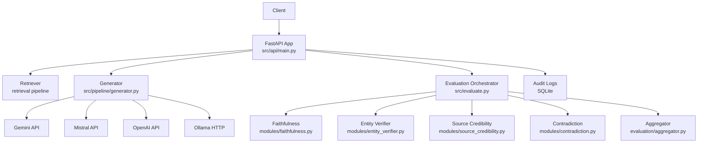
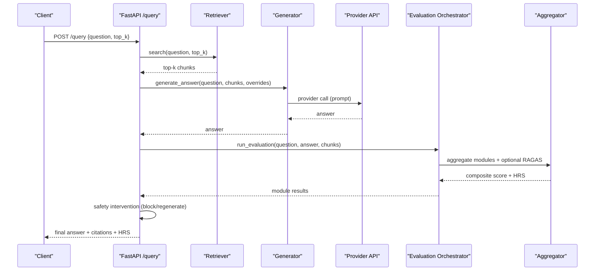
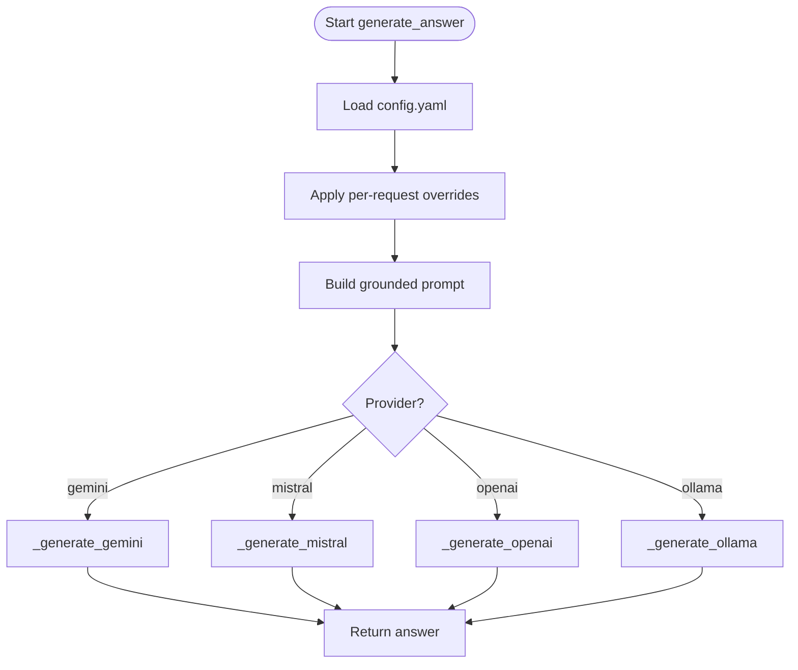
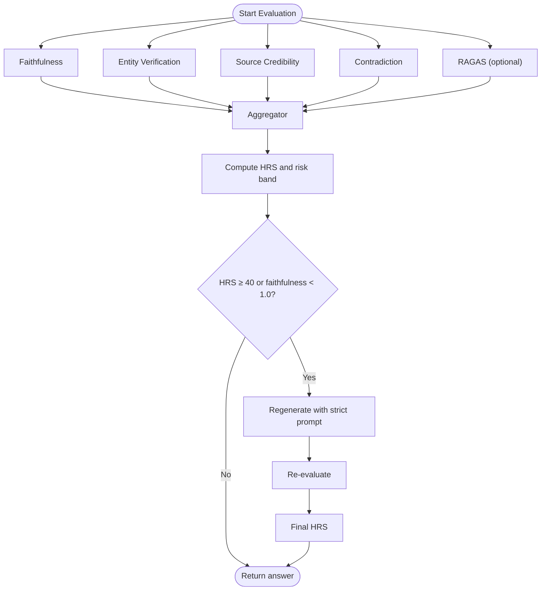
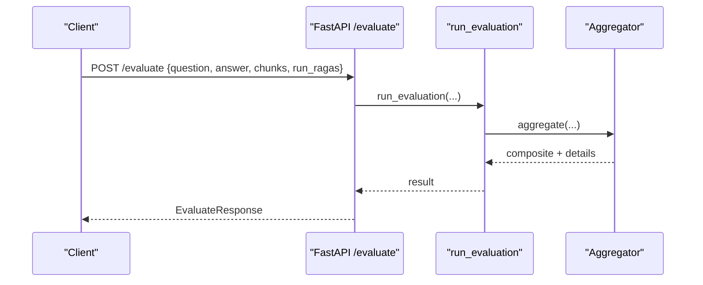
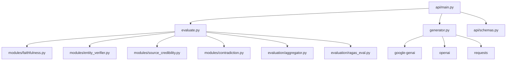

# LLM Generation Pipeline

<cite>
**Referenced Files in This Document**
- [generator.py](file://Backend/src/pipeline/generator.py)
- [main.py](file://Backend/src/api/main.py)
- [config.yaml](file://Backend/config.yaml)
- [schemas.py](file://Backend/src/api/schemas.py)
- [evaluate.py](file://Backend/src/evaluate.py)
- [aggregator.py](file://Backend/src/evaluation/aggregator.py)
- [ragas_eval.py](file://Backend/src/evaluation/ragas_eval.py)
- [requirements.txt](file://Backend/requirements.txt)
</cite>

## Table of Contents
1. [Introduction](#introduction)
2. [Project Structure](#project-structure)
3. [Core Components](#core-components)
4. [Architecture Overview](#architecture-overview)
5. [Detailed Component Analysis](#detailed-component-analysis)
6. [Dependency Analysis](#dependency-analysis)
7. [Performance Considerations](#performance-considerations)
8. [Troubleshooting Guide](#troubleshooting-guide)
9. [Conclusion](#conclusion)
10. [Appendices](#appendices)

## Introduction
This document describes the LLM generation pipeline for medical question answering and response synthesis in the MediRAG system. It explains how the system integrates multiple LLM providers (Gemini, Mistral, OpenAI, Ollama), applies prompt engineering tailored for clinical contexts, and enforces safety and quality controls. It also documents generation parameters, retrieval-grounded synthesis, response formatting, and the intervention loop that mitigates hallucinations and unsafe content.

## Project Structure
The generation pipeline is implemented in the backend service and orchestrated by the FastAPI application. The key modules are:
- Generator: builds prompts and routes to provider-specific clients
- API: exposes endpoints for health checks, evaluation, and end-to-end query
- Evaluation: runs quality modules and aggregates a Health Risk Score (HRS)
- Configuration: centralizes provider selection, timeouts, and generation parameters

**Diagram sources**
- [main.py:308-520](file://Backend/src/api/main.py#L308-L520)
- [generator.py:344-462](file://Backend/src/pipeline/generator.py#L344-L462)
- [evaluate.py:49-167](file://Backend/src/evaluate.py#L49-L167)
- [aggregator.py:47-167](file://Backend/src/evaluation/aggregator.py#L47-L167)

**Section sources**
- [main.py:1-678](file://Backend/src/api/main.py#L1-L678)
- [generator.py:1-462](file://Backend/src/pipeline/generator.py#L1-L462)
- [config.yaml:1-66](file://Backend/config.yaml#L1-L66)

## Core Components
- Generation orchestration: selects provider, builds grounded prompts, and returns answers
- Provider clients: Gemini, Mistral, OpenAI, and Ollama with robust error handling
- Prompt engineering: system prompts enforce citation, groundedness, and strict mode for unsafe content
- Evaluation pipeline: faithfulness, entity verification, source credibility, contradiction, optional RAGAS
- Safety intervention: blocks or regenerates answers based on HRS thresholds

**Section sources**
- [generator.py:45-125](file://Backend/src/pipeline/generator.py#L45-L125)
- [generator.py:131-337](file://Backend/src/pipeline/generator.py#L131-L337)
- [evaluate.py:49-167](file://Backend/src/evaluate.py#L49-L167)
- [aggregator.py:47-167](file://Backend/src/evaluation/aggregator.py#L47-L167)

## Architecture Overview
The end-to-end flow for a medical query:
1. Retrieve top-k context chunks from FAISS/BM25
2. Build a grounded prompt with citations
3. Generate an answer via the selected LLM provider
4. Evaluate the answer with multiple modules and compute HRS
5. Apply safety interventions (block or regenerate with strict prompt)
6. Return the final answer with provenance and module scores

**Diagram sources**
- [main.py:308-520](file://Backend/src/api/main.py#L308-L520)
- [generator.py:344-462](file://Backend/src/pipeline/generator.py#L344-L462)
- [evaluate.py:49-167](file://Backend/src/evaluate.py#L49-L167)
- [aggregator.py:47-167](file://Backend/src/evaluation/aggregator.py#L47-L167)

## Detailed Component Analysis

### Generation Orchestration and Prompt Engineering
- System prompts emphasize:
  - Groundedness: answer from context first
  - Citation: inline citations for each claim
  - General knowledge caveat: explicit disclaimer when relying on general knowledge
  - Strict mode: context-only, no hallucinations, explicit insufficiency statement
- Prompt construction:
  - Builds a header per chunk with title, publication type, and source
  - Concatenates context blocks and appends question and instruction
- Overrides:
  - Provider, API key, model, and Ollama URL can be overridden per request

**Diagram sources**
- [generator.py:344-462](file://Backend/src/pipeline/generator.py#L344-L462)
- [generator.py:56-85](file://Backend/src/pipeline/generator.py#L56-L85)
- [generator.py:100-124](file://Backend/src/pipeline/generator.py#L100-L124)

**Section sources**
- [generator.py:45-125](file://Backend/src/pipeline/generator.py#L45-L125)
- [generator.py:344-462](file://Backend/src/pipeline/generator.py#L344-L462)

### Provider Integrations
- Gemini:
  - Uses the new Google GenAI client
  - Temperature and max output tokens configurable
  - Requires API key via environment or config
- Mistral:
  - HTTP client to Mistral API
  - Supports API key via environment or config
  - Configurable model and temperature
- OpenAI:
  - Uses OpenAI SDK chat completions
  - Configurable model and temperature
  - Enforces max tokens for answer length
- Ollama:
  - HTTP JSON API to local Ollama
  - Supports model, temperature, num_predict, and timeout
  - Validates connectivity and returns helpful errors

**Section sources**
- [generator.py:177-231](file://Backend/src/pipeline/generator.py#L177-L231)
- [generator.py:290-337](file://Backend/src/pipeline/generator.py#L290-L337)
- [generator.py:131-176](file://Backend/src/pipeline/generator.py#L131-L176)
- [generator.py:238-283](file://Backend/src/pipeline/generator.py#L238-L283)

### Generation Parameters and Safety Filters
- Generation parameters:
  - Temperature: configurable per provider; default tuned for natural, grounded answers
  - Max tokens: enforced per provider to bound answer length
  - Timeout: Ollama timeout configurable
- Safety filters:
  - Inline citation requirement for claims
  - Strict prompt mode forbids general knowledge and hallucinations
  - Safety intervention loop:
    - Block if HRS ≥ 86 (CRITICAL)
    - Regenerate with strict prompt if HRS ≥ 40 or faithfulness < 1.0

**Section sources**
- [config.yaml:44-52](file://Backend/config.yaml#L44-L52)
- [generator.py:159-164](file://Backend/src/pipeline/generator.py#L159-L164)
- [generator.py:213-219](file://Backend/src/pipeline/generator.py#L213-L219)
- [generator.py:299-307](file://Backend/src/pipeline/generator.py#L299-L307)
- [main.py:430-485](file://Backend/src/api/main.py#L430-L485)

### Retrieval-Grounded Synthesis and Response Formatting
- Context chunks include:
  - Text, title, source, publication type, and optional identifiers
- Prompt formatting:
  - Each chunk header lists title, type, and source
  - Instructions require inline citations for each claim
- Response formatting:
  - Answers cite sources inline
  - When context is insufficient, system directs to general knowledge caveat
  - Strict mode enforces context-only answers and explicit insufficiency statements

**Section sources**
- [generator.py:56-85](file://Backend/src/pipeline/generator.py#L56-L85)
- [generator.py:100-124](file://Backend/src/pipeline/generator.py#L100-L124)

### Evaluation and Hallucination Mitigation
- Modules:
  - Faithfulness: DeBERTa NLI cross-encoder to measure entailment vs. context
  - Entity verification: SciSpaCy NER + RxNorm cache/API for drugs/dosages
  - Source credibility: Evidence tier scoring via metadata or keyword matching
  - Contradiction: NLI-based detection of self-contradictions
  - Optional RAGAS: faithfulness and answer relevancy using an LLM backend
- Aggregation:
  - Weighted composite score with non-linear penalties for poor faithfulness or contradictions
  - HRS = round(100 × (1 − composite))
  - Risk bands: LOW, MODERATE, HIGH, CRITICAL
- Intervention:
  - CRITICAL_BLOCKED: block if HRS ≥ 86
  - HIGH_RISK_REGENERATED: regenerate with strict prompt if HRS ≥ 40 or faithfulness < 1.0

**Diagram sources**
- [evaluate.py:49-167](file://Backend/src/evaluate.py#L49-L167)
- [aggregator.py:47-167](file://Backend/src/evaluation/aggregator.py#L47-L167)
- [main.py:414-497](file://Backend/src/api/main.py#L414-L497)

**Section sources**
- [evaluate.py:49-167](file://Backend/src/evaluate.py#L49-L167)
- [aggregator.py:47-167](file://Backend/src/evaluation/aggregator.py#L47-L167)
- [ragas_eval.py:81-178](file://Backend/src/evaluation/ragas_eval.py#L81-L178)
- [main.py:414-497](file://Backend/src/api/main.py#L414-L497)

### API Workflows and Examples
- End-to-end query:
  - Endpoint: POST /query
  - Steps: retrieve → generate → evaluate → intervention → return
  - Supports per-request provider overrides and optional RAGAS
- Evaluation endpoint:
  - Endpoint: POST /evaluate
  - Validates inputs and returns module scores and HRS
- Health endpoint:
  - Endpoint: GET /health
  - Reports liveness and Ollama availability

**Diagram sources**
- [main.py:223-302](file://Backend/src/api/main.py#L223-L302)
- [evaluate.py:49-167](file://Backend/src/evaluate.py#L49-L167)
- [aggregator.py:47-167](file://Backend/src/evaluation/aggregator.py#L47-L167)

**Section sources**
- [main.py:206-302](file://Backend/src/api/main.py#L206-L302)
- [schemas.py:146-232](file://Backend/src/api/schemas.py#L146-L232)

## Dependency Analysis
- Provider SDKs and libraries:
  - Google GenAI for Gemini
  - OpenAI SDK for OpenAI
  - Requests for Mistral and Ollama
  - LangChain components for RAGAS
- Model and tokenizer dependencies:
  - sentence-transformers, transformers, torch
  - SciSpaCy and RxNorm integration for entity verification
- Web framework:
  - FastAPI and Uvicorn for serving

**Diagram sources**
- [generator.py:148-150](file://Backend/src/pipeline/generator.py#L148-L150)
- [generator.py:199-204](file://Backend/src/pipeline/generator.py#L199-L204)
- [evaluate.py:35-40](file://Backend/src/evaluate.py#L35-L40)
- [ragas_eval.py:53-74](file://Backend/src/evaluation/ragas_eval.py#L53-L74)
- [requirements.txt:1-35](file://Backend/requirements.txt#L1-L35)

**Section sources**
- [requirements.txt:1-35](file://Backend/requirements.txt#L1-L35)
- [generator.py:148-150](file://Backend/src/pipeline/generator.py#L148-L150)
- [generator.py:199-204](file://Backend/src/pipeline/generator.py#L199-L204)
- [ragas_eval.py:53-74](file://Backend/src/evaluation/ragas_eval.py#L53-L74)

## Performance Considerations
- Latency optimization:
  - Pre-warm DeBERTa and Retriever at startup to avoid cold-start delays
  - Skip RAGAS on regeneration to reduce latency
  - Cap sentence pairs and context sentences to bound inference time
- Token and throughput:
  - Enforce max tokens per provider to control costs and latency
  - Tune temperature for a balance between creativity and groundedness
- Resource constraints:
  - Use CPU-friendly models and batching where possible
  - Monitor provider quotas and adjust timeouts accordingly

[No sources needed since this section provides general guidance]

## Troubleshooting Guide
- Provider connectivity:
  - Gemini: ensure API key is set; verify environment or config
  - Mistral: confirm API key and model availability
  - OpenAI: verify API key and model permissions
  - Ollama: check base URL and model pull status
- Empty or invalid responses:
  - Providers return empty answers as errors; verify prompts and context
- Evaluation failures:
  - Missing NLP models or libraries will degrade performance; install required packages
  - RAGAS requires a working LLM backend; otherwise returns neutral scores
- Safety intervention:
  - If HRS is high, the system either blocks or regenerates; review module details to understand triggers

**Section sources**
- [generator.py:131-176](file://Backend/src/pipeline/generator.py#L131-L176)
- [generator.py:177-231](file://Backend/src/pipeline/generator.py#L177-L231)
- [generator.py:290-337](file://Backend/src/pipeline/generator.py#L290-L337)
- [generator.py:238-283](file://Backend/src/pipeline/generator.py#L238-L283)
- [ragas_eval.py:104-120](file://Backend/src/evaluation/ragas_eval.py#L104-L120)
- [main.py:430-497](file://Backend/src/api/main.py#L430-L497)

## Conclusion
The MediRAG generation pipeline integrates multiple LLM providers with strong prompt engineering and retrieval-grounded synthesis. It enforces rigorous safety and quality controls through a multi-module evaluation pipeline and an intervention loop that blocks or regenerates unsafe or hallucinatory answers. The system balances performance and accuracy, enabling real-time medical Q&A with transparent provenance and risk scoring.

[No sources needed since this section summarizes without analyzing specific files]

## Appendices

### Provider-Specific Configuration Keys
- Gemini: gemini_api_key, gemini_model
- Mistral: mistral_api_key, model, base_url, timeout_seconds
- OpenAI: openai_api_key, openai_model
- Ollama: base_url, model, timeout_seconds

**Section sources**
- [config.yaml:44-52](file://Backend/config.yaml#L44-L52)
- [generator.py:131-176](file://Backend/src/pipeline/generator.py#L131-L176)
- [generator.py:177-231](file://Backend/src/pipeline/generator.py#L177-L231)
- [generator.py:290-337](file://Backend/src/pipeline/generator.py#L290-L337)
- [generator.py:238-283](file://Backend/src/pipeline/generator.py#L238-L283)

### Example Generation Workflows
- Default workflow:
  - Use server config.yaml provider and model
  - Generate answer, evaluate, and apply intervention if needed
- Overridden workflow:
  - Override provider, API key, model, or Ollama URL per request
  - Useful for testing or multi-tenant deployments

**Section sources**
- [main.py:375-385](file://Backend/src/api/main.py#L375-L385)
- [generator.py:376-396](file://Backend/src/pipeline/generator.py#L376-L396)