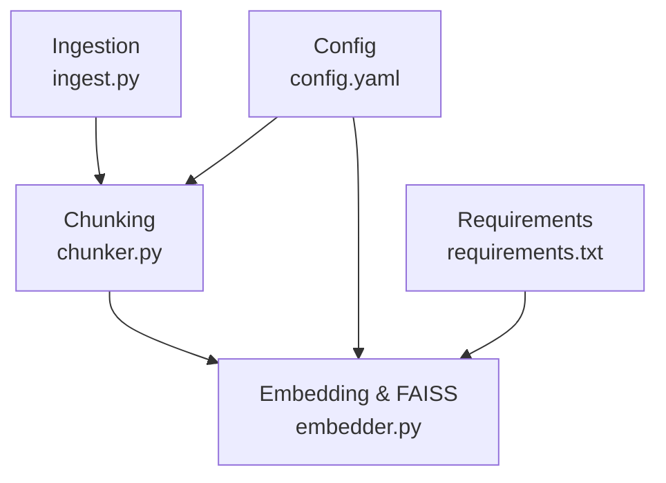
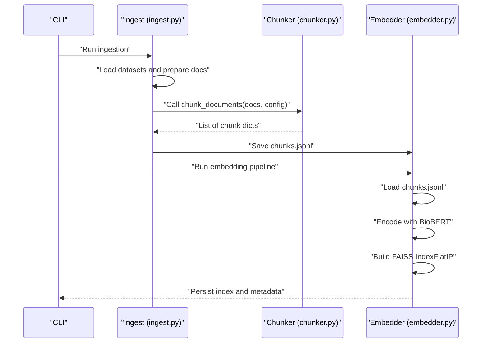
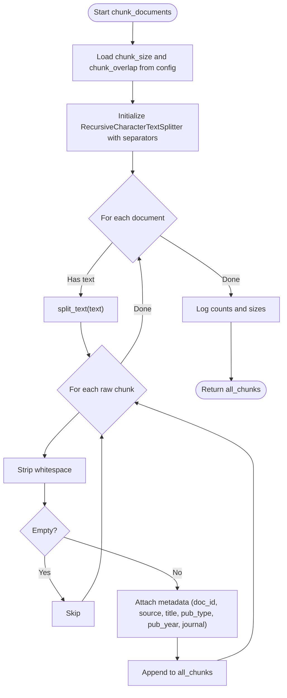
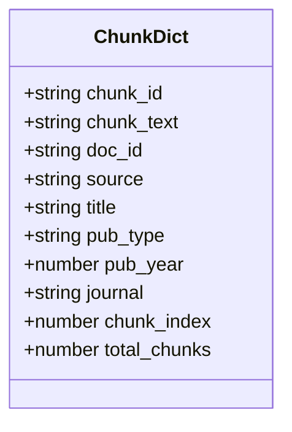
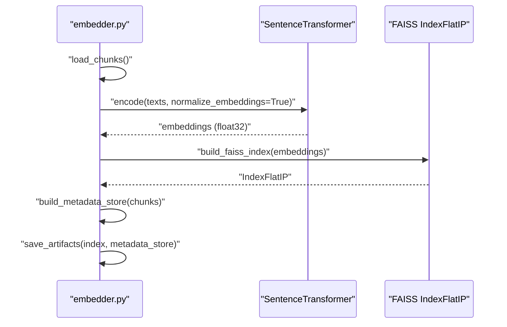
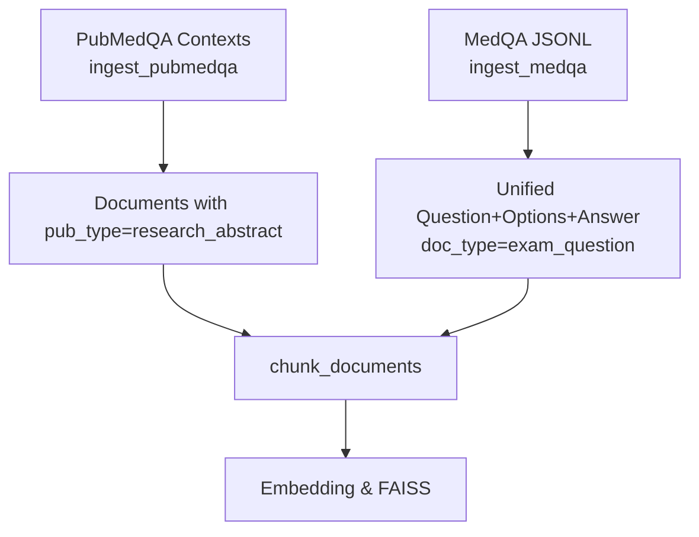
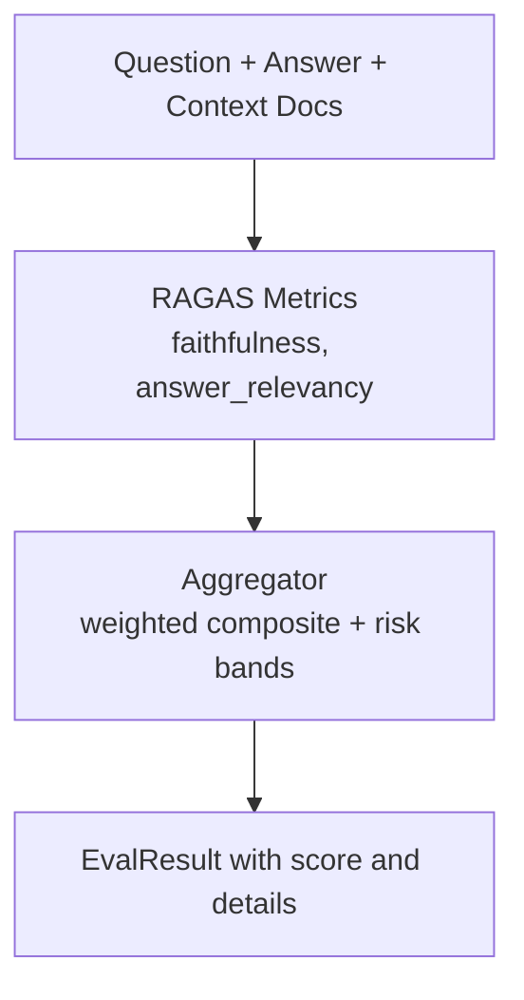
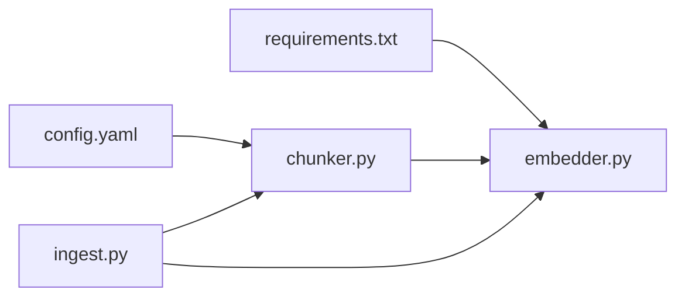

# Text Chunking and Preprocessing

<cite>
**Referenced Files in This Document**
- [chunker.py](file://Backend/src/pipeline/chunker.py)
- [ingest.py](file://Backend/src/pipeline/ingest.py)
- [embedder.py](file://Backend/src/pipeline/embedder.py)
- [config.yaml](file://Backend/config.yaml)
- [requirements.txt](file://Backend/requirements.txt)
- [ragas_eval.py](file://Backend/src/evaluation/ragas_eval.py)
- [aggregator.py](file://Backend/src/evaluation/aggregator.py)
</cite>

## Table of Contents
1. [Introduction](#introduction)
2. [Project Structure](#project-structure)
3. [Core Components](#core-components)
4. [Architecture Overview](#architecture-overview)
5. [Detailed Component Analysis](#detailed-component-analysis)
6. [Dependency Analysis](#dependency-analysis)
7. [Performance Considerations](#performance-considerations)
8. [Troubleshooting Guide](#troubleshooting-guide)
9. [Conclusion](#conclusion)
10. [Appendices](#appendices)

## Introduction
This document explains the text chunking and preprocessing system used to segment biomedical documents into overlapping text chunks optimized for downstream retrieval and embedding. It covers the chunking algorithm, overlap strategies, metadata attachment, and how the system integrates with BioBERT-based embeddings and FAISS indexing. It also provides guidance on adapting chunking for different medical document types, performance optimization for large volumes, and quality metrics for coherence assessment.

## Project Structure
The chunking and preprocessing pipeline spans ingestion, chunking, and embedding stages:
- Ingestion loads curated datasets and prepares raw documents with metadata.
- Chunking splits raw text into overlapping segments guided by configuration.
- Embedding encodes chunks with BioBERT and builds a FAISS index with metadata.

**Diagram sources**
- [ingest.py:212-251](file://Backend/src/pipeline/ingest.py#L212-L251)
- [chunker.py:20-83](file://Backend/src/pipeline/chunker.py#L20-L83)
- [embedder.py:139-164](file://Backend/src/pipeline/embedder.py#L139-L164)
- [config.yaml:1-66](file://Backend/config.yaml#L1-L66)
- [requirements.txt:1-35](file://Backend/requirements.txt#L1-L35)

**Section sources**
- [ingest.py:1-251](file://Backend/src/pipeline/ingest.py#L1-L251)
- [chunker.py:1-83](file://Backend/src/pipeline/chunker.py#L1-L83)
- [embedder.py:1-164](file://Backend/src/pipeline/embedder.py#L1-L164)
- [config.yaml:1-66](file://Backend/config.yaml#L1-L66)
- [requirements.txt:1-35](file://Backend/requirements.txt#L1-L35)

## Core Components
- Chunking algorithm: LangChain RecursiveCharacterTextSplitter with configurable chunk size and overlap, using sentence and whitespace-aware separators.
- Metadata schema: Each chunk carries a stable chunk identifier, document provenance, and positional metadata to reconstruct document order.
- Embedding and index: BioBERT SentenceTransformer embeddings (768-dim, L2-normalized) stored in FAISS IndexFlatIP for cosine similarity.

Key configuration:
- Chunk size and overlap are defined in the retrieval section of the configuration.
- Embedding model name and FAISS artifact paths are configured centrally.

**Section sources**
- [chunker.py:20-83](file://Backend/src/pipeline/chunker.py#L20-L83)
- [embedder.py:55-92](file://Backend/src/pipeline/embedder.py#L55-L92)
- [config.yaml:1-8](file://Backend/config.yaml#L1-L8)

## Architecture Overview
End-to-end ingestion-chunking-embedding workflow:

**Diagram sources**
- [ingest.py:212-251](file://Backend/src/pipeline/ingest.py#L212-L251)
- [chunker.py:20-83](file://Backend/src/pipeline/chunker.py#L20-L83)
- [embedder.py:139-164](file://Backend/src/pipeline/embedder.py#L139-L164)

## Detailed Component Analysis

### Chunking Algorithm and Strategies
- Algorithm: LangChain RecursiveCharacterTextSplitter with:
  - Character-level splitting respecting larger separators first.
  - Configurable chunk size and overlap.
  - Strips whitespace and skips empty chunks.
- Separators prioritize paragraph boundaries, newlines, sentence endings, spaces, and fallback to character-level splitting.
- Overlap ensures continuity across chunk boundaries, preserving context flow for downstream retrieval.

**Diagram sources**
- [chunker.py:20-83](file://Backend/src/pipeline/chunker.py#L20-L83)

**Section sources**
- [chunker.py:20-83](file://Backend/src/pipeline/chunker.py#L20-L83)
- [config.yaml:1-8](file://Backend/config.yaml#L1-L8)

### Preprocessing Steps and Metadata Attachment
- Text cleaning: Whitespace stripping and empty-chunk filtering occur during chunking.
- Metadata enrichment: Each chunk receives:
  - Unique identifiers for chunk and document.
  - Source, title, publication type, year, and journal.
  - Positional metadata: chunk index and total number of chunks per document.
- These fields align with the FR-03b schema and support FAISS metadata storage.

**Diagram sources**
- [chunker.py:64-76](file://Backend/src/pipeline/chunker.py#L64-L76)

**Section sources**
- [chunker.py:20-83](file://Backend/src/pipeline/chunker.py#L20-L83)

### Embedding and Indexing for BioBERT
- Model: BioBERT via SentenceTransformer (dmis-lab/biobert-v1.1).
- Encoding: Batch encoding with L2 normalization to enable cosine similarity via FAISS IndexFlatIP.
- Index: FAISS index persisted to disk with parallel metadata dictionary keyed by FAISS integer index.

**Diagram sources**
- [embedder.py:55-164](file://Backend/src/pipeline/embedder.py#L55-L164)
- [config.yaml:1-8](file://Backend/config.yaml#L1-L8)

**Section sources**
- [embedder.py:55-164](file://Backend/src/pipeline/embedder.py#L55-L164)
- [config.yaml:1-8](file://Backend/config.yaml#L1-L8)

### Handling Different Document Structures
- Medical literature (research abstracts): Ingestion pulls context passages and long answers from PubMedQA, tagging documents as research abstracts.
- Clinical notes: Ingestion from MedQA combines question, options, and answer into a unified document text.
- Research papers: Abstracts and long answers are treated as separate documents, enabling focused chunking around evidence.

**Diagram sources**
- [ingest.py:48-184](file://Backend/src/pipeline/ingest.py#L48-L184)
- [chunker.py:20-83](file://Backend/src/pipeline/chunker.py#L20-L83)
- [embedder.py:139-164](file://Backend/src/pipeline/embedder.py#L139-L164)

**Section sources**
- [ingest.py:48-184](file://Backend/src/pipeline/ingest.py#L48-L184)

### Quality Metrics and Coherence Assessment
- Faithfulness and answer relevancy: Computed using the RAGAS library with an LLM backend (OpenAI or Ollama). These metrics reflect how well retrieved chunks support generated answers.
- Aggregation: The aggregator combines multiple evaluation modules into a composite score and maps it to risk bands and confidence levels.

**Diagram sources**
- [ragas_eval.py:81-178](file://Backend/src/evaluation/ragas_eval.py#L81-L178)
- [aggregator.py:47-167](file://Backend/src/evaluation/aggregator.py#L47-L167)

**Section sources**
- [ragas_eval.py:81-178](file://Backend/src/evaluation/ragas_eval.py#L81-L178)
- [aggregator.py:47-167](file://Backend/src/evaluation/aggregator.py#L47-L167)

## Dependency Analysis
- Chunker depends on LangChain’s RecursiveCharacterTextSplitter and configuration values for chunk size and overlap.
- Embedder depends on SentenceTransformer for BioBERT embeddings, FAISS for indexing, and YAML for configuration.
- Ingestion depends on external datasets and local JSONL files, then delegates to chunker and persists chunks for embedding.

**Diagram sources**
- [config.yaml:1-66](file://Backend/config.yaml#L1-L66)
- [requirements.txt:1-35](file://Backend/requirements.txt#L1-L35)
- [chunker.py:20-83](file://Backend/src/pipeline/chunker.py#L20-L83)
- [embedder.py:55-164](file://Backend/src/pipeline/embedder.py#L55-L164)
- [ingest.py:212-251](file://Backend/src/pipeline/ingest.py#L212-L251)

**Section sources**
- [config.yaml:1-66](file://Backend/config.yaml#L1-L66)
- [requirements.txt:1-35](file://Backend/requirements.txt#L1-L35)
- [chunker.py:20-83](file://Backend/src/pipeline/chunker.py#L20-L83)
- [embedder.py:55-164](file://Backend/src/pipeline/embedder.py#L55-L164)
- [ingest.py:212-251](file://Backend/src/pipeline/ingest.py#L212-L251)

## Performance Considerations
- Chunk size and overlap: The current configuration balances recall and memory usage. Larger chunk sizes increase context but require more embedding resources; overlap preserves continuity at boundaries.
- Batch encoding: Embedding uses a configurable batch size to balance throughput and memory footprint.
- FAISS index: IndexFlatIP with normalized vectors enables fast cosine similarity search; ensure sufficient RAM for large corpora.
- Large document handling: For very long documents, consider increasing chunk size moderately and adjusting overlap to reduce fragmentation while maintaining context.

[No sources needed since this section provides general guidance]

## Troubleshooting Guide
- Empty or whitespace-only chunks: The chunker strips and filters empty chunks; verify input text is not blank and separators are appropriate.
- Missing chunks file: Embedding expects a chunks JSONL file produced by ingestion; ensure ingestion completes successfully.
- LLM backend for RAGAS: If no LLM backend is available, RAGAS returns neutral scores; configure OpenAI API key or start Ollama.
- Dataset loading failures: PubMedQA requires network connectivity and the datasets library; confirm installation and credentials.

**Section sources**
- [chunker.py:50-64](file://Backend/src/pipeline/chunker.py#L50-L64)
- [embedder.py:37-52](file://Backend/src/pipeline/embedder.py#L37-L52)
- [ragas_eval.py:104-120](file://Backend/src/evaluation/ragas_eval.py#L104-L120)
- [ingest.py:60-69](file://Backend/src/pipeline/ingest.py#L60-L69)

## Conclusion
The chunking and preprocessing system leverages a robust, configurable text splitter to produce overlapping chunks aligned with the FR-03b metadata schema. Combined with BioBERT embeddings and FAISS indexing, it supports effective retrieval for diverse medical document types. Quality is assessed via RAGAS metrics and aggregated into a composite score with risk classification, enabling continuous improvement of chunking strategies.

[No sources needed since this section summarizes without analyzing specific files]

## Appendices

### Configuration Reference
- retrieval.chunk_size: Controls chunk length.
- retrieval.chunk_overlap: Controls overlap between consecutive chunks.
- retrieval.embedding_model: BioBERT model identifier.
- retrieval.index_path, retrieval.metadata_path: Paths for FAISS index and metadata.

**Section sources**
- [config.yaml:1-8](file://Backend/config.yaml#L1-L8)

### Example Chunking Strategies by Document Type
- Research abstracts: Use sentence-aware separators to respect paragraph and sentence boundaries; moderate overlap to preserve scientific context.
- Exam questions: Combine question, options, and answer into a single document prior to chunking to maintain reasoning flow.
- Long narratives: Increase chunk size slightly and adjust overlap to avoid breaking cohesive clinical narratives.

[No sources needed since this section provides general guidance]