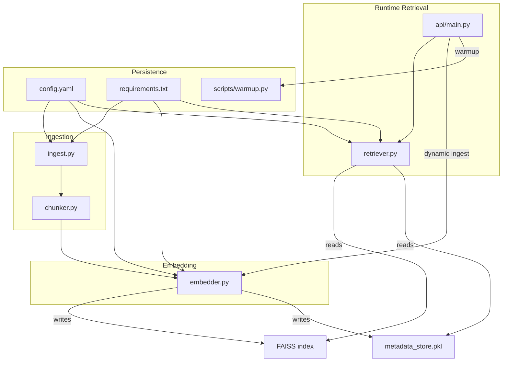
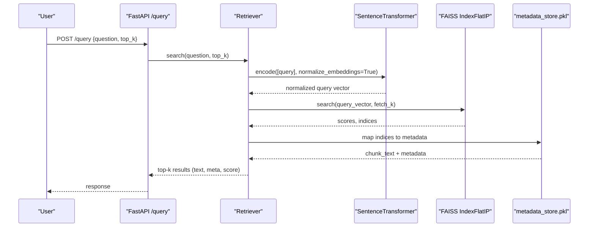
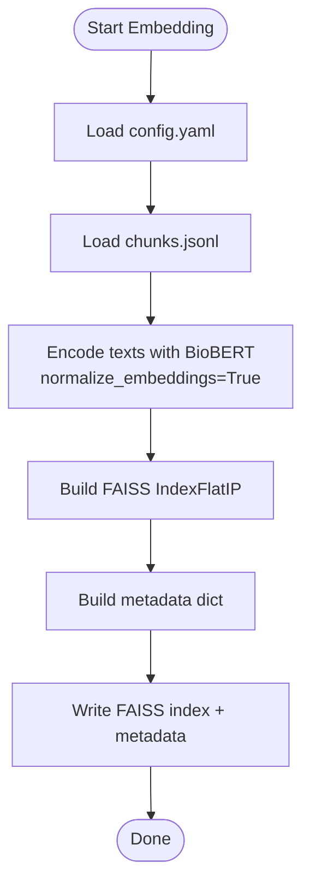
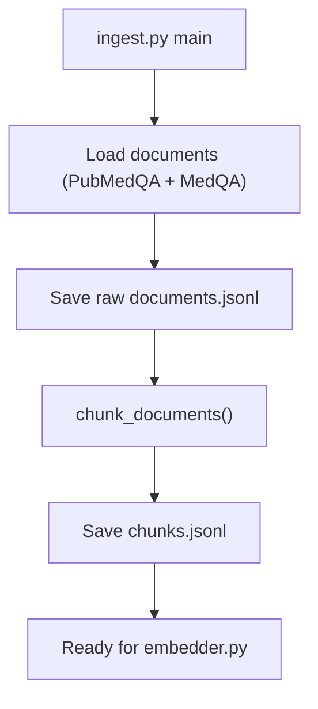
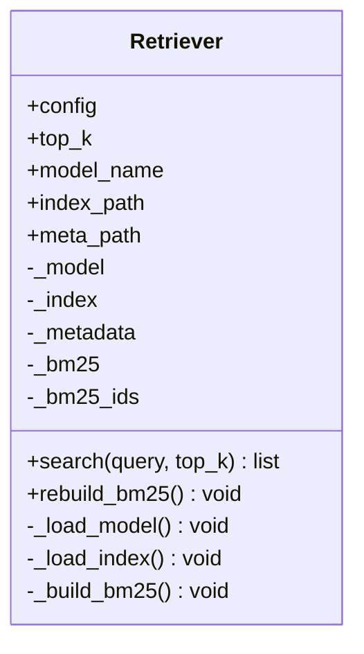
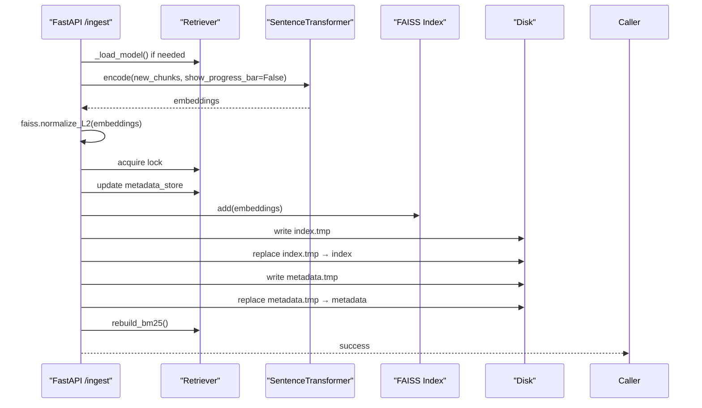
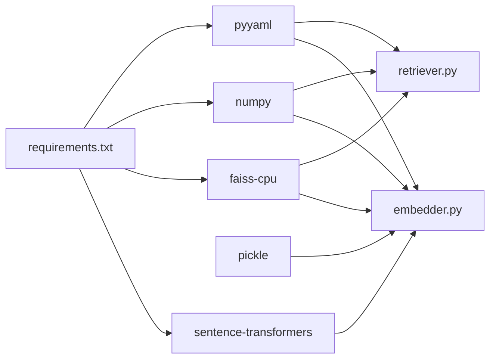

# Vector Embedding and Indexing

<cite>
**Referenced Files in This Document**
- [embedder.py](file://Backend/src/pipeline/embedder.py)
- [ingest.py](file://Backend/src/pipeline/ingest.py)
- [chunker.py](file://Backend/src/pipeline/chunker.py)
- [retriever.py](file://Backend/src/pipeline/retriever.py)
- [main.py](file://Backend/src/api/main.py)
- [warmup.py](file://Backend/scripts/warmup.py)
- [config.yaml](file://Backend/config.yaml)
- [requirements.txt](file://Backend/requirements.txt)
</cite>

## Table of Contents
1. [Introduction](#introduction)
2. [Project Structure](#project-structure)
3. [Core Components](#core-components)
4. [Architecture Overview](#architecture-overview)
5. [Detailed Component Analysis](#detailed-component-analysis)
6. [Dependency Analysis](#dependency-analysis)
7. [Performance Considerations](#performance-considerations)
8. [Troubleshooting Guide](#troubleshooting-guide)
9. [Conclusion](#conclusion)
10. [Appendices](#appendices)

## Introduction
This document explains the vector embedding and FAISS indexing system that powers semantic search in the backend. It focuses on:
- BioBERT-based semantic representation using Sentence-Transformers
- Vector normalization to enable cosine similarity with FAISS IndexFlatIP
- Batch embedding processing and memory-efficient storage
- Integration between FAISS indices and metadata stores
- Persistence and loading mechanisms
- Performance tuning and operational workflows for large-scale vector operations

## Project Structure
The vector embedding and indexing pipeline spans ingestion, chunking, embedding, FAISS index construction, and runtime retrieval. The API orchestrates ingestion and retrieval while maintaining thread-safe updates to the FAISS index.

**Diagram sources**
- [ingest.py:212-246](file://Backend/src/pipeline/ingest.py#L212-L246)
- [chunker.py:20-82](file://Backend/src/pipeline/chunker.py#L20-L82)
- [embedder.py:117-159](file://Backend/src/pipeline/embedder.py#L117-L159)
- [retriever.py:80-114](file://Backend/src/pipeline/retriever.py#L80-L114)
- [main.py:526-603](file://Backend/src/api/main.py#L526-L603)
- [warmup.py:23-56](file://Backend/scripts/warmup.py#L23-L56)
- [config.yaml:1-66](file://Backend/config.yaml#L1-L66)
- [requirements.txt:1-35](file://Backend/requirements.txt#L1-L35)

**Section sources**
- [ingest.py:1-251](file://Backend/src/pipeline/ingest.py#L1-L251)
- [chunker.py:1-83](file://Backend/src/pipeline/chunker.py#L1-L83)
- [embedder.py:1-164](file://Backend/src/pipeline/embedder.py#L1-L164)
- [retriever.py:1-287](file://Backend/src/pipeline/retriever.py#L1-L287)
- [main.py:1-678](file://Backend/src/api/main.py#L1-L678)
- [warmup.py:1-59](file://Backend/scripts/warmup.py#L1-L59)
- [config.yaml:1-66](file://Backend/config.yaml#L1-L66)
- [requirements.txt:1-35](file://Backend/requirements.txt#L1-L35)

## Core Components
- Ingestion pipeline: Loads documents from curated sources and produces chunked JSONL for embedding.
- Chunking: Applies recursive character splitting with configurable size and overlap.
- Embedding: Encodes chunk texts with BioBERT via Sentence-Transformers, normalizes vectors, constructs FAISS IndexFlatIP, and persists artifacts.
- Runtime retrieval: Loads FAISS index and metadata, performs hybrid semantic+keyword search with Reciprocal Rank Fusion, and returns top-k results.
- Dynamic ingestion: Adds new documents to the running FAISS index atomically and rebuilds BM25 for the running instance.
- Warmup: Preloads models and ensures instant response for the first API request.

**Section sources**
- [ingest.py:212-246](file://Backend/src/pipeline/ingest.py#L212-L246)
- [chunker.py:20-82](file://Backend/src/pipeline/chunker.py#L20-L82)
- [embedder.py:55-159](file://Backend/src/pipeline/embedder.py#L55-L159)
- [retriever.py:39-250](file://Backend/src/pipeline/retriever.py#L39-L250)
- [main.py:526-603](file://Backend/src/api/main.py#L526-L603)
- [warmup.py:23-56](file://Backend/scripts/warmup.py#L23-L56)

## Architecture Overview
The system uses BioBERT (Sentence-Transformers) to produce 768-dimension dense vectors. Vectors are L2-normalized so that FAISS IndexFlatIP computes cosine similarity. The index and metadata are persisted separately and loaded at runtime. The API supports dynamic ingestion by adding new vectors atomically and updating BM25.

**Diagram sources**
- [retriever.py:149-250](file://Backend/src/pipeline/retriever.py#L149-L250)
- [main.py:308-519](file://Backend/src/api/main.py#L308-L519)

## Detailed Component Analysis

### Embedding Pipeline (BioBERT + FAISS)
- Model: BioBERT via Sentence-Transformers dmis-lab/biobert-v1.1.
- Normalization: Embeddings are L2-normalized to enable cosine similarity with IndexFlatIP.
- Batch processing: Uses a configurable batch size for efficient GPU/CPU utilization.
- Index construction: Creates FAISS IndexFlatIP with dimension 768.
- Metadata store: Parallel dictionary mapping FAISS integer index to chunk metadata.
- Persistence: Writes FAISS index and metadata pickle to configured paths.

**Diagram sources**
- [embedder.py:117-159](file://Backend/src/pipeline/embedder.py#L117-L159)
- [config.yaml:1-66](file://Backend/config.yaml#L1-L66)

**Section sources**
- [embedder.py:55-159](file://Backend/src/pipeline/embedder.py#L55-L159)
- [config.yaml:1-66](file://Backend/config.yaml#L1-L66)

### Ingestion and Chunking
- Ingestion loads curated datasets and saves raw documents, then chunks them with configurable size and overlap.
- Chunk metadata conforms to FR-03b schema and is preserved in the metadata store.

**Diagram sources**
- [ingest.py:212-246](file://Backend/src/pipeline/ingest.py#L212-L246)
- [chunker.py:20-82](file://Backend/src/pipeline/chunker.py#L20-L82)

**Section sources**
- [ingest.py:212-246](file://Backend/src/pipeline/ingest.py#L212-L246)
- [chunker.py:20-82](file://Backend/src/pipeline/chunker.py#L20-L82)

### Runtime Retrieval (Hybrid Semantic + Keyword)
- Lazy loading: Loads FAISS index and metadata on first search.
- Semantic search: Encodes query with L2 normalization and performs FAISS search.
- Keyword search: Builds BM25 index lazily and retrieves candidates.
- Fusion: Reciprocal Rank Fusion combines both signals for top-k results.

**Diagram sources**
- [retriever.py:39-250](file://Backend/src/pipeline/retriever.py#L39-L250)

**Section sources**
- [retriever.py:39-250](file://Backend/src/pipeline/retriever.py#L39-L250)

### Dynamic Ingestion (Thread-Safe Index Updates)
- Locking: Uses a global lock to prevent concurrent writes.
- Atomic writes: Temporarily writes to .tmp files then renames to ensure durability.
- Vector normalization: Ensures new vectors are L2-normalized before adding to FAISS.
- BM25 rebuild: Updates BM25 corpus to include new chunks.

**Diagram sources**
- [main.py:526-603](file://Backend/src/api/main.py#L526-L603)

**Section sources**
- [main.py:526-603](file://Backend/src/api/main.py#L526-L603)

### Warmup and Startup
- Warmup script sends a query to preload FAISS and other models for instant response.
- API lifespan pre-warms DeBERTa and the Retriever at startup.

**Section sources**
- [warmup.py:23-56](file://Backend/scripts/warmup.py#L23-L56)
- [main.py:125-149](file://Backend/src/api/main.py#L125-L149)

## Dependency Analysis
- Sentence-Transformers: Provides BioBERT embeddings with built-in normalization option.
- FAISS: IndexFlatIP for inner product (cosine similarity) on L2-normalized vectors.
- NumPy: Efficient dense vector arrays and normalization.
- Pickle: Lightweight serialization of metadata dictionaries.
- YAML: Centralized configuration for paths, model names, and retrieval parameters.
- Requirements: Version constraints ensure compatibility across Python, Torch, Transformers, and FAISS.

**Diagram sources**
- [requirements.txt:1-35](file://Backend/requirements.txt#L1-L35)
- [embedder.py:23-27](file://Backend/src/pipeline/embedder.py#L23-L27)
- [retriever.py:28-35](file://Backend/src/pipeline/retriever.py#L28-L35)

**Section sources**
- [requirements.txt:1-35](file://Backend/requirements.txt#L1-L35)
- [embedder.py:23-27](file://Backend/src/pipeline/embedder.py#L23-L27)
- [retriever.py:28-35](file://Backend/src/pipeline/retriever.py#L28-L35)

## Performance Considerations
- Vector normalization: L2-normalization enables cosine similarity with IndexFlatIP, reducing compute overhead compared to explicit cosine computation.
- Batch embedding: Configurable batch size balances throughput and memory usage during encoding.
- Memory-efficient storage: FAISS index and metadata are separate, enabling targeted loading and reduced RAM footprint.
- Atomic writes: Temporary files and rename operations ensure durability and prevent partial writes.
- Warmup: Pre-loading models avoids cold-start latency for the first API request.
- Hybrid retrieval: Combines semantic and keyword signals to improve precision and recall, reducing unnecessary scoring of irrelevant documents.

[No sources needed since this section provides general guidance]

## Troubleshooting Guide
Common issues and resolutions:
- FAISS index not found: Ensure the embedding pipeline ran and the index file exists at the configured path.
- Missing Sentence-Transformers: Install the required packages per requirements.
- FAISS not installed: The retriever gracefully falls back to BM25-only mode if FAISS is unavailable.
- Empty query: The retriever returns an empty result set for empty queries.
- Dynamic ingestion failures: Verify the Retriever is pre-warmed and the FAISS index is present; ensure thread safety via the lock.
- Model loading errors: Check that the BioBERT model name matches the configured embedding model.

**Section sources**
- [retriever.py:87-114](file://Backend/src/pipeline/retriever.py#L87-L114)
- [retriever.py:165-167](file://Backend/src/pipeline/retriever.py#L165-L167)
- [main.py:538-540](file://Backend/src/api/main.py#L538-L540)

## Conclusion
The vector embedding and FAISS indexing system leverages BioBERT via Sentence-Transformers to produce L2-normalized embeddings, stored in FAISS IndexFlatIP for efficient cosine similarity retrieval. The pipeline integrates ingestion, chunking, embedding, persistence, and runtime retrieval with robust error handling and dynamic ingestion support. Configuration-driven paths and atomic writes ensure reliability and scalability for large-scale vector operations.

[No sources needed since this section summarizes without analyzing specific files]

## Appendices

### Configuration Reference
Key configuration keys used by the embedding and retrieval pipeline:
- retrieval.top_k: Number of results to return.
- retrieval.chunk_size: Chunk size for text splitting.
- retrieval.chunk_overlap: Overlap between chunks.
- retrieval.embedding_model: Sentence-Transformers model identifier.
- retrieval.index_path: Path to FAISS index file.
- retrieval.metadata_path: Path to metadata pickle file.

**Section sources**
- [config.yaml:1-66](file://Backend/config.yaml#L1-L66)

### Example Workflows
- Embedding workflow:
  - Run ingestion to produce chunks.jsonl.
  - Run embedding to build FAISS index and metadata.
  - Persist artifacts to configured paths.
- Index rebuilding procedure:
  - Use dynamic ingestion endpoint to add new documents atomically.
  - The system updates in-memory structures, writes FAISS and metadata atomically, and rebuilds BM25.
- Retrieval workflow:
  - Initialize Retriever (or rely on API lifespan pre-warm).
  - Perform hybrid search combining semantic and keyword signals.

**Section sources**
- [ingest.py:212-246](file://Backend/src/pipeline/ingest.py#L212-L246)
- [embedder.py:117-159](file://Backend/src/pipeline/embedder.py#L117-L159)
- [main.py:526-603](file://Backend/src/api/main.py#L526-L603)
- [retriever.py:149-250](file://Backend/src/pipeline/retriever.py#L149-L250)