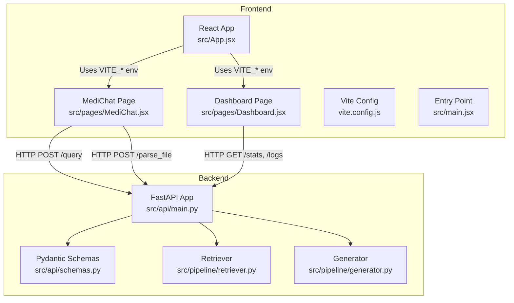
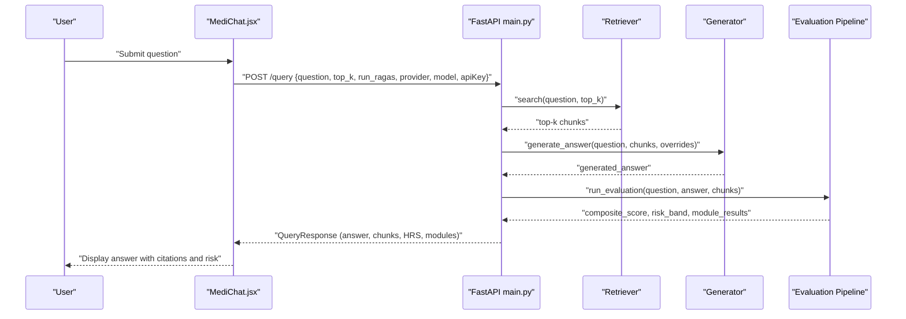
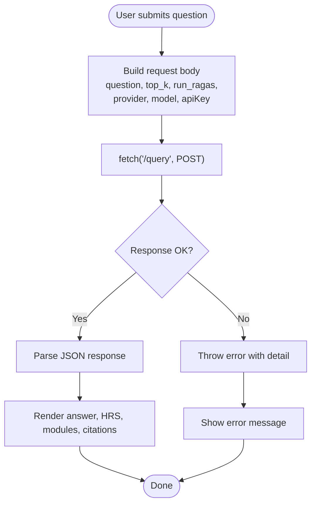
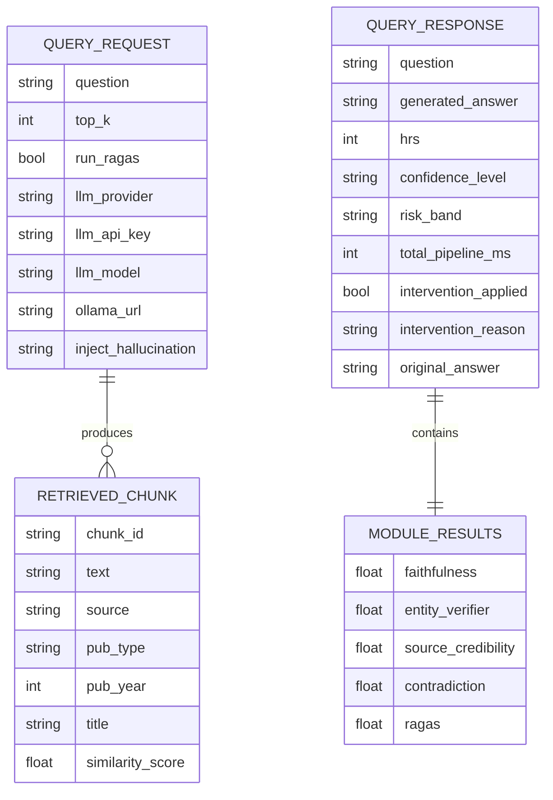
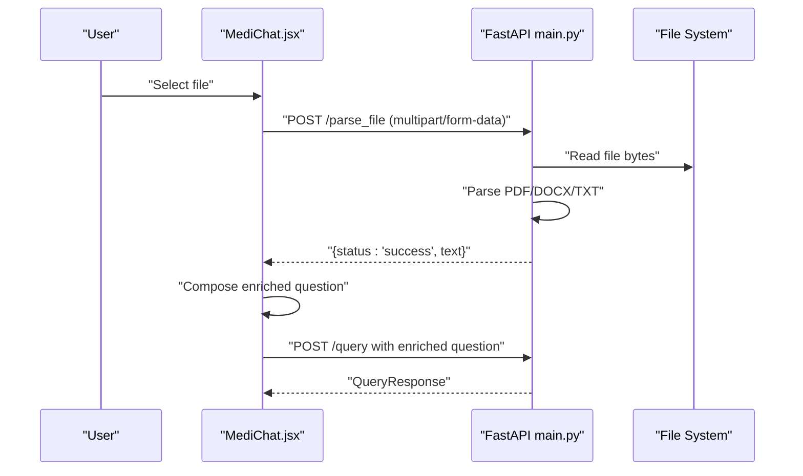
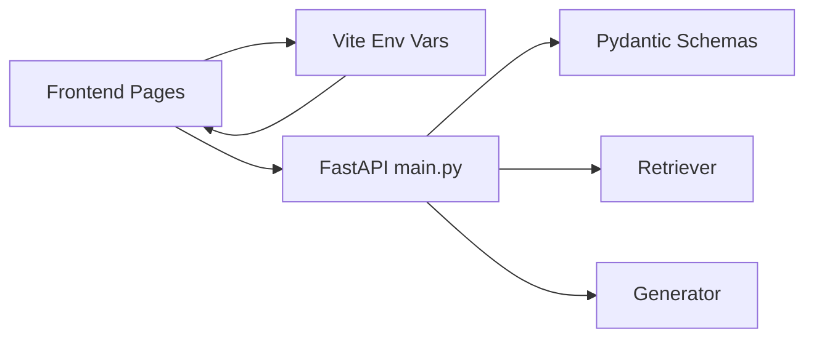

# API Integration Patterns

<cite>
**Referenced Files in This Document**
- [README.md](file://README.md)
- [Backend README.md](file://Backend/README.md)
- [Backend src/api/main.py](file://Backend/src/api/main.py)
- [Backend src/api/schemas.py](file://Backend/src/api/schemas.py)
- [Backend src/pipeline/retriever.py](file://Backend/src/pipeline/retriever.py)
- [Backend src/pipeline/generator.py](file://Backend/src/pipeline/generator.py)
- [Frontend src/App.jsx](file://Frontend/src/App.jsx)
- [Frontend src/pages/MediChat.jsx](file://Frontend/src/pages/MediChat.jsx)
- [Frontend src/pages/Dashboard.jsx](file://Frontend/src/pages/Dashboard.jsx)
- [Frontend vite.config.js](file://Frontend/vite.config.js)
- [Frontend src/main.jsx](file://Frontend/src/main.jsx)
</cite>

## Table of Contents
1. [Introduction](#introduction)
2. [Project Structure](#project-structure)
3. [Core Components](#core-components)
4. [Architecture Overview](#architecture-overview)
5. [Detailed Component Analysis](#detailed-component-analysis)
6. [Dependency Analysis](#dependency-analysis)
7. [Performance Considerations](#performance-considerations)
8. [Troubleshooting Guide](#troubleshooting-guide)
9. [Conclusion](#conclusion)
10. [Appendices](#appendices)

## Introduction
This document explains the API integration patterns and backend communication strategies implemented in the project. It covers:
- REST API client usage in the frontend with environment-driven configuration
- Backend endpoints for evaluation, query, ingestion, parsing, and dashboard metrics
- Authentication considerations and session persistence
- Real-time data synchronization patterns for live updates
- File upload integration with progress tracking and document processing
- Error handling, loading states, and graceful degradation
- Retry mechanisms, timeouts, and offline considerations
- Extending API integrations and adding new service endpoints
- Security considerations, CORS handling, and API versioning strategies

## Project Structure
The project consists of:
- Backend (FastAPI) exposing REST endpoints for evaluation, querying, ingestion, and dashboard metrics
- Frontend (React + Vite) consuming the backend via environment-configured endpoints
- Shared request/response schemas defined in the backend and consumed by the frontend

**Diagram sources**
- [Backend src/api/main.py:156-173](file://Backend/src/api/main.py#L156-L173)
- [Backend src/api/schemas.py:1-232](file://Backend/src/api/schemas.py#L1-L232)
- [Backend src/pipeline/retriever.py:1-287](file://Backend/src/pipeline/retriever.py#L1-L287)
- [Backend src/pipeline/generator.py:1-462](file://Backend/src/pipeline/generator.py#L1-L462)
- [Frontend src/App.jsx:1-4](file://Frontend/src/App.jsx#L1-L4)
- [Frontend src/pages/MediChat.jsx:386-438](file://Frontend/src/pages/MediChat.jsx#L386-L438)
- [Frontend src/pages/Dashboard.jsx:35-56](file://Frontend/src/pages/Dashboard.jsx#L35-L56)
- [Frontend vite.config.js:1-8](file://Frontend/vite.config.js#L1-L8)
- [Frontend src/main.jsx:1-14](file://Frontend/src/main.jsx#L1-L14)

**Section sources**
- [README.md:1-107](file://README.md#L1-L107)
- [Backend README.md:1-3](file://Backend/README.md#L1-L3)
- [Frontend vite.config.js:1-8](file://Frontend/vite.config.js#L1-L8)
- [Frontend src/main.jsx:1-14](file://Frontend/src/main.jsx#L1-L14)

## Core Components
- REST API client in the frontend:
  - Environment-driven base URL and API keys
  - Chat interactions via POST /query and file parsing via POST /parse_file
  - Dashboard polling via GET /stats and GET /logs
- Backend API:
  - Health check, evaluation, query, ingestion, and parsing endpoints
  - Pydantic models for request/response validation
  - Hybrid retriever and LLM generator modules
- CORS policy configured for development

**Section sources**
- [Frontend src/App.jsx:1-4](file://Frontend/src/App.jsx#L1-L4)
- [Frontend src/pages/MediChat.jsx:386-438](file://Frontend/src/pages/MediChat.jsx#L386-L438)
- [Frontend src/pages/Dashboard.jsx:35-56](file://Frontend/src/pages/Dashboard.jsx#L35-L56)
- [Backend src/api/main.py:156-173](file://Backend/src/api/main.py#L156-L173)
- [Backend src/api/schemas.py:1-232](file://Backend/src/api/schemas.py#L1-L232)

## Architecture Overview
The frontend communicates with the backend through REST endpoints. The backend orchestrates retrieval, generation, and evaluation, returning structured results with safety scoring and citations.

**Diagram sources**
- [Backend src/api/main.py:308-519](file://Backend/src/api/main.py#L308-L519)
- [Backend src/pipeline/retriever.py:149-250](file://Backend/src/pipeline/retriever.py#L149-L250)
- [Backend src/pipeline/generator.py:344-462](file://Backend/src/pipeline/generator.py#L344-L462)

## Detailed Component Analysis

### REST API Client in Frontend
- Environment configuration:
  - Base URL and API keys are read from Vite environment variables
- Chat interactions:
  - POST /query sends the question and optional document enrichment
  - POST /parse_file uploads a file and returns extracted text
- Dashboard:
  - GET /stats and GET /logs are polled periodically for live metrics

**Diagram sources**
- [Frontend src/pages/MediChat.jsx:366-438](file://Frontend/src/pages/MediChat.jsx#L366-L438)

**Section sources**
- [Frontend src/App.jsx:1-4](file://Frontend/src/App.jsx#L1-L4)
- [Frontend src/pages/MediChat.jsx:386-438](file://Frontend/src/pages/MediChat.jsx#L386-L438)
- [Frontend src/pages/Dashboard.jsx:35-56](file://Frontend/src/pages/Dashboard.jsx#L35-L56)

### Backend Endpoints and Schemas
- Endpoints:
  - GET /health: liveness and dependency status
  - POST /evaluate: evaluate a given answer against context chunks
  - POST /query: end-to-end pipeline (retrieve → generate → evaluate)
  - POST /ingest: dynamically append documents to FAISS index
  - GET /logs and GET /stats: dashboard metrics
  - POST /parse_file: extract text from PDF/DOCX/TXT
- Schemas:
  - Pydantic models define request/response contracts for validation and documentation

**Diagram sources**
- [Backend src/api/schemas.py:146-231](file://Backend/src/api/schemas.py#L146-L231)

**Section sources**
- [Backend src/api/main.py:206-303](file://Backend/src/api/main.py#L206-L303)
- [Backend src/api/main.py:308-519](file://Backend/src/api/main.py#L308-L519)
- [Backend src/api/main.py:526-603](file://Backend/src/api/main.py#L526-L603)
- [Backend src/api/main.py:608-648](file://Backend/src/api/main.py#L608-L648)
- [Backend src/api/main.py:653-677](file://Backend/src/api/main.py#L653-L677)
- [Backend src/api/schemas.py:146-231](file://Backend/src/api/schemas.py#L146-L231)

### Authentication Flow and Session Persistence
- Current implementation:
  - API keys are passed per request to the backend for provider access
  - No JWT token management or session persistence is implemented in the frontend
- Recommendations:
  - Introduce a centralized auth service for token acquisition and refresh
  - Persist tokens securely (e.g., HttpOnly cookies or secure storage)
  - Implement automatic refresh and silent re-authentication
  - Centralize API key handling and remove per-request exposure where possible

[No sources needed since this section provides general guidance]

### Real-Time Data Synchronization Patterns
- Live dashboard updates:
  - Periodic polling of GET /stats and GET /logs every 10 seconds
  - IntersectionObserver-based reveal animations for incremental rendering
- Chat updates:
  - Immediate response after /query completes
  - No WebSocket or server-sent events are implemented
- Recommendations:
  - Use Server-Sent Events (SSE) or WebSockets for live logs and metrics
  - Debounce frequent polling and implement exponential backoff
  - Add optimistic UI updates with conflict resolution

**Section sources**
- [Frontend src/pages/Dashboard.jsx:35-56](file://Frontend/src/pages/Dashboard.jsx#L35-L56)

### File Upload Integration and Medical Document Processing
- Upload flow:
  - File selection triggers POST /parse_file with multipart/form-data
  - Backend extracts text from PDF/DOCX/TXT and returns parsed text
  - Frontend composes an enriched question incorporating document content
- Recommendations:
  - Implement progress tracking for large files
  - Support chunked uploads for very large documents
  - Validate file types and sizes on both frontend and backend
  - Sanitize and normalize extracted text before ingestion

**Diagram sources**
- [Frontend src/pages/MediChat.jsx:755-800](file://Frontend/src/pages/MediChat.jsx#L755-L800)
- [Backend src/api/main.py:653-677](file://Backend/src/api/main.py#L653-L677)
- [Backend src/api/main.py:386-407](file://Backend/src/api/main.py#L386-L407)

**Section sources**
- [Frontend src/pages/MediChat.jsx:755-800](file://Frontend/src/pages/MediChat.jsx#L755-L800)
- [Backend src/api/main.py:653-677](file://Backend/src/api/main.py#L653-L677)

### Error Handling, Loading States, and Graceful Degradation
- Frontend:
  - Catch and display API errors with user-friendly messages
  - Show “thinking” indicators during requests
  - Fallback UI when FAISS index is unavailable
- Backend:
  - Validation via Pydantic; partial results on module failures
  - Safe fallbacks for optional modules (e.g., RAGAS)
- Recommendations:
  - Implement centralized error boundaries and toast notifications
  - Add retry with exponential backoff for transient failures
  - Provide offline mode with cached responses and queued actions

**Section sources**
- [Frontend src/pages/MediChat.jsx:426-438](file://Frontend/src/pages/MediChat.jsx#L426-L438)
- [Backend src/api/main.py:256-262](file://Backend/src/api/main.py#L256-L262)
- [Backend src/api/main.py:407-411](file://Backend/src/api/main.py#L407-L411)

### Retry Mechanisms, Timeouts, and Offline Capability
- Current:
  - No explicit retry logic in frontend
  - Timeout handling depends on underlying fetch behavior
- Recommendations:
  - Implement retry with jitter for transient network errors
  - Configure request timeouts per endpoint
  - Add offline capability using service workers and IndexedDB for caching

[No sources needed since this section provides general guidance]

### Extending API Integrations and New Endpoints
- Steps to add a new endpoint:
  - Define Pydantic models in schemas.py
  - Implement handler in main.py with proper validation and error handling
  - Add frontend integration with environment configuration
- Example extension points:
  - User preferences endpoint
  - Batch evaluation endpoint
  - Export audit logs

**Section sources**
- [Backend src/api/schemas.py:1-232](file://Backend/src/api/schemas.py#L1-L232)
- [Backend src/api/main.py:156-173](file://Backend/src/api/main.py#L156-L173)

### Security Considerations, CORS, and API Versioning
- CORS:
  - Middleware allows all origins for local development
  - Restrict origins in production environments
- API versioning:
  - FastAPI app defines version "0.1.0"
  - Consider URL-versioned endpoints or Accept-Version headers
- Secrets management:
  - Avoid embedding API keys in frontend bundles
  - Use backend proxy or signed requests for sensitive operations

**Section sources**
- [Backend src/api/main.py:167-173](file://Backend/src/api/main.py#L167-L173)
- [Backend src/api/main.py:156-165](file://Backend/src/api/main.py#L156-L165)

## Dependency Analysis
The frontend depends on environment variables for backend URLs and keys. The backend orchestrates retrieval, generation, and evaluation modules.

**Diagram sources**
- [Frontend src/App.jsx:1-4](file://Frontend/src/App.jsx#L1-L4)
- [Backend src/api/main.py:156-173](file://Backend/src/api/main.py#L156-L173)
- [Backend src/api/schemas.py:1-232](file://Backend/src/api/schemas.py#L1-L232)
- [Backend src/pipeline/retriever.py:1-287](file://Backend/src/pipeline/retriever.py#L1-L287)
- [Backend src/pipeline/generator.py:1-462](file://Backend/src/pipeline/generator.py#L1-L462)

**Section sources**
- [Frontend src/App.jsx:1-4](file://Frontend/src/App.jsx#L1-L4)
- [Backend src/api/main.py:156-173](file://Backend/src/api/main.py#L156-L173)

## Performance Considerations
- Hybrid retrieval (FAISS + BM25) improves precision and recall
- Pre-warming models at startup reduces cold-start latency
- Thread-safe ingestion with atomic writes prevents corruption
- Recommendations:
  - Tune top_k and provider settings per use case
  - Cache frequently accessed prompts and metadata
  - Monitor latency and apply circuit breakers for downstream services

[No sources needed since this section provides general guidance]

## Troubleshooting Guide
- Backend not reachable:
  - Verify port and host binding; check CORS configuration
- Ollama/Gemini/OpenAI unresponsive:
  - Confirm API keys and provider availability
- FAISS index missing:
  - Ensure index and metadata are built and accessible
- Dashboard shows no data:
  - Confirm database initialization and periodic polling

**Section sources**
- [Backend src/api/main.py:179-186](file://Backend/src/api/main.py#L179-L186)
- [Backend src/api/main.py:336-343](file://Backend/src/api/main.py#L336-L343)
- [Backend src/api/main.py:537-540](file://Backend/src/api/main.py#L537-L540)
- [Frontend src/pages/Dashboard.jsx:35-56](file://Frontend/src/pages/Dashboard.jsx#L35-L56)

## Conclusion
The project demonstrates a clear separation between frontend and backend, with robust request/response schemas and modular retrieval and generation components. To enhance production readiness, integrate centralized authentication, implement real-time updates, add retry and offline capabilities, and harden security configurations.

[No sources needed since this section summarizes without analyzing specific files]

## Appendices
- Environment variables used:
  - VITE_API_BASE_URL for backend base URL
  - VITE_MISTRAL_API_KEY for provider-specific keys in chat panel
- Quick start commands:
  - Backend: uvicorn src.api.main:app --reload --host 0.0.0.0 --port 8000
  - Frontend: npm run dev

**Section sources**
- [Frontend src/App.jsx:1-4](file://Frontend/src/App.jsx#L1-L4)
- [Frontend src/pages/MediChat.jsx:331-339](file://Frontend/src/pages/MediChat.jsx#L331-L339)
- [README.md:62-76](file://README.md#L62-L76)