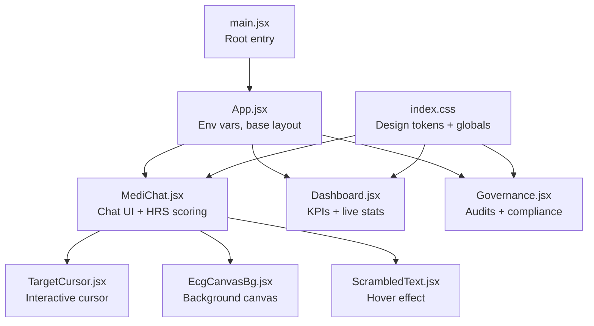
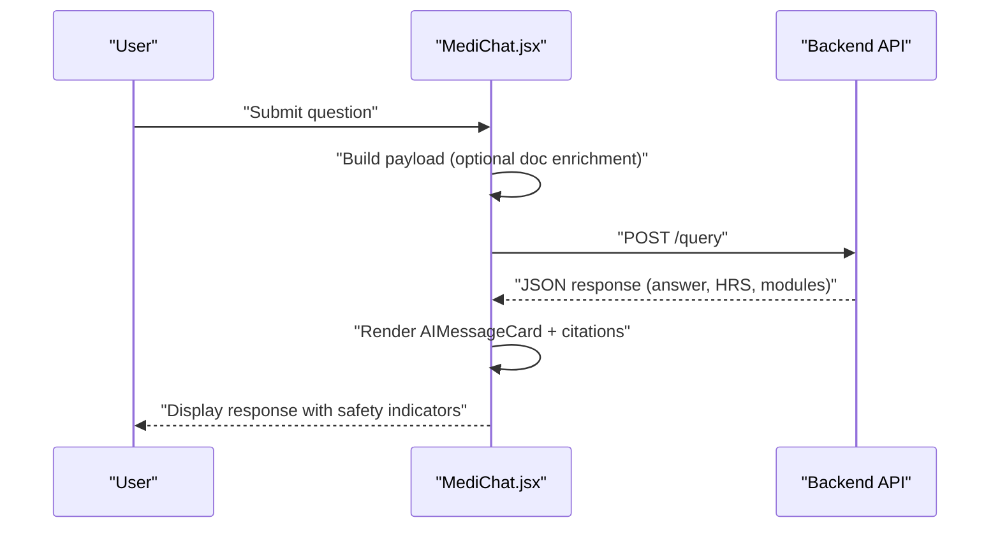
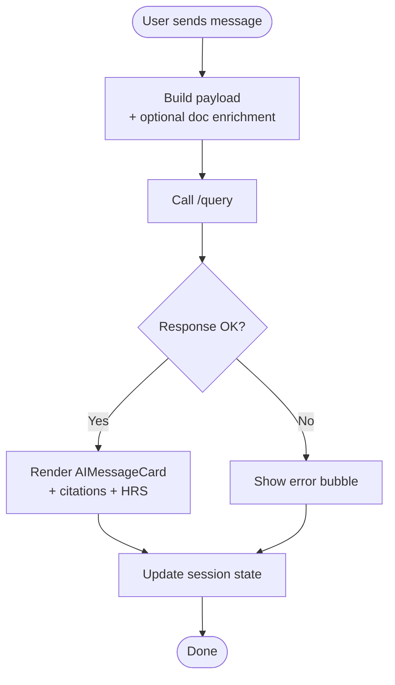
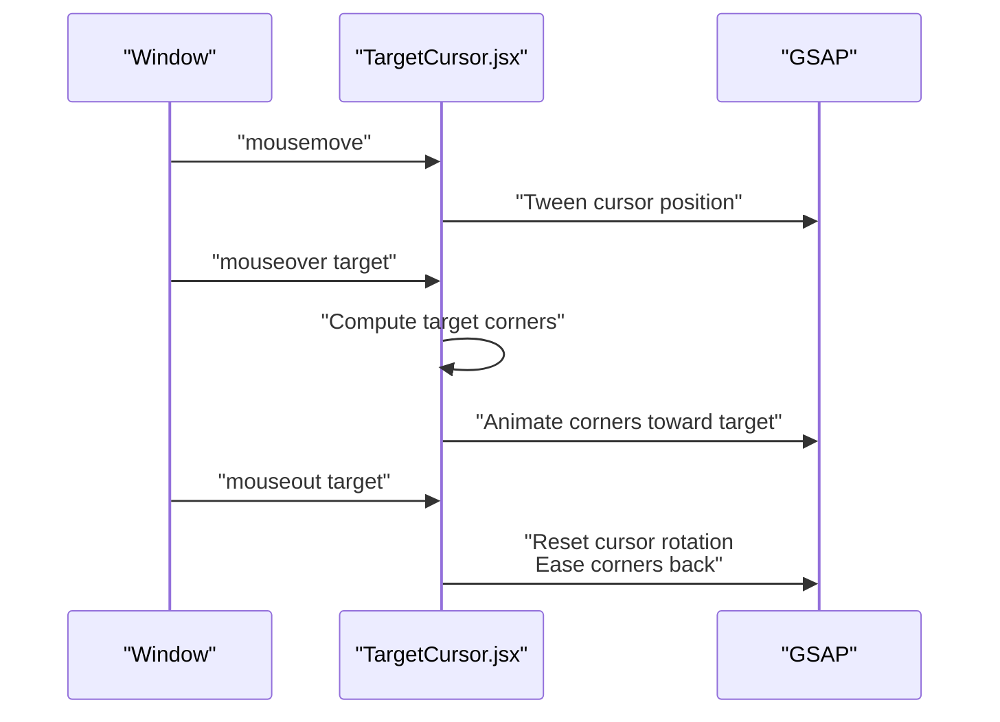
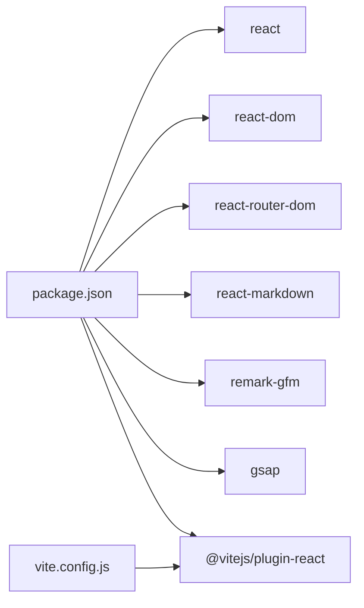

# Frontend Application

<cite>
**Referenced Files in This Document**
- [main.jsx](file://Frontend/src/main.jsx)
- [App.jsx](file://Frontend/src/App.jsx)
- [MediChat.jsx](file://Frontend/src/pages/MediChat.jsx)
- [MediChat.css](file://Frontend/src/pages/MediChat.css)
- [TargetCursor.jsx](file://Frontend/src/components/TargetCursor.jsx)
- [EcgCanvasBg.jsx](file://Frontend/src/components/EcgCanvasBg.jsx)
- [ScrambledText.jsx](file://Frontend/src/components/ScrambledText.jsx)
- [Dashboard.jsx](file://Frontend/src/pages/Dashboard.jsx)
- [Dashboard.css](file://Frontend/src/pages/Dashboard.css)
- [Governance.jsx](file://Frontend/src/pages/Governance.jsx)
- [Governance.css](file://Frontend/src/pages/Governance.css)
- [index.css](file://Frontend/src/index.css)
- [package.json](file://Frontend/package.json)
- [vite.config.js](file://Frontend/vite.config.js)
</cite>

## Table of Contents
1. [Introduction](#introduction)
2. [Project Structure](#project-structure)
3. [Core Components](#core-components)
4. [Architecture Overview](#architecture-overview)
5. [Detailed Component Analysis](#detailed-component-analysis)
6. [Dependency Analysis](#dependency-analysis)
7. [Performance Considerations](#performance-considerations)
8. [Troubleshooting Guide](#troubleshooting-guide)
9. [Conclusion](#conclusion)
10. [Appendices](#appendices)

## Introduction
This document describes the MediRAG 3.0 frontend application, a React-based interface implementing a clinical AI assistant with real-time safety scoring, document ingestion, smart suggestions, and governance dashboards. It covers component hierarchy, state management, interactive features (including the target-lock cursor), design system, responsiveness, accessibility, backend integration, and extension guidelines.

## Project Structure
The frontend is a Vite-powered React application bootstrapped with React Router. Key areas:
- Pages: MediChat, Dashboard, Governance, and others
- Components: TargetCursor, EcgCanvasBg, ScrambledText, and shared UI elements
- Styling: Global design tokens, glassmorphism-inspired theme, and page-specific CSS
- Routing: BrowserRouter wraps the app; pages are rendered via route configuration

**Diagram sources**
- [main.jsx:1-14](file://Frontend/src/main.jsx#L1-L14)
- [App.jsx:1-4](file://Frontend/src/App.jsx#L1-L4)
- [MediChat.jsx:1-843](file://Frontend/src/pages/MediChat.jsx#L1-L843)
- [Dashboard.jsx:1-232](file://Frontend/src/pages/Dashboard.jsx#L1-L232)
- [Governance.jsx:1-428](file://Frontend/src/pages/Governance.jsx#L1-L428)
- [TargetCursor.jsx:1-307](file://Frontend/src/components/TargetCursor.jsx#L1-L307)
- [EcgCanvasBg.jsx:1-130](file://Frontend/src/components/EcgCanvasBg.jsx#L1-L130)
- [ScrambledText.jsx:1-97](file://Frontend/src/components/ScrambledText.jsx#L1-L97)
- [index.css:1-800](file://Frontend/src/index.css#L1-L800)

**Section sources**
- [main.jsx:1-14](file://Frontend/src/main.jsx#L1-L14)
- [App.jsx:1-4](file://Frontend/src/App.jsx#L1-L4)
- [package.json:1-32](file://Frontend/package.json#L1-L32)
- [vite.config.js:1-8](file://Frontend/vite.config.js#L1-L8)

## Core Components
- MediChat: Main chat interface with session management, document upload, smart suggestions, and safety cards displaying HRS and module scores.
- Dashboard: Live KPIs, average HRS, critical alerts, interventions, and recent evaluations.
- Governance: Audit log, risk trends, module failure breakdown, and compliance report generation.
- TargetCursor: Custom animated cursor with spinning crosshairs and snapping to interactive targets.
- EcgCanvasBg: Animated background featuring a grid and ECG waveform with particle motion.
- ScrambledText: Hover-triggered scrambling effect for text nodes.

**Section sources**
- [MediChat.jsx:1-843](file://Frontend/src/pages/MediChat.jsx#L1-L843)
- [Dashboard.jsx:1-232](file://Frontend/src/pages/Dashboard.jsx#L1-L232)
- [Governance.jsx:1-428](file://Frontend/src/pages/Governance.jsx#L1-L428)
- [TargetCursor.jsx:1-307](file://Frontend/src/components/TargetCursor.jsx#L1-L307)
- [EcgCanvasBg.jsx:1-130](file://Frontend/src/components/EcgCanvasBg.jsx#L1-L130)
- [ScrambledText.jsx:1-97](file://Frontend/src/components/ScrambledText.jsx#L1-L97)

## Architecture Overview
The app uses React with functional components and hooks. State is managed locally within pages and components. Routing is handled by React Router. Styling relies on CSS modules and global variables for a cohesive design system. Backend integration is performed via fetch to a configurable API base URL.

**Diagram sources**
- [MediChat.jsx:366-438](file://Frontend/src/pages/MediChat.jsx#L366-L438)

**Section sources**
- [MediChat.jsx:321-438](file://Frontend/src/pages/MediChat.jsx#L321-L438)
- [App.jsx:1-4](file://Frontend/src/App.jsx#L1-L4)

## Detailed Component Analysis

### MediChat: Main Chat Interface
Responsibilities:
- Session lifecycle (create/load)
- Message rendering (user/bot/suggestions)
- Document upload and enrichment
- Real-time HRS scoring and module evaluation display
- Smart suggestions based on document content
- Backend integration via fetch

Key UI elements:
- Sidebar with recent chats, popular topics, and evaluation engine controls
- Chat window with welcome screen, message bubbles, and AI response cards
- Input area with send button and action chips

Safety and evaluation:
- HRS gauge with color-coded risk bands
- Module score pills (faithfulness, source credibility, consistency, entity accuracy)
- Citation panel with relevance bars and source metadata

Document ingestion:
- File upload handler enriches queries with document text
- Generates contextual suggestions post-upload

**Diagram sources**
- [MediChat.jsx:366-438](file://Frontend/src/pages/MediChat.jsx#L366-L438)

**Section sources**
- [MediChat.jsx:1-843](file://Frontend/src/pages/MediChat.jsx#L1-L843)
- [MediChat.css:1-506](file://Frontend/src/pages/MediChat.css#L1-L506)

### Dashboard: Live Monitoring
Responsibilities:
- Fetch live stats and recent logs
- Display KPIs: total evaluations, average HRS, critical alerts, interventions
- Module score comparison bars
- Recent evaluations table with risk bands and timestamps

Integration:
- Uses a polling interval to refresh data periodically

**Section sources**
- [Dashboard.jsx:1-232](file://Frontend/src/pages/Dashboard.jsx#L1-L232)
- [Dashboard.css:1-404](file://Frontend/src/pages/Dashboard.css#L1-L404)

### Governance: Audit and Compliance
Responsibilities:
- Dashboard tab: KPIs, HRS trend chart, module failure breakdown, recent critical flags
- Audit log tab: searchable, filterable table with export capability
- Compliance report tab: configurable report generation with progress indicator

UI patterns:
- Tabbed interface with pill navigation
- Drawer overlay for record detail
- Progress bar and report preview

**Section sources**
- [Governance.jsx:1-428](file://Frontend/src/pages/Governance.jsx#L1-L428)
- [Governance.css:1-566](file://Frontend/src/pages/Governance.css#L1-L566)

### Target Cursor: Interactive Cursor
Features:
- Spinning crosshair animation
- Snapping to interactive targets (buttons, links) with corner indicators
- Parallax movement and hover animations
- Mouse press scaling and release restoration
- Automatic cleanup and event removal

Implementation highlights:
- GSAP timelines for smooth animations
- Mousemove tracking and intersection detection
- Per-element leave handlers to reset states
- Mobile detection to disable custom cursor

**Diagram sources**
- [TargetCursor.jsx:33-265](file://Frontend/src/components/TargetCursor.jsx#L33-L265)

**Section sources**
- [TargetCursor.jsx:1-307](file://Frontend/src/components/TargetCursor.jsx#L1-L307)

### ECG Canvas Background: Animated Background
Features:
- Responsive canvas sizing
- Grid overlay and ECG waveform drawing
- Particle system with boundary wrapping
- Smooth animation loop using requestAnimationFrame

Usage:
- Renders behind page content for immersive visuals

**Section sources**
- [EcgCanvasBg.jsx:1-130](file://Frontend/src/components/EcgCanvasBg.jsx#L1-L130)

### Scrambled Text: Hover Effect
Features:
- Per-character scrambling within a radius
- Random character replacement with bounded iterations
- Resets characters to original after animation

Use cases:
- Hover-triggered scrambling for emphasis or feedback

**Section sources**
- [ScrambledText.jsx:1-97](file://Frontend/src/components/ScrambledText.jsx#L1-L97)

## Dependency Analysis
External libraries:
- gsap: animation orchestration for cursor and text effects
- react, react-dom: UI framework
- react-router-dom: routing
- react-markdown + remark-gfm: markdown rendering

Build and tooling:
- vite: bundler and dev server
- @vitejs/plugin-react: JSX transform

**Diagram sources**
- [package.json:12-30](file://Frontend/package.json#L12-L30)
- [vite.config.js:1-8](file://Frontend/vite.config.js#L1-L8)

**Section sources**
- [package.json:1-32](file://Frontend/package.json#L1-L32)
- [vite.config.js:1-8](file://Frontend/vite.config.js#L1-L8)

## Performance Considerations
- Animation performance:
  - Prefer GSAP for GPU-accelerated tweens (cursor, text scrambling)
  - Limit DOM reads/writes inside tight loops; batch updates
- Rendering:
  - Memoize expensive computations (e.g., module scores) with useMemo/useCallback
  - Virtualize long lists (audit log) if growth continues
- Network:
  - Debounce frequent inputs before sending requests
  - Cache recent responses where appropriate
- Canvas:
  - Cancel animation frames on unmount (already handled)
  - Use efficient drawing routines (single pass per frame)

## Troubleshooting Guide
Common issues and remedies:
- API connectivity:
  - Verify VITE_API_BASE_URL is set and reachable
  - Check network tab for CORS errors
- Chat errors:
  - Inspect error bubbles for detailed messages
  - Confirm API keys and providers are configured
- Cursor not appearing:
  - Ensure hideDefaultCursor is enabled and not blocked by browser policies
  - Check for mobile device detection disabling cursor
- Dashboard not updating:
  - Confirm polling intervals and network availability
  - Validate backend endpoints for stats/logs

**Section sources**
- [MediChat.jsx:426-438](file://Frontend/src/pages/MediChat.jsx#L426-L438)
- [TargetCursor.jsx:267-265](file://Frontend/src/components/TargetCursor.jsx#L267-L265)
- [Dashboard.jsx:35-56](file://Frontend/src/pages/Dashboard.jsx#L35-L56)

## Conclusion
MediRAG 3.0’s frontend combines a modern React architecture with rich interactive elements and a cohesive glassmorphism design system. The MediChat interface integrates real-time safety scoring and document-aware suggestions, while Dashboard and Governance provide operational insights and compliance workflows. The target-lock cursor and animated background enhance immersion, and the modular component design supports future extensions.

## Appendices

### Design System and Theming
- Design tokens:
  - Colors: accents (green, amber, orange, red), backgrounds, gradients
  - Typography: Inter (sans), IBM Plex Mono (mono)
  - Layout: radii, transitions, max widths
- Glassmorphism:
  - Backdrop blur, semi-transparent cards, subtle borders
- Responsive breakpoints:
  - Grid adjustments for KPIs and charts
  - Mobile-friendly navigation and overlays

**Section sources**
- [index.css:6-49](file://Frontend/src/index.css#L6-L49)
- [Dashboard.css:395-404](file://Frontend/src/pages/Dashboard.css#L395-L404)
- [Governance.css:1-12](file://Frontend/src/pages/Governance.css#L1-L12)

### Accessibility Notes
- Focus management:
  - Buttons and inputs should receive visible focus rings
- Color contrast:
  - Ensure sufficient contrast for risk bands and badges
- Keyboard navigation:
  - Interactive elements should be operable via keyboard
- ARIA:
  - Add roles and labels for complex widgets (tables, drawers)

### Extending the Interface
- New pages:
  - Create a new page component and add a route in the router
- Reusable components:
  - Place shared UI elements under components/ and export defaults
- Styling:
  - Add new CSS modules or extend existing ones; use design tokens
- Backend integrations:
  - Centralize API URLs in App.jsx; pass as props or via context
- State management:
  - Keep local state in pages/components; consider a lightweight context for shared preferences