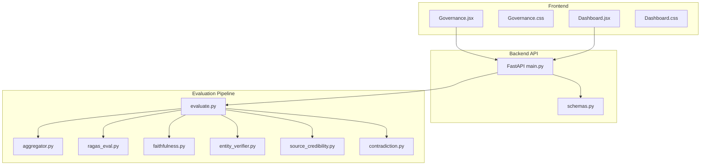
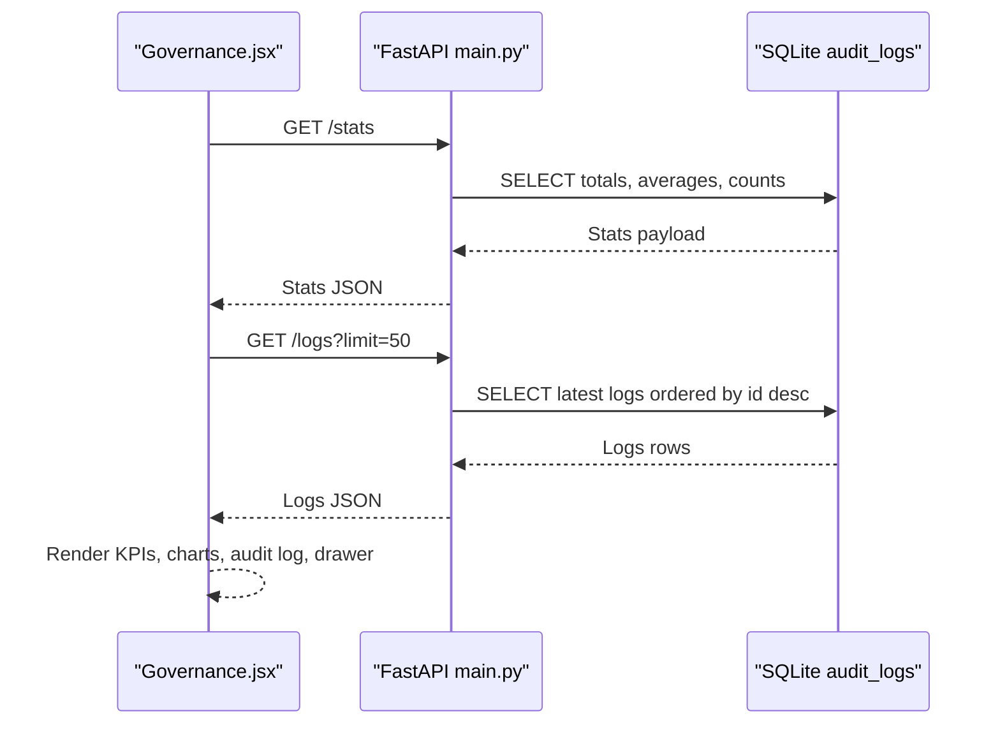
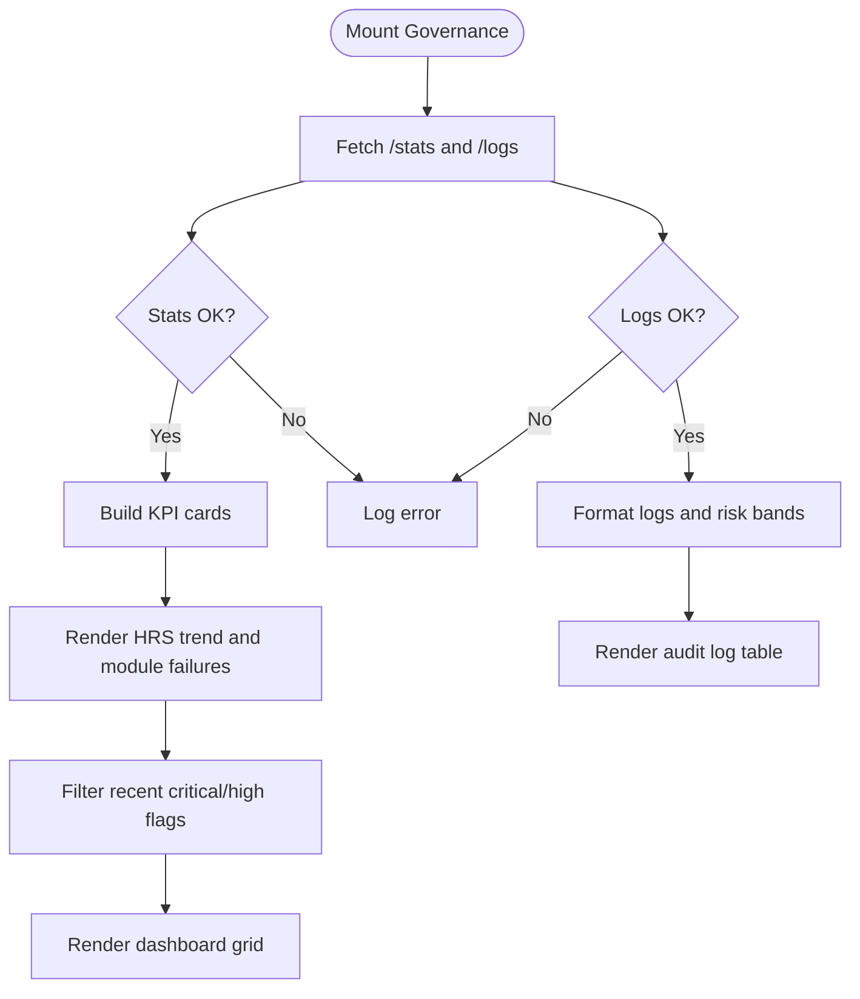
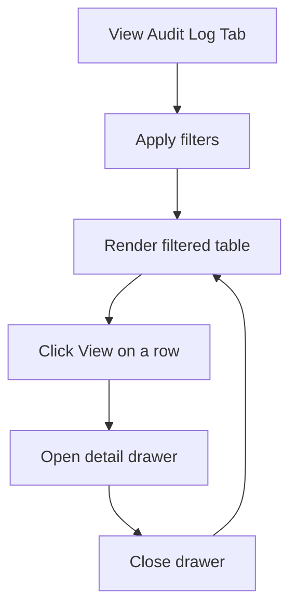
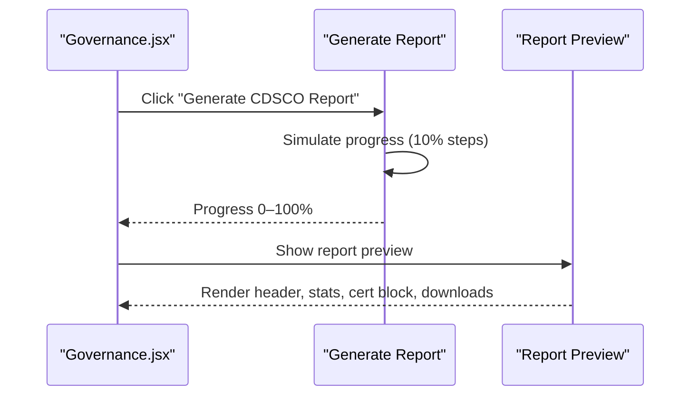
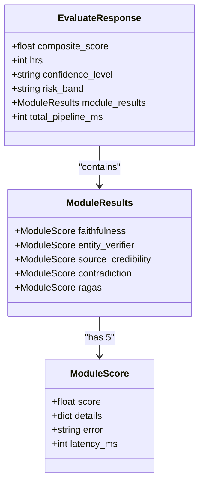
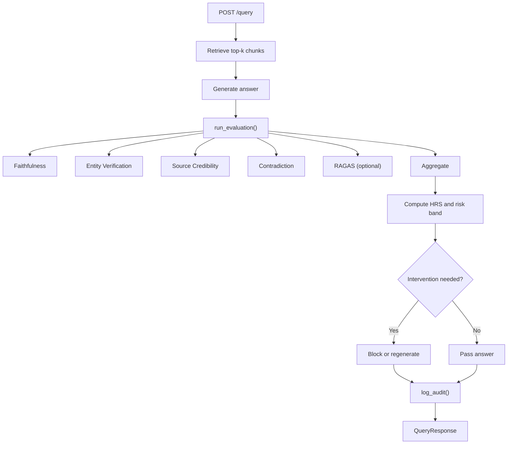
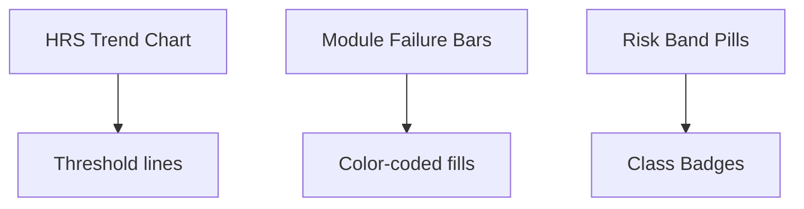
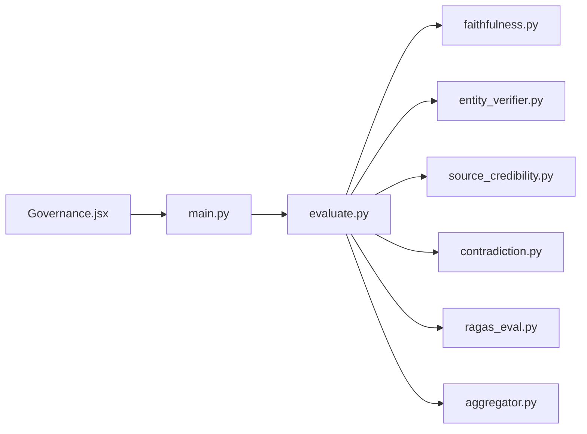

# Governance Dashboard

<cite>
**Referenced Files in This Document**
- [Governance.jsx](file://Frontend/src/pages/Governance.jsx)
- [Governance.css](file://Frontend/src/pages/Governance.css)
- [Dashboard.jsx](file://Frontend/src/pages/Dashboard.jsx)
- [Dashboard.css](file://Frontend/src/pages/Dashboard.css)
- [main.py](file://Backend/src/api/main.py)
- [aggregator.py](file://Backend/src/evaluation/aggregator.py)
- [ragas_eval.py](file://Backend/src/evaluation/ragas_eval.py)
- [faithfulness.py](file://Backend/src/modules/faithfulness.py)
- [entity_verifier.py](file://Backend/src/modules/entity_verifier.py)
- [source_credibility.py](file://Backend/src/modules/source_credibility.py)
- [contradiction.py](file://Backend/src/modules/contradiction.py)
- [evaluate.py](file://Backend/src/evaluate.py)
- [schemas.py](file://Backend/src/api/schemas.py)
</cite>

## Table of Contents
1. [Introduction](#introduction)
2. [Project Structure](#project-structure)
3. [Core Components](#core-components)
4. [Architecture Overview](#architecture-overview)
5. [Detailed Component Analysis](#detailed-component-analysis)
6. [Dependency Analysis](#dependency-analysis)
7. [Performance Considerations](#performance-considerations)
8. [Troubleshooting Guide](#troubleshooting-guide)
9. [Conclusion](#conclusion)
10. [Appendices](#appendices)

## Introduction
This document describes the governance dashboard interface designed for compliance monitoring and safety evaluation analytics. It covers the dashboard layout with real-time metrics, audit log visualization, and compliance statistics; the evaluation results presentation with risk scoring breakdowns and safety assessment summaries; governance reporting features including policy compliance tracking and regulatory adherence metrics; data visualization components for trends and performance indicators; filtering and export capabilities; and user role management and administrative functions. It also provides examples for customizing dashboard widgets and integrating additional compliance metrics.

## Project Structure
The governance dashboard spans a React frontend and a Python FastAPI backend:
- Frontend pages: Governance dashboard and a companion evaluation dashboard
- Backend API: endpoints for live stats and audit logs, plus the evaluation pipeline that produces the data
- Evaluation modules: Faithfulness, Entity Verification, Source Credibility, Contradiction, and optional RAGAS
- Aggregation: Weighted composite score and risk band mapping

**Diagram sources**
- [Governance.jsx:1-428](file://Frontend/src/pages/Governance.jsx#L1-L428)
- [Governance.css:1-566](file://Frontend/src/pages/Governance.css#L1-L566)
- [Dashboard.jsx:1-232](file://Frontend/src/pages/Dashboard.jsx#L1-L232)
- [Dashboard.css:1-404](file://Frontend/src/pages/Dashboard.css#L1-L404)
- [main.py:606-649](file://Backend/src/api/main.py#L606-L649)
- [evaluate.py:49-167](file://Backend/src/evaluate.py#L49-L167)
- [aggregator.py:47-167](file://Backend/src/evaluation/aggregator.py#L47-L167)
- [ragas_eval.py:81-178](file://Backend/src/evaluation/ragas_eval.py#L81-L178)
- [faithfulness.py:86-234](file://Backend/src/modules/faithfulness.py#L86-L234)
- [entity_verifier.py:146-283](file://Backend/src/modules/entity_verifier.py#L146-L283)
- [source_credibility.py:121-200](file://Backend/src/modules/source_credibility.py#L121-L200)
- [contradiction.py:94-251](file://Backend/src/modules/contradiction.py#L94-L251)
- [schemas.py:113-232](file://Backend/src/api/schemas.py#L113-L232)

**Section sources**
- [Governance.jsx:1-428](file://Frontend/src/pages/Governance.jsx#L1-L428)
- [Governance.css:1-566](file://Frontend/src/pages/Governance.css#L1-L566)
- [Dashboard.jsx:1-232](file://Frontend/src/pages/Dashboard.jsx#L1-L232)
- [Dashboard.css:1-404](file://Frontend/src/pages/Dashboard.css#L1-L404)
- [main.py:606-649](file://Backend/src/api/main.py#L606-L649)
- [evaluate.py:49-167](file://Backend/src/evaluate.py#L49-L167)

## Core Components
- Governance dashboard tabs: Dashboard, Audit Log, Compliance Report
- Real-time metrics cards: Total Queries Audited, Avg Hallucination Risk Score (HRS), Critical Flags, Safety Interventions
- Audit log table with filters and export
- Compliance report generator with configurable report period and classification
- Detail drawer for reviewing audit records and module risk profiles
- Backend endpoints: /stats and /logs for live metrics and audit trail
- Evaluation pipeline producing composite scores, HRS, risk bands, and module breakdowns

**Section sources**
- [Governance.jsx:4-61](file://Frontend/src/pages/Governance.jsx#L4-L61)
- [Governance.jsx:83-196](file://Frontend/src/pages/Governance.jsx#L83-L196)
- [Governance.jsx:198-260](file://Frontend/src/pages/Governance.jsx#L198-L260)
- [Governance.jsx:262-328](file://Frontend/src/pages/Governance.jsx#L262-L328)
- [main.py:608-648](file://Backend/src/api/main.py#L608-L648)

## Architecture Overview
The governance dashboard retrieves live data from backend endpoints and renders:
- KPI cards and charts for HRS trends and module failure breakdowns
- Audit log table with risk band and module filters
- Compliance report configuration and preview
- Detailed audit record drawer with module risk profile and raw JSON

**Diagram sources**
- [Governance.jsx:17-61](file://Frontend/src/pages/Governance.jsx#L17-L61)
- [main.py:608-648](file://Backend/src/api/main.py#L608-L648)

## Detailed Component Analysis

### Governance Dashboard Layout and Metrics
- Tabs: Dashboard, Audit Log, Compliance Report
- Dashboard grid: Four KPI cards for total audited queries, average HRS, critical flags, and interventions
- Charts: HRS trend line chart with risk thresholds and module failure breakdown bars
- Recent Critical Flags table with “Review” actions
- Real-time updates via periodic polling

**Diagram sources**
- [Governance.jsx:17-61](file://Frontend/src/pages/Governance.jsx#L17-L61)
- [Governance.jsx:83-196](file://Frontend/src/pages/Governance.jsx#L83-L196)

**Section sources**
- [Governance.jsx:4-61](file://Frontend/src/pages/Governance.jsx#L4-L61)
- [Governance.jsx:83-196](file://Frontend/src/pages/Governance.jsx#L83-L196)
- [Governance.css:119-166](file://Frontend/src/pages/Governance.css#L119-L166)

### Audit Log Visualization and Filtering
- Filters: Search, risk band, module, flagged-only toggle, date range
- Export: CSV export button
- Columns: Audit ID, time, query, HRS, risk band, flags, modules failed, class, actions
- Drawer opens on “View” to inspect record details

**Diagram sources**
- [Governance.jsx:198-260](file://Frontend/src/pages/Governance.jsx#L198-L260)
- [Governance.jsx:362-422](file://Frontend/src/pages/Governance.jsx#L362-L422)

**Section sources**
- [Governance.jsx:198-260](file://Frontend/src/pages/Governance.jsx#L198-L260)
- [Governance.jsx:362-422](file://Frontend/src/pages/Governance.jsx#L362-L422)
- [Governance.css:328-384](file://Frontend/src/pages/Governance.css#L328-L384)

### Compliance Reporting Features
- Report configuration: report period dates, SaMD classification (Class B/C), toggles for raw records, fix suggestions, source tiers
- Generate report with progress indicator
- Preview: report header, statistics summary, certification block, download buttons (JSON, CSV, TXT summary)

**Diagram sources**
- [Governance.jsx:262-328](file://Frontend/src/pages/Governance.jsx#L262-L328)

**Section sources**
- [Governance.jsx:262-328](file://Frontend/src/pages/Governance.jsx#L262-L328)
- [Governance.css:436-545](file://Frontend/src/pages/Governance.css#L436-L545)

### Evaluation Results Presentation and Safety Assessments
- Risk scoring: Composite score → HRS → risk band (LOW/MODERATE/HIGH/CRITICAL)
- Module breakdown: Faithfulness, Entities, Sources, Contradiction, optional RAGAS
- Safety gates: Critical block (>85 HRS) and high-risk regeneration (<1.0 faithfulness or ≥40 HRS)
- Drawer detail: Input/output, module risk profile bars, flagged claims, raw JSON

**Diagram sources**
- [schemas.py:113-232](file://Backend/src/api/schemas.py#L113-L232)

**Section sources**
- [schemas.py:113-232](file://Backend/src/api/schemas.py#L113-L232)
- [main.py:223-302](file://Backend/src/api/main.py#L223-L302)
- [main.py:400-520](file://Backend/src/api/main.py#L400-L520)
- [aggregator.py:47-167](file://Backend/src/evaluation/aggregator.py#L47-L167)
- [faithfulness.py:86-234](file://Backend/src/modules/faithfulness.py#L86-L234)
- [entity_verifier.py:146-283](file://Backend/src/modules/entity_verifier.py#L146-L283)
- [source_credibility.py:121-200](file://Backend/src/modules/source_credibility.py#L121-L200)
- [contradiction.py:94-251](file://Backend/src/modules/contradiction.py#L94-L251)
- [ragas_eval.py:81-178](file://Backend/src/evaluation/ragas_eval.py#L81-L178)

### Backend Data Sources and Evaluation Pipeline
- Endpoints:
  - GET /stats: total evaluations, average HRS, critical alerts, interventions, monthly data
  - GET /logs: latest audit logs with risk band, flags, timestamps, details
- Evaluation pipeline:
  - Modules: Faithfulness, Entity Verification, Source Credibility, Contradiction
  - Optional RAGAS (requires LLM backend)
  - Aggregation with weighted composite and risk band mapping
- Safety intervention loop: critical block and high-risk regeneration

**Diagram sources**
- [main.py:308-520](file://Backend/src/api/main.py#L308-L520)
- [evaluate.py:49-167](file://Backend/src/evaluate.py#L49-L167)
- [aggregator.py:47-167](file://Backend/src/evaluation/aggregator.py#L47-L167)

**Section sources**
- [main.py:608-648](file://Backend/src/api/main.py#L608-L648)
- [main.py:223-302](file://Backend/src/api/main.py#L223-L302)
- [main.py:400-520](file://Backend/src/api/main.py#L400-L520)
- [evaluate.py:49-167](file://Backend/src/evaluate.py#L49-L167)

### Data Visualization Components
- HRS Trend Chart: SVG line path with threshold lines for HIGH/MEDIUM risk
- Module Failure Breakdown: Horizontal bars for Faithfulness, Entities, Sources, Contradiction
- Pill badges for risk bands and classifications
- Color-coded KPI values and trend indicators

**Diagram sources**
- [Governance.jsx:104-152](file://Frontend/src/pages/Governance.jsx#L104-L152)
- [Governance.jsx:134-150](file://Frontend/src/pages/Governance.jsx#L134-L150)
- [Governance.css:209-234](file://Frontend/src/pages/Governance.css#L209-L234)
- [Governance.css:298-311](file://Frontend/src/pages/Governance.css#L298-L311)

**Section sources**
- [Governance.jsx:104-152](file://Frontend/src/pages/Governance.jsx#L104-L152)
- [Governance.css:209-234](file://Frontend/src/pages/Governance.css#L209-L234)
- [Governance.css:298-311](file://Frontend/src/pages/Governance.css#L298-L311)

### Filtering and Export Capabilities
- Audit log filters: risk band dropdown, module dropdown, flagged-only checkbox, date range
- Export: CSV export button
- Compliance report: JSON, CSV, TXT summary downloads

**Section sources**
- [Governance.jsx:198-260](file://Frontend/src/pages/Governance.jsx#L198-L260)
- [Governance.jsx:284-328](file://Frontend/src/pages/Governance.jsx#L284-L328)

### User Role Management and Access Controls
- The governance dashboard does not implement user roles or access controls in the frontend.
- Administrative functions (e.g., ingestion, parsing files) are exposed via backend endpoints and can be integrated as needed.

**Section sources**
- [Governance.jsx:1-428](file://Frontend/src/pages/Governance.jsx#L1-L428)
- [main.py:526-604](file://Backend/src/api/main.py#L526-L604)

## Dependency Analysis
- Frontend depends on backend endpoints for live stats and logs
- Backend evaluation pipeline depends on modules and aggregation logic
- Safety intervention logic depends on HRS thresholds and module scores

**Diagram sources**
- [Governance.jsx:17-61](file://Frontend/src/pages/Governance.jsx#L17-L61)
- [main.py:608-648](file://Backend/src/api/main.py#L608-L648)
- [evaluate.py:49-167](file://Backend/src/evaluate.py#L49-L167)
- [aggregator.py:47-167](file://Backend/src/evaluation/aggregator.py#L47-L167)
- [ragas_eval.py:81-178](file://Backend/src/evaluation/ragas_eval.py#L81-L178)
- [faithfulness.py:86-234](file://Backend/src/modules/faithfulness.py#L86-L234)
- [entity_verifier.py:146-283](file://Backend/src/modules/entity_verifier.py#L146-L283)
- [source_credibility.py:121-200](file://Backend/src/modules/source_credibility.py#L121-L200)
- [contradiction.py:94-251](file://Backend/src/modules/contradiction.py#L94-L251)

**Section sources**
- [main.py:608-648](file://Backend/src/api/main.py#L608-L648)
- [evaluate.py:49-167](file://Backend/src/evaluate.py#L49-L167)

## Performance Considerations
- Real-time polling: Dashboard polls endpoints every 15 seconds; adjust intervals based on backend capacity
- Chart rendering: SVG-based trend visualization avoids heavy libraries; keep data sizes reasonable
- Audit log pagination: Use limit parameter to constrain payload size
- Module latency: Composite score includes module latencies; monitor total pipeline time

[No sources needed since this section provides general guidance]

## Troubleshooting Guide
- Dashboard not updating: Verify backend endpoints are reachable and return 200
- Empty audit log: Confirm database exists and contains records; check limit parameter
- Model dependencies missing: If NLI or NER models are unavailable, modules return neutral or stub results
- LLM backend for RAGAS: If unavailable, RAGAS returns neutral score; configure OPENAI_API_KEY or Ollama

**Section sources**
- [main.py:608-648](file://Backend/src/api/main.py#L608-L648)
- [faithfulness.py:107-114](file://Backend/src/modules/faithfulness.py#L107-L114)
- [entity_verifier.py:172-179](file://Backend/src/modules/entity_verifier.py#L172-L179)
- [ragas_eval.py:104-121](file://Backend/src/evaluation/ragas_eval.py#L104-L121)

## Conclusion
The governance dashboard provides a comprehensive, real-time view of safety and compliance metrics, with actionable audit log inspection and configurable compliance reporting. Its modular backend evaluation pipeline ensures robust risk scoring and safety interventions, while the frontend offers intuitive visualizations and export capabilities.

[No sources needed since this section summarizes without analyzing specific files]

## Appendices

### Customizing Dashboard Widgets
- Add new KPI cards: Extend the KPI array with label, value, subtext, trend, and color
- New chart: Render additional SVG or canvas-based charts inside the charts grid
- Module breakdown: Add new rows to the module failure list with label, value, and color
- Drawer detail: Extend the drawer overlay with new sections for additional module insights

**Section sources**
- [Governance.jsx:83-196](file://Frontend/src/pages/Governance.jsx#L83-L196)
- [Governance.jsx:362-422](file://Frontend/src/pages/Governance.jsx#L362-L422)

### Integrating Additional Compliance Metrics
- Add new backend metrics: Extend /stats to include new aggregates and update frontend state
- New audit fields: Add columns to the audit log table and update drawer sections
- Report additions: Include new metrics in the compliance report preview and download options

**Section sources**
- [main.py:621-648](file://Backend/src/api/main.py#L621-L648)
- [Governance.jsx:198-260](file://Frontend/src/pages/Governance.jsx#L198-L260)
- [Governance.jsx:262-328](file://Frontend/src/pages/Governance.jsx#L262-L328)