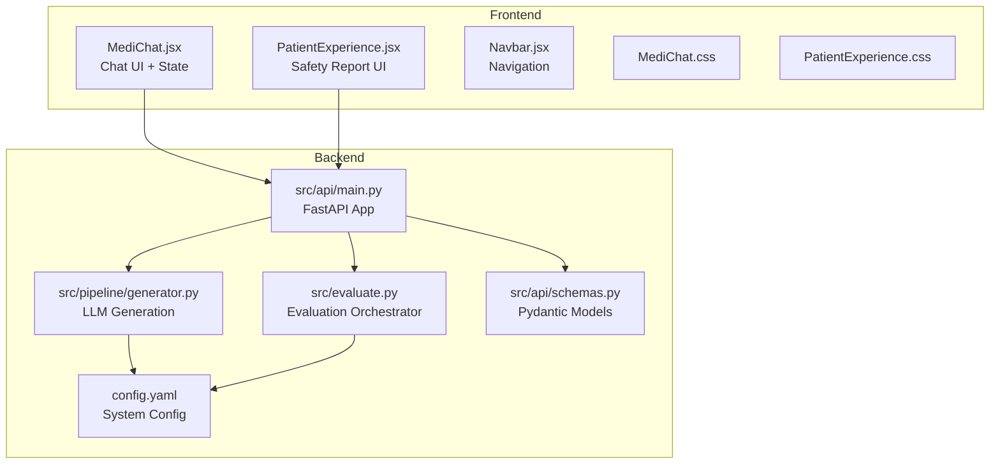
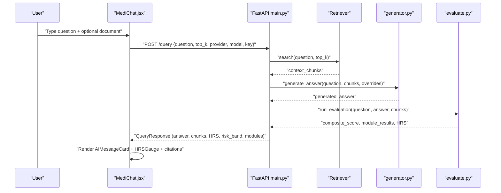
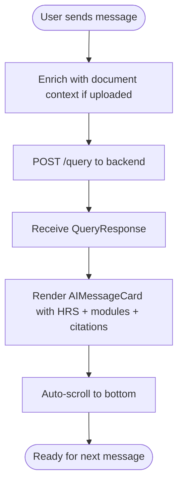
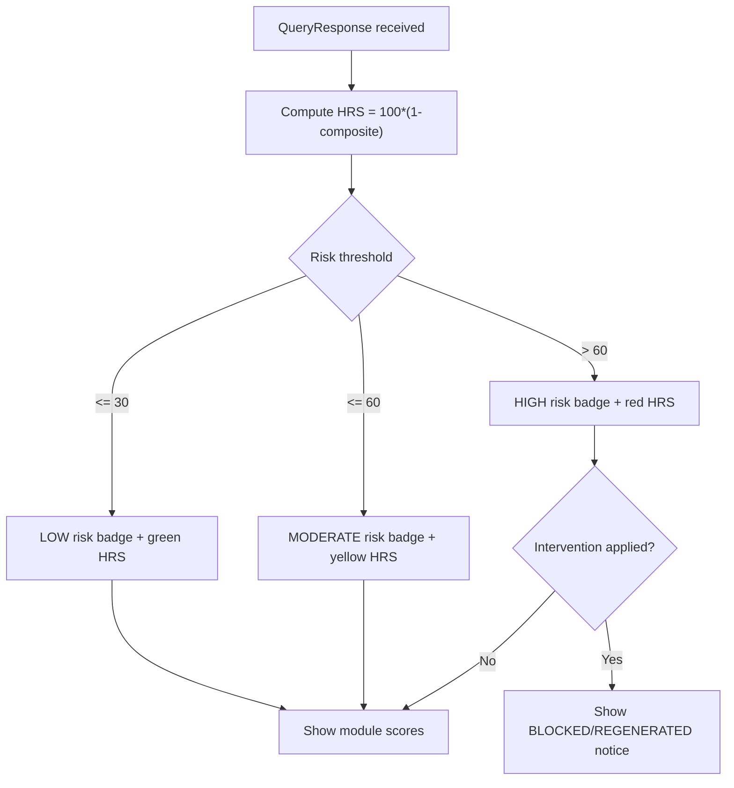
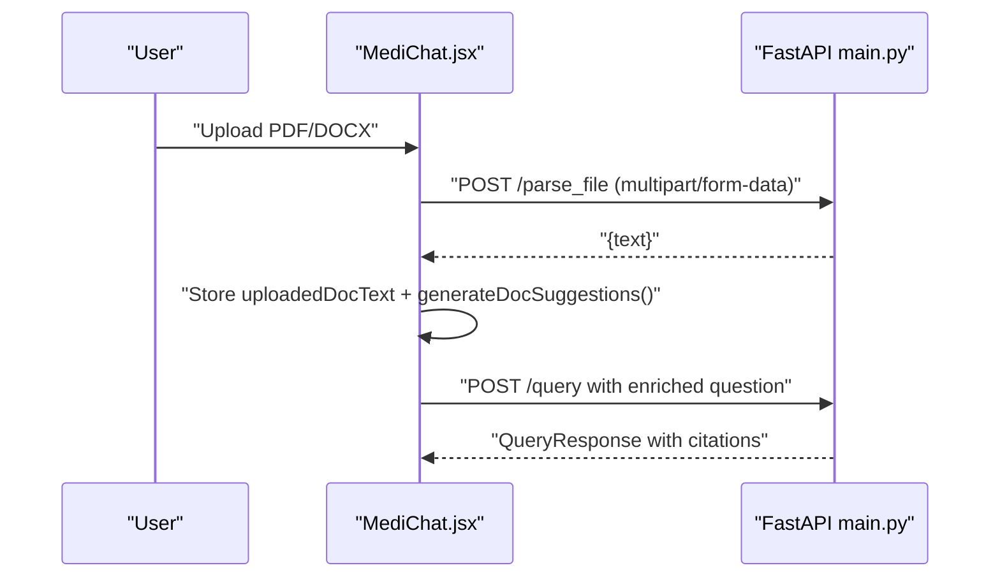
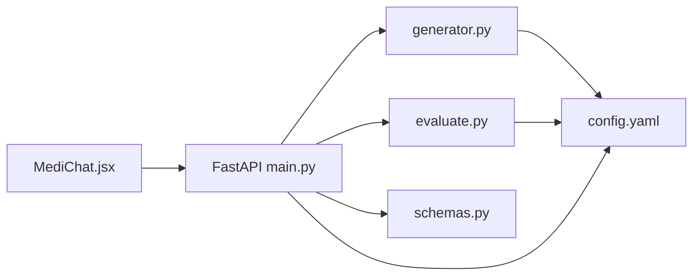

# Main Chat Interface

<cite>
**Referenced Files in This Document**
- [MediChat.jsx](file://Frontend/src/pages/MediChat.jsx)
- [MediChat.css](file://Frontend/src/pages/MediChat.css)
- [PatientExperience.jsx](file://Frontend/src/pages/PatientExperience.jsx)
- [PatientExperience.css](file://Frontend/src/pages/PatientExperience.css)
- [Navbar.jsx](file://Frontend/src/components/Navbar.jsx)
- [main.py](file://Backend/src/api/main.py)
- [schemas.py](file://Backend/src/api/schemas.py)
- [generator.py](file://Backend/src/pipeline/generator.py)
- [evaluate.py](file://Backend/src/evaluate.py)
- [config.yaml](file://Backend/config.yaml)
</cite>

## Table of Contents
1. [Introduction](#introduction)
2. [Project Structure](#project-structure)
3. [Core Components](#core-components)
4. [Architecture Overview](#architecture-overview)
5. [Detailed Component Analysis](#detailed-component-analysis)
6. [Dependency Analysis](#dependency-analysis)
7. [Performance Considerations](#performance-considerations)
8. [Troubleshooting Guide](#troubleshooting-guide)
9. [Conclusion](#conclusion)
10. [Appendices](#appendices)

## Introduction
This document provides comprehensive technical and practical documentation for the main chat interface component designed for a real-time medical Q&A experience. It covers chat message handling, user input processing, AI response rendering, the HRS (Healthcare Response Score) visualization with color-coded risk indicators and confidence metrics, document upload integration for PDF/DOCX processing and context enhancement, smart suggestions with auto-complete functionality and medical query recommendations, the patient experience interface with interactive elements and feedback collection, state management for chat history and real-time updates, error handling, and user session persistence. It also includes implementation examples for extending chat functionality and customizing the conversational flow.

## Project Structure
The chat interface spans the frontend React application and the backend FastAPI service. The frontend handles UI rendering, user interactions, and session state, while the backend performs retrieval, generation, evaluation, and safety interventions.

**Diagram sources**
- [MediChat.jsx:321-843](file://Frontend/src/pages/MediChat.jsx#L321-L843)
- [PatientExperience.jsx:4-495](file://Frontend/src/pages/PatientExperience.jsx#L4-L495)
- [Navbar.jsx:1-99](file://Frontend/src/components/Navbar.jsx#L1-L99)
- [MediChat.css:1-506](file://Frontend/src/pages/MediChat.css#L1-L506)
- [PatientExperience.css:1-267](file://Frontend/src/pages/PatientExperience.css#L1-L267)
- [main.py:1-678](file://Backend/src/api/main.py#L1-L678)
- [generator.py:1-462](file://Backend/src/pipeline/generator.py#L1-L462)
- [evaluate.py:1-251](file://Backend/src/evaluate.py#L1-L251)
- [schemas.py:1-232](file://Backend/src/api/schemas.py#L1-L232)
- [config.yaml:1-66](file://Backend/config.yaml#L1-L66)

**Section sources**
- [MediChat.jsx:321-843](file://Frontend/src/pages/MediChat.jsx#L321-L843)
- [main.py:1-678](file://Backend/src/api/main.py#L1-L678)

## Core Components
- Chat UI and State Management: Handles sessions, messages, input, and real-time updates.
- AI Message Rendering: Formats and displays AI responses with safety badges, HRS, module scores, and citations.
- Document Upload Integration: Parses PDF/DOCX, extracts text, and enriches queries with document context.
- Smart Suggestions: Generates contextual questions based on document content.
- Safety Evaluation: Computes HRS, risk bands, and applies intervention policies.
- Patient Experience UI: Provides a dedicated safety report and trace view.

**Section sources**
- [MediChat.jsx:1-843](file://Frontend/src/pages/MediChat.jsx#L1-L843)
- [MediChat.css:1-506](file://Frontend/src/pages/MediChat.css#L1-L506)
- [PatientExperience.jsx:1-495](file://Frontend/src/pages/PatientExperience.jsx#L1-L495)
- [PatientExperience.css:1-267](file://Frontend/src/pages/PatientExperience.css#L1-L267)
- [main.py:308-520](file://Backend/src/api/main.py#L308-L520)
- [schemas.py:146-232](file://Backend/src/api/schemas.py#L146-L232)

## Architecture Overview
The chat system follows a client-server pattern:
- Frontend MediChat sends queries to the backend’s /query endpoint.
- Backend retrieves top-k chunks, generates an answer, evaluates it, and optionally intervenes.
- Frontend renders the response with HRS visualization, safety badges, and citations.

**Diagram sources**
- [MediChat.jsx:366-438](file://Frontend/src/pages/MediChat.jsx#L366-L438)
- [main.py:308-520](file://Backend/src/api/main.py#L308-L520)
- [generator.py:344-413](file://Backend/src/pipeline/generator.py#L344-L413)
- [evaluate.py:49-167](file://Backend/src/evaluate.py#L49-L167)

## Detailed Component Analysis

### Chat Message Handling and Rendering
- Sessions and Messages: Maintains recent chats, active session, and message list with user/bot roles.
- Real-time Updates: Auto-scrolls to latest message; shows typing indicator during processing.
- AI Message Card: Displays safety badge, HRS gauge, formatted answer, module scores, and citations.
- Formatted Answer: Renders lists, bold headers, and paragraphs with Markdown-like semantics.

**Diagram sources**
- [MediChat.jsx:366-438](file://Frontend/src/pages/MediChat.jsx#L366-L438)
- [MediChat.jsx:95-281](file://Frontend/src/pages/MediChat.jsx#L95-L281)

**Section sources**
- [MediChat.jsx:321-843](file://Frontend/src/pages/MediChat.jsx#L321-L843)
- [MediChat.css:196-400](file://Frontend/src/pages/MediChat.css#L196-L400)

### HRS Visualization and Safety Indicators
- HRS Gauge: Color-coded bar indicating hallucination risk (LOW/MODERATE/HIGH).
- Risk Badge: Shows SAFE/CAUTION/HIGH RISK based on risk band.
- Module Pills: Faithfulness, Source Credibility, Consistency, Entity Accuracy with percentage scores.
- Intervention Flags: Indicates BLOCKED or REGENERATED responses.

**Diagram sources**
- [MediChat.jsx:60-80](file://Frontend/src/pages/MediChat.jsx#L60-L80)
- [MediChat.jsx:82-93](file://Frontend/src/pages/MediChat.jsx#L82-L93)
- [MediChat.jsx:95-148](file://Frontend/src/pages/MediChat.jsx#L95-L148)
- [main.py:413-497](file://Backend/src/api/main.py#L413-L497)

**Section sources**
- [MediChat.jsx:18-24](file://Frontend/src/pages/MediChat.jsx#L18-L24)
- [MediChat.jsx:60-93](file://Frontend/src/pages/MediChat.jsx#L60-L93)
- [MediChat.jsx:95-148](file://Frontend/src/pages/MediChat.jsx#L95-L148)

### Document Upload Integration
- File Parsing: Accepts PDF/DOCX/TXT, extracts text via /parse_file.
- Context Enhancement: Prepends document context to the user question before sending to /query.
- Smart Suggestions: Generates contextual questions based on document keywords.

**Diagram sources**
- [MediChat.jsx:755-800](file://Frontend/src/pages/MediChat.jsx#L755-L800)
- [MediChat.jsx:284-319](file://Frontend/src/pages/MediChat.jsx#L284-L319)
- [main.py:653-677](file://Backend/src/api/main.py#L653-L677)
- [MediChat.jsx:386-404](file://Frontend/src/pages/MediChat.jsx#L386-L404)

**Section sources**
- [MediChat.jsx:755-800](file://Frontend/src/pages/MediChat.jsx#L755-L800)
- [MediChat.jsx:284-319](file://Frontend/src/pages/MediChat.jsx#L284-L319)
- [main.py:653-677](file://Backend/src/api/main.py#L653-L677)

### Smart Suggestions and Auto-complete
- Initial Topics: Prompts users with popular health topics.
- Document-based Suggestions: Generates contextual questions derived from uploaded document content.
- Suggestion Cards: Bot presents clickable suggestions to guide follow-up queries.

**Section sources**
- [MediChat.jsx:4-16](file://Frontend/src/pages/MediChat.jsx#L4-L16)
- [MediChat.jsx:284-319](file://Frontend/src/pages/MediChat.jsx#L284-L319)
- [MediChat.jsx:782-790](file://Frontend/src/pages/MediChat.jsx#L782-L790)

### Patient Experience Interface
- Dedicated Safety Report: Alternative UI to check answers against documents.
- Upload Zone: Drag-and-drop or click to upload health documents.
- Report Preview: Shows risk band, AI answer, and module metrics with progress bars.
- Audit Trace: JSON-like trace of evaluation details for transparency.

**Section sources**
- [PatientExperience.jsx:1-495](file://Frontend/src/pages/PatientExperience.jsx#L1-L495)
- [PatientExperience.css:1-267](file://Frontend/src/pages/PatientExperience.css#L1-L267)

### Backend Endpoints and Data Contracts
- /query: End-to-end pipeline returning generated answer, retrieved chunks, HRS, risk band, and module results.
- /evaluate: Standalone evaluation returning composite score and module breakdown.
- /parse_file: Parses uploaded files to text.
- /ingest: Dynamically adds documents to FAISS/BM25 index.
- /health: Liveness and dependency status.

**Section sources**
- [main.py:206-218](file://Backend/src/api/main.py#L206-L218)
- [main.py:223-303](file://Backend/src/api/main.py#L223-L303)
- [main.py:308-520](file://Backend/src/api/main.py#L308-L520)
- [main.py:653-677](file://Backend/src/api/main.py#L653-L677)
- [schemas.py:146-232](file://Backend/src/api/schemas.py#L146-L232)

### LLM Generation and Safety Interventions
- Providers: Gemini, OpenAI, Mistral, Ollama supported.
- Strict Mode: Regenerates answer using a context-only prompt when risk is high.
- Intervention Policies: Blocks CRITICAL risk (HRS ≥ 86) or regenerates HIGH risk (HRS ≥ 40).

**Section sources**
- [generator.py:177-231](file://Backend/src/pipeline/generator.py#L177-L231)
- [generator.py:288-337](file://Backend/src/pipeline/generator.py#L288-L337)
- [generator.py:415-461](file://Backend/src/pipeline/generator.py#L415-L461)
- [main.py:413-497](file://Backend/src/api/main.py#L413-L497)

## Dependency Analysis
- Frontend depends on backend endpoints for query, evaluation, parsing, ingestion, and logs.
- Backend orchestrates retrieval, generation, evaluation, and safety gates.
- Configuration drives provider selection, timeouts, and thresholds.

**Diagram sources**
- [MediChat.jsx:366-438](file://Frontend/src/pages/MediChat.jsx#L366-L438)
- [main.py:308-520](file://Backend/src/api/main.py#L308-L520)
- [generator.py:344-413](file://Backend/src/pipeline/generator.py#L344-L413)
- [evaluate.py:49-167](file://Backend/src/evaluate.py#L49-L167)
- [config.yaml:1-66](file://Backend/config.yaml#L1-L66)

**Section sources**
- [MediChat.jsx:321-843](file://Frontend/src/pages/MediChat.jsx#L321-L843)
- [main.py:1-678](file://Backend/src/api/main.py#L1-L678)
- [generator.py:1-462](file://Backend/src/pipeline/generator.py#L1-L462)
- [evaluate.py:1-251](file://Backend/src/evaluate.py#L1-L251)
- [config.yaml:1-66](file://Backend/config.yaml#L1-L66)

## Performance Considerations
- Retrieval Top-K: Tune top_k to balance relevance and latency.
- Provider Selection: Prefer cloud providers (Gemini/OpenAI) for faster generation; use local (Ollama/Mistral) for privacy.
- RAGAS Toggle: Disable RAGAS for faster responses; enable when deeper quality assessment is needed.
- Frontend Rendering: Keep message lists virtualized for large histories; debounce input to reduce API calls.
- Backend Warm-up: Pre-warm models and retriever to avoid cold-start latency.

[No sources needed since this section provides general guidance]

## Troubleshooting Guide
- API Connectivity: Verify backend is running and reachable; check /health endpoint.
- LLM Keys and Models: Ensure provider keys and model names are configured correctly.
- Document Parsing: Confirm uploaded file types are supported and readable.
- FAISS Index: Ensure FAISS index exists and is built; otherwise retrieval will fail.
- Intervention Behavior: If responses are blocked or regenerated, review HRS and module scores.

**Section sources**
- [main.py:206-218](file://Backend/src/api/main.py#L206-L218)
- [main.py:326-347](file://Backend/src/api/main.py#L326-L347)
- [MediChat.jsx:791-795](file://Frontend/src/pages/MediChat.jsx#L791-L795)

## Conclusion
The main chat interface integrates a robust retrieval, generation, and evaluation pipeline with strong safety guarantees. The HRS visualization and risk indicators provide immediate, actionable insights into response safety. Document upload and smart suggestions enhance context-awareness and usability. The modular backend enables flexible provider choices and extensible evaluation modules.

[No sources needed since this section summarizes without analyzing specific files]

## Appendices

### Implementation Examples

- Extending Chat Functionality
  - Add new providers: Implement provider-specific generators in the generator module and wire them in the frontend provider selector.
  - Custom evaluation modules: Add new modules to the evaluation orchestrator and update the aggregated weights.
  - Session persistence: Persist sessions to localStorage or IndexedDB for offline continuity.

- Customizing Conversational Flow
  - Modify system prompts in the generator module to adjust tone or emphasis.
  - Adjust risk thresholds and intervention policies in the backend evaluation loop.
  - Enhance UI with additional metadata panels (e.g., latency, citations, confidence).

[No sources needed since this section provides general guidance]