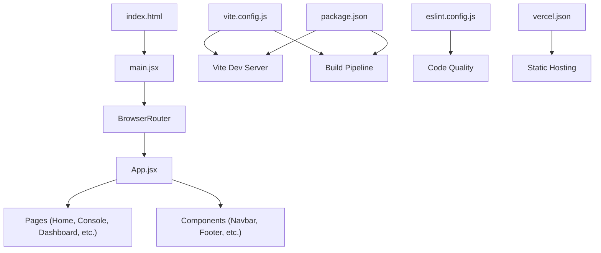
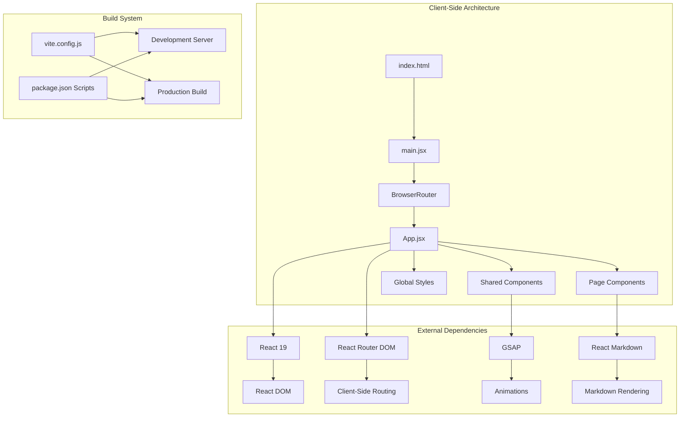
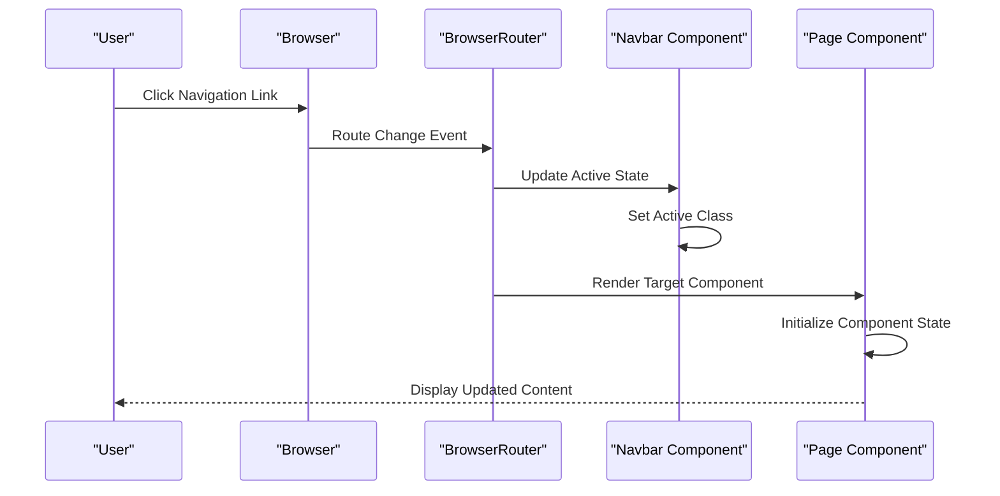
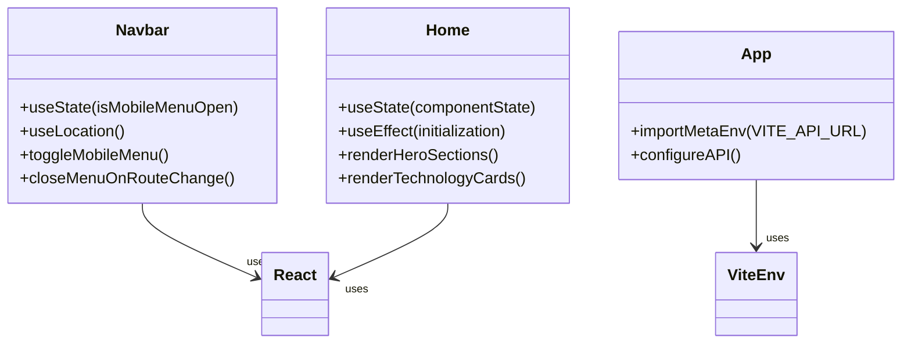
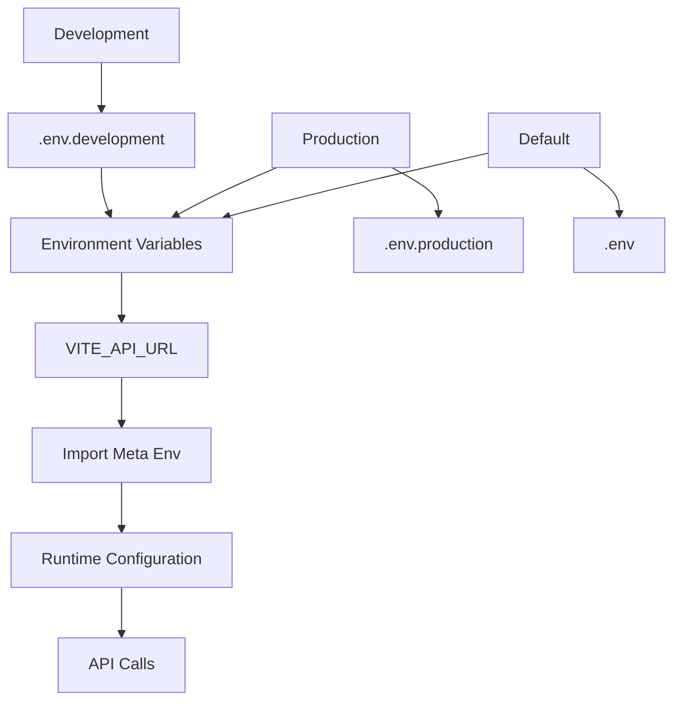
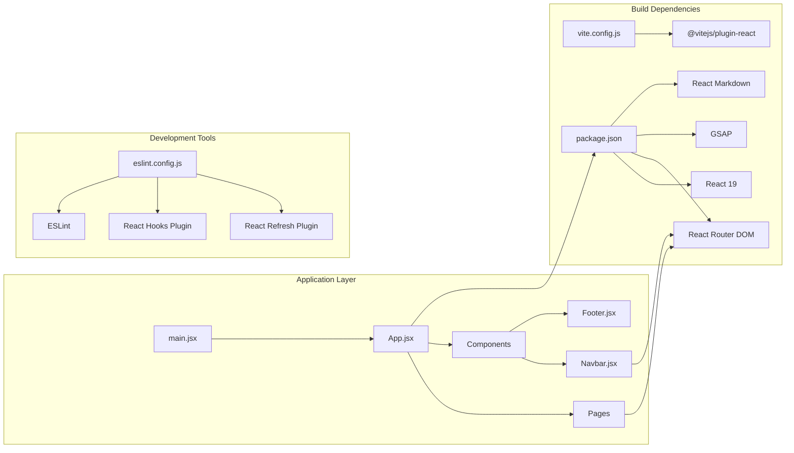

# React Application Architecture

<cite>
**Referenced Files in This Document**
- [package.json](file://Frontend/package.json)
- [vite.config.js](file://Frontend/vite.config.js)
- [main.jsx](file://Frontend/src/main.jsx)
- [App.jsx](file://Frontend/src/App.jsx)
- [index.html](file://Frontend/index.html)
- [Navbar.jsx](file://Frontend/src/components/Navbar.jsx)
- [Footer.jsx](file://Frontend/src/components/Footer.jsx)
- [Home.jsx](file://Frontend/src/pages/Home.jsx)
- [index.css](file://Frontend/src/index.css)
- [eslint.config.js](file://Frontend/eslint.config.js)
- [vercel.json](file://Frontend/vercel.json)
</cite>

## Table of Contents
1. [Introduction](#introduction)
2. [Project Structure](#project-structure)
3. [Core Components](#core-components)
4. [Architecture Overview](#architecture-overview)
5. [Detailed Component Analysis](#detailed-component-analysis)
6. [Dependency Analysis](#dependency-analysis)
7. [Performance Considerations](#performance-considerations)
8. [Troubleshooting Guide](#troubleshooting-guide)
9. [Conclusion](#conclusion)
10. [Appendices](#appendices)

## Introduction
This document provides comprehensive documentation for the React application architecture and build configuration. It covers the Vite-based build system setup, environment variable management, application entry point configuration, routing structure, component hierarchy organization, state management patterns, frontend-backend API integration, development server capabilities, and production optimization strategies. It also includes guidelines for extending the application structure and adding new routes or components.

## Project Structure
The frontend project follows a conventional React application layout with feature-based organization:
- Root configuration files: package.json, vite.config.js, eslint.config.js, vercel.json
- Entry point: index.html and main.jsx
- Application shell: App.jsx
- Routing and pages: pages directory with individual page components
- Shared components: components directory (Navbar, Footer, etc.)
- Global styles: index.css

**Diagram sources**
- [index.html:1-18](file://Frontend/index.html#L1-L18)
- [main.jsx:1-14](file://Frontend/src/main.jsx#L1-L14)
- [vite.config.js:1-8](file://Frontend/vite.config.js#L1-L8)
- [package.json:1-32](file://Frontend/package.json#L1-L32)
- [eslint.config.js:1-30](file://Frontend/eslint.config.js#L1-L30)
- [vercel.json:1-7](file://Frontend/vercel.json#L1-L7)

**Section sources**
- [package.json:1-32](file://Frontend/package.json#L1-L32)
- [vite.config.js:1-8](file://Frontend/vite.config.js#L1-L8)
- [main.jsx:1-14](file://Frontend/src/main.jsx#L1-L14)
- [index.html:1-18](file://Frontend/index.html#L1-L18)

## Core Components
The application is structured around several core components that handle navigation, layout, and page rendering:

### Application Shell
The App.jsx serves as the central configuration point for environment variables and provides the main application container. It currently imports the Vite environment variable VITE_API_URL for API communication configuration.

### Navigation System
The Navbar component provides responsive navigation with:
- Desktop navigation links with active state management
- Mobile hamburger menu with state-controlled dropdown
- GitHub integration and evaluation call-to-action
- Route-based active state detection using react-router-dom

### Page Components
The Home.jsx component demonstrates:
- Comprehensive hero section with animated elements
- Multi-section layout with statistics and technology showcase
- Interactive elements with hover effects and animations
- Responsive design patterns using CSS Grid and Flexbox

### Styling Architecture
The index.css establishes:
- Design token system with CSS custom properties
- Dark theme with green accent color scheme
- Responsive typography and spacing
- Animation and transition utilities
- Component-specific styling patterns

**Section sources**
- [App.jsx:1-4](file://Frontend/src/App.jsx#L1-L4)
- [Navbar.jsx:1-99](file://Frontend/src/components/Navbar.jsx#L1-L99)
- [Home.jsx:1-640](file://Frontend/src/pages/Home.jsx#L1-L640)
- [index.css:1-800](file://Frontend/src/index.css#L1-L800)

## Architecture Overview
The application follows a client-side routing architecture with Vite as the build toolchain:

**Diagram sources**
- [main.jsx:1-14](file://Frontend/src/main.jsx#L1-L14)
- [vite.config.js:1-8](file://Frontend/vite.config.js#L1-L8)
- [package.json:12-29](file://Frontend/package.json#L12-L29)

The architecture emphasizes:
- Single-page application (SPA) routing via react-router-dom
- Component-based UI composition
- Environment-driven configuration through Vite meta environment variables
- Modern JavaScript features with ES modules

## Detailed Component Analysis

### Routing Structure and Navigation Flow
The routing system is implemented through react-router-dom with a centralized navigation pattern:

**Diagram sources**
- [Navbar.jsx:1-99](file://Frontend/src/components/Navbar.jsx#L1-L99)
- [Home.jsx:1-640](file://Frontend/src/pages/Home.jsx#L1-L640)

### State Management Patterns
The application demonstrates several state management approaches:

**Diagram sources**
- [Navbar.jsx:1-99](file://Frontend/src/components/Navbar.jsx#L1-L99)
- [Home.jsx:1-640](file://Frontend/src/pages/Home.jsx#L1-L640)
- [App.jsx:1-4](file://Frontend/src/App.jsx#L1-L4)

### Environment Variable Management
The application uses Vite's environment variable system:

**Diagram sources**
- [App.jsx:1-4](file://Frontend/src/App.jsx#L1-L4)
- [package.json:6-11](file://Frontend/package.json#L6-L11)

**Section sources**
- [Navbar.jsx:1-99](file://Frontend/src/components/Navbar.jsx#L1-L99)
- [Home.jsx:1-640](file://Frontend/src/pages/Home.jsx#L1-L640)
- [App.jsx:1-4](file://Frontend/src/App.jsx#L1-L4)

## Dependency Analysis
The application maintains clean dependency relationships:

**Diagram sources**
- [main.jsx:1-14](file://Frontend/src/main.jsx#L1-L14)
- [vite.config.js:1-8](file://Frontend/vite.config.js#L1-L8)
- [package.json:12-29](file://Frontend/package.json#L12-L29)
- [eslint.config.js:1-30](file://Frontend/eslint.config.js#L1-L30)

**Section sources**
- [package.json:12-29](file://Frontend/package.json#L12-L29)
- [vite.config.js:1-8](file://Frontend/vite.config.js#L1-L8)
- [eslint.config.js:1-30](file://Frontend/eslint.config.js#L1-L30)

## Performance Considerations
The application leverages modern performance optimization strategies:

### Build Optimization
- Tree shaking through ES modules
- Code splitting via dynamic imports
- Minification and bundling in production builds
- Asset optimization and caching strategies

### Runtime Performance
- React 19 concurrent features
- Efficient component re-rendering
- CSS-in-JS with styled-components patterns
- Lazy loading for non-critical resources

### Development Experience
- Hot Module Replacement (HMR) for rapid iteration
- Fast refresh for instant UI updates
- Type checking with TypeScript support
- ESLint integration for code quality

## Troubleshooting Guide
Common issues and their solutions:

### Environment Variables Not Loading
- Verify .env files exist in the Frontend directory
- Check VITE_ prefix requirement for exposed variables
- Ensure variables are loaded during build time

### Routing Issues
- Confirm BrowserRouter wraps the App component
- Verify route paths match component exports
- Check for conflicting route definitions

### Build Errors
- Clear node_modules and reinstall dependencies
- Verify Vite plugin compatibility
- Check for syntax errors in JSX files

### Styling Problems
- Ensure index.css is imported in main.jsx
- Verify CSS custom properties are properly defined
- Check for conflicting style declarations

**Section sources**
- [App.jsx:1-4](file://Frontend/src/App.jsx#L1-L4)
- [main.jsx:1-14](file://Frontend/src/main.jsx#L1-L14)
- [index.css:1-800](file://Frontend/src/index.css#L1-L800)

## Conclusion
This React application demonstrates a modern, well-structured frontend architecture built on Vite. The design emphasizes component modularity, environment-driven configuration, and scalable development practices. The integration of React Router DOM provides robust client-side navigation, while the styling system offers flexibility and maintainability. The build configuration supports both development and production environments effectively.

## Appendices

### Development Server Setup
The development server configuration includes:
- Hot Module Replacement for instant feedback
- Fast refresh for React component updates
- Proxy configuration for API requests
- Automatic browser opening

### Production Deployment
Production optimization includes:
- Code minification and tree shaking
- Asset compression and optimization
- Static file serving configuration
- CDN-ready bundle generation

### Extension Guidelines
To extend the application:

1. **Add New Routes**: Create page components in the pages directory and register routes in the navigation
2. **Create Components**: Place reusable components in the components directory following existing patterns
3. **Update Styling**: Add new CSS classes to index.css or create component-specific styles
4. **Environment Configuration**: Add new VITE_ variables to .env files as needed
5. **API Integration**: Configure API endpoints using the VITE_API_URL environment variable pattern

**Section sources**
- [package.json:6-11](file://Frontend/package.json#L6-L11)
- [vite.config.js:1-8](file://Frontend/vite.config.js#L1-L8)
- [vercel.json:1-7](file://Frontend/vercel.json#L1-L7)