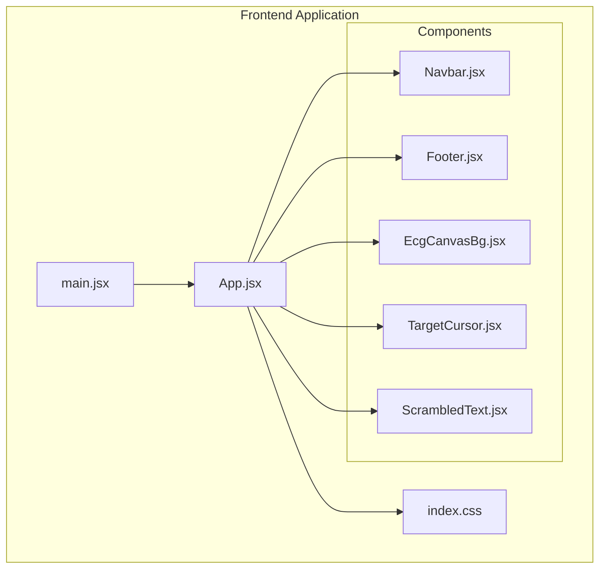
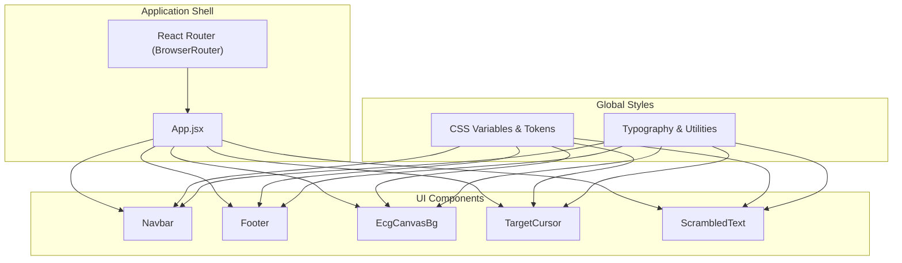
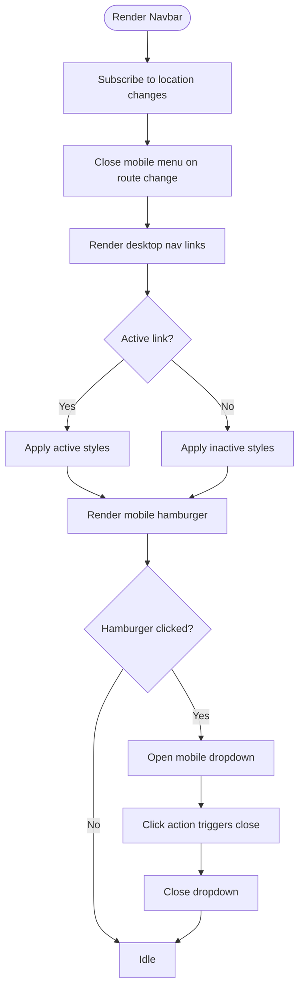
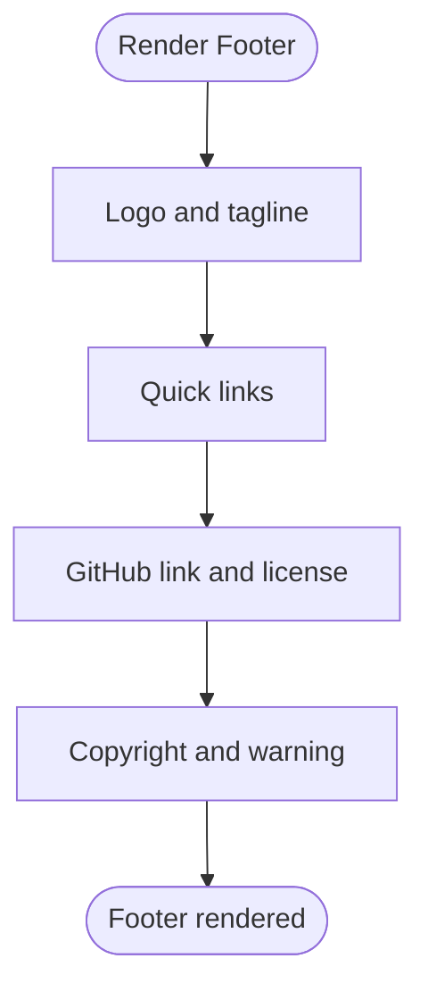
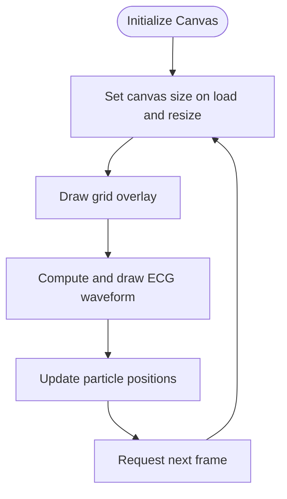
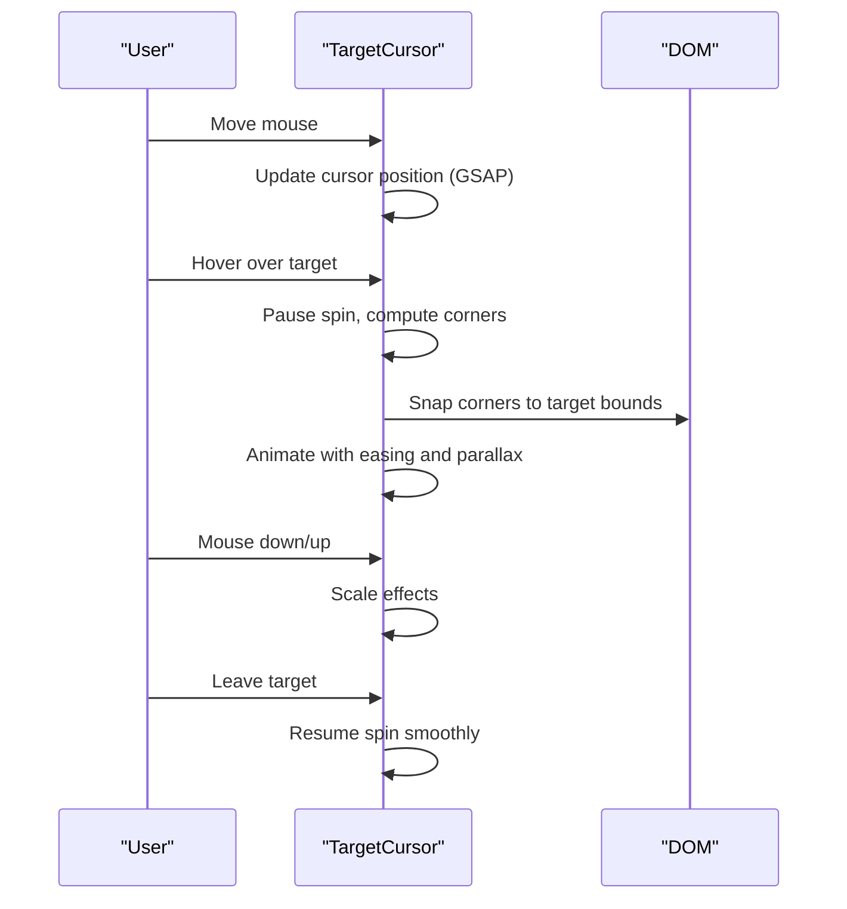
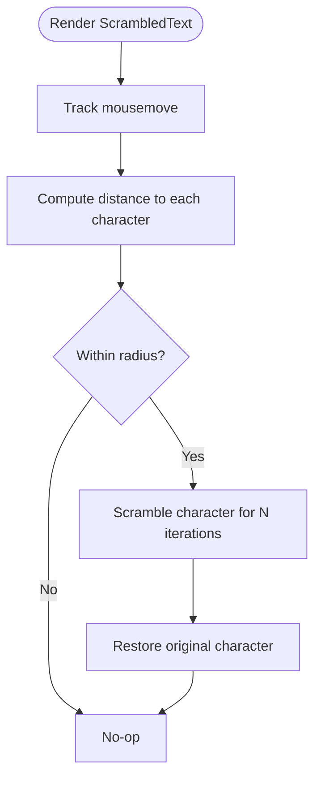
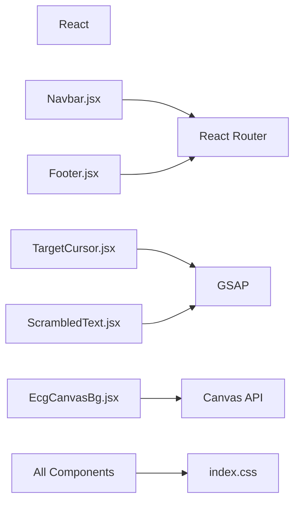

# UI Components Library

<cite>
**Referenced Files in This Document**
- [Navbar.jsx](file://Frontend/src/components/Navbar.jsx)
- [Footer.jsx](file://Frontend/src/components/Footer.jsx)
- [EcgCanvasBg.jsx](file://Frontend/src/components/EcgCanvasBg.jsx)
- [TargetCursor.jsx](file://Frontend/src/components/TargetCursor.jsx)
- [ScrambledText.jsx](file://Frontend/src/components/ScrambledText.jsx)
- [index.css](file://Frontend/src/index.css)
- [main.jsx](file://Frontend/src/main.jsx)
- [App.jsx](file://Frontend/src/App.jsx)
</cite>

## Table of Contents
1. [Introduction](#introduction)
2. [Project Structure](#project-structure)
3. [Core Components](#core-components)
4. [Architecture Overview](#architecture-overview)
5. [Detailed Component Analysis](#detailed-component-analysis)
6. [Dependency Analysis](#dependency-analysis)
7. [Performance Considerations](#performance-considerations)
8. [Accessibility and Cross-Browser Compatibility](#accessibility-and-cross-browser-compatibility)
9. [Troubleshooting Guide](#troubleshooting-guide)
10. [Conclusion](#conclusion)
11. [Appendices](#appendices)

## Introduction
This document describes a reusable UI components library tailored for specialized medical interfaces. It focuses on five components:
- Navigation Bar: responsive layout with active state awareness and integrated call-to-action.
- Footer: legal and support information with branding and links.
- ECG Canvas Background: animated grid and waveforms with subtle particle motion for a medical aesthetic.
- Target Cursor: precision targeting with spinning crosshairs, snapping animations, and parallax behavior.
- Scrambled Text Effect: dynamic text reveal triggered by proximity with medical-themed typography.

Each component’s props, styling guidelines, customization options, and usage examples are documented. Accessibility, responsiveness, and cross-browser compatibility are addressed throughout.

## Project Structure
The UI components live under the frontend React application and share a centralized design system via CSS custom properties and global styles.

**Diagram sources**
- [main.jsx:1-14](file://Frontend/src/main.jsx#L1-L14)
- [App.jsx:1-4](file://Frontend/src/App.jsx#L1-L4)
- [index.css:1-120](file://Frontend/src/index.css#L1-L120)
- [Navbar.jsx:1-99](file://Frontend/src/components/Navbar.jsx#L1-L99)
- [Footer.jsx:1-53](file://Frontend/src/components/Footer.jsx#L1-L53)
- [EcgCanvasBg.jsx:1-130](file://Frontend/src/components/EcgCanvasBg.jsx#L1-L130)
- [TargetCursor.jsx:1-307](file://Frontend/src/components/TargetCursor.jsx#L1-L307)
- [ScrambledText.jsx:1-97](file://Frontend/src/components/ScrambledText.jsx#L1-L97)

**Section sources**
- [main.jsx:1-14](file://Frontend/src/main.jsx#L1-L14)
- [index.css:1-120](file://Frontend/src/index.css#L1-L120)

## Core Components
This section summarizes each component’s purpose, props, styling hooks, and customization options.

- Navigation Bar
  - Purpose: Fixed, glass-morphism header with logo, navigation links, and call-to-action.
  - Props: None (uses routing and location state internally).
  - Styling hooks: CSS classes for layout, active states, and mobile dropdown.
  - Customization: Adjust colors, spacing, and breakpoints via CSS variables and media queries.

- Footer
  - Purpose: Legal info, credits, and external links with consistent branding.
  - Props: None.
  - Styling hooks: CSS grid layout and link styles.
  - Customization: Modify text content and link targets in JSX; adjust layout via CSS.

- ECG Canvas Background
  - Purpose: Animated grid and ECG waveform with floating particles for a medical aesthetic.
  - Props: None (self-contained canvas animation).
  - Styling hooks: Global canvas positioning and pointer-events handling.
  - Customization: Tune colors, grid size, particle count, and animation speed via internal constants and drawing routines.

- Target Cursor
  - Purpose: Precision targeting with spinning crosshairs and snapping to interactive elements.
  - Props:
    - targetSelector: CSS selector for snap targets.
    - spinDuration: Rotation cycle duration.
    - hideDefaultCursor: Hide browser cursor.
    - hoverDuration: Animation duration for snapping.
    - parallaxOn: Enable parallax movement during hover.
  - Styling hooks: Container and corner elements with GSAP-managed transforms.
  - Customization: Adjust snapping sensitivity, rotation speed, and hover behavior via props and internal constants.

- Scrambled Text Effect
  - Purpose: Dynamic text reveal around the cursor with configurable radius and character set.
  - Props:
    - radius: Interaction radius in pixels.
    - duration: Per-character animation duration.
    - scrambleChars: Character pool for scrambling.
    - className/style: Wrapper customization.
    - children: Text content.
  - Styling hooks: Inline-flex layout and per-character spans.
  - Customization: Change character set, radius, and animation timing; integrate with typography tokens.

**Section sources**
- [Navbar.jsx:1-99](file://Frontend/src/components/Navbar.jsx#L1-L99)
- [Footer.jsx:1-53](file://Frontend/src/components/Footer.jsx#L1-L53)
- [EcgCanvasBg.jsx:1-130](file://Frontend/src/components/EcgCanvasBg.jsx#L1-L130)
- [TargetCursor.jsx:4-307](file://Frontend/src/components/TargetCursor.jsx#L4-L307)
- [ScrambledText.jsx:4-97](file://Frontend/src/components/ScrambledText.jsx#L4-L97)
- [index.css:1-120](file://Frontend/src/index.css#L1-L120)

## Architecture Overview
The components are integrated into the application shell and styled via a shared design system. The canvas background is positioned behind content, while interactive components rely on GSAP for smooth animations.

**Diagram sources**
- [main.jsx:1-14](file://Frontend/src/main.jsx#L1-L14)
- [App.jsx:1-4](file://Frontend/src/App.jsx#L1-L4)
- [index.css:1-120](file://Frontend/src/index.css#L1-L120)
- [Navbar.jsx:1-99](file://Frontend/src/components/Navbar.jsx#L1-L99)
- [Footer.jsx:1-53](file://Frontend/src/components/Footer.jsx#L1-L53)
- [EcgCanvasBg.jsx:1-130](file://Frontend/src/components/EcgCanvasBg.jsx#L1-L130)
- [TargetCursor.jsx:1-307](file://Frontend/src/components/TargetCursor.jsx#L1-L307)
- [ScrambledText.jsx:1-97](file://Frontend/src/components/ScrambledText.jsx#L1-L97)

## Detailed Component Analysis

### Navigation Bar
- Behavior
  - Tracks route changes to close mobile menus.
  - Applies active state styling to navigation links based on location.
  - Integrates a “Run Evaluation” call-to-action and GitHub link.
- Responsive Design
  - Desktop: Center-aligned links with active indicators.
  - Mobile: Hamburger-triggered dropdown with full-width actions.
- Styling and Theming
  - Uses CSS variables for colors and transitions.
  - Backdrop blur and glass-like background for modern UI.
- Accessibility
  - Keyboard-friendly links; focus states inherit from global styles.
- Usage Example
  - Place inside the page layout; ensure routes match the expected paths for active highlighting.

**Diagram sources**
- [Navbar.jsx:8-11](file://Frontend/src/components/Navbar.jsx#L8-L11)
- [Navbar.jsx:28-43](file://Frontend/src/components/Navbar.jsx#L28-L43)
- [Navbar.jsx:57-92](file://Frontend/src/components/Navbar.jsx#L57-L92)

**Section sources**
- [Navbar.jsx:1-99](file://Frontend/src/components/Navbar.jsx#L1-L99)
- [index.css:268-464](file://Frontend/src/index.css#L268-L464)

### Footer
- Behavior
  - Displays branding, tagline, and team credits.
  - Provides quick links and a GitHub link.
  - Shows legal notices and warnings.
- Styling and Theming
  - Grid-based layout with three columns.
  - Consistent use of accent colors and typography tokens.
- Accessibility
  - Links are keyboard accessible; ensure sufficient color contrast.
- Usage Example
  - Include in page layouts below content; update text and links as needed.

**Diagram sources**
- [Footer.jsx:4-49](file://Frontend/src/components/Footer.jsx#L4-L49)

**Section sources**
- [Footer.jsx:1-53](file://Frontend/src/components/Footer.jsx#L1-L53)
- [index.css:1-120](file://Frontend/src/index.css#L1-L120)

### ECG Canvas Background
- Behavior
  - Resizes to window size and redraws grid and waveform.
  - Animates a moving ECG wave with periodic spikes.
  - Updates floating particles with toroidal wrapping.
- Visual Design
  - Subtle grid overlay and soft green accents.
  - Smooth animation loop using requestAnimationFrame.
- Performance
  - Efficient per-frame updates; cleans up event listeners and animation frames on unmount.
- Usage Example
  - Place at the root level behind page content; ensure z-index stacking keeps it beneath interactive elements.

**Diagram sources**
- [EcgCanvasBg.jsx:7-24](file://Frontend/src/components/EcgCanvasBg.jsx#L7-L24)
- [EcgCanvasBg.jsx:39-56](file://Frontend/src/components/EcgCanvasBg.jsx#L39-L56)
- [EcgCanvasBg.jsx:60-116](file://Frontend/src/components/EcgCanvasBg.jsx#L60-L116)

**Section sources**
- [EcgCanvasBg.jsx:1-130](file://Frontend/src/components/EcgCanvasBg.jsx#L1-L130)
- [index.css:90-114](file://Frontend/src/index.css#L90-L114)

### Target Cursor
- Behavior
  - Spinning crosshair with corner snapping to interactive targets.
  - Parallax movement and physical-feeling easing during hover.
  - Mouse down/up scaling for tactile feedback.
  - Automatic resume of spinning after leaving targets.
- Props
  - targetSelector: CSS selector for snap targets.
  - spinDuration: Rotation cycle duration.
  - hideDefaultCursor: Hide browser cursor.
  - hoverDuration: Snapping animation duration.
  - parallaxOn: Enable parallax movement.
- Mobile Handling
  - Deactivates on mobile devices to preserve usability.
- Usage Example
  - Wrap the app with the component to enable globally; ensure interactive elements carry the target class or match the selector.

**Diagram sources**
- [TargetCursor.jsx:33-36](file://Frontend/src/components/TargetCursor.jsx#L33-L36)
- [TargetCursor.jsx:143-196](file://Frontend/src/components/TargetCursor.jsx#L143-L196)
- [TargetCursor.jsx:213-237](file://Frontend/src/components/TargetCursor.jsx#L213-L237)

**Section sources**
- [TargetCursor.jsx:1-307](file://Frontend/src/components/TargetCursor.jsx#L1-L307)
- [index.css:1-120](file://Frontend/src/index.css#L1-L120)

### Scrambled Text Effect
- Behavior
  - On mousemove near a character, scrambles it with a randomized character set for a short duration.
  - Restores the original character after a fixed number of iterations.
- Props
  - radius: Interaction radius in pixels.
  - duration: Per-character animation duration.
  - scrambleChars: Character pool for scrambling.
  - className/style: Wrapper customization.
  - children: Text content.
- Styling and Theming
  - Uses inline-flex layout and per-character spans for precise hit-testing.
- Usage Example
  - Wrap text content to apply the effect; adjust radius and character set for different UX needs.

**Diagram sources**
- [ScrambledText.jsx:46-70](file://Frontend/src/components/ScrambledText.jsx#L46-L70)
- [ScrambledText.jsx:18-44](file://Frontend/src/components/ScrambledText.jsx#L18-L44)

**Section sources**
- [ScrambledText.jsx:1-97](file://Frontend/src/components/ScrambledText.jsx#L1-L97)
- [index.css:1-120](file://Frontend/src/index.css#L1-L120)

## Dependency Analysis
- Runtime Dependencies
  - React and React Router for routing and navigation.
  - GSAP for smooth animations in TargetCursor and ScrambledText.
  - Canvas API for ECG background rendering.
- Styling Dependencies
  - Shared CSS variables and design tokens define colors, typography, and transitions.
- External Integration
  - API URL is injected via Vite environment variables.

**Diagram sources**
- [main.jsx:1-14](file://Frontend/src/main.jsx#L1-L14)
- [TargetCursor.jsx:1-2](file://Frontend/src/components/TargetCursor.jsx#L1-L2)
- [ScrambledText.jsx:1-2](file://Frontend/src/components/ScrambledText.jsx#L1-L2)
- [EcgCanvasBg.jsx:1-1](file://Frontend/src/components/EcgCanvasBg.jsx#L1-L1)
- [index.css:1-120](file://Frontend/src/index.css#L1-L120)

**Section sources**
- [main.jsx:1-14](file://Frontend/src/main.jsx#L1-L14)
- [index.css:1-120](file://Frontend/src/index.css#L1-L120)
- [App.jsx:1-4](file://Frontend/src/App.jsx#L1-L4)

## Performance Considerations
- TargetCursor
  - Uses GSAP’s ticker and controlled tweens; ensure cleanup on unmount to prevent memory leaks.
  - Parallax and snapping are optimized with easing and minimal DOM reads.
- EcgCanvasBg
  - Clears and redraws efficiently; avoids unnecessary allocations by reusing arrays.
  - Cancels animation frames and removes event listeners on unmount.
- ScrambledText
  - Per-character hit-testing is O(n); keep reasonable text lengths for large blocks.
  - Uses intervals for scrambling; consider throttling for very large texts.
- General
  - Prefer CSS custom properties for theming to minimize repaints.
  - Avoid layout thrashing by batching DOM reads/writes.

[No sources needed since this section provides general guidance]

## Accessibility and Cross-Browser Compatibility
- Accessibility
  - Focus management: Ensure keyboard navigation works across links and buttons.
  - Color contrast: Verify sufficient contrast for active states and accents.
  - Screen readers: Provide meaningful labels for icons and buttons.
  - Pointer alternatives: Respect reduced motion preferences; consider disabling animations where appropriate.
- Cross-Browser Compatibility
  - CSS variables are widely supported; ensure fallbacks for older browsers if needed.
  - Canvas APIs are broadly supported; test on legacy browsers if required.
  - GSAP animations require modern JavaScript environments; confirm availability in target browsers.
  - Media queries and flexbox are well-supported; validate layout on small screens.

[No sources needed since this section provides general guidance]

## Troubleshooting Guide
- Navigation Bar
  - Active link not highlighting: Verify route paths match the active condition logic.
  - Mobile menu not closing: Ensure location changes trigger state updates.
- Footer
  - Layout broken: Check grid column widths and media queries.
- ECG Canvas Background
  - Canvas not resizing: Confirm resize listener is attached and cleared on unmount.
  - Performance issues: Reduce particle count or grid density.
- Target Cursor
  - Not visible on mobile: Expected behavior; component disables on mobile.
  - Snapping not working: Ensure targetSelector matches interactive elements.
  - Cursor flickers: Verify cleanup of styles and event listeners on unmount.
- Scrambled Text Effect
  - Characters not scrambling: Confirm mousemove events are firing and radius is appropriate.
  - Animation stutter: Lower iteration count or increase duration.

**Section sources**
- [Navbar.jsx:8-11](file://Frontend/src/components/Navbar.jsx#L8-L11)
- [EcgCanvasBg.jsx:120-124](file://Frontend/src/components/EcgCanvasBg.jsx#L120-L124)
- [TargetCursor.jsx:245-264](file://Frontend/src/components/TargetCursor.jsx#L245-L264)
- [ScrambledText.jsx:46-70](file://Frontend/src/components/ScrambledText.jsx#L46-L70)

## Conclusion
This UI components library provides a cohesive, accessible, and visually consistent foundation for medical applications. The components emphasize performance, responsiveness, and a professional aesthetic. By leveraging shared design tokens and modular props, teams can rapidly assemble specialized interfaces while maintaining brand coherence and usability standards.

[No sources needed since this section summarizes without analyzing specific files]

## Appendices

### Component Prop Interfaces
- Navbar
  - No props required.
- Footer
  - No props required.
- EcgCanvasBg
  - No props required.
- TargetCursor
  - targetSelector: string
  - spinDuration: number
  - hideDefaultCursor: boolean
  - hoverDuration: number
  - parallaxOn: boolean
- ScrambledText
  - radius: number
  - duration: number
  - scrambleChars: string
  - className: string
  - style: object
  - children: ReactNode

**Section sources**
- [TargetCursor.jsx:4-10](file://Frontend/src/components/TargetCursor.jsx#L4-L10)
- [ScrambledText.jsx:4-11](file://Frontend/src/components/ScrambledText.jsx#L4-L11)

### Styling Guidelines and Customization Options
- Use CSS variables for colors, typography, and transitions.
- Maintain consistent spacing and border radii via design tokens.
- Override component-specific classes for targeted customization without affecting global styles.
- Keep responsive breakpoints aligned with existing media queries.

**Section sources**
- [index.css:6-49](file://Frontend/src/index.css#L6-L49)
- [index.css:268-464](file://Frontend/src/index.css#L268-L464)

### Usage Examples
- Navigation Bar
  - Include in the page layout; ensure routes align with active link logic.
- Footer
  - Place at the bottom of pages; update text and links as needed.
- ECG Canvas Background
  - Render at the root level behind content; ensure proper z-index stacking.
- Target Cursor
  - Wrap the application to enable globally; ensure interactive elements match the selector.
- Scrambled Text Effect
  - Wrap text content to apply the effect; tune radius and character set for desired UX.

**Section sources**
- [Navbar.jsx:1-99](file://Frontend/src/components/Navbar.jsx#L1-L99)
- [Footer.jsx:1-53](file://Frontend/src/components/Footer.jsx#L1-L53)
- [EcgCanvasBg.jsx:1-130](file://Frontend/src/components/EcgCanvasBg.jsx#L1-L130)
- [TargetCursor.jsx:1-307](file://Frontend/src/components/TargetCursor.jsx#L1-L307)
- [ScrambledText.jsx:1-97](file://Frontend/src/components/ScrambledText.jsx#L1-L97)