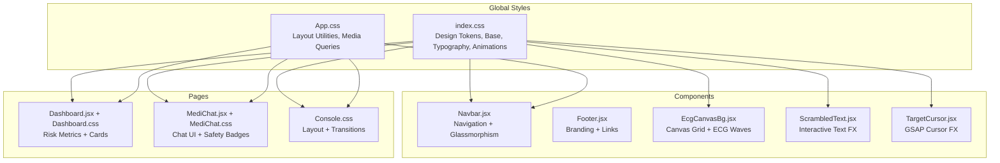
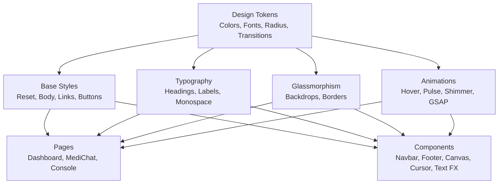
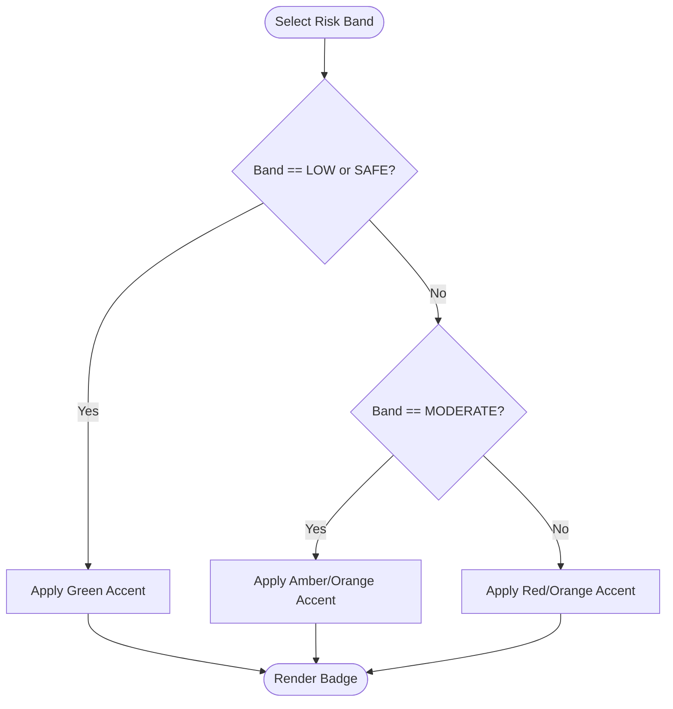
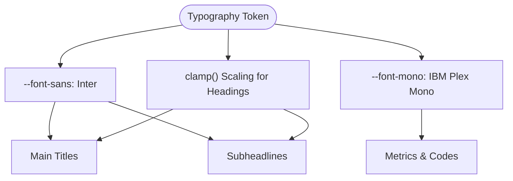
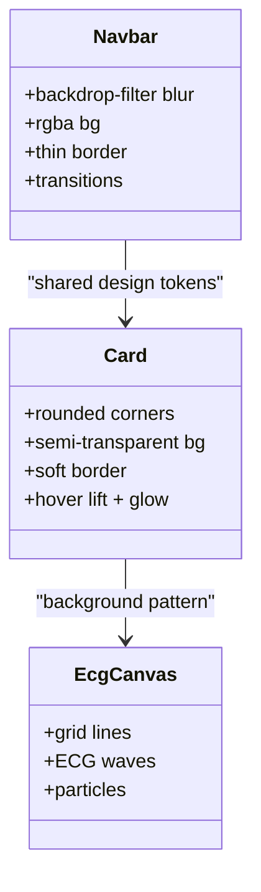
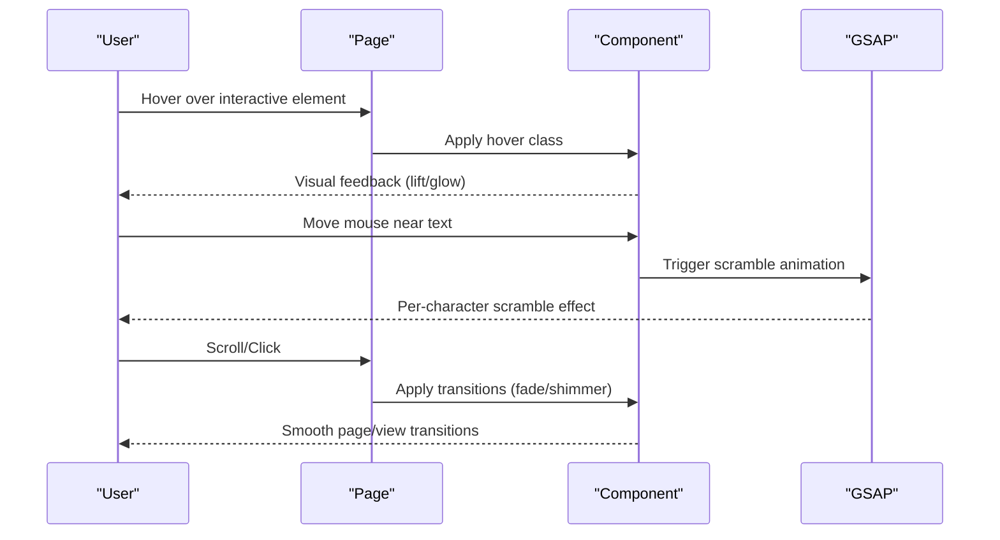
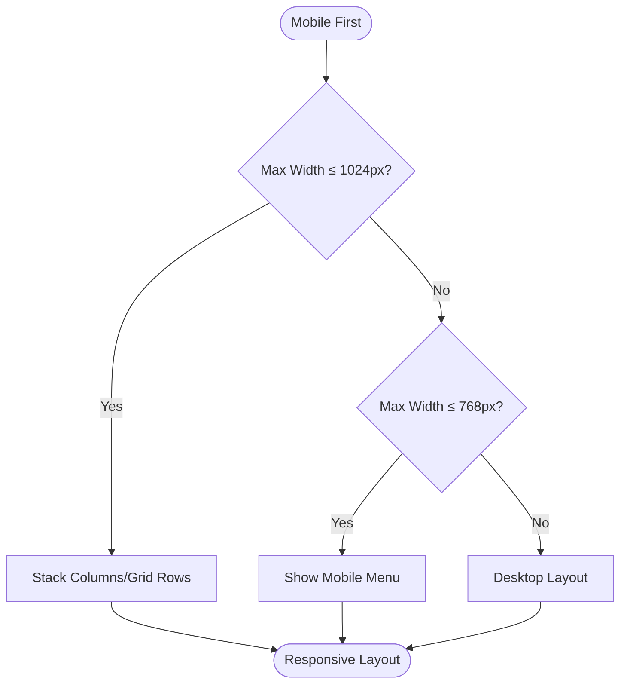
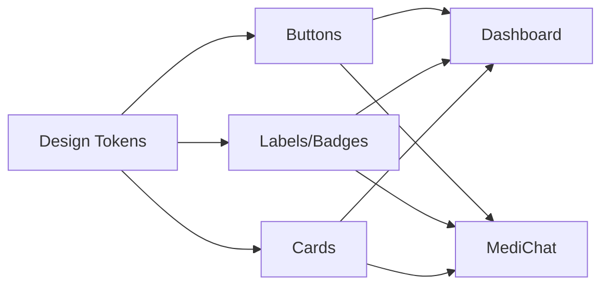
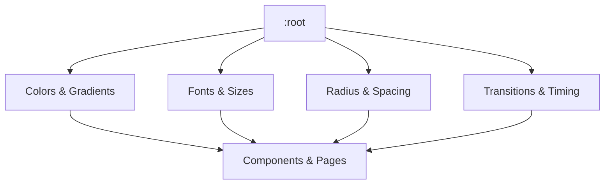
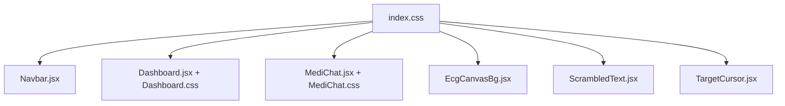

# Visual Design System

<cite>
**Referenced Files in This Document**
- [index.css](file://Frontend/src/index.css)
- [App.css](file://Frontend/src/App.css)
- [Navbar.jsx](file://Frontend/src/components/Navbar.jsx)
- [Footer.jsx](file://Frontend/src/components/Footer.jsx)
- [EcgCanvasBg.jsx](file://Frontend/src/components/EcgCanvasBg.jsx)
- [Dashboard.jsx](file://Frontend/src/pages/Dashboard.jsx)
- [Dashboard.css](file://Frontend/src/pages/Dashboard.css)
- [MediChat.jsx](file://Frontend/src/pages/MediChat.jsx)
- [MediChat.css](file://Frontend/src/pages/MediChat.css)
- [Console.css](file://Frontend/src/pages/Console.css)
- [ScrambledText.jsx](file://Frontend/src/components/ScrambledText.jsx)
- [TargetCursor.jsx](file://Frontend/src/components/TargetCursor.jsx)
</cite>

## Table of Contents
1. [Introduction](#introduction)
2. [Project Structure](#project-structure)
3. [Core Components](#core-components)
4. [Architecture Overview](#architecture-overview)
5. [Detailed Component Analysis](#detailed-component-analysis)
6. [Dependency Analysis](#dependency-analysis)
7. [Performance Considerations](#performance-considerations)
8. [Troubleshooting Guide](#troubleshooting-guide)
9. [Conclusion](#conclusion)
10. [Appendices](#appendices)

## Introduction
This document describes the visual design system for the medical-themed UI. It covers the color palette with healthcare-appropriate colors and risk-based color coding, typography hierarchy optimized for readability, glassmorphism and modern UI effects, animation systems for loading and transitions, responsive design with a mobile-first approach, component styling patterns, CSS architecture, and design token management. It also provides guidelines for maintaining consistency and extending the visual language.

## Project Structure
The visual design system is implemented primarily via:
- Global design tokens and base styles in the global stylesheet
- Component-specific stylesheets and inline styles
- Canvas-based background effects
- Interactive animation components powered by GSAP

**Diagram sources**
- [index.css:1-3075](file://Frontend/src/index.css#L1-L3075)
- [App.css:1-185](file://Frontend/src/App.css#L1-L185)
- [Navbar.jsx:1-99](file://Frontend/src/components/Navbar.jsx#L1-L99)
- [EcgCanvasBg.jsx:1-130](file://Frontend/src/components/EcgCanvasBg.jsx#L1-L130)
- [Dashboard.jsx:1-232](file://Frontend/src/pages/Dashboard.jsx#L1-L232)
- [Dashboard.css:1-404](file://Frontend/src/pages/Dashboard.css#L1-L404)
- [MediChat.jsx:1-843](file://Frontend/src/pages/MediChat.jsx#L1-L843)
- [MediChat.css:1-506](file://Frontend/src/pages/MediChat.css#L1-L506)
- [Console.css:1-121](file://Frontend/src/pages/Console.css#L1-L121)

**Section sources**
- [index.css:1-3075](file://Frontend/src/index.css#L1-L3075)
- [App.css:1-185](file://Frontend/src/App.css#L1-L185)

## Core Components
- Color palette and risk-based coding: Green/Yellow/Amber/Orange/Red accents with gradient variants and safety badges.
- Typography: Inter for UI, IBM Plex Mono for mono content; clamp-based scaling for headings; uppercase labels with medical terminology emphasis.
- Glassmorphism: Backdrop blur and semi-transparent backgrounds for navbar and cards.
- Animations: Hover glows, pulsing badges, shimmering stats, typing dots, and GSAP-powered cursor and text effects.
- Responsive layout: Mobile-first grid and flex layouts with media queries.

**Section sources**
- [index.css:6-49](file://Frontend/src/index.css#L6-L49)
- [index.css:120-215](file://Frontend/src/index.css#L120-L215)
- [index.css:271-464](file://Frontend/src/index.css#L271-L464)
- [Dashboard.css:361-393](file://Frontend/src/pages/Dashboard.css#L361-L393)
- [MediChat.css:366-399](file://Frontend/src/pages/MediChat.css#L366-L399)
- [Console.css:93-96](file://Frontend/src/pages/Console.css#L93-L96)

## Architecture Overview
The design system is built around CSS custom properties (design tokens) and modular CSS classes. Components compose reusable patterns (buttons, labels, cards) and leverage shared animations and typography. Pages orchestrate component composition and apply page-level layout and transitions.

**Diagram sources**
- [index.css:6-49](file://Frontend/src/index.css#L6-L49)
- [index.css:54-81](file://Frontend/src/index.css#L54-L81)
- [index.css:120-215](file://Frontend/src/index.css#L120-L215)
- [index.css:271-464](file://Frontend/src/index.css#L271-L464)
- [MediChat.css:366-399](file://Frontend/src/pages/MediChat.css#L366-L399)
- [Dashboard.css:755-767](file://Frontend/src/pages/Dashboard.css#L755-L767)

## Detailed Component Analysis

### Color Palette and Risk-Based Coding
- Healthcare-appropriate palette: dark navy background, card backgrounds, subtle borders, and bright green accents.
- Risk-based color coding:
  - Safe: green
  - Low risk: green
  - Moderate risk: amber/orange
  - High/critical risk: orange/red
- Gradient accents for danger and ecosystem branding.
- Badge and pill components reflect risk bands with appropriate colors and borders.

**Diagram sources**
- [Dashboard.jsx:15-23](file://Frontend/src/pages/Dashboard.jsx#L15-L23)
- [Dashboard.css:340-342](file://Frontend/src/pages/Dashboard.css#L340-L342)
- [MediChat.jsx:18-24](file://Frontend/src/pages/MediChat.jsx#L18-L24)
- [MediChat.css:267-283](file://Frontend/src/pages/MediChat.css#L267-L283)

**Section sources**
- [index.css:12-22](file://Frontend/src/index.css#L12-L22)
- [Dashboard.jsx:15-23](file://Frontend/src/pages/Dashboard.jsx#L15-L23)
- [Dashboard.css:675-678](file://Frontend/src/pages/Dashboard.css#L675-L678)
- [MediChat.jsx:18-24](file://Frontend/src/pages/MediChat.jsx#L18-L24)
- [MediChat.css:267-283](file://Frontend/src/pages/MediChat.css#L267-L283)

### Typography System
- Font families: Inter for UI text, IBM Plex Mono for technical/mono content.
- Headings use clamp-based scaling for fluid responsiveness.
- Section labels emphasize uppercase with thin strokes and green accents.
- Monospace fonts used for metrics, citations, and technical metadata.

**Diagram sources**
- [index.css:30-31](file://Frontend/src/index.css#L30-L31)
- [index.css:120-142](file://Frontend/src/index.css#L120-L142)
- [Dashboard.css:30-31](file://Frontend/src/pages/Dashboard.css#L30-L31)
- [MediChat.css:226-227](file://Frontend/src/pages/MediChat.css#L226-L227)

**Section sources**
- [index.css:30-31](file://Frontend/src/index.css#L30-L31)
- [index.css:120-142](file://Frontend/src/index.css#L120-L142)
- [Dashboard.css:30-31](file://Frontend/src/pages/Dashboard.css#L30-L31)
- [MediChat.css:226-227](file://Frontend/src/pages/MediChat.css#L226-L227)

### Glassmorphism and Modern UI Elements
- Navbar and dropdowns use backdrop-filter blur with semi-transparent backgrounds and thin borders.
- Cards include soft borders, rounded corners, and layered shadows for depth.
- Floating card hover effect with subtle lift and glow.
- Radial glow and ECG-inspired canvas background for a medical tech feel.

**Diagram sources**
- [index.css:271-464](file://Frontend/src/index.css#L271-L464)
- [Dashboard.css:540-553](file://Frontend/src/pages/Dashboard.css#L540-L553)
- [EcgCanvasBg.jsx:39-112](file://Frontend/src/components/EcgCanvasBg.jsx#L39-L112)

**Section sources**
- [index.css:271-464](file://Frontend/src/index.css#L271-L464)
- [Dashboard.css:540-553](file://Frontend/src/pages/Dashboard.css#L540-L553)
- [EcgCanvasBg.jsx:39-112](file://Frontend/src/components/EcgCanvasBg.jsx#L39-L112)

### Animation System
- Hover states: buttons lift and glow; links and nav items change color.
- Page transitions: fade-in for views.
- Loading indicators: typing dots with bouncing animation; shimmer for stats.
- Pulsing badges for live status and risk indicators.
- GSAP-powered interactive effects: cursor with rotating corners and parallax, and per-character scrambling on hover.

**Diagram sources**
- [index.css:233-237](file://Frontend/src/index.css#L233-L237)
- [MediChat.css:366-399](file://Frontend/src/pages/MediChat.css#L366-L399)
- [Dashboard.css:755-767](file://Frontend/src/pages/Dashboard.css#L755-L767)
- [ScrambledText.jsx:46-70](file://Frontend/src/components/ScrambledText.jsx#L46-L70)
- [TargetCursor.jsx:33-36](file://Frontend/src/components/TargetCursor.jsx#L33-L36)

**Section sources**
- [index.css:233-237](file://Frontend/src/index.css#L233-L237)
- [MediChat.css:366-399](file://Frontend/src/pages/MediChat.css#L366-L399)
- [Dashboard.css:755-767](file://Frontend/src/pages/Dashboard.css#L755-L767)
- [ScrambledText.jsx:46-70](file://Frontend/src/components/ScrambledText.jsx#L46-L70)
- [TargetCursor.jsx:33-36](file://Frontend/src/components/TargetCursor.jsx#L33-L36)

### Responsive Design Framework
- Mobile-first approach: base styles assume small screens, then progressively enhance with media queries.
- Breakpoints: 1024px and 768px drive layout shifts for navigation, grids, and spacing.
- Flexible grids: dashboard and console use CSS Grid and Flexbox with gap and alignment utilities.
- Adaptive components: navbar collapses to hamburger, cards stack vertically, and charts adjust widths.

**Diagram sources**
- [App.css:67-95](file://Frontend/src/App.css#L67-L95)
- [Dashboard.css:395-403](file://Frontend/src/pages/Dashboard.css#L395-L403)
- [Console.css:110-120](file://Frontend/src/pages/Console.css#L110-L120)
- [Navbar.jsx:58-69](file://Frontend/src/components/Navbar.jsx#L58-L69)

**Section sources**
- [App.css:67-95](file://Frontend/src/App.css#L67-L95)
- [Dashboard.css:395-403](file://Frontend/src/pages/Dashboard.css#L395-L403)
- [Console.css:110-120](file://Frontend/src/pages/Console.css#L110-L120)
- [Navbar.jsx:58-69](file://Frontend/src/components/Navbar.jsx#L58-L69)

### Component Styling Patterns and CSS Architecture
- Shared tokens: colors, typography, radii, transitions defined once and reused.
- Utility-first classes: spacing, alignment, and states applied consistently.
- Component isolation: each page and component maintains its own stylesheet for scoping.
- Composition: reusable patterns (buttons, labels, cards) composed across pages.

**Diagram sources**
- [index.css:6-49](file://Frontend/src/index.css#L6-L49)
- [Dashboard.css:69-108](file://Frontend/src/pages/Dashboard.css#L69-L108)
- [MediChat.css:43-101](file://Frontend/src/pages/MediChat.css#L43-L101)

**Section sources**
- [index.css:6-49](file://Frontend/src/index.css#L6-L49)
- [Dashboard.css:69-108](file://Frontend/src/pages/Dashboard.css#L69-L108)
- [MediChat.css:43-101](file://Frontend/src/pages/MediChat.css#L43-L101)

### Design Token Management
- Centralized tokens in :root for colors, gradients, typography, layout, and transitions.
- CSS variables consumed across components and pages.
- Consistent naming for semantic meaning (e.g., --green-accent, --text-white, --transition-normal).

**Diagram sources**
- [index.css:6-49](file://Frontend/src/index.css#L6-L49)

**Section sources**
- [index.css:6-49](file://Frontend/src/index.css#L6-L49)

## Dependency Analysis
- Global tokens in index.css are consumed by all components and pages.
- Navbar depends on base styles and glassmorphism tokens.
- Dashboard and MediChat depend on shared typography and badge tokens.
- Canvas background depends on global color tokens for grid and wave rendering.
- Interactive effects (GSAP) are opt-in and isolated to specific components.

**Diagram sources**
- [index.css:1-3075](file://Frontend/src/index.css#L1-L3075)
- [Navbar.jsx:1-99](file://Frontend/src/components/Navbar.jsx#L1-L99)
- [Dashboard.jsx:1-232](file://Frontend/src/pages/Dashboard.jsx#L1-L232)
- [Dashboard.css:1-404](file://Frontend/src/pages/Dashboard.css#L1-L404)
- [MediChat.jsx:1-843](file://Frontend/src/pages/MediChat.jsx#L1-L843)
- [MediChat.css:1-506](file://Frontend/src/pages/MediChat.css#L1-L506)
- [EcgCanvasBg.jsx:1-130](file://Frontend/src/components/EcgCanvasBg.jsx#L1-L130)
- [ScrambledText.jsx:1-97](file://Frontend/src/components/ScrambledText.jsx#L1-L97)
- [TargetCursor.jsx:1-307](file://Frontend/src/components/TargetCursor.jsx#L1-L307)

**Section sources**
- [index.css:1-3075](file://Frontend/src/index.css#L1-L3075)
- [Navbar.jsx:1-99](file://Frontend/src/components/Navbar.jsx#L1-L99)
- [Dashboard.jsx:1-232](file://Frontend/src/pages/Dashboard.jsx#L1-L232)
- [Dashboard.css:1-404](file://Frontend/src/pages/Dashboard.css#L1-L404)
- [MediChat.jsx:1-843](file://Frontend/src/pages/MediChat.jsx#L1-L843)
- [MediChat.css:1-506](file://Frontend/src/pages/MediChat.css#L1-L506)
- [EcgCanvasBg.jsx:1-130](file://Frontend/src/components/EcgCanvasBg.jsx#L1-L130)
- [ScrambledText.jsx:1-97](file://Frontend/src/components/ScrambledText.jsx#L1-L97)
- [TargetCursor.jsx:1-307](file://Frontend/src/components/TargetCursor.jsx#L1-L307)

## Performance Considerations
- Prefer CSS transforms and opacity for animations to leverage GPU acceleration.
- Use requestAnimationFrame for canvas animations and throttle event handlers (mousemove, scroll).
- Minimize heavy backdrop-filter usage on low-end devices; consider reducing blur radius or disabling on mobile.
- Keep animation durations reasonable; avoid long-running timelines.
- Lazy-load optional interactive effects (GSAP) only when needed.

[No sources needed since this section provides general guidance]

## Troubleshooting Guide
- Contrast issues: Verify text color against backgrounds using the provided tokens; ensure sufficient luminance ratios for accessibility.
- Animation stutter: Reduce animation complexity or duration; prefer transform/opacity; debounce mousemove events.
- Mobile cursor not appearing: TargetCursor is disabled on mobile; confirm device detection logic and touch capabilities.
- Canvas not resizing: Ensure resize listeners are attached and canvas dimensions update on window resize.

**Section sources**
- [TargetCursor.jsx:21-29](file://Frontend/src/components/TargetCursor.jsx#L21-L29)
- [EcgCanvasBg.jsx:22-24](file://Frontend/src/components/EcgCanvasBg.jsx#L22-L24)

## Conclusion
The visual design system blends a cohesive color and typography language with modern effects like glassmorphism and GSAP-driven interactivity. By centralizing design tokens and composing reusable patterns, the system supports consistent, accessible, and scalable UI development across pages and components.

[No sources needed since this section summarizes without analyzing specific files]

## Appendices

### Accessibility and Contrast Notes
- Use the provided tokens for text/background combinations to maintain readable contrast.
- Avoid relying solely on color to convey risk; pair color with labels and icons.
- Ensure interactive targets meet minimum size and spacing requirements.

[No sources needed since this section provides general guidance]