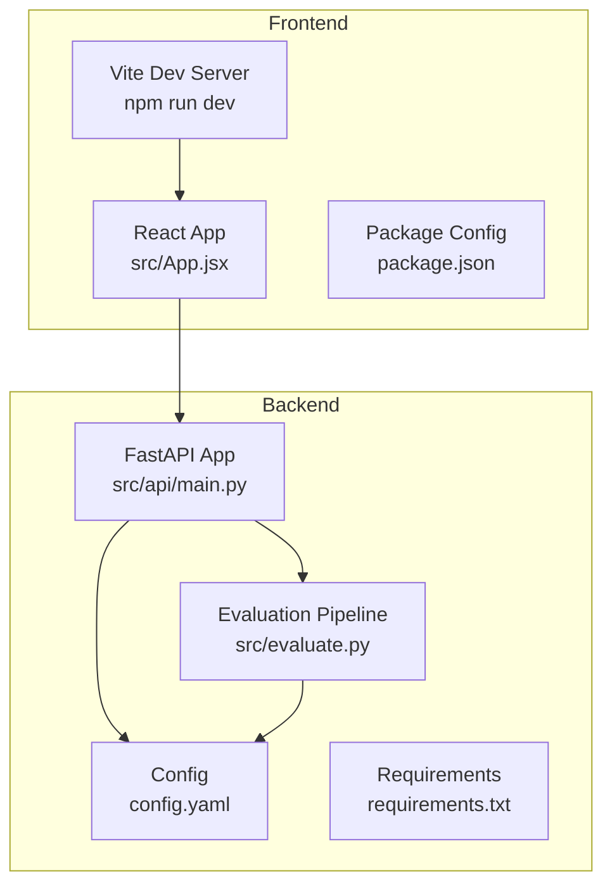
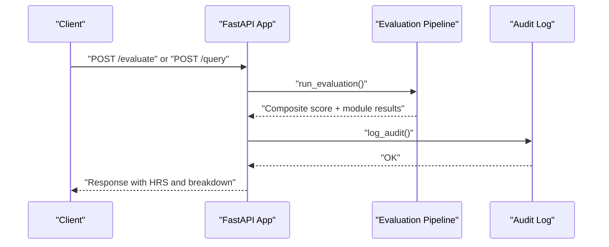

# Getting Started

<cite>
**Referenced Files in This Document**
- [README.md](file://README.md)
- [START_INSTRUCTIONS.txt](file://START_INSTRUCTIONS.txt)
- [Backend/README.md](file://Backend/README.md)
- [Frontend/README.md](file://Frontend/README.md)
- [Backend/requirements.txt](file://Backend/requirements.txt)
- [Frontend/package.json](file://Frontend/package.json)
- [Backend/config.yaml](file://Backend/config.yaml)
- [Backend/src/api/main.py](file://Backend/src/api/main.py)
- [Backend/src/evaluate.py](file://Backend/src/evaluate.py)
- [Backend/src/pipeline/generator.py](file://Backend/src/pipeline/generator.py)
- [Backend/src/modules/__init__.py](file://Backend/src/modules/__init__.py)
- [start.bat](file://start.bat)
- [vercel.json](file://vercel.json)
</cite>

## Table of Contents
1. [Introduction](#introduction)
2. [Project Structure](#project-structure)
3. [Prerequisites](#prerequisites)
4. [Installation](#installation)
5. [Quick Start](#quick-start)
6. [Basic Safety Evaluations](#basic-safety-evaluations)
7. [Verification Commands](#verification-commands)
8. [Initial Configuration Recommendations](#initial-configuration-recommendations)
9. [Troubleshooting Guide](#troubleshooting-guide)
10. [Conclusion](#conclusion)

## Introduction
MediRAG 3.0 is a comprehensive safety and audit layer for medical AI systems. It evaluates LLM-generated answers against trusted medical literature, providing a Health Risk Score (HRS) and actionable insights to prevent potentially dangerous hallucinations in clinical applications. This guide focuses on rapid deployment and initial setup for both backend (FastAPI) and frontend (React/Vite), including environment preparation, dependency installation, configuration, and basic safety evaluation workflows.

## Project Structure
The project is organized into two primary components:
- Backend: FastAPI application with evaluation pipeline, retrieval, and ingestion capabilities
- Frontend: React application with Vite for development and UI components

**Diagram sources**
- [Backend/src/api/main.py](file://Backend/src/api/main.py)
- [Backend/src/evaluate.py](file://Backend/src/evaluate.py)
- [Backend/config.yaml](file://Backend/config.yaml)
- [Backend/requirements.txt](file://Backend/requirements.txt)
- [Frontend/package.json](file://Frontend/package.json)
- [Frontend/src/App.jsx](file://Frontend/src/App.jsx)

**Section sources**
- [README.md](file://README.md)
- [Backend/README.md](file://Backend/README.md)
- [Frontend/README.md](file://Frontend/README.md)

## Prerequisites
- Python 3.10 or newer for backend compatibility
- Node.js and npm for frontend development
- System memory sufficient for NLP models and FAISS indexing
- Optional: Local LLM runtime (e.g., Ollama) or cloud LLM credentials for generation and evaluation

Key backend dependency constraints include:
- FAISS CPU version 1.9.0 or newer
- Torch 2.5.0 or newer
- Transformers 4.44.0 or newer
- NumPy less than 2.0
- Pydantic 2.9.0 or newer

Frontend dependencies include React 19, Vite, and supporting libraries for UI and routing.

**Section sources**
- [Backend/requirements.txt](file://Backend/requirements.txt)
- [Frontend/package.json](file://Frontend/package.json)

## Installation
Follow these steps to prepare your environment and install dependencies for both backend and frontend.

### Backend Setup
1. Navigate to the Backend directory and create a virtual environment:
   - Use a Python 3.10+ interpreter to create and activate a virtual environment
2. Install Python dependencies:
   - Install packages listed in requirements.txt
3. Verify installation:
   - Confirm that all required packages are installed without conflicts

### Frontend Setup
1. Navigate to the Frontend directory
2. Install Node.js dependencies:
   - Run the package manager install command
3. Verify installation:
   - Ensure Vite and React dependencies are present

Notes:
- The backend uses Uvicorn for ASGI serving; the frontend uses Vite for development
- Environment variables for LLM providers are loaded from configuration or environment files

**Section sources**
- [README.md](file://README.md)
- [START_INSTRUCTIONS.txt](file://START_INSTRUCTIONS.txt)
- [Backend/requirements.txt](file://Backend/requirements.txt)
- [Frontend/package.json](file://Frontend/package.json)

## Quick Start
Launch the backend and frontend servers concurrently for immediate development access.

### Option A: Manual Start (Two Terminals)
- Terminal 1 (Backend):
  - Change to the Backend directory
  - Activate the Python virtual environment
  - Start the FastAPI server on port 8000
- Terminal 2 (Frontend):
  - Change to the Frontend directory
  - Install dependencies if needed
  - Start the Vite development server

Access the frontend at http://localhost:5173 and the backend API at http://localhost:8000.

### Option B: Windows Batch Script
- Run the provided batch script to launch both services simultaneously in separate command windows

### API Documentation
- After starting the backend, view the interactive API docs at http://localhost:8000/docs

**Section sources**
- [README.md](file://README.md)
- [START_INSTRUCTIONS.txt](file://START_INSTRUCTIONS.txt)
- [start.bat](file://start.bat)

## Basic Safety Evaluations
Perform a safety evaluation using the backend’s evaluation endpoint or the end-to-end query pipeline.

### Evaluate a Provided Answer
- Send a request to the evaluation endpoint with:
  - Question text
  - Generated answer
  - Context chunks (retrieved from your knowledge base)
  - Optional: Toggle RAGAS evaluation if a cloud LLM backend is available

The evaluation pipeline runs four modules:
- Faithfulness scoring (NLI-based grounding)
- Entity verification (SciSpaCy + RxNorm)
- Source credibility ranking
- Contradiction detection

Results include a composite score, Health Risk Score (HRS), per-module breakdown, and intervention details if applicable.

### End-to-End Query and Evaluation
- Use the query endpoint to:
  - Retrieve top-k context chunks
  - Generate an answer using the configured LLM provider
  - Evaluate the answer with the full pipeline
  - Apply safety interventions if thresholds are exceeded

Safety gates:
- Critical block: Responses with very high HRS are blocked
- High-risk regeneration: Responses with elevated HRS trigger a strict regeneration

**Diagram sources**
- [Backend/src/api/main.py](file://Backend/src/api/main.py)
- [Backend/src/evaluate.py](file://Backend/src/evaluate.py)

**Section sources**
- [Backend/src/api/main.py](file://Backend/src/api/main.py)
- [Backend/src/evaluate.py](file://Backend/src/evaluate.py)
- [Backend/src/modules/__init__.py](file://Backend/src/modules/__init__.py)

## Verification Commands
Confirm your installation and service readiness with these checks:

- Backend health:
  - Call the health endpoint to verify the backend is running and report LLM availability
- Frontend accessibility:
  - Open the development server URL in a browser
- API documentation:
  - Visit the interactive docs endpoint to confirm route availability
- Database initialization:
  - Confirm that the audit log database is initialized and accessible

These checks ensure that both services are reachable and functioning as expected.

**Section sources**
- [Backend/src/api/main.py](file://Backend/src/api/main.py)
- [README.md](file://README.md)

## Initial Configuration Recommendations
Configure the system for local development versus production deployment:

- Local Development
  - Use a cloud LLM provider (e.g., Gemini) with an API key set via environment variables
  - Keep CORS enabled for local development
  - Enable verbose logging during setup

- Production Deployment
  - Restrict CORS to trusted origins
  - Store secrets in environment variables or a secure secret manager
  - Set appropriate logging levels and retention policies
  - Consider containerization and reverse proxy configuration

Environment variables and configuration keys:
- LLM provider selection and credentials
- API host and port
- FAISS index and metadata paths
- RxNorm API settings for entity verification

**Section sources**
- [Backend/config.yaml](file://Backend/config.yaml)
- [Backend/src/pipeline/generator.py](file://Backend/src/pipeline/generator.py)
- [Backend/src/api/main.py](file://Backend/src/api/main.py)
- [vercel.json](file://vercel.json)

## Troubleshooting Guide
Common setup issues and resolutions:

- Missing Dependencies
  - Backend: Install packages from requirements.txt
  - Frontend: Install dependencies using the package manager

- Python Version Compatibility
  - Ensure Python 3.10+ is used; some packages require newer versions

- FAISS and Model Loading
  - Use FAISS CPU 1.9.0+ as required by the backend
  - Verify model downloads and cache paths

- LLM Provider Setup
  - For cloud providers, set the appropriate API key in environment variables
  - For local LLMs, ensure the runtime is running and accessible at the configured base URL

- CORS and Port Conflicts
  - Adjust CORS settings for your environment
  - Ensure ports 8000 (backend) and 5173 (frontend) are available

- Database Initialization
  - Confirm that the audit log database initializes correctly on first run

- Frontend Environment Variables
  - Ensure the Vite environment variable for the API URL is set appropriately for your deployment

**Section sources**
- [Backend/requirements.txt](file://Backend/requirements.txt)
- [Frontend/package.json](file://Frontend/package.json)
- [Backend/src/pipeline/generator.py](file://Backend/src/pipeline/generator.py)
- [Backend/src/api/main.py](file://Backend/src/api/main.py)
- [START_INSTRUCTIONS.txt](file://START_INSTRUCTIONS.txt)

## Conclusion
You are now ready to deploy MediRAG 3.0 locally, run the backend and frontend servers, and perform basic safety evaluations. Use the evaluation endpoints to assess answer quality, apply safety interventions, and integrate the system into your medical AI workflows. For production, tighten security, configure environment variables, and validate model and index paths.