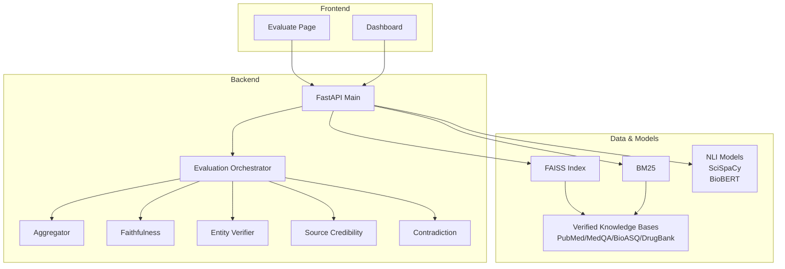
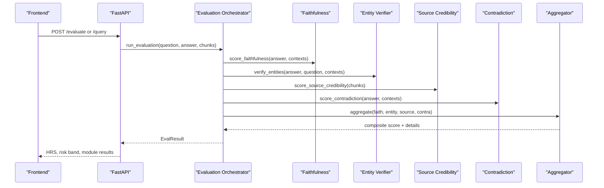
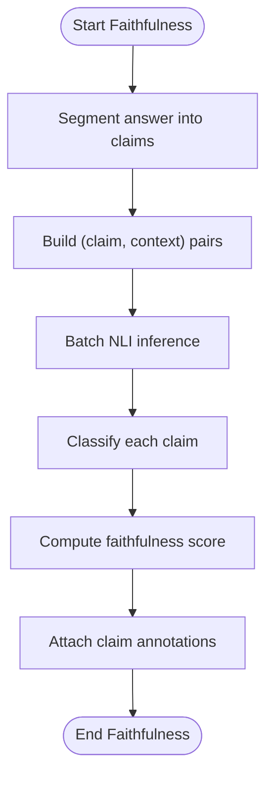
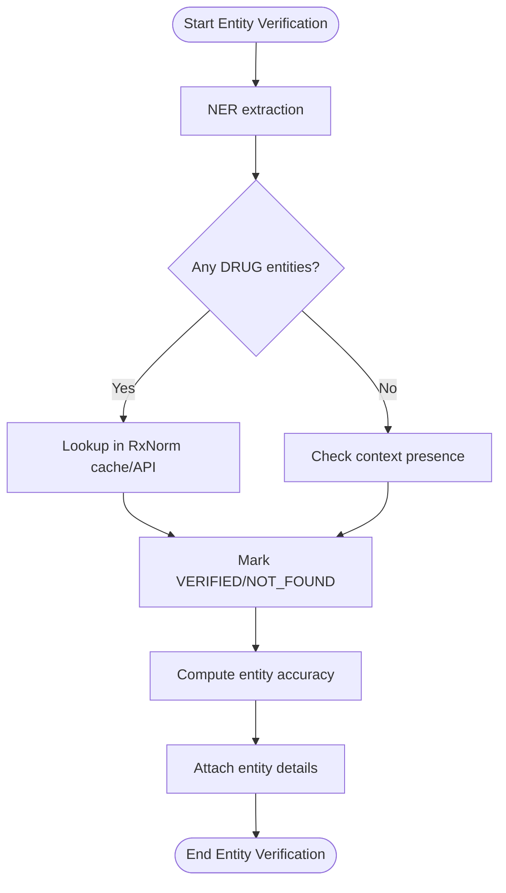
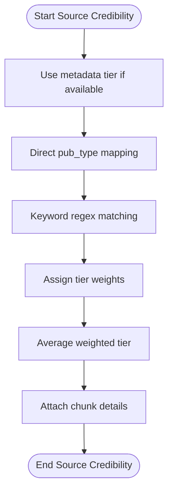
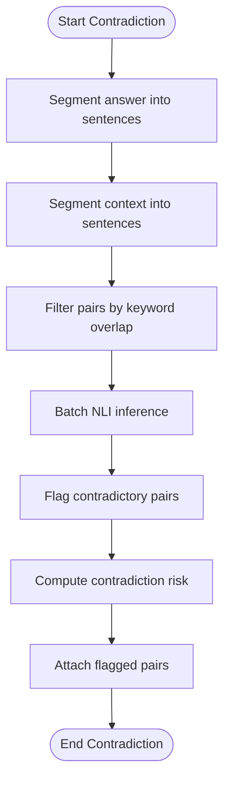
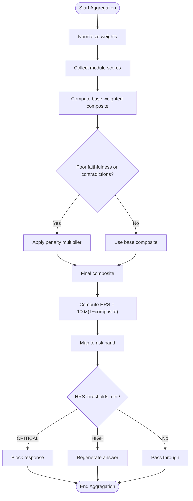
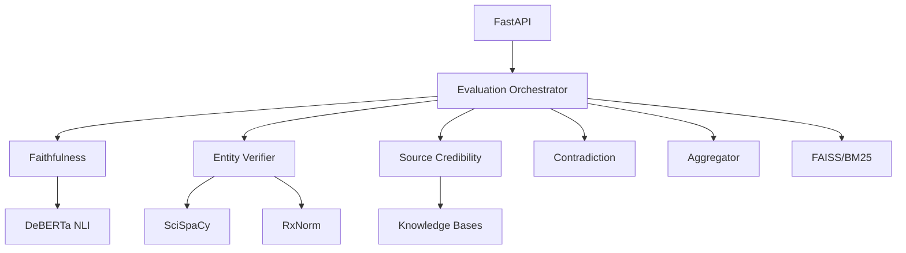

# Introduction and Purpose

<cite>
**Referenced Files in This Document**
- [README.md](file://README.md)
- [MediRAG_Eval_SRS.txt](file://Backend/MediRAG_Eval_SRS.txt)
- [config.yaml](file://Backend/config.yaml)
- [main.py](file://Backend/src/api/main.py)
- [evaluate.py](file://Backend/src/evaluate.py)
- [aggregator.py](file://Backend/src/evaluation/aggregator.py)
- [faithfulness.py](file://Backend/src/modules/faithfulness.py)
- [entity_verifier.py](file://Backend/src/modules/entity_verifier.py)
- [source_credibility.py](file://Backend/src/modules/source_credibility.py)
- [contradiction.py](file://Backend/src/modules/contradiction.py)
- [Dashboard.jsx](file://Frontend/src/pages/Dashboard.jsx)
- [Evaluate.jsx](file://Frontend/src/pages/Evaluate.jsx)
</cite>

## Table of Contents
1. [Introduction](#introduction)
2. [Project Structure](#project-structure)
3. [Core Components](#core-components)
4. [Architecture Overview](#architecture-overview)
5. [Detailed Component Analysis](#detailed-component-analysis)
6. [Dependency Analysis](#dependency-analysis)
7. [Performance Considerations](#performance-considerations)
8. [Troubleshooting Guide](#troubleshooting-guide)
9. [Conclusion](#conclusion)

## Introduction
MediRAG-Eval 3.0 exists because blind trust in medical AI is a dangerous gamble that can lead to real harm. Large language models are overconfident medical students who skipped the lecture on “not making stuff up.” In healthcare, a creative hallucination is not a feature—it is a safety hazard. MediRAG-Eval 3.0 is the forensic audit layer that sits between your sophisticated RAG pipeline and the patient. It automatically extracts, scores, and verifies every medical claim against trusted literature (PubMed, PMC, MedQA, BioASQ, DrugBank) so you can catch hallucinations before they reach a clinician.

The project’s mission is to prevent AI-related medical errors through automated verification against verified clinical knowledge bases. It provides a forensic audit of AI-generated answers using a four-layer evaluation engine, producing a composite Hallucination Risk Score (HRS) and rich audit reports. The system is designed for healthcare professionals, AI developers, and medical institutions who need reliable, auditable, and explainable safety guarantees for AI-assisted care.

Real-world scenarios where AI hallucinations cause harm:
- Misstating a drug’s starting dose by orders of magnitude (e.g., 500 mg vs. 500 g) leads to overdose or toxicity.
- Recommending a contraindicated medication for a specific condition or comorbidity.
- Providing conflicting advice within the same answer, undermining clinical reliability.
- Citing non-existent studies or misrepresenting evidence tiers, misleading practitioners.

How MediRAG-Eval 3.0 prevents such outcomes:
- Faithfulness scoring ties each claim to supporting evidence using NLI classification.
- Entity verification cross-checks drugs, dosages, and conditions against RxNorm and curated knowledge bases.
- Source credibility ranks evidence tiers (systematic reviews to case reports) to ensure grounding in high-quality literature.
- Contradiction detection identifies internal inconsistencies in the AI’s own answer.
- The aggregator produces a composite HRS and risk band, enabling automated safety gates and interventions.

Target audience:
- Healthcare professionals: validate AI advice against trusted sources and evidence tiers.
- AI developers: integrate forensic audit into RAG pipelines and CI/CD for safer deployments.
- Medical institutions: enforce governance, compliance, and auditability for AI systems in clinical workflows.

## Project Structure
At a high level, the system comprises:
- Backend API and evaluation engine (FastAPI + LangChain + FAISS + BM25 + NLP modules)
- Forensic audit modules (faithfulness, entity verification, source credibility, contradiction detection)
- Aggregation and safety gating (composite HRS, risk bands, intervention logic)
- Frontend dashboards and evaluation consoles for researchers, clinicians, and governance teams

**Diagram sources**
- [main.py:156-165](file://Backend/src/api/main.py#L156-L165)
- [evaluate.py:49-167](file://Backend/src/evaluate.py#L49-L167)
- [aggregator.py:47-167](file://Backend/src/evaluation/aggregator.py#L47-L167)
- [faithfulness.py:86-234](file://Backend/src/modules/faithfulness.py#L86-L234)
- [entity_verifier.py:146-283](file://Backend/src/modules/entity_verifier.py#L146-L283)
- [source_credibility.py:121-200](file://Backend/src/modules/source_credibility.py#L121-L200)
- [contradiction.py:94-251](file://Backend/src/modules/contradiction.py#L94-L251)

**Section sources**
- [README.md:13-53](file://README.md#L13-L53)
- [MediRAG_Eval_SRS.txt:35-76](file://Backend/MediRAG_Eval_SRS.txt#L35-L76)

## Core Components
- Faithfulness Scoring: Uses NLI to classify each claim as entailed, neutral, or contradicted relative to retrieved context. Thresholds and batching ensure robustness.
- Entity Verification: Extracts drugs, dosages, conditions, and procedures using SciSpaCy and validates against RxNorm and a local cache to detect dangerous mismatches.
- Source Credibility Ranking: Tiers evidence (systematic reviews to case reports) and computes a weighted average score per retrieved chunk.
- Contradiction Detection: Identifies internal contradictions by pairwise NLI checks between answer sentences and context sentences.
- Aggregation and Safety Gating: Computes a composite score and converts it to HRS (0–100), mapping to risk bands (LOW, MODERATE, HIGH, CRITICAL). The API applies automated interventions for high-risk outputs.

These components collectively implement the forensic audit layer concept, verifying AI claims against trusted medical literature and enforcing safety gates.

**Section sources**
- [MediRAG_Eval_SRS.txt:149-334](file://Backend/MediRAG_Eval_SRS.txt#L149-L334)
- [config.yaml:9-43](file://Backend/config.yaml#L9-L43)
- [aggregator.py:47-167](file://Backend/src/evaluation/aggregator.py#L47-L167)

## Architecture Overview
The system operates as a forensic audit pipeline that evaluates AI answers post-generation. It retrieves context from FAISS and BM25, runs the four modules, aggregates scores into HRS, and optionally applies safety interventions.

**Diagram sources**
- [main.py:223-302](file://Backend/src/api/main.py#L223-L302)
- [evaluate.py:49-167](file://Backend/src/evaluate.py#L49-L167)
- [aggregator.py:47-167](file://Backend/src/evaluation/aggregator.py#L47-L167)

**Section sources**
- [README.md:33-53](file://README.md#L33-L53)
- [MediRAG_Eval_SRS.txt:303-347](file://Backend/MediRAG_Eval_SRS.txt#L303-L347)

## Detailed Component Analysis

### Faithfulness Scoring
Purpose: Determine whether each claim in the AI answer is supported by the retrieved context using NLI classification.

Key behaviors:
- Sentence segmentation and claim decomposition
- Batched NLI scoring against all context-document pairs
- Classification thresholds for entailment, contradiction, and neutrality
- Detailed claim-level annotations with best-matching chunk and NLI scores

**Diagram sources**
- [faithfulness.py:86-234](file://Backend/src/modules/faithfulness.py#L86-L234)

**Section sources**
- [MediRAG_Eval_SRS.txt:149-194](file://Backend/MediRAG_Eval_SRS.txt#L149-L194)
- [config.yaml:10-16](file://Backend/config.yaml#L10-L16)

### Entity Verification
Purpose: Verify drugs, dosages, and clinical entities against RxNorm and contextual presence.

Key behaviors:
- SciSpaCy NER extraction for DRUG, DOSAGE, CONDITION, PROCEDURE
- RxNorm cache lookup with live API fallback
- Severity mapping for flagged entities (CRITICAL/MODERATE/MINOR)
- Contextual presence checks for non-drug entities

**Diagram sources**
- [entity_verifier.py:146-283](file://Backend/src/modules/entity_verifier.py#L146-L283)

**Section sources**
- [MediRAG_Eval_SRS.txt:195-224](file://Backend/MediRAG_Eval_SRS.txt#L195-L224)
- [config.yaml:16-22](file://Backend/config.yaml#L16-L22)

### Source Credibility Ranking
Purpose: Rank retrieved sources by evidence tier and compute a weighted average score.

Key behaviors:
- Tier classification (systematic review, clinical guideline, research abstract, review article, clinical case)
- Keyword-based fallback when metadata is unavailable
- Per-chunk details with matched keywords and tier numbers

**Diagram sources**
- [source_credibility.py:121-200](file://Backend/src/modules/source_credibility.py#L121-L200)

**Section sources**
- [MediRAG_Eval_SRS.txt:225-249](file://Backend/MediRAG_Eval_SRS.txt#L225-L249)
- [config.yaml:24-25](file://Backend/config.yaml#L24-L25)

### Contradiction Detection
Purpose: Detect internal contradictions in the AI answer by pairwise NLI checks between answer sentences and context sentences.

Key behaviors:
- Sentence segmentation for answer and context
- Topical overlap filtering to bound inference cost
- Threshold-based contradiction flagging and pair-level details

**Diagram sources**
- [contradiction.py:94-251](file://Backend/src/modules/contradiction.py#L94-L251)

**Section sources**
- [MediRAG_Eval_SRS.txt:250-259](file://Backend/MediRAG_Eval_SRS.txt#L250-L259)
- [config.yaml:27-30](file://Backend/config.yaml#L27-L30)

### Aggregation and Safety Gating
Purpose: Combine module scores into a composite evaluation and derive HRS with risk bands. Apply safety interventions for high-risk outputs.

Key behaviors:
- Weighted aggregation with configurable weights
- Non-linear penalties for poor faithfulness or contradictions
- HRS computation and risk band mapping
- API-level intervention logic (blocking or regeneration) based on HRS thresholds

**Diagram sources**
- [aggregator.py:47-167](file://Backend/src/evaluation/aggregator.py#L47-L167)
- [main.py:413-497](file://Backend/src/api/main.py#L413-L497)

**Section sources**
- [MediRAG_Eval_SRS.txt:303-333](file://Backend/MediRAG_Eval_SRS.txt#L303-L333)
- [config.yaml:32-42](file://Backend/config.yaml#L32-L42)
- [main.py:413-497](file://Backend/src/api/main.py#L413-L497)

## Dependency Analysis
The evaluation pipeline depends on:
- Retrieval: FAISS and BM25 indices for hybrid search
- NLP: DeBERTa NLI, SciSpaCy, BioBERT embeddings
- Knowledge bases: PubMed, MedQA, BioASQ, DrugBank
- API: FastAPI endpoints for evaluation and governance dashboards

**Diagram sources**
- [main.py:156-165](file://Backend/src/api/main.py#L156-L165)
- [evaluate.py:35-40](file://Backend/src/evaluate.py#L35-L40)
- [config.yaml:1-66](file://Backend/config.yaml#L1-L66)

**Section sources**
- [MediRAG_Eval_SRS.txt:105-149](file://Backend/MediRAG_Eval_SRS.txt#L105-L149)
- [README.md:80-87](file://README.md#L80-L87)

## Performance Considerations
- Latency targets: end-to-end under 30s (CPU), with dedicated warm-up for NLI models and retriever.
- Fault tolerance: partial results on module failure, with neutral fallbacks for unavailable modules.
- Scalability: thread-safe ingestion, atomic index updates, and optional RAGAS evaluation.

[No sources needed since this section provides general guidance]

## Troubleshooting Guide
Common issues and mitigations:
- NLI model loading failures: ensure transformers and sentence-transformers are installed; the orchestrator falls back to neutral scores when unavailable.
- SciSpaCy model missing: install the model via the provided URL; otherwise, entity verification returns neutral scores.
- RxNorm API timeouts: rely on the local cache; mismatches are logged and flagged appropriately.
- Ollama availability: the API health endpoint reports availability; RAGAS is disabled by default and can be enabled only when a backend is reachable.

**Section sources**
- [faithfulness.py:58-79](file://Backend/src/modules/faithfulness.py#L58-L79)
- [entity_verifier.py:70-86](file://Backend/src/modules/entity_verifier.py#L70-L86)
- [main.py:206-218](file://Backend/src/api/main.py#L206-L218)

## Conclusion
MediRAG-Eval 3.0 transforms AI safety from an afterthought into a built-in forensic audit layer. By combining faithfulness, entity verification, source credibility, and contradiction detection, it produces a composite Hallucination Risk Score (HRS) and actionable risk bands. The system safeguards patient safety through automated verification against trusted medical literature and intelligent interventions, serving healthcare professionals, AI developers, and institutions committed to responsible AI deployment in clinical settings.