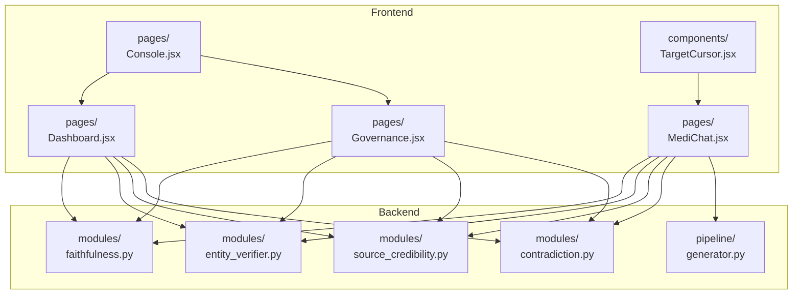
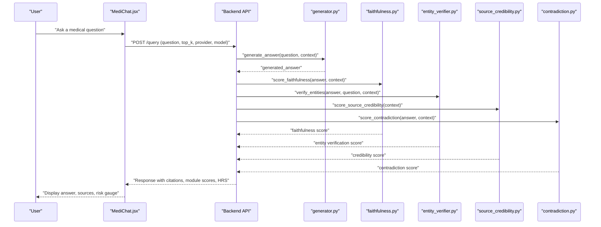
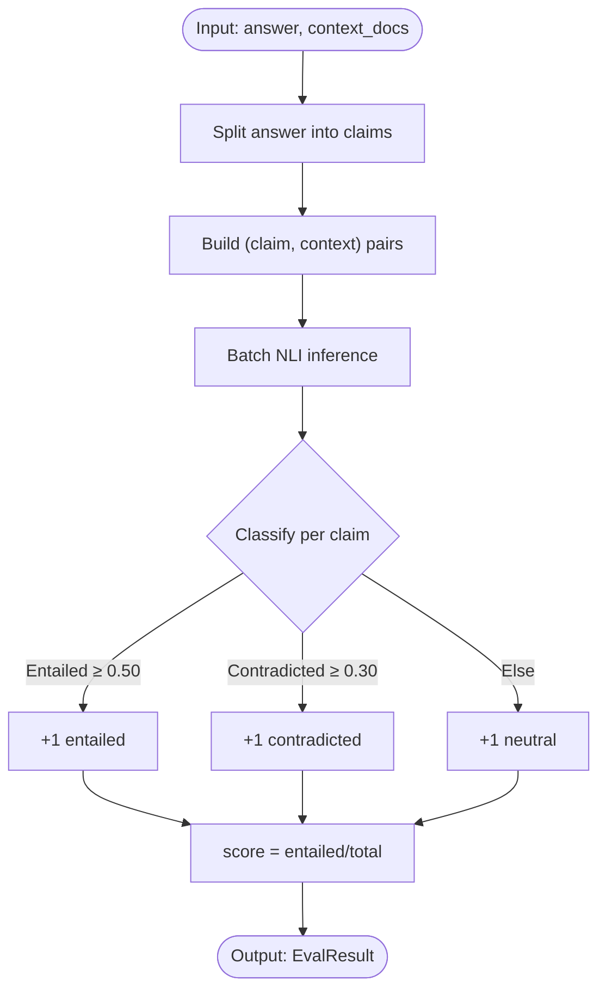
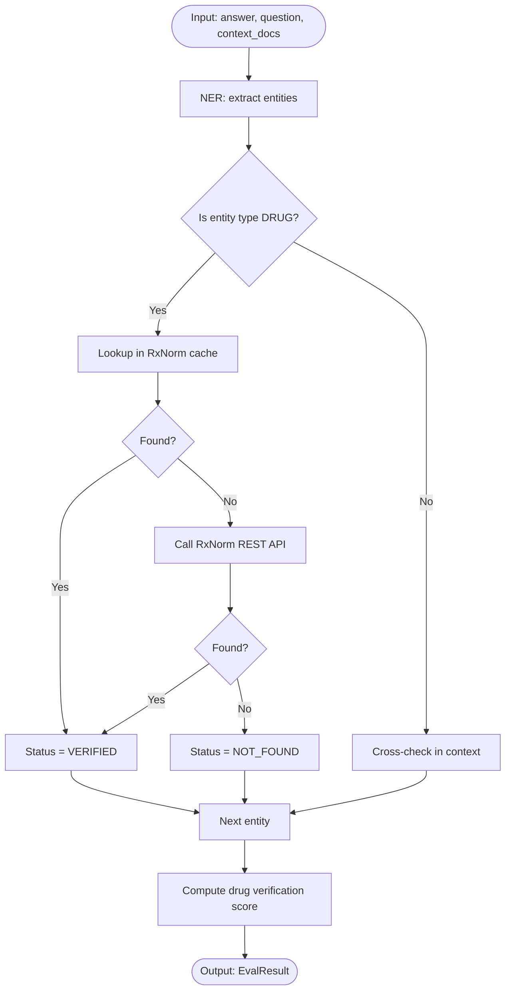
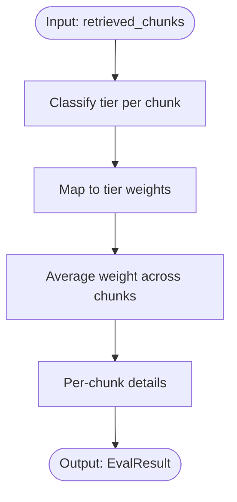
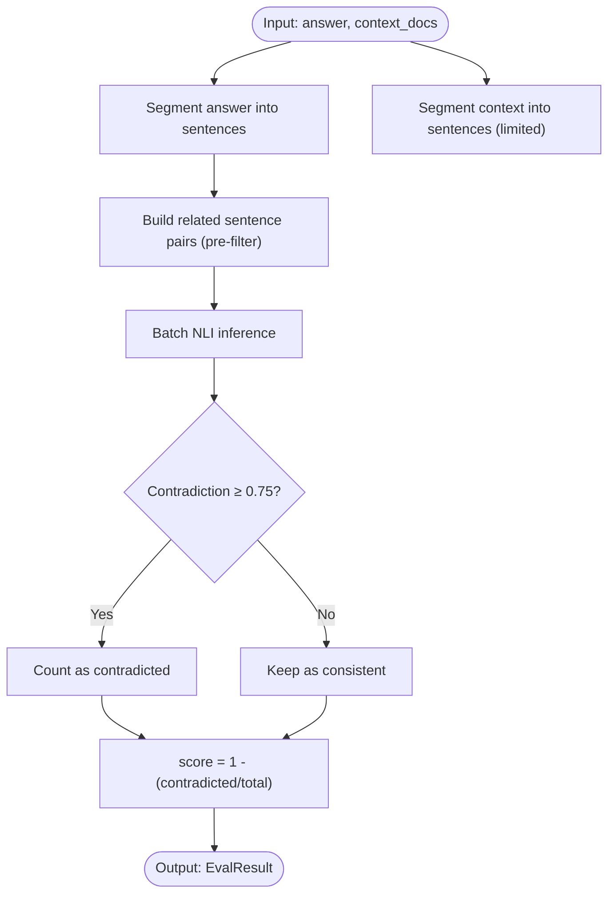
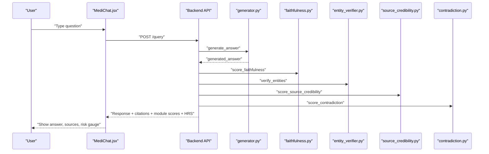
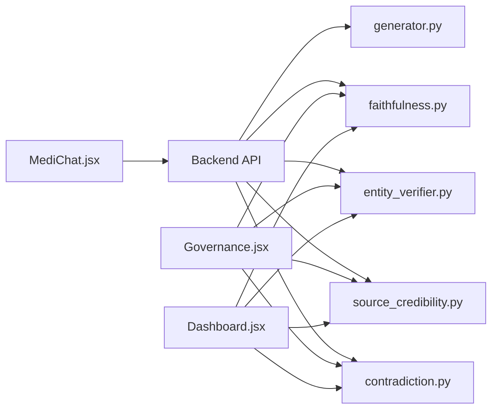

# Key Features Overview

<cite>
**Referenced Files in This Document**
- [faithfulness.py](file://Backend/src/modules/faithfulness.py)
- [entity_verifier.py](file://Backend/src/modules/entity_verifier.py)
- [source_credibility.py](file://Backend/src/modules/source_credibility.py)
- [contradiction.py](file://Backend/src/modules/contradiction.py)
- [generator.py](file://Backend/src/pipeline/generator.py)
- [MediChat.jsx](file://Frontend/src/pages/MediChat.jsx)
- [Dashboard.jsx](file://Frontend/src/pages/Dashboard.jsx)
- [Governance.jsx](file://Frontend/src/pages/Governance.jsx)
- [Console.jsx](file://Frontend/src/pages/Console.jsx)
- [TargetCursor.jsx](file://Frontend/src/components/TargetCursor.jsx)
</cite>

## Table of Contents
1. [Introduction](#introduction)
2. [Project Structure](#project-structure)
3. [Core Components](#core-components)
4. [Architecture Overview](#architecture-overview)
5. [Detailed Component Analysis](#detailed-component-analysis)
6. [Dependency Analysis](#dependency-analysis)
7. [Performance Considerations](#performance-considerations)
8. [Troubleshooting Guide](#troubleshooting-guide)
9. [Conclusion](#conclusion)

## Introduction
This document presents the key features overview for MediRAG 3.0, focusing on the five major components that define the system’s safety and governance capabilities. It explains the four-layer audit engine (Faithfulness Scorer, Medical Entity Verifier, Source Credibility Ranking, Contradiction Detection) and how each layer contributes to safety evaluation. It also documents the MediChat AI interface with real-time hallucination risk scoring, document-aware chat capabilities, the app integration console, the AI governance dashboard, and the federated dataset section. The content balances conceptual overviews for stakeholders with technical highlights for developers, using terminology consistent with the codebase such as target-lock cursor, hallucination risk scoring, and verified clinical knowledge bases.

## Project Structure
MediRAG 3.0 is organized into a backend Python service and a frontend React application. The backend exposes a modular evaluation engine and a retrieval-augmented generation pipeline, while the frontend provides interactive dashboards, governance tools, and a chat interface.

**Diagram sources**
- [faithfulness.py](file://Backend/src/modules/faithfulness.py)
- [entity_verifier.py](file://Backend/src/modules/entity_verifier.py)
- [source_credibility.py](file://Backend/src/modules/source_credibility.py)
- [contradiction.py](file://Backend/src/modules/contradiction.py)
- [generator.py](file://Backend/src/pipeline/generator.py)
- [MediChat.jsx](file://Frontend/src/pages/MediChat.jsx)
- [Dashboard.jsx](file://Frontend/src/pages/Dashboard.jsx)
- [Governance.jsx](file://Frontend/src/pages/Governance.jsx)
- [Console.jsx](file://Frontend/src/pages/Console.jsx)
- [TargetCursor.jsx](file://Frontend/src/components/TargetCursor.jsx)

**Section sources**
- [MediChat.jsx](file://Frontend/src/pages/MediChat.jsx)
- [Console.jsx](file://Frontend/src/pages/Console.jsx)
- [Dashboard.jsx](file://Frontend/src/pages/Dashboard.jsx)
- [Governance.jsx](file://Frontend/src/pages/Governance.jsx)
- [TargetCursor.jsx](file://Frontend/src/components/TargetCursor.jsx)
- [faithfulness.py](file://Backend/src/modules/faithfulness.py)
- [entity_verifier.py](file://Backend/src/modules/entity_verifier.py)
- [source_credibility.py](file://Backend/src/modules/source_credibility.py)
- [contradiction.py](file://Backend/src/modules/contradiction.py)
- [generator.py](file://Backend/src/pipeline/generator.py)

## Core Components
- Four-layer audit engine:
  - Faithfulness Scorer: Claims-based NLI verification of answers against retrieved context.
  - Medical Entity Verifier: Named-entity extraction and RxNorm-based verification for drugs.
  - Source Credibility Ranking: Evidence-tier weighting of retrieved documents.
  - Contradiction Detection: Pairwise contradiction detection between answer and context.
- MediChat AI interface:
  - Real-time hallucination risk scoring (HRS).
  - Document-aware chat with source citations and relevance scoring.
  - Target-lock cursor for immersive UX.
- App integration console:
  - Centralized evaluation engine configuration and controls.
  - Researcher, patient experience, and governance modes.
- AI governance dashboard:
  - Live system health, average HRS, critical alerts, and safety interventions.
  - Module score comparison and recent evaluation logs.
- Federated dataset section:
  - Verified clinical knowledge bases and source tiers surfaced in chat and governance views.

**Section sources**
- [faithfulness.py](file://Backend/src/modules/faithfulness.py)
- [entity_verifier.py](file://Backend/src/modules/entity_verifier.py)
- [source_credibility.py](file://Backend/src/modules/source_credibility.py)
- [contradiction.py](file://Backend/src/modules/contradiction.py)
- [MediChat.jsx](file://Frontend/src/pages/MediChat.jsx)
- [Dashboard.jsx](file://Frontend/src/pages/Dashboard.jsx)
- [Governance.jsx](file://Frontend/src/pages/Governance.jsx)
- [Console.jsx](file://Frontend/src/pages/Console.jsx)
- [TargetCursor.jsx](file://Frontend/src/components/TargetCursor.jsx)

## Architecture Overview
The system integrates frontend dashboards and chat with backend evaluation modules and a retrieval-augmented generation pipeline. The MediChat interface sends queries to the backend, which orchestrates retrieval, generation, and safety evaluation, then returns a response enriched with citations, module scores, and risk bands.

**Diagram sources**
- [MediChat.jsx](file://Frontend/src/pages/MediChat.jsx)
- [generator.py](file://Backend/src/pipeline/generator.py)
- [faithfulness.py](file://Backend/src/modules/faithfulness.py)
- [entity_verifier.py](file://Backend/src/modules/entity_verifier.py)
- [source_credibility.py](file://Backend/src/modules/source_credibility.py)
- [contradiction.py](file://Backend/src/modules/contradiction.py)

## Detailed Component Analysis

### Four-Layer Audit Engine

#### Faithfulness Scorer
- Purpose: Decomposes the LLM answer into claims and checks whether each claim is supported by the retrieved context using a cross-encoder NLI model.
- Thresholds: Entailment ≥ 0.50, Contradiction ≥ 0.30, otherwise Neutral.
- Outputs: A score in [0,1] representing proportion of entailed claims, plus per-claim details and latency.
- Practical example: If an answer claims “Metformin reduces A1C,” and the context supports this, the claim is marked ENTAILED; otherwise CONTRADICTED or NEUTRAL.

**Diagram sources**
- [faithfulness.py](file://Backend/src/modules/faithfulness.py)

**Section sources**
- [faithfulness.py](file://Backend/src/modules/faithfulness.py)

#### Medical Entity Verifier
- Purpose: Extracts medical entities (DRUG, DOSAGE, CONDITION, PROCEDURE) using SciSpaCy NER and verifies drugs against RxNorm cache or REST API.
- Verification pipeline:
  - Offline cache lookup (fast).
  - Live API fallback if not found.
  - Optional cross-check against context.
- Outputs: Score based on verified drugs, plus entity-level status and severity mapping for flagged items.
- Practical example: If “Lisinopril” resolves to an RxNorm identifier, the entity is VERIFIED; if a brand/generic mismatch is detected, it is FLAGGED with severity.

**Diagram sources**
- [entity_verifier.py](file://Backend/src/modules/entity_verifier.py)

**Section sources**
- [entity_verifier.py](file://Backend/src/modules/entity_verifier.py)

#### Source Credibility Ranking
- Purpose: Assigns weights to retrieved chunks based on publication type/evidence tier.
- Tier weights: Clinical Guideline (1.0), Systematic Review (0.85), Research Abstract (0.70), Review Article (0.60), Clinical Case (0.50), Unknown (0.30).
- Classification: Metadata-first (tier_type), then direct pub_type mapping, then keyword regex fallback.
- Outputs: Average weighted tier across chunks, plus per-chunk details.
- Practical example: A retrieved abstract receives a lower weight than a systematic review, influencing the final safety score.

**Diagram sources**
- [source_credibility.py](file://Backend/src/modules/source_credibility.py)

**Section sources**
- [source_credibility.py](file://Backend/src/modules/source_credibility.py)

#### Contradiction Detection
- Purpose: Detects contradictions between answer sentences and context sentences using NLI with a conservative threshold.
- Pre-filter: Limits context sentences per chunk and caps total pairs to manage latency.
- Outputs: A score in [0,1] indicating proportion of non-contradicted sentence pairs.
- Practical example: If a sentence in the answer contradicts a sentence in the context, it increases the contradiction count and lowers the score.

**Diagram sources**
- [contradiction.py](file://Backend/src/modules/contradiction.py)

**Section sources**
- [contradiction.py](file://Backend/src/modules/contradiction.py)

### MediChat AI Interface
- Real-time hallucination risk scoring (HRS): A risk gauge displays the likelihood of hallucinations, with color-coded bands and thresholds.
- Document-aware chat: Responses include verified source citations, relevance scores, and evidence tiers.
- Target-lock cursor: An immersive animated cursor that highlights interactive targets for enhanced UX.
- Practical example: A user asks about diabetes medication; the chat shows a low-risk score, cites a systematic review, and lists supporting evidence.

**Diagram sources**
- [MediChat.jsx](file://Frontend/src/pages/MediChat.jsx)
- [generator.py](file://Backend/src/pipeline/generator.py)
- [faithfulness.py](file://Backend/src/modules/faithfulness.py)
- [entity_verifier.py](file://Backend/src/modules/entity_verifier.py)
- [source_credibility.py](file://Backend/src/modules/source_credibility.py)
- [contradiction.py](file://Backend/src/modules/contradiction.py)

**Section sources**
- [MediChat.jsx](file://Frontend/src/pages/MediChat.jsx)
- [TargetCursor.jsx](file://Frontend/src/components/TargetCursor.jsx)

### App Integration Console
- Central hub for configuring the evaluation engine and switching between researcher, patient experience, and governance modes.
- Live controls for provider selection, model choice, API keys, Top-K chunks, and toggles for slower evaluation modes.
- Practical example: A developer configures Mistral as the provider, sets the model, and adjusts Top-K to balance speed and accuracy.

**Section sources**
- [Console.jsx](file://Frontend/src/pages/Console.jsx)

### AI Governance Dashboard
- Live KPIs: Total evaluations, average HRS, critical alerts, and safety interventions.
- Module score comparison: Faithfulness, Citation Reliability, Reasoning Consistency, Bias & Toxicity, Safety Compliance.
- Recent evaluations table: Timestamped logs with risk bands and intervention flags.
- Practical example: A compliance officer monitors average HRS and module failures to assess system stability.

**Section sources**
- [Dashboard.jsx](file://Frontend/src/pages/Dashboard.jsx)

### Federated Dataset Section
- Verified clinical knowledge bases and source tiers are surfaced in chat and governance views.
- Practical example: Users see citations from high-tier sources (e.g., clinical guidelines) with relevance bars and evidence labels.

**Section sources**
- [MediChat.jsx](file://Frontend/src/pages/MediChat.jsx)
- [Governance.jsx](file://Frontend/src/pages/Governance.jsx)

## Dependency Analysis
The frontend depends on backend endpoints for query processing and evaluation results. The backend modules are loosely coupled and can be composed independently, enabling flexible evaluation pipelines.

**Diagram sources**
- [MediChat.jsx](file://Frontend/src/pages/MediChat.jsx)
- [Dashboard.jsx](file://Frontend/src/pages/Dashboard.jsx)
- [Governance.jsx](file://Frontend/src/pages/Governance.jsx)
- [generator.py](file://Backend/src/pipeline/generator.py)
- [faithfulness.py](file://Backend/src/modules/faithfulness.py)
- [entity_verifier.py](file://Backend/src/modules/entity_verifier.py)
- [source_credibility.py](file://Backend/src/modules/source_credibility.py)
- [contradiction.py](file://Backend/src/modules/contradiction.py)

**Section sources**
- [MediChat.jsx](file://Frontend/src/pages/MediChat.jsx)
- [Dashboard.jsx](file://Frontend/src/pages/Dashboard.jsx)
- [Governance.jsx](file://Frontend/src/pages/Governance.jsx)
- [generator.py](file://Backend/src/pipeline/generator.py)
- [faithfulness.py](file://Backend/src/modules/faithfulness.py)
- [entity_verifier.py](file://Backend/src/modules/entity_verifier.py)
- [source_credibility.py](file://Backend/src/modules/source_credibility.py)
- [contradiction.py](file://Backend/src/modules/contradiction.py)

## Performance Considerations
- Latency control: The contradiction detector caps sentence pairs and limits context sentences per chunk to maintain responsiveness.
- Model caching: Faithfulness and contradiction share a cached NLI model instance to avoid redundant loads.
- Batch inference: Faithfulness and contradiction use batched NLI predictions to reduce overhead.
- Frontend UX: The target-lock cursor uses efficient animation updates and disables on mobile to preserve performance.

[No sources needed since this section provides general guidance]

## Troubleshooting Guide
- NLI model not installed: If sentence-transformers is missing, modules fall back to stub behavior or return neutral scores to avoid crashes.
- SciSpaCy model not installed: Entity verification raises an error requiring installation of the English clinical model.
- RxNorm cache missing: If the cache file is absent, the verifier falls back to live API calls; ensure network connectivity.
- Empty answer or no context: Safety modules return neutral or zero scores with appropriate details to avoid misleading results.
- Frontend cursor issues: On mobile devices, the target-lock cursor is disabled to improve compatibility.

**Section sources**
- [faithfulness.py](file://Backend/src/modules/faithfulness.py)
- [entity_verifier.py](file://Backend/src/modules/entity_verifier.py)
- [source_credibility.py](file://Backend/src/modules/source_credibility.py)
- [contradiction.py](file://Backend/src/modules/contradiction.py)
- [TargetCursor.jsx](file://Frontend/src/components/TargetCursor.jsx)

## Conclusion
MediRAG 3.0’s five major components deliver a robust, safety-focused AI system. The four-layer audit engine ensures grounded, verifiable, and consistent responses, while the MediChat interface provides real-time risk insights and document-aware interactions. The app integration console and AI governance dashboard enable developers and compliance officers to monitor, configure, and audit system behavior. Together, these components support high-stakes medical AI safety and regulatory alignment.