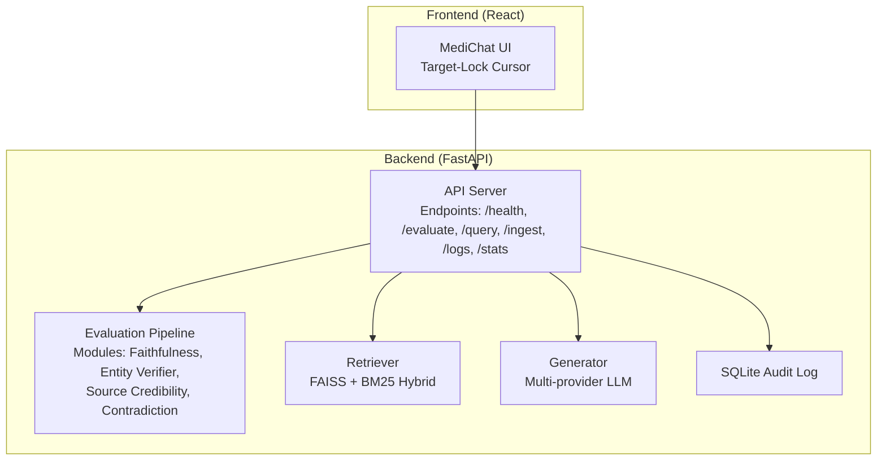
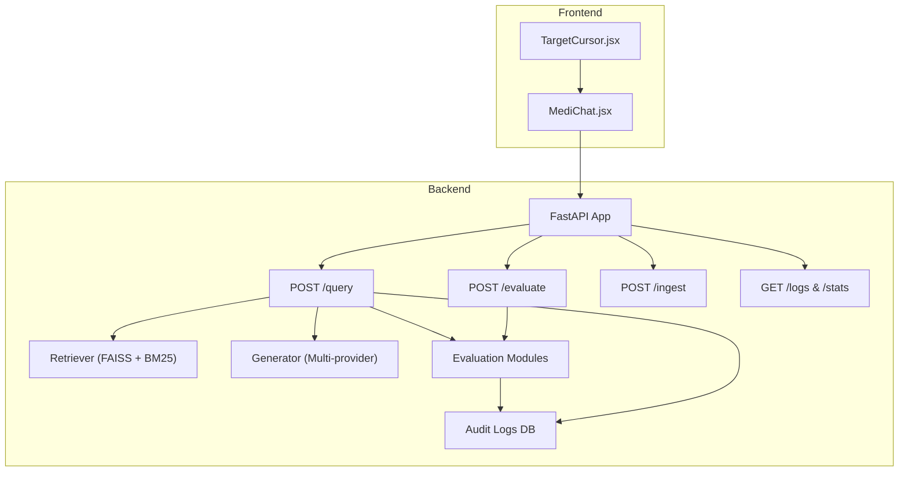
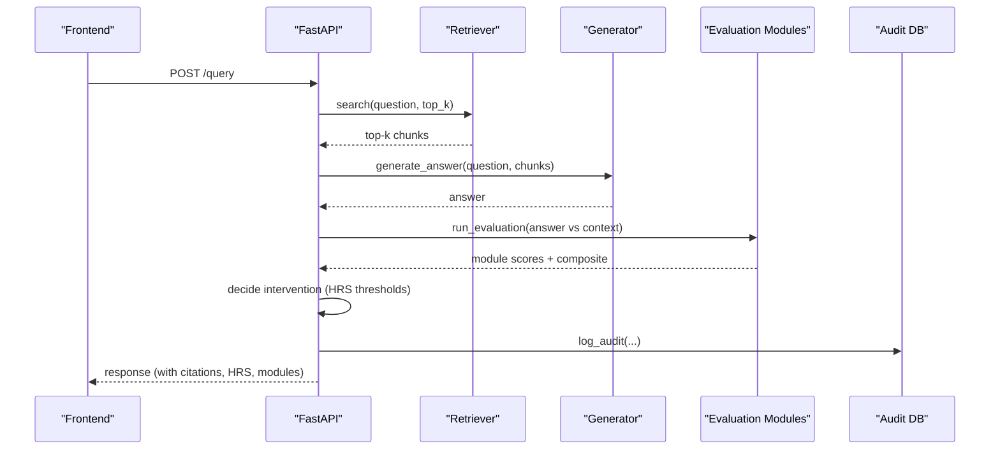
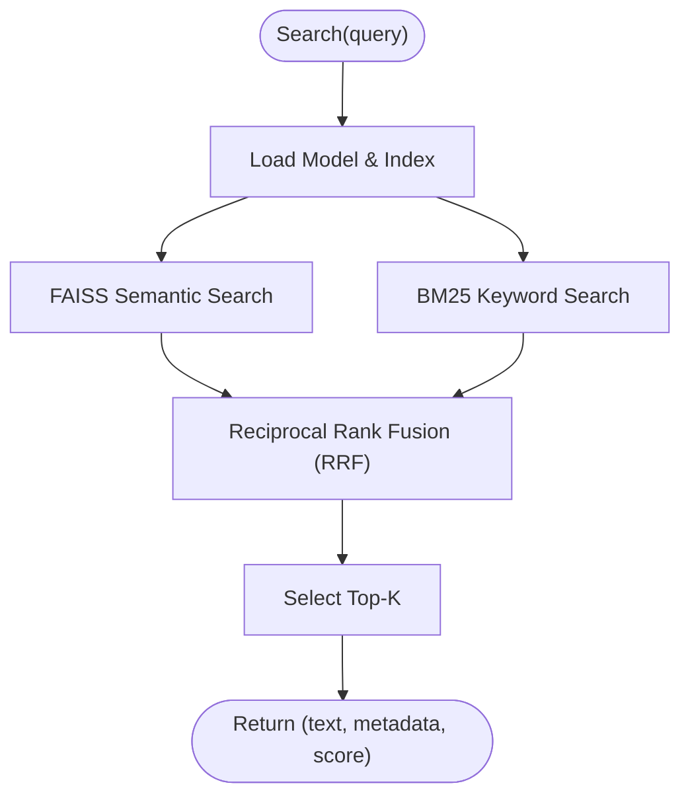
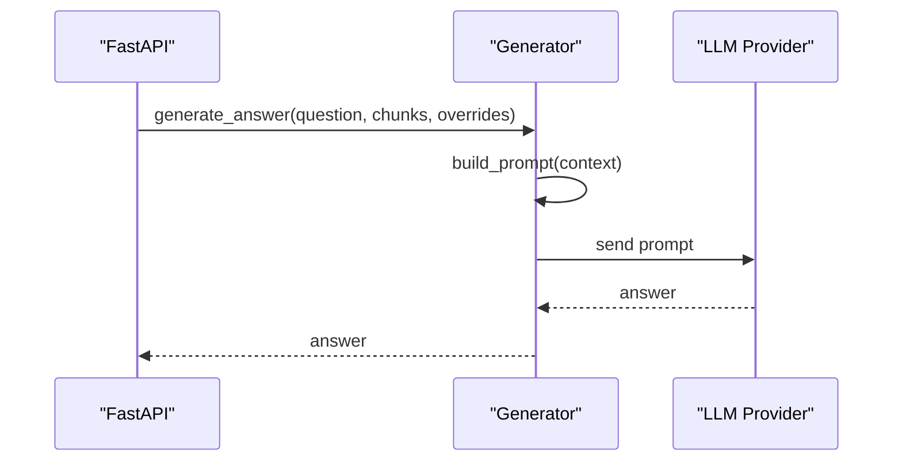
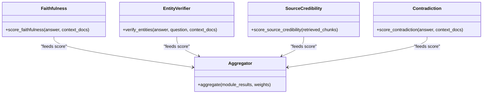
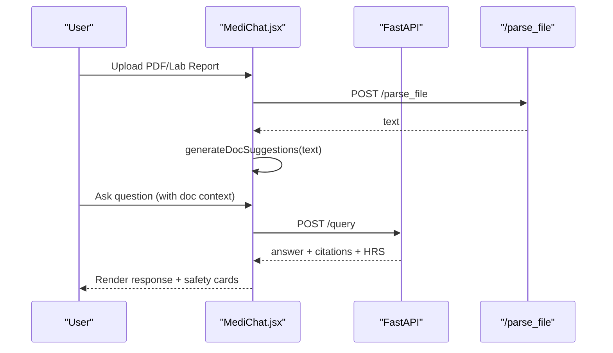
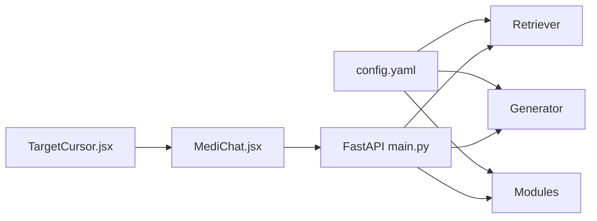

# Project Overview

<cite>
**Referenced Files in This Document**
- [README.md](file://README.md)
- [Backend/README.md](file://Backend/README.md)
- [Frontend/README.md](file://Frontend/README.md)
- [Backend/src/api/main.py](file://Backend/src/api/main.py)
- [Backend/src/modules/faithfulness.py](file://Backend/src/modules/faithfulness.py)
- [Backend/src/modules/entity_verifier.py](file://Backend/src/modules/entity_verifier.py)
- [Backend/src/modules/source_credibility.py](file://Backend/src/modules/source_credibility.py)
- [Backend/src/modules/contradiction.py](file://Backend/src/modules/contradiction.py)
- [Backend/src/pipeline/retriever.py](file://Backend/src/pipeline/retriever.py)
- [Backend/src/pipeline/generator.py](file://Backend/src/pipeline/generator.py)
- [Backend/config.yaml](file://Backend/config.yaml)
- [Frontend/src/pages/MediChat.jsx](file://Frontend/src/pages/MediChat.jsx)
- [Frontend/src/components/TargetCursor.jsx](file://Frontend/src/components/TargetCursor.jsx)
</cite>

## Table of Contents
1. [Introduction](#introduction)
2. [Project Structure](#project-structure)
3. [Core Components](#core-components)
4. [Architecture Overview](#architecture-overview)
5. [Detailed Component Analysis](#detailed-component-analysis)
6. [Dependency Analysis](#dependency-analysis)
7. [Performance Considerations](#performance-considerations)
8. [Troubleshooting Guide](#troubleshooting-guide)
9. [Conclusion](#conclusion)

## Introduction
MediRAG-Eval 3.0 is a forensic audit layer designed to protect patient safety by rigorously evaluating medical AI responses generated by Retrieval-Augmented Generation (RAG) pipelines. It sits between sophisticated AI systems and clinical decision-making, automatically extracting, scoring, and verifying every medical claim against trusted literature (PubMed, PMC, and curated datasets) to detect and mitigate hallucinations and unsafe outputs before they reach clinicians.

The system’s purpose is to transform speculative AI responses into auditable, grounded, and risk-scored answers. It provides:
- Real-time Hallucination Risk Scoring (HRS)
- Document-aware chat with smart suggestions
- AI governance dashboard with audit logs and compliance metrics
- Federated dataset integration with verified clinical knowledge bases

## Project Structure
The project is organized into two primary layers:
- Backend (FastAPI): Provides APIs for evaluation, retrieval, generation, ingestion, and governance dashboards.
- Frontend (React): Offers an immersive, glassmorphism-based UI with a “target-lock” cursor, real-time HRS visualization, and document-aware chat.

**Diagram sources**
- [Backend/src/api/main.py:156-173](file://Backend/src/api/main.py#L156-L173)
- [Backend/src/pipeline/retriever.py:39-61](file://Backend/src/pipeline/retriever.py#L39-L61)
- [Backend/src/pipeline/generator.py:344-412](file://Backend/src/pipeline/generator.py#L344-L412)
- [Backend/src/modules/faithfulness.py:86-91](file://Backend/src/modules/faithfulness.py#L86-L91)
- [Backend/src/modules/entity_verifier.py:146-152](file://Backend/src/modules/entity_verifier.py#L146-L152)
- [Backend/src/modules/source_credibility.py:121-129](file://Backend/src/modules/source_credibility.py#L121-L129)
- [Backend/src/modules/contradiction.py:94-106](file://Backend/src/modules/contradiction.py#L94-L106)

**Section sources**
- [README.md:13-30](file://README.md#L13-L30)
- [Backend/README.md:1-3](file://Backend/README.md#L1-L3)
- [Frontend/README.md:1-17](file://Frontend/README.md#L1-L17)

## Core Components
- Four-layer audit engine:
  - Faithfulness: NLI-based grounding against retrieved context.
  - Entity Verification: SciSpaCy + RxNorm for drug and condition accuracy.
  - Source Credibility: Tiered evidence ranking and relevance scoring.
  - Contradiction Detection: Internal consistency checks via NLI.
- Real-time HRS scoring: Composite risk score mapped to risk bands (Low, Moderate, High, Critical).
- Document-aware chat: Upload PDFs/Lab Reports to get smart follow-up suggestions and grounded answers.
- Governance dashboard: Audit logs, intervention statistics, and monthly trends.
- Federated dataset integration: Verified clinical knowledge bases surfaced in the UI.

**Section sources**
- [README.md:33-51](file://README.md#L33-L51)
- [Backend/src/api/main.py:223-302](file://Backend/src/api/main.py#L223-L302)
- [Backend/src/modules/faithfulness.py:86-234](file://Backend/src/modules/faithfulness.py#L86-L234)
- [Backend/src/modules/entity_verifier.py:146-283](file://Backend/src/modules/entity_verifier.py#L146-L283)
- [Backend/src/modules/source_credibility.py:121-200](file://Backend/src/modules/source_credibility.py#L121-L200)
- [Backend/src/modules/contradiction.py:94-251](file://Backend/src/modules/contradiction.py#L94-L251)

## Architecture Overview
MediRAG-Eval 3.0 combines a React frontend with a FastAPI backend. The frontend exposes a “target-lock” cursor and a document-aware chat panel. The backend orchestrates retrieval, generation, and evaluation, then applies intervention policies based on HRS thresholds.

**Diagram sources**
- [Backend/src/api/main.py:206-302](file://Backend/src/api/main.py#L206-L302)
- [Backend/src/api/main.py:308-519](file://Backend/src/api/main.py#L308-L519)
- [Backend/src/api/main.py:526-603](file://Backend/src/api/main.py#L526-L603)
- [Backend/src/api/main.py:608-648](file://Backend/src/api/main.py#L608-L648)
- [Backend/src/pipeline/retriever.py:149-250](file://Backend/src/pipeline/retriever.py#L149-L250)
- [Backend/src/pipeline/generator.py:344-462](file://Backend/src/pipeline/generator.py#L344-L462)
- [Backend/src/modules/faithfulness.py:86-234](file://Backend/src/modules/faithfulness.py#L86-L234)
- [Backend/src/modules/entity_verifier.py:146-283](file://Backend/src/modules/entity_verifier.py#L146-L283)
- [Backend/src/modules/source_credibility.py:121-200](file://Backend/src/modules/source_credibility.py#L121-L200)
- [Backend/src/modules/contradiction.py:94-251](file://Backend/src/modules/contradiction.py#L94-L251)

## Detailed Component Analysis

### Backend API Surface and Safety Interventions
- Endpoints:
  - GET /health: Liveness and Ollama availability.
  - POST /evaluate: Evaluate a question-answer-context triplet with module breakdown and HRS.
  - POST /query: End-to-end pipeline with retrieval, generation, evaluation, and intervention.
  - POST /ingest: Dynamic ingestion into FAISS/BM25 with thread-safe updates.
  - GET /logs and /stats: Governance dashboard data.
- Intervention policy:
  - HRS ≥ 86: CRITICAL block with a safety gate message.
  - HRS ≥ 40 or Faithfulness < 1.0: Strict regeneration and re-evaluation.
- Audit logging: Structured SQLite logs for governance and trend analysis.

**Diagram sources**
- [Backend/src/api/main.py:308-519](file://Backend/src/api/main.py#L308-L519)
- [Backend/src/pipeline/retriever.py:149-250](file://Backend/src/pipeline/retriever.py#L149-L250)
- [Backend/src/pipeline/generator.py:344-462](file://Backend/src/pipeline/generator.py#L344-L462)
- [Backend/src/modules/faithfulness.py:86-234](file://Backend/src/modules/faithfulness.py#L86-L234)
- [Backend/src/modules/entity_verifier.py:146-283](file://Backend/src/modules/entity_verifier.py#L146-L283)
- [Backend/src/modules/source_credibility.py:121-200](file://Backend/src/modules/source_credibility.py#L121-L200)
- [Backend/src/modules/contradiction.py:94-251](file://Backend/src/modules/contradiction.py#L94-L251)

**Section sources**
- [Backend/src/api/main.py:206-302](file://Backend/src/api/main.py#L206-L302)
- [Backend/src/api/main.py:308-519](file://Backend/src/api/main.py#L308-L519)
- [Backend/src/api/main.py:526-603](file://Backend/src/api/main.py#L526-L603)
- [Backend/src/api/main.py:608-648](file://Backend/src/api/main.py#L608-L648)

### Retrieval Engine (FAISS + BM25 Hybrid)
- Uses BioBERT embeddings (FAISS IndexFlatIP with cosine similarity).
- Builds BM25 index lazily and merges results via Reciprocal Rank Fusion (RRF).
- Supports dynamic ingestion and atomic index updates.

**Diagram sources**
- [Backend/src/pipeline/retriever.py:149-250](file://Backend/src/pipeline/retriever.py#L149-L250)

**Section sources**
- [Backend/src/pipeline/retriever.py:39-250](file://Backend/src/pipeline/retriever.py#L39-L250)
- [Backend/config.yaml:1-10](file://Backend/config.yaml#L1-L10)

### Generation Engine (Multi-Provider)
- Supports Gemini, OpenAI, Mistral, and Ollama.
- Builds grounded prompts with inline citations and strict mode for regeneration.
- Temperature and model selection configurable per request.

**Diagram sources**
- [Backend/src/pipeline/generator.py:344-412](file://Backend/src/pipeline/generator.py#L344-L412)
- [Backend/src/pipeline/generator.py:415-462](file://Backend/src/pipeline/generator.py#L415-L462)

**Section sources**
- [Backend/src/pipeline/generator.py:45-125](file://Backend/src/pipeline/generator.py#L45-L125)
- [Backend/src/pipeline/generator.py:177-231](file://Backend/src/pipeline/generator.py#L177-L231)
- [Backend/src/pipeline/generator.py:288-337](file://Backend/src/pipeline/generator.py#L288-L337)
- [Backend/src/pipeline/generator.py:344-462](file://Backend/src/pipeline/generator.py#L344-L462)

### Evaluation Modules
- Faithfulness: Sentence segmentation and NLI classification to measure entailment vs. contradiction.
- Entity Verifier: SciSpaCy NER + RxNorm cache/API for drug and condition verification.
- Source Credibility: Evidence tier weighting and keyword-based classification.
- Contradiction Detection: Pairwise NLI to flag internal inconsistencies.

**Diagram sources**
- [Backend/src/modules/faithfulness.py:86-234](file://Backend/src/modules/faithfulness.py#L86-L234)
- [Backend/src/modules/entity_verifier.py:146-283](file://Backend/src/modules/entity_verifier.py#L146-L283)
- [Backend/src/modules/source_credibility.py:121-200](file://Backend/src/modules/source_credibility.py#L121-L200)
- [Backend/src/modules/contradiction.py:94-251](file://Backend/src/modules/contradiction.py#L94-L251)

**Section sources**
- [Backend/src/modules/faithfulness.py:86-234](file://Backend/src/modules/faithfulness.py#L86-L234)
- [Backend/src/modules/entity_verifier.py:146-283](file://Backend/src/modules/entity_verifier.py#L146-L283)
- [Backend/src/modules/source_credibility.py:121-200](file://Backend/src/modules/source_credibility.py#L121-L200)
- [Backend/src/modules/contradiction.py:94-251](file://Backend/src/modules/contradiction.py#L94-L251)

### Frontend: Document-Aware Chat and Target-Lock Cursor
- MediChat integrates with the backend via /query and /parse_file.
- Smart suggestions derived from uploaded documents guide follow-up questions.
- Real-time HRS gauge and module pills visualize safety evaluation outcomes.
- Target-Lock cursor provides immersive, “command center” UX with snapping to interactive elements.

**Diagram sources**
- [Frontend/src/pages/MediChat.jsx:387-438](file://Frontend/src/pages/MediChat.jsx#L387-L438)
- [Frontend/src/pages/MediChat.jsx:770-800](file://Frontend/src/pages/MediChat.jsx#L770-L800)
- [Backend/src/api/main.py:653-677](file://Backend/src/api/main.py#L653-L677)

**Section sources**
- [Frontend/src/pages/MediChat.jsx:1-843](file://Frontend/src/pages/MediChat.jsx#L1-L843)
- [Frontend/src/components/TargetCursor.jsx:1-307](file://Frontend/src/components/TargetCursor.jsx#L1-L307)

## Dependency Analysis
- Backend FastAPI app initializes:
  - SQLite audit database
  - DeBERTa model pre-warm
  - Retriever pre-warm (BioBERT + FAISS index)
- Frontend mediates:
  - Environment-driven API URL and provider/model selection
  - Document parsing and suggestion generation
  - Real-time visualization of HRS and module scores

**Diagram sources**
- [Backend/config.yaml:1-66](file://Backend/config.yaml#L1-L66)
- [Backend/src/api/main.py:125-149](file://Backend/src/api/main.py#L125-L149)
- [Backend/src/pipeline/retriever.py:49-61](file://Backend/src/pipeline/retriever.py#L49-L61)
- [Backend/src/pipeline/generator.py:34-39](file://Backend/src/pipeline/generator.py#L34-L39)
- [Backend/src/modules/faithfulness.py:58-69](file://Backend/src/modules/faithfulness.py#L58-L69)
- [Frontend/src/pages/MediChat.jsx:331-339](file://Frontend/src/pages/MediChat.jsx#L331-L339)

**Section sources**
- [Backend/src/api/main.py:75-120](file://Backend/src/api/main.py#L75-L120)
- [Backend/src/api/main.py:125-149](file://Backend/src/api/main.py#L125-L149)
- [Backend/config.yaml:1-66](file://Backend/config.yaml#L1-L66)

## Performance Considerations
- Pre-warming: DeBERTa and Retriever are warmed at startup to avoid cold-start latency.
- Hybrid retrieval: FAISS (semantic) + BM25 (keyword) with RRF balances precision and recall.
- Batch inference: Faithfulness and contradiction modules batch NLI calls to reduce overhead.
- Thread-safe ingestion: FAISS/BM25 updates use atomic writes and locks to prevent corruption.
- Intervention thresholds: Reduce unnecessary regeneration by applying strict prompts only when needed.

[No sources needed since this section provides general guidance]

## Troubleshooting Guide
Common issues and remedies:
- Backend not reachable:
  - Verify /health endpoint and Ollama availability.
- FAISS index missing:
  - Ensure FAISS index and metadata are built and placed per config paths.
- Empty or low-quality answers:
  - Increase top_k, confirm LLM provider credentials, and check module scores for red flags.
- Document upload failures:
  - Confirm /parse_file endpoint works and uploaded file types are supported.
- Governance dashboard empty:
  - Check /logs and /stats endpoints and verify audit DB creation.

**Section sources**
- [Backend/src/api/main.py:206-218](file://Backend/src/api/main.py#L206-L218)
- [Backend/src/api/main.py:336-343](file://Backend/src/api/main.py#L336-L343)
- [Backend/src/api/main.py:537-540](file://Backend/src/api/main.py#L537-L540)
- [Backend/src/api/main.py:653-677](file://Backend/src/api/main.py#L653-L677)
- [Backend/src/api/main.py:608-648](file://Backend/src/api/main.py#L608-L648)

## Conclusion
MediRAG-Eval 3.0 delivers a robust, safety-first evaluation system for medical AI. By combining a hybrid retrieval engine, multi-provider generation, and a four-layer audit pipeline, it transforms speculative AI outputs into auditable, risk-scored, and clinically grounded responses. The React frontend augments this with a command-center UX, real-time HRS visualization, and document-aware chat, enabling both clinicians and developers to confidently integrate AI into patient care workflows.