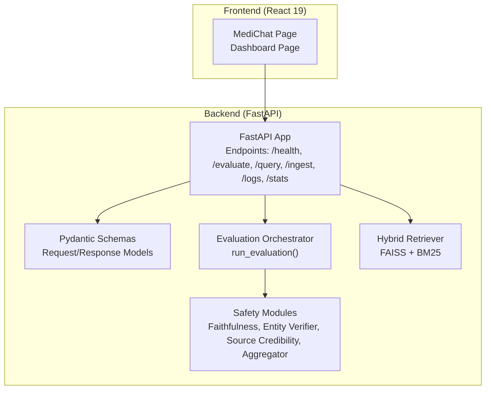
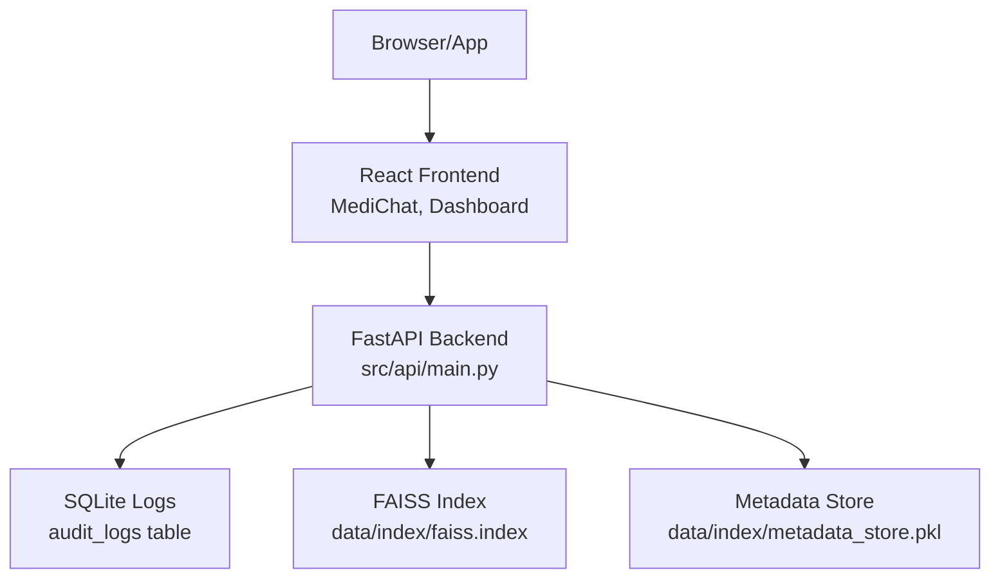
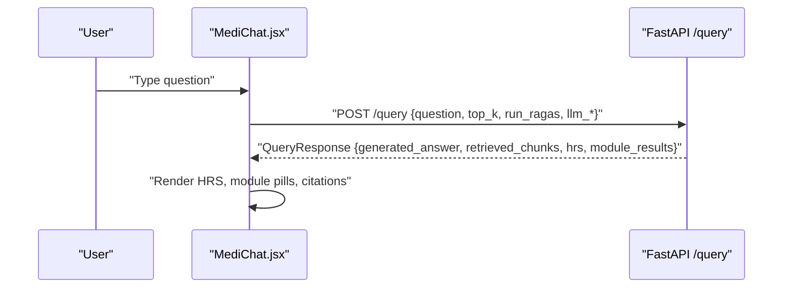
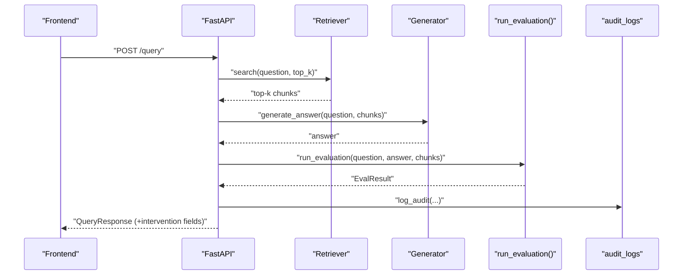
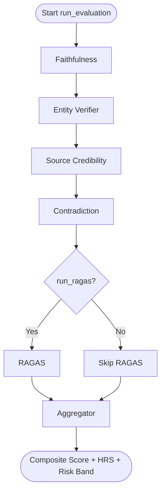
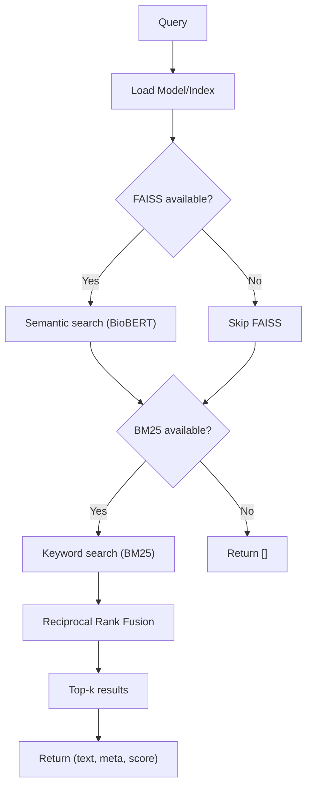
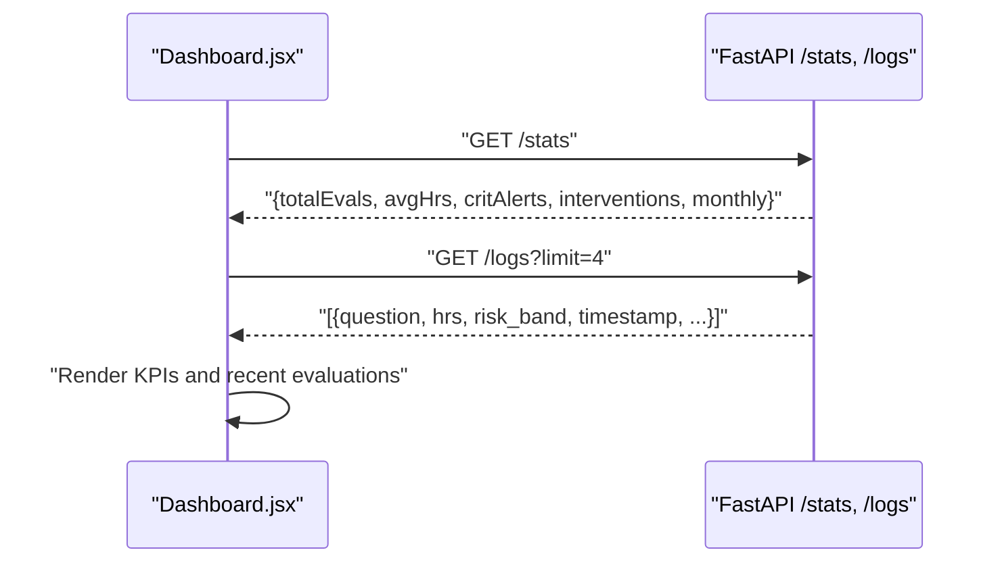
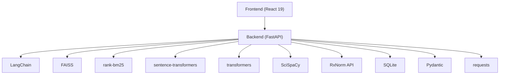

# System Architecture

<cite>
**Referenced Files in This Document**
- [README.md](file://README.md)
- [Backend/README.md](file://Backend/README.md)
- [Frontend/README.md](file://Frontend/README.md)
- [Backend/requirements.txt](file://Backend/requirements.txt)
- [Frontend/package.json](file://Frontend/package.json)
- [Backend/config.yaml](file://Backend/config.yaml)
- [Backend/src/api/main.py](file://Backend/src/api/main.py)
- [Backend/src/api/schemas.py](file://Backend/src/api/schemas.py)
- [Backend/src/evaluate.py](file://Backend/src/evaluate.py)
- [Backend/src/pipeline/retriever.py](file://Backend/src/pipeline/retriever.py)
- [Backend/src/modules/faithfulness.py](file://Backend/src/modules/faithfulness.py)
- [Backend/src/modules/entity_verifier.py](file://Backend/src/modules/entity_verifier.py)
- [Backend/src/modules/source_credibility.py](file://Backend/src/modules/source_credibility.py)
- [Backend/src/evaluation/aggregator.py](file://Backend/src/evaluation/aggregator.py)
- [Frontend/src/pages/MediChat.jsx](file://Frontend/src/pages/MediChat.jsx)
- [Frontend/src/pages/Dashboard.jsx](file://Frontend/src/pages/Dashboard.jsx)
</cite>

## Table of Contents
1. [Introduction](#introduction)
2. [Project Structure](#project-structure)
3. [Core Components](#core-components)
4. [Architecture Overview](#architecture-overview)
5. [Detailed Component Analysis](#detailed-component-analysis)
6. [Dependency Analysis](#dependency-analysis)
7. [Performance Considerations](#performance-considerations)
8. [Troubleshooting Guide](#troubleshooting-guide)
9. [Conclusion](#conclusion)

## Introduction
This document describes the system architecture of MediRAG 3.0, focusing on the integration between the React 19 frontend and the FastAPI backend. The system implements a microservices-style backend API with modular evaluation components, a hybrid retrieval engine (FAISS + BM25), and a React-based chat interface. The architecture emphasizes safety and auditability for medical AI applications, with explicit intervention logic and a governance dashboard.

## Project Structure
The repository is organized into two primary areas:
- Frontend: React 19 application with Vite, providing the chat UI, document ingestion, and dashboard.
- Backend: FastAPI service exposing evaluation and retrieval endpoints, orchestrating the RAG pipeline and audit modules.

**Diagram sources**
- [Backend/src/api/main.py:156-173](file://Backend/src/api/main.py#L156-L173)
- [Backend/src/api/schemas.py:1-232](file://Backend/src/api/schemas.py#L1-L232)
- [Backend/src/evaluate.py:49-167](file://Backend/src/evaluate.py#L49-L167)
- [Backend/src/pipeline/retriever.py:39-250](file://Backend/src/pipeline/retriever.py#L39-L250)

**Section sources**
- [README.md:80-87](file://README.md#L80-L87)
- [Backend/README.md:1-3](file://Backend/README.md#L1-L3)
- [Frontend/README.md:1-87](file://Frontend/README.md#L1-L87)

## Core Components
- Frontend React 19 application:
  - MediChat page handles user queries, document uploads, and displays evaluation results with risk scoring and source citations.
  - Dashboard page consumes backend stats/logs to visualize system health and safety metrics.
- Backend FastAPI service:
  - Exposes endpoints for health checks, evaluation, end-to-end query, ingestion, and dashboard data.
  - Implements a lifecycle to pre-warm models and retriever for responsiveness.
  - Persists audit logs to SQLite for governance and monitoring.
- Evaluation pipeline:
  - Orchestrator coordinates four safety modules plus optional RAGAS scoring.
  - Aggregator computes a composite score and maps it to a Health Risk Score (HRS) and risk band.
- Retrieval engine:
  - Hybrid FAISS (cosine similarity via BioBERT) and BM25 (keyword) with Reciprocal Rank Fusion.

**Section sources**
- [Backend/src/api/main.py:125-149](file://Backend/src/api/main.py#L125-L149)
- [Backend/src/api/main.py:206-302](file://Backend/src/api/main.py#L206-L302)
- [Backend/src/api/main.py:308-519](file://Backend/src/api/main.py#L308-L519)
- [Backend/src/api/main.py:526-603](file://Backend/src/api/main.py#L526-L603)
- [Backend/src/api/main.py:608-648](file://Backend/src/api/main.py#L608-L648)
- [Backend/src/evaluate.py:49-167](file://Backend/src/evaluate.py#L49-L167)
- [Backend/src/pipeline/retriever.py:149-250](file://Backend/src/pipeline/retriever.py#L149-L250)
- [Backend/src/modules/faithfulness.py:86-234](file://Backend/src/modules/faithfulness.py#L86-L234)
- [Backend/src/modules/entity_verifier.py:146-283](file://Backend/src/modules/entity_verifier.py#L146-L283)
- [Backend/src/modules/source_credibility.py:121-200](file://Backend/src/modules/source_credibility.py#L121-L200)
- [Backend/src/evaluation/aggregator.py:47-167](file://Backend/src/evaluation/aggregator.py#L47-L167)

## Architecture Overview
The system follows a client-server pattern:
- The React frontend communicates with the FastAPI backend over HTTP.
- The backend encapsulates the retrieval, generation, and evaluation logic behind typed endpoints.
- The evaluation pipeline is modular and can run independently or as part of the end-to-end query flow.
- The retriever supports dynamic ingestion to expand the knowledge base.

**Diagram sources**
- [Backend/src/api/main.py:75-120](file://Backend/src/api/main.py#L75-L120)
- [Backend/src/api/main.py:526-603](file://Backend/src/api/main.py#L526-L603)
- [Backend/config.yaml:1-10](file://Backend/config.yaml#L1-L10)

## Detailed Component Analysis

### Frontend: React 19 Chat Interface
The MediChat page manages:
- Session creation and history.
- Query submission to the backend’s /query endpoint.
- Document parsing via /parse_file and suggestion generation.
- Rendering of evaluation results, HRS gauge, module scores, and source citations.

**Diagram sources**
- [Frontend/src/pages/MediChat.jsx:366-438](file://Frontend/src/pages/MediChat.jsx#L366-L438)
- [Backend/src/api/main.py:308-519](file://Backend/src/api/main.py#L308-L519)

**Section sources**
- [Frontend/src/pages/MediChat.jsx:321-438](file://Frontend/src/pages/MediChat.jsx#L321-L438)

### Backend: FastAPI API Surface
Endpoints and responsibilities:
- GET /health: liveness and Ollama availability.
- POST /evaluate: evaluate a provided question-answer-context triple.
- POST /query: end-to-end pipeline (retrieve → generate → evaluate → optional intervention).
- POST /ingest: add new documents to FAISS and rebuild BM25.
- GET /logs and GET /stats: dashboard data.

**Diagram sources**
- [Backend/src/api/main.py:308-519](file://Backend/src/api/main.py#L308-L519)
- [Backend/src/evaluate.py:49-167](file://Backend/src/evaluate.py#L49-L167)
- [Backend/src/pipeline/retriever.py:149-250](file://Backend/src/pipeline/retriever.py#L149-L250)

**Section sources**
- [Backend/src/api/main.py:206-302](file://Backend/src/api/main.py#L206-L302)
- [Backend/src/api/main.py:308-519](file://Backend/src/api/main.py#L308-L519)
- [Backend/src/api/main.py:526-603](file://Backend/src/api/main.py#L526-L603)
- [Backend/src/api/main.py:608-648](file://Backend/src/api/main.py#L608-L648)

### Evaluation Pipeline and Safety Modules
The evaluation orchestrator coordinates:
- Faithfulness scoring (DeBERTa NLI).
- Entity verification (SciSpaCy + RxNorm).
- Source credibility (tier-based weighting).
- Contradiction detection (DeBERTa NLI).
- Optional RAGAS scoring.
- Aggregation into a composite score mapped to HRS and risk bands.

**Diagram sources**
- [Backend/src/evaluate.py:49-167](file://Backend/src/evaluate.py#L49-L167)
- [Backend/src/modules/faithfulness.py:86-234](file://Backend/src/modules/faithfulness.py#L86-L234)
- [Backend/src/modules/entity_verifier.py:146-283](file://Backend/src/modules/entity_verifier.py#L146-L283)
- [Backend/src/modules/source_credibility.py:121-200](file://Backend/src/modules/source_credibility.py#L121-L200)
- [Backend/src/evaluation/aggregator.py:47-167](file://Backend/src/evaluation/aggregator.py#L47-L167)

**Section sources**
- [Backend/src/evaluate.py:49-167](file://Backend/src/evaluate.py#L49-L167)
- [Backend/src/modules/faithfulness.py:86-234](file://Backend/src/modules/faithfulness.py#L86-L234)
- [Backend/src/modules/entity_verifier.py:146-283](file://Backend/src/modules/entity_verifier.py#L146-L283)
- [Backend/src/modules/source_credibility.py:121-200](file://Backend/src/modules/source_credibility.py#L121-L200)
- [Backend/src/evaluation/aggregator.py:47-167](file://Backend/src/evaluation/aggregator.py#L47-L167)

### Retrieval Engine: FAISS + BM25 Hybrid
The retriever performs:
- Lazy loading of the BioBERT model and FAISS index.
- Building a BM25 index over metadata on demand.
- Hybrid search with Reciprocal Rank Fusion and configurable top_k.

**Diagram sources**
- [Backend/src/pipeline/retriever.py:149-250](file://Backend/src/pipeline/retriever.py#L149-L250)

**Section sources**
- [Backend/src/pipeline/retriever.py:39-250](file://Backend/src/pipeline/retriever.py#L39-L250)
- [Backend/config.yaml:1-10](file://Backend/config.yaml#L1-L10)

### Frontend: Dashboard and Governance
The dashboard fetches:
- Stats: total evaluations, average HRS, critical alerts, interventions.
- Logs: recent audit events for live monitoring.

**Diagram sources**
- [Frontend/src/pages/Dashboard.jsx:25-56](file://Frontend/src/pages/Dashboard.jsx#L25-L56)
- [Backend/src/api/main.py:608-648](file://Backend/src/api/main.py#L608-L648)

**Section sources**
- [Frontend/src/pages/Dashboard.jsx:25-56](file://Frontend/src/pages/Dashboard.jsx#L25-L56)
- [Backend/src/api/main.py:608-648](file://Backend/src/api/main.py#L608-L648)

## Dependency Analysis
Technology stack and runtime dependencies:
- Frontend: React 19, Vite, GSAP, react-router-dom, react-markdown.
- Backend: FastAPI, Uvicorn, LangChain, FAISS, rank-bm25, transformers, sentence-transformers, SciSpaCy, RxNorm API, SQLite, Pydantic, requests.

**Diagram sources**
- [Backend/requirements.txt:1-35](file://Backend/requirements.txt#L1-L35)
- [Frontend/package.json:12-19](file://Frontend/package.json#L12-L19)
- [Backend/config.yaml:1-66](file://Backend/config.yaml#L1-L66)

**Section sources**
- [Backend/requirements.txt:1-35](file://Backend/requirements.txt#L1-L35)
- [Frontend/package.json:12-19](file://Frontend/package.json#L12-L19)
- [Backend/config.yaml:1-66](file://Backend/config.yaml#L1-L66)

## Performance Considerations
- Pre-warming: The backend warms DeBERTa and the retriever at startup to avoid cold-start latency for the first request.
- Model reuse: The retriever shares the BioBERT model with ingestion to avoid double memory usage.
- Hybrid retrieval: FAISS and BM25 provide complementary strengths; RRF balances precision and recall.
- Concurrency: Ingestion uses a lock and atomic writes to maintain index integrity under concurrent updates.
- Latency visibility: Endpoints return total pipeline time and per-module latencies for observability.

**Section sources**
- [Backend/src/api/main.py:125-149](file://Backend/src/api/main.py#L125-L149)
- [Backend/src/api/main.py:526-603](file://Backend/src/api/main.py#L526-L603)
- [Backend/src/pipeline/retriever.py:149-250](file://Backend/src/pipeline/retriever.py#L149-L250)

## Troubleshooting Guide
Common issues and mitigations:
- FAISS index missing: The retriever raises a FileNotFoundError if the FAISS index is not found; ingestion must be performed first.
- Ollama availability: The /health endpoint reports Ollama status; /query requires Ollama and returns 503 if unavailable.
- Model loading failures: NLI and segmenter models are loaded lazily; failures are handled gracefully with neutral fallbacks.
- Database connectivity: Audit logs are written to SQLite; failures are logged and do not crash the API.
- Frontend API URL: The frontend reads Vite environment variables for API base URL and keys; ensure they are configured.

**Section sources**
- [Backend/src/pipeline/retriever.py:84-114](file://Backend/src/pipeline/retriever.py#L84-L114)
- [Backend/src/api/main.py:179-186](file://Backend/src/api/main.py#L179-L186)
- [Backend/src/api/main.py:326-343](file://Backend/src/api/main.py#L326-L343)
- [Backend/src/api/main.py:97-120](file://Backend/src/api/main.py#L97-L120)
- [Frontend/src/pages/MediChat.jsx:331-339](file://Frontend/src/pages/MediChat.jsx#L331-L339)

## Conclusion
MediRAG 3.0 integrates a React 19 frontend with a FastAPI backend to deliver a robust, auditable, and safe medical AI assistant. The backend’s modular evaluation pipeline, hybrid retrieval, and intervention logic align with safety requirements for healthcare applications. The architecture supports scalability through pre-warming, shared models, and atomic index updates, while the dashboard and audit logs enable continuous monitoring and governance.