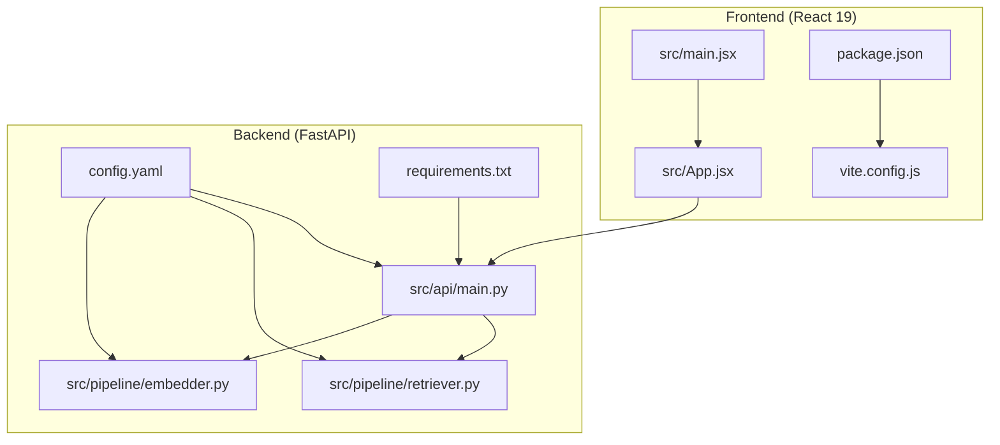
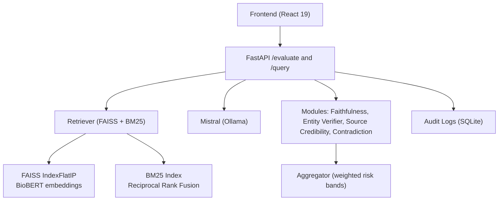
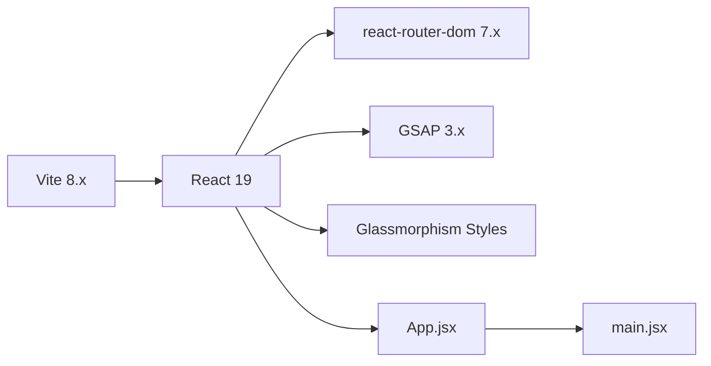
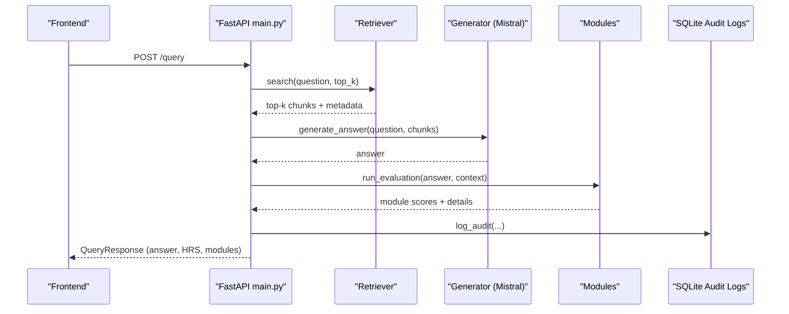
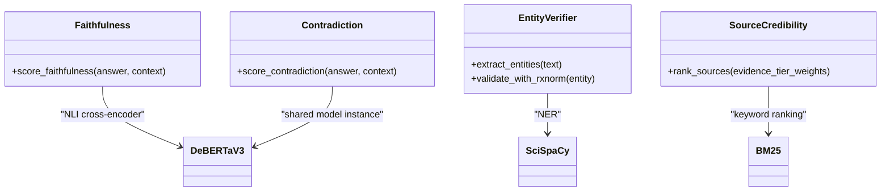
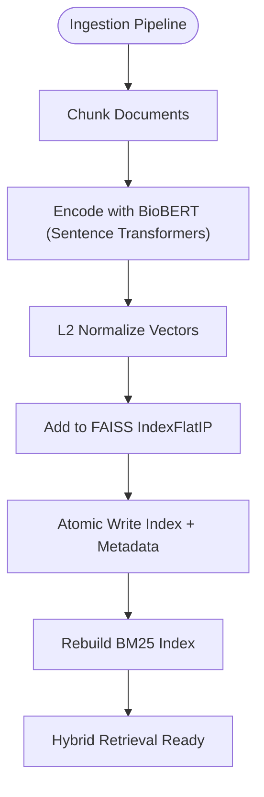
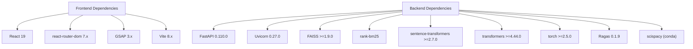

# Technology Stack

<cite>
**Referenced Files in This Document**
- [README.md](file://README.md)
- [START_INSTRUCTIONS.txt](file://START_INSTRUCTIONS.txt)
- [requirements.txt](file://Backend/requirements.txt)
- [config.yaml](file://Backend/config.yaml)
- [main.py](file://Backend/src/api/main.py)
- [retriever.py](file://Backend/src/pipeline/retriever.py)
- [embedder.py](file://Backend/src/pipeline/embedder.py)
- [contradiction.py](file://Backend/src/modules/contradiction.py)
- [package.json](file://Frontend/package.json)
- [vite.config.js](file://Frontend/vite.config.js)
- [main.jsx](file://Frontend/src/main.jsx)
- [App.jsx](file://Frontend/src/App.jsx)
</cite>

## Table of Contents
1. [Introduction](#introduction)
2. [Project Structure](#project-structure)
3. [Core Components](#core-components)
4. [Architecture Overview](#architecture-overview)
5. [Detailed Component Analysis](#detailed-component-analysis)
6. [Dependency Analysis](#dependency-analysis)
7. [Performance Considerations](#performance-considerations)
8. [Troubleshooting Guide](#troubleshooting-guide)
9. [Conclusion](#conclusion)

## Introduction
This document presents the complete technology stack powering MediRAG 3.0’s medical AI safety evaluation system. It covers the frontend (React 19, GSAP motion, custom glassmorphism UI), backend (FastAPI, LangChain, FAISS, BM25), the medical AI stack (DeBERTa-v3 NLI, SciSpaCy NER, BioBERT embeddings, Mistral generation), and the data processing pipeline (vector expansion to 107,425 clinical vectors with hybrid search). It also includes version requirements, compatibility notes, upgrade paths, and rationale for each technology choice in the context of medical AI safety.

## Project Structure
The project is organized into two primary areas:
- Backend: Python-based API, evaluation modules, retrieval pipeline, ingestion, and configuration.
- Frontend: React 19 application with Vite, routing, and motion libraries.

**Diagram sources**
- [main.jsx:1-14](file://Frontend/src/main.jsx#L1-L14)
- [App.jsx:1-4](file://Frontend/src/App.jsx#L1-L4)
- [package.json:1-32](file://Frontend/package.json#L1-L32)
- [vite.config.js:1-8](file://Frontend/vite.config.js#L1-L8)
- [main.py:1-678](file://Backend/src/api/main.py#L1-L678)
- [retriever.py:1-287](file://Backend/src/pipeline/retriever.py#L1-L287)
- [embedder.py:1-164](file://Backend/src/pipeline/embedder.py#L1-L164)
- [config.yaml:1-66](file://Backend/config.yaml#L1-L66)
- [requirements.txt:1-35](file://Backend/requirements.txt#L1-L35)

**Section sources**
- [README.md:80-87](file://README.md#L80-L87)
- [START_INSTRUCTIONS.txt:1-36](file://START_INSTRUCTIONS.txt#L1-L36)
- [package.json:1-32](file://Frontend/package.json#L1-L32)
- [requirements.txt:1-35](file://Backend/requirements.txt#L1-L35)
- [config.yaml:1-66](file://Backend/config.yaml#L1-L66)

## Core Components
- Frontend stack
  - React 19 with React Router Dom 7.x for navigation and UI composition.
  - Vite 8.x for fast development and optimized builds.
  - GSAP 3.x for smooth, performant animations and motion design.
  - Custom glassmorphism CSS for modern, translucent UI effects.
- Backend stack
  - FastAPI 0.110.0 with Uvicorn 0.27.0 for high-performance ASGI server.
  - LangChain ecosystem for orchestration and integration.
  - FAISS 1.9+ for dense vector retrieval with cosine similarity.
  - BM25 (rank-bm25) for keyword-based retrieval and hybrid fusion.
- Medical AI stack
  - DeBERTa-v3 cross-encoder (NLI) for contradiction and faithfulness scoring.
  - SciSpaCy (en_core_sci_lg) for biomedical named entity extraction.
  - BioBERT (Sentence Transformers) for dense embeddings.
  - Mistral (via Ollama) for grounded generation and verification.
- Data processing stack
  - FAISS index expanded to 107,425 clinical vectors.
  - Hybrid search combining FAISS (BioBERT) and BM25 (keyword) via Reciprocal Rank Fusion.

**Section sources**
- [README.md:80-87](file://README.md#L80-L87)
- [requirements.txt:1-35](file://Backend/requirements.txt#L1-L35)
- [config.yaml:1-66](file://Backend/config.yaml#L1-L66)
- [package.json:1-32](file://Frontend/package.json#L1-L32)

## Architecture Overview
The system implements a four-layer audit engine:
1. Faithfulness (DeBERTa-v3 NLI): verifies claims against retrieved context.
2. Mistral 2-pass verification: initial answer + authority pass.
3. Medical Entity Verifier (SciSpaCy + RxNorm): validates drugs, dosages, and conditions.
4. Source Credibility Ranking (Hybrid): tiers evidence and shows relevance bar.

**Diagram sources**
- [main.py:1-678](file://Backend/src/api/main.py#L1-L678)
- [retriever.py:1-287](file://Backend/src/pipeline/retriever.py#L1-L287)
- [config.yaml:1-66](file://Backend/config.yaml#L1-L66)

## Detailed Component Analysis

### Frontend: React 19, GSAP, and Glassmorphism UI
- React 19 provides robust component lifecycle and concurrent rendering for responsive UI.
- React Router Dom 7.x enables client-side routing for dashboards, evaluation, and governance views.
- Vite 8.x offers fast HMR and optimized production builds.
- GSAP 3.x powers animations for interactive elements like the target-lock cursor and hover states.
- Glassmorphism CSS adds frosted transparency and depth for a modern medical command center feel.

**Diagram sources**
- [package.json:1-32](file://Frontend/package.json#L1-L32)
- [vite.config.js:1-8](file://Frontend/vite.config.js#L1-L8)
- [main.jsx:1-14](file://Frontend/src/main.jsx#L1-L14)
- [App.jsx:1-4](file://Frontend/src/App.jsx#L1-L4)

**Section sources**
- [package.json:1-32](file://Frontend/package.json#L1-L32)
- [vite.config.js:1-8](file://Frontend/vite.config.js#L1-L8)
- [main.jsx:1-14](file://Frontend/src/main.jsx#L1-L14)
- [App.jsx:1-4](file://Frontend/src/App.jsx#L1-L4)
- [README.md:82-82](file://README.md#L82-L82)

### Backend: FastAPI, LangChain, FAISS, BM25
- FastAPI 0.110.0 with Uvicorn 0.27.0 provides type-safe, auto-documented endpoints for evaluation and querying.
- LangChain integrates with LLM providers and orchestrates chains.
- FAISS 1.9+ stores BioBERT embeddings with IndexFlatIP for cosine similarity.
- BM25 (rank-bm25) indexes chunk texts for keyword-based retrieval.
- Hybrid retrieval combines FAISS and BM25 via Reciprocal Rank Fusion for precision and recall.

**Diagram sources**
- [main.py:308-520](file://Backend/src/api/main.py#L308-L520)
- [retriever.py:149-250](file://Backend/src/pipeline/retriever.py#L149-L250)

**Section sources**
- [requirements.txt:1-35](file://Backend/requirements.txt#L1-L35)
- [config.yaml:1-66](file://Backend/config.yaml#L1-L66)
- [main.py:308-520](file://Backend/src/api/main.py#L308-L520)
- [retriever.py:1-287](file://Backend/src/pipeline/retriever.py#L1-L287)

### Medical AI Stack: DeBERTa-v3, SciSpaCy, BioBERT, Mistral
- DeBERTa-v3 (cross-encoder) performs NLI to detect contradictions and assess faithfulness.
- SciSpaCy (en_core_sci_lg) extracts biomedical entities (drugs, dosages, conditions).
- BioBERT (Sentence Transformers) encodes clinical text into dense vectors for FAISS.
- Mistral (via Ollama) generates grounded answers and supports a two-pass verification strategy.

**Diagram sources**
- [config.yaml:9-31](file://Backend/config.yaml#L9-L31)
- [contradiction.py:1-251](file://Backend/src/modules/contradiction.py#L1-L251)

**Section sources**
- [config.yaml:9-31](file://Backend/config.yaml#L9-L31)
- [contradiction.py:1-251](file://Backend/src/modules/contradiction.py#L1-L251)
- [README.md:33-42](file://README.md#L33-L42)

### Data Processing Stack: Vector Expansion and Hybrid Search
- FAISS index built from BioBERT embeddings yields 107,425 clinical vectors.
- Hybrid search strategy combines FAISS (semantic) and BM25 (keyword) using Reciprocal Rank Fusion.
- Runtime ingestion safely updates FAISS and rebuilds BM25 atomically.

**Diagram sources**
- [embedder.py:55-92](file://Backend/src/pipeline/embedder.py#L55-L92)
- [retriever.py:121-143](file://Backend/src/pipeline/retriever.py#L121-L143)
- [main.py:526-604](file://Backend/src/api/main.py#L526-L604)

**Section sources**
- [README.md:47-48](file://README.md#L47-L48)
- [embedder.py:1-164](file://Backend/src/pipeline/embedder.py#L1-L164)
- [retriever.py:1-287](file://Backend/src/pipeline/retriever.py#L1-L287)
- [main.py:526-604](file://Backend/src/api/main.py#L526-L604)

## Dependency Analysis
- Frontend dependencies: React 19, react-router-dom 7.x, GSAP 3.x, Vite 8.x.
- Backend dependencies: FastAPI 0.110.0, Uvicorn 0.27.0, FAISS 1.9+, rank-bm25, sentence-transformers, transformers 4.44+, torch 2.5+, SciSpaCy (conda), Google GenAI, PySBd, PyMuPDF, python-docx, Ragas 0.1.9.
- Configuration ties model choices, provider settings, and retrieval parameters.

**Diagram sources**
- [package.json:1-32](file://Frontend/package.json#L1-L32)
- [requirements.txt:1-35](file://Backend/requirements.txt#L1-L35)

**Section sources**
- [package.json:1-32](file://Frontend/package.json#L1-L32)
- [requirements.txt:1-35](file://Backend/requirements.txt#L1-L35)

## Performance Considerations
- Model warm-up: DeBERTa NLI and Retriever are pre-warmed at application startup to avoid cold-start latency.
- Batch sizes and truncation: Configurable batch sizes and truncation sides optimize GPU/CPU memory usage.
- Hybrid retrieval: Using RRF balances semantic and keyword precision/recall, reducing irrelevant hits.
- Atomic ingestion: Thread-safe FAISS updates and atomic file writes prevent corruption and reduce downtime.
- Latency controls: Sentence segmentation limits and capped pair checks bound contradiction scoring latency.

**Section sources**
- [main.py:125-149](file://Backend/src/api/main.py#L125-L149)
- [config.yaml:11-31](file://Backend/config.yaml#L11-L31)
- [retriever.py:220-235](file://Backend/src/pipeline/retriever.py#L220-L235)
- [main.py:570-598](file://Backend/src/api/main.py#L570-L598)

## Troubleshooting Guide
- Backend startup and dependencies
  - Ensure Python 3.10+ and virtual environment are active.
  - Install backend dependencies from requirements.txt.
  - Verify Ollama is running locally for Mistral generation.
- Frontend startup
  - Install Node.js dependencies and run Vite dev server.
  - Confirm API URL environment variable is configured for the backend endpoint.
- Retrieval failures
  - Confirm FAISS index and metadata files exist as configured.
  - If FAISS is unavailable, BM25-only fallback is used; install rank-bm25 for full hybrid.
- Model loading issues
  - sentence-transformers and transformers versions must satisfy minimum requirements.
  - Torch wheel compatibility for Python 3.13 requires torch >= 2.5.0.

**Section sources**
- [START_INSTRUCTIONS.txt:1-36](file://START_INSTRUCTIONS.txt#L1-L36)
- [requirements.txt:1-35](file://Backend/requirements.txt#L1-L35)
- [config.yaml:54-66](file://Backend/config.yaml#L54-L66)
- [main.py:179-186](file://Backend/src/api/main.py#L179-L186)

## Conclusion
MediRAG 3.0’s stack is designed for safety-first medical AI evaluation. React 19 and GSAP deliver a modern, responsive UI; FastAPI and LangChain provide a robust, extensible backend; FAISS and BM25 enable precise, scalable retrieval; and the medical AI models (DeBERTa-v3, SciSpaCy, BioBERT, Mistral) underpin accurate, interpretable auditing. The hybrid search strategy and vector expansion to 107,425 clinical vectors ensure comprehensive grounding. Version constraints and compatibility notes guide upgrades while maintaining stability for production use.