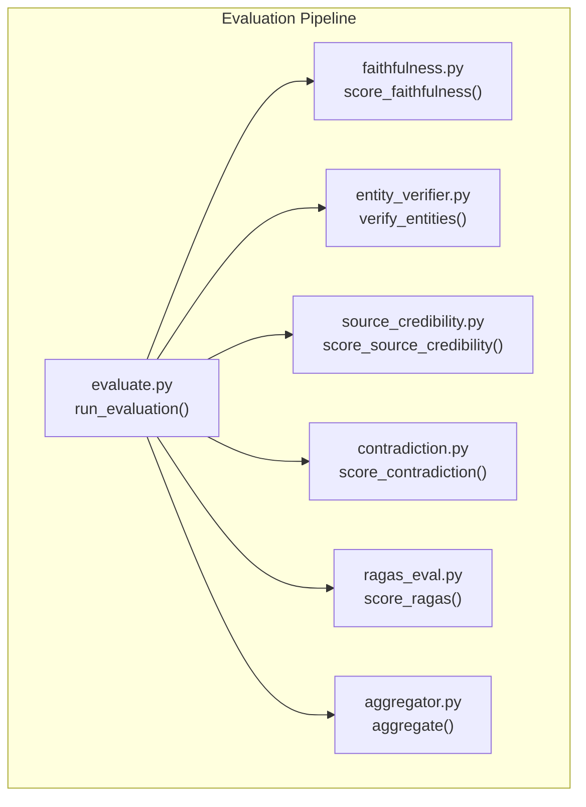
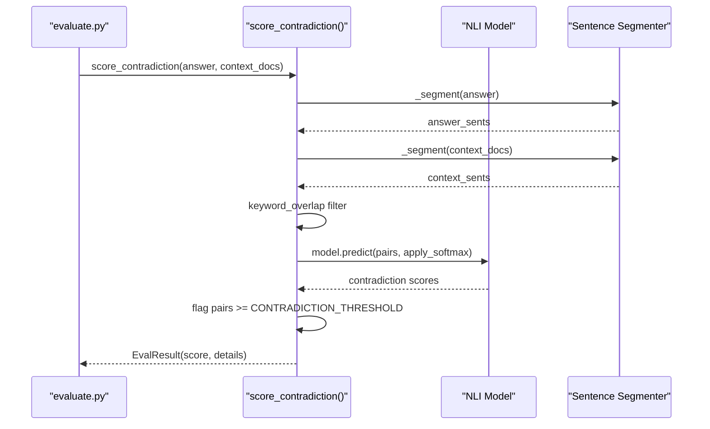
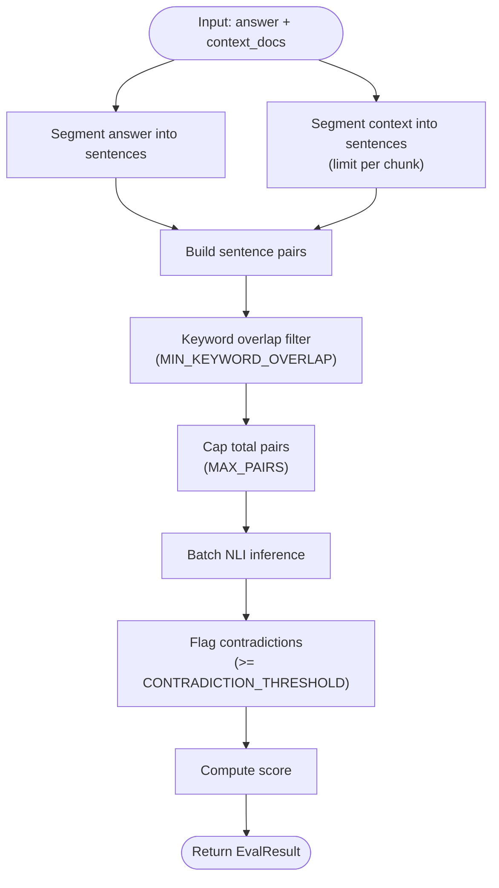
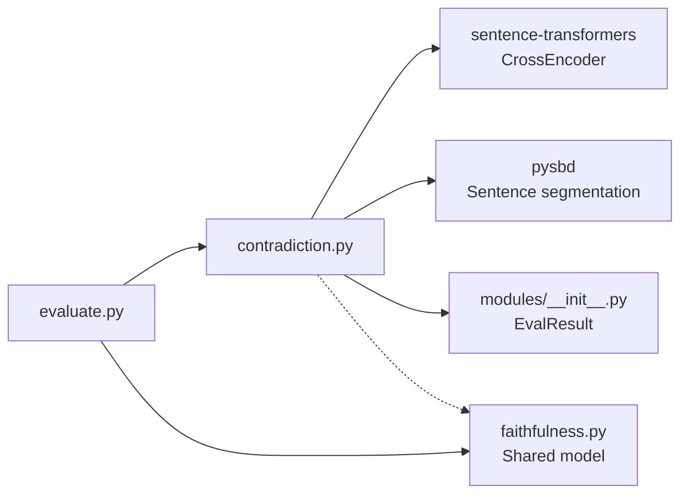

# Contradiction Detection Module

<cite>
**Referenced Files in This Document**
- [contradiction.py](file://Backend/src/modules/contradiction.py)
- [faithfulness.py](file://Backend/src/modules/faithfulness.py)
- [evaluate.py](file://Backend/src/evaluate.py)
- [__init__.py](file://Backend/src/modules/__init__.py)
- [config.yaml](file://Backend/config.yaml)
- [requirements.txt](file://Backend/requirements.txt)
- [test_modules.py](file://Backend/tests/test_modules.py)
</cite>

## Table of Contents
1. [Introduction](#introduction)
2. [Project Structure](#project-structure)
3. [Core Components](#core-components)
4. [Architecture Overview](#architecture-overview)
5. [Detailed Component Analysis](#detailed-component-analysis)
6. [Dependency Analysis](#dependency-analysis)
7. [Performance Considerations](#performance-considerations)
8. [Troubleshooting Guide](#troubleshooting-guide)
9. [Conclusion](#conclusion)

## Introduction
This document provides comprehensive documentation for the Contradiction Detection module, which identifies inconsistencies and conflicting information in AI responses by cross-checking answer statements against retrieved context documents using DeBERTa-v3 Natural Language Inference (NLI) models. The module implements a conservative scoring methodology designed specifically for medical domains, where factual accuracy is paramount. It integrates tightly with the broader evaluation pipeline and shares the NLI model instance with the Faithfulness module to optimize resource usage.

## Project Structure
The Contradiction Detection module is part of the Backend evaluation system and works alongside four other evaluation modules: Faithfulness, Entity Verification, Source Credibility, and RAGAS. The evaluation orchestrator coordinates all modules and aggregates their results into a composite score.

**Diagram sources**
- [evaluate.py:49-167](file://Backend/src/evaluate.py#L49-L167)
- [contradiction.py:94-250](file://Backend/src/modules/contradiction.py#L94-L250)
- [faithfulness.py:86-233](file://Backend/src/modules/faithfulness.py#L86-L233)

**Section sources**
- [evaluate.py:49-167](file://Backend/src/evaluate.py#L49-L167)
- [config.yaml:9-31](file://Backend/config.yaml#L9-L31)

## Core Components
The Contradiction Detection module centers around the `score_contradiction` function, which performs the following operations:
- Sentence segmentation of the LLM answer and context documents
- Keyword overlap filtering to reduce irrelevant comparisons
- Batch NLI inference using a shared DeBERTa-v3 model
- Pairwise contradiction scoring with threshold-based flagging
- Composite score calculation based on proportion of non-contradictory pairs

Key constants and thresholds:
- CONTRADICTION_THRESHOLD: 0.75 (conservative cutoff for flagging contradictions)
- MIN_KEYWORD_OVERLAP: 1 (minimum meaningful word overlap before running NLI)
- MAX_CONTEXT_SENTS: 4 (limit context sentences per chunk)
- MAX_PAIRS: 200 (hard cap on total sentence pairs to bound latency)

**Section sources**
- [contradiction.py:37-52](file://Backend/src/modules/contradiction.py#L37-L52)
- [contradiction.py:94-250](file://Backend/src/modules/contradiction.py#L94-L250)

## Architecture Overview
The module follows a pipeline architecture that segments text, filters relevant pairs, performs batch inference, and computes a final score. The design emphasizes performance and safety by limiting computational load while maintaining high precision for medical applications.

**Diagram sources**
- [evaluate.py:119-122](file://Backend/src/evaluate.py#L119-L122)
- [contradiction.py:197-208](file://Backend/src/modules/contradiction.py#L197-L208)

## Detailed Component Analysis

### score_contradiction Function
The core function implements the contradiction detection algorithm with the following steps:
1. Input validation and early returns for empty inputs
2. Lazy model loading via the Faithfulness module to share the NLI model instance
3. Sentence segmentation using pysbd with fallback to naive splitting
4. Context preprocessing: limit chunks and sentences per chunk
5. Keyword overlap filtering to build a manageable set of sentence pairs
6. Batch NLI inference with softmax normalization
7. Threshold-based flagging and detailed reporting
8. Score computation: 1.0 minus proportion of contradictory pairs

Parameters:
- answer: LLM-generated answer text
- context_docs: List of retrieved context passage strings
- max_chunks: Maximum number of context chunks to evaluate (default: 5)

Return type: EvalResult with module_name="contradiction" and score in [0,1].

Scoring methodology:
- Score = 1.0 - (contradicted_pairs / total_checked_pairs)
- Higher scores indicate fewer contradictions
- Neutral baseline of 1.0 when no contradictions are detected

**Section sources**
- [contradiction.py:94-250](file://Backend/src/modules/contradiction.py#L94-L250)
- [__init__.py:97-110](file://Backend/src/modules/__init__.py#L97-L110)

### Sentence Segmentation and Filtering
The module uses a lazy-initialized sentence boundary detector to split text into sentences. It falls back gracefully if the specialized library is unavailable. Keyword overlap filtering ensures that only semantically related sentence pairs are evaluated, reducing computational overhead and improving accuracy.

**Diagram sources**
- [contradiction.py:177-208](file://Backend/src/modules/contradiction.py#L177-L208)

**Section sources**
- [contradiction.py:55-88](file://Backend/src/modules/contradiction.py#L55-L88)
- [contradiction.py:177-208](file://Backend/src/modules/contradiction.py#L177-L208)

### Model Integration and Sharing
The module integrates with the Faithfulness module to share the NLI model instance, avoiding redundant model loading and memory usage. This design choice optimizes performance in multi-module evaluations.

Implementation details:
- Lazy model loading with caching at module level
- Shared model instance prevents double initialization
- Graceful fallback when sentence-transformers is unavailable

**Section sources**
- [contradiction.py:121-148](file://Backend/src/modules/contradiction.py#L121-L148)
- [faithfulness.py:58-69](file://Backend/src/modules/faithfulness.py#L58-L69)

### Evaluation Pipeline Integration
The Contradiction Detection module participates in the full evaluation pipeline orchestrated by the evaluation orchestrator. It runs alongside Faithfulness, Entity Verification, Source Credibility, and RAGAS, contributing to the composite score calculation.

Integration points:
- Called from run_evaluation() with answer and context texts
- Results integrated into the aggregator with weight 0.15
- Detailed breakdown included for transparency

**Section sources**
- [evaluate.py:119-122](file://Backend/src/evaluate.py#L119-L122)
- [config.yaml:32-42](file://Backend/config.yaml#L32-L42)

## Dependency Analysis
The module has minimal external dependencies, relying primarily on the sentence-transformers library for NLI inference and pysbd for sentence segmentation. It shares the NLI model with the Faithfulness module to reduce memory footprint and improve throughput.

**Diagram sources**
- [contradiction.py:127-130](file://Backend/src/modules/contradiction.py#L127-L130)
- [requirements.txt:12](file://Backend/requirements.txt#L12)
- [requirements.txt:30](file://Backend/requirements.txt#L30)

**Section sources**
- [requirements.txt:12](file://Backend/requirements.txt#L12)
- [requirements.txt:30](file://Backend/requirements.txt#L30)

## Performance Considerations
The module implements several optimization strategies to ensure efficient processing at scale:
- Hard caps on sentence pairs (MAX_PAIRS) and context sentences per chunk (MAX_CONTEXT_SENTS)
- Keyword overlap filtering to eliminate irrelevant comparisons
- Shared model instance to avoid redundant loading
- Lazy initialization of expensive components
- Early returns for edge cases (empty inputs)
- Softmax normalization for probabilistic interpretation

Latency characteristics:
- Typical processing time: ~2-3 seconds for up to 200 sentence pairs
- Memory usage scales with number of pairs and model size
- Batch inference reduces overhead compared to per-pair processing

Optimization strategies for large-scale deployment:
- Adjust MAX_PAIRS and MAX_CONTEXT_SENTS based on hardware constraints
- Monitor model loading and warm-up procedures
- Consider model quantization or pruning for resource-constrained environments
- Implement caching for repeated evaluations of identical content

**Section sources**
- [contradiction.py:37-40](file://Backend/src/modules/contradiction.py#L37-L40)
- [contradiction.py:197-208](file://Backend/src/modules/contradiction.py#L197-L208)

## Troubleshooting Guide
Common issues and resolutions:
- Missing sentence-transformers: The module gracefully handles missing dependencies by returning a neutral score and logging an error
- Missing pysbd: Falls back to naive sentence splitting with warning logs
- Empty inputs: Returns neutral score (1.0) with zero-checked pairs
- Model inference errors: Logs detailed error information and returns neutral score
- Low-quality context: If no keyword overlaps are found, returns neutral score with zero checked pairs

Debugging tips:
- Enable debug logging to capture detailed processing information
- Verify model availability and installation
- Check input formatting and ensure non-empty answer and context
- Monitor memory usage during batch inference

**Section sources**
- [contradiction.py:121-148](file://Backend/src/modules/contradiction.py#L121-L148)
- [contradiction.py:188-195](file://Backend/src/modules/contradiction.py#L188-L195)
- [contradiction.py:200-208](file://Backend/src/modules/contradiction.py#L200-L208)

## Conclusion
The Contradiction Detection module provides a robust, conservative approach to identifying factual inconsistencies in AI responses for medical applications. By leveraging shared NLI models, keyword filtering, and careful thresholding, it balances accuracy with performance. Its integration into the broader evaluation pipeline ensures comprehensive assessment of AI-generated content, with particular emphasis on safety-critical domains where contradictions can have serious consequences.

The module's design prioritizes:
- Medical safety through conservative thresholds
- Computational efficiency via filtering and batching
- Resource sharing to minimize overhead
- Transparent reporting for interpretability

Future enhancements could include dynamic threshold adjustment based on domain expertise, incremental model updates, and expanded support for multilingual content while maintaining the current safety-first approach.