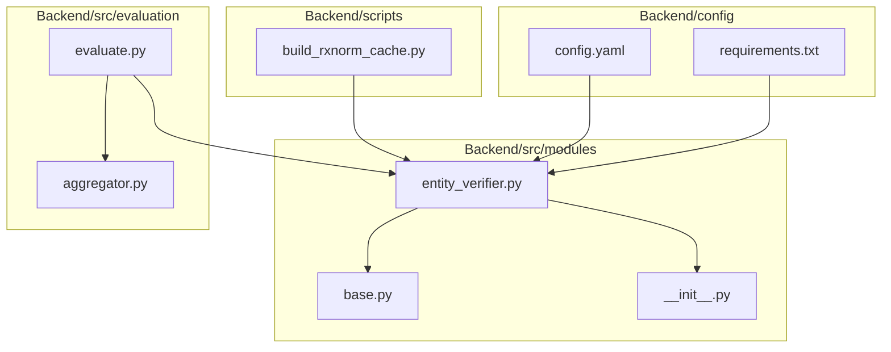
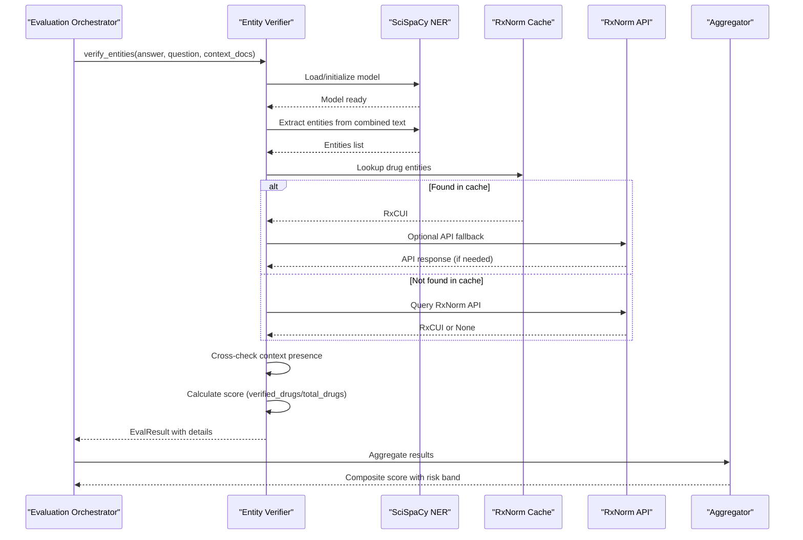
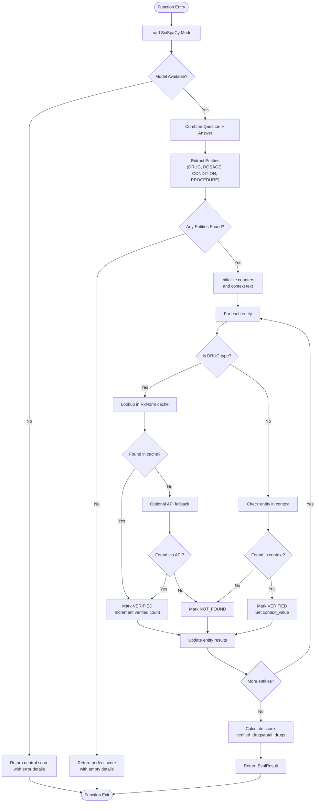
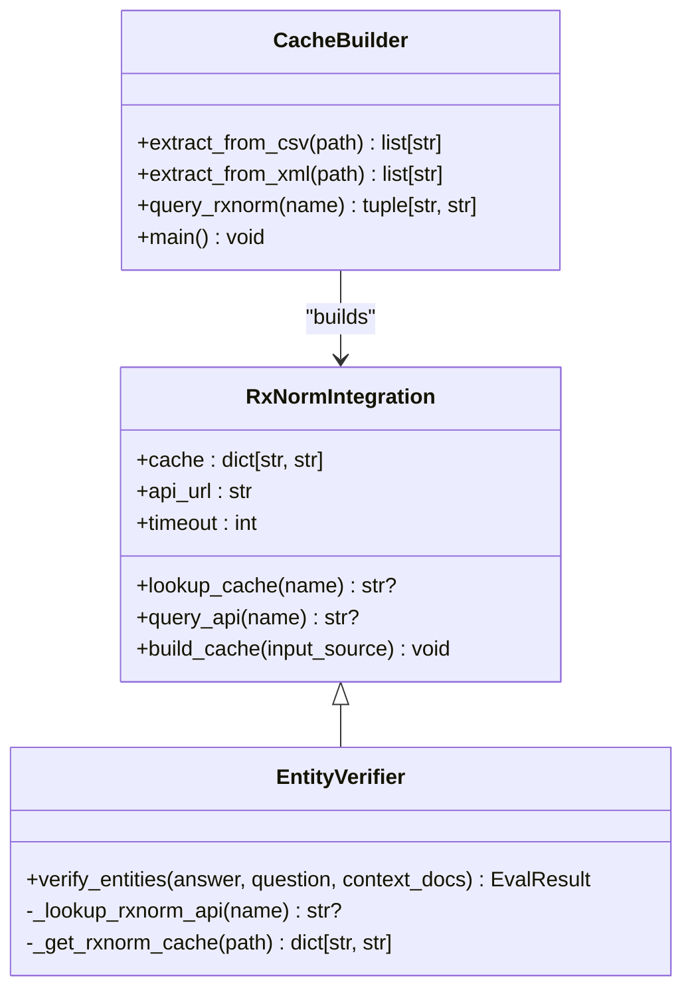
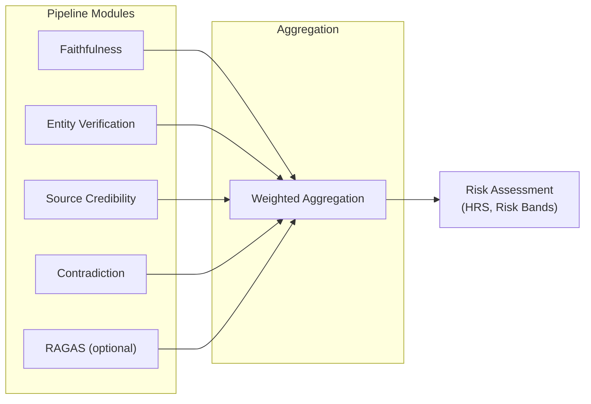
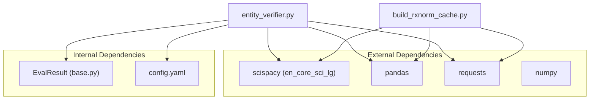

# Entity Verification Module

<cite>
**Referenced Files in This Document**
- [entity_verifier.py](file://Backend/src/modules/entity_verifier.py)
- [build_rxnorm_cache.py](file://Backend/scripts/build_rxnorm_cache.py)
- [evaluate.py](file://Backend/src/evaluate.py)
- [aggregator.py](file://Backend/src/evaluation/aggregator.py)
- [__init__.py](file://Backend/src/modules/__init__.py)
- [config.yaml](file://Backend/config.yaml)
- [requirements.txt](file://Backend/requirements.txt)
</cite>

## Table of Contents
1. [Introduction](#introduction)
2. [Project Structure](#project-structure)
3. [Core Components](#core-components)
4. [Architecture Overview](#architecture-overview)
5. [Detailed Component Analysis](#detailed-component-analysis)
6. [Dependency Analysis](#dependency-analysis)
7. [Performance Considerations](#performance-considerations)
8. [Troubleshooting Guide](#troubleshooting-guide)
9. [Conclusion](#conclusion)

## Introduction
The Entity Verification module performs biomedical named entity recognition and validation for LLM-generated answers. It extracts medical entities using SciSpaCy NER and validates drug entities against an RxNorm cache and REST API. The module integrates into the evaluation pipeline and contributes to the composite risk assessment through a multi-tier severity system.

## Project Structure
The Entity Verification module resides in the Backend/src/modules directory and integrates with the broader evaluation framework.

**Diagram sources**
- [entity_verifier.py:1-283](file://Backend/src/modules/entity_verifier.py#L1-L283)
- [evaluate.py:1-251](file://Backend/src/evaluate.py#L1-L251)
- [aggregator.py:1-167](file://Backend/src/evaluation/aggregator.py#L1-L167)
- [build_rxnorm_cache.py:1-348](file://Backend/scripts/build_rxnorm_cache.py#L1-L348)
- [config.yaml:1-66](file://Backend/config.yaml#L1-L66)

**Section sources**
- [entity_verifier.py:1-283](file://Backend/src/modules/entity_verifier.py#L1-L283)
- [evaluate.py:1-251](file://Backend/src/evaluate.py#L1-L251)

## Core Components
The Entity Verification module consists of:
- SciSpaCy NER integration for extracting medical entities
- RxNorm cache and API integration for drug validation
- Multi-tier severity assessment system
- Evaluation pipeline integration

Key implementation patterns:
- NER pipeline using SciSpaCy en_core_sci_lg model
- Two-layer validation: local cache (offline) + RxNorm API (online fallback)
- Entity scoring based on verified drug entities only
- Context-aware validation for non-drug entities

**Section sources**
- [entity_verifier.py:146-283](file://Backend/src/modules/entity_verifier.py#L146-L283)
- [__init__.py:15-128](file://Backend/src/modules/__init__.py#L15-L128)

## Architecture Overview
The Entity Verification module follows a layered architecture with clear separation of concerns:

**Diagram sources**
- [evaluate.py:99-107](file://Backend/src/evaluate.py#L99-L107)
- [entity_verifier.py:146-283](file://Backend/src/modules/entity_verifier.py#L146-L283)
- [aggregator.py:47-167](file://Backend/src/evaluation/aggregator.py#L47-L167)

## Detailed Component Analysis

### verify_entities Function
The core verification function implements the complete entity validation pipeline:

**Diagram sources**
- [entity_verifier.py:146-283](file://Backend/src/modules/entity_verifier.py#L146-L283)

**Section sources**
- [entity_verifier.py:146-283](file://Backend/src/modules/entity_verifier.py#L146-L283)

### SciSpaCy Integration
The module uses SciSpaCy NER with the en_core_sci_lg model for biomedical entity extraction:

Implementation characteristics:
- Lazy loading of the NLP model (first-call initialization)
- Entity type mapping from SciSpaCy labels to internal types
- Deduplication of extracted entities
- Combined question+answer text for richer entity extraction

Entity type mapping:
- CHEMICAL, DRUG, COMPOUND → DRUG
- DISEASE, SYMPTOM → CONDITION  
- PROCEDURE → PROCEDURE
- DOSAGE → DOSAGE

**Section sources**
- [entity_verifier.py:70-86](file://Backend/src/modules/entity_verifier.py#L70-L86)
- [entity_verifier.py:50-58](file://Backend/src/modules/entity_verifier.py#L50-L58)

### RxNorm Integration
The module implements a two-tier validation system:

**Diagram sources**
- [entity_verifier.py:89-140](file://Backend/src/modules/entity_verifier.py#L89-L140)
- [build_rxnorm_cache.py:155-186](file://Backend/scripts/build_rxnorm_cache.py#L155-L186)

Cache management strategies:
- Case-insensitive lowercase key mapping
- CSV-based persistence with drug_name → rxcui mapping
- Automatic cache loading with path-based caching
- Graceful fallback when cache is unavailable

API integration:
- Single HTTP call per drug using RxNorm approximateTerm endpoint
- Configurable timeout settings
- Error handling for network failures
- Response parsing for candidate extraction

**Section sources**
- [entity_verifier.py:89-140](file://Backend/src/modules/entity_verifier.py#L89-L140)
- [build_rxnorm_cache.py:155-186](file://Backend/scripts/build_rxnorm_cache.py#L155-L186)

### Multi-Tier Severity Assessment
The module defines a severity system for flagged entities:

Severity mapping (from SRS Section 6.2):
- CRITICAL: brand-generic mismatch, dosage discrepancies (>10% tolerance)
- MODERATE: significant dosage variations
- MINOR: minor synonym variants

Current implementation note:
The entity_verifier.py file documents the severity mapping but does not implement the actual severity calculation logic. The EvalResult schema includes severity field support, but the detailed severity assessment is not implemented in the current code.

**Section sources**
- [entity_verifier.py:16-25](file://Backend/src/modules/entity_verifier.py#L16-L25)
- [__init__.py:64-80](file://Backend/src/modules/__init__.py#L64-L80)

### Evaluation Pipeline Integration
The Entity Verification module integrates seamlessly into the evaluation pipeline:

**Diagram sources**
- [evaluate.py:99-147](file://Backend/src/evaluate.py#L99-L147)
- [aggregator.py:47-167](file://Backend/src/evaluation/aggregator.py#L47-L167)

Integration specifics:
- Called during evaluation pipeline execution
- Returns EvalResult with standardized schema
- Contributes to composite score through aggregator
- Supports optional RAGAS evaluation

**Section sources**
- [evaluate.py:99-147](file://Backend/src/evaluate.py#L99-L147)
- [aggregator.py:47-167](file://Backend/src/evaluation/aggregator.py#L47-L167)

## Dependency Analysis
The Entity Verification module has the following dependencies:

**Diagram sources**
- [entity_verifier.py:26-37](file://Backend/src/modules/entity_verifier.py#L26-L37)
- [requirements.txt:1-35](file://Backend/requirements.txt#L1-L35)

Dependency management:
- SciSpaCy model installation via conda (not in requirements.txt)
- Pandas for CSV cache loading
- Requests for RxNorm API communication
- Config-driven customization of behavior

**Section sources**
- [entity_verifier.py:26-37](file://Backend/src/modules/entity_verifier.py#L26-L37)
- [requirements.txt:1-35](file://Backend/requirements.txt#L1-L35)

## Performance Considerations
Performance characteristics of the Entity Verification module:

Processing pipeline:
- NER model loading: lazy initialization (first call only)
- Entity extraction: linear with text length
- Cache lookup: O(1) dictionary access
- API calls: blocking HTTP requests (configurable timeout)

Optimization strategies:
- Model caching reduces repeated loading overhead
- Batch processing could be implemented for multiple entities
- Async API calls would improve throughput
- Pre-warming cache at startup

Latency factors:
- SciSpaCy model initialization time
- Network latency for RxNorm API calls
- Cache hit ratio affects overall performance
- Entity count impacts processing time

## Troubleshooting Guide

### Common Issues and Solutions

**SciSpaCy Model Loading Failures**
- Symptom: NER model unavailable error
- Solution: Install en_core_sci_lg via conda as documented
- Prevention: Verify model installation before deployment

**RxNorm Cache Issues**
- Symptom: Cache not found warnings
- Solution: Build cache using build_rxnorm_cache.py script
- Prevention: Include cache in version control for CI/CD

**API Rate Limiting**
- Symptom: Timeout errors from RxNorm API
- Solution: Adjust timeout settings in config.yaml
- Prevention: Implement retry logic with exponential backoff

**Missing or Ambiguous Entities**
- Symptom: Entities not found in context
- Solution: Review entity extraction parameters
- Prevention: Consider question+answer combination for richer extraction

**Configuration Validation**
- Verify RxNorm cache path exists
- Check API endpoint accessibility
- Confirm entity types mapping aligns with expected inputs

**Section sources**
- [entity_verifier.py:78-85](file://Backend/src/modules/entity_verifier.py#L78-L85)
- [entity_verifier.py:93-96](file://Backend/src/modules/entity_verifier.py#L93-L96)
- [config.yaml:16-22](file://Backend/config.yaml#L16-L22)

## Conclusion
The Entity Verification module provides robust biomedical entity validation through a multi-layered approach combining SciSpaCy NER with RxNorm cache and API integration. Its integration into the evaluation pipeline enables comprehensive quality assessment of LLM-generated medical answers. While the current implementation focuses on drug entity verification, the framework supports extension to include detailed severity assessment and enhanced entity validation capabilities.

The module demonstrates good separation of concerns, proper error handling, and configurable behavior through centralized configuration. Future enhancements could include async processing, improved severity scoring, and expanded entity type validation.