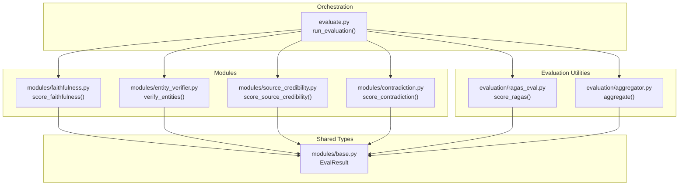
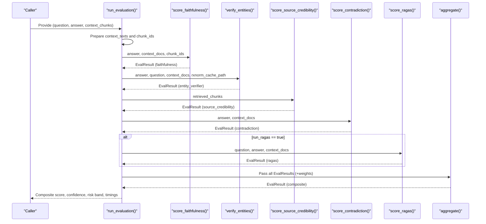
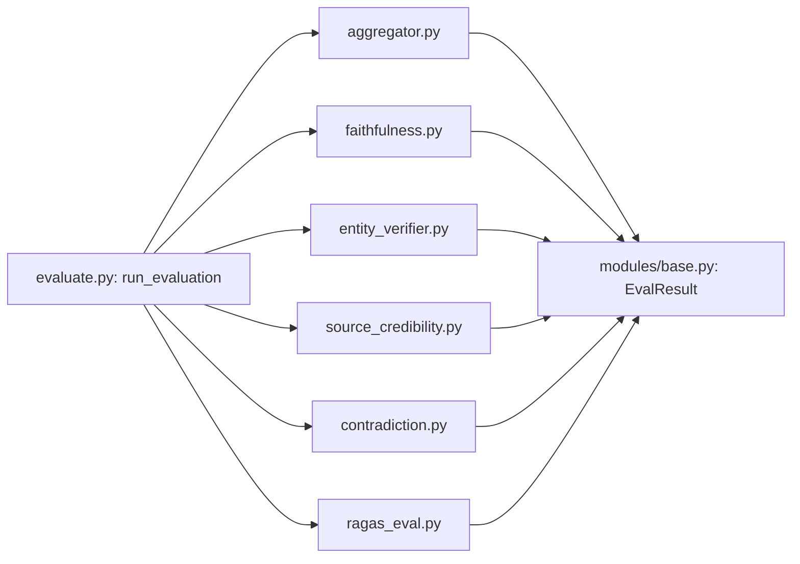

# Evaluation Pipeline Overview

<cite>
**Referenced Files in This Document**
- [evaluate.py](file://Backend/src/evaluate.py)
- [aggregator.py](file://Backend/src/evaluation/aggregator.py)
- [ragas_eval.py](file://Backend/src/evaluation/ragas_eval.py)
- [faithfulness.py](file://Backend/src/modules/faithfulness.py)
- [entity_verifier.py](file://Backend/src/modules/entity_verifier.py)
- [source_credibility.py](file://Backend/src/modules/source_credibility.py)
- [contradiction.py](file://Backend/src/modules/contradiction.py)
- [base.py](file://Backend/src/modules/base.py)
- [config.yaml](file://Backend/config.yaml)
- [chunks.jsonl](file://Backend/data/processed/chunks.jsonl)
- [build_rxnorm_cache.py](file://Backend/scripts/build_rxnorm_cache.py)
- [requirements.txt](file://Backend/requirements.txt)
- [test_modules.py](file://Backend/tests/test_modules.py)
</cite>

## Table of Contents
1. [Introduction](#introduction)
2. [Project Structure](#project-structure)
3. [Core Components](#core-components)
4. [Architecture Overview](#architecture-overview)
5. [Detailed Component Analysis](#detailed-component-analysis)
6. [Dependency Analysis](#dependency-analysis)
7. [Performance Considerations](#performance-considerations)
8. [Troubleshooting Guide](#troubleshooting-guide)
9. [Conclusion](#conclusion)
10. [Appendices](#appendices)

## Introduction
This document explains the MediRAG evaluation pipeline orchestration centered on a four-layer audit system. It covers the end-to-end workflow from raw AI answers to module-specific evaluations and final risk assessment. The run_evaluation function acts as the central orchestrator, sequentially invoking Faithfulness, Entity Verification, Source Credibility, and Contradiction Detection modules, optionally including RAGAS, and aggregating results into a composite score with confidence and risk bands. It also documents configuration options, RXNorm cache integration, CLI usage, and batch processing capabilities.

## Project Structure
The evaluation system is implemented in the Backend/src directory with modular components and supporting scripts:
- Orchestrator: Backend/src/evaluate.py
- Modules: Backend/src/modules/*.py
- Evaluation utilities: Backend/src/evaluation/*.py
- Configuration: Backend/config.yaml
- Data artifacts: Backend/data/processed/chunks.jsonl
- Scripts: Backend/scripts/build_rxnorm_cache.py
- Test coverage: Backend/tests/test_modules.py

**Diagram sources**
- [evaluate.py:49-167](file://Backend/src/evaluate.py#L49-L167)
- [aggregator.py:47-166](file://Backend/src/evaluation/aggregator.py#L47-L166)
- [ragas_eval.py:81-177](file://Backend/src/evaluation/ragas_eval.py#L81-L177)
- [faithfulness.py:86-233](file://Backend/src/modules/faithfulness.py#L86-L233)
- [entity_verifier.py:146-282](file://Backend/src/modules/entity_verifier.py#L146-L282)
- [source_credibility.py:121-199](file://Backend/src/modules/source_credibility.py#L121-L199)
- [contradiction.py:94-250](file://Backend/src/modules/contradiction.py#L94-L250)
- [base.py:15-43](file://Backend/src/modules/base.py#L15-L43)

**Section sources**
- [evaluate.py:1-251](file://Backend/src/evaluate.py#L1-L251)
- [config.yaml:1-66](file://Backend/config.yaml#L1-L66)

## Core Components
- run_evaluation: Central orchestrator that prepares inputs, runs modules in sequence, optionally runs RAGAS, aggregates results, and attaches per-module details.
- Module functions: score_faithfulness, verify_entities, score_source_credibility, score_contradiction.
- Aggregation: aggregate computes a weighted composite score, applies safety penalties, and derives risk bands and confidence levels.
- RAGAS: Optional module that evaluates faithfulness and answer relevance using an LLM backend.
- Shared result type: EvalResult defines the uniform output schema across modules.

Key configuration highlights:
- Weights for aggregation are defined in the aggregator module and can be overridden at runtime.
- RAGAS can be enabled/disabled via a flag; it auto-detects LLM backends (OpenAI or Ollama).
- RXNorm cache path is configurable and integrated into entity verification.

**Section sources**
- [evaluate.py:49-167](file://Backend/src/evaluate.py#L49-L167)
- [aggregator.py:37-166](file://Backend/src/evaluation/aggregator.py#L37-L166)
- [ragas_eval.py:35-177](file://Backend/src/evaluation/ragas_eval.py#L35-L177)
- [entity_verifier.py:89-117](file://Backend/src/modules/entity_verifier.py#L89-L117)
- [base.py:15-43](file://Backend/src/modules/base.py#L15-L43)

## Architecture Overview
The evaluation pipeline follows a strict sequential execution model with optional RAGAS and a final aggregation step. The orchestrator extracts and normalizes context, then passes inputs to each module. Each module returns an EvalResult with a score and details. The aggregator combines these results using fixed or override weights, applies safety penalties, and produces a composite score with risk band and confidence level.

**Diagram sources**
- [evaluate.py:88-167](file://Backend/src/evaluate.py#L88-L167)
- [aggregator.py:47-166](file://Backend/src/evaluation/aggregator.py#L47-L166)
- [ragas_eval.py:81-177](file://Backend/src/evaluation/ragas_eval.py#L81-L177)
- [faithfulness.py:86-233](file://Backend/src/modules/faithfulness.py#L86-L233)
- [entity_verifier.py:146-282](file://Backend/src/modules/entity_verifier.py#L146-L282)
- [source_credibility.py:121-199](file://Backend/src/modules/source_credibility.py#L121-L199)
- [contradiction.py:94-250](file://Backend/src/modules/contradiction.py#L94-L250)

## Detailed Component Analysis

### Orchestrator: run_evaluation
Responsibilities:
- Accepts question, answer, and context_chunks.
- Prepares context_texts and chunk_ids for modules requiring them.
- Executes Faithfulness, Entity Verification, Source Credibility, and Contradiction Detection in sequence.
- Optionally runs RAGAS if enabled.
- Aggregates results and attaches per-module details and total pipeline latency.

Configuration options:
- rxnorm_cache_path: Path to RXNorm cache CSV.
- run_ragas: Boolean to enable/disable RAGAS.
- weights: Optional dictionary to override default aggregation weights.

Timing:
- Measures total pipeline latency and stores it in details.

CLI:
- Supports loading context from a JSONL file and printing results in human-readable or JSON formats.

**Section sources**
- [evaluate.py:49-167](file://Backend/src/evaluate.py#L49-L167)
- [evaluate.py:174-251](file://Backend/src/evaluate.py#L174-L251)

### Faithfulness Module
Purpose:
- Determine how well the answer is grounded in the retrieved context using a cross-encoder NLI model.

Processing:
- Splits the answer into claims (sentences).
- Computes NLI scores against each context chunk.
- Classifies each claim as ENTAILED, NEUTRAL, or CONTRADICTED.
- Computes a per-claim score and aggregates into a final score.

Thresholds:
- Entailment ≥ 0.50 → ENTAILED
- Contradiction ≥ 0.30 → CONTRADICTED
- Otherwise → NEUTRAL

Notes:
- Model is lazily loaded and cached.
- Includes fallback behavior when model is unavailable.

**Section sources**
- [faithfulness.py:86-233](file://Backend/src/modules/faithfulness.py#L86-L233)

### Entity Verification Module
Purpose:
- Verify medical entities (DRUG, DOSAGE, CONDITION, PROCEDURE) in the answer against RxNorm using a local cache and/or live API.

Processing:
- Uses SciSpaCy NER to extract entities from answer and optionally question.
- For DRUG entities, resolves via:
  - Local rxnorm_cache.csv (offline)
  - RxNorm REST API fallback (online)
- Flags entities as VERIFIED, FLAGGED, or NOT_FOUND; severity mapping exists for FLAGGED.
- Scores based on verified DRUG entities only.

RXNorm cache integration:
- Cache built via scripts/build_rxnorm_cache.py.
- Cache path is configurable.

**Section sources**
- [entity_verifier.py:146-282](file://Backend/src/modules/entity_verifier.py#L146-L282)
- [build_rxnorm_cache.py:192-347](file://Backend/scripts/build_rxnorm_cache.py#L192-L347)

### Source Credibility Module
Purpose:
- Rate the trustworthiness of retrieved documents based on publication type/evidence tier.

Processing:
- Determines tier_type via metadata or keyword matching.
- Computes weighted average of tier weights across chunks.
- Provides per-chunk details including tier number and matched keywords.

Tier weights:
- Defined in module constants and used to compute average tier weight.

**Section sources**
- [source_credibility.py:121-199](file://Backend/src/modules/source_credibility.py#L121-L199)

### Contradiction Detection Module
Purpose:
- Detect contradictions between answer sentences and context sentences using NLI.

Processing:
- Segments answer and context into sentences.
- Filters sentence pairs using keyword overlap to bound computation.
- Runs NLI to compute contradiction scores.
- Produces a score inversely proportional to contradictory pairs.

Safety:
- Shares the NLI model with Faithfulness to reuse cached model.

**Section sources**
- [contradiction.py:94-250](file://Backend/src/modules/contradiction.py#L94-L250)

### Aggregation and Risk Assessment
Purpose:
- Combine module scores into a single composite score with risk band and confidence level.

Processing:
- Default weights (must sum to 1.0):
  - faithfulness: 0.35
  - entity_accuracy: 0.20
  - source_credibility: 0.20
  - contradiction_risk: 0.15
  - ragas_composite: 0.10
- Normalizes weights if they do not sum to 1.0.
- Uses neutral defaults when modules fail or are unavailable.
- Applies non-linear safety penalties if faithfulness ≤ 0.6 or contradiction ≤ 0.6.
- Converts composite to HRS (0–100) and maps to risk bands:
  - LOW: 0–30
  - MODERATE: 31–60
  - HIGH: 61–85
  - CRITICAL: 86–100
- Confidence levels based on composite:
  - HIGH: ≥ 0.80
  - MODERATE: ≥ 0.55
  - LOW: < 0.55

**Section sources**
- [aggregator.py:37-166](file://Backend/src/evaluation/aggregator.py#L37-L166)

### Optional RAGAS Evaluation
Purpose:
- Optional module computing faithfulness and answer relevance using an LLM backend.

Processing:
- Auto-detects backend: OpenAI API or Ollama.
- Builds LLM and embeddings wrappers accordingly.
- Evaluates a subset of context chunks to limit token cost.
- Returns neutral score if no backend is available.

**Section sources**
- [ragas_eval.py:35-177](file://Backend/src/evaluation/ragas_eval.py#L35-L177)

### Shared Result Schema: EvalResult
Purpose:
- Standardized output format across all modules.

Fields:
- module_name: String identifier.
- score: Float in [0.0, 1.0] (clipped automatically).
- details: Module-specific dictionary.
- error: Optional error message string.
- latency_ms: Execution time in milliseconds.

**Section sources**
- [base.py:15-43](file://Backend/src/modules/base.py#L15-L43)

## Dependency Analysis
Module dependencies and coupling:
- run_evaluation depends on all four modules and the aggregator; optionally on RAGAS.
- Aggregator depends on EvalResult from all modules.
- Faithfulness and Contradiction share the NLI model instance.
- Entity Verification depends on SciSpaCy and RxNorm cache/API.
- RAGAS depends on external LLM providers and optional embeddings.

**Diagram sources**
- [evaluate.py:49-167](file://Backend/src/evaluate.py#L49-L167)
- [aggregator.py:47-166](file://Backend/src/evaluation/aggregator.py#L47-L166)
- [ragas_eval.py:81-177](file://Backend/src/evaluation/ragas_eval.py#L81-L177)
- [faithfulness.py:86-233](file://Backend/src/modules/faithfulness.py#L86-L233)
- [entity_verifier.py:146-282](file://Backend/src/modules/entity_verifier.py#L146-L282)
- [source_credibility.py:121-199](file://Backend/src/modules/source_credibility.py#L121-L199)
- [contradiction.py:94-250](file://Backend/src/modules/contradiction.py#L94-L250)
- [base.py:15-43](file://Backend/src/modules/base.py#L15-L43)

**Section sources**
- [evaluate.py:49-167](file://Backend/src/evaluate.py#L49-L167)
- [aggregator.py:47-166](file://Backend/src/evaluation/aggregator.py#L47-L166)
- [ragas_eval.py:35-177](file://Backend/src/evaluation/ragas_eval.py#L35-L177)
- [faithfulness.py:54-79](file://Backend/src/modules/faithfulness.py#L54-L79)
- [entity_verifier.py:65-117](file://Backend/src/modules/entity_verifier.py#L65-L117)
- [source_credibility.py:40-47](file://Backend/src/modules/source_credibility.py#L40-L47)
- [contradiction.py:37-53](file://Backend/src/modules/contradiction.py#L37-L53)

## Performance Considerations
- Faithfulness and Contradiction use a cross-encoder NLI model; model loading is cached to avoid repeated initialization.
- Contradiction limits context sentences and total pairs to bound latency.
- RAGAS uses a subset of context chunks and auto-detects LLM backends to balance accuracy and cost.
- Aggregation normalizes weights and clips scores to [0, 1].
- run_evaluation measures total pipeline latency and attaches it to the final result.

[No sources needed since this section provides general guidance]

## Troubleshooting Guide
Common issues and remedies:
- Missing SciSpaCy model: Entity verification falls back to neutral score; install the required spaCy model as documented in the module.
- NLI model not installed: Faithfulness and Contradiction may fall back to dummy scores or return neutral results; ensure sentence-transformers is installed.
- No LLM backend for RAGAS: The module returns a neutral score and logs a warning; set OPENAI_API_KEY or start Ollama.
- Empty answer or no context: Faithfulness returns an error result; ensure non-empty inputs.
- Aggregation weight normalization: If weights do not sum to 1.0, they are normalized automatically; verify custom weights.

**Section sources**
- [entity_verifier.py:70-86](file://Backend/src/modules/entity_verifier.py#L70-L86)
- [faithfulness.py:150-164](file://Backend/src/modules/faithfulness.py#L150-L164)
- [contradiction.py:121-148](file://Backend/src/modules/contradiction.py#L121-L148)
- [ragas_eval.py:104-120](file://Backend/src/evaluation/ragas_eval.py#L104-L120)
- [aggregator.py:72-78](file://Backend/src/evaluation/aggregator.py#L72-L78)

## Conclusion
The MediRAG evaluation pipeline provides a robust, modular, and configurable framework for auditing AI responses. The run_evaluation orchestrator coordinates Faithfulness, Entity Verification, Source Credibility, and Contradiction Detection, optionally augments with RAGAS, and aggregates results into a composite score with risk bands and confidence levels. RXNorm cache integration and optional LLM backends enable practical deployment across environments.

[No sources needed since this section summarizes without analyzing specific files]

## Appendices

### CLI Interface and Batch Processing
- CLI entry point: python -m src.evaluate
- Arguments:
  - --question: Required user question
  - --answer: Required LLM answer
  - --context-file: JSONL file of chunks (default: data/processed/chunks.jsonl)
  - --top-k: Number of context chunks to use (default: 5)
  - --rxnorm-cache: Path to rxnorm_cache.csv (default: data/rxnorm_cache.csv)
  - --no-ragas: Skip RAGAS evaluation
  - --json: Output result as JSON

Batch processing:
- The CLI loads top-k chunks from the specified JSONL file and evaluates a single QA pair.
- For batch evaluation, iterate over multiple QA pairs and call run_evaluation programmatically or via shell loops.

**Section sources**
- [evaluate.py:174-251](file://Backend/src/evaluate.py#L174-L251)
- [chunks.jsonl:1-153](file://Backend/data/processed/chunks.jsonl#L1-L153)

### Configuration Options
- Aggregation weights: Overridable via the weights parameter in run_evaluation; default weights defined in aggregator.py.
- RAGAS: Controlled by run_ragas flag; auto-detection of OpenAI or Ollama backends.
- RXNorm cache: Configurable path in entity_verifier and build script.
- Logging: Configured via config.yaml logging.level.

**Section sources**
- [aggregator.py:37-44](file://Backend/src/evaluation/aggregator.py#L37-L44)
- [evaluate.py:53-56](file://Backend/src/evaluate.py#L53-L56)
- [config.yaml:62-65](file://Backend/config.yaml#L62-L65)

### Example Interpretation and Safety Interventions
- Composite score interpretation:
  - Composite ≥ 0.80: HIGH confidence
  - Composite ≥ 0.55: MODERATE confidence
  - Composite < 0.55: LOW confidence
- Risk bands:
  - HRS = 100 × (1 − composite), mapped to LOW, MODERATE, HIGH, CRITICAL
- Safety interventions:
  - Automatic penalty multiplier if faithfulness ≤ 0.6 or contradiction ≤ 0.6
  - CRITICAL risk band indicates strong safety concerns and should trigger intervention

**Section sources**
- [aggregator.py:109-129](file://Backend/src/evaluation/aggregator.py#L109-L129)
- [aggregator.py:122-128](file://Backend/src/evaluation/aggregator.py#L122-L128)