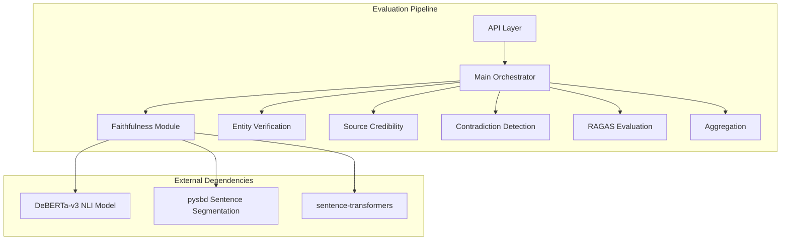
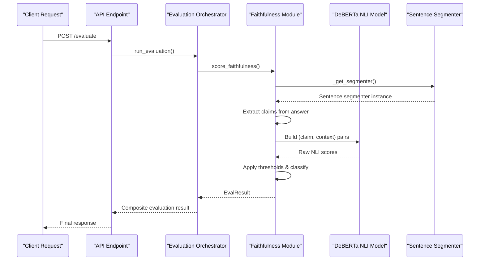
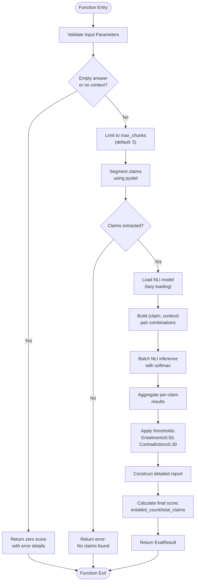
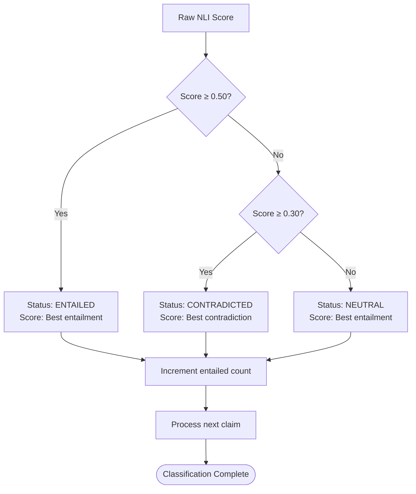
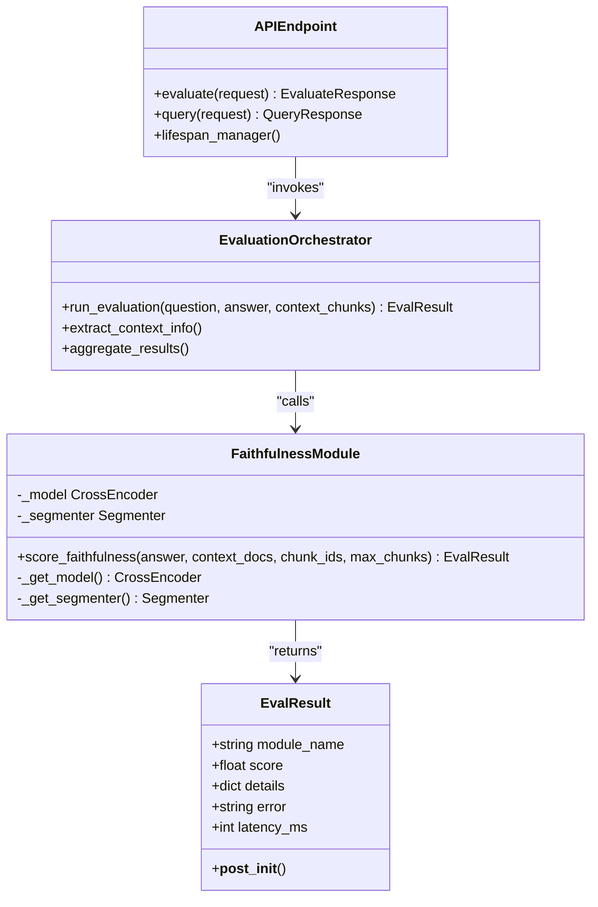
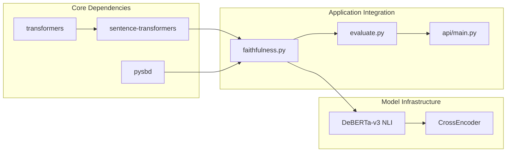
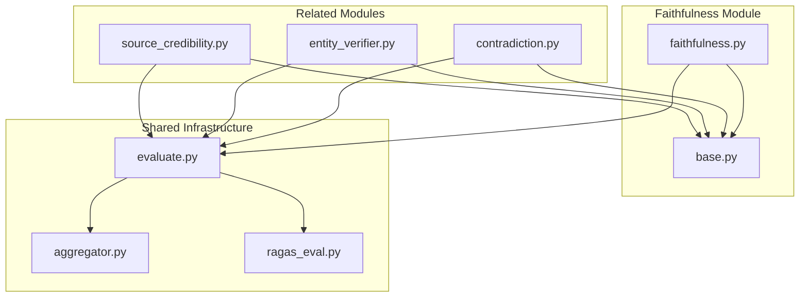
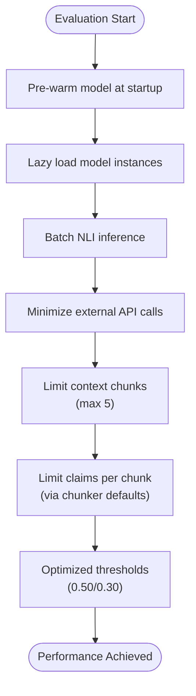
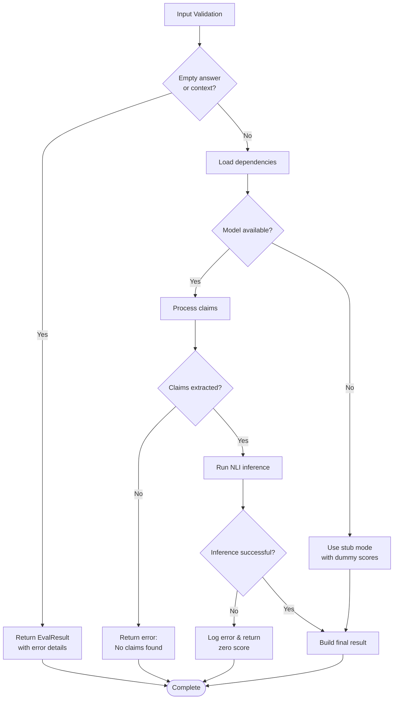

# Faithfulness Scoring Module

<cite>
**Referenced Files in This Document**
- [faithfulness.py](file://Backend/src/modules/faithfulness.py)
- [evaluate.py](file://Backend/src/evaluate.py)
- [main.py](file://Backend/src/api/main.py)
- [__init__.py](file://Backend/src/modules/__init__.py)
- [ragas_eval.py](file://Backend/src/evaluation/ragas_eval.py)
- [chunker.py](file://Backend/src/pipeline/chunker.py)
- [contradiction.py](file://Backend/src/modules/contradiction.py)
- [requirements.txt](file://Backend/requirements.txt)
- [test_modules.py](file://Backend/tests/test_modules.py)
</cite>

## Table of Contents
1. [Introduction](#introduction)
2. [Project Structure](#project-structure)
3. [Core Components](#core-components)
4. [Architecture Overview](#architecture-overview)
5. [Detailed Component Analysis](#detailed-component-analysis)
6. [Dependency Analysis](#dependency-analysis)
7. [Performance Considerations](#performance-considerations)
8. [Troubleshooting Guide](#troubleshooting-guide)
9. [Conclusion](#conclusion)

## Introduction

The Faithfulness Scoring module is a critical component of the MediRAG evaluation pipeline that verifies whether LLM-generated answers logically follow from provided context documents. Built around transformer-based Natural Language Inference (NLI) models, specifically the DeBERTa-v3 architecture, this module performs sentence-level claim analysis to detect logical entailment, contradiction, and neutral relationships between answer statements and retrieved context chunks.

The module implements a sophisticated threshold-based classification system that transforms raw NLI scores into interpretable faithfulness assessments. By leveraging cross-encoder models, it provides precise semantic verification capabilities essential for medical AI safety applications where factual accuracy is paramount.

## Project Structure

The Faithfulness module is part of a larger evaluation ecosystem within the MediRAG project, integrated with several other quality assessment modules:

**Diagram sources**
- [evaluate.py:49-167](file://Backend/src/evaluate.py#L49-L167)
- [faithfulness.py:58-79](file://Backend/src/modules/faithfulness.py#L58-L79)

**Section sources**
- [evaluate.py:1-251](file://Backend/src/evaluate.py#L1-L251)
- [faithfulness.py:1-234](file://Backend/src/modules/faithfulness.py#L1-L234)

## Core Components

### DeBERTa-v3 NLI Model Integration

The module utilizes the cross-encoder/nli-deberta-v3-small model, a specialized transformer architecture designed for natural language inference tasks. This model excels at understanding semantic relationships between text pairs, making it ideal for verifying whether answer claims are entailed by context documents.

**Key Model Specifications:**
- **Architecture**: DeBERTa-v3 cross-encoder
- **Model Name**: cross-encoder/nli-deberta-v3-small
- **Label Order**: [contradiction, neutral, entailment]
- **Threshold System**: 
  - Entailment ≥ 0.50 → ENTAILED
  - Contradiction ≥ 0.30 → CONTRADICTED  
  - Otherwise → NEUTRAL

### Sentence Boundary Detection

The module employs the pysbd library for robust sentence segmentation, crucial for breaking down complex LLM answers into discrete claims that can be individually verified against context. This fallback mechanism ensures reliable claim extraction even when advanced segmentation fails.

### Lazy Loading Architecture

The implementation features intelligent lazy loading with module-level caching to optimize resource usage and prevent redundant model initialization across multiple evaluations.

**Section sources**
- [faithfulness.py:39-79](file://Backend/src/modules/faithfulness.py#L39-L79)
- [requirements.txt:12-30](file://Backend/requirements.txt#L12-L30)

## Architecture Overview

The Faithfulness scoring process follows a systematic approach that transforms raw text into verifiable claims and validates them against retrieved context:

**Diagram sources**
- [evaluate.py:88-96](file://Backend/src/evaluate.py#L88-L96)
- [faithfulness.py:86-234](file://Backend/src/modules/faithfulness.py#L86-L234)

## Detailed Component Analysis

### Public API: score_faithfulness Function

The primary interface for faithfulness evaluation accepts structured parameters and returns standardized evaluation results:

**Diagram sources**
- [faithfulness.py:86-234](file://Backend/src/modules/faithfulness.py#L86-L234)

### Threshold-Based Classification System

The module implements a nuanced classification system that balances sensitivity and specificity for medical applications:

**Diagram sources**
- [faithfulness.py:189-210](file://Backend/src/modules/faithfulness.py#L189-L210)

### Integration with Evaluation Pipeline

The Faithfulness module seamlessly integrates with the broader evaluation ecosystem:

**Diagram sources**
- [evaluate.py:49-167](file://Backend/src/evaluate.py#L49-L167)
- [faithfulness.py:86-234](file://Backend/src/modules/faithfulness.py#L86-L234)
- [__init__.py:15-43](file://Backend/src/modules/__init__.py#L15-L43)

**Section sources**
- [evaluate.py:88-167](file://Backend/src/evaluate.py#L88-L167)
- [faithfulness.py:86-234](file://Backend/src/modules/faithfulness.py#L86-L234)
- [__init__.py:48-62](file://Backend/src/modules/__init__.py#L48-L62)

## Dependency Analysis

### External Library Dependencies

The module relies on several specialized libraries for optimal performance:

**Diagram sources**
- [requirements.txt:1-35](file://Backend/requirements.txt#L1-L35)
- [faithfulness.py:62-68](file://Backend/src/modules/faithfulness.py#L62-L68)

### Internal Module Relationships

The Faithfulness module collaborates with other evaluation components while maintaining independence:

**Diagram sources**
- [evaluate.py:35-40](file://Backend/src/evaluate.py#L35-L40)
- [contradiction.py:29](file://Backend/src/modules/contradiction.py#L29)

**Section sources**
- [requirements.txt:1-35](file://Backend/requirements.txt#L1-L35)
- [evaluate.py:35-40](file://Backend/src/evaluate.py#L35-L40)

## Performance Considerations

### Batch Processing Optimization

The module implements efficient batch processing to minimize computational overhead:

- **Pair Generation**: Creates Cartesian products of claims × context chunks for batch inference
- **Memory Management**: Uses lazy loading to avoid redundant model initialization
- **Chunk Limiting**: Defaults to 5 context chunks to balance accuracy vs. performance
- **Fallback Mechanisms**: Provides stub mode when dependencies are unavailable

### Latency Optimization Strategies

**Diagram sources**
- [main.py:125-148](file://Backend/src/api/main.py#L125-L148)
- [faithfulness.py:90](file://Backend/src/modules/faithfulness.py#L90)

### Memory Management

The module employs several strategies to manage memory efficiently:

- **Module-level Caching**: Single model instance shared across calls
- **Chunk Size Limits**: Controlled context window prevents memory overflow
- **Graceful Degradation**: Fallback to basic functionality when resources are constrained

**Section sources**
- [main.py:125-148](file://Backend/src/api/main.py#L125-L148)
- [faithfulness.py:58-79](file://Backend/src/modules/faithfulness.py#L58-L79)

## Troubleshooting Guide

### Common Issues and Solutions

| Issue | Symptoms | Solution |
|-------|----------|----------|
| **Missing Dependencies** | Import errors for sentence-transformers | Install requirements.txt dependencies |
| **Empty Results** | Zero claims extracted | Verify answer contains proper sentence boundaries |
| **Model Loading Failures** | NLI model import errors | Check CUDA availability and memory constraints |
| **Performance Degradation** | Slow inference times | Reduce max_chunks parameter, enable model caching |

### Error Handling Patterns

The module implements comprehensive error handling with graceful fallbacks:

**Diagram sources**
- [faithfulness.py:107-164](file://Backend/src/modules/faithfulness.py#L107-L164)

### Edge Case Handling

The module includes specific mechanisms for handling challenging scenarios:

- **Long Context Documents**: Automatically limits to 5 chunks to maintain performance
- **Complex Answers**: Uses sentence boundary detection for reliable claim extraction
- **Ambiguous Claims**: Applies conservative thresholds to minimize false positives
- **Model Unavailability**: Provides fallback functionality with informative error messages

**Section sources**
- [faithfulness.py:107-164](file://Backend/src/modules/faithfulness.py#L107-L164)
- [test_modules.py:17-28](file://Backend/tests/test_modules.py#L17-L28)

## Conclusion

The Faithfulness Scoring module represents a sophisticated implementation of transformer-based NLI for medical AI safety verification. Its integration of DeBERTa-v3 models, sentence segmentation, and threshold-based classification creates a robust system for detecting logical relationships between generated answers and supporting evidence.

The module's design emphasizes reliability, performance, and maintainability through lazy loading, batch processing, and comprehensive error handling. Its seamless integration with the broader MediRAG evaluation pipeline demonstrates how specialized components can work together to provide comprehensive quality assessment for AI-generated medical content.

Key strengths include:
- **Precision**: DeBERTa-v3 NLI provides accurate semantic verification
- **Scalability**: Lazy loading and batch processing optimize resource usage
- **Reliability**: Comprehensive error handling ensures graceful degradation
- **Integration**: Seamless coordination with other evaluation modules

The module serves as a foundation for medical AI safety systems, enabling healthcare organizations to deploy AI assistants with confidence in their factual accuracy and evidence-based reasoning capabilities.