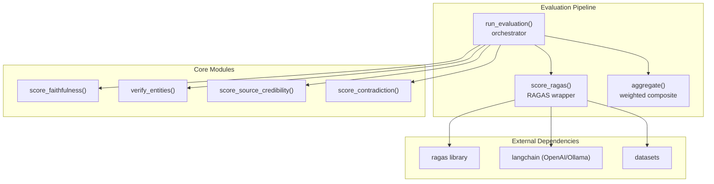
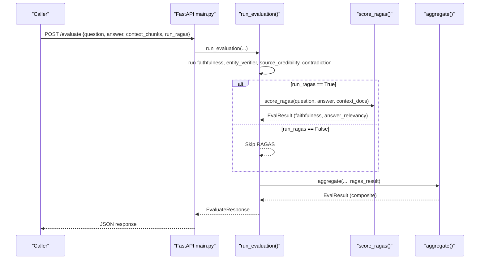
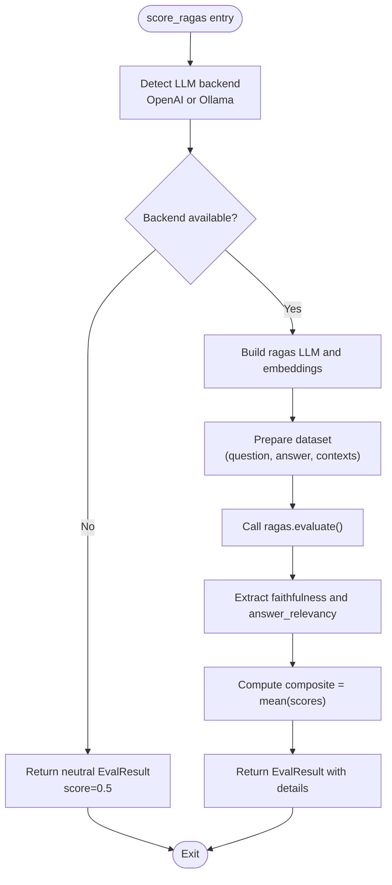
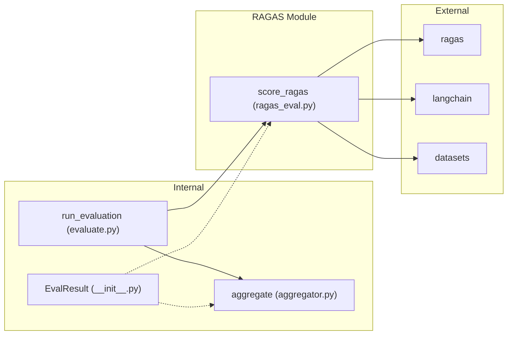

# RAGAS Evaluation Module

<cite>
**Referenced Files in This Document**
- [ragas_eval.py](file://Backend/src/evaluation/ragas_eval.py)
- [evaluate.py](file://Backend/src/evaluate.py)
- [aggregator.py](file://Backend/src/evaluation/aggregator.py)
- [base.py](file://Backend/src/modules/base.py)
- [__init__.py](file://Backend/src/modules/__init__.py)
- [faithfulness.py](file://Backend/src/modules/faithfulness.py)
- [entity_verifier.py](file://Backend/src/modules/entity_verifier.py)
- [source_credibility.py](file://Backend/src/modules/source_credibility.py)
- [contradiction.py](file://Backend/src/modules/contradiction.py)
- [main.py](file://Backend/src/api/main.py)
- [schemas.py](file://Backend/src/api/schemas.py)
- [config.yaml](file://Backend/config.yaml)
- [requirements.txt](file://Backend/requirements.txt)
</cite>

## Table of Contents
1. [Introduction](#introduction)
2. [Project Structure](#project-structure)
3. [Core Components](#core-components)
4. [Architecture Overview](#architecture-overview)
5. [Detailed Component Analysis](#detailed-component-analysis)
6. [Dependency Analysis](#dependency-analysis)
7. [Performance Considerations](#performance-considerations)
8. [Troubleshooting Guide](#troubleshooting-guide)
9. [Conclusion](#conclusion)
10. [Appendices](#appendices)

## Introduction
This document describes the RAGAS evaluation module within the MediRAG system. RAGAS (Retrieval Augmented Generation Assessment) evaluates how faithfully an LLM answer aligns with the retrieved context and how semantically relevant the answer is to the question. It complements the four core evaluation modules (faithfulness, entity verification, source credibility, and contradiction detection) with a robust, LLM-backed assessment that can detect hallucinations and measure contextual alignment.

Key characteristics:
- Optional integration: RAGAS is off by default and only activates when an LLM backend is available.
- Graceful fallback: If no LLM backend is available, RAGAS returns a neutral score without failing the pipeline.
- Composite scoring: The RAGAS module computes two metrics and averages them into a single composite score.
- Backends: Supports OpenAI and local Ollama deployments with environment-driven configuration.

## Project Structure
The RAGAS module is implemented as a thin wrapper around the external ragas library and integrates into the broader evaluation pipeline orchestrated by run_evaluation.

**Diagram sources**
- [evaluate.py:49-167](file://Backend/src/evaluate.py#L49-L167)
- [ragas_eval.py:81-178](file://Backend/src/evaluation/ragas_eval.py#L81-L178)
- [aggregator.py:47-166](file://Backend/src/evaluation/aggregator.py#L47-L166)

**Section sources**
- [evaluate.py:49-167](file://Backend/src/evaluate.py#L49-L167)
- [ragas_eval.py:81-178](file://Backend/src/evaluation/ragas_eval.py#L81-L178)
- [aggregator.py:47-166](file://Backend/src/evaluation/aggregator.py#L47-L166)

## Core Components
- RAGAS wrapper: Implements score_ragas() to compute faithfulness and answer relevance, then returns a composite score.
- Backend detection: Automatically selects OpenAI or Ollama based on environment variables and availability.
- Integration: run_evaluation() conditionally invokes RAGAS and passes results to the aggregator.

Key behaviors:
- Optional execution: Controlled by run_ragas parameter in run_evaluation().
- Neutral fallback: Returns a neutral score when no LLM backend is available.
- Composite metric: Averages faithfulness and answer relevance scores.

**Section sources**
- [ragas_eval.py:81-178](file://Backend/src/evaluation/ragas_eval.py#L81-L178)
- [evaluate.py:124-147](file://Backend/src/evaluate.py#L124-L147)

## Architecture Overview
The RAGAS module sits alongside the four core evaluation modules in the pipeline. It is invoked conditionally and contributes a small weight to the final composite score.

**Diagram sources**
- [main.py:223-302](file://Backend/src/api/main.py#L223-L302)
- [evaluate.py:49-167](file://Backend/src/evaluate.py#L49-L167)
- [ragas_eval.py:81-178](file://Backend/src/evaluation/ragas_eval.py#L81-L178)
- [aggregator.py:47-166](file://Backend/src/evaluation/aggregator.py#L47-L166)

## Detailed Component Analysis

### RAGAS Wrapper: score_ragas
Implements the RAGAS evaluation for a single (question, answer, context_docs) triplet.

- Parameters:
  - question: Original user question.
  - answer: LLM-generated answer.
  - context_docs: Retrieved context passages.
  - max_contexts: Upper bound on context chunks to pass to RAGAS to control token costs.

- Backend selection:
  - Checks for OPENAI_API_KEY; if present, uses OpenAI.
  - Otherwise checks Ollama availability via OLLAMA_HOST; if reachable, uses Ollama.
  - Falls back to neutral score if neither is available.

- Metrics computed:
  - Faithfulness: Context-grounded claim verification.
  - Answer Relevancy: Semantic similarity of answer to question.

- Output:
  - EvalResult with module_name="ragas".
  - score: average of faithfulness and answer_relevancy.
  - details: backend used, faithfulness, answer_relevancy, and optional notes or error.

- Error handling:
  - Returns neutral score on backend unavailability or exceptions.
  - Logs warnings and errors for observability.

**Diagram sources**
- [ragas_eval.py:81-178](file://Backend/src/evaluation/ragas_eval.py#L81-L178)

**Section sources**
- [ragas_eval.py:81-178](file://Backend/src/evaluation/ragas_eval.py#L81-L178)

### Backend Detection and Wrapping
- Backend detection:
  - Uses OPENAI_API_KEY environment variable to select OpenAI.
  - Uses OLLAMA_HOST environment variable to probe Ollama availability.
- LLM and embeddings wrappers:
  - OpenAI: ChatOpenAI and OpenAIEmbeddings.
  - Ollama: ChatOllama and OllamaEmbeddings with configurable base_url and model names.

**Section sources**
- [ragas_eval.py:35-74](file://Backend/src/evaluation/ragas_eval.py#L35-L74)

### Integration with run_evaluation
- Conditional invocation:
  - run_evaluation() accepts run_ragas parameter and calls score_ragas() only when True.
- Aggregation:
  - The aggregator includes a small weight for RAGAS in the composite score.
  - If RAGAS is unavailable, the aggregator treats it as a neutral contribution.

**Section sources**
- [evaluate.py:124-147](file://Backend/src/evaluate.py#L124-L147)
- [aggregator.py:37-44](file://Backend/src/evaluation/aggregator.py#L37-L44)

### API Integration and Safety Interventions
- API endpoint:
  - POST /evaluate accepts run_ragas and forwards it to run_evaluation().
- Safety gate:
  - The system can block or regenerate answers based on composite scores and module results.
  - RAGAS is optional; if unavailable, the pipeline proceeds without it.

**Section sources**
- [main.py:223-302](file://Backend/src/api/main.py#L223-L302)
- [main.py:413-485](file://Backend/src/api/main.py#L413-L485)

### Comparison with Traditional Safety Modules
- Faithfulness: Uses a cross-encoder NLI model to classify claims as entailed, neutral, or contradicted.
- Entity Verifier: Extracts medical entities and validates drugs against RxNorm.
- Source Credibility: Scores evidence tiers based on metadata or keyword matching.
- Contradiction: Detects contradictions between answer sentences and context sentences.
- RAGAS: Uses LLMs to assess faithfulness and answer relevancy, complementing the NLI-based faithfulness.

**Section sources**
- [faithfulness.py:86-234](file://Backend/src/modules/faithfulness.py#L86-L234)
- [entity_verifier.py:146-283](file://Backend/src/modules/entity_verifier.py#L146-L283)
- [source_credibility.py:121-200](file://Backend/src/modules/source_credibility.py#L121-L200)
- [contradiction.py:94-251](file://Backend/src/modules/contradiction.py#L94-L251)

## Dependency Analysis
- External libraries:
  - ragas: Provides metrics and evaluation harness.
  - langchain (OpenAI/Ollama): Bridges ragas to LLM providers.
  - datasets: Converts inputs into ragas-compatible datasets.
- Internal dependencies:
  - EvalResult: Standardized output schema across modules.
  - run_evaluation: Orchestrator that conditionally invokes RAGAS.
  - aggregator: Incorporates RAGAS into the composite score.

**Diagram sources**
- [__init__.py:15-43](file://Backend/src/modules/__init__.py#L15-L43)
- [evaluate.py:49-167](file://Backend/src/evaluate.py#L49-L167)
- [aggregator.py:47-166](file://Backend/src/evaluation/aggregator.py#L47-L166)
- [ragas_eval.py:123-125](file://Backend/src/evaluation/ragas_eval.py#L123-L125)

**Section sources**
- [requirements.txt:18](file://Backend/requirements.txt#L18)
- [ragas_eval.py:123-125](file://Backend/src/evaluation/ragas_eval.py#L123-L125)

## Performance Considerations
- Optional execution reduces latency when LLM backends are unavailable.
- max_contexts parameter controls token usage and speeds up evaluation.
- RAGAS introduces network calls to OpenAI or Ollama; ensure adequate timeouts and resource allocation.
- The aggregator applies penalties for extremely poor faithfulness or contradiction scores, which can reduce the composite score even if RAGAS is neutral.

Best practices:
- Enable RAGAS only when an LLM backend is available and responsive.
- Tune max_contexts to balance accuracy and speed.
- Monitor latency_ms in EvalResult details to track performance.

**Section sources**
- [ragas_eval.py:85](file://Backend/src/evaluation/ragas_eval.py#L85)
- [aggregator.py:98-107](file://Backend/src/evaluation/aggregator.py#L98-L107)

## Troubleshooting Guide
Common issues and resolutions:
- No LLM backend available:
  - Symptom: RAGAS returns neutral score and logs a warning.
  - Resolution: Set OPENAI_API_KEY or start Ollama (ensure OLLAMA_HOST points to the service).
- OpenAI API errors:
  - Symptom: Exceptions caught and logged; RAGAS returns neutral score.
  - Resolution: Verify API key and rate limits; retry later.
- Ollama connectivity:
  - Symptom: Backend detection fails; RAGAS falls back to neutral.
  - Resolution: Confirm Ollama is running and reachable at OLLAMA_HOST.
- Environment variables:
  - OPENAI_API_KEY: Required for OpenAI backend.
  - OLLAMA_HOST: Base URL for Ollama; defaults to localhost:11434.
  - OLLAMA_MODEL and OLLAMA_EMBED_MODEL: Optional overrides for model names.

Operational tips:
- Use the /health endpoint to check Ollama availability.
- Review EvalResult.error and details for granular diagnostics.
- For API calls, set run_ragas appropriately based on backend availability.

**Section sources**
- [ragas_eval.py:104-120](file://Backend/src/evaluation/ragas_eval.py#L104-L120)
- [ragas_eval.py:169-177](file://Backend/src/evaluation/ragas_eval.py#L169-L177)
- [main.py:179-186](file://Backend/src/api/main.py#L179-L186)

## Conclusion
The RAGAS evaluation module provides a powerful, optional augmentation to the MediRAG evaluation pipeline. By leveraging LLMs to assess faithfulness and answer relevancy, it offers complementary insights to the NLI-based faithfulness and other safety modules. Its graceful fallback ensures robustness, while its integration with run_evaluation and the aggregator enables a balanced, weighted composite score. Proper configuration of LLM backends and environment variables is essential for reliable operation.

## Appendices

### API Definitions and Usage
- Endpoint: POST /evaluate
  - Body fields:
    - question: string (validated by schema)
    - answer: string (validated by schema)
    - context_chunks: array of ContextChunk (validated by schema)
    - run_ragas: boolean (default False)
    - Additional optional fields for LLM overrides and cache path
  - Response fields:
    - composite_score: float in [0, 1]
    - hrs: integer in [0, 100]
    - confidence_level: string
    - risk_band: string
    - module_results: includes ragas if enabled
    - total_pipeline_ms: integer

**Section sources**
- [schemas.py:41-83](file://Backend/src/api/schemas.py#L41-L83)
- [schemas.py:113-133](file://Backend/src/api/schemas.py#L113-L133)
- [main.py:223-302](file://Backend/src/api/main.py#L223-L302)

### Configuration Options
- Environment variables:
  - OPENAI_API_KEY: Enables OpenAI backend.
  - OLLAMA_HOST: Base URL for Ollama (default: localhost:11434).
  - OLLAMA_MODEL: Model name for ChatOllama (default: mistral).
  - OLLAMA_EMBED_MODEL: Model name for Ollama embeddings (default: nomic-embed-text).
- Pipeline configuration:
  - run_ragas: Boolean controlling whether RAGAS is executed.
  - weights: Optional override for aggregator weights (includes ragas_composite).

**Section sources**
- [ragas_eval.py:37-61](file://Backend/src/evaluation/ragas_eval.py#L37-L61)
- [evaluate.py:54](file://Backend/src/evaluate.py#L54)
- [aggregator.py:37-44](file://Backend/src/evaluation/aggregator.py#L37-L44)

### Metric Interpretation
- Faithfulness:
  - Proportion of claims in the answer that are entailed by the context.
- Answer Relevancy:
  - Semantic similarity between the answer and the question.
- Composite:
  - Average of the two metrics; higher is better.
- Aggregation:
  - RAGAS contributes a small weight to the final composite score; neutral fallback is used when unavailable.

**Section sources**
- [ragas_eval.py:147-149](file://Backend/src/evaluation/ragas_eval.py#L147-L149)
- [aggregator.py:37-44](file://Backend/src/evaluation/aggregator.py#L37-L44)

### Example Scenarios
- Scenario A: RAGAS enabled with OpenAI
  - Set OPENAI_API_KEY.
  - Call POST /evaluate with run_ragas=True.
  - Expect RAGAS to compute faithfulness and answer_relevancy and contribute to the composite.
- Scenario B: RAGAS disabled
  - Call POST /evaluate with run_ragas=False.
  - RAGAS is skipped; pipeline proceeds without it.
- Scenario C: Ollama available
  - Ensure Ollama is running and reachable at OLLAMA_HOST.
  - Optionally set OLLAMA_MODEL and OLLAMA_EMBED_MODEL.
  - Call with run_ragas=True to enable RAGAS.

**Section sources**
- [main.py:223-302](file://Backend/src/api/main.py#L223-L302)
- [ragas_eval.py:37-61](file://Backend/src/evaluation/ragas_eval.py#L37-L61)