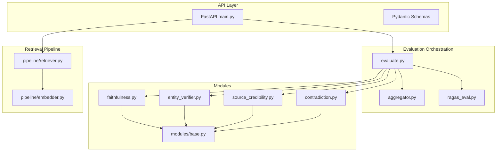
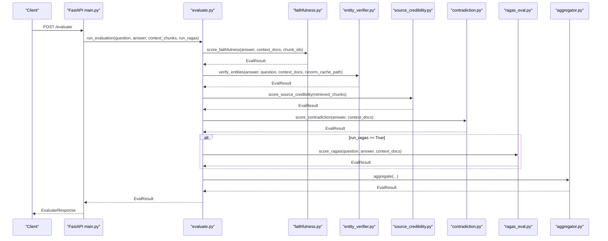
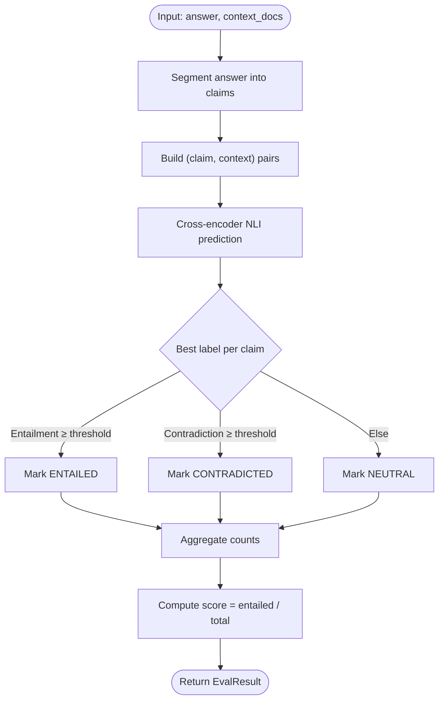
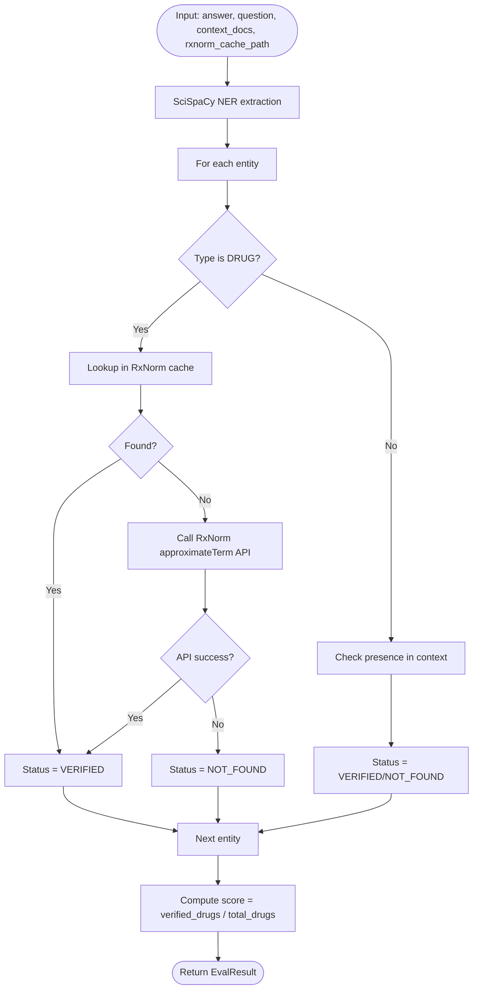
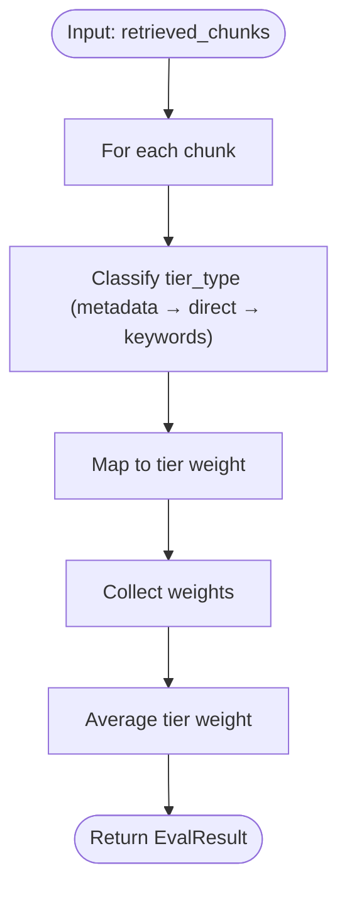
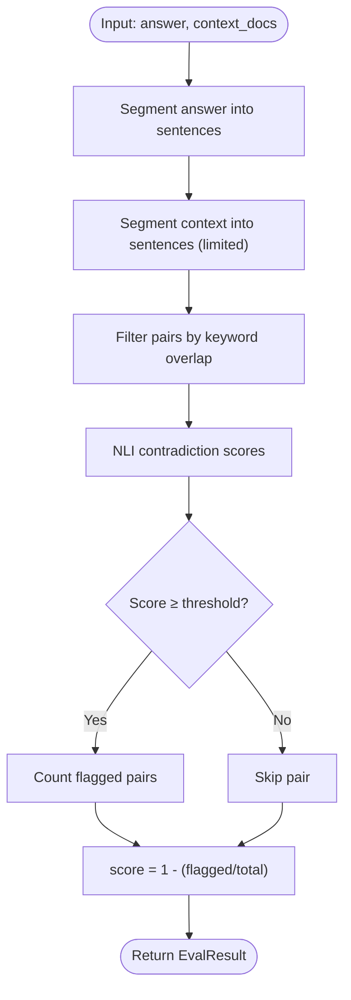
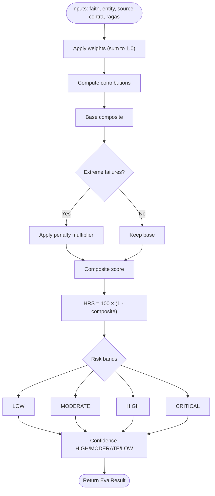
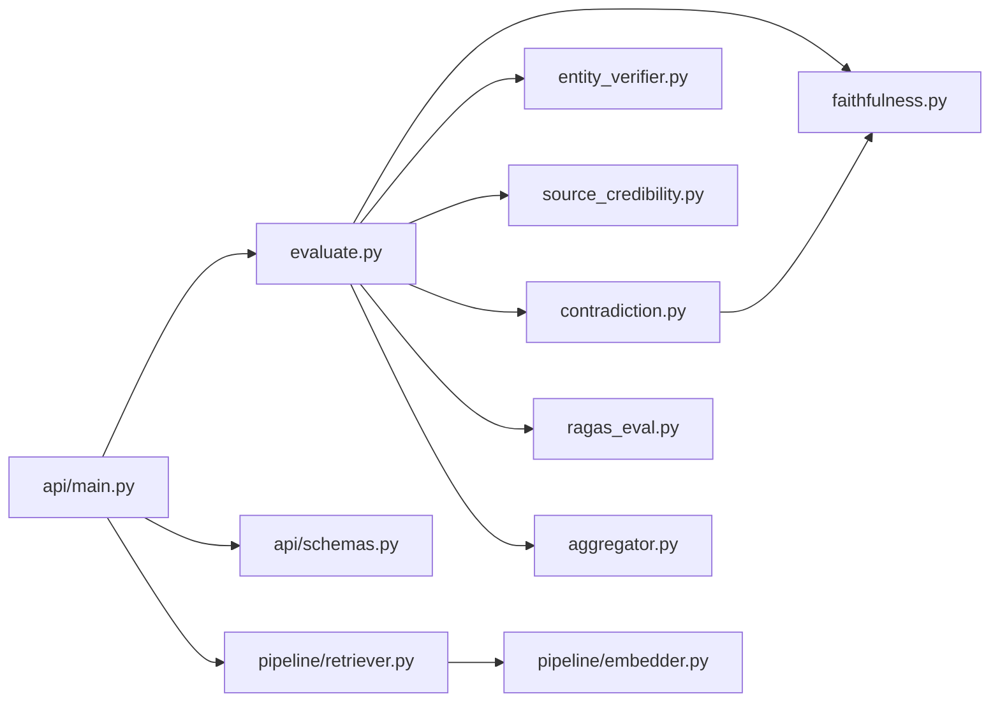

# Safety Evaluation Engine

<cite>
**Referenced Files in This Document**
- [evaluate.py](file://Backend/src/evaluate.py)
- [base.py](file://Backend/src/modules/base.py)
- [faithfulness.py](file://Backend/src/modules/faithfulness.py)
- [entity_verifier.py](file://Backend/src/modules/entity_verifier.py)
- [source_credibility.py](file://Backend/src/modules/source_credibility.py)
- [contradiction.py](file://Backend/src/modules/contradiction.py)
- [aggregator.py](file://Backend/src/evaluation/aggregator.py)
- [ragas_eval.py](file://Backend/src/evaluation/ragas_eval.py)
- [retriever.py](file://Backend/src/pipeline/retriever.py)
- [embedder.py](file://Backend/src/pipeline/embedder.py)
- [main.py](file://Backend/src/api/main.py)
- [schemas.py](file://Backend/src/api/schemas.py)
- [config.yaml](file://Backend/config.yaml)
</cite>

## Table of Contents
1. [Introduction](#introduction)
2. [Project Structure](#project-structure)
3. [Core Components](#core-components)
4. [Architecture Overview](#architecture-overview)
5. [Detailed Component Analysis](#detailed-component-analysis)
6. [Dependency Analysis](#dependency-analysis)
7. [Performance Considerations](#performance-considerations)
8. [Troubleshooting Guide](#troubleshooting-guide)
9. [Conclusion](#conclusion)
10. [Appendices](#appendices)

## Introduction
This document describes the MediRAG 3.0 Safety Evaluation Engine, a four-layer audit system designed to assess the safety and reliability of AI-generated medical answers. The engine evaluates answers against retrieved evidence using:
- Faithfulness Scoring (DeBERTa-v3 NLI)
- Entity Verification (SciSpaCy NER + RxNorm API)
- Source Credibility Ranking (Evidence Tier)
- Contradiction Detection (DeBERTa-v3 NLI cross-check)

It integrates with a hybrid retrieval system (FAISS + BM25) and an optional RAGAS module, then aggregates results into a composite Health Risk Score (HRS) with configurable weights and risk bands. The API exposes endpoints for evaluation and end-to-end query-and-evaluate with automated safety interventions.

## Project Structure
The evaluation engine is organized into modular packages:
- src/evaluate.py: Orchestration of the full pipeline
- src/modules/: Individual evaluation modules (faithfulness, entity_verifier, source_credibility, contradiction)
- src/evaluation/: Aggregation and optional RAGAS scoring
- src/pipeline/: Retrieval and embedding infrastructure
- src/api/: FastAPI service exposing evaluation and query endpoints
- Backend/config.yaml: Central configuration for models, thresholds, and weights

**Diagram sources**
- [main.py:156-302](file://Backend/src/api/main.py#L156-L302)
- [evaluate.py:49-167](file://Backend/src/evaluate.py#L49-L167)
- [aggregator.py:47-166](file://Backend/src/evaluation/aggregator.py#L47-L166)
- [ragas_eval.py:81-177](file://Backend/src/evaluation/ragas_eval.py#L81-L177)
- [faithfulness.py:86-233](file://Backend/src/modules/faithfulness.py#L86-L233)
- [entity_verifier.py:146-282](file://Backend/src/modules/entity_verifier.py#L146-L282)
- [source_credibility.py:121-199](file://Backend/src/modules/source_credibility.py#L121-L199)
- [contradiction.py:94-250](file://Backend/src/modules/contradiction.py#L94-L250)
- [retriever.py:149-250](file://Backend/src/pipeline/retriever.py#L149-L250)
- [embedder.py:139-163](file://Backend/src/pipeline/embedder.py#L139-L163)

**Section sources**
- [evaluate.py:1-251](file://Backend/src/evaluate.py#L1-L251)
- [config.yaml:1-66](file://Backend/config.yaml#L1-L66)

## Core Components
- Evaluation Orchestrator: Executes modules in sequence, collects results, and aggregates into a composite score.
- Faithfulness Scoring: Splits answers into claims and checks entailment against context using a cross-encoder DeBERTa-v3 model.
- Entity Verification: Extracts medical entities with SciSpaCy and validates drugs via RxNorm cache/API; flags discrepancies.
- Source Credibility: Computes average evidence tier weight from metadata or keyword classification.
- Contradiction Detection: Compares answer sentences to context sentences using DeBERTa-v3 to detect contradictions.
- Aggregator: Applies configurable weights and risk bands; includes non-linear penalties for extreme failures.
- Optional RAGAS: Uses an LLM backend to compute faithfulness and answer relevance.

**Section sources**
- [evaluate.py:49-167](file://Backend/src/evaluate.py#L49-L167)
- [faithfulness.py:86-233](file://Backend/src/modules/faithfulness.py#L86-L233)
- [entity_verifier.py:146-282](file://Backend/src/modules/entity_verifier.py#L146-L282)
- [source_credibility.py:121-199](file://Backend/src/modules/source_credibility.py#L121-L199)
- [contradiction.py:94-250](file://Backend/src/modules/contradiction.py#L94-L250)
- [aggregator.py:47-166](file://Backend/src/evaluation/aggregator.py#L47-L166)
- [ragas_eval.py:81-177](file://Backend/src/evaluation/ragas_eval.py#L81-L177)

## Architecture Overview
The system follows a layered evaluation architecture:
- Input: Question, LLM answer, and top-k context chunks
- Modules: Faithfulness, Entity Verification, Source Credibility, Contradiction
- Optional: RAGAS (faithfulness + answer relevancy)
- Aggregation: Weighted composite score with risk bands and confidence
- Output: Composite score, HRS, risk band, confidence, and per-module details

**Diagram sources**
- [main.py:223-302](file://Backend/src/api/main.py#L223-L302)
- [evaluate.py:49-167](file://Backend/src/evaluate.py#L49-L167)
- [aggregator.py:47-166](file://Backend/src/evaluation/aggregator.py#L47-L166)
- [ragas_eval.py:81-177](file://Backend/src/evaluation/ragas_eval.py#L81-L177)
- [faithfulness.py:86-233](file://Backend/src/modules/faithfulness.py#L86-L233)
- [entity_verifier.py:146-282](file://Backend/src/modules/entity_verifier.py#L146-L282)
- [source_credibility.py:121-199](file://Backend/src/modules/source_credibility.py#L121-L199)
- [contradiction.py:94-250](file://Backend/src/modules/contradiction.py#L94-L250)

## Detailed Component Analysis

### Faithfulness Scoring (DeBERTa-v3 NLI)
- Purpose: Measure how well the answer is entailed by the retrieved context.
- Method: Sentence segmentation, claim-to-context pairing, cross-encoder NLI prediction, threshold-based classification.
- Thresholds: Entrained vs. Neutral vs. Contradicted using module-defined thresholds.
- Model: DeBERTa-v3 small cross-encoder; loaded lazily and cached.

**Diagram sources**
- [faithfulness.py:86-233](file://Backend/src/modules/faithfulness.py#L86-L233)

**Section sources**
- [faithfulness.py:1-234](file://Backend/src/modules/faithfulness.py#L1-L234)
- [config.yaml:10-15](file://Backend/config.yaml#L10-L15)

### Entity Verification (SciSpaCy + RxNorm)
- Purpose: Extract and validate medical entities; verify drugs via RxNorm cache/API; flag dangerous mismatches.
- Method: SciSpaCy NER for DRUG/DOSAGE/CONDITION/PROCEDURE; RxNorm approximateTerm API fallback; context presence check.
- Severity mapping: Brand vs. generic mismatch, dosage discrepancy, synonym variants.

**Diagram sources**
- [entity_verifier.py:146-282](file://Backend/src/modules/entity_verifier.py#L146-L282)

**Section sources**
- [entity_verifier.py:1-283](file://Backend/src/modules/entity_verifier.py#L1-L283)
- [config.yaml:16-22](file://Backend/config.yaml#L16-L22)

### Source Credibility Ranking (Evidence Tier)
- Purpose: Quantify the trustworthiness of retrieved sources using evidence tiers.
- Method: Metadata-first classification; fallback to keyword matching; average weighted tier score.

**Diagram sources**
- [source_credibility.py:121-199](file://Backend/src/modules/source_credibility.py#L121-L199)

**Section sources**
- [source_credibility.py:1-200](file://Backend/src/modules/source_credibility.py#L1-L200)
- [config.yaml:23-25](file://Backend/config.yaml#L23-L25)

### Contradiction Detection (DeBERTa-v3 NLI Cross-Check)
- Purpose: Detect contradictions between answer sentences and context sentences.
- Method: Sentence segmentation, contextual sentence sampling, keyword overlap filter, NLI scoring, threshold-based flagging.

**Diagram sources**
- [contradiction.py:94-250](file://Backend/src/modules/contradiction.py#L94-L250)

**Section sources**
- [contradiction.py:1-251](file://Backend/src/modules/contradiction.py#L1-L251)
- [config.yaml:26-30](file://Backend/config.yaml#L26-L30)

### Aggregation and Risk Assessment
- Purpose: Combine module scores into a composite score with risk bands and confidence.
- Method: Weighted sum with normalization; non-linear penalties for extreme failures; HRS mapping to risk bands.

**Diagram sources**
- [aggregator.py:47-166](file://Backend/src/evaluation/aggregator.py#L47-L166)

**Section sources**
- [aggregator.py:1-167](file://Backend/src/evaluation/aggregator.py#L1-L167)
- [config.yaml:32-42](file://Backend/config.yaml#L32-L42)

### Optional RAGAS Module
- Purpose: Additional faithfulness and answer relevancy computed via an LLM backend.
- Method: Auto-detect Ollama or OpenAI; configure metrics; evaluate and return composite.

**Section sources**
- [ragas_eval.py:1-178](file://Backend/src/evaluation/ragas_eval.py#L1-L178)
- [config.yaml:44-52](file://Backend/config.yaml#L44-L52)

### Retrieval Infrastructure (FAISS + BM25)
- Purpose: Hybrid retrieval combining semantic (BioBERT + FAISS) and keyword (BM25) signals with Reciprocal Rank Fusion.
- Method: Lazy loading of models and indices; rebuild BM25 on demand; RRF scoring.

**Section sources**
- [retriever.py:1-287](file://Backend/src/pipeline/retriever.py#L1-L287)
- [embedder.py:1-164](file://Backend/src/pipeline/embedder.py#L1-L164)
- [config.yaml:1-7](file://Backend/config.yaml#L1-L7)

## Dependency Analysis
Key dependencies and coupling:
- evaluate.py orchestrates all modules and depends on aggregator.py and optional ragas_eval.py.
- Faithfulness and Contradiction share the DeBERTa NLI model via lazy loading; contradiction.py imports the model from faithfulness.py.
- Entity Verifier depends on SciSpaCy and RxNorm API; relies on a local cache CSV.
- Source Credibility depends on chunk metadata and keyword classification rules.
- Aggregator depends on configured weights and applies non-linear penalties.
- API main.py depends on schemas.py and invokes evaluate.py; implements safety interventions.

**Diagram sources**
- [evaluate.py:49-167](file://Backend/src/evaluate.py#L49-L167)
- [aggregator.py:47-166](file://Backend/src/evaluation/aggregator.py#L47-L166)
- [ragas_eval.py:81-177](file://Backend/src/evaluation/ragas_eval.py#L81-L177)
- [faithfulness.py:86-233](file://Backend/src/modules/faithfulness.py#L86-L233)
- [entity_verifier.py:146-282](file://Backend/src/modules/entity_verifier.py#L146-L282)
- [source_credibility.py:121-199](file://Backend/src/modules/source_credibility.py#L121-L199)
- [contradiction.py:94-250](file://Backend/src/modules/contradiction.py#L94-L250)
- [main.py:223-302](file://Backend/src/api/main.py#L223-L302)
- [schemas.py:41-231](file://Backend/src/api/schemas.py#L41-L231)
- [retriever.py:149-250](file://Backend/src/pipeline/retriever.py#L149-L250)
- [embedder.py:139-163](file://Backend/src/pipeline/embedder.py#L139-L163)

**Section sources**
- [evaluate.py:1-251](file://Backend/src/evaluate.py#L1-L251)
- [main.py:1-678](file://Backend/src/api/main.py#L1-L678)

## Performance Considerations
- Model Loading: DeBERTa NLI and SciSpaCy models are loaded lazily and cached to avoid repeated initialization overhead.
- Batch Sizes: Configurable batch sizes for NLI inference and embedding encoding to balance throughput and memory.
- Latency Caps: Contradiction module limits context sentences and total pairs to bound inference time.
- Hybrid Retrieval: FAISS + BM25 with RRF balances precision and recall while controlling candidate sets.
- Optional RAGAS: Disabled by default to avoid LLM backend overhead; enabled only when available.

[No sources needed since this section provides general guidance]

## Troubleshooting Guide
Common issues and resolutions:
- Missing NLI/NER Libraries: Faithfulness and Contradiction modules return neutral or stubbed results when sentence-transformers or pysbd are unavailable.
- SciSpaCy Model Not Installed: Entity Verifier raises an error requiring installation of the large English biomedical model.
- RxNorm Cache/API Failures: If cache is missing or API calls fail, the module falls back to neutral scores; verify cache path and network connectivity.
- FAISS/BM25 Unavailable: Retrieval returns empty results; ensure FAISS index and metadata are built and dependencies are installed.
- RAGAS Backend Missing: The module gracefully returns neutral scores; set OPENAI_API_KEY or start Ollama to enable.
- Safety Interventions: The API applies automatic interventions for CRITICAL risk or high contradiction; review intervention logs and adjust thresholds if needed.

**Section sources**
- [faithfulness.py:58-79](file://Backend/src/modules/faithfulness.py#L58-L79)
- [entity_verifier.py:70-86](file://Backend/src/modules/entity_verifier.py#L70-L86)
- [contradiction.py:121-148](file://Backend/src/modules/contradiction.py#L121-L148)
- [ragas_eval.py:104-120](file://Backend/src/evaluation/ragas_eval.py#L104-L120)
- [retriever.py:80-114](file://Backend/src/pipeline/retriever.py#L80-L114)
- [main.py:430-484](file://Backend/src/api/main.py#L430-L484)

## Conclusion
The MediRAG 3.0 Safety Evaluation Engine provides a robust, modular framework for auditing AI-generated medical answers. By combining DeBERTa-v3 NLI-based faithfulness and contradiction checks, SciSpaCy/RxNorm-based entity verification, and evidence-tier source credibility, it produces a reliable composite Health Risk Score with configurable risk bands. The hybrid retrieval pipeline ensures high-quality context, while the API offers both evaluation-as-a-service and end-to-end query-and-intervention capabilities.

[No sources needed since this section summarizes without analyzing specific files]

## Appendices

### Configuration Options
- Retrieval: top_k, chunk_size, chunk_overlap, embedding_model, index_path, metadata_path
- Modules:
  - Faithfulness: nli_model, entailment_threshold, max_nli_tokens, truncate_side, deberta_batch_size
  - Entity Verifier: spacy_model, critical_entity_types, dosage_tolerance_pct, rxnorm_api_url, rxnorm_api_timeout_s, rxnorm_cache_path
  - Source Credibility: method, tier_weights
  - Contradiction: nli_model, confidence_threshold, max_sentence_pairs, deberta_batch_size
- Aggregator: weights, risk_bands
- LLM: provider, API keys, model, base_url, timeouts, temperatures
- API: host, port, max lengths, chunk limits
- Logging: level, file, format

**Section sources**
- [config.yaml:1-66](file://Backend/config.yaml#L1-L66)

### Evaluation Results Interpretation
- Composite Score: Weighted combination of module scores; higher is better.
- Health Risk Score (HRS): 100 × (1 − composite); higher indicates greater risk.
- Risk Bands: LOW (0–30), MODERATE (31–60), HIGH (61–85), CRITICAL (86–100).
- Confidence Level: Based on composite score; HIGH/MODERATE/LOW.
- Per-Module Details: Claims, entities, contradictions, and tier classifications.

**Section sources**
- [aggregator.py:109-128](file://Backend/src/evaluation/aggregator.py#L109-L128)
- [config.yaml:38-42](file://Backend/config.yaml#L38-L42)

### Safety Intervention Triggers
- CRITICAL_BLOCKED: HRS ≥ 86; response is blocked and replaced with a safety notice.
- HIGH_RISK_REGENERATED: HRS ≥ 40 or faithfulness < 1.0; regenerates answer with a strict prompt and re-evaluates.

**Section sources**
- [main.py:430-484](file://Backend/src/api/main.py#L430-L484)