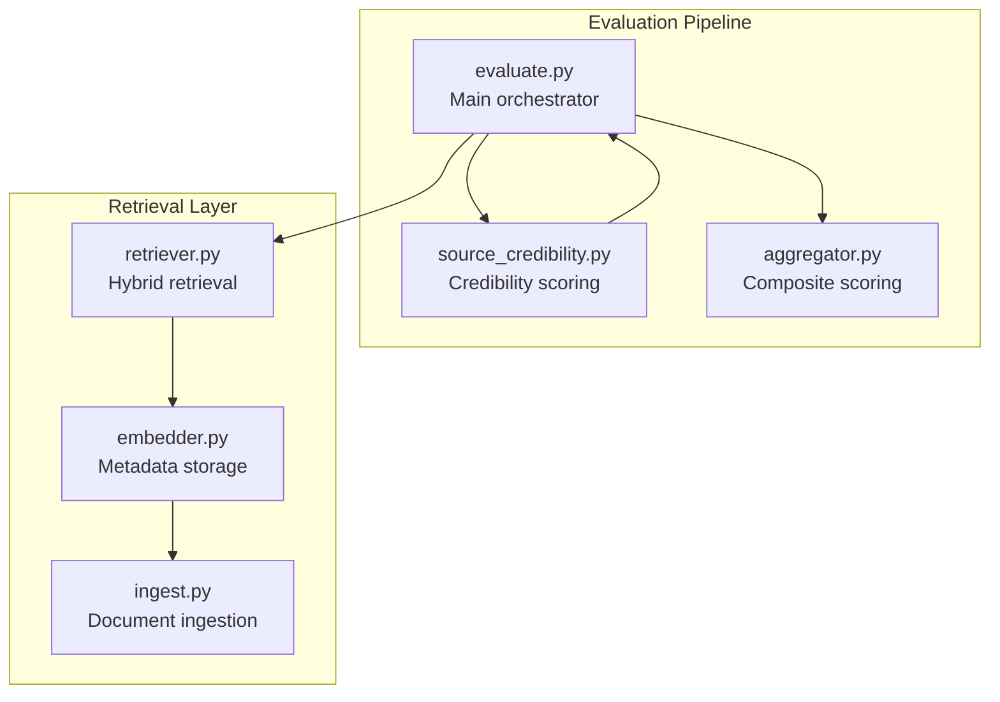
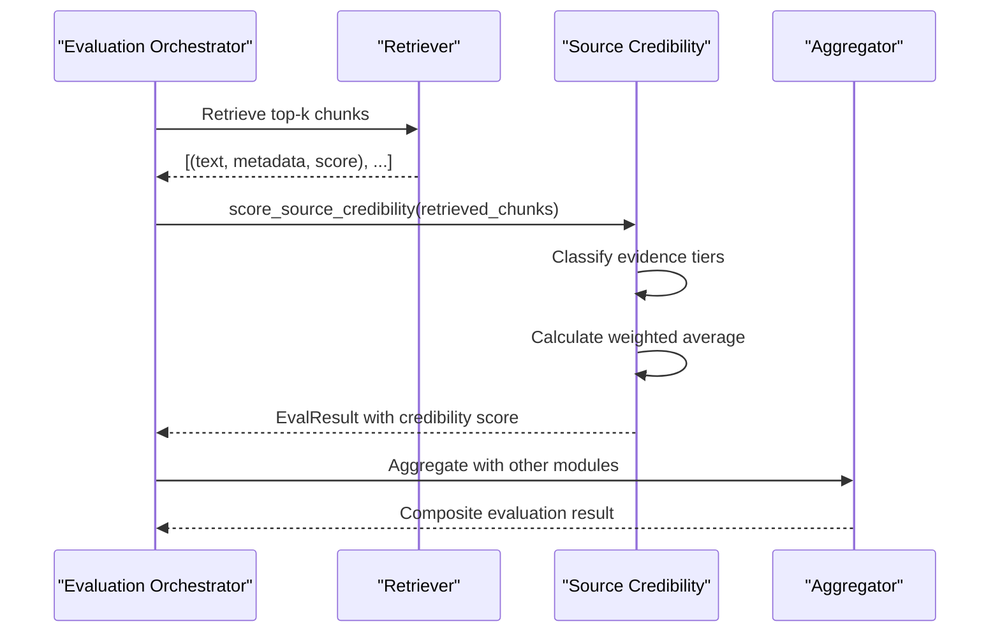
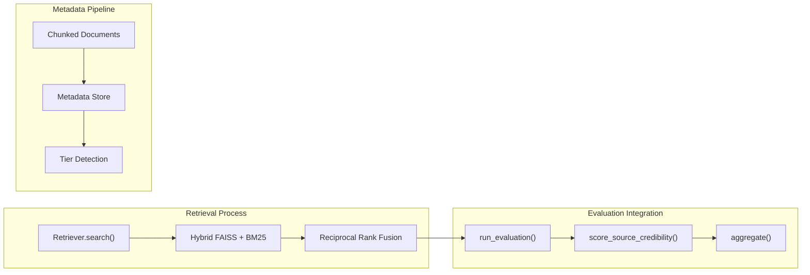
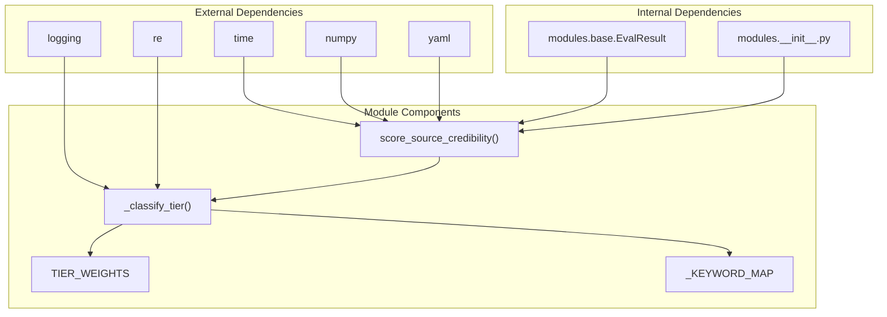

# Source Credibility Module

<cite>
**Referenced Files in This Document**
- [source_credibility.py](file://Backend/src/modules/source_credibility.py)
- [__init__.py](file://Backend/src/modules/__init__.py)
- [base.py](file://Backend/src/modules/base.py)
- [evaluate.py](file://Backend/src/evaluate.py)
- [retriever.py](file://Backend/src/pipeline/retriever.py)
- [embedder.py](file://Backend/src/pipeline/embedder.py)
- [ingest.py](file://Backend/src/pipeline/ingest.py)
- [aggregator.py](file://Backend/src/evaluation/aggregator.py)
- [test_modules.py](file://Backend/tests/test_modules.py)
</cite>

## Table of Contents
1. [Introduction](#introduction)
2. [Project Structure](#project-structure)
3. [Core Components](#core-components)
4. [Architecture Overview](#architecture-overview)
5. [Detailed Component Analysis](#detailed-component-analysis)
6. [Dependency Analysis](#dependency-analysis)
7. [Performance Considerations](#performance-considerations)
8. [Troubleshooting Guide](#troubleshooting-guide)
9. [Conclusion](#conclusion)

## Introduction
The Source Credibility Module evaluates the reliability and quality of retrieved medical documents by analyzing their evidence tiers and publication types. It transforms document metadata into a standardized credibility score that informs downstream evaluation confidence levels. This module implements a tier-based weighting system aligned with medical evidence hierarchies, incorporating both explicit metadata signals and keyword-based fallback detection.

## Project Structure
The Source Credibility Module is part of the evaluation pipeline within the Backend/src/modules directory. It integrates with the broader evaluation framework and relies on metadata produced during the ingestion and embedding stages.



**Diagram sources**
- [evaluate.py:49-167](file://Backend/src/evaluate.py#L49-L167)
- [source_credibility.py:121-199](file://Backend/src/modules/source_credibility.py#L121-L199)
- [retriever.py:39-250](file://Backend/src/pipeline/retriever.py#L39-L250)
- [embedder.py:95-153](file://Backend/src/pipeline/embedder.py#L95-L153)
- [ingest.py:48-183](file://Backend/src/pipeline/ingest.py#L48-L183)

**Section sources**
- [evaluate.py:1-251](file://Backend/src/evaluate.py#L1-L251)
- [source_credibility.py:1-200](file://Backend/src/modules/source_credibility.py#L1-L200)

## Core Components
The module consists of two primary components: the evidence tier classification system and the credibility scoring function.

### Evidence Tier Classification System
The module implements a hierarchical classification system with six tiers, each assigned a specific weight:
- Clinical Guideline: 1.00 (Tier 1 - highest authority)
- Systematic Review: 0.85 (Tier 2)
- Research Abstract: 0.70 (Tier 3 - PubMedQA default)
- Review Article: 0.60 (Tier 4)
- Clinical Case: 0.50 (Tier 5)
- Unknown/Other: 0.30 (fallback)

### Scoring Methodology
The module calculates a weighted average of tier weights across all retrieved chunks, providing both individual chunk analysis and overall document quality assessment.

**Section sources**
- [source_credibility.py:39-47](file://Backend/src/modules/source_credibility.py#L39-L47)
- [source_credibility.py:121-199](file://Backend/src/modules/source_credibility.py#L121-L199)

## Architecture Overview
The Source Credibility Module operates within the evaluation pipeline, receiving retrieved document chunks and returning standardized credibility assessments.



**Diagram sources**
- [evaluate.py:110-147](file://Backend/src/evaluate.py#L110-L147)
- [source_credibility.py:121-199](file://Backend/src/modules/source_credibility.py#L121-L199)
- [retriever.py:149-250](file://Backend/src/pipeline/retriever.py#L149-L250)

## Detailed Component Analysis

### Evidence Tier Classification Engine
The classification engine implements a three-tier priority system for determining document quality:

```mermaid
flowchart TD
START([Chunk Input]) --> CHECK_TIER{"Has tier_type?"}
CHECK_TIER --> |Yes & Valid| USE_TIER["Use explicit tier_type"]
CHECK_TIER --> |No| CHECK_PUBTYPE{"Direct pub_type match?"}
CHECK_PUBTYPE --> |Yes| MAP_PUBTYPE["Map to tier type"]
CHECK_PUBTYPE --> |No| KEYWORD_SEARCH["Keyword pattern matching"]
KEYWORD_SEARCH --> MATCH_FOUND{"Pattern match found?"}
MATCH_FOUND --> |Yes| USE_KEYWORD["Use matched tier"]
MATCH_FOUND --> |No| FALLBACK["Assign 'unknown' tier"]
USE_TIER --> CALCULATE
MAP_PUBTYPE --> CALCULATE
USE_KEYWORD --> CALCULATE
FALLBACK --> CALCULATE
CALCULATE([Calculate weight]) --> END([Return (tier_type, matched_keyword)])
```

**Diagram sources**
- [source_credibility.py:61-114](file://Backend/src/modules/source_credibility.py#L61-L114)

#### Priority 1: Explicit Metadata Detection
The system first checks for explicit `tier_type` metadata, which can be set during the embedding stage. This provides the most reliable classification when available.

#### Priority 2: Direct Publication Type Mapping
When explicit tier information is unavailable, the system performs direct mapping of publication types to evidence tiers. This handles cases where publication types are stored in standard formats.

#### Priority 3: Keyword-Based Fallback Detection
For documents without explicit metadata, the system applies regex patterns to detect evidence tier indicators in publication type and title fields. Patterns include:
- Clinical Guidelines: "guideline", "clinical practice", "recommendation", "consensus"
- Systematic Reviews: "systematic review", "meta.analysis"
- Randomized Controlled Trials: "randomized", "randomised", "controlled trial", "RCT", "clinical trial"
- Review Articles: "review", "overview"
- Clinical Cases: "case report", "case study", "clinical case"
- Research Abstracts: "abstract", "research article", "original article", "journal"

**Section sources**
- [source_credibility.py:61-114](file://Backend/src/modules/source_credibility.py#L61-L114)

### Credibility Scoring Function
The `score_source_credibility` function processes retrieved chunks and returns standardized evaluation results:

```mermaid
classDiagram
class SourceCredibility {
+TIER_WEIGHTS : dict
+score_source_credibility(retrieved_chunks) EvalResult
-_classify_tier(chunk) tuple
-_KEYWORD_MAP : list
}
class EvalResult {
+module_name : str
+score : float
+details : dict
+error : str
+latency_ms : int
}
class EvalResultSchema {
+module_name : "source_credibility"
+score : [0.0, 1.0]
+details : {
+method_used : "keyword"|"metadata"
+chunks : [
+chunk_id : str
+tier : int
+tier_weight : float
+pub_type : str
+title : str
+matched_keyword : str|null
]
}
}
SourceCredibility --> EvalResult : "returns"
EvalResult --> EvalResultSchema : "structured as"
```

**Diagram sources**
- [source_credibility.py:121-199](file://Backend/src/modules/source_credibility.py#L121-L199)
- [__init__.py:15-128](file://Backend/src/modules/__init__.py#L15-L128)

#### Input Parameters
The function accepts a list of chunk dictionaries with the following minimum requirements:
- `text`: Document content (required)
- `metadata.tier_type`: Explicit evidence tier (optional)
- `metadata.pub_type`: Publication type (optional)
- `metadata.title`: Document title (optional)
- `metadata.chunk_id`: Unique identifier (optional)

Alternative format accepted by the retriever:
- `text`: Document content
- `source`: Document source
- `tier_type`: Evidence tier
- `title`: Document title

#### Output Structure
The function returns an `EvalResult` object containing:
- `module_name`: "source_credibility"
- `score`: Weighted average credibility (0.0-1.0)
- `details.method_used`: Detection method ("metadata" or "keyword")
- `details.chunks`: Per-chunk analysis with tier numbers and weights
- `details.avg_tier_weight`: Average of all chunk weights
- `details.chunk_count`: Total number of processed chunks

**Section sources**
- [source_credibility.py:121-199](file://Backend/src/modules/source_credibility.py#L121-L199)
- [__init__.py:82-95](file://Backend/src/modules/__init__.py#L82-L95)

### Integration with Retrieval System
The module seamlessly integrates with the hybrid retrieval system through the evaluation pipeline:



**Diagram sources**
- [retriever.py:149-250](file://Backend/src/pipeline/retriever.py#L149-L250)
- [embedder.py:95-153](file://Backend/src/pipeline/embedder.py#L95-L153)
- [evaluate.py:110-147](file://Backend/src/evaluate.py#L110-L147)

#### Metadata Storage and Access
During the embedding stage, the system creates a metadata dictionary that preserves essential fields for credibility assessment:
- `chunk_id`: Unique identifier for tracking
- `doc_id`: Document identifier
- `source`: Data source (PubMedQA, MedQA, etc.)
- `title`: Document title
- `pub_type`: Publication type
- `pub_year`: Publication year
- `journal`: Journal name
- `chunk_index`: Position within document
- `total_chunks`: Total chunks per document
- `chunk_text`: Actual text content for retrieval

**Section sources**
- [embedder.py:95-153](file://Backend/src/pipeline/embedder.py#L95-L153)
- [retriever.py:237-250](file://Backend/src/pipeline/retriever.py#L237-L250)

## Dependency Analysis
The module maintains loose coupling with external systems while providing clear interface contracts.



**Diagram sources**
- [source_credibility.py:26-34](file://Backend/src/modules/source_credibility.py#L26-L34)
- [source_credibility.py:121-199](file://Backend/src/modules/source_credibility.py#L121-L199)

### Coupling and Cohesion
- **High Cohesion**: All credibility-related logic is contained within a single module
- **Low Coupling**: Minimal external dependencies; primarily logging and regex
- **Interface Contracts**: Clear input/output specifications via EvalResult schema
- **Error Handling**: Graceful degradation with fallback weights and error reporting

**Section sources**
- [source_credibility.py:121-199](file://Backend/src/modules/source_credibility.py#L121-L199)
- [__init__.py:15-43](file://Backend/src/modules/__init__.py#L15-L43)

## Performance Considerations
The module is designed for efficiency with minimal computational overhead:

### Computational Complexity
- **Time Complexity**: O(n) where n is the number of retrieved chunks
- **Space Complexity**: O(n) for storing chunk details and weights
- **Memory Usage**: Linear scaling with chunk count; negligible for typical top-k retrievals

### Optimization Strategies
- **Early Termination**: Empty chunk lists return immediately with zero score
- **Lazy Loading**: Metadata extraction only occurs when needed
- **Regex Efficiency**: Pre-compiled patterns minimize compilation overhead
- **Batch Processing**: Single pass through all chunks with minimal branching

### Latency Characteristics
- **Typical Execution**: Sub-millisecond processing for small chunk sets
- **Scalability**: Performance degrades linearly with increasing chunk count
- **Logging Overhead**: Minimal impact from debug logging in production

## Troubleshooting Guide

### Common Issues and Solutions

#### Issue: Empty or Null Chunk Lists
**Symptoms**: Zero credibility score with error message
**Causes**: No chunks provided to the function
**Solutions**: Verify retrieval pipeline success and chunk loading

#### Issue: Low Credibility Scores
**Symptoms**: Scores near 0.30 (fallback weight)
**Causes**: Missing metadata, unknown publication types, or mixed-quality evidence
**Solutions**: 
- Ensure proper metadata extraction during ingestion
- Verify publication type normalization
- Check keyword pattern coverage

#### Issue: Mixed-Quality Evidence
**Symptoms**: Moderate scores despite varied evidence quality
**Causes**: Combination of high and low tier documents
**Solutions**: 
- Monitor chunk composition in details
- Consider filtering by minimum tier requirement
- Implement tier-based weighting adjustments

#### Issue: Keyword Detection Failures
**Symptoms**: Incorrect tier assignments despite clear publication types
**Causes**: Insufficient keyword coverage or title formatting issues
**Solutions**: 
- Expand keyword patterns for specialized domains
- Normalize title and publication type text
- Implement manual tier override mechanisms

**Section sources**
- [source_credibility.py:138-145](file://Backend/src/modules/source_credibility.py#L138-L145)
- [test_modules.py:7-16](file://Backend/tests/test_modules.py#L7-L16)

## Conclusion
The Source Credibility Module provides a robust foundation for evaluating medical document reliability through evidence tier analysis. Its tier-based weighting system aligns with established medical hierarchies, while the multi-stage classification approach ensures reliable detection even with incomplete metadata. The module's integration with the broader evaluation pipeline enables comprehensive safety assessment, contributing to downstream confidence level determination and risk mitigation strategies.

The implementation demonstrates strong engineering practices through clear interfaces, comprehensive error handling, and efficient processing algorithms. Future enhancements could include domain-specific customization of tier weights and expanded keyword pattern coverage for emerging publication types.