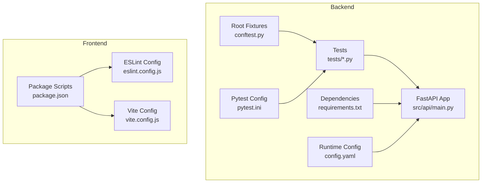
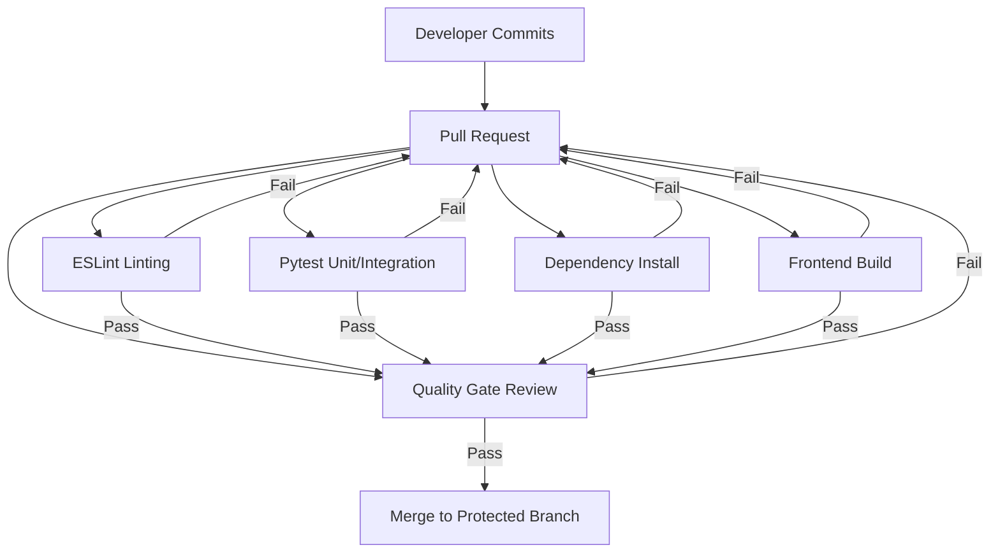
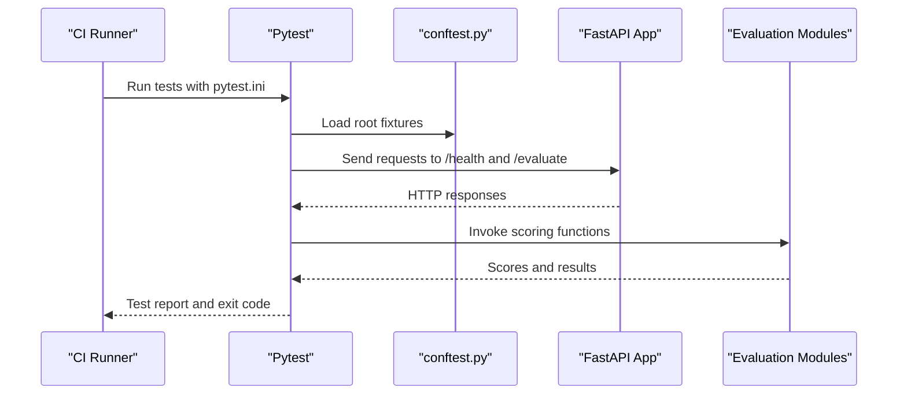
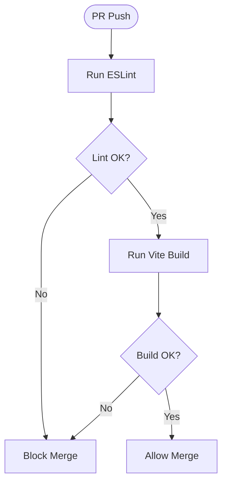
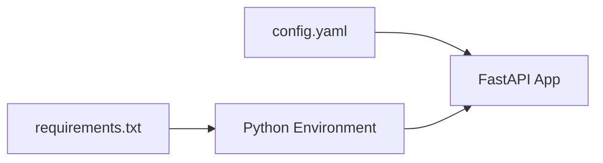

# Continuous Integration and Quality Gates

<cite>
**Referenced Files in This Document**
- [README.md](file://README.md)
- [Backend/pytest.ini](file://Backend/pytest.ini)
- [Backend/conftest.py](file://Backend/conftest.py)
- [Backend/tests/test_api.py](file://Backend/tests/test_api.py)
- [Backend/tests/test_modules.py](file://Backend/tests/test_modules.py)
- [Backend/requirements.txt](file://Backend/requirements.txt)
- [Backend/config.yaml](file://Backend/config.yaml)
- [Frontend/package.json](file://Frontend/package.json)
- [Frontend/eslint.config.js](file://Frontend/eslint.config.js)
- [Frontend/vite.config.js](file://Frontend/vite.config.js)
- [Frontend/README.md](file://Frontend/README.md)
</cite>

## Table of Contents
1. [Introduction](#introduction)
2. [Project Structure](#project-structure)
3. [Core Components](#core-components)
4. [Architecture Overview](#architecture-overview)
5. [Detailed Component Analysis](#detailed-component-analysis)
6. [Dependency Analysis](#dependency-analysis)
7. [Performance Considerations](#performance-considerations)
8. [Troubleshooting Guide](#troubleshooting-guide)
9. [Conclusion](#conclusion)
10. [Appendices](#appendices)

## Introduction
This document defines continuous integration and quality assurance processes for the MediRAG-Eval project. It covers automated testing workflows, quality gates, pre-commit and linting practices, branch protection and pull request validation expectations, and deployment validation procedures. It also outlines strategies for unit and integration testing, performance regression detection, code coverage targets, static analysis, and security scanning. Manual testing and production deployment quality assurance steps are included to complement automation.

## Project Structure
The project consists of:
- Backend service written in Python with FastAPI, including unit and integration tests.
- Frontend built with React and Vite, with ESLint-based linting.
- Shared configuration for runtime behavior and evaluation weights.
- Scripts and utilities for building and warming caches.

**Diagram sources**
- [Backend/pytest.ini](file://Backend/pytest.ini)
- [Backend/conftest.py](file://Backend/conftest.py)
- [Backend/tests/test_api.py](file://Backend/tests/test_api.py)
- [Backend/tests/test_modules.py](file://Backend/tests/test_modules.py)
- [Backend/requirements.txt](file://Backend/requirements.txt)
- [Backend/config.yaml](file://Backend/config.yaml)
- [Frontend/package.json](file://Frontend/package.json)
- [Frontend/eslint.config.js](file://Frontend/eslint.config.js)
- [Frontend/vite.config.js](file://Frontend/vite.config.js)

**Section sources**
- [README.md](file://README.md)
- [Backend/pytest.ini](file://Backend/pytest.ini)
- [Backend/conftest.py](file://Backend/conftest.py)
- [Backend/tests/test_api.py](file://Backend/tests/test_api.py)
- [Backend/tests/test_modules.py](file://Backend/tests/test_modules.py)
- [Backend/requirements.txt](file://Backend/requirements.txt)
- [Backend/config.yaml](file://Backend/config.yaml)
- [Frontend/package.json](file://Frontend/package.json)
- [Frontend/eslint.config.js](file://Frontend/eslint.config.js)
- [Frontend/vite.config.js](file://Frontend/vite.config.js)
- [Frontend/README.md](file://Frontend/README.md)

## Core Components
- Backend testing framework and configuration:
  - Pytest configuration defines test discovery and output behavior.
  - Root-level fixtures ensure import paths resolve to the source tree.
  - Tests exercise health checks, evaluation endpoints, and module scoring logic.
- Frontend development and linting:
  - Package scripts define dev, build, lint, and preview tasks.
  - ESLint flat config enforces recommended rules and React-specific hooks and refresh rules.
  - Vite configuration integrates React plugin for fast local builds.
- Runtime configuration:
  - YAML-based configuration controls retrieval, module parameters, aggregation weights, LLM provider settings, API limits, and logging.

Key quality gates observed in the repository:
- Unit tests for module scoring and aggregation logic.
- Integration tests for API endpoints and request validation.
- Linting via ESLint for frontend code quality.
- Dependency pinning and compatibility constraints in requirements.

**Section sources**
- [Backend/pytest.ini](file://Backend/pytest.ini)
- [Backend/conftest.py](file://Backend/conftest.py)
- [Backend/tests/test_api.py](file://Backend/tests/test_api.py)
- [Backend/tests/test_modules.py](file://Backend/tests/test_modules.py)
- [Frontend/package.json](file://Frontend/package.json)
- [Frontend/eslint.config.js](file://Frontend/eslint.config.js)
- [Backend/config.yaml](file://Backend/config.yaml)

## Architecture Overview
The CI/CD pipeline should validate changes across backend and frontend, ensuring:
- Backend: tests pass, dependencies install cleanly, configuration remains valid.
- Frontend: lint passes, build succeeds, and bundle artifacts are produced.
- Combined integration: API endpoints remain functional after frontend changes.

[No sources needed since this diagram shows conceptual workflow, not actual code structure]

## Detailed Component Analysis

### Backend Testing Strategy
- Test discovery and execution:
  - Pytest configuration sets test paths and naming conventions for Python test files, classes, and functions.
  - Root-level fixtures insert the source directory into the Python path, enabling clean imports from the source tree.
- API integration tests:
  - Health endpoint and evaluation endpoint tests validate HTTP responses and schema presence.
  - Validation tests assert request parameter constraints trigger appropriate HTTP errors.
- Module-level unit tests:
  - Faithfulness scoring, source credibility scoring, contradiction scoring, and aggregation logic are covered with assertions on scores and derived metrics.

Recommended additions for completeness:
- Coverage target: require a minimum coverage threshold for backend tests (e.g., 80%).
- Performance regression detection: instrument latency measurements and compare against baselines.
- Security scanning: integrate dependency checks and SCA scans in CI.

**Diagram sources**
- [Backend/pytest.ini](file://Backend/pytest.ini)
- [Backend/conftest.py](file://Backend/conftest.py)
- [Backend/tests/test_api.py](file://Backend/tests/test_api.py)
- [Backend/tests/test_modules.py](file://Backend/tests/test_modules.py)

**Section sources**
- [Backend/pytest.ini](file://Backend/pytest.ini)
- [Backend/conftest.py](file://Backend/conftest.py)
- [Backend/tests/test_api.py](file://Backend/tests/test_api.py)
- [Backend/tests/test_modules.py](file://Backend/tests/test_modules.py)

### Frontend Linting and Build
- Linting:
  - ESLint flat config extends recommended rules and applies React-specific plugins for hooks and refresh.
  - Global ignores exclude built artifacts.
- Build:
  - Vite configuration integrates React plugin for JSX and fast refresh.
  - Package scripts define dev, build, lint, and preview commands.

Quality gates:
- Lint must pass before merging.
- Build must succeed to ensure bundle integrity.

**Diagram sources**
- [Frontend/eslint.config.js](file://Frontend/eslint.config.js)
- [Frontend/vite.config.js](file://Frontend/vite.config.js)
- [Frontend/package.json](file://Frontend/package.json)

**Section sources**
- [Frontend/eslint.config.js](file://Frontend/eslint.config.js)
- [Frontend/vite.config.js](file://Frontend/vite.config.js)
- [Frontend/package.json](file://Frontend/package.json)

### Configuration and Dependency Management
- Backend runtime configuration:
  - Retrieval parameters, module settings, aggregation weights, LLM provider configuration, API limits, and logging are centralized.
- Dependencies:
  - Pinning ensures reproducible environments and avoids known incompatible versions.

Quality gates:
- Configuration must parse and validate during startup.
- Dependency installation must succeed without conflicts.

**Section sources**
- [Backend/config.yaml](file://Backend/config.yaml)
- [Backend/requirements.txt](file://Backend/requirements.txt)

### Pre-commit Hooks and Local Validation
- Recommended pre-commit hooks:
  - Python: run pytest and lint checks locally before committing.
  - Frontend: run ESLint and build locally.
- Commit message standards and DCO/sign-off policies can be enforced via pre-commit hooks or CI rules.

[No sources needed since this section provides general guidance]

### Branch Protection and Pull Request Validation
- Protected branches should require:
  - Successful CI runs (lint, tests, build).
  - Minimum approvals (e.g., two maintainers).
  - Up-to-date with the base branch.
- PR checks should include:
  - Backend tests passing.
  - Frontend lint and build successful.
  - Dependency installation successful.
  - Configuration validation.

[No sources needed since this section provides general guidance]

## Dependency Analysis
Backend dependencies are pinned to ensure compatibility and reproducibility. The configuration file centralizes runtime parameters for retrieval, modules, aggregation, LLM provider, API limits, and logging.

**Diagram sources**
- [Backend/requirements.txt](file://Backend/requirements.txt)
- [Backend/config.yaml](file://Backend/config.yaml)

**Section sources**
- [Backend/requirements.txt](file://Backend/requirements.txt)
- [Backend/config.yaml](file://Backend/config.yaml)

## Performance Considerations
- Module initialization and model loading can introduce cold-start latency. Instrument and track:
  - First-request latency for evaluation endpoints.
  - Aggregation and scoring durations.
- Establish baselines and alert on regressions exceeding thresholds.
- Use profiling tools to identify hotspots in scoring modules and retrieval pipeline.

[No sources needed since this section provides general guidance]

## Troubleshooting Guide
Common issues and resolutions:
- Import errors in tests:
  - Ensure root fixtures add the source directory to the path.
- Pytest discovery failures:
  - Verify test file/class/function naming aligns with pytest configuration.
- API test failures:
  - Confirm the application is running and reachable at the expected host/port.
- Frontend lint failures:
  - Fix ESLint violations reported by the configured rules.
- Build failures:
  - Resolve Vite configuration issues and missing dependencies.

**Section sources**
- [Backend/conftest.py](file://Backend/conftest.py)
- [Backend/pytest.ini](file://Backend/pytest.ini)
- [Backend/tests/test_api.py](file://Backend/tests/test_api.py)
- [Frontend/eslint.config.js](file://Frontend/eslint.config.js)
- [Frontend/vite.config.js](file://Frontend/vite.config.js)

## Conclusion
The repository establishes a solid foundation for automated testing and quality assurance with Pytest-driven backend tests, ESLint-based frontend linting, and centralized configuration. To mature the CI/CD process, integrate coverage reporting, performance baselines, dependency scanning, and robust branch protection with mandatory CI checks. These enhancements will strengthen deployment validation and production readiness.

[No sources needed since this section summarizes without analyzing specific files]

## Appendices

### Automated Testing Execution
- Backend:
  - Run tests with pytest using the configured discovery and options.
  - Validate API endpoints and module logic under realistic payloads.
- Frontend:
  - Lint with ESLint and build with Vite to ensure correctness and bundle integrity.

**Section sources**
- [Backend/pytest.ini](file://Backend/pytest.ini)
- [Backend/tests/test_api.py](file://Backend/tests/test_api.py)
- [Backend/tests/test_modules.py](file://Backend/tests/test_modules.py)
- [Frontend/package.json](file://Frontend/package.json)
- [Frontend/eslint.config.js](file://Frontend/eslint.config.js)
- [Frontend/vite.config.js](file://Frontend/vite.config.js)

### Quality Gate Implementation
- Gates:
  - Lint success (frontend).
  - Build success (frontend).
  - Test success (backend).
  - Dependency installation success (backend).
  - Configuration validity (backend).
- Enforcement:
  - Require all gates to pass before allowing merges to protected branches.

**Section sources**
- [Backend/pytest.ini](file://Backend/pytest.ini)
- [Backend/requirements.txt](file://Backend/requirements.txt)
- [Backend/config.yaml](file://Backend/config.yaml)
- [Frontend/eslint.config.js](file://Frontend/eslint.config.js)
- [Frontend/vite.config.js](file://Frontend/vite.config.js)
- [Frontend/package.json](file://Frontend/package.json)

### Deployment Validation and Rollback
- Validation:
  - Smoke tests for health and evaluation endpoints post-deploy.
  - Load tests to detect performance regressions.
- Rollback:
  - Maintain immutable artifacts and versioned deployments.
  - Automate rollback to the previous successful version on failure.

[No sources needed since this section provides general guidance]

### Monitoring Integration
- Integrate logging and metrics collection for:
  - Endpoint latencies and error rates.
  - Model scoring throughput and latency.
  - Frontend build and runtime performance.

[No sources needed since this section provides general guidance]