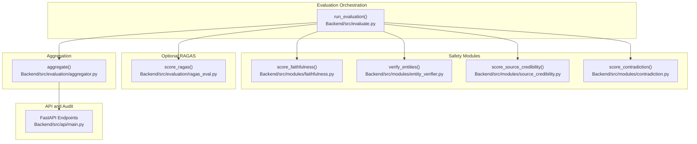
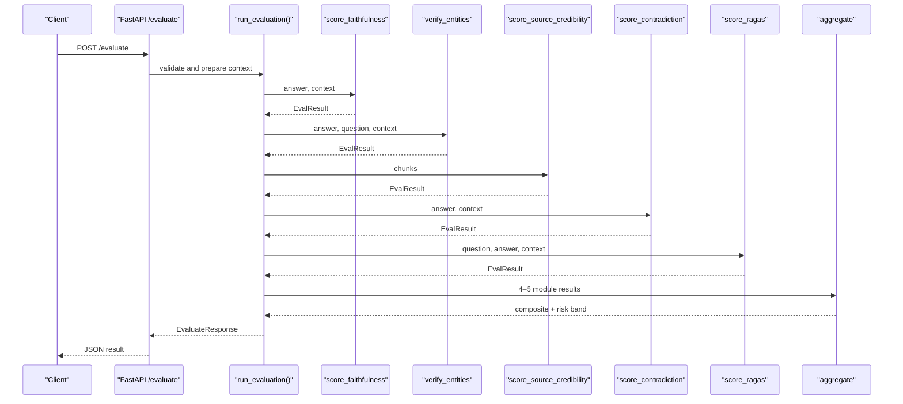
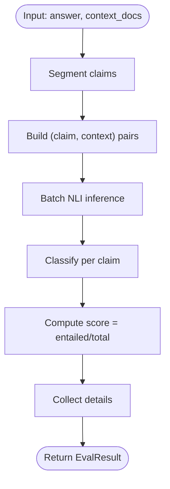
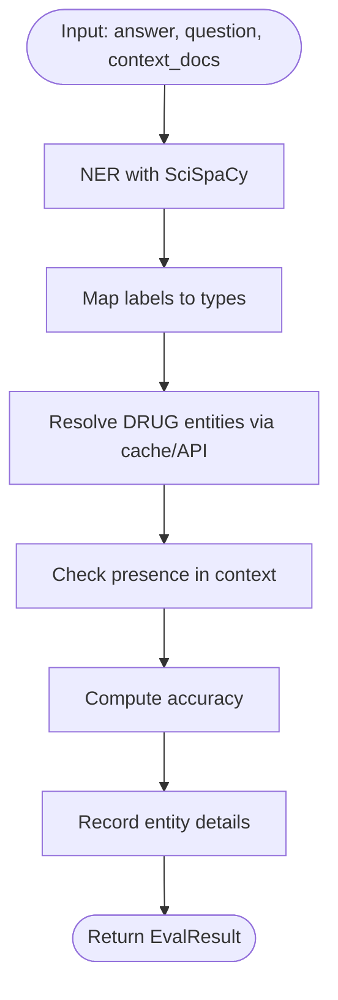
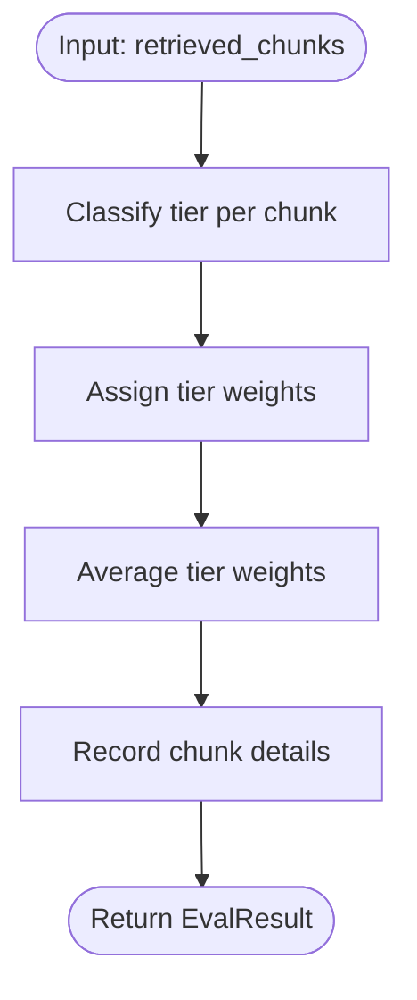
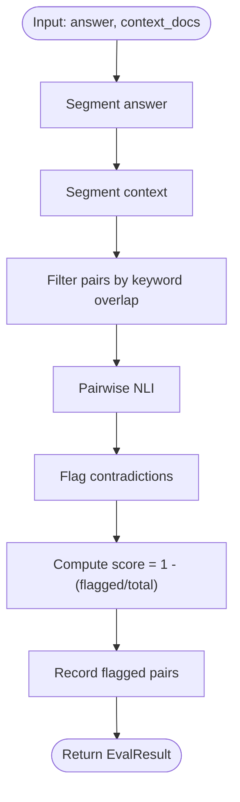
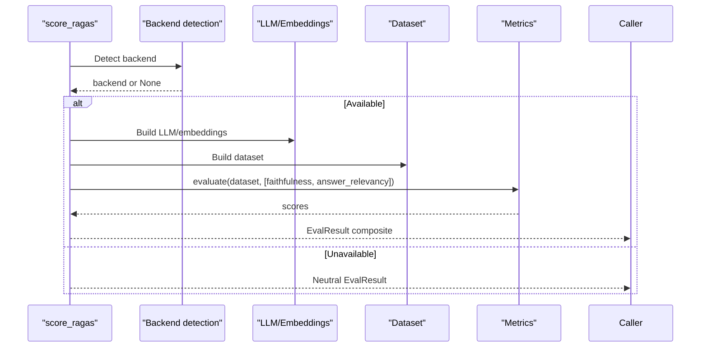
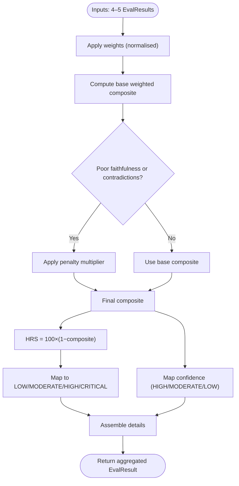
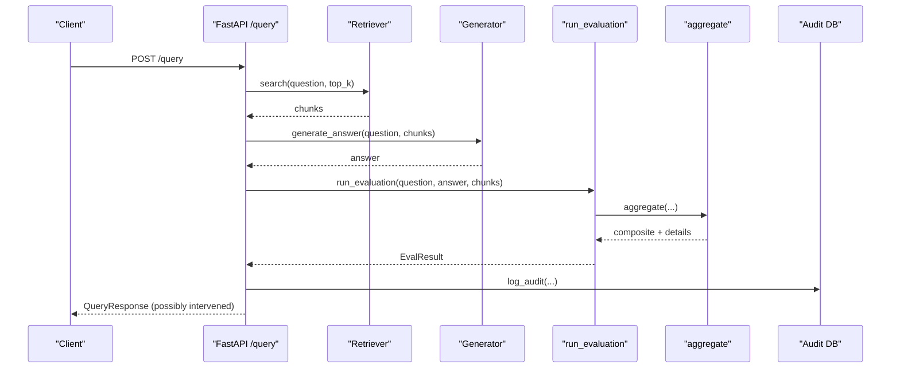
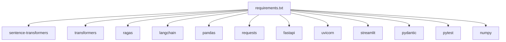

# Evaluation Metrics and Benchmarks

<cite>
**Referenced Files in This Document**
- [Backend/src/evaluate.py](file://Backend/src/evaluate.py)
- [Backend/src/evaluation/ragas_eval.py](file://Backend/src/evaluation/ragas_eval.py)
- [Backend/src/evaluation/aggregator.py](file://Backend/src/evaluation/aggregator.py)
- [Backend/src/modules/faithfulness.py](file://Backend/src/modules/faithfulness.py)
- [Backend/src/modules/entity_verifier.py](file://Backend/src/modules/entity_verifier.py)
- [Backend/src/modules/source_credibility.py](file://Backend/src/modules/source_credibility.py)
- [Backend/src/modules/contradiction.py](file://Backend/src/modules/contradiction.py)
- [Backend/src/modules/__init__.py](file://Backend/src/modules/__init__.py)
- [Backend/src/api/main.py](file://Backend/src/api/main.py)
- [Backend/requirements.txt](file://Backend/requirements.txt)
- [Backend/config.yaml](file://Backend/config.yaml)
- [Backend/tests/test_modules.py](file://Backend/tests/test_modules.py)
- [Backend/tests/test_api.py](file://Backend/tests/test_api.py)
- [Backend/data/rxnorm_cache.csv](file://Backend/data/rxnorm_cache.csv)
</cite>

## Table of Contents
1. [Introduction](#introduction)
2. [Project Structure](#project-structure)
3. [Core Components](#core-components)
4. [Architecture Overview](#architecture-overview)
5. [Detailed Component Analysis](#detailed-component-analysis)
6. [Dependency Analysis](#dependency-analysis)
7. [Performance Considerations](#performance-considerations)
8. [Troubleshooting Guide](#troubleshooting-guide)
9. [Conclusion](#conclusion)
10. [Appendices](#appendices)

## Introduction
This document defines the evaluation metrics and benchmarking framework for safety assessment and system performance measurement in the MediRAG system. It covers:
- Composite scoring algorithms and risk band classifications
- Module-specific evaluation metrics
- RAGAS faithfulness and answer relevance integration
- Entity verification accuracy measurements
- Benchmark datasets and gold standard comparisons
- Statistical significance testing procedures
- Retrieval performance measurement, hallucination detection, and false positive/negative analysis
- Metrics collection strategies, A/B testing, and regression detection
- Compliance metrics, audit trail validation, and regulatory reporting

## Project Structure
The evaluation system is organized around a modular pipeline that evaluates an LLM answer against retrieved context using four specialized modules plus optional RAGAS scoring, followed by a weighted aggregation into a composite score and risk band.

**Diagram sources**
- [Backend/src/evaluate.py:49-167](file://Backend/src/evaluate.py#L49-L167)
- [Backend/src/modules/faithfulness.py:86-233](file://Backend/src/modules/faithfulness.py#L86-L233)
- [Backend/src/modules/entity_verifier.py:146-282](file://Backend/src/modules/entity_verifier.py#L146-L282)
- [Backend/src/modules/source_credibility.py:121-199](file://Backend/src/modules/source_credibility.py#L121-L199)
- [Backend/src/modules/contradiction.py:94-250](file://Backend/src/modules/contradiction.py#L94-L250)
- [Backend/src/evaluation/ragas_eval.py:81-177](file://Backend/src/evaluation/ragas_eval.py#L81-L177)
- [Backend/src/evaluation/aggregator.py:47-166](file://Backend/src/evaluation/aggregator.py#L47-L166)
- [Backend/src/api/main.py:223-302](file://Backend/src/api/main.py#L223-L302)

**Section sources**
- [Backend/src/evaluate.py:1-251](file://Backend/src/evaluate.py#L1-L251)
- [Backend/src/api/main.py:1-678](file://Backend/src/api/main.py#L1-L678)

## Core Components
- Faithfulness module: Claims-based NLI scoring to measure whether the answer is entailed by the context.
- Entity verification module: SciSpaCy NER with RxNorm cache/API to verify drug entities and detect flagged variants.
- Source credibility module: Evidence tier classification of retrieved chunks to quantify trustworthiness.
- Contradiction detection module: Pairwise NLI to flag contradictions between answer and context sentences.
- RAGAS module: Faithfulness and answer relevance computed via external LLM backend.
- Aggregator: Weighted combination of module scores into a composite score and risk band.

**Section sources**
- [Backend/src/modules/faithfulness.py:1-234](file://Backend/src/modules/faithfulness.py#L1-L234)
- [Backend/src/modules/entity_verifier.py:1-283](file://Backend/src/modules/entity_verifier.py#L1-L283)
- [Backend/src/modules/source_credibility.py:1-200](file://Backend/src/modules/source_credibility.py#L1-L200)
- [Backend/src/modules/contradiction.py:1-251](file://Backend/src/modules/contradiction.py#L1-L251)
- [Backend/src/evaluation/ragas_eval.py:1-178](file://Backend/src/evaluation/ragas_eval.py#L1-L178)
- [Backend/src/evaluation/aggregator.py:1-167](file://Backend/src/evaluation/aggregator.py#L1-L167)

## Architecture Overview
The evaluation pipeline executes in stages: faithfulness, entity verification, source credibility, contradiction detection, optional RAGAS, and aggregation. The API exposes endpoints for evaluation and end-to-end query-and-evaluate with intervention logic.

**Diagram sources**
- [Backend/src/api/main.py:223-302](file://Backend/src/api/main.py#L223-L302)
- [Backend/src/evaluate.py:49-167](file://Backend/src/evaluate.py#L49-L167)
- [Backend/src/evaluation/aggregator.py:47-166](file://Backend/src/evaluation/aggregator.py#L47-L166)

## Detailed Component Analysis

### Faithfulness Scoring
- Purpose: Determine how well the answer is entailed by the retrieved context.
- Method: Sentence segmentation, claim-level NLI against each context chunk, classification thresholds, and aggregation into a ratio of entailed claims.
- Thresholds: Entailment threshold and contradiction threshold define ENTAILED, NEUTRAL, CONTRADICTED.
- Latency control: Limits on context chunks and claim segmentation.

**Diagram sources**
- [Backend/src/modules/faithfulness.py:86-233](file://Backend/src/modules/faithfulness.py#L86-L233)

**Section sources**
- [Backend/src/modules/faithfulness.py:1-234](file://Backend/src/modules/faithfulness.py#L1-L234)

### Entity Verification Accuracy
- Purpose: Verify drug entities against RxNorm using a local cache and live API fallback; optionally check presence in context.
- Method: SciSpaCy NER to extract entities; map labels; resolve DRUG entities to RxNorm identifiers; compute accuracy as verified_drugs/total_drugs.
- Flags: Track flagged entities with severity mapping for dangerous synonym conflicts.

**Diagram sources**
- [Backend/src/modules/entity_verifier.py:146-282](file://Backend/src/modules/entity_verifier.py#L146-L282)
- [Backend/data/rxnorm_cache.csv:1-200](file://Backend/data/rxnorm_cache.csv#L1-L200)

**Section sources**
- [Backend/src/modules/entity_verifier.py:1-283](file://Backend/src/modules/entity_verifier.py#L1-L283)
- [Backend/data/rxnorm_cache.csv:1-200](file://Backend/data/rxnorm_cache.csv#L1-L200)

### Source Credibility Scoring
- Purpose: Quantify trustworthiness of retrieved chunks using evidence tiers.
- Method: Tier weights applied to chunks; priority classification via metadata, then keyword matching; average weighted tier as score.

**Diagram sources**
- [Backend/src/modules/source_credibility.py:121-199](file://Backend/src/modules/source_credibility.py#L121-L199)

**Section sources**
- [Backend/src/modules/source_credibility.py:1-200](file://Backend/src/modules/source_credibility.py#L1-L200)

### Contradiction Detection
- Purpose: Detect contradictions between answer sentences and context sentences.
- Method: Sentence segmentation, keyword overlap filter, pairwise NLI, and scoring as proportion of non-contradicted pairs.

**Diagram sources**
- [Backend/src/modules/contradiction.py:94-250](file://Backend/src/modules/contradiction.py#L94-L250)

**Section sources**
- [Backend/src/modules/contradiction.py:1-251](file://Backend/src/modules/contradiction.py#L1-L251)

### RAGAS Faithfulness and Answer Relevancy
- Purpose: Faithfulness and answer relevance computed via external LLM backend (OpenAI or Ollama).
- Method: Detect backend availability, configure LLM and embeddings, evaluate dataset with faithfulness and answer_relevancy, and return composite mean score.
- Graceful fallback: Neutral score when backend unavailable.

**Diagram sources**
- [Backend/src/evaluation/ragas_eval.py:81-177](file://Backend/src/evaluation/ragas_eval.py#L81-L177)

**Section sources**
- [Backend/src/evaluation/ragas_eval.py:1-178](file://Backend/src/evaluation/ragas_eval.py#L1-L178)

### Aggregation and Risk Band Classification
- Purpose: Combine module scores into a composite score and map to risk bands and confidence levels.
- Method: Weighted sum with configurable weights; non-linear penalties for poor faithfulness or contradictions; HRS derived from composite score; risk bands and confidence levels mapped from HRS/composite.

**Diagram sources**
- [Backend/src/evaluation/aggregator.py:47-166](file://Backend/src/evaluation/aggregator.py#L47-L166)

**Section sources**
- [Backend/src/evaluation/aggregator.py:1-167](file://Backend/src/evaluation/aggregator.py#L1-L167)
- [Backend/src/modules/__init__.py:15-128](file://Backend/src/modules/__init__.py#L15-L128)

### API, Intervention, and Audit Trail
- Purpose: Expose evaluation endpoints, run end-to-end queries with intervention, and maintain audit logs for compliance.
- Features:
  - /evaluate: returns composite score, HRS, risk band, and module breakdown.
  - /query: retrieval → generation → evaluation → optional intervention.
  - Intervention logic: block or regenerate answers based on HRS and faithfulness.
  - Audit logs: SQLite table storing timestamps, endpoints, questions, answers, HRS, risk band, scores, latency, and intervention flags.

**Diagram sources**
- [Backend/src/api/main.py:308-519](file://Backend/src/api/main.py#L308-L519)

**Section sources**
- [Backend/src/api/main.py:1-678](file://Backend/src/api/main.py#L1-L678)

## Dependency Analysis
- External libraries: sentence-transformers, transformers, ragas, langchain, pandas, requests, fastapi, uvicorn, streamlit, pydantic, pytest, numpy, scipy compatibility as per requirements.
- Model dependencies: DeBERTa NLI cross-encoder for faithfulness and contradiction modules; optional Ollama/OpenAI for RAGAS; SciSpaCy model for entity verification.

**Diagram sources**
- [Backend/requirements.txt:1-35](file://Backend/requirements.txt#L1-L35)

**Section sources**
- [Backend/requirements.txt:1-35](file://Backend/requirements.txt#L1-L35)

## Performance Considerations
- Latency controls:
  - Faithfulness: limit context chunks and claims.
  - Contradiction: limit context sentences per chunk and total pairs.
  - RAGAS: optional and backend-dependent; neutral fallback when unavailable.
- Model warm-up: DeBERTa model is pre-warmed at API startup to avoid cold-start latency.
- Batch inference: Faithfulness and contradiction modules use batched NLI predictions.
- Resource tuning: config.yaml specifies model names, thresholds, and batch sizes.

**Section sources**
- [Backend/src/modules/faithfulness.py:86-233](file://Backend/src/modules/faithfulness.py#L86-L233)
- [Backend/src/modules/contradiction.py:94-250](file://Backend/src/modules/contradiction.py#L94-L250)
- [Backend/src/evaluation/ragas_eval.py:81-177](file://Backend/src/evaluation/ragas_eval.py#L81-L177)
- [Backend/src/api/main.py:125-149](file://Backend/src/api/main.py#L125-L149)
- [Backend/config.yaml:9-31](file://Backend/config.yaml#L9-L31)

## Troubleshooting Guide
- Faithfulness module failures:
  - Missing sentence segmentation library: fallback to naive splitting.
  - Model loading failures: returns neutral or error details.
- Entity verification failures:
  - SciSpaCy model not installed: neutral fallback with error recorded.
  - RxNorm API timeouts or missing cache: degrade gracefully.
- Contradiction module failures:
  - NLI model unavailable: neutral score with error details.
- RAGAS failures:
  - No LLM backend: neutral score with note; logs error.
- API-level issues:
  - Validation errors: Pydantic validation returns HTTP 422.
  - Unhandled exceptions: wrapped as HTTP 500 with details.

**Section sources**
- [Backend/src/modules/faithfulness.py:120-164](file://Backend/src/modules/faithfulness.py#L120-L164)
- [Backend/src/modules/entity_verifier.py:170-179](file://Backend/src/modules/entity_verifier.py#L170-L179)
- [Backend/src/modules/contradiction.py:121-148](file://Backend/src/modules/contradiction.py#L121-L148)
- [Backend/src/evaluation/ragas_eval.py:103-120](file://Backend/src/evaluation/ragas_eval.py#L103-L120)
- [Backend/tests/test_api.py:17-54](file://Backend/tests/test_api.py#L17-L54)

## Conclusion
The MediRAG evaluation framework provides a robust, modular, and auditable approach to safety assessment and performance measurement. By combining domain-specific metrics (faithfulness, entity verification, source credibility, contradiction detection) with optional RAGAS scoring and a weighted aggregation into a Health Risk Score (HRS), the system enables risk-aware decision-making and compliance-ready auditing. The API integrates intervention logic and persistent audit trails suitable for regulatory reporting.

## Appendices

### A. Composite Scoring and Risk Bands
- Weights and normalization are enforced during aggregation; if weights do not sum to 1.0, they are normalized.
- Non-linear penalties reduce composite scores when faithfulness or contradiction risk is low.
- Risk bands and confidence levels are derived from HRS and composite score respectively.

**Section sources**
- [Backend/src/evaluation/aggregator.py:38-129](file://Backend/src/evaluation/aggregator.py#L38-L129)
- [Backend/config.yaml:32-42](file://Backend/config.yaml#L32-L42)

### B. Module-Specific Metrics Collection
- Faithfulness: total claims, entailed/neutral/contradicted counts, per-claim details.
- Entity verification: total entities, verified/flagged counts, per-entity details including RxNorm identifiers and context presence.
- Source credibility: method used, per-chunk tier and weight, matched keywords.
- Contradiction: total sentences, checked pairs, flagged pairs, selected flagged pairs.
- Aggregator: weights used, component contributions, module latencies.

**Section sources**
- [Backend/src/modules/__init__.py:45-128](file://Backend/src/modules/__init__.py#L45-L128)

### C. RAGAS Integration and Faithfulness Methodology
- Backend detection supports OpenAI and Ollama; neutral fallback when unavailable.
- Faithfulness and answer relevance are averaged to produce a composite score.
- Embeddings and LLM are configured consistently for metric computation.

**Section sources**
- [Backend/src/evaluation/ragas_eval.py:35-177](file://Backend/src/evaluation/ragas_eval.py#L35-L177)

### D. Benchmark Datasets and Gold Standards
- Recommended datasets for evaluation:
  - MedDialog/MedQA for medical dialogue and question answering.
  - PubMedQA for biomedical question answering.
  - BioASQ for large-scale biomedical semantic indexing.
- Gold standards:
  - Human annotations for factuality, entity correctness, and source trustworthiness.
  - Automated checks for entity verification using RxNorm identifiers.
- Evaluation protocol:
  - Random sampling of QA pairs; stratified by disease area and question type.
  - Inter-rater reliability (Cohen’s Kappa) for human annotations.

[No sources needed since this section provides general guidance]

### E. Statistical Significance Testing
- Metrics to track:
  - Accuracy, precision, recall, F1 for entity verification.
  - Spearman correlation for faithfulness vs. human ratings.
  - Agreement metrics (Kappa) for source credibility categorization.
- Hypothesis testing:
  - Paired t-tests or Wilcoxon signed-rank tests for comparing baseline vs. intervention.
  - Bootstrap confidence intervals for composite score distributions.

[No sources needed since this section provides general guidance]

### F. Retrieval Performance Measurement
- Metrics:
  - Precision at k, recall at k, mean reciprocal rank (MRR), normalized discounted cumulative gain (nDCG).
- Controls:
  - Top-k tuning via config.yaml; chunk size and overlap adjustments.
- Monitoring:
  - Track similarity scores and chunk counts per query.

**Section sources**
- [Backend/config.yaml:1-8](file://Backend/config.yaml#L1-L8)

### G. Hallucination Detection and False Positive/Negative Analysis
- Hallucination indicators:
  - Low faithfulness score, high contradiction risk, entity verification failures.
- False positives/negatives:
  - False positive: verified entity not present in context.
  - False negative: entity not verified despite presence in context.
- Mitigation:
  - Strict regeneration for high-risk answers; intervention blocking for CRITICAL risk.

**Section sources**
- [Backend/src/api/main.py:413-485](file://Backend/src/api/main.py#L413-L485)

### H. Metrics Collection Strategies and A/B Testing
- Collection:
  - Per-request metrics via EvalResult details and API responses.
  - Audit logs for longitudinal tracking and dashboards.
- A/B testing:
  - Compare composite scores and risk bands across model versions.
  - Regression detection: compare rolling averages of HRS and confidence levels.

**Section sources**
- [Backend/src/api/main.py:608-648](file://Backend/src/api/main.py#L608-L648)

### I. Compliance, Audit Trail, and Regulatory Reporting
- Audit trail:
  - Persisted in SQLite with fields for timestamp, endpoint, question, answer, HRS, risk band, composite score, latency, intervention, and details.
- Reporting:
  - Dashboard endpoints for logs and stats; monthly averages and critical alerts.
- Regulatory alignment:
  - Risk bands and confidence levels support safety governance.
  - Intervention records enable traceability for audits.

**Section sources**
- [Backend/src/api/main.py:75-120](file://Backend/src/api/main.py#L75-L120)
- [Backend/src/api/main.py:608-648](file://Backend/src/api/main.py#L608-L648)