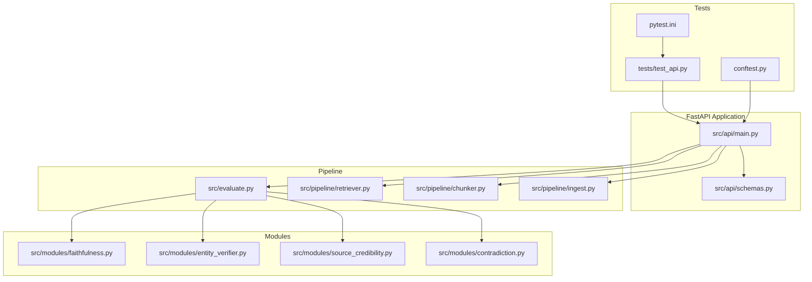
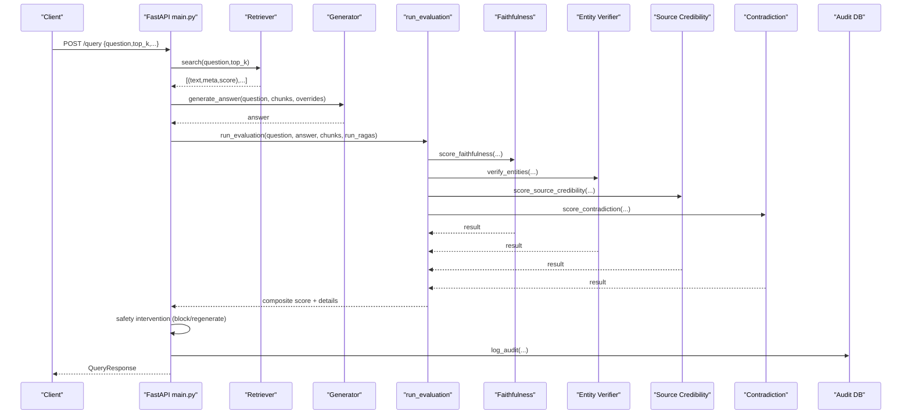
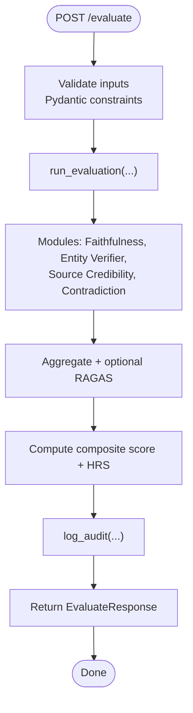
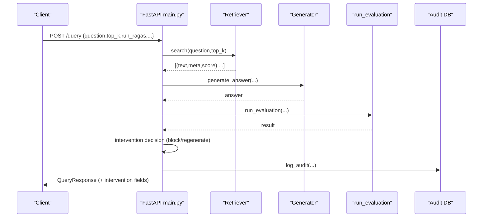
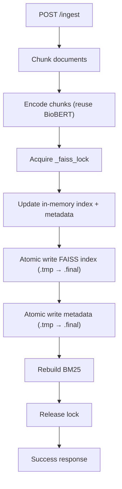
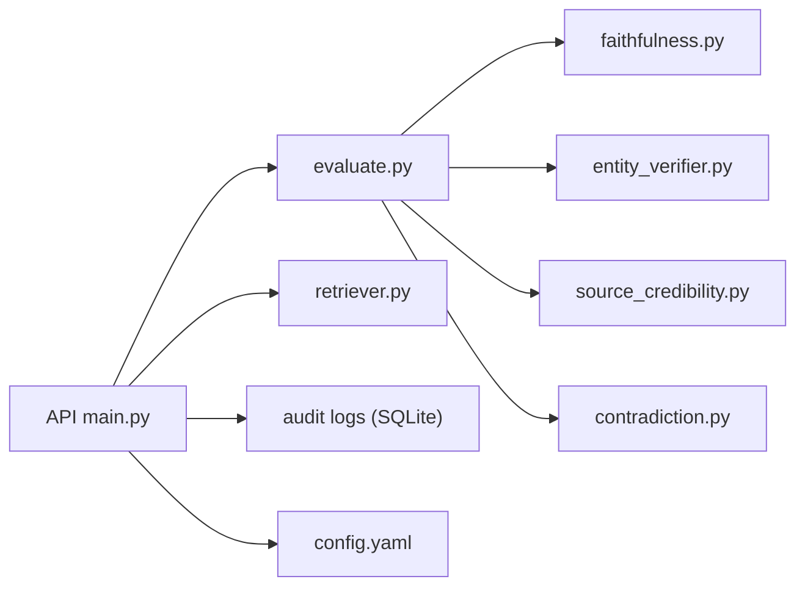

# Integration Testing

<cite>
**Referenced Files in This Document**
- [Backend/src/api/main.py](file://Backend/src/api/main.py)
- [Backend/src/api/schemas.py](file://Backend/src/api/schemas.py)
- [Backend/src/evaluate.py](file://Backend/src/evaluate.py)
- [Backend/src/pipeline/retriever.py](file://Backend/src/pipeline/retriever.py)
- [Backend/src/pipeline/chunker.py](file://Backend/src/pipeline/chunker.py)
- [Backend/src/pipeline/ingest.py](file://Backend/src/pipeline/ingest.py)
- [Backend/src/modules/faithfulness.py](file://Backend/src/modules/faithfulness.py)
- [Backend/src/modules/entity_verifier.py](file://Backend/src/modules/entity_verifier.py)
- [Backend/src/modules/source_credibility.py](file://Backend/src/modules/source_credibility.py)
- [Backend/src/modules/contradiction.py](file://Backend/src/modules/contradiction.py)
- [Backend/tests/test_api.py](file://Backend/tests/test_api.py)
- [Backend/conftest.py](file://Backend/conftest.py)
- [Backend/pytest.ini](file://Backend/pytest.ini)
- [Backend/config.yaml](file://Backend/config.yaml)
</cite>

## Table of Contents
1. [Introduction](#introduction)
2. [Project Structure](#project-structure)
3. [Core Components](#core-components)
4. [Architecture Overview](#architecture-overview)
5. [Detailed Component Analysis](#detailed-component-analysis)
6. [Dependency Analysis](#dependency-analysis)
7. [Performance Considerations](#performance-considerations)
8. [Troubleshooting Guide](#troubleshooting-guide)
9. [Conclusion](#conclusion)
10. [Appendices](#appendices)

## Introduction
This document provides comprehensive integration testing guidance for the MediRAG FastAPI application. It focuses on validating API endpoints, end-to-end pipeline behavior, and safety intervention mechanisms. The goal is to ensure robustness across input validation, retrieval, generation, evaluation, and compliance dashboard endpoints while maintaining reliability under concurrent load and error conditions.

## Project Structure
The backend is organized around a FastAPI application that exposes health, evaluation, query, ingestion, and dashboard endpoints. Supporting modules implement the evaluation pipeline, retrieval, chunking, ingestion, and safety interventions. Tests leverage pytest with an ASGI transport for realistic integration coverage.

**Diagram sources**
- [Backend/src/api/main.py](file://Backend/src/api/main.py)
- [Backend/src/api/schemas.py](file://Backend/src/api/schemas.py)
- [Backend/src/evaluate.py](file://Backend/src/evaluate.py)
- [Backend/src/pipeline/retriever.py](file://Backend/src/pipeline/retriever.py)
- [Backend/src/pipeline/chunker.py](file://Backend/src/pipeline/chunker.py)
- [Backend/src/pipeline/ingest.py](file://Backend/src/pipeline/ingest.py)
- [Backend/src/modules/faithfulness.py](file://Backend/src/modules/faithfulness.py)
- [Backend/src/modules/entity_verifier.py](file://Backend/src/modules/entity_verifier.py)
- [Backend/src/modules/source_credibility.py](file://Backend/src/modules/source_credibility.py)
- [Backend/src/modules/contradiction.py](file://Backend/src/modules/contradiction.py)
- [Backend/tests/test_api.py](file://Backend/tests/test_api.py)
- [Backend/conftest.py](file://Backend/conftest.py)
- [Backend/pytest.ini](file://Backend/pytest.ini)

**Section sources**
- [Backend/src/api/main.py](file://Backend/src/api/main.py)
- [Backend/src/api/schemas.py](file://Backend/src/api/schemas.py)
- [Backend/tests/test_api.py](file://Backend/tests/test_api.py)
- [Backend/conftest.py](file://Backend/conftest.py)
- [Backend/pytest.ini](file://Backend/pytest.ini)

## Core Components
- FastAPI endpoints:
  - Health: GET /health
  - Evaluation: POST /evaluate
  - Query: POST /query (end-to-end pipeline)
  - Ingestion: POST /ingest (thread-safe FAISS update)
  - Dashboard: GET /logs, GET /stats
  - File parsing: POST /parse_file
- Validation and schemas: Pydantic models enforce input constraints.
- Evaluation orchestrator: run_evaluation coordinates four modules plus optional RAGAS.
- Retrieval: hybrid FAISS + BM25 with Reciprocal Rank Fusion.
- Safety interventions: automatic blocking and regeneration thresholds.
- Audit logging: SQLite-backed audit trail for compliance dashboards.

Key integration test targets:
- Endpoint behavior under normal operation and error propagation
- End-to-end flow from retrieval to generation to evaluation and safety gates
- Concurrency safety for ingestion and retrieval
- Compliance dashboard data integrity

**Section sources**
- [Backend/src/api/main.py](file://Backend/src/api/main.py)
- [Backend/src/api/schemas.py](file://Backend/src/api/schemas.py)
- [Backend/src/evaluate.py](file://Backend/src/evaluate.py)
- [Backend/src/pipeline/retriever.py](file://Backend/src/pipeline/retriever.py)

## Architecture Overview
The integration flow spans API validation, retrieval, generation, evaluation, and safety intervention, culminating in audit logging for dashboard reporting.

**Diagram sources**
- [Backend/src/api/main.py](file://Backend/src/api/main.py)
- [Backend/src/evaluate.py](file://Backend/src/evaluate.py)
- [Backend/src/pipeline/retriever.py](file://Backend/src/pipeline/retriever.py)
- [Backend/src/modules/faithfulness.py](file://Backend/src/modules/faithfulness.py)
- [Backend/src/modules/entity_verifier.py](file://Backend/src/modules/entity_verifier.py)
- [Backend/src/modules/source_credibility.py](file://Backend/src/modules/source_credibility.py)
- [Backend/src/modules/contradiction.py](file://Backend/src/modules/contradiction.py)

## Detailed Component Analysis

### Health Endpoint Testing
- Objective: Verify GET /health returns system status and Ollama availability.
- Test approach:
  - Send GET /health and assert status code 200.
  - Assert presence of status, ollama_available, and version fields.
  - Confirm graceful handling when Ollama is unreachable (ollama_available false).

**Section sources**
- [Backend/src/api/main.py](file://Backend/src/api/main.py)
- [Backend/tests/test_api.py](file://Backend/tests/test_api.py)

### Evaluation Workflow Testing
- Objective: Validate POST /evaluate end-to-end with module-level scoring and composite HRS.
- Test approach:
  - Prepare a minimal EvaluateRequest payload with question, answer, and context_chunks.
  - Assert successful 200 response with composite_score, hrs, risk_band, and module_results.
  - Validate risk_band membership and module score presence.
  - Confirm run_ragas toggles optional module behavior without breaking the pipeline.

**Diagram sources**
- [Backend/src/api/main.py](file://Backend/src/api/main.py)
- [Backend/src/evaluate.py](file://Backend/src/evaluate.py)

**Section sources**
- [Backend/src/api/main.py](file://Backend/src/api/main.py)
- [Backend/src/evaluate.py](file://Backend/src/evaluate.py)
- [Backend/tests/test_api.py](file://Backend/tests/test_api.py)

### Query Pipeline Testing (End-to-End)
- Objective: Validate full /query pipeline including retrieval, generation, evaluation, and safety intervention.
- Test approach:
  - POST /query with a valid question and top_k.
  - Assert retrieval results, generated answer, retrieved_chunks, and evaluation fields.
  - Validate safety intervention behavior:
    - HRS threshold gating (e.g., CRITICAL block).
    - High-risk regeneration with strict prompt and re-evaluation.
  - Verify audit logging captures intervention reason and original answer when applicable.

**Diagram sources**
- [Backend/src/api/main.py](file://Backend/src/api/main.py)
- [Backend/src/pipeline/retriever.py](file://Backend/src/pipeline/retriever.py)

**Section sources**
- [Backend/src/api/main.py](file://Backend/src/api/main.py)
- [Backend/src/pipeline/retriever.py](file://Backend/src/pipeline/retriever.py)

### Document Ingestion and FAISS Updates
- Objective: Validate dynamic ingestion into FAISS/BM25 with thread-safety and atomic writes.
- Test approach:
  - POST /ingest with a custom document (title, text, metadata).
  - Assert success response and updated chunk counts.
  - Verify thread-safety by running concurrent ingestion requests and ensuring consistent index state.
  - Confirm atomic writes by checking temporary files are not visible post-write.

**Diagram sources**
- [Backend/src/api/main.py](file://Backend/src/api/main.py)
- [Backend/src/pipeline/chunker.py](file://Backend/src/pipeline/chunker.py)

**Section sources**
- [Backend/src/api/main.py](file://Backend/src/api/main.py)
- [Backend/src/pipeline/chunker.py](file://Backend/src/pipeline/chunker.py)

### Safety Intervention Mechanisms
- Objective: Validate automatic safety gates during /query.
- Test approach:
  - Inject hallucination via inject_hallucination to trigger CRITICAL_BLOCKED or HIGH_RISK_REGENERATED.
  - Assert intervention_applied, intervention_reason, and intervention_details.
  - Verify original_answer preservation and corrected answer evaluation.

**Section sources**
- [Backend/src/api/main.py](file://Backend/src/api/main.py)

### Compliance Dashboard Functionality
- Objective: Validate GET /logs and GET /stats for audit data.
- Test approach:
  - POST /query multiple times to populate audit logs.
  - GET /logs with limit and assert recent entries.
  - GET /stats and verify totalEvals, avgHrs, critAlerts, interventions, and monthly data.

**Section sources**
- [Backend/src/api/main.py](file://Backend/src/api/main.py)

### File Upload Processing
- Objective: Validate POST /parse_file for text extraction from supported formats.
- Test approach:
  - Upload txt, md, pdf, docx files and assert success with extracted text.
  - Assert appropriate error handling for unsupported or corrupted files.

**Section sources**
- [Backend/src/api/main.py](file://Backend/src/api/main.py)

### Database Operations and Audit Logging
- Objective: Validate SQLite audit logging and dashboard queries.
- Test approach:
  - Confirm database initialization and table creation.
  - Verify INSERT operations capture endpoint, question, answer, HRS, risk_band, latency, intervention, and details.
  - Ensure SELECT queries in /logs and /stats return expected aggregates.

**Section sources**
- [Backend/src/api/main.py](file://Backend/src/api/main.py)

## Dependency Analysis
- API depends on evaluation orchestrator and retriever.
- Evaluation orchestrator composes four modules plus optional RAGAS.
- Retrieval uses FAISS and optionally BM25; ingestion updates both index and metadata atomically.
- Safety intervention logic is embedded in the query endpoint and modifies responses accordingly.
- Audit logging persists to SQLite for dashboard consumption.

**Diagram sources**
- [Backend/src/api/main.py](file://Backend/src/api/main.py)
- [Backend/src/evaluate.py](file://Backend/src/evaluate.py)
- [Backend/src/pipeline/retriever.py](file://Backend/src/pipeline/retriever.py)
- [Backend/src/modules/faithfulness.py](file://Backend/src/modules/faithfulness.py)
- [Backend/src/modules/entity_verifier.py](file://Backend/src/modules/entity_verifier.py)
- [Backend/src/modules/source_credibility.py](file://Backend/src/modules/source_credibility.py)
- [Backend/src/modules/contradiction.py](file://Backend/src/modules/contradiction.py)
- [Backend/config.yaml](file://Backend/config.yaml)

**Section sources**
- [Backend/src/api/main.py](file://Backend/src/api/main.py)
- [Backend/src/evaluate.py](file://Backend/src/evaluate.py)
- [Backend/src/pipeline/retriever.py](file://Backend/src/pipeline/retriever.py)
- [Backend/src/modules/faithfulness.py](file://Backend/src/modules/faithfulness.py)
- [Backend/src/modules/entity_verifier.py](file://Backend/src/modules/entity_verifier.py)
- [Backend/src/modules/source_credibility.py](file://Backend/src/modules/source_credibility.py)
- [Backend/src/modules/contradiction.py](file://Backend/src/modules/contradiction.py)
- [Backend/config.yaml](file://Backend/config.yaml)

## Performance Considerations
- Warm-up: The lifespan pre-warms DeBERTa and Retriever to avoid cold-start latency for first requests.
- Model reuse: FAISS/BioBERT/BM25 are reused across requests to minimize overhead.
- Concurrency:
  - Use _faiss_lock to serialize FAISS updates and prevent corruption.
  - Consider rate limiting and circuit breakers for LLM providers.
- Latency monitoring: Track total_pipeline_ms and module-level latencies for bottleneck identification.
- Load testing:
  - Use pytest-asyncio or locust to simulate concurrent /query and /evaluate requests.
  - Monitor FAISS index hit rates and BM25 fallback behavior.

[No sources needed since this section provides general guidance]

## Troubleshooting Guide
Common issues and remedies:
- FAISS index not found: Ensure ingestion and embedding steps are completed before querying.
- Ollama unavailable: /health indicates ollama_available false; /query returns 503 if LLM generation fails.
- Empty or invalid inputs: Pydantic validation rejects short questions or missing context_chunks; expect 422.
- Safety intervention: Investigate intervention_reason and intervention_details in /query responses.
- Audit logging failures: Verify database connectivity and permissions; inspect logs for save failures.

**Section sources**
- [Backend/src/api/main.py](file://Backend/src/api/main.py)
- [Backend/src/pipeline/retriever.py](file://Backend/src/pipeline/retriever.py)

## Conclusion
This integration testing guide outlines validated strategies for API endpoint validation, end-to-end pipeline testing, safety interventions, and dashboard compliance. By focusing on input validation, retrieval and generation correctness, evaluation scoring, and audit logging, teams can ensure reliable operation under normal and error conditions, while maintaining performance and safety guarantees.

[No sources needed since this section summarizes without analyzing specific files]

## Appendices

### Test Execution Setup
- Use pytest with ASGI transport to avoid compatibility issues.
- Ensure src/ is on the Python path via conftest.py.
- Configure logging and ports via config.yaml.

**Section sources**
- [Backend/tests/test_api.py](file://Backend/tests/test_api.py)
- [Backend/conftest.py](file://Backend/conftest.py)
- [Backend/pytest.ini](file://Backend/pytest.ini)
- [Backend/config.yaml](file://Backend/config.yaml)