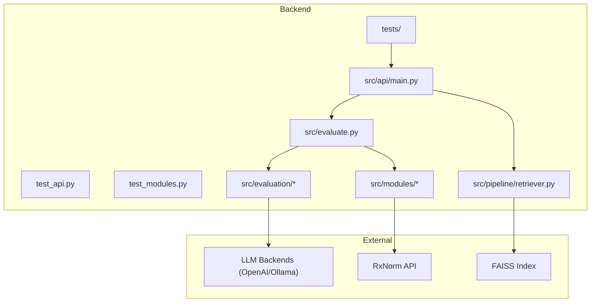
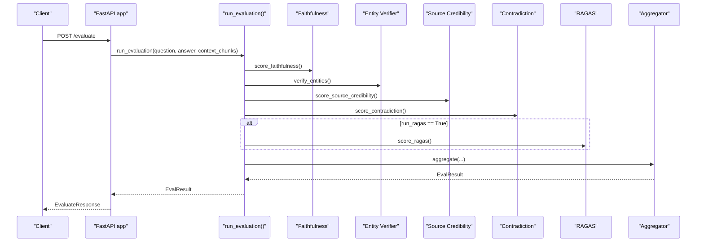
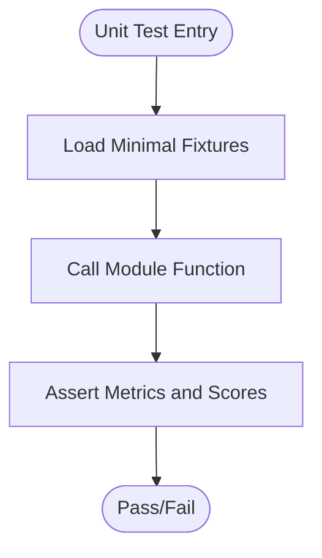
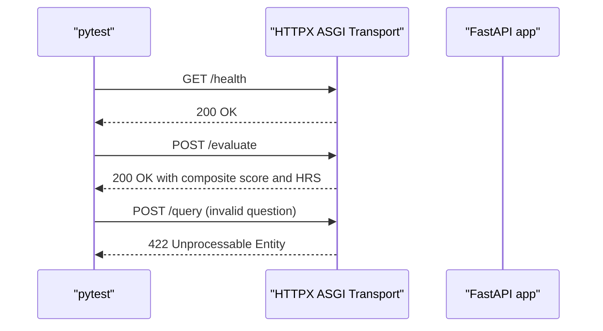
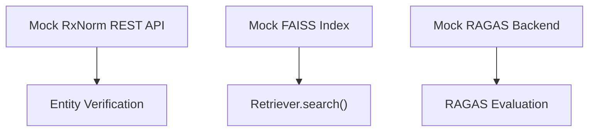
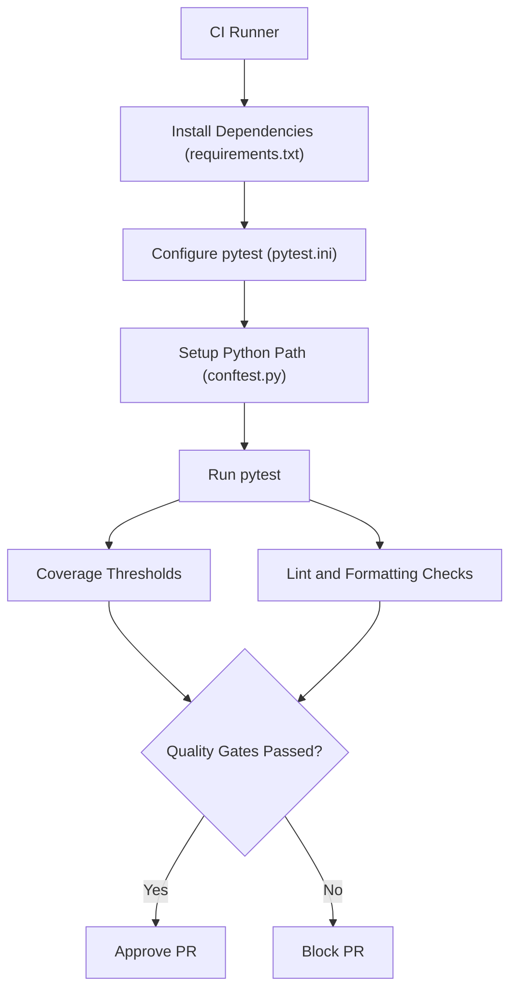
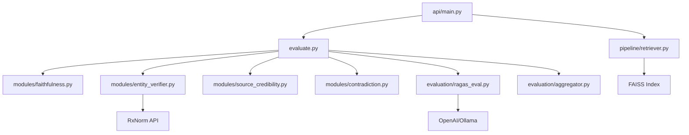

# Testing and Quality Assurance

<cite>
**Referenced Files in This Document**
- [pytest.ini](file://Backend/pytest.ini)
- [conftest.py](file://Backend/conftest.py)
- [requirements.txt](file://Backend/requirements.txt)
- [test_api.py](file://Backend/tests/test_api.py)
- [test_modules.py](file://Backend/tests/test_modules.py)
- [main.py](file://Backend/src/api/main.py)
- [evaluate.py](file://Backend/src/evaluate.py)
- [aggregator.py](file://Backend/src/evaluation/aggregator.py)
- [ragas_eval.py](file://Backend/src/evaluation/ragas_eval.py)
- [faithfulness.py](file://Backend/src/modules/faithfulness.py)
- [entity_verifier.py](file://Backend/src/modules/entity_verifier.py)
- [source_credibility.py](file://Backend/src/modules/source_credibility.py)
- [contradiction.py](file://Backend/src/modules/contradiction.py)
- [retriever.py](file://Backend/src/pipeline/retriever.py)
</cite>

## Table of Contents
1. [Introduction](#introduction)
2. [Project Structure](#project-structure)
3. [Core Components](#core-components)
4. [Architecture Overview](#architecture-overview)
5. [Detailed Component Analysis](#detailed-component-analysis)
6. [Dependency Analysis](#dependency-analysis)
7. [Performance Considerations](#performance-considerations)
8. [Troubleshooting Guide](#troubleshooting-guide)
9. [Conclusion](#conclusion)
10. [Appendices](#appendices)

## Introduction
This document defines comprehensive testing and quality assurance practices for MediRAG 3.0. It covers unit testing strategies, integration testing approaches, evaluation metrics, continuous integration setup, and quality gates. It also provides guidelines for testing safety evaluation modules, API endpoints, and frontend components, along with performance testing, debugging, reproducible environments, regression and security testing, and compliance validation.

## Project Structure
The testing effort focuses on the Backend service, which exposes FastAPI endpoints, orchestrates evaluation modules, and integrates with external systems such as RxNorm and FAISS. Tests are organized under Backend/tests and use pytest with a project-wide conftest to ensure import paths resolve correctly. The Backend/requirements.txt defines pinned dependencies to ensure reproducibility.

**Diagram sources**
- [test_api.py:1-54](file://Backend/tests/test_api.py#L1-L54)
- [test_modules.py:1-67](file://Backend/tests/test_modules.py#L1-L67)
- [main.py:1-678](file://Backend/src/api/main.py#L1-L678)
- [evaluate.py:1-251](file://Backend/src/evaluate.py#L1-L251)
- [aggregator.py:1-167](file://Backend/src/evaluation/aggregator.py#L1-L167)
- [ragas_eval.py:1-178](file://Backend/src/evaluation/ragas_eval.py#L1-L178)
- [faithfulness.py:1-234](file://Backend/src/modules/faithfulness.py#L1-L234)
- [entity_verifier.py:1-283](file://Backend/src/modules/entity_verifier.py#L1-L283)
- [source_credibility.py:1-200](file://Backend/src/modules/source_credibility.py#L1-L200)
- [contradiction.py:1-251](file://Backend/src/modules/contradiction.py#L1-L251)
- [retriever.py:1-287](file://Backend/src/pipeline/retriever.py#L1-L287)

**Section sources**
- [pytest.ini:1-7](file://Backend/pytest.ini#L1-L7)
- [conftest.py:1-13](file://Backend/conftest.py#L1-L13)
- [requirements.txt:1-35](file://Backend/requirements.txt#L1-L35)

## Core Components
- Unit tests for evaluation modules and orchestrator:
  - Faithfulness scoring, entity verification, source credibility, contradiction detection, and aggregator logic are covered by targeted unit tests.
- Integration tests for API endpoints:
  - Health checks, evaluation endpoint with mocked claims, and query validation are covered by integration tests using an ASGI HTTP client.
- External dependency mocking:
  - RxNorm API and FAISS vectors are mocked in tests to ensure deterministic and fast execution.
- Reproducible environment:
  - Dependencies are pinned in requirements.txt to guarantee consistent test execution across environments.

**Section sources**
- [test_modules.py:1-67](file://Backend/tests/test_modules.py#L1-L67)
- [test_api.py:1-54](file://Backend/tests/test_api.py#L1-L54)
- [requirements.txt:1-35](file://Backend/requirements.txt#L1-L35)

## Architecture Overview
The evaluation pipeline composes four modules plus optional RAGAS, then aggregates results into a composite score and Health Risk Score (HRS). The API layer validates inputs, orchestrates the pipeline, and applies safety interventions.

**Diagram sources**
- [main.py:223-302](file://Backend/src/api/main.py#L223-L302)
- [evaluate.py:49-167](file://Backend/src/evaluate.py#L49-L167)
- [aggregator.py:47-166](file://Backend/src/evaluation/aggregator.py#L47-L166)
- [ragas_eval.py:81-177](file://Backend/src/evaluation/ragas_eval.py#L81-L177)
- [faithfulness.py:86-233](file://Backend/src/modules/faithfulness.py#L86-L233)
- [entity_verifier.py:146-282](file://Backend/src/modules/entity_verifier.py#L146-L282)
- [source_credibility.py:121-199](file://Backend/src/modules/source_credibility.py#L121-L199)
- [contradiction.py:94-250](file://Backend/src/modules/contradiction.py#L94-L250)

## Detailed Component Analysis

### Unit Testing Strategies for Evaluation Modules
- Faithfulness module:
  - Tests validate claim segmentation, NLI classification thresholds, and scoring logic. Use minimal fixtures and assert on counts and ratios.
- Entity verification:
  - Tests validate NER extraction, RxNorm cache hits, API fallback behavior, and scoring for drug entities.
- Source credibility:
  - Tests validate tier classification via metadata, direct pub_type mapping, and keyword-based fallback.
- Contradiction detection:
  - Tests validate sentence segmentation, keyword overlap filtering, and contradiction scoring.
- Aggregator:
  - Tests validate weighted composition, non-linear penalties, and risk band mapping.

**Diagram sources**
- [test_modules.py:1-67](file://Backend/tests/test_modules.py#L1-L67)
- [faithfulness.py:86-233](file://Backend/src/modules/faithfulness.py#L86-L233)
- [entity_verifier.py:146-282](file://Backend/src/modules/entity_verifier.py#L146-L282)
- [source_credibility.py:121-199](file://Backend/src/modules/source_credibility.py#L121-L199)
- [contradiction.py:94-250](file://Backend/src/modules/contradiction.py#L94-L250)
- [aggregator.py:47-166](file://Backend/src/evaluation/aggregator.py#L47-L166)

**Section sources**
- [test_modules.py:1-67](file://Backend/tests/test_modules.py#L1-L67)
- [faithfulness.py:1-234](file://Backend/src/modules/faithfulness.py#L1-L234)
- [entity_verifier.py:1-283](file://Backend/src/modules/entity_verifier.py#L1-L283)
- [source_credibility.py:1-200](file://Backend/src/modules/source_credibility.py#L1-L200)
- [contradiction.py:1-251](file://Backend/src/modules/contradiction.py#L1-L251)
- [aggregator.py:1-167](file://Backend/src/evaluation/aggregator.py#L1-L167)

### Integration Testing Approaches for API Endpoints
- Health endpoint:
  - Verifies system status and retriever readiness.
- Evaluation endpoint:
  - Validates request payload structure, returns composite score, HRS, risk band, and module results.
- Query endpoint:
  - Validates Pydantic validation failures for invalid inputs and end-to-end orchestration including retrieval, generation, evaluation, and safety interventions.

**Diagram sources**
- [test_api.py:1-54](file://Backend/tests/test_api.py#L1-L54)
- [main.py:206-302](file://Backend/src/api/main.py#L206-L302)

**Section sources**
- [test_api.py:1-54](file://Backend/tests/test_api.py#L1-L54)
- [main.py:1-678](file://Backend/src/api/main.py#L1-L678)

### Mock Strategies for External Dependencies
- RxNorm API:
  - Mock HTTP responses and cache loading to simulate resolution and fallback behavior deterministically.
- FAISS vectors:
  - Mock retriever search to return synthetic chunks and metadata, avoiding index dependencies during unit tests.
- RAGAS:
  - Mock LLM backend detection and evaluation to return neutral scores when backends are unavailable.

**Diagram sources**
- [entity_verifier.py:120-139](file://Backend/src/modules/entity_verifier.py#L120-L139)
- [retriever.py:149-250](file://Backend/src/pipeline/retriever.py#L149-L250)
- [ragas_eval.py:35-48](file://Backend/src/evaluation/ragas_eval.py#L35-L48)

**Section sources**
- [entity_verifier.py:1-283](file://Backend/src/modules/entity_verifier.py#L1-L283)
- [retriever.py:1-287](file://Backend/src/pipeline/retriever.py#L1-L287)
- [ragas_eval.py:1-178](file://Backend/src/evaluation/ragas_eval.py#L1-L178)

### Evaluation Metrics and Benchmarks
- Safety assessment accuracy:
  - Faithfulness: ratio of ENTAILED claims to total claims.
  - Entity verification: ratio of verified drugs to total drug entities.
  - Source credibility: average tier weight across retrieved chunks.
  - Contradiction detection: proportion of non-contradicted sentence pairs.
  - Composite score: weighted aggregation with non-linear penalties for low faithfulness or high contradiction.
  - HRS: mapped from composite score; risk bands LOW/MODERATE/HIGH/CRITICAL.
- Retrieval performance:
  - Top-K recall, precision, and fused ranking quality (RRF).
  - Latency per module and total pipeline.
- System reliability:
  - Availability of external backends (Ollama/OpenAI), graceful fallbacks, and audit logging.

**Section sources**
- [aggregator.py:1-167](file://Backend/src/evaluation/aggregator.py#L1-L167)
- [evaluate.py:1-251](file://Backend/src/evaluate.py#L1-L251)
- [main.py:206-302](file://Backend/src/api/main.py#L206-L302)

### Continuous Integration Setup and Quality Gates
- Test discovery and invocation:
  - pytest configuration specifies test paths, naming conventions, and verbosity.
- Import path management:
  - conftest ensures src/ is on the Python path for seamless imports.
- Dependency pinning:
  - requirements.txt pins versions for reproducibility across CI agents.
- Quality gates:
  - Enforce passing unit and integration tests, coverage thresholds, and linting/formatting checks in CI pipelines.

**Diagram sources**
- [pytest.ini:1-7](file://Backend/pytest.ini#L1-L7)
- [conftest.py:1-13](file://Backend/conftest.py#L1-L13)
- [requirements.txt:1-35](file://Backend/requirements.txt#L1-L35)

**Section sources**
- [pytest.ini:1-7](file://Backend/pytest.ini#L1-L7)
- [conftest.py:1-13](file://Backend/conftest.py#L1-L13)
- [requirements.txt:1-35](file://Backend/requirements.txt#L1-L35)

### Guidelines for Testing Safety Evaluation Modules
- Faithfulness:
  - Provide answer texts with known ENTAILED/CONTRADICTED/NEUTRAL scenarios and assert counts and ratios.
- Entity verification:
  - Provide answers with known drug entities, simulate cache hits/misses, and assert verification counts.
- Source credibility:
  - Provide chunks with known pub_types/tier_types and assert computed average tier weights.
- Contradiction:
  - Provide answer/context pairs with overlapping vs. non-overlapping sentences and assert contradiction scores.
- Aggregator:
  - Provide mock results with known weights and assert composite score, HRS, and risk band.

**Section sources**
- [test_modules.py:1-67](file://Backend/tests/test_modules.py#L1-L67)
- [faithfulness.py:1-234](file://Backend/src/modules/faithfulness.py#L1-L234)
- [entity_verifier.py:1-283](file://Backend/src/modules/entity_verifier.py#L1-L283)
- [source_credibility.py:1-200](file://Backend/src/modules/source_credibility.py#L1-L200)
- [contradiction.py:1-251](file://Backend/src/modules/contradiction.py#L1-L251)
- [aggregator.py:1-167](file://Backend/src/evaluation/aggregator.py#L1-L167)

### Guidelines for Testing API Endpoints
- Health endpoint:
  - Verify status and retriever readiness flags.
- Evaluation endpoint:
  - Validate successful evaluation response structure and risk band mapping.
- Query endpoint:
  - Validate Pydantic validation errors for invalid inputs and end-to-end orchestration including safety interventions.

**Section sources**
- [test_api.py:1-54](file://Backend/tests/test_api.py#L1-L54)
- [main.py:206-302](file://Backend/src/api/main.py#L206-L302)

### Performance Testing Approaches
- Concurrent user loads:
  - Use locust or similar tools to simulate concurrent /query and /evaluate requests; measure throughput and latency percentiles.
- Memory usage under stress:
  - Monitor RSS and GC pauses during repeated evaluations with large context sets.
- Response time optimization:
  - Benchmark each module’s latency and identify bottlenecks (NLI inference, RxNorm API calls, FAISS search).
- RAGAS overhead:
  - Compare composite scores and latencies with and without RAGAS enabled.

[No sources needed since this section provides general guidance]

### Debugging Techniques, Test Data Management, and Reproducible Environments
- Debugging:
  - Enable INFO/DEBUG logs, isolate failing tests, and add targeted assertions on details fields.
- Test data management:
  - Use small, deterministic fixtures for modules; mock external APIs and indices.
- Reproducible environments:
  - Pin dependencies in requirements.txt; configure pytest and Python path via conftest.

**Section sources**
- [requirements.txt:1-35](file://Backend/requirements.txt#L1-L35)
- [pytest.ini:1-7](file://Backend/pytest.ini#L1-L7)
- [conftest.py:1-13](file://Backend/conftest.py#L1-L13)

### Regression Testing and Security Testing
- Regression testing:
  - Maintain a suite of representative tests covering module logic, API endpoints, and integration flows; run before merges.
- Security testing:
  - Validate input sanitization, enforce CORS policies, and ensure secrets are not logged.
  - Audit logs capture sensitive fields; sanitize logs and protect database credentials.

**Section sources**
- [main.py:75-120](file://Backend/src/api/main.py#L75-L120)
- [main.py:168-173](file://Backend/src/api/main.py#L168-L173)

### Compliance Validation Procedures
- Logging and audit trails:
  - Ensure audit logs are persisted and queries/stats endpoints return expected aggregations.
- Data privacy:
  - Avoid logging PII; sanitize fields in logs and responses.

**Section sources**
- [main.py:608-648](file://Backend/src/api/main.py#L608-L648)

## Dependency Analysis
The evaluation pipeline depends on several modules and external systems. Understanding these dependencies helps design robust tests and mocks.

**Diagram sources**
- [evaluate.py:34-40](file://Backend/src/evaluate.py#L34-L40)
- [aggregator.py:30-31](file://Backend/src/evaluation/aggregator.py#L30-L31)
- [ragas_eval.py:26-28](file://Backend/src/evaluation/ragas_eval.py#L26-L28)
- [entity_verifier.py:37-37](file://Backend/src/modules/entity_verifier.py#L37-L37)
- [retriever.py:36-36](file://Backend/src/pipeline/retriever.py#L36-L36)
- [main.py:47-49](file://Backend/src/api/main.py#L47-L49)

**Section sources**
- [evaluate.py:1-251](file://Backend/src/evaluate.py#L1-L251)
- [aggregator.py:1-167](file://Backend/src/evaluation/aggregator.py#L1-L167)
- [ragas_eval.py:1-178](file://Backend/src/evaluation/ragas_eval.py#L1-L178)
- [entity_verifier.py:1-283](file://Backend/src/modules/entity_verifier.py#L1-L283)
- [retriever.py:1-287](file://Backend/src/pipeline/retriever.py#L1-L287)
- [main.py:1-678](file://Backend/src/api/main.py#L1-L678)

## Performance Considerations
- Model initialization:
  - Pre-warm DeBERTa and retriever at application startup to avoid cold-start latency.
- External dependencies:
  - Cache RxNorm lookups and FAISS indices to minimize network and I/O overhead.
- Batch inference:
  - Use batched NLI inference and limit context sizes to bound latency.

[No sources needed since this section provides general guidance]

## Troubleshooting Guide
- Missing dependencies:
  - Ensure sentence-transformers, scispacy, rank-bm25, and FAISS are installed as per requirements.txt.
- Model loading failures:
  - Verify model availability and fallback behavior in modules.
- API validation errors:
  - Confirm Pydantic models and request shapes align with test expectations.

**Section sources**
- [requirements.txt:1-35](file://Backend/requirements.txt#L1-L35)
- [faithfulness.py:58-79](file://Backend/src/modules/faithfulness.py#L58-L79)
- [entity_verifier.py:70-86](file://Backend/src/modules/entity_verifier.py#L70-L86)
- [retriever.py:66-114](file://Backend/src/pipeline/retriever.py#L66-L114)
- [test_api.py:46-54](file://Backend/tests/test_api.py#L46-L54)

## Conclusion
MediRAG 3.0’s testing and QA strategy centers on robust unit tests for evaluation modules, integration tests for API endpoints, and careful mocking of external dependencies. By enforcing reproducible environments, comprehensive evaluation metrics, and quality gates, the project maintains safety, reliability, and performance. Extending these practices with performance and security testing ensures long-term maintainability and trustworthiness.

## Appendices
- Test organization patterns:
  - Use pytest naming conventions and conftest for import path management.
- Mock strategies:
  - Isolate external systems behind mocks to ensure deterministic and fast tests.
- Evaluation metrics:
  - Track module-level scores, composite score, HRS, and risk bands for safety assessment.

[No sources needed since this section provides general guidance]