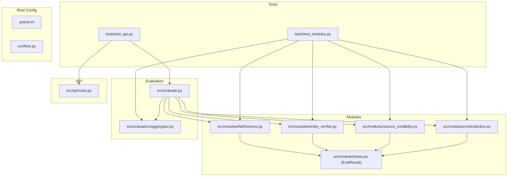
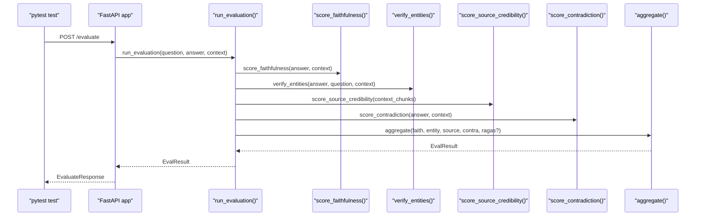
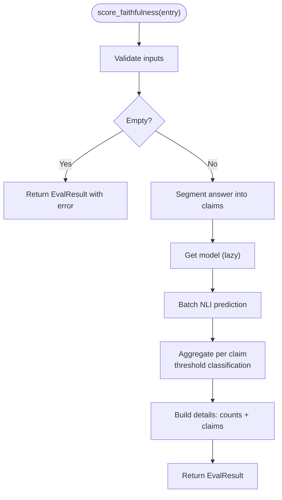
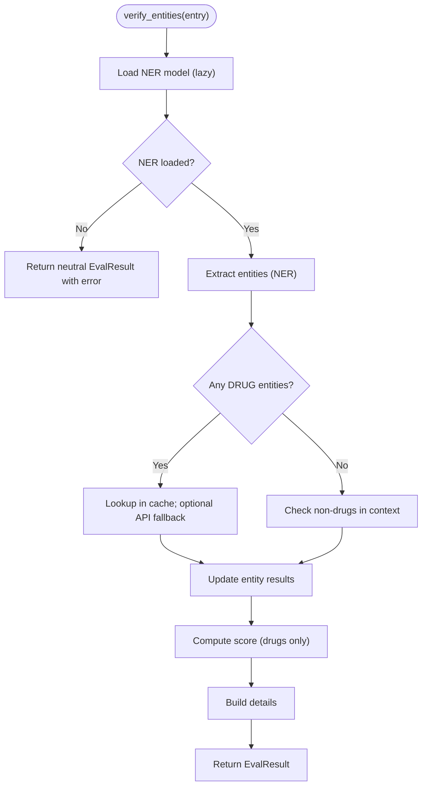
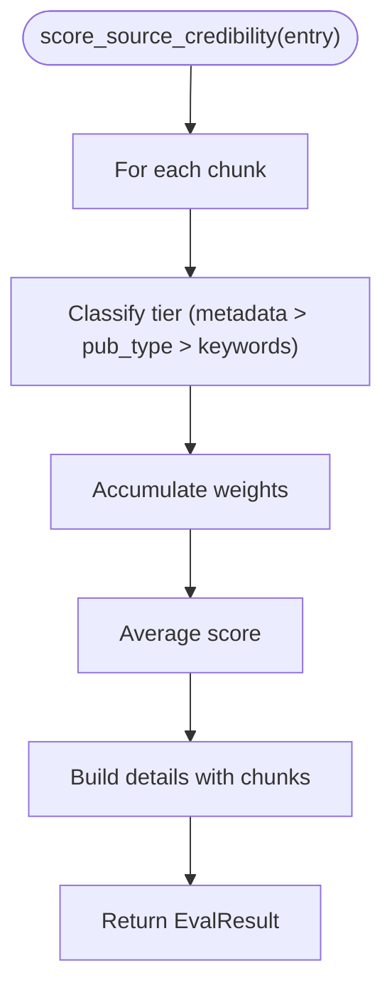
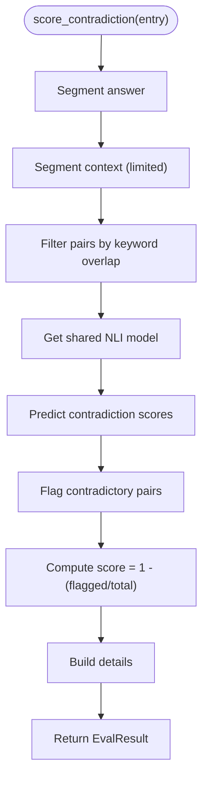
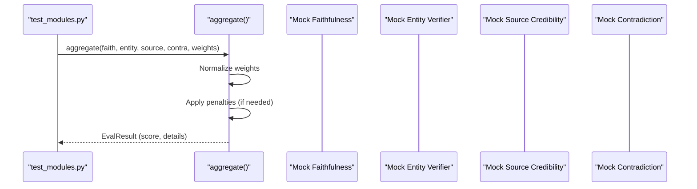
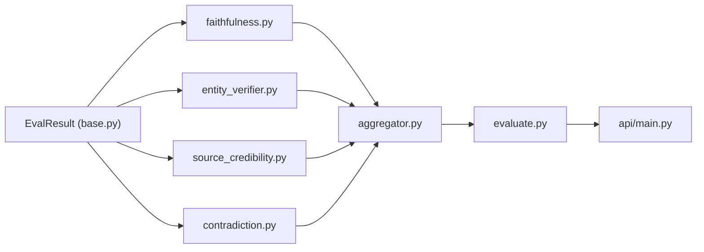

# Unit Testing Framework

<cite>
**Referenced Files in This Document**
- [pytest.ini](file://Backend/pytest.ini)
- [conftest.py](file://Backend/conftest.py)
- [test_modules.py](file://Backend/tests/test_modules.py)
- [test_api.py](file://Backend/tests/test_api.py)
- [modules/__init__.py](file://Backend/src/modules/__init__.py)
- [faithfulness.py](file://Backend/src/modules/faithfulness.py)
- [entity_verifier.py](file://Backend/src/modules/entity_verifier.py)
- [source_credibility.py](file://Backend/src/modules/source_credibility.py)
- [contradiction.py](file://Backend/src/modules/contradiction.py)
- [aggregator.py](file://Backend/src/evaluation/aggregator.py)
- [evaluate.py](file://Backend/src/evaluate.py)
- [main.py](file://Backend/src/api/main.py)
- [requirements.txt](file://Backend/requirements.txt)
</cite>

## Table of Contents
1. [Introduction](#introduction)
2. [Project Structure](#project-structure)
3. [Core Components](#core-components)
4. [Architecture Overview](#architecture-overview)
5. [Detailed Component Analysis](#detailed-component-analysis)
6. [Dependency Analysis](#dependency-analysis)
7. [Performance Considerations](#performance-considerations)
8. [Troubleshooting Guide](#troubleshooting-guide)
9. [Conclusion](#conclusion)

## Introduction
This document describes the unit testing framework for the evaluation pipeline. It covers pytest configuration, test organization, fixtures and environment setup, and mocking strategies for external dependencies. It also explains how to test individual evaluation modules in isolation (Faithfulness, Entity Verification, Source Credibility, and Contradiction Detection), along with guidelines for testing NLP models, RxNorm API integrations, FAISS vector operations, test data management, and test isolation techniques. Finally, it provides examples of testing evaluation pipelines, module scoring functions, and error handling scenarios.

## Project Structure
The testing setup is organized under Backend/tests with pytest configuration and environment preparation handled at the project root. The evaluation modules live under Backend/src/modules and Backend/src/evaluation, while the API server lives under Backend/src/api.

**Diagram sources**
- [pytest.ini:1-7](file://Backend/pytest.ini#L1-L7)
- [conftest.py:1-13](file://Backend/conftest.py#L1-L13)
- [test_modules.py:1-67](file://Backend/tests/test_modules.py#L1-L67)
- [test_api.py:1-54](file://Backend/tests/test_api.py#L1-L54)
- [modules/__init__.py:1-128](file://Backend/src/modules/__init__.py#L1-L128)
- [faithfulness.py:1-234](file://Backend/src/modules/faithfulness.py#L1-L234)
- [entity_verifier.py:1-283](file://Backend/src/modules/entity_verifier.py#L1-L283)
- [source_credibility.py:1-200](file://Backend/src/modules/source_credibility.py#L1-L200)
- [contradiction.py:1-251](file://Backend/src/modules/contradiction.py#L1-L251)
- [aggregator.py:1-167](file://Backend/src/evaluation/aggregator.py#L1-L167)
- [evaluate.py:1-251](file://Backend/src/evaluate.py#L1-L251)
- [main.py:1-678](file://Backend/src/api/main.py#L1-L678)

**Section sources**
- [pytest.ini:1-7](file://Backend/pytest.ini#L1-L7)
- [conftest.py:1-13](file://Backend/conftest.py#L1-L13)
- [test_modules.py:1-67](file://Backend/tests/test_modules.py#L1-L67)
- [test_api.py:1-54](file://Backend/tests/test_api.py#L1-L54)

## Core Components
- pytest configuration: Defines test discovery patterns and default options.
- Root conftest: Prepends src/ to sys.path so tests can import from src.* directly.
- Test suites:
  - test_modules.py: Tests evaluation modules and aggregator logic.
  - test_api.py: Tests FastAPI endpoints using httpx ASGI transport.
- Module contracts: EvalResult dataclass defines the standardized output schema for all modules.

Key behaviors for testing:
- Module outputs are EvalResult instances with module_name, score, details, error, and latency_ms.
- Modules implement lazy loading and stub modes for optional dependencies (e.g., NLI models, SciSpaCy, RxNorm API).
- Aggregator normalizes weights and applies safety penalties for extreme scores.

**Section sources**
- [pytest.ini:1-7](file://Backend/pytest.ini#L1-L7)
- [conftest.py:1-13](file://Backend/conftest.py#L1-L13)
- [modules/__init__.py:1-128](file://Backend/src/modules/__init__.py#L1-L128)
- [aggregator.py:1-167](file://Backend/src/evaluation/aggregator.py#L1-L167)

## Architecture Overview
The evaluation pipeline composes four modules plus optional RAGAS and an aggregator. Tests exercise these components in isolation and in combination.

**Diagram sources**
- [test_api.py:1-54](file://Backend/tests/test_api.py#L1-L54)
- [main.py:223-302](file://Backend/src/api/main.py#L223-L302)
- [evaluate.py:49-167](file://Backend/src/evaluate.py#L49-L167)
- [faithfulness.py:86-234](file://Backend/src/modules/faithfulness.py#L86-L234)
- [entity_verifier.py:146-283](file://Backend/src/modules/entity_verifier.py#L146-L283)
- [source_credibility.py:121-200](file://Backend/src/modules/source_credibility.py#L121-L200)
- [contradiction.py:94-251](file://Backend/src/modules/contradiction.py#L94-L251)
- [aggregator.py:47-167](file://Backend/src/evaluation/aggregator.py#L47-L167)

## Detailed Component Analysis

### pytest Configuration and Environment Setup
- Discovery and naming:
  - testpaths = tests
  - python_files = test_*.py
  - python_classes = Test*
  - python_functions = test_*
  - addopts = -v --tb=short
- Root conftest prepends src/ and project root to sys.path, enabling direct imports from src.* without manual PYTHONPATH manipulation.

Testing best practices derived from configuration:
- Keep test files named test_*.py and functions prefixed with test_.
- Use verbose output and concise tracebacks for quick diagnostics.

**Section sources**
- [pytest.ini:1-7](file://Backend/pytest.ini#L1-L7)
- [conftest.py:1-13](file://Backend/conftest.py#L1-L13)

### Test Organization Patterns
- test_modules.py:
  - Tests module-level scoring functions and aggregator logic.
  - Uses minimal, deterministic inputs to assert expected ranges and shapes.
  - Demonstrates mocking of EvalResult-like objects to isolate aggregation.
- test_api.py:
  - Uses httpx.Client with ASGITransport(app=app) to avoid version conflicts.
  - Exercises /health and /evaluate endpoints with realistic payloads.
  - Validates Pydantic validation failures for invalid inputs.

**Section sources**
- [test_modules.py:1-67](file://Backend/tests/test_modules.py#L1-L67)
- [test_api.py:1-54](file://Backend/tests/test_api.py#L1-L54)

### Mocking Strategies for External Dependencies
Common external dependencies and their testing approaches:
- NLP models (sentence-transformers, cross-encoder, SciSpaCy):
  - Modules support lazy loading and stub modes when libraries are missing.
  - Tests can rely on these stubs or simulate model availability by importing the modules early in the process.
- RxNorm API:
  - Entity verification supports disabling API fallback and relies on a local CSV cache.
  - Tests can bypass network calls by pointing to a non-existent cache path or by patching the API lookup function.
- FAISS vector operations:
  - FAISS is used by the retriever; tests can avoid heavy indexing by using small synthetic indices or by mocking retrieval calls.
- Requests and HTTP:
  - Use httpx ASGI transport for FastAPI tests to avoid TestClient compatibility issues.

Guidelines:
- Prefer process-level imports to trigger lazy loaders once per process.
- Use pytest monkeypatch to inject stubs or override constants.
- For FAISS, consider using in-memory indices or small prebuilt indices for tests.

**Section sources**
- [faithfulness.py:58-79](file://Backend/src/modules/faithfulness.py#L58-L79)
- [entity_verifier.py:70-140](file://Backend/src/modules/entity_verifier.py#L70-L140)
- [main.py:125-149](file://Backend/src/api/main.py#L125-L149)

### Testing Individual Evaluation Modules in Isolation

#### Faithfulness Module
- Purpose: Claims-based NLI scoring using a cross-encoder model.
- Key behaviors to test:
  - Empty inputs return appropriate EvalResult with error details.
  - Threshold-based classification (ENTAILED, NEUTRAL, CONTRADICTED).
  - Model unavailability triggers stub behavior and error propagation.
  - Sentence segmentation fallback when pysbd is unavailable.
- Test ideas:
  - Provide answer with known entailment vs contradiction contexts.
  - Simulate model loading failure and verify neutral fallback.
  - Verify details shape and counts for claims.

**Diagram sources**
- [faithfulness.py:86-234](file://Backend/src/modules/faithfulness.py#L86-L234)

**Section sources**
- [faithfulness.py:1-234](file://Backend/src/modules/faithfulness.py#L1-L234)
- [modules/__init__.py:1-128](file://Backend/src/modules/__init__.py#L1-L128)

#### Entity Verification Module
- Purpose: Extract and verify medical entities (DRUG, CONDITION, PROCEDURE, DOSAGE) using SciSpaCy NER and RxNorm cache/API.
- Key behaviors to test:
  - NER model loading failure returns neutral fallback.
  - Cache miss falls back to RxNorm API when enabled.
  - Presence checks in context documents for non-drug entities.
  - Score computation based on verified drug entities.
- Test ideas:
  - Provide answer with known drugs and conditions.
  - Disable API fallback and verify cache-only path.
  - Simulate API timeouts or non-200 responses.

**Diagram sources**
- [entity_verifier.py:146-283](file://Backend/src/modules/entity_verifier.py#L146-L283)

**Section sources**
- [entity_verifier.py:1-283](file://Backend/src/modules/entity_verifier.py#L1-L283)
- [modules/__init__.py:1-128](file://Backend/src/modules/__init__.py#L1-L128)

#### Source Credibility Module
- Purpose: Evidence-tier scoring based on metadata or keyword matching.
- Key behaviors to test:
  - Explicit tier_type metadata takes precedence.
  - Keyword-based fallback classification.
  - Score equals average of tier weights across chunks.
- Test ideas:
  - Provide chunks with tier_type metadata.
  - Provide pub_type/title combinations that match keywords.
  - Verify details include chunk-level tier info.

**Diagram sources**
- [source_credibility.py:121-200](file://Backend/src/modules/source_credibility.py#L121-L200)

**Section sources**
- [source_credibility.py:1-200](file://Backend/src/modules/source_credibility.py#L1-L200)
- [modules/__init__.py:1-128](file://Backend/src/modules/__init__.py#L1-L128)

#### Contradiction Detection Module
- Purpose: Detect contradictions between answer sentences and context sentences using NLI.
- Key behaviors to test:
  - Sentence segmentation with fallback.
  - Keyword overlap filter to bound inference pairs.
  - Threshold-based flagging and score computation.
- Test ideas:
  - Provide answer/context pairs with known contradictions.
  - Disable NLI model to verify neutral fallback.
  - Cap pair counts to validate latency bounds.

**Diagram sources**
- [contradiction.py:94-251](file://Backend/src/modules/contradiction.py#L94-L251)

**Section sources**
- [contradiction.py:1-251](file://Backend/src/modules/contradiction.py#L1-L251)
- [modules/__init__.py:1-128](file://Backend/src/modules/__init__.py#L1-L128)

### Testing the Evaluation Pipeline and Aggregator
- Pipeline orchestration:
  - run_evaluation() invokes all modules and the aggregator, returning a composite EvalResult.
  - It handles optional RAGAS and attaches module results for downstream use.
- Aggregation:
  - Weights are normalized if they do not sum to 1.0.
  - Safety penalties reduce composite when faithfulness or contradiction are poor.
  - Risk bands and confidence levels are derived from composite score.

Test ideas:
- Compose module results with known scores and weights to assert composite and risk band.
- Inject error states in module results to verify neutral fallbacks and penalties.
- Validate latency aggregation and module latencies in details.

**Diagram sources**
- [test_modules.py:30-67](file://Backend/tests/test_modules.py#L30-L67)
- [aggregator.py:47-167](file://Backend/src/evaluation/aggregator.py#L47-L167)

**Section sources**
- [evaluate.py:49-167](file://Backend/src/evaluate.py#L49-L167)
- [aggregator.py:1-167](file://Backend/src/evaluation/aggregator.py#L1-L167)
- [test_modules.py:1-67](file://Backend/tests/test_modules.py#L1-L67)

### API Endpoint Testing
- Health endpoint:
  - Validates response structure and fields.
- Evaluate endpoint:
  - Sends realistic payloads and asserts composite score, HRS, risk band, and module results presence.
  - Tests Pydantic validation errors for invalid inputs.
- Query endpoint:
  - Exercises end-to-end flow: retrieval → generation → evaluation.
  - Includes intervention logic for high-risk responses.

Test ideas:
- Use httpx ASGI transport to avoid TestClient version conflicts.
- Mock external services (Ollama, FAISS) to keep tests deterministic.
- Assert audit log insertion and response fields.

**Section sources**
- [test_api.py:1-54](file://Backend/tests/test_api.py#L1-L54)
- [main.py:206-302](file://Backend/src/api/main.py#L206-L302)

### Test Fixtures and conftest Configuration
- Root conftest:
  - Inserts Backend/src and Backend into sys.path so tests can import from src.* without PYTHONPATH.
- Recommended fixtures:
  - Process-wide model warm-up fixture to avoid first-call slowness in tests.
  - Mock FAISS index fixture for retriever tests.
  - RxNorm cache fixture that points to a small test CSV or a patched lookup function.
  - Pydantic model fixtures for API request/response schemas.

Implementation tips:
- Use pytest fixtures with session scope for model warm-ups.
- Use monkeypatch to replace constants like model names or cache paths.
- For FAISS, use in-memory indices or small prebuilt indices to speed up tests.

**Section sources**
- [conftest.py:1-13](file://Backend/conftest.py#L1-L13)
- [main.py:125-149](file://Backend/src/api/main.py#L125-L149)

### Guidelines for Testing NLP Models, RxNorm Integrations, and FAISS Operations
- NLP models:
  - Faithfulness and Contradiction share the same NLI model; warm it once per process in a fixture.
  - Stub mode ensures tests pass even if sentence-transformers is not installed.
- RxNorm:
  - Use a non-existent cache path to force API fallback behavior.
  - Patch the API endpoint to return controlled responses for positive/negative cases.
- FAISS:
  - For retriever tests, construct a small in-memory index and metadata mapping.
  - Use thread locks and atomic writes patterns shown in the API ingestion endpoint as a reference for safe updates.

**Section sources**
- [faithfulness.py:58-79](file://Backend/src/modules/faithfulness.py#L58-L79)
- [contradiction.py:121-149](file://Backend/src/modules/contradiction.py#L121-L149)
- [entity_verifier.py:89-140](file://Backend/src/modules/entity_verifier.py#L89-L140)
- [main.py:524-604](file://Backend/src/api/main.py#L524-L604)

### Test Data Management and Mock Strategies
- Minimal deterministic inputs:
  - Use short, controlled answers and context chunks to keep tests fast and predictable.
- Mocking expensive loads:
  - Warm NLP models in a session-scoped fixture.
  - Replace cache files with small CSVs or patch file I/O.
- Isolation:
  - Use separate test databases or in-memory SQLite for audit logs.
  - Avoid global mutable state; reset module-level caches between tests if needed.

**Section sources**
- [test_modules.py:1-67](file://Backend/tests/test_modules.py#L1-L67)
- [test_api.py:1-54](file://Backend/tests/test_api.py#L1-L54)
- [main.py:75-120](file://Backend/src/api/main.py#L75-L120)

### Examples of Testing Evaluation Pipelines, Module Scoring Functions, and Error Handling
- Pipeline:
  - Compose module results with known scores and weights; assert composite and risk band.
  - Inject error states to verify neutral fallbacks and penalties.
- Module scoring:
  - Faithfulness: provide answer/context pairs with known entailment/contradiction; assert thresholds and details.
  - Entity verification: provide answer with known drugs; assert verification and context presence.
  - Source credibility: provide chunks with metadata or keywords; assert tier weights and average score.
  - Contradiction: provide answer/context with contradictions; assert flagged pairs and score.
- Error handling:
  - NLP model unavailability: verify stub behavior and neutral scores.
  - RxNorm API failures: verify fallback to neutral or NOT_FOUND depending on configuration.
  - API validation: assert 422 responses for invalid payloads.

**Section sources**
- [test_modules.py:1-67](file://Backend/tests/test_modules.py#L1-L67)
- [test_api.py:1-54](file://Backend/tests/test_api.py#L1-L54)
- [faithfulness.py:150-164](file://Backend/src/modules/faithfulness.py#L150-L164)
- [entity_verifier.py:170-179](file://Backend/src/modules/entity_verifier.py#L170-L179)
- [contradiction.py:198-208](file://Backend/src/modules/contradiction.py#L198-L208)

## Dependency Analysis
The evaluation modules depend on a shared EvalResult contract. The aggregator depends on module outputs. The API depends on the evaluation pipeline and optionally on external services.

**Diagram sources**
- [modules/__init__.py:1-128](file://Backend/src/modules/__init__.py#L1-L128)
- [faithfulness.py:1-234](file://Backend/src/modules/faithfulness.py#L1-L234)
- [entity_verifier.py:1-283](file://Backend/src/modules/entity_verifier.py#L1-L283)
- [source_credibility.py:1-200](file://Backend/src/modules/source_credibility.py#L1-L200)
- [contradiction.py:1-251](file://Backend/src/modules/contradiction.py#L1-L251)
- [aggregator.py:1-167](file://Backend/src/evaluation/aggregator.py#L1-L167)
- [evaluate.py:1-251](file://Backend/src/evaluate.py#L1-L251)
- [main.py:1-678](file://Backend/src/api/main.py#L1-L678)

**Section sources**
- [modules/__init__.py:1-128](file://Backend/src/modules/__init__.py#L1-L128)
- [aggregator.py:1-167](file://Backend/src/evaluation/aggregator.py#L1-L167)
- [evaluate.py:1-251](file://Backend/src/evaluate.py#L1-L251)
- [main.py:1-678](file://Backend/src/api/main.py#L1-L678)

## Performance Considerations
- First-call latency:
  - NLP models are warmed at app lifespan or in a pytest fixture to avoid slow first calls during tests.
- Pair capping:
  - Contradiction module caps sentence pairs to bound latency; tests should verify this behavior.
- In-memory FAISS:
  - Use small in-memory indices for tests to avoid disk I/O overhead.
- Test isolation:
  - Use session-scoped fixtures to avoid repeated model loads across tests.

**Section sources**
- [main.py:125-149](file://Backend/src/api/main.py#L125-L149)
- [contradiction.py:37-40](file://Backend/src/modules/contradiction.py#L37-L40)
- [requirements.txt:1-35](file://Backend/requirements.txt#L1-L35)

## Troubleshooting Guide
- Missing optional dependencies:
  - If sentence-transformers or SciSpaCy are not installed, modules fall back to stub behavior. Tests should account for neutral scores and error messages.
- Pydantic validation errors:
  - API tests assert 422 responses for invalid payloads; ensure request schemas match expectations.
- FAISS index not found:
  - Retrieval tests should handle missing indices and return appropriate HTTP errors.
- Audit logs:
  - Verify database initialization and log insertion in API tests.

**Section sources**
- [test_api.py:46-54](file://Backend/tests/test_api.py#L46-L54)
- [main.py:75-120](file://Backend/src/api/main.py#L75-L120)
- [main.py:326-343](file://Backend/src/api/main.py#L326-L343)

## Conclusion
The testing framework leverages pytest configuration, root conftest path injection, and focused test suites to validate evaluation modules in isolation and in combination. By mocking expensive external dependencies (models, APIs, FAISS), using deterministic inputs, and validating error handling, the suite remains fast, reliable, and maintainable. The provided diagrams and section sources offer a practical blueprint for extending tests to new modules or integrating additional external systems.