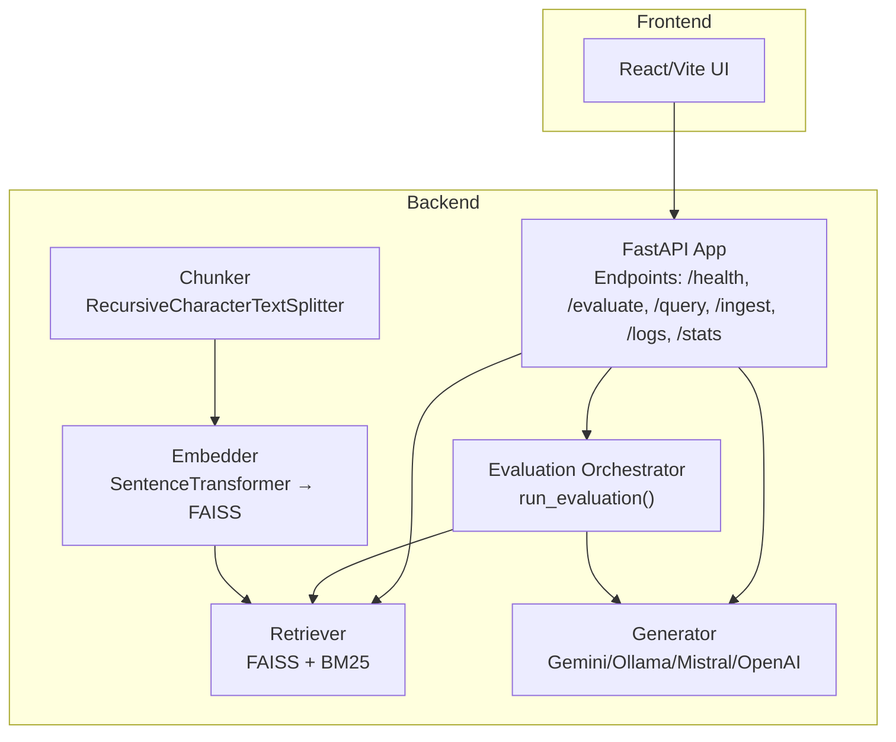
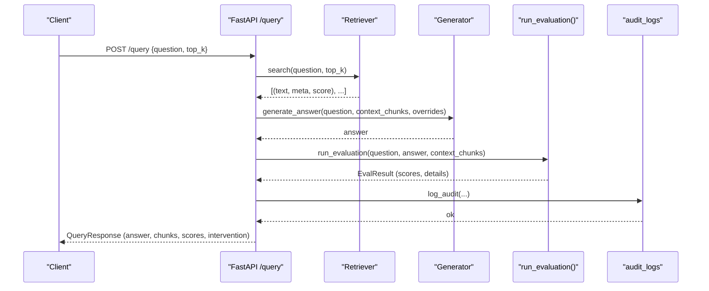
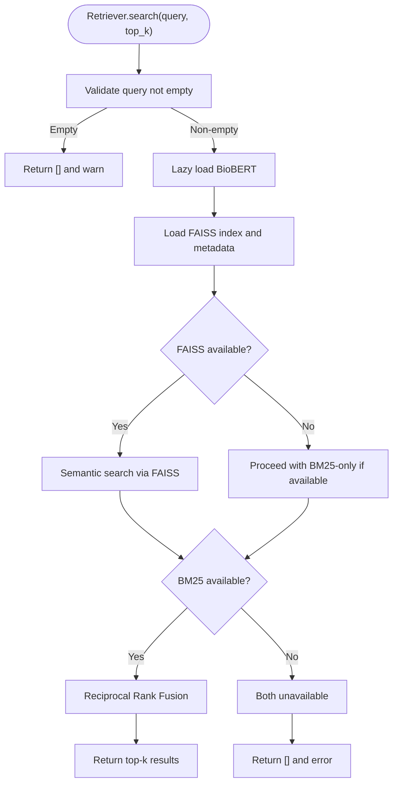
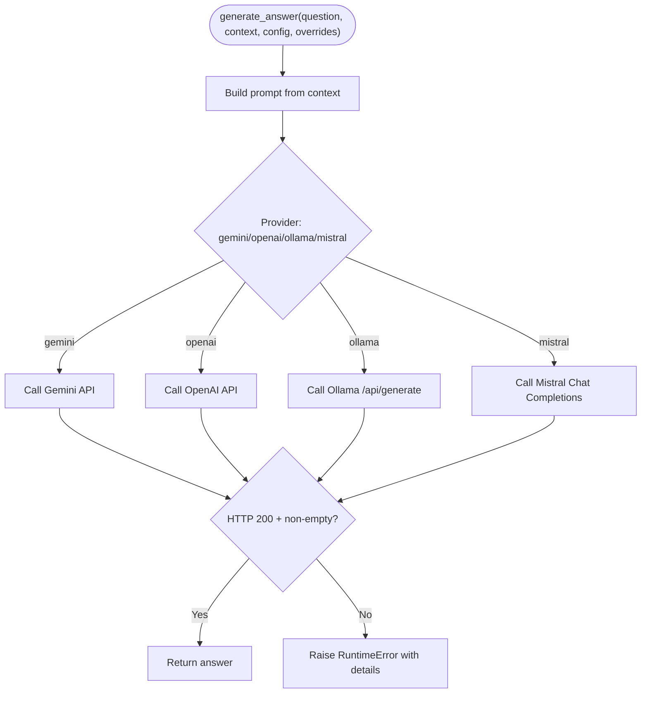
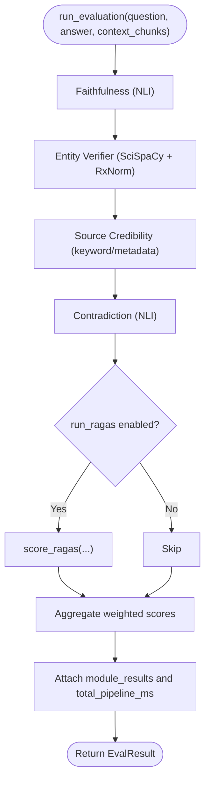
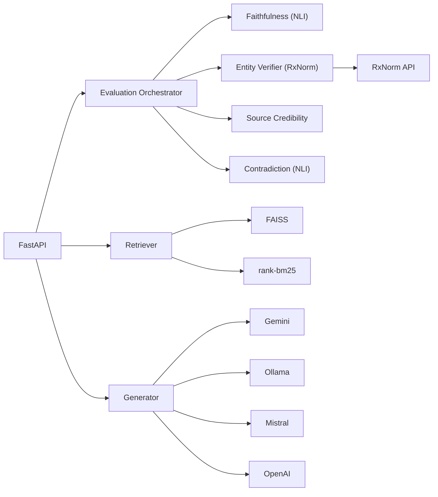

# Troubleshooting and FAQ

<cite>
**Referenced Files in This Document**
- [Backend README](file://Backend/README.md)
- [Frontend README](file://Frontend/README.md)
- [config.yaml](file://Backend/config.yaml)
- [requirements.txt](file://Backend/requirements.txt)
- [START_INSTRUCTIONS.txt](file://START_INSTRUCTIONS.txt)
- [api/main.py](file://Backend/src/api/main.py)
- [evaluate.py](file://Backend/src/evaluate.py)
- [modules/base.py](file://Backend/src/modules/base.py)
- [pipeline/retriever.py](file://Backend/src/pipeline/retriever.py)
- [pipeline/embedder.py](file://Backend/src/pipeline/embedder.py)
- [pipeline/generator.py](file://Backend/src/pipeline/generator.py)
- [modules/faithfulness.py](file://Backend/src/modules/faithfulness.py)
- [modules/entity_verifier.py](file://Backend/src/modules/entity_verifier.py)
</cite>

## Table of Contents
1. [Introduction](#introduction)
2. [Project Structure](#project-structure)
3. [Core Components](#core-components)
4. [Architecture Overview](#architecture-overview)
5. [Detailed Component Analysis](#detailed-component-analysis)
6. [Dependency Analysis](#dependency-analysis)
7. [Performance Considerations](#performance-considerations)
8. [Troubleshooting Guide](#troubleshooting-guide)
9. [Conclusion](#conclusion)
10. [Appendices](#appendices)

## Introduction
This document provides comprehensive troubleshooting guidance for MediRAG 3.0. It focuses on diagnosing and resolving common issues across model loading, vector database connectivity, document processing, API response problems, evaluation pipeline failures, retrieval performance, and frontend integration. It also includes error interpretation guides, performance tuning tips, network and rate-limiting considerations, FAQs, and escalation procedures.

## Project Structure
MediRAG consists of:
- Backend API (FastAPI) exposing endpoints for health checks, evaluation, query, ingestion, and dashboard data
- Pipeline modules for chunking, embedding, retrieval, and answer generation
- Evaluation modules for faithfulness, entity verification, source credibility, contradiction, and aggregation
- Frontend (React/Vite) for UI and dashboard

**Diagram sources**
- [api/main.py:156-173](file://Backend/src/api/main.py#L156-L173)
- [evaluate.py:49-167](file://Backend/src/evaluate.py#L49-L167)
- [pipeline/retriever.py:39-250](file://Backend/src/pipeline/retriever.py#L39-L250)
- [pipeline/generator.py:344-462](file://Backend/src/pipeline/generator.py#L344-L462)
- [pipeline/chunker.py:20-82](file://Backend/src/pipeline/chunker.py#L20-L82)
- [pipeline/embedder.py:139-160](file://Backend/src/pipeline/embedder.py#L139-L160)

**Section sources**
- [Backend README:1-3](file://Backend/README.md#L1-L3)
- [Frontend README:1-87](file://Frontend/README.md#L1-L87)

## Core Components
- API layer: health checks, evaluation, end-to-end query, ingestion, and dashboard data endpoints
- Evaluation pipeline: runs faithfulness, entity verification, source credibility, contradiction scoring, optional RAGAS, and aggregation
- Retrieval: hybrid FAISS (semantic) and BM25 (keyword) with Reciprocal Rank Fusion
- Generation: Gemini, Ollama/Mistral, Mistral, or OpenAI with configurable provider and timeouts
- Data ingestion: chunking, embedding, FAISS index building, and dynamic ingestion with atomic updates

**Section sources**
- [api/main.py:206-302](file://Backend/src/api/main.py#L206-L302)
- [evaluate.py:49-167](file://Backend/src/evaluate.py#L49-L167)
- [pipeline/retriever.py:39-250](file://Backend/src/pipeline/retriever.py#L39-L250)
- [pipeline/generator.py:344-462](file://Backend/src/pipeline/generator.py#L344-L462)
- [pipeline/chunker.py:20-82](file://Backend/src/pipeline/chunker.py#L20-L82)
- [pipeline/embedder.py:139-160](file://Backend/src/pipeline/embedder.py#L139-L160)

## Architecture Overview
End-to-end flow for /query:
1. Retrieve top-k chunks using Retriever (BioBERT + FAISS + BM25)
2. Generate grounded answer using configured LLM provider
3. Evaluate answer with all modules and optional RAGAS
4. Apply intervention policy (block or regenerate) based on HRS and faithfulness
5. Return answer, chunks, scores, and intervention details

**Diagram sources**
- [api/main.py:308-519](file://Backend/src/api/main.py#L308-L519)
- [pipeline/retriever.py:149-250](file://Backend/src/pipeline/retriever.py#L149-L250)
- [pipeline/generator.py:344-413](file://Backend/src/pipeline/generator.py#L344-L413)
- [evaluate.py:49-167](file://Backend/src/evaluate.py#L49-L167)

## Detailed Component Analysis

### Retrieval Component Analysis
Common issues:
- FAISS index not found or unreadable
- Missing BM25 dependency causing degraded search
- Empty or invalid queries
- Model loading failures for BioBERT

**Diagram sources**
- [pipeline/retriever.py:149-250](file://Backend/src/pipeline/retriever.py#L149-L250)

**Section sources**
- [pipeline/retriever.py:80-114](file://Backend/src/pipeline/retriever.py#L80-L114)
- [pipeline/retriever.py:174-206](file://Backend/src/pipeline/retriever.py#L174-L206)

### Generation Component Analysis
Common issues:
- Provider misconfiguration (missing API keys)
- Network errors to external LLM providers
- Timeout or empty responses
- Unknown provider selection

**Diagram sources**
- [pipeline/generator.py:344-413](file://Backend/src/pipeline/generator.py#L344-L413)
- [pipeline/generator.py:177-231](file://Backend/src/pipeline/generator.py#L177-L231)
- [pipeline/generator.py:131-176](file://Backend/src/pipeline/generator.py#L131-L176)
- [pipeline/generator.py:238-284](file://Backend/src/pipeline/generator.py#L238-L284)
- [pipeline/generator.py:290-337](file://Backend/src/pipeline/generator.py#L290-L337)

**Section sources**
- [pipeline/generator.py:131-176](file://Backend/src/pipeline/generator.py#L131-L176)
- [pipeline/generator.py:177-231](file://Backend/src/pipeline/generator.py#L177-L231)
- [pipeline/generator.py:238-284](file://Backend/src/pipeline/generator.py#L238-L284)
- [pipeline/generator.py:290-337](file://Backend/src/pipeline/generator.py#L290-L337)

### Evaluation Pipeline Analysis
Common issues:
- Module model not installed or fails to load
- Empty answer or context leading to zero-score fallbacks
- RAGAS dependency on external LLM backend
- Aggregation weight misconfiguration

**Diagram sources**
- [evaluate.py:49-167](file://Backend/src/evaluate.py#L49-L167)
- [modules/faithfulness.py:86-234](file://Backend/src/modules/faithfulness.py#L86-L234)
- [modules/entity_verifier.py:146-283](file://Backend/src/modules/entity_verifier.py#L146-L283)

**Section sources**
- [evaluate.py:49-167](file://Backend/src/evaluate.py#L49-L167)
- [modules/base.py:15-43](file://Backend/src/modules/base.py#L15-L43)

## Dependency Analysis
External dependencies and their roles:
- FAISS for vector similarity search
- SentenceTransformers for BioBERT embeddings
- rank-bm25 for keyword search
- SciSpaCy + RxNorm API for entity verification
- Gemini/OpenAI/Ollama/Mistral for generation
- Pydantic for request validation
- Requests for HTTP calls

**Diagram sources**
- [requirements.txt:1-35](file://Backend/requirements.txt#L1-L35)
- [config.yaml:1-66](file://Backend/config.yaml#L1-L66)
- [api/main.py:35-47](file://Backend/src/api/main.py#L35-L47)

**Section sources**
- [requirements.txt:1-35](file://Backend/requirements.txt#L1-L35)
- [config.yaml:1-66](file://Backend/config.yaml#L1-L66)

## Performance Considerations
- Memory usage
  - BioBERT/SentenceTransformers models consume significant RAM; preload at startup to avoid first-request latency spikes
  - FAISS index and metadata are loaded into memory; ensure sufficient RAM for dataset scale
- GPU utilization
  - FAISS CPU is supported; GPU acceleration requires FAISS with CUDA (not required for CPU-only operation)
- Response time optimization
  - Reduce top_k and chunk counts where appropriate
  - Use BM25-only fallback if FAISS is unavailable
  - Tune provider timeouts and generation parameters
  - Warm models at startup to avoid cold starts

[No sources needed since this section provides general guidance]

## Troubleshooting Guide

### Model Loading Failures
Symptoms:
- DeBERTa/NLI model fails to load during startup or evaluation
- SciSpaCy model not found or fails to load
- FAISS not installed or index unreadable

Resolution steps:
- Verify dependencies in requirements and install missing packages
- Confirm model names in config match installed models
- Ensure FAISS is installed and index files exist at configured paths
- Check that SentenceTransformers and cross-encoders are available

**Section sources**
- [api/main.py:125-149](file://Backend/src/api/main.py#L125-L149)
- [modules/faithfulness.py:58-79](file://Backend/src/modules/faithfulness.py#L58-L79)
- [modules/entity_verifier.py:70-86](file://Backend/src/modules/entity_verifier.py#L70-L86)
- [pipeline/retriever.py:80-114](file://Backend/src/pipeline/retriever.py#L80-L114)

### Vector Database Connectivity Issues
Symptoms:
- FAISS index not found
- Empty retrieval results
- Errors indicating FAISS/BM25 unavailable

Resolution steps:
- Confirm FAISS index and metadata paths in config
- Rebuild FAISS index using the embedder pipeline
- Ensure BM25 is installed if relying on keyword search
- Validate that the retriever is pre-warmed at startup

**Section sources**
- [config.yaml:1-10](file://Backend/config.yaml#L1-L10)
- [pipeline/embedder.py:117-137](file://Backend/src/pipeline/embedder.py#L117-L137)
- [pipeline/retriever.py:80-114](file://Backend/src/pipeline/retriever.py#L80-L114)
- [pipeline/retriever.py:115-143](file://Backend/src/pipeline/retriever.py#L115-L143)

### Document Processing Errors
Symptoms:
- Zero chunks produced
- Chunking failures or empty documents
- Ingestion errors during FAISS update

Resolution steps:
- Verify input documents are non-empty and properly formatted
- Use the chunker to split documents with correct chunk_size and overlap
- Ensure the embedder produces embeddings and saves FAISS index and metadata
- For dynamic ingestion, ensure the FAISS lock prevents concurrent writes and atomic disk writes are used

**Section sources**
- [pipeline/chunker.py:20-82](file://Backend/src/pipeline/chunker.py#L20-L82)
- [pipeline/embedder.py:139-160](file://Backend/src/pipeline/embedder.py#L139-L160)
- [api/main.py:524-603](file://Backend/src/api/main.py#L524-L603)

### API Response Problems
Symptoms:
- 500 Internal Server Error
- 503 Service Unavailable for generation
- 404 Not Found for retrieval
- Health endpoint reports Ollama unavailable

Resolution steps:
- Check backend logs for exceptions and stack traces
- Validate API endpoints and request shapes
- Ensure Ollama is running and reachable at base_url
- For /query, confirm retriever is initialized and FAISS index exists

**Section sources**
- [api/main.py:206-218](file://Backend/src/api/main.py#L206-L218)
- [api/main.py:326-347](file://Backend/src/api/main.py#L326-L347)
- [api/main.py:387-391](file://Backend/src/api/main.py#L387-L391)
- [api/main.py:179-186](file://Backend/src/api/main.py#L179-L186)

### Evaluation Pipeline Failures
Symptoms:
- Evaluation returns neutral or zero scores
- Module-specific errors reported
- RAGAS disabled due to missing LLM backend

Resolution steps:
- Review module details for error messages and adjust thresholds or inputs
- Ensure all required models are installed and accessible
- Disable RAGAS if external LLM backend is unavailable
- Validate context chunk schema and lengths

**Section sources**
- [evaluate.py:49-167](file://Backend/src/evaluate.py#L49-L167)
- [modules/base.py:15-43](file://Backend/src/modules/base.py#L15-L43)

### Retrieval Performance Issues
Symptoms:
- Slow retrieval or low recall
- Degraded performance with large datasets

Resolution steps:
- Increase top_k cautiously and tune chunk sizes
- Ensure FAISS is built with normalized vectors for cosine similarity
- Rebuild BM25 index after dynamic ingestion
- Monitor memory usage and consider reducing model batch sizes

**Section sources**
- [config.yaml:1-10](file://Backend/config.yaml#L1-L10)
- [pipeline/retriever.py:174-250](file://Backend/src/pipeline/retriever.py#L174-L250)

### Frontend Integration Problems
Symptoms:
- CORS errors or blocked requests
- Dashboard not displaying logs or stats
- Parse file endpoint failing

Resolution steps:
- Verify CORS middleware allows frontend origin
- Ensure frontend runs on the expected port and connects to backend host/port
- Check /logs and /stats endpoints for database connectivity
- Validate file parsing endpoints accept supported formats

**Section sources**
- [api/main.py:167-173](file://Backend/src/api/main.py#L167-L173)
- [api/main.py:608-648](file://Backend/src/api/main.py#L608-L648)
- [api/main.py:651-677](file://Backend/src/api/main.py#L651-L677)

### Error Interpretation Guide
Common HTTP statuses and causes:
- 200 OK: Successful operation
- 400 Bad Request: Validation errors or unsupported file types
- 404 Not Found: No relevant documents found for query
- 500 Internal Server Error: Unhandled exception in evaluation or processing
- 503 Service Unavailable: LLM generation failure or retriever not pre-warmed

Typical error messages and resolutions:
- “FAISS index not found”: Build or restore FAISS index and metadata
- “Ollama is not running”: Start Ollama service and ensure base_url is correct
- “NER model unavailable”: Install SciSpaCy model and ensure it loads
- “Empty answer or no context”: Provide non-empty answer and context chunks
- “RxNorm cache not found”: Provide a valid cache path or enable API fallback

**Section sources**
- [api/main.py:338-343](file://Backend/src/api/main.py#L338-L343)
- [api/main.py:389-391](file://Backend/src/api/main.py#L389-L391)
- [modules/entity_verifier.py:92-96](file://Backend/src/modules/entity_verifier.py#L92-L96)
- [modules/faithfulness.py:107-114](file://Backend/src/modules/faithfulness.py#L107-L114)

### Network Connectivity, Rate Limiting, and External Dependencies
- Gemini/OpenAI/Ollama/Mistral require valid API keys and network access
- Configure timeouts appropriately to avoid hanging requests
- External services like RxNorm API may rate limit; implement retries and caching
- Ensure firewall and proxy settings allow outbound connections

**Section sources**
- [config.yaml:44-52](file://Backend/config.yaml#L44-L52)
- [pipeline/generator.py:131-176](file://Backend/src/pipeline/generator.py#L131-L176)
- [pipeline/generator.py:177-231](file://Backend/src/pipeline/generator.py#L177-L231)
- [modules/entity_verifier.py:120-139](file://Backend/src/modules/entity_verifier.py#L120-L139)

### Frequently Asked Questions
Q: What are the system requirements?
- Python 3.12+ with NumPy < 2; specific versions pinned in requirements
- FAISS CPU 1.9.0+; SentenceTransformers; Transformers 4.44+
- Optional: SciSpaCy model en_core_sci_lg (installed via conda)

Q: How do I start the system?
- Start backend FastAPI server and frontend Vite separately as per instructions
- Ensure dependencies are installed from requirements.txt

Q: How do I rebuild the FAISS index?
- Run the embedder pipeline to encode chunks and write FAISS index and metadata

Q: How do I ingest new documents at runtime?
- Use /ingest endpoint with proper locking and atomic writes

Q: How do I disable RAGAS?
- Set run_ragas=false or avoid enabling it if external LLM backend is unavailable

**Section sources**
- [requirements.txt:1-35](file://Backend/requirements.txt#L1-L35)
- [START_INSTRUCTIONS.txt:1-36](file://START_INSTRUCTIONS.txt#L1-L36)
- [pipeline/embedder.py:139-160](file://Backend/src/pipeline/embedder.py#L139-L160)
- [api/main.py:526-603](file://Backend/src/api/main.py#L526-L603)

### Escalation Procedures and Support Resources
Escalation criteria:
- Critical system failures (e.g., persistent 500 errors, blocked responses)
- External service outages (LLM providers, RxNorm API)
- Performance degradation impacting SLAs

Escalation steps:
- Capture backend logs and API responses
- Verify environment variables and config correctness
- Test endpoints individually (/health, /evaluate, /query)
- Coordinate with external service teams for outages

Support resources:
- Backend logs stored per configuration
- API health endpoint for quick diagnostics
- Dashboard endpoints for aggregated metrics

**Section sources**
- [config.yaml:62-66](file://Backend/config.yaml#L62-L66)
- [api/main.py:206-218](file://Backend/src/api/main.py#L206-L218)
- [api/main.py:621-648](file://Backend/src/api/main.py#L621-L648)

## Conclusion
This guide consolidates actionable troubleshooting steps for MediRAG 3.0 across model loading, retrieval, generation, evaluation, ingestion, and frontend integration. By following the diagnostic procedures, interpreting errors systematically, and applying performance and operational best practices, most issues can be resolved quickly and efficiently.

## Appendices

### Quick Start Checklist
- Install dependencies from requirements.txt
- Start Ollama (if using Ollama) or configure Gemini/OpenAI/Mistral API keys
- Build FAISS index and metadata
- Warm up models at startup
- Run backend and frontend as per instructions

**Section sources**
- [requirements.txt:1-35](file://Backend/requirements.txt#L1-L35)
- [START_INSTRUCTIONS.txt:1-36](file://START_INSTRUCTIONS.txt#L1-L36)
- [api/main.py:125-149](file://Backend/src/api/main.py#L125-L149)